# 云计算基础

## 1. 概念

### 1. 云平台优势

- 环境统一
- 按需付费
- 即开即用
- 稳定性强
- ......


国内常见云平台：

- [阿里云](https://promotion.aliyun.com/ntms/act/ambassador/sharetouser.html?userCode=50sid5bu&utm_source=50sid5bu)、百度云、[腾讯云](https://curl.qcloud.com/iyFTRSJb)、[华为云](https://activity.huaweicloud.com/discount_area_v5/index.html?fromacct=d1a6f32e-d6d0-4702-9213-eafe022a0708&utm_source=bGVpZmVuZ3lhbmc==&utm_medium=cps&utm_campaign=201905)、青云......

国外常见云平台：

- 亚马逊 AWS、微软 Azure ...


### 2. 公有云

> 购买云服务商提供的公共服务器

公有云是最常见的云计算部署类型。公有云资源（例如服务器和存储空间）由第三方云服务提供商拥有和运营，这些资源通过 Internet 提供。在公有云中，所有硬件、软件和其他支持性基础结构均为云提供商所拥有和管理。Microsoft Azure 是公有云的一个示例。

在公有云中，你与其他组织或云“租户”共享相同的硬件、存储和网络设备，并且你可以使用 Web 浏览器访问服务和管理帐户。公有云部署通常用于提供基于 Web 的电子邮件、网上办公应用、存储以及测试和开发环境。

公有云优势：

- **成本更低**：无需购买硬件或软件，仅对使用的服务付费。
- **无需维护**：维护由服务提供商提供。
- **近乎无限制的伸缩性**：提供按需资源，可满足业务需求。
- **高可靠性**：具备众多服务器，确保免受故障影响。

- **可用性**： **N个9**   9   全年的故障时间： 365 x 24 x 3600 x (1-99.9999%) 


高并发：缓存、异步、队排好

高可用：分片、复制、选领导


### 3. 私有云

> 自己搭建云平台，或者购买

私有云由专供一个企业或组织使用的云计算资源构成。私有云可在物理上位于组织的现场数据中心，也可由第三方服务提供商托管。但是，在私有云中，服务和基础结构始终在私有网络上进行维护，硬件和软件专供组织使用。

这样，私有云可使组织更加方便地自定义资源，从而满足特定的 IT 需求。私有云的使用对象通常为政府机构、金融机构以及其他具备业务关键性运营且希望对环境拥有更大控制权的中型到大型组织。

私有云优势：

- **灵活性更强**：组织可自定义云环境以满足特定业务需求。
- **控制力更强**：资源不与其他组织共享，因此能获得更高的控制力以及更高的隐私级别。
- **可伸缩性更强**：与本地基础结构相比，私有云通常具有更强的可伸缩性。


> **没有一种云计算类型适用于所有人。多种不同的云计算模型、类型和服务已得到发展，可以满足组织快速变化的技术需求。**


> 部署云计算资源有三种不同的方法：公共云、私有云和混合云。采用的部署方法取决于业务需求、数据中心预算以及企业运维能力等。


### 4. IaaS、PaaS、SaaS

**云计算的服务模式**是分几层的，分别是：

- **IaaS：**Infrastructure-as-a-Service； **基础设施**即服务（为用户提供基础设施）
- **PaaS：**Platform-as-a-Service；**平台**即服务（为用户提供计算平台）
- **SaaS：**Software-as-a-Service；**软件**即服务（为用户提供特定功能的软件应用）

基础设施在最下端，平台在中间，软件在顶端。

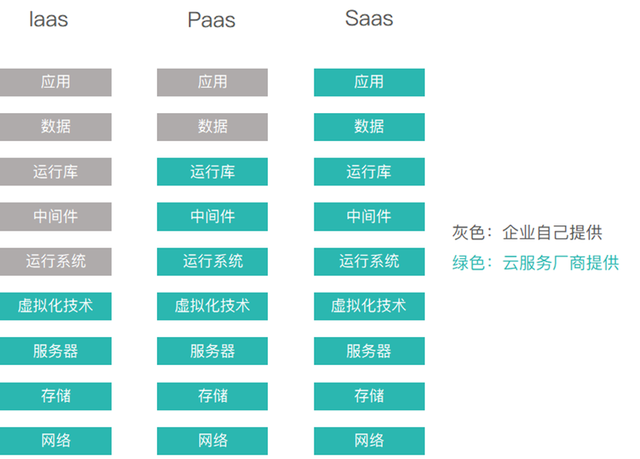

如何理解：

- 去云厂商买了服务器，自己安装数据库、Tomcat、部署Shop应用。此时**云厂商**是作为 **IaaS**； 例如云服务器
- 去云厂商买了集成环境（服务器、MySQL、Tomcat、Java...），自己部署Shop应用。此时云厂商作为 **PaaS**； 例如阿里云ACK平台
- 去云厂商直接买了**电商平台**，只需要上架自己商品就可售卖，此时云厂商作为 **SaaS**；例如保利威、飞书**、钉钉**等

## 2. 云设施

### 1. 概览

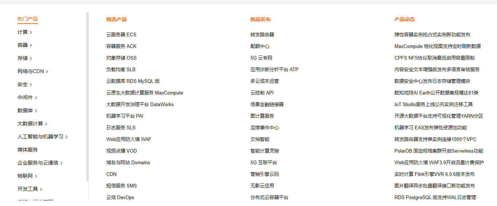


计算、存储、网络、安全；是计算机领域的四大核心。每家云厂商都提供了现成的核心资源，让我们能秒级开通和使用，像用水电一样方便。云未来将会成为水电一样的基础设施


### 2. 核心组件

以下是常用的**云设施**。需要我们熟练掌握

- ECS
- 块存储
- 云盘
- 数据备份
- 镜像
- 安全组
- 网络、VPC
- NAT网关
- 可用区
- 计费方式
- 公有云
- 私有云
- ...

接下来我们开始实战学习这些云设施；每个资源都使用**按量付费**的方式，**用完需要自行销毁**，避免大量扣费。


# 云设施实战

## 1. ECS

### 1. 简介

> **云服务器ECS**（Elastic Compute Service）是阿里云提供的性能卓越、稳定可靠、弹性扩展的IaaS（Infrastructure as a Service）级别云计算服务。云服务器ECS免去了采购IT硬件的前期准备，让我们像使用水、电、天然气等公共资源一样便捷、高效地使用服务器，实现计算资源的即开即用和弹性伸缩。简而言之，**云服务器**就是把**固定配置**的服务器**升级**为**随时**可以**调整配置的云端服务器**。

https://www.aliyun.com/product/ecs


### 2. 组件

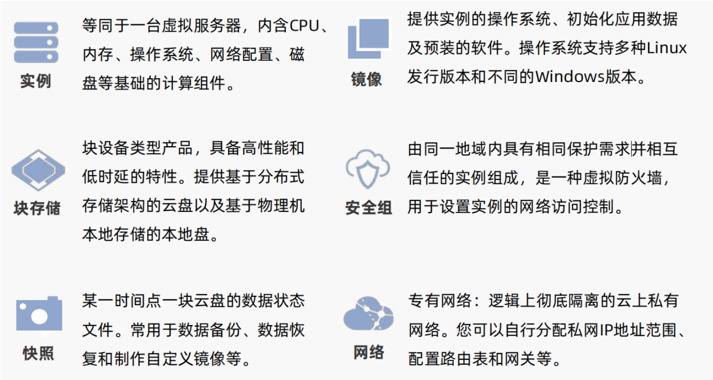


### 3. 概念

容灾级别：

- 机器级：
- 机房级：（跨可用区容灾）
- 地域级：（某个城市的所有可用区全不可用）
- 行星级：
- ...

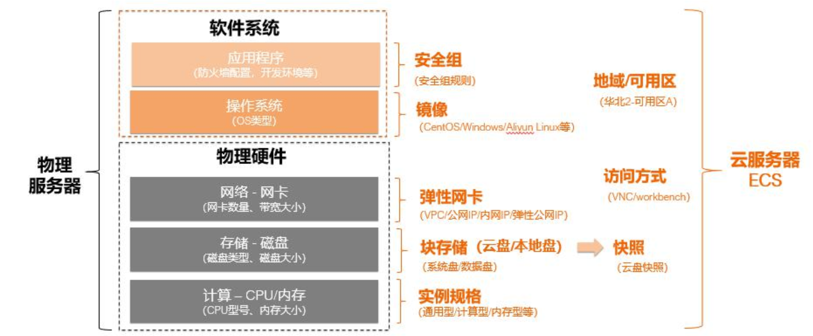

> 通俗解释：
>
> - 实例：一台云服务器
> - 块存储：云上的硬盘
> - 快照：系统、硬盘数据的备份
> - 弹性网卡：云上服务器的网卡
> - [VPC](https://help.aliyun.com/product/27706.html)：专有网络VPC（Virtual Private Cloud）；组建**局域网**。需要用到交换机、内网IP
> - **内网IP**：也叫私有IP，如果用VPC进行组网，每一个ecs都有自己的内网IP，在同一个VPC内这些IP可以互相访问
> - **公网IP**：暴露给外界用的IP，可以在世界各地进行访问
> - 安全组：Linux的防火墙规则
> - 访问方式：如何登录进ecs进行操作。可以通过web控制台，也可以使用一些终端连接。
> - **地域**：物理区，比如北京、上海、杭州。就是某个城市的机房。**不同地域不能互通**
> - **可用区**：某个城市不只会有一个机房。众多机房合起来可以划分很多可用区。**同一地域不同可用区可以互通**


### 4. 图解

- **地域**：物理的数据中心。选择靠近客户的地域，可降低网络时延。**不同地域的ECS之间内网隔离**。**资源创建成功后不能更换地域**。
- **可用区**：在**同一地域内**，**电力和网络互相独立**的物理区域。可用区主要**用于故障隔离**。**同一地域**不同可用区的ECS之间**内网互通**。

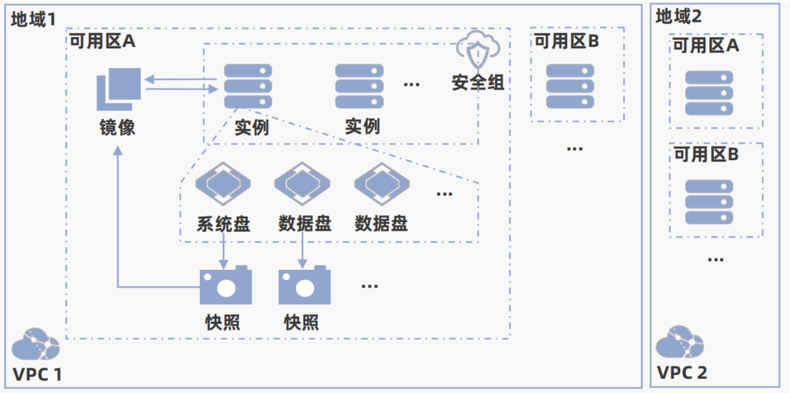


理解：

- 假设阿里云有**10万台服务器**，每个服务器都是一个**实例**
- 每个服务器开放哪些端口，需要通过**安全组**进行控制，这就是防火墙
- 每个实例的操作系统在**系统盘**安装着。系统盘是云上的一块硬盘，这个硬盘我们也叫做 **块存储**
- 每个实例的数据可以单独放在**数据盘**。
- 所有数据最好进行定期备份，这个机制我们成为**快照**。备份的数据，我们被封装为**镜像**，保存到阿里云专门的一些硬盘中；
- 10万台服务器不可能放在一个城市，所以阿里云会在上海、北京、杭州等各个地方建立机房。每个城市都称为一个**地域**；
- 就算在一个地域，比如**北京**，有3000台服务器，这些服务器可能不在同一个机房，或者同一个大楼里面。假设A、B、C三栋大楼都有机房。那么A栋楼可以称为一个**可用区A**，B栋称为**可用区B**，同一个可用区内的机器是可以互相访问的，同一个地域不同可用区的也是可以互相访问的。同一个地域的所有实例，可以通过**VPC自定义组网**策略。
- 不同地域之间默认不能互通，如果需要互通要开通**专线**。
- 可用区、地域都是为了物理隔离。比如A栋楼停电了，可以不影响B栋楼。A城市停电了，可以不影响B城市。**容灾机制**就是基于这种隔离实现的


### 5. 规格

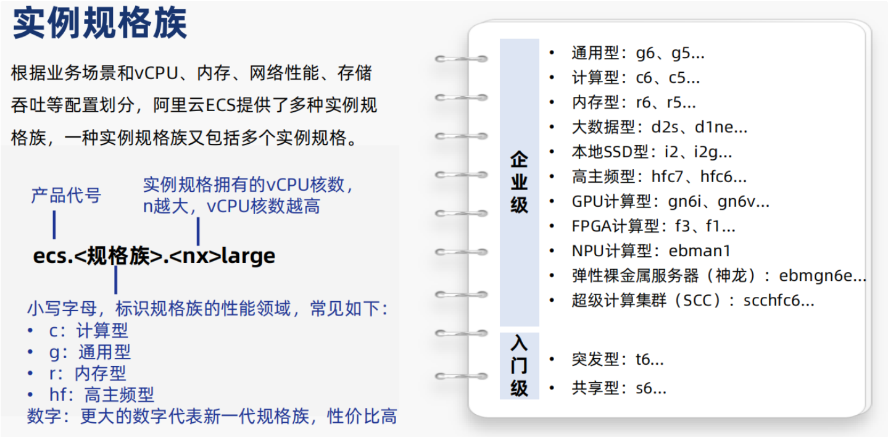


### 6. 场景

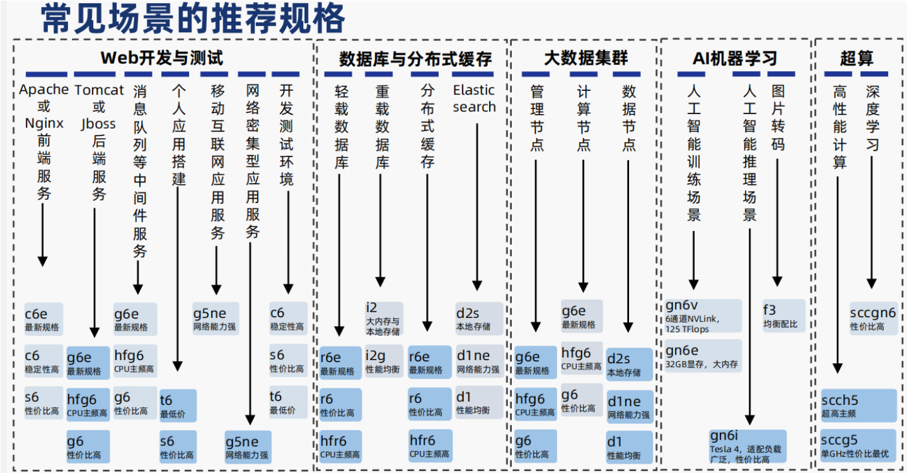


### 7. 实战

#### 1. 开通服务器

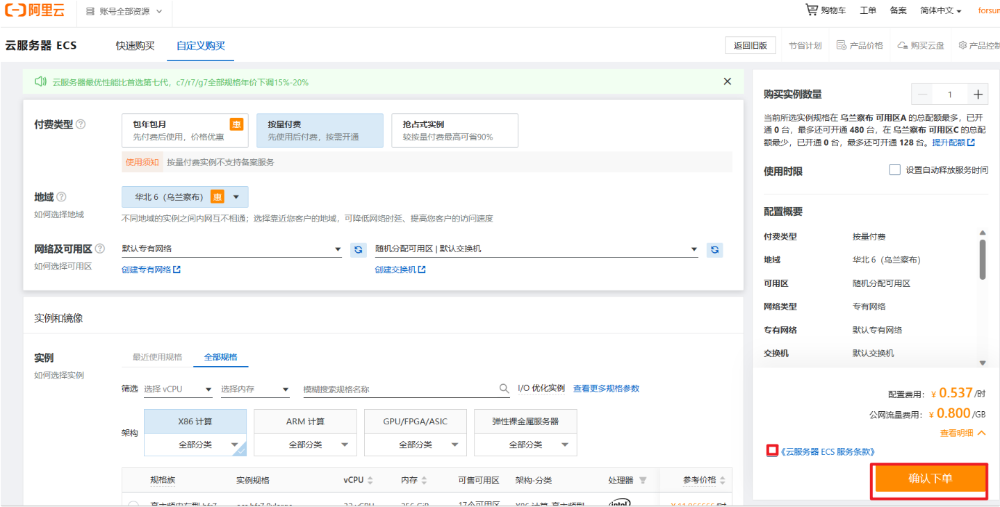

要有公网IP、操作系统选好、设置账号密码


#### 2. 连接服务器

推荐使用 [WindTerm](https://github.com/kingToolbox/WindTerm/releases/download/2.6-prerelease/WindTerm_2.6.0_Prerelease_2_Windows_Portable_x86_64.zip) 软件。进行连接。

端口：0~65535


## 2. VPC

### 1. 简介

专有网络VPC（Virtual Private Cloud）：https://www.aliyun.com/product/vpc

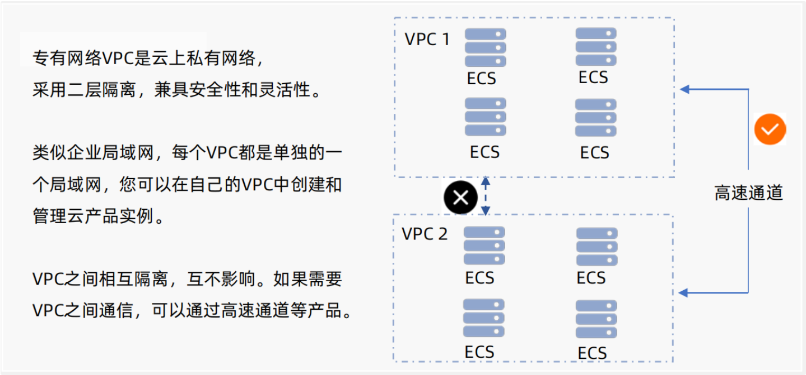


### 2. 网络划分

> **专有网络**是您独有的云上虚拟网络，您可以将云资源部署在您自定义的专有网络中。
>
> - 云资源不可以直接部署在专有网络中，必须属于专有网络内的一个交换机（子网）内。
> - **交换机**（vSwitch）是组成专有网络的基础网络设备，用来连接不同的云资源实例
> - 专有网络是地域级别的资源，**专有网络不可以跨地域**，但包含所属地域的所有可用区
> - 可以在每个可用区内创建一个或多个交换机来划分子网。

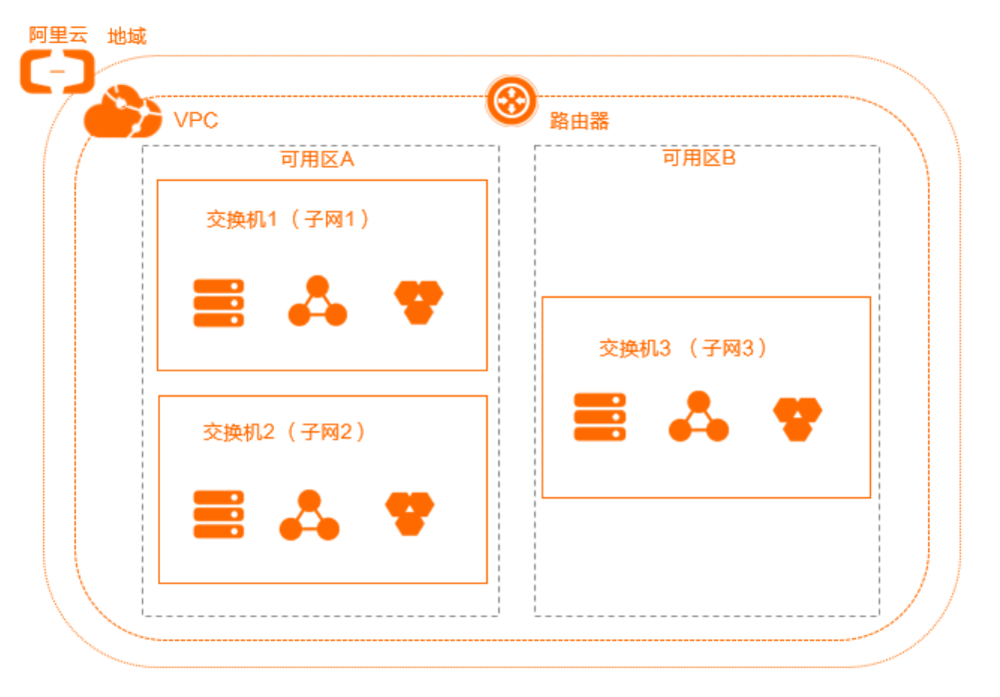

192.168.0.0/16  CIDR表示法，表示一个网络范围。

[ip地址在线计算器 (520101.com)](https://tool.520101.com/wangluo/ipjisuan/)

132.26.0.0/14  网络范围有多大


### 3. 组成部分

每个专有网络都由至少一个私网网段、一个路由器和至少一个交换机组成。

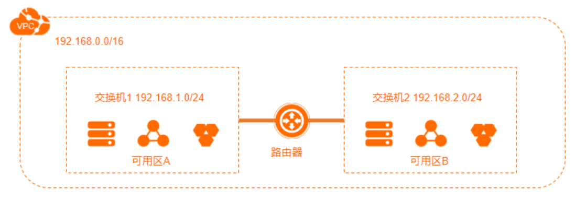

#### 1. 私网网段

在创建专有网络和交换机时，您需要以CIDR地址块的形式指定专有网络使用的私网网段。

您可以使用下表中标准的私网网段及其子网作为VPC的私网网段，也可以使用自定义地址段作为VPC的私网网段。更多信息，请参见[网络规划](https://help.aliyun.com/document_detail/54095.htm#concept-dvk-lj5-sdb)。

| 网段           | 说明                                                         |
| -------------- | ------------------------------------------------------------ |
| 192.168.0.0/16 | 可用私网IP数量（不包括系统保留地址）：65,532                 |
| 172.16.0.0/12  | 可用私网IP数量（不包括系统保留地址）：1,048,572              |
| 10.0.0.0/8     | 可用私网IP数量（不包括系统保留地址）：16,777,212             |
| 自定义地址段   | 除100.64.0.0/10、224.0.0.0/4、127.0.0.0/8、169.254.0.0/16及其子网外的自定义地址段。 |


#### 2. 路由器

> 系统自动创建，我们无需干预

路由器（vRouter）是专有网络的枢纽。作为专有网络中重要的功能组件，它可以连接专有网络内的各个交换机，同时也是连接专有网络和其他网络的网关设备。每个专有网络创建成功后，系统会**自动创建一个路由器**。每个路由器至少关联一张路由表。

更多信息，请参见[路由表概述](https://help.aliyun.com/document_detail/203494.htm#concept-qbk-bvn-4gb)。


#### 3. 交换机

> 将VPC一个大的网段，划分成几个不同的小网段，这些小网段可以跨可用区互通，从而实现跨可用区的容灾机制

交换机（vSwitch）是组成专有网络的基础网络设备，用来连接不同的云资源。创建专有网络后，您可以通过创建**交换机为专有网络划分一个或多个子网**。**同一专有网络内的不同交换机之间内网互通**。您可以**将应用部署在不同可用区的交换机内，提高应用的可用性**。

更多信息，请参见[创建和管理交换机](https://help.aliyun.com/document_detail/65387.htm#task-1012575)。


### 4. 实战

#### 1. 创建VPC

> 创建**VPC**并规划**交换机网段**

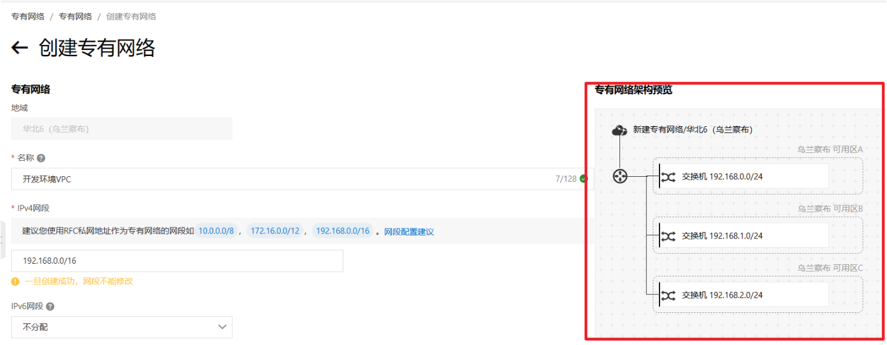


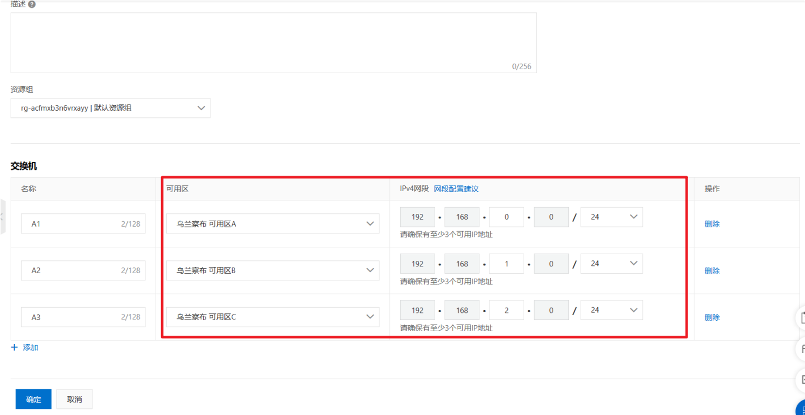


#### 2. 创建ECS

> 创建三台ECS，分别使用指定的VPC和交换机。用ping命令，测试三台机器的集群内联通性


结论：跨VPC的机器不互通，同一个VPC下的机器即使跨可用区（跨交换机）也互通。

VPC做环境隔离；

- 生产环境：创建生产VPC（177.16.xx.xx/16）
- 测试环境：创建测试VPC（188.11.xxx.xx/16）
- 物理网络层隔离，不怕删库


> 被ping命令通过IP地址访问的主机需要在安全组中开通ICMP(IPv4)协议的访问权限，才可以访问


## 3. 安全组

### 1. 简介

安全组是实例维度的虚拟防火墙，用于保护ECS实例的网络安全。

- 安全组就像一栋房子的门禁系统，ECS实例在房子中。房子内的ECS实例默认是内网互通的，但有来访者或者内部人员外出，都需要通过检查。
- 如果来访者不符合访问规则，则阻止进入；如果来访者符合访问规则，则可以进入。 同理，内部人员不符合外出规则，则阻止外出；如果内部人员符合外出规则，则可以外出

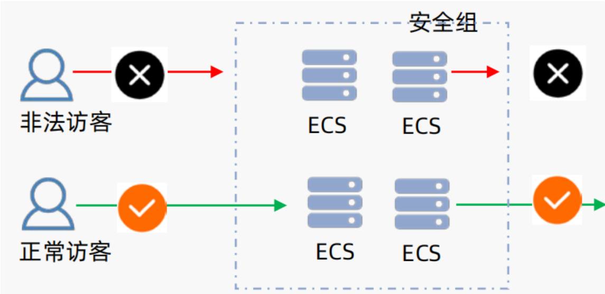


### 2. 实战

> 配置安全组规则，测试访问性
>
> 每个ECS都会绑定一个安全组。可以在左侧菜单，或者ECS服务器的操作中找到安全组的配置。

#### 1. 配置安全组

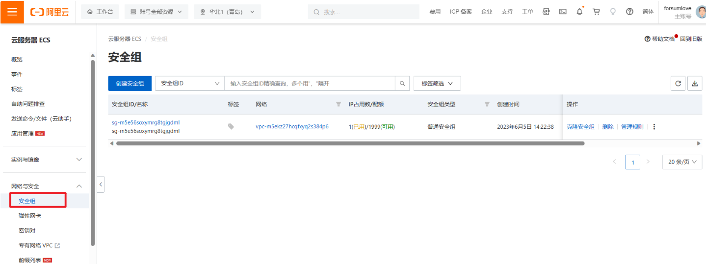


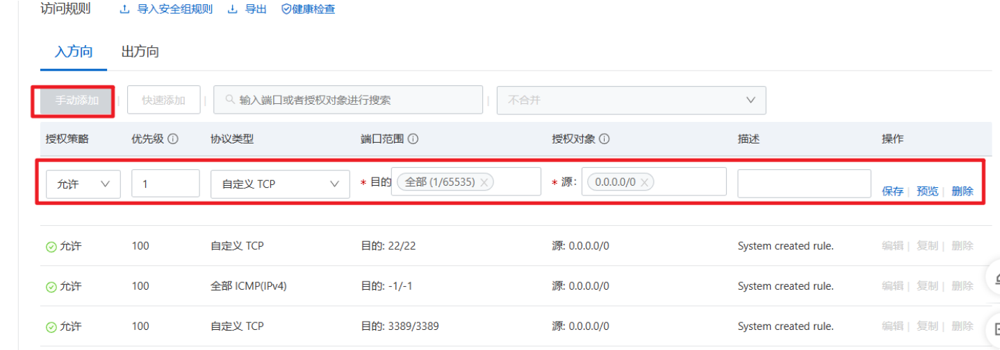


#### 2. 安装Nginx

```sh
#安装Nginx
yum install nginx

#启动nginx
systemctl start nginx

#查看Nginx位置
whereis nginx
# 修改 /etc/nginx/nginx.conf 端口为8080
port 8080

# 重启nginx
nginx -s reload

```


## 4. 云盘

### 1. 简介

> - 云盘采用多副本的**分布式机制**，具有**低时延**、高性能、持久性、高可靠等性能，可以为云服务器提供安 全可靠，性能优越的块存储服务。
>
> - 根据存储的数据类型和云盘的创建方式，**云盘**可以作为**系统盘**和**数据盘**使用。


### 2. 图解

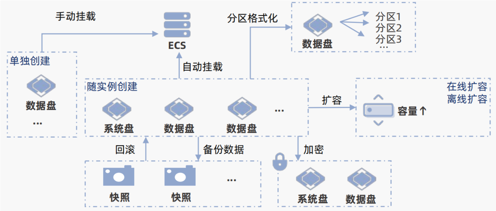


### 3. 块存储


### 4. 存储类型

IOPS： IO Per Second  1000/s

1500  /s  * 512byte;  5mb/s ~ 512mb/s

块存储：EBS； 高性能，本地存储

对象**存储**: OSS； 海量，随时存储

文件**存储**：NAS； 共享性质，实时备份，联机

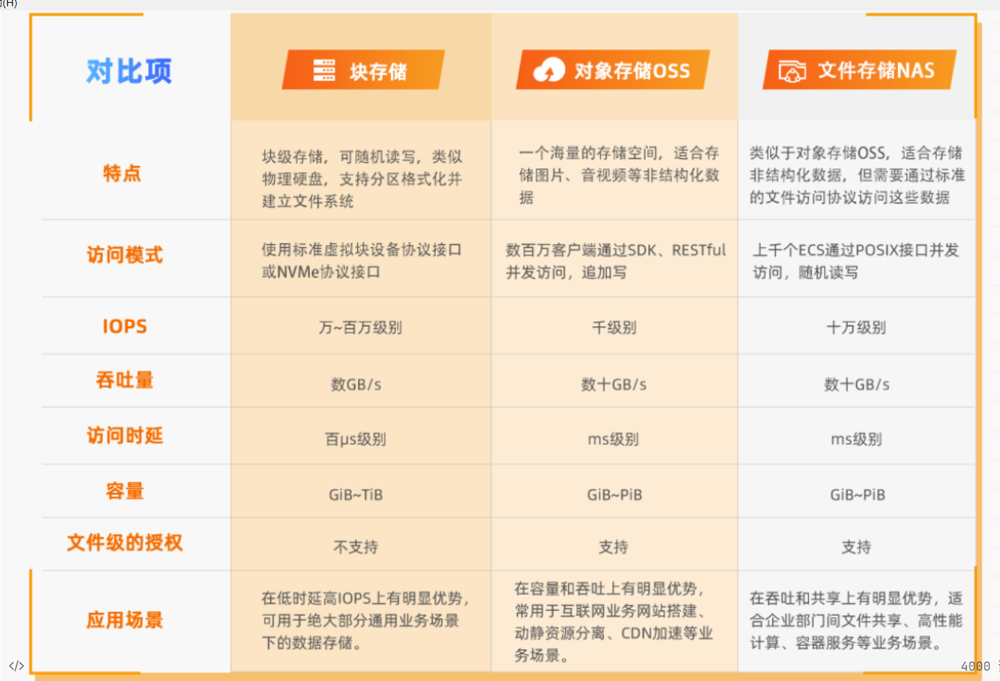


### 5. 实战

#### 1. 创建云盘

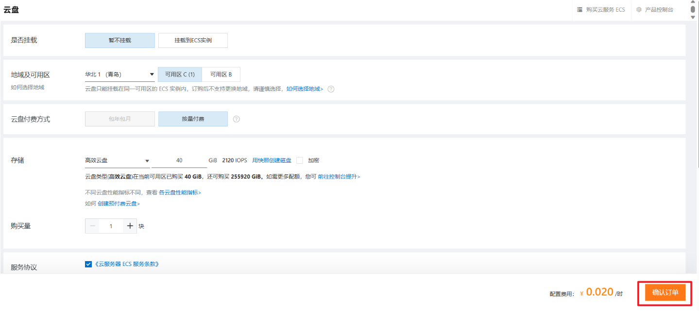


#### 2. 查看状态


#### 3. 挂载云盘

##### 1. 选择挂载


##### 2. 选择实例

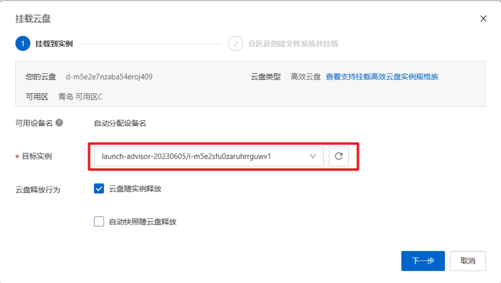


##### 3. 指定挂载点

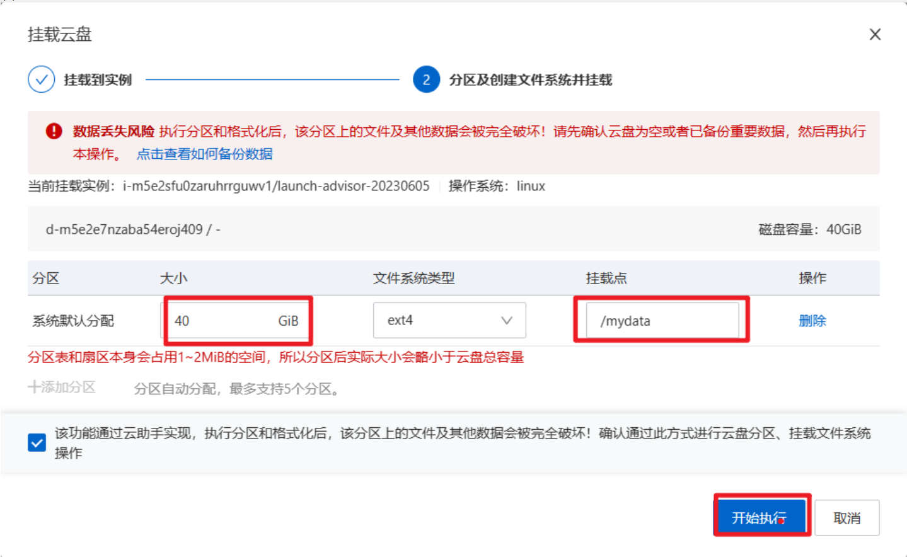


##### 4. 挂载完成


##### 5. 登录验证

登录到云服务器使用 `df -h` 命令验证磁盘空间。看到 `/mydata` 有 `40G` 即可

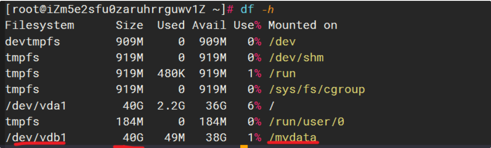


#### 4. 卸载云盘

##### 1. 查看磁盘信息

`df -h`: 确定挂载点为 `/dev/vdb1`

vdb1含义说明：

- v表示virtual，虚拟
- d表示disk，磁盘
- b表示第二块磁盘
- 1表示磁盘中的第一个分区
- /dev/vdb1是代表磁盘分区这个设备的文件

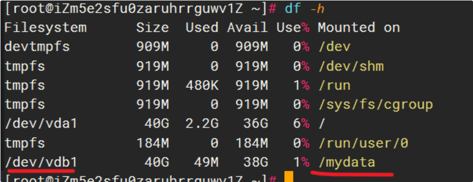


##### 2. 卸载命令

```sh
umount /dev/vdb1
```


##### 3. 删除残留数据

`blkid`： 查看磁盘分区信息

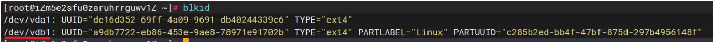


删除`/etc/fstab`中数据盘分区文件系统的自动挂载信息

- `vim /etc/fstab`
- 如果有残留的  `/dev/vdb1` 信息，注释或者删除即可


##### 4. 卸载云盘

去阿里云管理控制台卸载磁盘


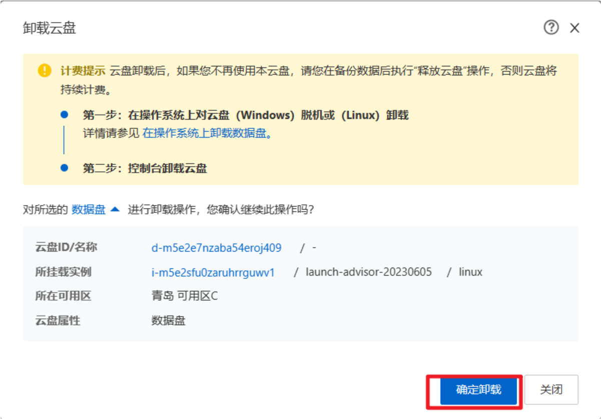


#### 5. 删除云盘

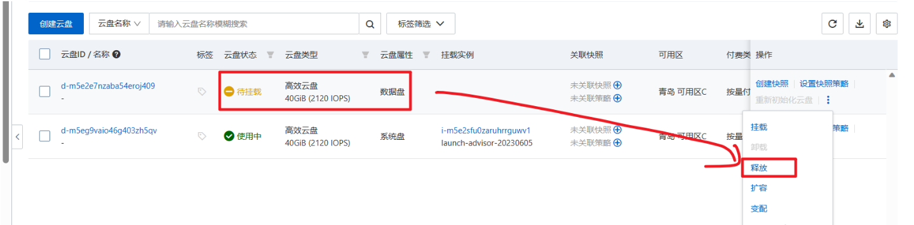


## 5. 备份与镜像

### 1. 备份


### 2. 镜像

镜像提供了创建ECS实例所需的信息，包括实例的操作系统、初始化应用数据及预装的软件。**镜像文件相当于副本文件，包含了一块或多块云盘中的所有数据。**


### 3. 实战

> 前置：开通一个服务器，安装好nginx，修改index.html页面为自定义内容

#### 1. 创建镜像

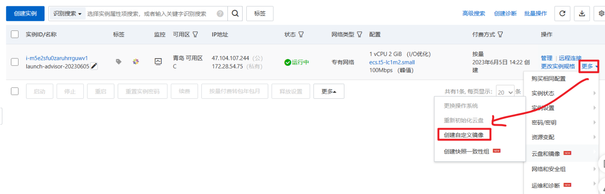


#### 2. 根据镜像恢复ECS

创建ECS时，可以选择**自定义镜像**。

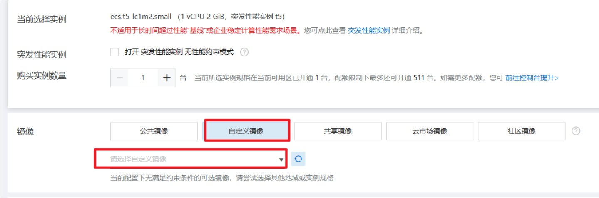


## 6. SLB

### 1. 简介

[负载均衡 (aliyun.com)](https://help.aliyun.com/product/27537.html)

阿里云**负载均衡**（Server Load Balancer，简称SLB）是云原生时代应用高可用的基本要素。通过将流量分发到不同的后端服务来扩展应用系统的服务吞吐能力，消除单点故障并提升应用系统的可用性。 **阿里云SLB**包含面向4层的网络型负载均衡NLB、面向7层的应用型负载均衡ALB和传统型负载均衡CLB，是阿里云官方云原生网关。


### 2. 家族


阿里云

负载均衡SLB

支持以下类型的负载均衡：

- **应用型负载均衡ALB**（Application Load Balancer）：专门面向七层，提供超强的业务处理性能，例如HTTPS卸载能力。单实例每秒查询数QPS（Query Per Second）可达100万次。同时ALB提供基于内容的高级路由特性，例如基于HTTP报头、Cookie和查询字符串进行转发、重定向和重写等，是阿里云官方云原生Ingress网关。更多信息，请参见[什么是应用型负载均衡ALB](https://help.aliyun.com/document_detail/197202.htm#concept-2011635)。
- **网络型负载均衡NLB**（Network Load Balancer）：面向万物互联时代推出的新一代四层负载均衡，支持超高性能和自动弹性能力，单实例可以达到1亿并发连接，帮您轻松应对高并发业务。NLB面向海量终端连接、高并发消息服务、音视频传输等业务场景针对性地推出了TCPSSL卸载、新建连接限速、全端口监听等高级特性，在物联网MQTTS加密卸载等场景为用户提供多种辅助手段，是适合IoT业务的新一代负载均衡。更多信息，请参见[什么是网络型负载均衡NLB](https://help.aliyun.com/document_detail/439121.htm#concept-2223473)。
- **传统型负载均衡CLB**（Classic Load Balancer）：支持TCP、UDP、HTTP和HTTPS协议，具备良好的四层处理能力，以及基础的七层处理能力。更多信息，请参见[什么是传统型负载均衡CLB](https://help.aliyun.com/document_detail/27539.htm#concept-whs-lp4-tdb)。


### 3. 对比

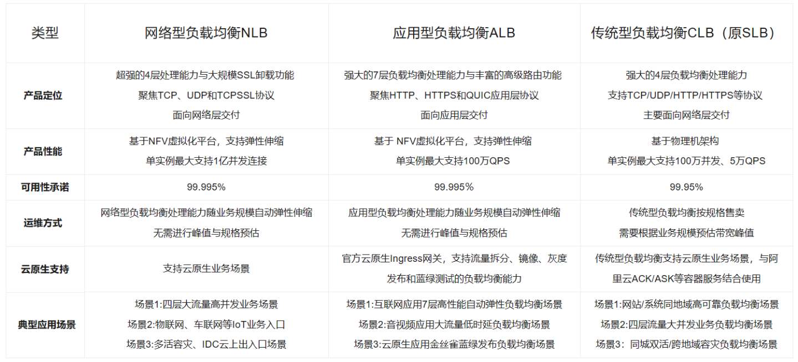


### 4. 实战

> 前置：开通3台ECS，安装Nginx，各自配置不同首页页面，测试可以被访问

#### 1. 创建CLB

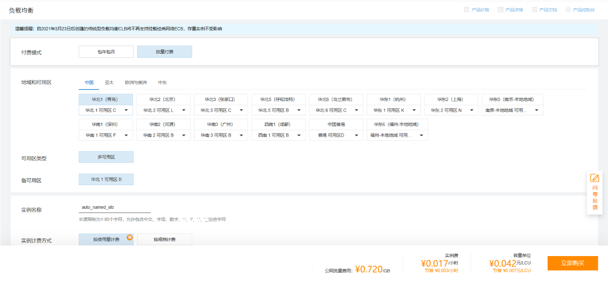


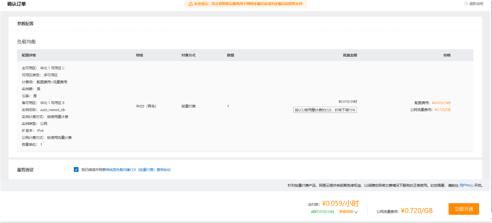


#### 2. 配置CLB


#### 3. 选择协议

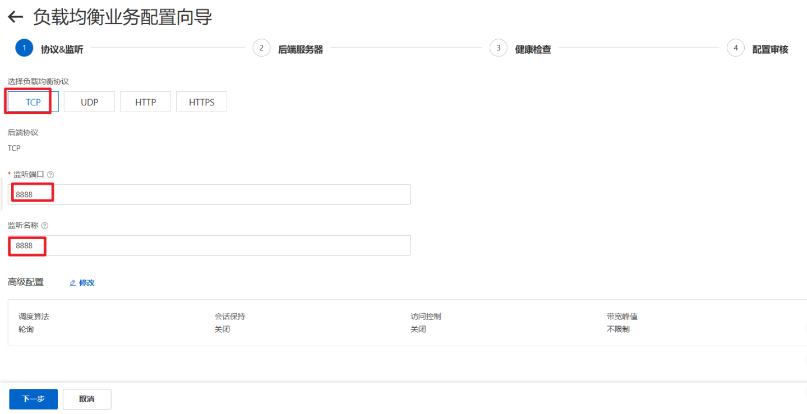


#### 4. 添加后台服务器

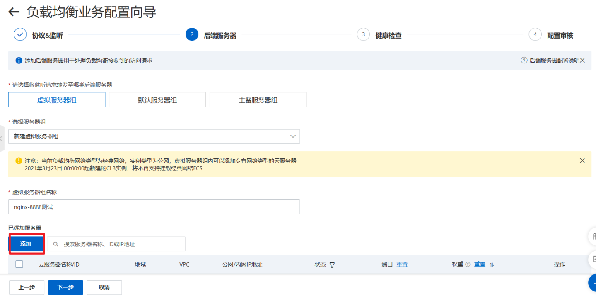


#### 5. 原理

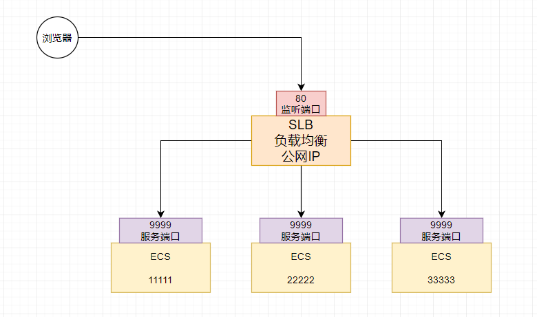

## 7. NAT

### 1. 简介

**NAT网关（NAT Gateway）**可以提供网络地址转换服务。阿里云提供公网NAT网关和VPC NAT网关两款产品。

- 公网NAT网关提供公网地址转换服务
- VPC NAT网关提供私网地址转换服务

可以根据业务需求灵活选择。


### 2. 场景

公网NAT网关的网络拓扑如下图所示。您可以选用公网NAT网关，满足您以下业务场景需求：

- 如果您的云上网络只希望主动访问公网上的业务，而不希望云上的业务直接暴露在公网上从而有被攻击的风险，您可以选用公网NAT网关为业务提供安全防护能力。
- 如果您的业务具有突增的访问公网的流量需求，您可以选用公网NAT网关为您提供灵活和弹性的扩容能力，并且只需要按使用量付费，节省企业成本。
- 如果您有大量访问公网的机器，您可以通过公网NAT网关统一公网出口，并通过公网NAT网关准确和精细化的运维监控能力管理企业访问公网的流量。

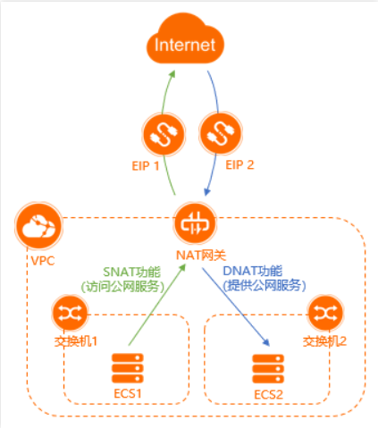


### 3. 实战

#### 1. 使用公网NAT网关SNAT功能访问互联网

##### 1. 场景

> 某公司在阿里云创建了专有网络VPC（Virtual Private Cloud）和交换机，交换机中创建了多个ECS实例。ECS实例均未分配固定公网IP，也未绑定弹性公网IP（Elastic IP Address，简称EIP）。因公司业务发展，每台ECS实例都需要访问互联网。
>
> 解决：
>
> - 可以通过公网NAT网关的SNAT功能，配置SNAT条目，使得VPC内无公网IP的ECS实例可以通过公网NAT网关绑定的EIP访问互联网。


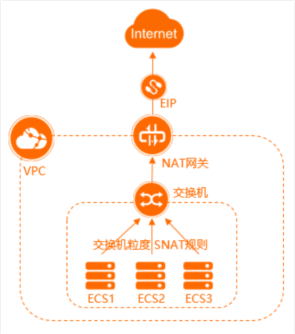


##### 2. 配置

> 注意：VPC中不存在目标网段为0.0.0.0/0的自定义路由。如果存在，请删除该路由条目。

步骤：


前置：

- 准备vpc，在vpc下绑定两台ecs，没有公网ip


- 验证不可访问公网ip

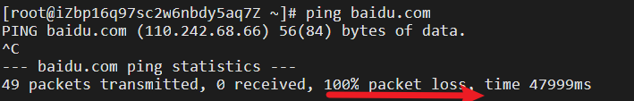

##### 3. 步骤一： 创建公网NAT网关

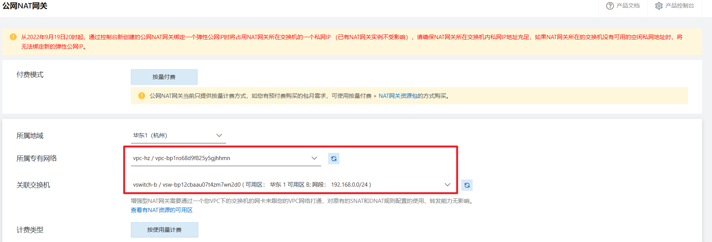

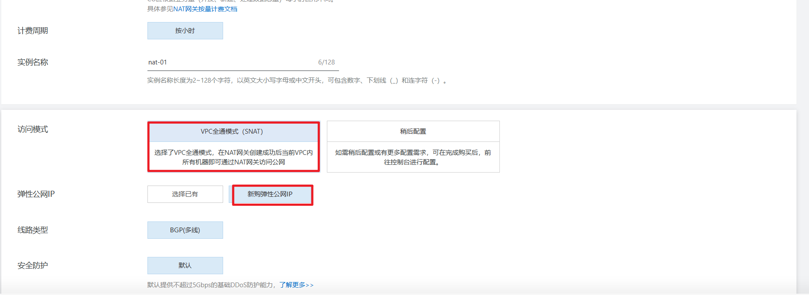

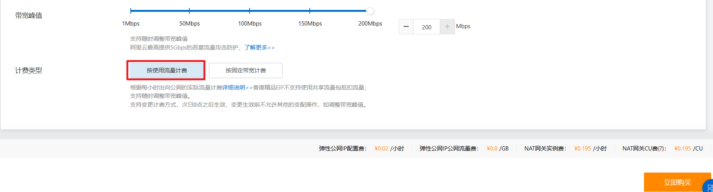

确认订单数据：

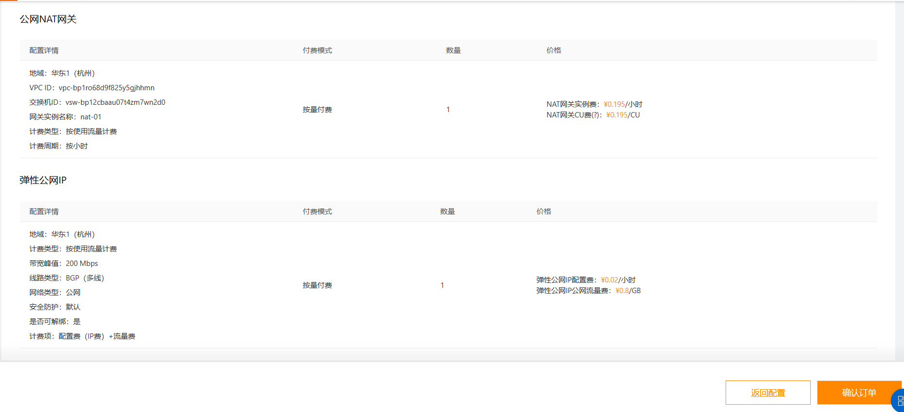

等待创建

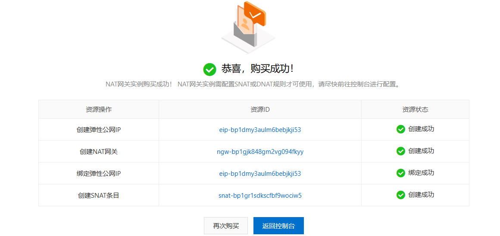


确认公网IP地址：

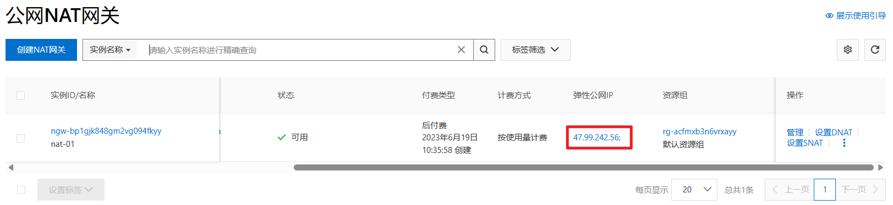


##### 4. 步骤二： 创建SNAT条目

1. 在**公网NAT网关**页面，找到目标公网NAT网关实例，然后在**操作**列单击**设置SNAT**。
2. 在**SNAT管理**页签，单击**创建SNAT条目**。
3. 在**创建SNAT条目**页面，配置参数，然后单击**确定创建**。

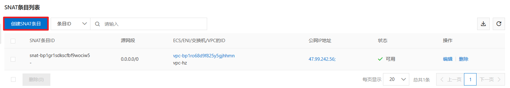

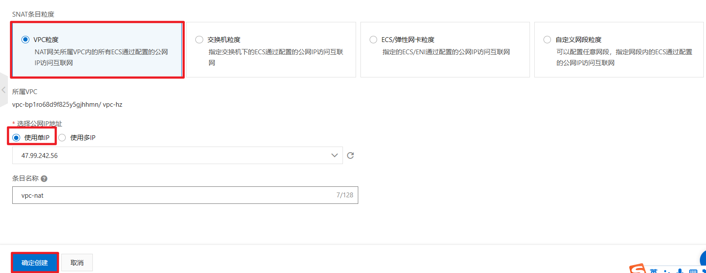


结果：

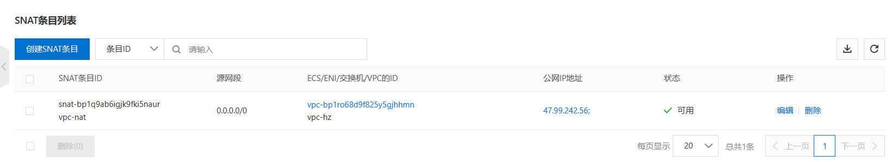


##### 5. 步骤三： 测试联通性

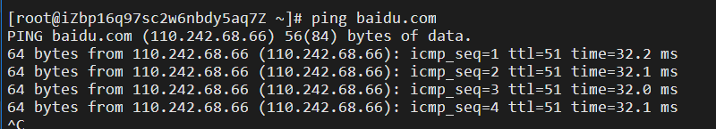


> 公网NAT:
>
> - SNAT只是保证同一个vpc下的ecs可以访问公网，并不是保证从公网可以访问ecs
> - DNAT可以让公网访问某个ecs


#### 2. 使用公网NAT网关DNAT功能实现ECS对外提供服务

##### 1. 场景

某公司在阿里云创建了ECS实例，并在ECS实例上部署了应用服务，但未给ECS实例分配固定公网IP，也未绑定弹性公网IP（Elastic IP Address，简称EIP）。因公司业务发展，公司计划通过公网NAT网关DNAT功能的IP映射或者端口映射方式，实现ECS实例面向互联网提供服务。

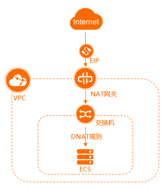

##### 2. 配置


##### 3. 步骤：在原有的NAT上直接配置DNAT

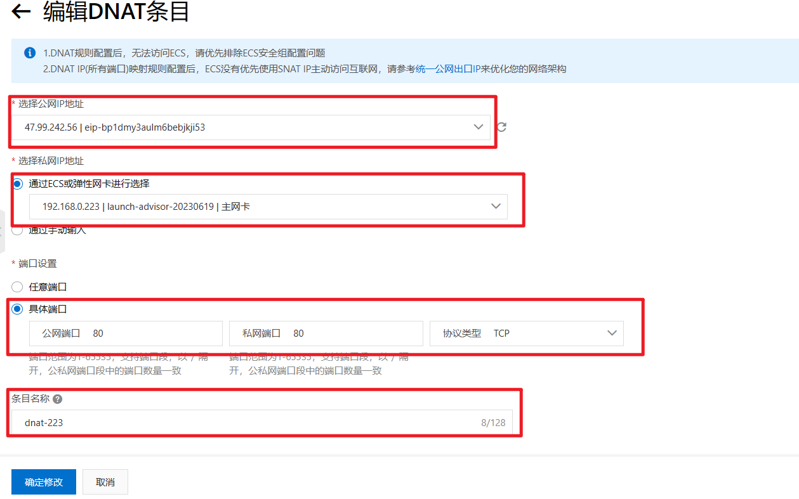

- 给223机器安装nginx，验证可以通过公网ip访问到这个机器的nginx


#### 3. 原理

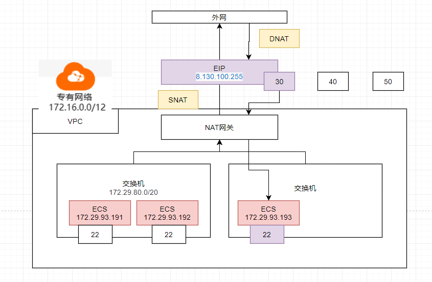

## 8. 销毁资源

所有实验完成都记得销毁资源。


## 9. 实验作业

SLB、EIP、NAT、ECS、EBS、VPC、安全组

- 起三台服务器
- 自己写一个SpringBoot应用，数据库查询数据，以json返回给浏览器
- 部署到三台服务器集群，
- 并进行负载均衡部署，测试访问性
- 写一段Java代码，for 发送10万次，看几秒发送完成，并收到结果，测试性能

```sh
# CountDownLatch
//统计开始时间
CountDownLatch latch = new CountDownLatch(100000);
for(int i=0;i<100000;i++){
    new Thread(()->{
        //发请求
        latch.countDown(); //统计-1
    }).start()
}
latch.await(); //等待
//统计结束时间

//计算时间间隔，算出10万请求多少秒内完成，QPS:每秒查询数。
//统计所有线程多久运行完
```


