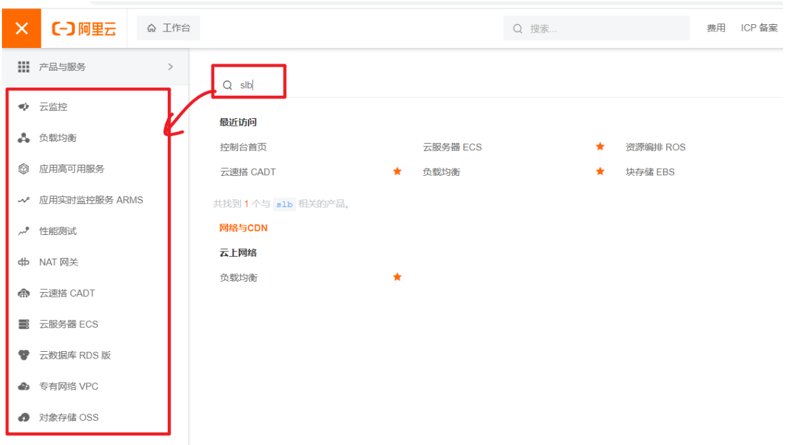

# 云上演练场

## 1. 演练内容

| 演练课题                               | 演练目标                       |
| -------------------------------------- | ------------------------------ |
| 单机网站架构云化                       | 掌握单体应用上云方案           |
| 云上高并发Web架构                      | 掌握高并发云上落地方案         |
| 同城跨可用区容灾恢复                   | 掌握容灾思想与实现             |
| 数据库异地灾备                         | 掌握异地灾备方案               |
| 微服务应用问题定位及故障演练（云原生） | 掌握云上日志分析与在线调试技术 |
| 生产可观测平台（云原生）               | 掌握云上指标观测与分析技术     |


## 2. 关联组件

| 组件 | 作用                   |
| ---- | ---------------------- |
| ECS  | 云服务器               |
| SLB  | 负载均衡器             |
| EIP  | 弹性公网IP             |
| VPC  | 专有网络               |
| RDS  | 云上MySQL数据库        |
| ESS  | 弹性伸缩服务           |
| NAS  | 云盘                   |
| NAT  | 网关                   |
| OSS  | 对象存储               |
| CDN  | 内容分发网络           |
| PTS  | 性能测试               |
| CMS  | 云监控服务             |
| ARMS | 应用实时监控           |
| AHAS | 应用可靠用             |
| DBS  | 数据库备份服务（冷备） |
| DTS  | 数据传输服务（热备）   |
| DMS  | 数据库管理服务         |
| ACK  | 阿里云K8S集群          |
| SLS  | 日志服务               |
|      |                        |


# 演练1： 单机网站架构云化

## 1. 环境准备

> 参照：《附录：中间件与环境安装文档》，创建ECS并安装WordPress环境，并为此ECS创建备份镜像，以备后续使用。

## 2. 架构云化

### 1. 云上架构


流程：

- 浏览器访问EIP（公网IP）
- EIP绑定到了SLB（负载均衡器）上
- SLB负载均衡了两台ECS，流量会被负载均衡给ECS
- 两台ECS都访问开通的Redis和RDS云服务

### 2. 创建流程

1. 创建ECS、配置安全组
2. 创建RDS、Redis
3. ECS部署应用，配置访问RDS、Redis
4. 创建SLB
5. 创建EIP绑定到SLB
6. 测试访问

### 3. 操作流程

> 自底向上进行资源创建

#### 1. 创建Redis

##### 1. 开通


##### 2. 规格选择


##### 3. 开通结果


##### 4. 配置白名单


##### 5. 获取连接地址


##### 6. 连接测试


#### 2. 创建RDS

##### 1. 开通


##### 2. 规格选择


##### 3. 实例配置


确认实例


##### 4. 开通结果


##### 5. 获取连接地址


##### 6. 管理数据库

###### 1. 分配账号


###### 2. 创建数据库


###### 3. 登录管理


###### 4. 使用之前设置的账号密码


###### 5. DMS界面


#### 3. 创建ECS x 2

##### 1. 选择规格


##### 2. 系统配置


##### 3. 创建结果


##### 4. 修改word_press配置

> 记录之前RDS的数据库账号密码和地址

```sh
cd /var/www/html/
vim wp-config.php
#内容如下
```


```sh
#重启
systemctl restart httpd
```

##### 5. 绑定EIP

> 此处绑定EIP是为了初始化WordPress程序，完成后就可以删除EIP


##### 6. 解绑EIP

> 只要Word_Press初始化完成以后，可以把EIP换绑到另一个ECS，访问发现网站也是好的

可以删除我们刚刚创建的EIP，节省资源；

#### 4. 创建SLB

##### 1. 创建实例


##### 2. 选择规格


##### 3. 确认结果


##### 4. 配置负载均衡

###### 1. 开始配置


###### 2. 监听端口


###### 3. 选择服务器组


###### 4. 配置后端服务器


###### 5. 指定服务器端口


###### 6. 确认配置


###### 7. 完成


###### 8. 测试访问

访问负载均衡地址：http://47.110.68.48/

出现页面


###### 9. 验证可用性

停止某个ECS


访问负载均衡地址http://47.110.68.48/，网站依然可用


###### 10. 动态感知

点击服务器组


详情如下：


SLB已经感知到一台服务器停止，请求流量自然就不会发给这个服务器

## 3. 弹性伸缩

> 弹性伸缩（Elastic Scaling Service，简称ESS），也称为Auto Scaling，是指根据业务需求和策略自动调整计算能力（即实例数量）的服务。您可以指定实例的类型，即ECS实例或ECI实例。弹性伸缩不仅适合业务量不断波动的应用程序，同时也适合业务量稳定的应用程序。

原理图如下：


### 1. 创建镜像

> 之前我们配置好了word_press应用的数据库地址，要基于这个配置。我们创建出ECS的镜像。如果请求流量过大，可以要求阿里云基于此镜像继续创建出ECS实例

### 2. 配置ESS

#### 1. 创建伸缩组


#### 2. 创建启动模板


#### 3. 确认启动模板


#### 4. 配置伸缩组


#### 5. 创建伸缩规则

> 创建两条伸缩规则


#### 6. 创建报警任务

报警任务通过监控特定的监控指标，对数据指标进行实时的统计，当统计值满足您指定的报警条件时，触发报警并执行您指定的伸缩规则。本示例中，您可以针对需求二和需求三分别设置报警任务，具体如下：

- 需求二：设置报警任务EventTriggeredScalingOut，在伸缩组内CPU使用率不小于70%时，自动执行伸缩规则Add1，增加1台ECS实例。
- 需求三：设置报警任务EventTriggeredScalingIn，在伸缩组内CPU使用率不大于20%时，自动执行伸缩规则Remove1，减少1台ECS实例。

###### 1. 扩容任务


###### 2. 缩容任务


#### 7. 创建定时任务

> 自己创建定时任务，可以固定时间进行扩缩容

最终实现以下效果：

弹性伸缩会按照您的配置，在以下场景自动扩缩容ECS实例：

- 伸缩组启用后，弹性伸缩自动增加2台ECS实例，满足需求一。
- 如果伸缩组内CPU使用率不小于70%时，增加1台ECS实例，满足需求二。
- 如果伸缩组内CPU使用率不大于20%时，减少1台ECS实例，满足需求三。
- 每天17:55新增1台ECS实例，满足需求四。
- 每天22:05减少一台ECS实例，满足需求五。


### 3. 伸缩验证

#### 1. 安装压测工具

> 登录 ECS，通过压测命令提高 ECS CPU 使用率。

```sh
yum install -y sysbench
sysbench cpu --cpu-max-prime=2000000 --threads=2 --time=1000 run
```

- cpu-max-prime 参数是 Sysbench CPU 测试中用于指定最大质数的参数。
- 这个参数指定了计算质数的范围，即程序将计算从 2 到指定的最大质数的所有质数。
- 在此例中，该参数设置为 2000000，意味着程序将计算从 2 到 2000000 之间的所有质数。

> 在可视化界面观察CPU使用率。

#### 2. 等待观察

等待一段时间，达到阈值就会自动扩容。低于阈值就会自动缩容


# 演练2： 云上高并发Web架构

## 1. 高并发理论

### 1. 特点

在互联网行业业务发展中，Web 应用具有间歇性高并发的特点，常见于电商，社交，文娱等行业之中。可以通过**负载均衡**，**动态、静态内容分离加速**，应用服务器、数据库**弹性伸缩**以及采用**高效缓存**等机制提高应用整体性能及缩短**响应时间**。

另外，借助**应用监控**、**应用防护**、**性能测试**等产品，可为互联网业务在上线前及营销活动间隙提前测试和评估业务系统的承载能力，发现**性能瓶颈**，提前优化资源配置；更可提供流量控制、应用模块降级、故障演练等能力，从而全面提升业务稳定性。

本次以部署 **Wordpress** 应用为例，介绍云上高并发 Web 架构模型以及云产品选择、资源部署、基础监控、应用实时监控、性能测试、应用防护的最佳实践。


### 2. 定义

**Web高并发**并没有一个绝对的定义，一般认为**Web高并发**就是在互联网业务中**某个时间点或者极短的时间内**Web应用**有大量的访问请求**的场景


### 3. 衡量指标

#### 1. RT

> **R**esponse **T**ime，响应时间

系统对请求做出响应的时间。响应时间越短，系统性能越高。

- 一般互联网应用的响应时间要求在**500ms**以内
- 对用户体验流畅度有高要求的，不高于**200ms**，甚至**100ms**以内
- 应用**系统内部之间的调用**要求更苛刻，一般**10ms**左右


#### 2. RPS

> Request Per Second，每秒请求数   rps = 500/s

#### 3. QPS

> Query Per Second，每秒查询数  rps = qps = 500/s

#### 4. TPS

> Transation Per Second，每秒**事务**数

QPS（TPS）= 并发请求数/平均响应时间

TPS一般用来衡量业务系统流程处理能力

QPS用来衡量接口查询处理能力

面试题：

- uv: 唯一用户访问。  100
- pv：页面浏览量： pv  > uv 
- 峰值在线用户数：100
- qps： 大于在线用户数的10倍
- 2-8原则： 
  - 网站80%时间比较闲，20%时间比较忙。所以一天的时间内，大约 **4.8**小时比较忙
  - 当天网站总处理了1亿个请求。80%的请求会在忙时处理。
  - 8000万 / 4.8 小时处理完 = 4700/s 
  - 顶峰能力： 8000万的80%请求，会在4.8小时的20%时间内处理完
  - 系统的峰值处理能力至少达到 18518/s 才能实现每天安全处理1亿请求。
  - 平时  2w/s 双11,11倍。

**常见量级**：

- 互联网小型网站：500~10000 TPS
- 互联网中型网站：1000 ~ 50000 TPS
- 互联网电子商务：10000 ~ 1000000 TPS


#### 5. 成功率

**成功率**越高，系统稳定性越好。要求一般不低于99.6%

高并发：快、**稳**

### 4. 本质

高并发的本质是构建服务的资源不足以支撑稳定的服务提供，出现了响应缓慢，甚至服务不可用，导致业务中断。因此应对高并发的策略简单来说就是“**开源节流**”。

**开源**：指通过服务端的优化和资源提升来提高每个请求的处理速度

**节流**：客户端能不访问服务端就不要访问


### 5. 应对


#### 1. 客户端

> **能不访问服务端就不要访问**，即使访问少量访问

尽量减少请求数量，降低数据传输量，比如：**客户端提供缓存**，**使用数据压缩传输**，**使用异步接口**、**按需获取数据等**。

#### 2. 服务端

> 提高单个请求的处理速度

- 提升基础设施性能
  - 更高计算能力的服务器
  - 更高性能的数据库、存储；
  - 更大服务端内存，缓存
  - 更大的网络带宽
  - 更高的网络质量
- 应用优化
  - 应用模块化、使用集群、分布式架构
  - 动态资源与静态资源分离，使用CDN加速
  - 使用更高效的编程语言
  - 优化业务流程、业务逻辑算法、访问数据库的SQL语句
- 数据库优化
  - 合理的表结构、索引
  - 使用数据库集群，读写分离
  - 合理配置数据库缓存
  - 高性能的SSD

**垂直优化**：单机性能优化到强劲。（CPU、内存、硬盘、缓存、软件参数...）

**水平优化**：集群化负载均衡。（集群、分片、复制、负载均衡...）


## 2. 高并发架构

### 1. 架构图


### 2. 流程

1、需要3个eip（弹性公网IP），因为eip是公网ip，全球能访问到的。

- 第一个eip，会绑定slb，因为网站域名最终解析到slb的公网ip，流量会通过slb转给ecs集群
- 第二个eip是某个ecs的公网ip，因为我们要连上ecs进行服务器环境安装。
- 第三个eip是nat网关的ip，因为阿里云的监控系统数据需要通过走公网汇报。所以必须有公网ip

2、需要2个ecs；模拟集群。ess保证ecs的弹性扩缩容

3、对象存储oss，负责把所有的静态资源都能进行加速访问。

4、静态资源数据其实是保存到nas的

5、PTS、CMS、ARMS、AHAS都是周边治理设施


### 3. 涉及产品

⚫ 负载均衡 SLB：提供负载均衡服务，用来做流量分发及应用服务器容错保护
⚫ 内容分发 CDN：内容分发网络，提供静态资源的加速访问
⚫ 专有网络 VPC：搭建各个组件的网络访问环境
⚫ 云服务器 ECS：阿里云服务器，用来运行业务应用程序
⚫ 弹性伸缩 Auto Scaling：提供自动化/半自动化ECS资源伸缩能力，
⚫ 对象存储 OSS：存储网站图片、小文件、js、css等静态数据
⚫ 文件服务 NAS：统一存储应用代码及客户上传原文件
⚫ 云数据库 PolarDB：阿里云自研数据库，为业务系统提供弹性、高性能的数据库服务
⚫ 云数据库 Redis：提供服务端缓存
⚫ 云监控 CloudMonitor：监控云服务
⚫ 应用实时监控 ARMS：应用性能管理服务，监测应用接口、访问数据库等的性能
⚫ 应用高可用 AHAS：为应用接口提供流控及流量防护
⚫ 性能测试 PTS：测试应用性能


### 4. 产品介绍

**专有网络 VPC**：是用户基于阿里云创建的自定义私有网络，不同的专有网络之间二层逻辑隔离，用户可以在自己创建的专有网络内创建和管理云产品实例，比如ECS、负载均衡、RDS等 。 https://www.aliyun.com/product/vpc


**云服务器 ECS**：是一种简单高效、处理能力可弹性伸缩的计算服务。ECS 帮助您构建更稳定、安全的应用，提升运维效率，降低 IT 成本，使您更专注于核心业务创新。  

https://www.aliyun.com/product/ecs


**弹性伸缩 Auto Scaling**：是根据用户的业务需求和策略，经济地自动调整弹性计算资源的管理服务，不仅适合业务量不断波动的应用程序， 同时也适合业务量稳定的应用程序。 https://www.aliyun.com/product/ecs/ess


**对象存储 OSS**：是一种海量、安全、低成本、高可靠的云存储服务，适合存放任意类型的文件。OSS 的容量和处理能力弹性扩展，多种存储类型供选择，全面优化存储成本。

https://www.aliyun.com/product/oss


**云文件存储 NAS**：是一个可共享访问，弹性扩展，高可靠，高性能的分布式文件系统。兼容 POSIX 文件接口，可支持数千台计算节点共享访问，可以挂载到弹性计算 ECS、神龙裸金属、容器服务 ACK、弹性容器 ECI、批量计算 BCS、高性能计算 EHPC，AI 训练 PAI 等计算业务上提供高性能的共享存储，用户无需修改应用程序，即可无缝迁移业务系统上云。https://www.aliyun.com/product/nas


**云数据库 PolarDB**：阿里云自研的云原生关系型数据库，拥有三个独立的引擎，分别 100%兼容 MySQL、100%兼容 PostgreSQL、高度兼容 Oracle 语法，适用于企业多样化的数据库应用场景。PolarDB 采用存储和计算分离的架构，所有计算节点共享一份数据，提供分钟级的配置升降级、秒级的故障恢复、全局数据一致性和免费的数据备份容灾服务。PolarDB 既融合了商业数据库稳定可靠、高性能、可扩展的特征，又具有开源云数据库简单开放、自我迭代的优势。https://www.aliyun.com/product/polardb


**云数据库 Redis 版**：高可靠双机热备架构及可无缝扩展的集群架构，满足高读写性能场景及容量需弹性变配的业务需求。https://www.aliyun.com/product/kvstore


**云监控 CloudMonitor**：是一项针对阿里云资源和互联网应用进行监控的服务。云监控服务可用于收集获取阿里云资源的监控指标，探测互联网服务可用性，以及针对指标设置警报https://www.aliyun.com/product/jiankong


**应用实时监控 ARMS**：是一款应用性能管理产品，包含前端监控，应用监控和Prometheus 监控三大子产品，涵盖了浏览器，小程序，APP，分布式应用和容器环境等性能管理，可实现全栈式的性能监控和端到端的全链路追踪诊断， 让应用运维从未如此轻松高效。https://www.aliyun.com/product/arms


**应用高可用 AHAS**：是专注于提高应用及业务高可用的工具平台，目前主要提供应用架构探测感知，故障注入式高可用能力评测 和 流控降级高可用防护 三大核心能力，通过各自的工具模块可以快速低成本的在营销活动场景、业务核心场景全面提升业务稳定性和韧性。https://www.aliyun.com/product/ahas


**性能测试 PTS**：是面向所有技术背景人员的云化测试工具。有别于传统工具的繁复，PTS 以互联网化的交互，提供性能测试、API 调试和监测等多种能力。自研和适配开源的功能都可以轻松模拟任意体量的用户访问业务的场景，任务随时发起，免去繁琐的搭建和维护成本。更紧密结合监控、流控等兄弟产品提供一站式高可用能力，高效检验和管理业务性能。https://www.aliyun.com/product/pts


**云速搭 CADT**：是一款为上云应用提供自助式云架构管理的产品，显著地降低应用云上管理的难度和时间成本。本产品提供大量预制的应用架构模板，同时也支持自助拖拽方式定义应用云上架构；支持大量阿里云服务的配置和管理。用户可以方便的对云上架构方案的成本、部署、运维、回收进行全生命周期的管理。

 https://help.aliyun.com/product/182827.html


### 5. 资源规划

| 云产品       | 配置项       | 描述                                         |
| ------------ | ------------ | -------------------------------------------- |
| **专有网络** | 名称         | vpc                                          |
|              | IPv4 网段    | 192.168.0.0/16                               |
|              | 交换机名称   | vswitch                                      |
|              | 可用区       | 华北 2（北京） 可用区 H                      |
|              | IPv4 网段    | 192.168.0.0/24                               |
| **ECS** x 2  | 计费方式     | 按量付费                                     |
|              | 地域         | 华北 2（北京） 可用区 H                      |
|              | 实例         | ecs.g5ne.xlarge                              |
|              | 镜像         | [公共镜像] CentOS 7.9 64 位                  |
|              | 存储         | [系统盘] SSD 云盘 40 GiB                     |
|              | 网络         | [专有网络] vpc                               |
|              | 登录凭证     | 自定义密码                                   |
|              | 登录密码     | 设置符合要求的 root 账号的密码               |
|              | 实例名称     | wp1, wp2                                     |
| **EIP** x 2  | 付费方式     | 后付费                                       |
|              | EIP 名称     | eip-sa, eip                                  |
|              | 地域         | 华北 2（北京）                               |
|              | 带宽峰值     | 10Mbps, 100Mbps                              |
|              | 流量         | 按使用流量计费                               |
| **PolarDB**  | 付费方式     | 按量付费                                     |
|              | 地域         | 华北 2（北京）可用区 H（主），可用区 G（备） |
|              | 数据库类型   | MySQL                                        |
|              | 版本         | 5.6                                          |
|              | 系列         | 集群版                                       |
|              | 网络类型     | [专有网络] vpc                               |
|              | 规格         | polar.mysql.x4.large                         |
| **Redis**    | 计费方式     | 按量付费                                     |
|              | 地域         | 华北 2（北京）可用区 H，可用区 G（备）       |
|              | 网络类型     | [专有网络] vpc                               |
|              | 版本类型     | 企业版                                       |
|              | 系列类型     | 性能增强型                                   |
|              | 版本         | 5.0                                          |
|              | 架构类型     | Cluster                                      |
|              | 分片数       | 2                                            |
|              | 实例规格     | 4G 集群性能增强版（2 节点）                  |
| **SLB**      | 计费方式     | 按量付费                                     |
|              | 地域         | 华北 2（北京）可用区 H（主），可用区 G（备） |
|              | 网络类型     | [专有网络] vpc                               |
|              | 网络付费类型 | 按流量付费                                   |
|              | 访问地址类型 | Intranet                                     |
|              | 规格         | slb.s2.small                                 |
| **OSS**      | Bucket 名称  | my-wpimg                                     |
|              | 地域         | 华北 2（北京）                               |
|              | 存储类型     | 标准存储                                     |
|              | 读写权限     | 公共读                                       |
| **NAS**      | NAS 组名     | nas_wp                                       |
|              | 地域         | 华北 2（北京）可用区 H                       |
|              | 交换机名称   | vswitch                                      |
|              | 协议类型     | NFS                                          |
|              | 存储类型     | 容量型                                       |
| **CDN**      | 域名         | cdn.example.com                              |
|              | 业务类型     | 图片、小文件                                 |
|              | 加速区域     | 仅中国内地                                   |
| **NAT 网关** | 规格         | Small                                        |
|              | 地域         | 华北 2（北京）可用区 H                       |
|              | 付费方式     | 后付费                                       |


## 3. 高并发实战

### 1. 快捷访问

> 先添加我们架构将要用到的所有产品的快速访问入口。
>
> - 登录阿里云
> - 搜索产品
> - 点击收藏按钮




### 2. 创建VPC


### 3. 创建PolarDB

#### 1. 创建资源


#### 2. 集群配置


#### 3. 实例配置

##### 1. 创建用户

步骤1： 进入实例列表，点击进入实例详情

步骤2： 在账号管理中选择创建账号。

步骤3： 创建 Wordpress 应用连接数据库账号 wp_dbuser。

步骤4： 确认创建成功。


##### 2. 创建数据库

为 Wordpress 应用创建数据库并授权数据库用户读写权限。

步骤1：在数据库管理中选择创建数据库。

步骤2： 创建 Wordpress 应用数据库 wp_db，并授权已创建的数据库用户 wp_dbuser 对数据
库拥有读写权限。

步骤3： 确认创建成功。


##### 3. 确认白名单

确认集群白名单中 default 分组的配置已加入 Wordpress 应用服务器所在 IP 段。


##### 4. 获取实例地址


复制弹出的地址


pc-bp1nr4241h47s84ny.mysql.polardb.rds.aliyuncs.com:3306


##### 5. 设置自动扩容

如果生产应用，可以设置自动扩容机制，当前示例应用不做设置


### 4. 创建Redis

#### 1. 创建资源

进入redis控制台


#### 2. 配置免密访问

为 Redis 配置同一 VPC 内免密访问。

步骤1： 在实例列表页面，单击实例 ID 进入实例详情页。

步骤2： 为 Redis 配置同一 VPC 内免密访问。

步骤3： 确认配置成功。


显示为灰色则代表配置成功


#### 3. 获取实例地址

刷新实例信息页面


本例地址： r-bp1evay4r509y2mghu.redis.rds.aliyuncs.com

### 5. 创建NAS

> Web 应用的**程序文件**保存在**共享的文件存储**中，所有应用程序服务器通过挂载该共享存储来读取程序文件。示例的 Wordpress 应用还有存储上传的**图片、附件等**需求，也**统一存储到在文件存储**中。
> 本章介绍文件存储 NAS 实例的初始化配置：为 NAS 服务配置权限组、权限规则；为NAS 实例挂载点权限组。

#### 1. 创建权限组及权限规则

步骤1：登录 NAS 文件系统控制台（https://nasnext.console.aliyun.com/）。

步骤2：创建权限组 nas_wp。

步骤3： 进入权限组 nas_wp 规则管理界面

步骤4：为权限组 nas_wp 添加权限规则。

步骤5：设定规则：允许 VPC 的 IP 段有匿名读写访问权限。

步骤6：确认权限规则创建成功。


#### 2. 创建NAS实例


默认已经有一个挂载点


#### 3. 为 NAS 实例挂载点配置权限组

步骤1：进入文件系统列表，选择 NAS 实例**管理**操作。

步骤2： 在**挂载使用**页面下为挂载点**修改权限组**。

步骤3： 确认修改成功，记录挂载命令备用。


复制出来挂载命令如下：

```sh
sudo mount -t nfs -o vers=3,nolock,proto=tcp,rsize=1048576,wsize=1048576,hard,timeo=600,retrans=2,noresvport 06ec248f5a-uca59.cn-hangzhou.nas.aliyuncs.com:/ /mnt
```


### 6. 创建ECS

#### 1. 创建资源


暂时不要公网地址，后面进行绑定


#### 2. 绑定EIP

参照《8. 创建EIP》 先创建一个EIP，绑定到一台ECS中。


### 7. 部署应用

#### 1. 远程连接

步骤1：可以使用ssh通过公网ip连接，也可以使用web远程连接

步骤2：连接上任意一台，安装好应用以后，打包镜像，另一台机器使用更换镜像的方式一键安装


#### 2. 安装Nginx

```sh
# 安装nginx
yum install -y nginx
# 开机启动
systemctl start nginx
systemctl enable nginx
# 验证访问
```


#### 3. 安装PHP

```sh
# 安装php7
## 运行以下命令，添加EPEL源。
yum install -y https://rpms.remirepo.net/enterprise/remi-release-7.rpm
yum install -y --enablerepo=remi-php73 php php-fpm php-mysqlnd php-cli

#确认 PHP-FPM 监听端口为 9000。
cat /etc/php-fpm.d/www.conf | grep 'listen ='
```


```sh
#确认 PHP-FPM 最大、自小空闲服务进程数配置。
cat /etc/php-fpm.d/www.conf | grep 'spare_servers ='
```


#### 4. 创建Nginx虚拟主机

为 Wordpress 创建 Nginx 虚拟主机。

步骤1：创建 Nginx 虚拟主机配置文件。

步骤2：根据配置文件创建相关目录。

步骤3：验证配置文件正确性。

步骤4：重启相关服务。


```sh
#修改配置
vim /etc/nginx/conf.d/wordpress.conf

#内容如下
server {
    listen 80;
    server_name _; # _代表所有,这里可以写一个域名进行测试，比如lfyblog.com
    access_log /usr/share/nginx/wordpress_logs/access.log;
    error_log /usr/share/nginx/wordpress_logs/error.log;
    location / {
        root /usr/share/nginx/wordpress;
        index index.php index.html index.htm;
        try_files $uri $uri/ =404;
	}
    error_page 404 /404.html;
    error_page 500 502 503 504 /50x.html;
    location = /50x.html {
    	root /usr/share/nginx/html;
    }
    location ~ \.php$ {
        fastcgi_pass localhost:9000; # port where FastCGI processes were spawned
        fastcgi_index index.php;
        fastcgi_param SCRIPT_FILENAME 
        /usr/share/nginx/wordpress$fastcgi_script_name;
        fastcgi_param PATH_INFO $fastcgi_script_name;
        include /etc/nginx/fastcgi_params;
    }
}

## 根据配置文件创建相关目录。
mkdir -p /usr/share/nginx/wordpress
mkdir -p /usr/share/nginx/wordpress_logs
# 验证配置文件正确性。
nginx -t

```


#### 5. 重启服务

```sh
systemctl start php-fpm
systemctl enable php-fpm
systemctl restart nginx


# 如果修改了nginx配置文件，可以进行热启动
nginx -s reload
```


#### 6. 验证访问

##### 1. ip访问

```sh
echo "<?php phpinfo(); ?>" > /usr/share/nginx/wordpress/info.php

#访问 http://47.99.167.211/info.php
```


##### 2. 域名访问

如果上一步Nginx配置了域名。则可以修改本机域名映射，最终通过域名访问


注意，一段时间以后域名访问会失效，因为阿里云会进行备案验证


#### 7. 挂载NAS

前提：在 《5. 创建NAS》步骤中已经创建完成好了NAS系统

```sh
#安装nfs工具
yum install -y nfs-utils

#挂载 NAS 实例。根据复制的挂载命令，修改挂载点为 wordpress 应用安装目录 /usr/share/nginx/wordpress
sudo mount -t nfs -o vers=3,nolock,proto=tcp,rsize=1048576,wsize=1048576,hard,timeo=600,retrans=2,noresvport 0f62e4925a-anh55.cn-hangzhou.nas.aliyuncs.com:/ /usr/share/nginx/wordpress

#配置开机自动挂载NAS实例，根据挂载命令，为 fstab 文件添加自动挂载配置。 注意修改为你的NAS地址
echo "0f62e4925a-anh55.cn-hangzhou.nas.aliyuncs.com:/ /usr/share/nginx/wordpress nfs vers=3,nolock,proto=tcp,rsize=1048576,wsize=1048576,hard,timeo=600,retrans=2,noresvport" >> /etc/fstab
```


#### 8. 安装WordPress

##### 1. 基础安装

```sh
cd ~

# 下载应用
wget https://cn.wordpress.org/latest-zh_CN.tar.gz

#解压程序包。
tar -zvxf wordpress-5.6.tar.gz

# 根据示例配置文件创建 wordpress 配置文件，编辑配置文件，设置数据库连接信息。
cp wordpress/wp-config-sample.php wordpress/wp-config.php
vi wordpress/wp-config.php

# 内容如下
// ** MySQL settings - You can get this info from your web host ** //
/** The name of the database for WordPress */
define( 'DB_NAME', 'wp_db' );
/** MySQL database username */
define( 'DB_USER', ' wp_dbuser' );
/** MySQL database password */
define( 'DB_PASSWORD', 'password_here' );
/** MySQL hostname */
define( 'DB_HOST', 'pc-xxxxxxxxxxxx3x19tl.rwlb.rds.aliyuncs.com' );

# 修正程序文件属性并部署至虚拟主机服务目录。
chown -R nobody:nfsnobody wordpress/
cp -rf wordpress/* /usr/share/nginx/wordpress/

# Wordpress 应用初始化安装配置。
浏览器打开 http://myblog.xianwang2019.com/wp-admin/install.php
注意：请根据实际情况自替换主域名。
```


##### 2. 初始化


##### 3. 添加Redis缓存支持

```sh
#回到 wp1 的 SSH 远程窗口，下载 Redis 插件。
cd ~
wget https://downloads.wordpress.org/plugin/redis-cache.2.0.17.zip

#安装解压工具 unzip。
yum install -y unzip
unzip redis-cache.2.0.17.zip

#安装插件。
cp -rf redis-cache /usr/share/nginx/wordpress/wp-content/plugins/
cp /usr/share/nginx/wordpress/wp-content/plugins/redis-cache/includes/object-cache.php /usr/share/nginx/wordpress/wp-content/

#更新 wordpress 配置文件，增加 Redis 配置信息。
vim /usr/share/nginx/wordpress/wp-config.php

#内容如下
#配置 Reids 的连接地址，我们已配置免密登录，密码不用配置。相关信息已在第 3 章
#设置并获取，填入相应的配置项保存退出。
### 在 wp-config.php MySQL 设置后增加 redis 数据库信息：
/** redis object cache 配置 **/
/** Redis 主机 */
define('WP_REDIS_HOST', 'r-**********.redis.zhangbei.rds.aliyuncs.com');
/** Redis 端口 */
define('WP_REDIS_PORT', '6379');
/** 接受用于使用该 SELECT 命令自动选择逻辑数据库的数值，不用修改 */
```


##### 4. 启用redis插件

回到 Wordpress web 控制后台启用 Redis 插件。


##### 5. 确认已连接


仪表盘也有监控


#### 9. 创建镜像


#### 10. 更换系统镜像

另一台ECS直接更换系统镜像即可拥有安装好的所有功能，包括挂载的nas盘。需要在ECS停止状态下操作


#### 11. 验证测试

##### 1. 解绑EIP

把之前ECS绑定的EIP换绑到新换系统的ECS上，访问测试wordpress是否正常运行


##### 2. 绑定EIP


##### 3. 访问测试

访问 http://47.99.167.211 ，一切正常


### 8. 创建EIP

> EIP x 2

#### 1. 创建资源


### 9. 创建NAT


### 10. 创建SLB

#### 1. 创建资源


#### 2. 配置负载均衡


##### 1. 配置协议


##### 2. 配置服务器组


##### 3. 指定监听端口


确认结果


##### 4. 提交配置


##### 5. 获取SLB公网IP


##### 6. 访问测试

访问SLB地址：http://114.55.249.248/，访问正常


### 11. 对象存储&CDN

> 对于站点的静态内容加速访问，如图片、小文件等可将其托管至 OSS 并启用 CDN 支持；同时使用 OSS 和 CDN 也可有效降低存储及带宽成本。本例中我们选择 WPJAM Basic 插件来实现静态资源托管至 OSS 并使用 CDN 进行访问加速。

#### 1. WPJAM Basic 插件

##### 1. 安装

步骤1：登录ECS，下载 WPJAM Basic 插件，并解压、安装。

```sh
wget https://downloads.wordpress.org/plugin/wpjam-basic.zip
unzip wpjam-basic.zip
cp -rvf wpjam-basic /usr/share/nginx/wordpress/wp-content/plugins/
```


步骤2：回到 Wordpress web 控制后台启用 WPJAM Basic 插件。


##### 2. 配置


##### 3. CDN

要是用CDN，先要开通CDN，CDN还需要绑定域名，域名需要备案才能用。我们为了测试，选择全球加速，不包含中国区，即可跳过备案


这里的域名，不用着急设置，先配置下面


#### 2. 配置OSS

配置对象存储，与镜像回源；

WPJam 插件是利用 OSS 的镜像回源方式实现**图片文件自动托管至 OSS** 并使用 CDN加速。

##### 1. 创建OSS


##### 2. 配置镜像回源


##### 3. 设置回源规则


> 注意：这里的地址推荐用稳定的域名或者ip或者负载均衡地址

##### 4. 设置CDN加速域名


##### 5. 配置CDN加速


##### 6. 确认CDN加速信息


选择一键配置


##### 7. 配置域名CNAME


#### 3. CDN开通

##### 1. 创建CDN


可以不着急做这一步


#### 4. 验证

##### 1. 发表图文

发表一片图文博客。


##### 2. 访问图文


##### 3. 图片地址

审查元素，发现图片的地址是CDN的地址


##### 4. OSS验证

访问对象存储，发现真实存在这个文件


#### 5. 对象回源原理


## 4. 高并发运维

### 1. ARMS

应用实时监控服务 (Application Real-Time Monitoring Service, 简称ARMS) 是一款应用性能管理产品，含**前端监控**，**应用监控**和**Prometheus监控**三大子产品，涵盖了**浏览器**，**小程序**，**APP**，**分布式应用**和**容器环境**等性能管理，能帮助你实现**全栈式的性能监控**和**端到端的全链路追踪诊断**， 让应用运维从未如此轻松高效。

ARMS 支持以 SDK 及探针模式监控 PHP 应用。推荐使用 SDK 接入的方式，本例中，为实现对应用代码的零侵入，采用探针模式接入。

#### 1. 开通服务


#### 2. 接入应用

##### 1. 安装Agent

默认支持多种应用接入。新版没有列出PHP。仅支持如下应用监控


##### 2. Java监控

可以自行根据Java应用引导，进行Java应用监控


### 2. AHAS

应用高可用服务（Application High Availability Service）是一款专注于提高应用高可用能力的SaaS产品，包含流量防护、故障演练、功能开关和多活容灾四大独立的功能模块。

AHAS 应用防护可以接入多种语言的应用，包括 JAVA、PHP、GO 等。当应用接入到AHAS 应用防护后，可以对其配置**流控、降级、隔离**等规则来保证系统的稳定性。推荐使用 SDK 接入的方式；如果应用使用的第三方组件和框架在支持组件列表中，则通过 Agent 接 入 方 式 无 需 修 改 代 码 即 可 完 成 ， 详 细 说 明 参 见https://help.aliyun.com/document_detail/131232.html。本例中，为实现对应用代码的零侵入，采用 Nginx 防护模式接入。


#### 1. 开通AHAS

1. 打开[AHAS开通](https://common-buy.aliyun.com/?spm=5176.14293056.J_5253785160.3.57e11578txATG1&commodityCode=ahas_001#/buy)页面。
2. 在**应用高可用服务-免费版**页面阅读并选中**应用高可用服务-免费版服务协议**，然后单击**立即开通**。
3. 更多参照AHAS官方文档：https://help.aliyun.com/document_detail/101410.html  进行实战演练


#### 2. Nginx防护

步骤1：登录 AHAS 控制台。（https://ahas.console.aliyun.com/）
步骤2：选择地域，选择**流量防护** > **Nginx 防护**页面，并单击 **Nginx 接入**。


根据流程进行配置

##### 1. 下载 AHAS Sentinel Sidecar

```sh
#登录ecs
#下载
curl -L -O https://ahasoss-cn-hangzhou.oss-cn-hangzhou.aliyuncs.com/sidecar/latest/ahas-sentinel-sidecar-linux.tar.gz
#解压
tar -xvzf ahas-sentinel-sidecar-linux.tar.gz -C /opt/
```


##### 2. Nginx Sentinel 模块配置

> Nginx Sentinel 动态模块文件位于 sidecar 目录的 lib/\<os\>-nginx-\<version\> 子目录下。由于 Nginx 自身限制，预编译 Nginx 动态模块与 Nginx 版本和配置绑定。我们目前提供了以下主流 GNU/Linux 64 位系统和 Nginx 版本的预编译动态模块：

| 操作系统     | Nginx 版本   | 动态模块路径                                         |
| ------------ | ------------ | ---------------------------------------------------- |
| Ubuntu 18.04 | nginx-1.14.0 | lib/ubuntu-18.04-nginx-1.14.0/ngx_sentinel_module.so |
| CentOS 6     | nginx-1.10.3 | lib/centos6-nginx-1.10.3/ngx_sentinel_module.so      |
| CentOS 7     | nginx-1.16.1 | lib/centos7-nginx-1.16.1/ngx_sentinel_module.so      |

```conf
#给nginx配置文件要添加以下配置
load_module "/opt/ahas-sentinel-sidecar-linux/lib/centos7-nginx-1.20.1/ngx_sentinel_module.so";

sentinel_init sidecar unix:/tmp/sentinel-sidecar.sock;

sentinel_sidecar_run "/opt/ahas-sentinel-sidecar-linux/bin/sentinel-sidecar.sh" --app=lfyblog ;
```


##### 3. 修改nginx配置文件

```sh
vim /etc/nginx/nginx.conf
#在文件开头添加内容如下
load_module "/opt/ahas-sentinel-sidecar-linux/lib/centos7-nginx-1.20.1/ngx_sentinel_module.so";

sentinel_init sidecar unix:/tmp/sentinel-sidecar.sock;

sentinel_sidecar_run "/opt/ahas-sentinel-sidecar-linux/bin/sentinel-sidecar.sh" --app=lfyblog ;
```


##### 4. 检查并激活配置

```sh
nginx -t
systemctl restart nginx
```


##### 5. 确认接入结果

回到 **Nginx 防护**页面，确认接入的 Nginx 网关。


#### 3. 自定义流控规则


## 5. 集群化构建

### 1. 应用镜像

之前机器所有软件环境都已经安装好，配置好。只需要制作成镜像，新机器按照这个镜像启动即可。


### 2. ECS重置

通过给ECS更换系统镜像的方式，快速让新的ECS应用上最新镜像。

注意： **关机** 后 选择 **更换操作系统**。


### 3. 确认SLB


### 4. 弹性伸缩

接入弹性伸缩 Auto Scaling 服务，使得应用服务器集群具备根据业务负载动态伸缩资源的能力。

#### 1. 初始配置

步骤1：登录弹性伸缩控制台。（https://essnew.console.aliyun.com/）
步骤2：创建服务关联角色（如需）。


#### 2. 创建伸缩组


#### 3. 确认伸缩配置


#### 4. 创建伸缩规则

##### 1. 扩容规则


##### 2. 缩容规则


#### 5. 创建报警任务

当系统指定指标发生阈值过界，则进行报警，报警会触发自动伸缩规则，不同的报警执行不同的伸缩规则即可。


##### 1. CPU负载报警 - 扩容


##### 2. CPU负载报警 - 缩容


##### 3. 暂停报警任务


### 5. 配置云监控

#### 1. 安装监控插件


#### 2. 查看监控数据


### 6. 配置NAT服务

ARMS Agent 访问服务端需要公网访问能力，为 NAT 网关配置 SNAT 策略。

#### 1. 创建NAT


#### 2. 确认SNAT规则


## 6. 高并发压测

### 1. PTS使用

PTS（Performance Testing Service）是面向所有技术背景人员的云化测试工具。有别于传统工具的繁复，PTS以互联网化的交互，提供性能测试、API调试和监测等多种能力。自研和适配开源的功能都可以轻松模拟任意体量的用户访问业务的场景，任务随时发起，免去繁琐的搭建和维护成本。更是紧密结合监控、流控等兄弟产品提供一站式高可用能力，高效检验和管理业务性能。

本章介绍使用性能测试 PTS 对 Web 应用进行性能测试。结合实时监控、应用高可用产品检验 Web 应用的高并发能力。
测试方案分为三轮压力测试：
第一轮：弹性伸缩规则停用、AHAS 流量防护停用。
第二轮：弹性伸缩规则启用、AHAS 流量防护启用自适应策略。
第三轮：弹性伸缩规则启用、AHAS 流量防护启用自定义策略。

#### 1. 购买PTS资源包


#### 2. 创建PTS场景


#### 3. 施压配置

以下为参考配置，需要自行修改合适的值


#### 4. 调试场景

都配置好后，先进行场景调试。


确认调试成功后返回。


最终配置


### 2. 多轮压测

#### 1. 第一轮压测

本轮压测弹性伸缩报警任务停用、AHAS 流量防护停用。

##### 1. 压测启动


等待压测执行


##### 2. 压测停止

当发现大量错误就可以停止压测了


##### 3. 结果分析


发现，当并发到达30以后，成功率开始下降，出现错误。平均RT时间也成倍增加。两台机器的TPS仅为8，单台平均为4


##### 4. 设置基线

将此次压测结果设置为基线，方便以后的压测与基线进行对比，从而看到提升结果。


#### 2. 第二轮压测 - 不用做

本轮压测弹性伸缩报警任务启用、AHAS 流量防护启用自适应策略。

##### 1. 启用伸缩规则

1. 登录 **弹性伸缩** 控制台，启用报警任务。
2. CPU 负载小于 20%的报警状态是正常的，在无负载情况下，手动加入伸缩组的固定应用服务器 wp1、wp2 的负载小于 20%，但伸缩组最少服务器为 2 台，故不会触发释放缩容。


##### 2. 启用流量防护

1. 登录 AHAS 控制台。（https://ahas.console.aliyun.com/），进入 blog 应用概览页面。
2. 启用自适应流控。AHAS 支持多种防护规则，可根据需求自行配置使用，详情参见产品文档 https://help.aliyun.com/document_detail/101077.html。本轮测试直接启用 AHAS 自适应防护策略。
3. 注意新版已经不支持自适应流控，我们直接测试即可


##### 3. 启动压测


##### 4. 查看压测进程


并发30，TPS12，说明每个机器也就是tps = 6个。这就代表此机器的峰值处理能力，所以我们可以给这个机器。但是注意，我在这里的演示是由于使用香港的机器等导致的，网络时间占用很多，也就是并不是代表这个机器的峰值能力。


#### 3. 第三轮压测 - 限流+弹性伸缩

##### 1. 配置限流规则


启用规则


##### 2. 将ESS配置拉大


##### 3. 启动压测

> 压测期间观察ECS会自动扩容


> 峰值服务器列表


> 观察成功率，在一段时间不稳定后会稳步上升


# 演练3： 同城跨可用区容灾恢复

## 1. 演示说明

第一阶段：

- 初始化业务，基于阿里云搭建wordpress

第二阶段：

- 将应用部署到可用区 A+B，借助负载均衡进行流量分发；同时将数据库 RDS、Redis
  切换为跨可用区的架构，可用区 A+B。
- 业务上做个延迟测试，如果延迟满足业务场景可直接参考；如果不满足可以做数据库
  的可用区独立部署，借助 DTS 同步，本示例不做演示。

第三阶段：

- 跨可用区业务容灾演练runbook（可用区切换演练）

| 产品  | 故障模拟      | 执行步骤                                                     | 结果验证                     |
| ----- | ------------- | ------------------------------------------------------------ | ---------------------------- |
| SLB   | 可用区B不可用 | 容灾由系统自动完成，无实操演练                               | 无                           |
| ECS   | 可用区B不可用 | 方案1：通过负载均衡，调整可用区B的ecs权重为0<br />方案2：直接关停可用区B的ecs | 访问网站，业务正常访问       |
| RDS   | 可用区B不可用 | 控制台手动准备切换；模拟网站数据写入，如注册用户             | 网站正常访问，数据库读写正常 |
| Redis | 可用区B不可用 | 容灾由系统自动完成，无实操演练                               | 无                           |
|       |               |                                                              |                              |
|       |               |                                                              |                              |


## 2. 初始环境

| 资源类型    | 规格示例                                   | 备注 |
| ----------- | ------------------------------------------ | ---- |
| 专有网络VPC | 名称：vpc-zjk                              |      |
|             | 网段：192.168.0.0/16                       |      |
|             | 资源组：默认资源组                         |      |
| 交换机      | 名称：vswitch-a                            |      |
|             | 网段：192.168.1.0/24                       |      |
|             | 可用区A                                    |      |
| 弹性公网IP  | 后付费EIP                                  |      |
|             | 名称：wp_eip                               |      |
|             | 带宽峰值：10Mbps                           |      |
|             | 流量：按使用流量计费                       |      |
| 弹性计算ECS | 可用区A、1台                               |      |
|             | 后付费                                     |      |
|             | 2C 8G                                      |      |
| 数据库RDS   | 可用区A、MySQL 5.7                         |      |
|             | 名称：wp_rds                               |      |
|             | 后付费                                     |      |
|             | 高可用版                                   |      |
|             | 勾选，加入白名单，把VPC加入到RDS实例白名单 |      |
| 数据库Redis | 可用区A                                    |      |
|             | 名称：wp_redis                             |      |
|             | 后付费、Redis 5.0、标准版                  |      |
|             | 分片数：1                                  |      |
|             | 实例规格：2G主从性能增强版                 |      |
|             | 添加白名单组：192.168.0.0/16               |      |
|             |                                            |      |


## 3. 应用业务（ECS）高可用

### 1. 创建自定义镜像

步骤 1 通过产品与导航，定位到云服务器 ECS，单击进入云服务器 ECS 管理控制台。
步骤 2 在左侧导航栏选择实例，在实例列表中找到 1.3中创建的 ECS 实例“应用服务器 ECS”
步骤 3 在实例的操作列下单击更多 > 云盘和镜像 > 创建自定义镜像。

步骤7 在创建自定义镜像对话框中，输入符合要求的自定义镜像名称和自定义镜像描述，并单击创建。

步骤8 在左侧导航栏选择镜像，在镜像列表查看镜像实例 wp 镜像状态和进度。当状态为可
用，进度为 100%时，表示 wp 镜像创建成功。


### 2. 创建高可用资源

基于业务的高可用架构指标：

1. 需要在另外可用区规划新的交换机；
2. 利用自定义镜像创建一台新的 ECS（应用服务器 ECS02）；
3. 创建负载均衡 SLB，将流量分发到不同的后端服务来扩展应用系统的服务吞吐能力，消除单点故障并提升应用系统的可用性。

| 资源类型    | 规格示例                                   | 备注 |
| ----------- | ------------------------------------------ | ---- |
| 交换机      | 名称：vswitch-b                            |      |
|             | 网段：192.168.2.0/24                       |      |
|             | 可用区B                                    |      |
|             | 所属VPC：vpc-zjk                           |      |
| 负载均衡SLB | 类型：公网CLB                              |      |
|             | 按量付费                                   |      |
|             | 主可用区A，备可用区B                       |      |
|             | 配置监听协议，监听两个ECS，端口80，权重为0 |      |
| 弹性计算ECS | 按量付费，基于之前镜像创建                 |      |


### 3. 验证应用可用性

> 前提： 调整业务应用程序的IP，将业务和缓存依赖的弹性EIP调整为负载均衡的地址。实际项目可通过域名解析来实现切换。

在wordpress设置页面进行配置


步骤1 登录负载均衡 SLB 管理控制台，在默认服务器组中，修改权重为“100”。

步骤2 在左侧导航栏选择实例 > 实例管理，查看负载均衡实例 wp_clb 显示正常。

步骤3 打开浏览器，通过负载均衡的服务地址访问网站，站点正常。


## 4. 数据库Redis迁移

⚫ 从可用区迁移后，实例的所有属性、配置和连接地址都不会改变。
⚫ 可用区迁移会导致 VIP 变更并伴随 60 秒以内的闪断，建议使用域名访问，并确保迁移后 DNS 缓存及时刷新且应用程序需要具有重连机制。
⚫ 正式业务建议在“可维护时间内进行切换”；可维护时间可以通过管理控制台进行修改。


### 1. 单可用区迁移到多可用区

步骤1 登录阿里云管理控制台。
步骤2 通过产品与服务导航，定位到云数据库 Redis 版，单击进入云数据库 Redis 版管理控制台。

步骤3 在页面上方，选择地域为华北 3（张家口）。在实例列表页面，找到业务所属的 Redis实例，单击实例 ID。

步骤4 在实例信息页面，查看到可用区为张家口 可用区 A。

单击右侧的迁移可用区，在将实例迁移至其他可用区对话框中，配置相关参数，并单击确定。具体参数配置如下。

⚫ 迁移至：张家口 主可用区 A+备可用区 B
⚫ 正式业务建议选择可维护时间内进行切换，本示例选择立即切换。
⚫ 阅读注意事项，并勾选注意事项前的复选框。

步骤5 在实例信息页面，查看迁移状态。
当状态由跨可用区迁移过程中变为运行中后，表示迁移完成，可用区变为张家口可用区 A+ 可用区 B。


### 2. Redis高可用验证

步骤1 登录云数据库 Redis 版管理控制台。
步骤2 在实例列表页面，单击 Redis 实例 ID。
步骤3 在实例信息页面，单击登录数据库。

步骤4 在 Redis 数据库登录界面，输入数据库密码，测试连接通过后，单击登录。

步骤5 正常访问网站，可以看到查看帖子的缓存数据持续写入 Redis。


## 5. 数据库RDS迁移

⚫ 迁移可用区后，实例的所有属性、配置和连接地址都不会改变。
⚫ 迁移所需时间跟实例的数据量有关，通常为几个小时。
⚫ 可用区迁移过程中会有 30s 的闪断，应用程序需要具有数据库重连机制。
⚫ 正式业务建议在“可维护时间内进行切换”；可维护时间可以通过控制台进行修改。


### 5.1.单可用区迁移到多可用区

步骤1 登录阿里云管理控制台。
步骤2 通过产品与服务导航，定位到云数据库 RDS 版，单击进入云数据库 RDS 版管理控制台。

步骤3 在页面上方，选择地域为华北 3（张家口）。在实例列表页面，找到业务所属的 RDS 实例，单击实例 ID。

步骤4 在基本信息页面，单击右侧的迁移可用区。

步骤5 在将实例迁移至其他可用区对话框中，配置相关参数，并单击确定。

步骤6 阅读提示对话框的内容，并单击确定迁移。

步骤7 在实例基本信息页面，查看状态。
当状态由升降级中变为运行中后，表示迁移完成，实例可用区变为张家口 可用区 A（主）+可用区 B（备）。


### 5.2.数据库高可用验证

步骤1 打开浏览器，通过弹性公网 IP 访问网站。
步骤2 新建一篇文章并发布。

步骤3 登录云数据库 RDS 管理控制台。
步骤4 在左侧导航栏选择实例列表，单击 RDS 实例 ID。
步骤5 在基本信息页面，单击登录数据库。

步骤6 在 RDS 数据库登录界面，输入账号（wp_admin）和密码，并单击登录。

步骤7 在 RDS 数据库中可以看到写入的数据，正常保存到 RDS 实例。


## 6. 切换演练及高可用验证

### 1. 服务器切换可用区演练

#### 1. 方案 A：调整负载均衡(SLB)在可用区 B 的服务器权重

步骤1 打开浏览器，通过负载均衡 IP 访问网站。
步骤2 新建一篇文章，并发布。
步骤3 登录阿里云管理控制台。
步骤4 通过产品与服务导航，定位到负载均衡，单击进入负载均衡 SLB 管理控制台。
步骤5 在页面上方选择华北 3（张家口）。
步骤6 在实例管理页面，单击实例 wp_slb 操作列下的更多 > 管理。
步骤7 在实例详情页面，选择默认服务器组页签，选中可用区为 B 的服务器，并单击修改权重。在修改权重对话框，设置权重为 0，并单击确定。（权重设置为 0，该服务器不会再接受新请求。）

步骤8 打开浏览器，通过负载均衡 IP 访问网站，业务正常运行。


#### 2. 方案 B：关停可用区 B 的服务器

步骤1 登录负载均衡 SLB 管理控制台。
步骤2 在实例管理页面，单击实例 wp_slb 操作列下的更多 > 管理。
步骤3 在实例详情页面，参考如上步骤，选择默认服务器组页签，选中可用区为 B 的服务器，并单击修改权重，先恢复可用。

步骤4 通过产品与导航，定位到云服务器 ECS，单击进入云服务器 ECS 管理控制台。
步骤5 在实例列表页面，选中应用所在的 ECS 实例，并单击停止，将可用区 B 的实例停止。

步骤6 在停止实例对话框中，进行如下配置，并单击确定。
⚫ 停止方式：停止
⚫ 停止模式：选中停止后仍旧保留实例并继续收费前的复选框

步骤7 待实例状态为已停止后，打开浏览器通过负载均衡 IP 访问网站，业务正常运行。


### 2. RDS 切换可用区演练

步骤1 通过产品与服务导航，定位到云数据库 RDS 版，单击进入云数据库 RDS 管理控制台。
步骤2 在页面上方选择 华北 3（张家口）。
步骤3 在云数据库管理页面，找到应用所在的 RDS 实例，单击实例 ID。
步骤4 在左侧导航栏选择服务可用性，可查看到目前主库所在可用区是可用区 A，单击主备库切换。

步骤5 在实例主备切换对话框中，选择立即切换，并单击确定。
⚫ 主备实例切换可能会 1-2 次有闪断，请确保应用程序具有自动重连机制。
⚫ 如果实例下挂载有只读实例，那么主备实例切换后，只读实例的数据会有几分钟的延迟，因为需要重建复制链路、同步增量数据等。
⚫ 在主备库切换期间，有很多操作无法执行，例如管理数据库和账号、切换网络类型等，线上业务建议选择可维护时间内进行切换。为本次演示效果选择立即切换。

步骤6 在基本信息页面，显示状态为主备库切换中，几分钟后会显示运行中，主库切换到可用区 B。

步骤7 打开浏览器，通过负载均衡 IP 访问网站，业务正常运行。

步骤8 模拟新增数据，创建用户。选择页面上方的新建 > 用户。
步骤9 在添加用户页面，配置相关参数，并单击添加用户。

步骤10 登录数据库，查看新增数据是否正常写入。

1. 登录云数据库 RDS 管理控制台。
2. 在云数据库管理页面，单击 RDS 实例 ID。
3. 在实例基本信息页面，单击登录数据库。
4. 在 RDS 数据库登录界面，输入账号（wp_admin）和密码，并单击登录。
5. 在 RDS 数据库中可以查看到数据库和表内信息已经写入 RDS。

步骤11 使用新账号，正常访问网站业务。
至此，已经完成单可用区到跨可用区的迁移和切换演练及验证。


## 7. 释放资源


# 演练4： 数据库异地灾备

https://bp.aliyun.com/detail/12

## 1. 前置环境

### 1. 概述

根据企业所在行业、合规要求、数据规模、**RPO/RTO** 要求的不同，数据库灾备目的和要求各不相同，投入成本也是不同的。阿里云数据库灾备解决方案提供实时数据备份能力，满足企业备份多样化选择。通过数据库备份 **DBS（冷备）**或者数据传输 **DTS（热备）**构建**灾备中心**。当生产中心机房发生短期不可恢复的故障或遭遇自然灾害时，将业务流量切换到灾备中心，恢复数据和服务。

⚫ **RPO：恢复点目标**（Recovery Point Object，简称 RPO）。指灾难发生后，容灾系统进行数据恢复，恢复得来的数据所对应的时间点称为 RPO。RPO 是反映数据丢失量的指标，体现了企业能容忍的最大数据丢失量的指标。RPO 值越小，代表企业数据丢失越少，企业损失越小。
⚫ **RTO：恢复时间目标**（Recovery Time Object，简称 RTO）。指灾难发生后，从 IT系统宕机导致业务停顿之刻开始，到 IT 系统恢复至可以支持各部门运作，业务恢复运营之时，此两点之间的时间段称为 RTO。RTO 是反映业务恢复及时性的指标，体现了企业能容忍的 IT 系统最长恢复时间。RTO 值越小，代表容灾系统的恢复能力越强，但企业投入成本也越高。

⚫ **DBS：数据库备份服务**（Database Backup Service，简称 DBS）。为数据库提供连续数据保护、低成本的备份服务。它可以为多种环境的数据提供强有力的保护，包括企业数据中心、其他云厂商及公有云。数据库备份拥有一套完整的数据备份和数据恢复解决方案，具备实时增量备份以及精确到秒级的数据恢复能力。详见：https://www.aliyun.com/product/dbs

⚫ **DMS：数据管理服务**（Data Management Service，简称 DMS）支持 MySQL、SQL Server、PostgreSQL、Oracle、MongoDB、Oceanbase 等关系型数据库和NoSQL 数据库的管理。它是一种集数据管理、结构管理、用户授权、安全审计、数据趋势、数据追踪、BI 图表、性能与优化和服务器管理于一体的数据管理服务。用户使用数据管理服务实现易用的数据库和服务器统一管理入口，让数据更安全、管理更高效、数据价值更清晰。详见：https://www.aliyun.com/product/dms

**⚫ DTS：数据传输服务**（Data Transmission Service，简称 DTS）。阿里云提供的一种支持多种数据源之间数据交互的数据流服务。它提供了数据迁移、实时数据订阅及数据实时同步等多种数据传输能力。在数据库灾备解决方案中，使用阿里云DTS 可实现各数据库间的数据迁移与实时同步，从而为数据库灾备打好最重要的基础。详见：https://www.aliyun.com/product/dts


### 2. 部署架构


## 2. 配置生产中心环境

### 2.1.配置云数据库 RDS

步骤1 从 CADT 登录 RDS 深圳生产实例控制台。

步骤2 点击 数据库管理 → 创建数据库

步骤3 给用户 wp_admin 授权 wordpress 数据库权限。（用户 wp_admin 已由 CADT 模板完成创建）点击 账号管理 → 修改权限。授予数据库 wordpress 读写权限。

步骤4 点击 数据安全性，确认 RDS 白名单。网段 192.168.1.0/24 已由 CADT 模板在 RDS 实例中完成白名单配置。

### 2.2.部署业务应用

一般实际业务应用场景会在单可用区部署多台 ECS，利用 SLB，将访问流量根据转发策略分发到后端多台云服务器（ECS 实例）上，以扩展应用的服务能力，增强应用的可用性，避免单实例故障对业务造成影响。本操作实践作为指导作用，不模拟 SLB 挂载多台 ECS 的场景。只用一台直接挂载 EIP的 ECS 来提供应用服务。

安装wordpress

```sh
yum install -y sysbench unzip zip
# 安装 Apache 和 PHP 组件
yum install -y httpd php php-mysql php-gd php-imap php-ldap php-odbc php-pear php-xml php-xmlrpc

#更新源,安装最新php版本
rpm -Uvh https://mirror.webtatic.com/yum/el7/epel-release.rpm 
rpm -Uvh https://mirror.webtatic.com/yum/el7/webtatic-release.rpm

# 移除系统自带的 php-common
yum remove php-common -y
# 安装依赖包
yum install -y php72w php72w-opcache php72w-xml php72w-mcrypt php72w-gd php72w-devel php72w-mysql php72w-intl php72w-mbstring

# 启动 Apache 服务
service httpd start 
# 设置开机默认启动 Apache 
sudo chkconfig httpd on

#测试 PHP 是否安装成功。
cat <<EOF > /var/www/html/info.php
<?php
phpinfo();
?>
EOF

# 重启 httpd
service httpd restart

#浏览器登录：http://EIP/info.php，测试php环境

# 创建目录，下载并解压 wordpress 安装包
mkdir -p /opt/WP
cd /opt/WP
# 下载
wget https://cn.wordpress.org/latest-zh_CN.tar.gz
# 解压
tar -xzvf latest-zh_CN.tar.gz

#切换当前目录到 wordpress，复制并编辑 wp-config.php 文件。
cd /opt/WP/wordpress/
cp wp-config-sample.php wp-config.php
vim wp-config.php

#内容如下：
define('DB_NAME', 'wordpress'); 
define('DB_USER', 'wp_admin');
define('DB_PASSWORD', '******');
define('DB_HOST', '<MySQL 内网地址，不含端口号>');
define('DB_CHARSET', 'utf8');
define('DB_COLLATE', '');

# 拷贝 wordpress 目录下的所有文件到/var/www/html/路径下。
cd /var/www/html/ 
cp -rf /opt/WP/wordpress/* /var/www/html/

# WordPress 地址（URL）：http://负载均衡 IP; 访问测试
```


### 2.3.备份镜像

安装好的服务器镜像备份好，未来可以基于此镜像安装集群


## 3. 配置异地热备环境

> - 由于地区断电、断网等客观原因，产品可用性并不能达到 100%。当出现这些故障时，如果用户业务部署在单个地区，那么就会因为地区故障导致服务不可用，且不可用时间完全依赖故障恢复时间。
> - 为了解决地区故障导致的服务不可用，提高服务可用性，可以再构建异地灾备中心。当生产中心机房故障或遭遇自然灾害时，直接将业务流量切换到灾备中心，可以很快恢复服务。
> - 本最佳实践以阿里云华东 2（上海）为例作为云上异地热备中心环境，在该区域开通VPC、ECS、EIP、SLB、RDS、DTS、DMS 等业务热备需要用到的服务（具体开通过程，本文省略，默认作为前置条件已经 Ready。如有疑问，可咨询阿里云解决方案架构师或阿里云授权合作伙伴）。热备中心各服务的资源投入，可以与生产中心（云下IDC/其他云/阿里云）基本一致，形成 1:1 对称的异地容灾架构，以便平滑切换；或者比生产中心略低，需要容灾切换时再升配一致。为了提高资源利用率，可以将业务的部分只读流量定向到热备中心，平时可以分担生产中心的负载，当生产中心机房发生短期不可恢复的故障或遭遇自然灾害时，再将业务全部流量切换到热备中心，快速恢复服务。
> - 此方案相对异地冷备方案的主要优点就是可以一键快速切换，业务恢复时间（RTO）短，缺点是成本较高。各企业可以根据所在行业、合规要求、数据规模、RPO/RTO 要求的不同，选择适合业务需要的方案。


### 3.1.DTS 搭建异地异地同步任务

为了提供更高的可用性，RDS 支持跨地域的数据容灾。用户可以将地域 A 的 RDS 实例 A’通过 DTS 异步复制到地域 B 的 RDS 实例 B’（实例 B’是一个完整独立的 RDS 实例，拥有独立的连接地址、账号和权限）。配置了跨地域灾备实例后，当实例 A’所在地域发生短期不可恢复的重大故障时，用户在另外一个地域的实例 B’随时可以进行容灾切换。切换完成后，用户通过修改应用程序中的数据库连接配置，可以将应用请求转到实例 B’上，进而获得跨地域级的数据库可用性。企业的业务生产中心可能在云下 IDC/其他云/阿里云，如果生产中心不在阿里云，DTS的配置步骤是类似的，主要差别在于云下 IDC/其他云与阿里云 DTS 的网络连通性问题，可选方案有专线/VPN/公网方式，具体配置过程，本文省略。如有疑问，可咨询阿里云解决方案架构师或阿里云授权合作伙伴。本最佳实践中，生产中心数据库以阿里云 RDS MySQL 为例，异地灾备实例要部署在专有网络 VPC 内，创建完毕后，需要搭建 DTS 数据同步链路并启动任务。


#### 3.1.1. 在 RDS 灾备实例创建 DTS 同步帐号


步骤1 从 CADT 登录 RDS 上海热备实例控制台。

点击“前往控制台”进入 rds-上海热备 实例详情页。


步骤2 为 DTS 创建 RDS 数据库高级权限账号。
点击 账号管理 → 创建账号


步骤3 重复步骤 1 和步骤 2，为深圳生产 RDS 实例，创建高级权限账号 dts。

此账号为 dts 同步任务专用账号。


#### 3.1.2. 配置 DTS 同步作业

步骤1 从 CADT 登录 DTS 实例控制台。点击“前往控制台”进入 DTS 实例详情页。

步骤2 切换地域到上海，找到在章节 1.2 中购买的 DTS 任务实例，点击 配置任务。

步骤3 在配置同步作业页面，配置任务参数，点击 测试链接以进行下一步。

步骤4 配置任务对象，点击 下一步保存任务并预检查。

步骤5 预检全部成功后，点击 返回列表，自动启动同步任务


#### 3.1.3. 查看 DTS 同步作业

步骤1 在数据传输服务 DTS 管理控制台，在左侧导航栏，单击数据同步，选择地域华东 2（上海），找到章节 1.2 创建的 DTS 同步实例，单击该实例 ID。

步骤2 同步作业任务管理页展示了同步作业的详情，包括基本信息、高级设置、付费信息等，并可以调整配置。

步骤3 在 同步详情 的 结构同步详情 页，可看到 Tables、Views、Functions、Procedures等同步对象

步骤4 在 同步详情 的 全量同步详情 页，可看到同步对象列表的预估总数、已完成数、耗时、状态等信息

步骤5 在同步作业详情页，还可以查看全量/增量同步性能、监控报警规则，任务日志、同步对象修改记录等信息。


### 3.2.部署热备环境业务应用

#### 3.2.1.使用深圳生产环境镜像更新上海热备 ECS 系统

注意：若镜像中包含数据盘，则不能直接通过原始镜像来更新 ECS 操作系统。

步骤1 从 CADT 登录上海热备环境 ECS 实例控制台。点击“前往控制台”进入上海热备环境 ECS 实例 app-sh 详情页。

步骤2 停止实例。

步骤3 待实例停止后点击 更换操作系统，使用深圳生产中心应用镜像刷新 app-sh。

步骤4 操作系统更新成功后，刷新页面，app-sh 已进入运行状态。点击 远程连接 登录系统。

#### 3.2.2.更新上海热备环境 wordpress 数据库配置

步骤1 更新以下两个文件中 wordpress 数据库配置，指向章节 1.3 步骤 6 记录的上海热备环
境数据库内网地址。
vim /opt/WP/wordpress/wp-config.php
vim /var/www/html/wp-config.php

步骤2 登录上海热备环境 RDS 实例控制台，为 wp_admin 授予数据库 wordpress 的读写权限。

步骤3 点击 登录数据库。

步骤4 运行以下两条命令修改数据库中 WordPress Address(URL) 配置：

```sh
update `wordpress`.`wp_options` set `option_value`='http://上海热备环境 ECS
公网 IP/' where `option_name`='siteurl';
update `wordpress`.`wp_options` set `option_value`='http://上海热备环境 ECS
公网 IP/' where `option_name`='home';
```


#### 3.2.3.验证热备中心应用系统

步骤1 使用上海热备中心 ECS 公网 IP 登录
观察到系统可以正常访问，另外在深圳生产环境创建的测试文章“深圳生产中心测试1”已经经由 DTS 同步至上海热备环境数据库。数据库全量同步成功。

#### 3.2.4.验证热备中心数据库增量同步

步骤1 在深圳生产环境新建一篇测试文章“深圳生产中心增量测试”。

步骤2 稍等约 1 分钟，访问上海热备环境地址。可以观察到新的数据已经由 DTS 同步到上海热备环境数据库。


#### 3.2.5.更新上海热备数据库用户 wp_admin 为只读权限

为保证数据一致性，在热备场景中，只保留深圳生产中心的数据库用户对数据库有写权限。
步骤1 回到上海热备数据库控制台页面，修改数据库用户 wp_admin 对 wordpress 库权限为只读。


## 4. 配置异地冷备环境

- 作为完整数据库灾备方案，除了要有本地数据库备份外，还要在异地做数据库备份；传统方案是将备份集拷贝到本机其他盘、其他机器，这些都无法抵御地震、台风等自然灾害；如果要做到异地容灾，需要用户在其他地区自行搭建备份机房，前期投入成本很大。
- 为了解决数据库异地灾备问题，阿里云 DBS 提供多种环境的数据库备份服务，对于云下 IDC 数据库、其他云数据库、ECS 自建数据库和 RDS 数据库，可以将其数据和日志备份到异地的 DBS 内置存储/用户 OSS/RDS 备份存储上，从而实现异地容灾备份。本最佳实践以阿里云华北 3（张家口）为例作为云上异地冷备中心环境，在该地域开通 DBS、OSS、DLA、DMS 服务（具体开通过程，本文省略，默认作为前置条件已经 Ready。如有疑问，可咨询阿里云解决方案架构师或阿里云授权合作伙伴）。由于VPC 本身不收取任何费用，可以在冷备中心提前开通并创建。为了节省成本，冷备中心平时不用预创建 ECS、EIP、SLB、RDS 等资源，只对生产中心（云下 IDC/其他云/阿里云）的数据库进行实时异地备份。通过 CADT 架构图预先配置好应用系统的各项配置，可以有效加速容灾切换的速度。
- 当生产中心机房发生短期不可恢复的故障或遭遇自然灾害时，可以在阿里云冷备中心快速恢复数据库（本最佳实践以 RDS MySQL 为例），通过 CADT 模板快速创建ECS、EIP、SLB 等资源，重新搭建并恢复业务。此方案相对异地热备方案的主要优点就是低成本，缺点是业务恢复时间（RTO）较长。各企业可以根据所在行业、合规要求、数据规模、RPO/RTO 要求的不同，选择适合业务需要的方案。


### 4.1.数据库备份 DBS

企业的业务生产中心可能在云下 IDC/其他云/阿里云，无论在哪里，阿里云 DBS 备份的配置步骤都是类似的，主要差别在于云下 IDC/其他云与阿里云 DBS 的网络连通性问题，可选方案有专线/VPN/公网方式（具体配置过程，本文省略。如有疑问，可咨询阿里云解决方案架构师或阿里云授权合作伙伴）。

阿里云 DBS 提供多种环境的数据库备份服务，对于云下 IDC 数据库、其他云数据库、ECS 自建数据库和 RDS 数据库，可以将其数据和日志备份到异地的 DBS 内置存储/用户 OSS/RDS 备份存储上，从而实现异地容灾备份。

RDS MySQL 提供跨地域备份（异地备份）功能，可以自动将本地备份文件复制到另一个地域上，跨地域的数据备份可以用于满足监管要求和容灾恢复。


### 4.2.为 RDS 深圳生产实例申请外网地址

说明：DBS 跨域实例，源实例需要有外网连接。
步骤1 从 CADT 登录 RDS 深圳生产实例控制台。

点击“前往控制台”进入 rds-深圳生产 实例详情页。


步骤2 点击 查看连接详情。

步骤3 点击 申请外网地址。跳转回实例基本信息页面，显示正在创建网络连接中。稍等片刻，刷新页面，待实例状态更新为运行中，点击 查看连接详情，确认外网地址
已成功创建。


### 4.3.配置 DBS 备份计划

在章节 1.2 中，通过 CADT 已经创建好 DBS 备份计划，在 DBS 控制台上可以看到一
个未配置的备份计划，通过以下几个环节完成备份计划配置：

1. 配置备份源和目标
2. 配置备份对象
3. 配置备份时间
4. 配置生命周期
5. 预检查

步骤1 从 CADT 登录数据库备份 DBS 控制台。点击“前往控制台”进入数据库备份 DBS 控制台。

步骤2 点击 备份计划 → 切换地域至 华北 3（张家口）→ 配置备份计划

步骤3 按以下图示配置备份计划：

⚫ 备份方式：
数据库备份 DBS 支持逻辑备份和物理备份，区别在于：

- 逻辑备份：支持云数据库 RDS/POLARDB、ECS 自建库、本地数据库、其他云厂商数据库，数据库对象级备份，备份内容是表、索引、存储过程等数据库对象，如 MySQL mysqldump、Oracle exp/imp，增量备份（实时，秒级 RPO）数据丢失风险低于物理备份（实时，10 分钟 RPO）。
- 物理备份：不支持云数据库 RDS/POLARDB，支持 ECS 自建库、本地数据库、其他云厂商数据库，数据库文件级备份，备份内容是操作系统上数据库文件，如 MySQL XtraBackup、Oracle RMAN，全量备份速度快于逻辑备份。

本实践以逻辑备份为例。
⚫ 备份目标存储类型：
DBS 目前支持：

- DBS 内置存储（推荐）
- 用户 OSS；选择 DBS 内置存储，可以用存储包抵扣，相比 OSS，不产生恢复费用和请求费用，用户根据实际业务需要选择，这里以 DBS 内置存储为例。

步骤4 点击 下一步 后，系统会自动在源实例（深圳生产 RDS）中进行白名单授权，并测试
账号连接。

步骤5 选择 wordpress 数据库，点击下一步：


根据业务需求配置备份时间：
⚫ 可以选择具体的备份时间点。用户可以根据实际的业务特点进行选择，例如要备份
的数据库的业务低谷时间为 01:00，那么就可以让全量备份在这个时间发生。
⚫ 打开增量备份，可以实现秒级 RPO 的数据库恢复能力，但是因为备份的数据量会
更大，也会产生更高的成本。这里选择开启。
⚫ 全量备份并行线程数上限：当前备份计划规格为 micro，支持全量备份并行线程数
上限为 2。用户可根据实际业务需要选择合适的规格，从而调节全量备份速度。
⚫ 备份网络限速：0 表示不限速。


步骤6 本例保留默认配置，点击 下一步。

全量备份生命周期配置和增量备份生命周期配置：最长支持保存 1825 天，保留时间到期后，备份集自动删除，默认 730 天。

步骤7 点击 预检并启动。

步骤8 待预检全部成功后点击 立即启动，开始第一次全量备份。


### 4.4.查看 DBS 备份计划

在完成备份任务配置之后，DBS 将在系统后台自动调度备份任务，如果配置了增量备份，那么还会在后台实时地进行增量数据的备份。
步骤1 在数据库备份 DBS 管理控制台，单击左侧导航栏备份计划。
步骤2 在页面上方选择地域为华北 3（张家口），找到 DBS 实例，并单击备份计划 ID 或单击右侧操作列的管理，进入备份计划详情。

步骤3 备份计划配置页展示了备份计划的详情，包括基本信息、运行信息、生命周期信息、付费信息等，并可以调整配置。

步骤4 备份任务的全量数据备份列表页，展示了备份计划的所有全量备份信息。

步骤5 备份任务的增量日志备份列表页，展示了备份计划的所有增量备份信息。

### 4.5.查询备份数据

#### 4.5.1.查看全量数据备份

步骤1 在备份任务的全量数据备份列表页，点击备份集 ID 或右侧操作列的管理，进入全量备份任务详情。

步骤2 在全量备份任务详情的结构备份页，可看到 Tables、Views、Functions、Procedures等对象结构。

步骤3 在全量备份任务详情的数据备份页，可看到备份对象列表的已处理行数、耗时、状态等信息。

#### 4.5.2.通过 DLA 直接查询 DBS 全量备份集

步骤1 登录云原生数据湖分析控制台（https://datalakeanalytics.console.aliyun.com/cn-zhangjiakou/overview ）。首次登录请确保所需的服务和权限全部开通。

步骤2 回到数据库备份 DBS 管理控制台（https://dbs.console.aliyun.com/#/backup/cn-zhangjiakou/ ）。点击备份计划 → 华北 3（张家口）→ 备份计划。

步骤3 找到最近的一次全量备份，点击 查询备份集。


#### 4.5.3.使用 DMS 查询 DLA 中的备份数据

步骤1 登录 DMS 控制台，账号管理页面（https://datalakeanalytics.console.aliyun.com/cn-zhangjiakou/account ）。重置默认账号的密码。

步骤2 在左侧导航栏点击 SQL 访问点，点击 设置白名单。

步骤3 点击 登录到 DMS。

步骤4 使用本节步骤 1 中的用户名和重置的密码登录。

步骤5 在 DMS 查询生产中心数据库的数据。查询结果行数及结果集与章节 4.5.2 步骤 3 一致。


## 5. 容灾演练

### 5.1.生产中心故障 异地热备恢复演练

> 当生产中心机房发生短期不可恢复的故障或遭遇自然灾害时，可以在阿里云热备中心快速将灾备数据库（本最佳实践以 RDS MySQL 为例）升主并接管服务，由于 VPC、
> ECS、EIP、SLB 等资源和应用服务已提前创建并部署（与生产中心 1:1 投入或略低），平时就有只读流量访问，因此，只需将全部读写流量切换到灾备中心（可能需要升配
> 资源），即可快速恢复业务。

#### 5.1.1.停止同步作业

容灾切换前，用户需要先停止生产中心数据库到异地灾备实例的数据复制，以免造成数据错乱。

步骤1 参照章节 3.1.2 步骤 1 和 2 登录 DTS 控制台。在左侧导航栏，单击数据同步，选择地域华东 2（上海），在目标同步实例后点击 结束同步。

在弹出对话框，确定信息无误后，点击确定。同步作业的状态变为已完成，表示停止成功。


#### 5.1.2.删除同步作业

确定不需要从华南 1（深圳）到华东 2（上海）的同步作业后，可以删除释放，避免不必要的浪费。

步骤1 编辑 CADT 架构图，鼠标右键单击 DTS 实例，在弹出菜单中点击 删除。