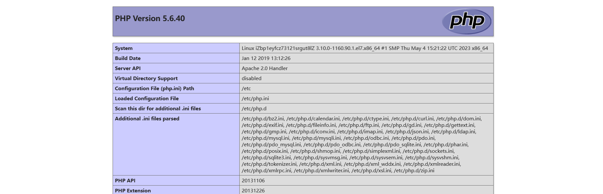
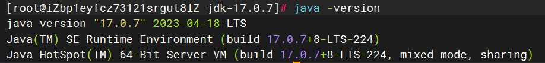
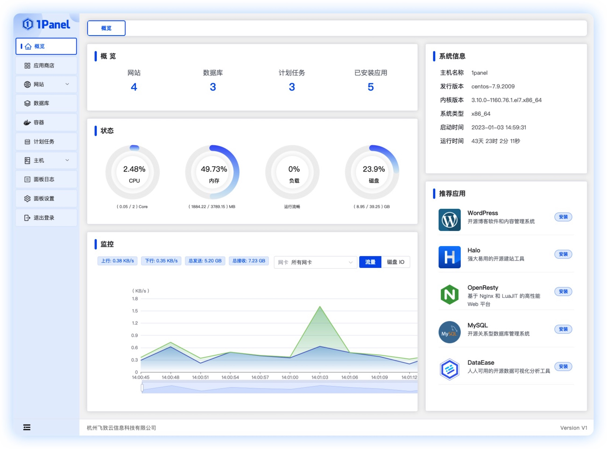

# 附录：中间件与环境安装文档

## 1. LAMP 环境

LAMP: Linux + Apache + MySQL + PHP；是php网站开发的基础环境。

前置： 

- 1、开通ecs 
- 2、centos7.9版本
- 3、可访问公网
- 4、安全组放行 80，3306 端口


### 1. 安装Apache+PHP

```sh
# 安装 Apache
yum install -y httpd
# 启动 Apache 服务 & 设置开机启动
systemctl start httpd
systemctl enable httpd


# 安装 php5.6。
rpm -Uvh https://mirror.webtatic.com/yum/el7/epel-release.rpm
rpm -Uvh https://mirror.webtatic.com/yum/el7/webtatic-release.rpm
yum install -y php56w.x86_64 php56w-cli.x86_64 php56w-common.x86_64 php56w-gd.x86_64 php56w-imap.x86_64 php56w-ldap.x86_64 php56w-mysql.x86_64 php56w-pdo.x86_64 php56w-odbc.x86_64 php56w-process.x86_64 php56w-xml.x86_64 php56w-xmlrpc.x86_64

#重启httpd服务
systemctl restart httpd
```


如果搭配Nginx + PHP 则可以安装php7.3；

```sh
# 安装php7.3
## 运行以下命令，添加EPEL源。
yum install -y https://rpms.remirepo.net/enterprise/remi-release-7.rpm
yum install -y --enablerepo=remi-php73 php php-fpm php-mysqlnd php-cli
```


> 测试PHP是否安装成功

```sh
vim /var/www/html/info.php
#内容如下
<?php
phpinfo();
?>

#重启服务器
systemctl restart httpd

#访问 http://你的ip/info.php； 出现下面页面则代表php安装成功
```




### 2. 安装MySQL

```sh
#准备目录
mkdir -p /opt/db
cd /opt/db/

### 安装 MySQL 5.6：
wget http://repo.mysql.com/mysql-community-release-el6-5.noarch.rpm
rpm -ivh mysql-community-release-el6-5.noarch.rpm
yum repolist all | grep mysql
yum install mysql-community-server -y

#启动mysql
systemctl start mysqld


#初始化mysql，一路yes即可，要记住自己新设置的密码
mysql_secure_installation


#创建初始数据库&授予权限
mysql -uroot -p
create database db_wordpress character set utf8 collate utf8_bin;
grant all on db_wordpress.* to user_wp@'localhost' identified by '123456';
grant all on db_wordpress.* to user_wp@'%' identified by '123456';
```


## 2. Java环境

```sh
#下载jdk17
wget https://download.oracle.com/java/17/latest/jdk-17_linux-x64_bin.tar.gz
#安装上传工具 以后使用命令 rz  选中文件进行上传
yum install -y lrzsz

#解压
tar -xzvf jdk-17_linux-x64_bin.tar.gz

#移动到指定位置； 记住全路径： /usr/local/jdk-17.0.7
mv jdk-17.0.7 /opt/

#配置环境变量   /opt/jdk-17.0.2
vim /etc/profile

#在最后加入下面配置，注意修改 JAVA_HOME位置为你自己的位置
export JAVA_HOME=/opt/jdk-17.0.2
export PATH=$JAVA_HOME/bin:$PATH

#使环境变量生效
source /etc/profile

#验证安装成功
java -version
```




## 3. WordPress安装

```sh
#下载 
mkdir -p /opt/WP
cd /opt/WP
wget https://cn.wordpress.org/latest-zh_CN.tar.gz
tar -xzvf latest-zh_CN.tar.gz

#把word_press代码复制到 /var/www/html 下，/var/www/html是php的网站目录
cd /var/www/html
cp -rf /opt/WP/wordpress/* /var/www/html/


###########配置 wordpress 访问 MYSQL
cd /var/www/html/
cp wp-config-sample.php wp-config.php
vim wp-config.php

##内容如下，注意修改为自己之前安装的MySQL的账号密码以及端口号
<?php
/**
 * The base configuration for WordPress
 *
 * The wp-config.php creation script uses this file during the installation.
 * You don't have to use the web site, you can copy this file to "wp-config.php"
 * and fill in the values.
 *
 * This file contains the following configurations:
 *
 * * Database settings
 * * Secret keys
 * * Database table prefix
 * * ABSPATH
 *
 * @link https://wordpress.org/documentation/article/editing-wp-config-php/
 *
 * @package WordPress
 */

// ** Database settings - You can get this info from your web host ** //
/** The name of the database for WordPress */
define( 'DB_NAME', 'db_wordpress' );

/** Database username */
define( 'DB_USER', 'user_wp' );

/** Database password */
define( 'DB_PASSWORD', '123456' );

/** Database hostname */
define( 'DB_HOST', 'localhost' );

/** Database charset to use in creating database tables. */
define( 'DB_CHARSET', 'utf8mb4' );

/** The database collate type. Don't change this if in doubt. */
define( 'DB_COLLATE', '' );

/**#@+
 * Authentication unique keys and salts.
 *
 * Change these to different unique phrases! You can generate these using
 * the {@link https://api.wordpress.org/secret-key/1.1/salt/ WordPress.org secret-key service}.
 *
 * You can change these at any point in time to invalidate all existing cookies.
 * This will force all users to have to log in again.
 *
 * @since 2.6.0
 */
define( 'AUTH_KEY',         ' ,kh+tKQ!*XlrMd)M)3}nn(i(Y+Kke[3KuaTMmuz B($EzqUix_v6X)Cn7QI{]+q' );
define( 'SECURE_AUTH_KEY',  'LiK0-P)]}09@hK%M#9Guiu}Q3]{c{3OTep9r8GFT4lH1tVL7hKQ4f4)YKna~L~Z8' );
define( 'LOGGED_IN_KEY',    'HQAx9M`N<lRusI8]MFDis$}K4)ek-YhK{tN%|Nlh&?:_JGDuU:],hxC}gB}8`7h(' );
define( 'NONCE_KEY',        '$.2`/+0)K#jaZ)V=wVW9j<?NbuCf3xQt*Hsv<|1ShflY:`zi,q{QUdE{A-8r. _m' );
define( 'AUTH_SALT',        'wWMitjd2mt&5P;H+&w_U6!r*3+fh8V[1#}^@km;xVoD7sr1W<k:%O@=Kbr=y&a2 ' );
define( 'SECURE_AUTH_SALT', 'u&!>mA2hpl%}7P%M!*=xHQ*x)XN|dVBJCUQz[wQNyhT}mmk+3-`h(!.].B3ZOkwK' );
define( 'LOGGED_IN_SALT',   '6h:Qh U@ME,-putJ}ViEi{#m=R9~j(YbzihIU)8lL3=@Q$V,<u#+HZ_*t)z7C[ra' );
define( 'NONCE_SALT',       'G.wRp$]0)lOlHc(_&BiB>f~2BcLpM}kIjqU[ fDT|?|B]W3=Ez,:RZT%)v&W@w_>' );

/**#@-*/

/**
 * WordPress database table prefix.
 *
 * You can have multiple installations in one database if you give each
 * a unique prefix. Only numbers, letters, and underscores please!
 */
$table_prefix = 'wp_';

/**
 * For developers: WordPress debugging mode.
 *
 * Change this to true to enable the display of notices during development.
 * It is strongly recommended that plugin and theme developers use WP_DEBUG
 * in their development environments.
 *
 * For information on other constants that can be used for debugging,
 * visit the documentation.
 *
 * @link https://wordpress.org/documentation/article/debugging-in-wordpress/
 */
define( 'WP_DEBUG', false );

/* Add any custom values between this line and the "stop editing" line. */


/* That's all, stop editing! Happy publishing. */

/** Absolute path to the WordPress directory. */
if ( ! defined( 'ABSPATH' ) ) {
	define( 'ABSPATH', __DIR__ . '/' );
}

/** Sets up WordPress vars and included files. */
require_once ABSPATH . 'wp-settings.php';

```


访问：http://47.99.217.185 初始化WordPress；


后台地址：http://47.99.217.185/wp-login.php

博客地址：http://47.99.217.185


## 4. Docker安装

### 1. 安装

```sh
#卸载旧版本Docker
sudo yum remove docker \
                  docker-client \
                  docker-client-latest \
                  docker-common \
                  docker-latest \
                  docker-latest-logrotate \
                  docker-logrotate \
                  docker-engine

#配置docker源
sudo yum install -y yum-utils
sudo yum-config-manager --add-repo https://download.docker.com/linux/centos/docker-ce.repo


#安装新版Docker,  docker compose； 允许写一个yaml配置文件，写清楚用哪些镜像启动哪些容器。
sudo yum install -y docker-ce docker-ce-cli containerd.io docker-buildx-plugin docker-compose-plugin

#启动 & 开机自启
sudo systemctl enable docker --now

#配置镜像加速
sudo mkdir -p /etc/docker
sudo tee /etc/docker/daemon.json <<-'EOF'
{
  "registry-mirrors": ["https://82m9ar63.mirror.aliyuncs.com"]
}
EOF
sudo systemctl daemon-reload
sudo systemctl restart docker

```

### 2. 常用命令

```sh

#docker常用命令
docker exec -it 容器id bash

#启动
docker compose -f xxx.yaml up -d 

#得到volume 的具体位置
docker volume inspect 你的volume名字 
#列出docker所有挂载的卷
docker volume ls
```

### 3. MySQL、Redis安装

> 安装MySQL和Redis的compose文件

```yaml
services:
  mysql:
    image: 'mysql:latest'
    restart: always
    environment:
      - 'MYSQL_DATABASE=mydatabase'
      - 'MYSQL_PASSWORD=secret'
      - 'MYSQL_ROOT_PASSWORD=verysecret'
      - 'MYSQL_USER=myuser'
    volumes:
      - /opt/mysql:/etc/mysql/conf.d #只要在外部的/opt/mysql目录下随便放一个 xx.cnf 文件，mysql自动把他当成配置文件
    ports:
      - '33066:3306'
  redis:
    image: redis:latest
    volumes:
      - /opt/redis/redis.conf:/usr/local/etc/redis/redis.conf
    command: redis-server /usr/local/etc/redis/redis.conf
    restart: always
    ports:
      - '7379:6379'
```


> 允许root远程访问（新版MySQL无需设置）

```sh
#mysql开启远程连接
docker exec -it 你的mysql容器id bash
mysql -uroot -p你的密码
GRANT ALL PRIVILEGES ON *.* TO 'root'@'%' WITH GRANT OPTION;
FLUSH PRIVILEGES;


#修改mysql配置文件，在[mysqld]下面加上一句话
bind-address    = 0.0.0.0
```


```sh
#后台启动jar应用，并且把所有日志都写到 log.txt
nohup java -jar your-jar-file.jar > log.txt 2>&1 &
```


## 5. 1Panel

### 1. 简介

> 1Panel 是一个现代化、开源的 Linux 服务器运维管理面板。适合小型公司快速运维需求。



### 2. 安装

```sh
curl -sSL https://resource.fit2cloud.com/1panel/package/quick_start.sh -o quick_start.sh && sh quick_start.sh
```

根据引导创建，安装完成后记得放行防火墙


## 6. 开机启动任意服务

### 1. 制作服务文件

```sh
cd /usr/lib/systemd/system
vim springbootapp.service
#内容如下

[Unit]
Description=springbootapp
After=syslog.target network.target remote-fs.target nss-lookup.target

[Service]
Type=forking
ExecStart=/opt/app/app-start.sh
ExecStop=/opt/app/app-stop.sh
PrivateTmp=true

[Install]
WantedBy=multi-user.target
```


### 2. 制作启动脚本

```sh
vim app-start.sh
#内容如下

#!/bin/sh

export JAVA_HOME=/opt/jdk-17.0.2
export PATH=$JAVA_HOME/bin:$PATH

nohup java -jar /opt/app/app.jar > /opt/app/app.log 2>&1 &

echo $! > /opt/app/app-service.pid
```

### 3. 制作停止脚本

```sh
vim app-stop.sh
#内容如下
#!/bin/sh

PID=$(cat /opt/app/app-service.pid)
kill -9 $PID
```


### 4. 增加执行权限

```sh
chmod +x app-start.sh
chmod +x app-stop.sh
```


### 5. 设置开机启动

```sh
systemctl daemon-reload
systemctl status springbootapp

systemctl enable springbootapp
systemctl disable springbootapp

systemctl start springbootapp
systemctl stop springbootapp
```

