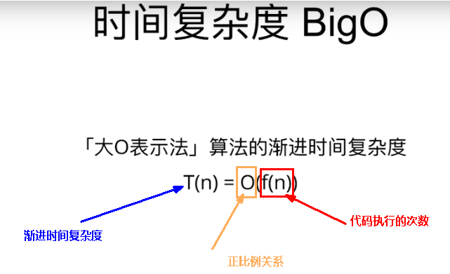
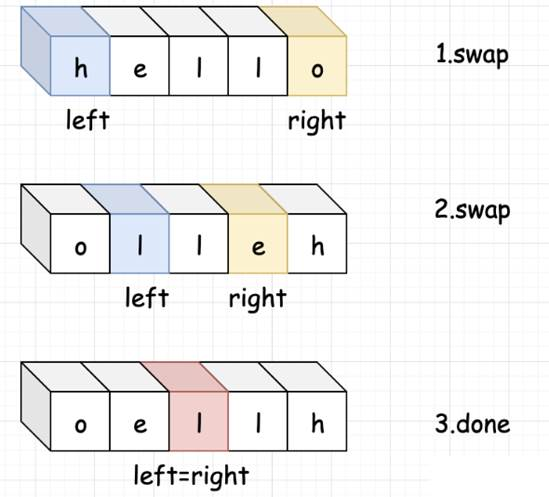
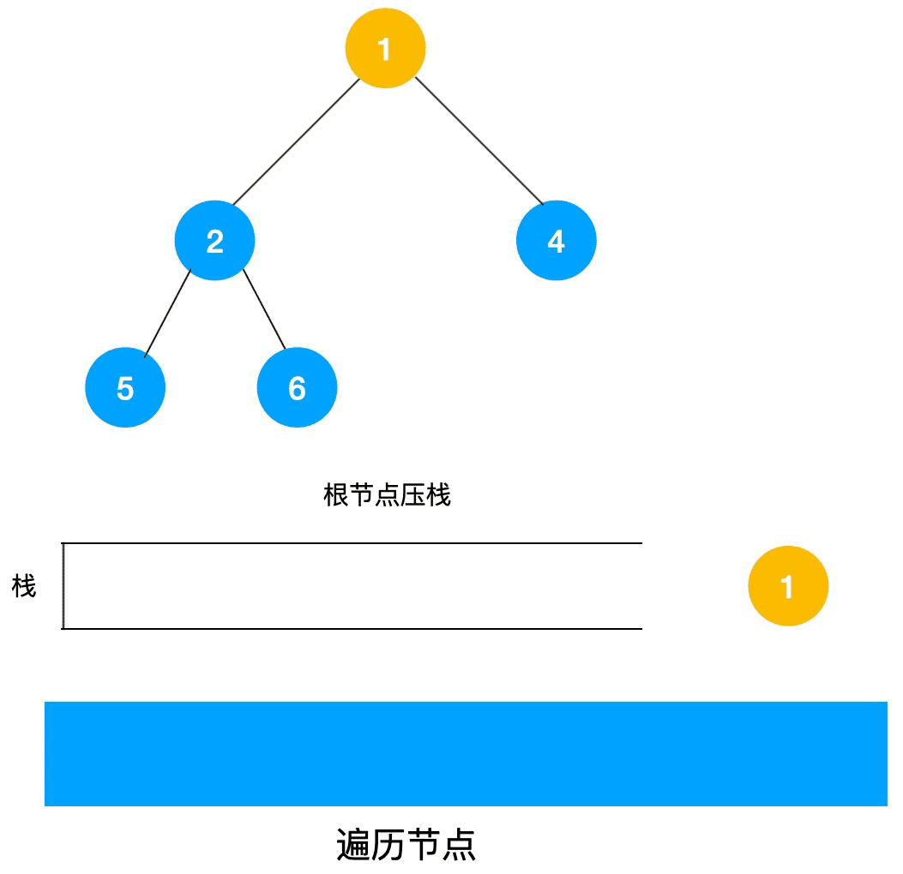
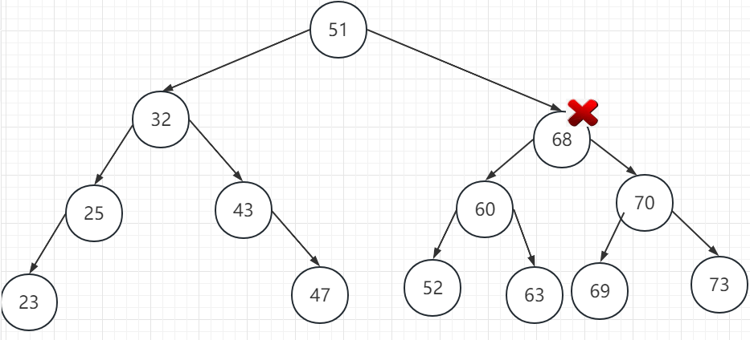
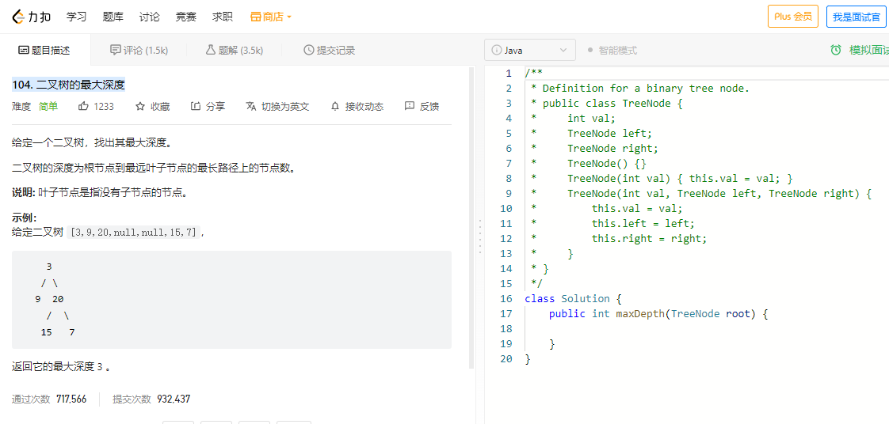
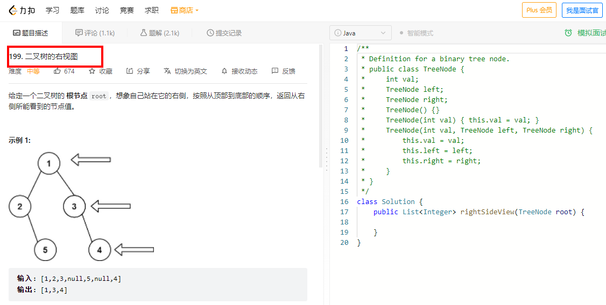
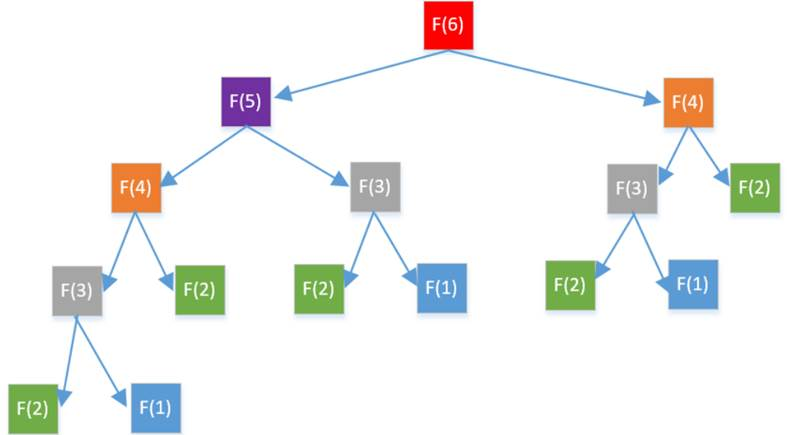
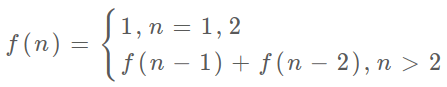

# Java全端课程之数据结构和算法 

尚硅谷 2023.8V1.7

## 一、开篇闲聊

### 1.1 前置知识

- Java8
- **Java17**

### 1.2 为什么要学习算法

- **为了求职面试，面试重灾区+大厂必考题**

- **程序 = 数据结构 + 算法**

- **求职面试难，继续卷出新高度**

### 1.3 算法-大厂面试的必备主菜

- 算法可以衡量程序员的技术功底
- 算法可以体现程序员的学习能力和成长潜力
- 学习算法有助于提高分析解决问题的能力
- 学习算法是做性能优化、成长为架构师的必经之路

### 1.4 刷题标准

力扣：https://leetcode.cn/

### 1.5 大厂面试常见数据结构题目(基础)

- 数组


- 栈


- 队列


- 链表


- 树(二分搜索树)


- 堆


 。。。

### 1.6 学习算法好处

- 考研必考，是学习的纽带
- 与算法有关的产品，竞争力都比较大
- 与算法有关的岗位，薪资和晋升潜力都比较大
- 转型大数据和AI，数据结构和算法常识也会让你更容易转型

## 二、数据结构和算法概述

### 2.1 数据结构概述

#### 2.1.1 数据结构是什么

**数据结构**是为了高效访问数据而设计出的一种数据的组织和存储方式。更具体的说，一个数据结构包含一个**数据元素的集合**、**数据元素之间的关系**以及**访问和操作数据的方法**。

一般而言，数据结构针对的是内存中的数据。所以在学习数据结构之前，需要先对内存有一个简单的了解。

**内存**由许多**存储单元**组成，每个存储单元可以存储一个固定大小的**数据块**，通常以**字节（Byte）**为单位。每个存储单元都有一个**唯一的地址**，操作系统正是根据这一地址去访问内存中的数据的。我们讨论的数据结构中的数据元素就保存在这些一个个的内存单元中，这些数据元素或存储在**连续**的内存单元中，或存储在**分散**的内存单元中。


#### 2.1.2 数据结构分类

##### 2.1.2.1 线性结构

数据元素按照顺序**排列**，强调数据元素的前后或升降顺序


- 数组


- 链表


- 栈


- 队列

##### 2.1.2.2 非线性结构

- 树


  所有数据元素按照层次结构进行组织，强调元素之间的父子关系

- 图


  由顶点和边组成，顶点对应数据元素，边连接两个顶点，表示两个数据元素之间的关系。 图形结构用于表达元素之间复杂的网络关系

- 其它
  - 二维数组

  - 多维数组

    ......

##### 2.1.2.3 小总结


#### 2.1.3 数据结构范围

- **数组**

- **栈**

- **队列**

- **链表**

- **哈希表**

- **树**

- 堆

- 图

  ......

### 2.2 算法概述

#### 2.2.1 算法是什么

举个栗子，如何获得8这个结果？

算法是一个用于解决特定问题的有限指令序列（计算可以执行的操作）。

#### 2.2.2 算法分类

##### 2.2.2.1 常见搜索算法

- 深度优先搜索


- 广度优先搜索


##### 2.2.2.2 常见排序算法

- 冒泡排序


- 选择排序


- 插入排序


- 快速排序


- 归并排序


- 堆排序


- 桶排序


- 基数排序


- 希尔排序


- 计数排序


- 位图排序


- 其它排序


##### 2.2.2.3 常见查找算法

- 顺序查找


- 二分查找


- 插值查找


- 斐波那契查找


- 分块查找


- 哈希查找


- 其它查找


##### 2.2.2.4 常见实现策略算法

- 暴力破解


- 增量


- 分治


- 动态规划


- 贪心算法


- 递归


#### 2.2.3 如何评价一个算法的好坏

**一个算法的好坏是通过【时间复杂度】与【空间复杂度】来衡量**

**简单来说**

所花的时间与占用内存便是衡量一个算法好坏的标准

- **时间复杂度**

  就是执行算法的时间成本 

- **空间复杂度**

  就是执行算法的内存空间成本 

#### 2.2.4 高中数学：对数函数vs指数函数复习


##### 2.2.4.1 补充说明

在描述算法复杂度时，经常用到o(1)， o(n)， o(logn)， o(nlogn)来表示对应算法的时间复杂度，这是算法的时间复杂度的表示。

O后面的括号中有一个函数，指明某个算法的耗时与数据增长量之间的关系。其中的n代表输入数据的量。

O(n)：代表数据量增大几倍，耗时也增大几倍。比如常见的遍历算法。

O(logn)：当数据增大n倍时，耗时增大logn倍（这里的log是以2为底的，比如，当数据增大256倍时，耗时只增大8倍，是比线性还要低的时间复杂度）。二分查找就是O(logn)的算法，每找一次排除一半的可能，256个数据中查找只要找8次就可以找到目标。

O(nlogn)：n乘以logn，当数据增大256倍时，耗时增256*8=2048倍。这个复杂度高于线性低于平方。归并排序就是O(nlogn)的时间复杂度。

O(1)：最低的时空复杂度，也就是耗时与输入数据大小无关，无论输入数据增大多少倍，耗时/耗空间都不变。 哈希算法就是典型的O(1)时间复杂度，无论数据规模多大，都可以在一次计算后找到目标（不考虑冲突的话）


#### 2.2.5 复杂度的大欧O(X)表示法

- 时间复杂度 与 空间复杂度 都是用 “大O” 来表示(大欧表示法)，写作 O(*)


- 由于目前内存便宜，此刻我们谈论复杂度

  - 一般谈论的都是时间复杂度

- 时间复杂度BigO，大欧表示法



 

量级增加时，时间增长的趋势。

- 常见时间复杂度的 “大O表示法” 描述有以下几种


#### 2.2.6 为什么你学习算法比较难？

 基本功不扎实，只刷题不看母题+了解本质

##### 2.2.6.1 字节跳动面试题，常见时间复杂度举例

##### 2.2.6.2 常见时间复杂度


 

- 常数阶O(1)

 

  无复杂的循环结构，代码每次执行，时间复杂度都是O（1） 

```java
package com.atguigu.study.bigo;

/**
 * O(1)
 * 常数阶
 */
public class T0 {

    /**
     * 无复杂的循环结构，不论代码多少行，每次执行，时间复杂度都是O(1)
     */
    public void compute() {
        int i = 1;
        int j = 1;
        i++;
        j++;
        int temp;
        temp = i + j;
        System.out.println("temp = " + temp);
    }

    public static void main(String[] args) {
        new T0().compute();
    }
}
```

- 对数阶O(logN)

 

```java
package com.atguigu.study.bigo;

/**
 * 对数阶  O(logN)
 * 从排序的数组中查找到目标
 */
public class T1 {
    public static void main(String[] args) {
        int[] arrays = new int[]{1, 11, 22, 33, 77, 99, 103, 108}; //length = 8      index  0~7
        int target = 77;
        int index = binarySearch(arrays, target);
        System.out.println("index = " + index);
    }

    public static int binarySearch(int[] arraySorted, int target) {
        int left = 0;
        int right = arraySorted.length - 1;

        while (left <= right) {
            int middle = left + (right - left) / 2;
            if (arraySorted[middle] == target) {
                return middle;
            } else if (arraySorted[middle] > target) { // 要找的在左侧
                right = middle - 1;
            } else if (arraySorted[middle] < target) { //要找的在右侧
                left = middle + 1;
            }
        }
        return -1;
    }
}
```

- 
  线性阶O(N)

 

```java
package com.atguigu.study.bigo;

/**
 * O(n)  线性阶
 * 对所有的数据都执行一遍
 */
public class T2 {

    public static void main(String[] args) {
        circle(5);
    }

    private static void circle(int n) { //执行n次,n的值越大,时间越长
        for (int j = 0; j < n; j++) {
            System.out.println("j = " + j);
        }
    }
}
```

- 线性对数阶O(nlogN)

 

```java
package com.atguigu.study.bigo;

/**
 * 线性对数阶：O(NlogN)
 * 将一个复杂度O(logN)的的代码执行N次，那么，此时复杂度就是O(NlogN)
 */
public class T3 {
    public static void main(String[] args) {
        logArithmetic(5);
    }

    private static void logArithmetic(int n) {
        for (int i = 0; i < n; i++) { //执行n次
            int count = 1;
            while (count <= n) { //执行logN次
                System.out.println("i*count=" + i + "-" + count);
                count = count * 2; //执行nlogN次
            }
        }
    }
}
```

- 平方阶O(n²)

 

```java
package com.atguigu.study.bigo;

/**
 * O(n²)  平方阶
 */
public class T4 {

    public static void main(String[] args) {
        //square(5);
        square(5, 6);
    }

    /**
     * 当内循环和外循环次数不一致时，时间复杂度如下：
     * 内循环执行m次，时间复杂度为O(m)
     * 外循环执行n次，整段代码的时间复杂度是O(n*m) ,即整个时间复杂度等于内部循环的时间复杂度乘以外层循环次数
     */
    private static void square(int n, int m) {
        System.out.println("n*m = " + n * m);
        for (int i = 0; i < n; i++) { //执行n次
            for (int j = 0; j < m; j++) { //执行m次
                System.out.println("i - j = " + i + "-" + j); //执行n*m次
            }
        }
    }

    private static void square(int n) {
        System.out.println("n*n = " + n * n);
        for (int i = 0; i < n; i++) { //执行n次
            for (int j = 0; j < n; j++) { //执行n次
                System.out.println("i - j = " + i + "-" + j); //执行n平方次
            }
        }
    }
}
```

- 
  立方阶O(n³)

 

```java
package com.atguigu.study.bigo;

/**
 * 立方阶：O(n³)
 */
public class T5 {
    public static void main(String[] args) {
        demo(10);
    }

    private static void demo(int n) {
        for (int i = 0; i < n; i++) { //执行n次
            for (int j = 0; j < n; j++) { //执行n次
                for (int k = 0; k < n; k++) { //执行n次
                    System.out.println("hello i-j-k   " + i + " - " + j + " - " + k); //执行n*n*n次
                }
                System.out.println("----------");
            }
            System.out.println("=========");
        }
    }
}
```

- 指数阶(2^n)

 

 HashMap扩容，原值一倍

- 阶乘(略...)


**小总结** 


## 三、数组Array

### 3.1 基础知识

数组是具有相同类型的数据的集合，也就是说数组的所有元素的**类型**都是**相同**的，在所有的数据结构中，

数组算是最常见也是最简单的一种数据结构，我们最常见的也就是一维数组，当然还有二维，三维……，

数组需要先声明才能使用，数组的大小一旦确定就**不可以再变**了。比如我们声明一个长度为10的数组

```java
int[] array = new int[10];
```

 数组的下标是从**零**开始的，比如上面数组的第一个元素是array[0]，最后一个元素是array[9]。

 


### 3.2 筑牢基础，课前ArrayList源码浅谈


### 3.3 数组优缺点

#### 3.3.1 优点

- 查找快

- 使用下标位置索引(index)十分高效的访问任意元素，修改快


#### 3.3.2 缺点

- 插入和删除操作开销大


- **说明**

由于数组的内存连续性，插入和删除元素可能需要**移动**其他元素，导致**开销较大**。

特别是在数组的开头或中间插入/删除元素时，需要进行大量的数据搬移操作。


### 3.4 架构设计一个通用数组，考虑封装的思想

#### 3.4.1 约定变量

- data[]

- size 实际个数

#### 3.4.2 热身课堂小练习，正序+反序打印数组

```java
package com.atguigu.study.datastruct.arrays;

/**
 * 数组的正反打印
 */
public class DemoPrintArray {
    public static void main(String[] args) {
        int[] ints = new int[]{1, 2, 3, 4, 5};
        for (int i = 0; i < ints.length; i++) {
            System.out.println("ints[" + i + "] = " + ints[i]);
        }

        System.out.println("---------------");

        for (int i = ints.length - 1; i >= 0; i--) {
            System.out.println("ints[" + i + "] = " + ints[i]);
        }
    }
}
```

#### 3.4.3 小口诀(**增删改查含，扩缩正反印**)

#### 3.4.4 普通版步骤V1

- 定义属性：int[] data，int size

- 初始化capacity容量


    构造注入对数组进行初始化，主要是最大容量capacity赋值

- 简单的辅助，getSize+getCapacity+isEmpty+isFull
- 增
  - 头增，往数组第一位置新增一个元素：addFirst(int e)
  - 中增，指定索引下标位置，插入元素：add(int index,int e)
  - 尾增，往数组最后新增一个元素：addLast(int e)
- 删
  - 头删，往数组第一位置删除一个元素，并返回元素：removeFirst()
  - 中删，指定索引下标位置，删除元素，并返回元素：remove(int index)
  - 尾删，往数组最后删除一个元素，并返回元素：removeLast()

- 修改，按照下标index设置元素，并返回元素：set(int index,int e)

- 查询，按照下标index取得元素：get(int index)

- 包含，数组中是否包含某个元素：contain(int v)
- 印
  - 打印，按照正序打印：print()
  - 逆印，按照逆序打印：printReverse()

- code实例

```java
package com.atguigu.study.datastruct.arrays;

/**
 * V1版：增删改查含，扩缩正反印
 */
public class MyArray {
    //1.定义属性
    int[] data;
    int size;

    //2.构造对象
    public MyArray() {
        this(5);
    }

    public MyArray(int capacity) {
        data = new int[capacity];
        size = 0;
    }

    //3.基础函数
    public int getSize() {
        return size;
    }

    public int getCapacity() {
        return data.length;
    }

    public boolean isEmpty() {
        return size == 0;
    }

    public boolean isFull() {
        return size == data.length;
    }

    //4.增
    public void addFirst(int e) {
        add(0, e);
    }

    public void add(int index, int e) {
        if (isFull())
            throw new RuntimeException("数组满了,不能增加元素;后面考虑扩容问题");
        if (index < 0 || index > size) {
            throw new RuntimeException("索引不在范围边界内");
        }
        for (int i = size - 1; i >= index; i--) {
            data[i + 1] = data[i];
        }
        data[index] = e;
        size++;
    }

    public void addLast(int e) {
        add(size, e);
    }

    //5.删
    public int removeFirst() {
        return remove(0);
    }

    public int remove(int index) {
        if (isEmpty()) {
            throw new RuntimeException("数组为空，不能删除元素");
        }

        if (index < 0 || index >= size) {
            throw new RuntimeException("索引不在范围边界内");
        }

        int result = data[index]; //先获取要删除的索引对应的元素，方法返回

        for (int i = index + 1; i < size; i++) { //从索引+1位置进行左移
            data[i - 1] = data[i];
        }
        size--;

        return result;
    }

    public int removeLast() {
        return remove(size - 1);
    }


    //6.改
    public int set(int index, int e) {
        if (index < 0 || index > size) {
            throw new RuntimeException("索引不在边界范围");
        }
        return data[index] = e;
    }

    //7.查
    public int get(int index) {
        if (index < 0 || index > size) {
            throw new RuntimeException("索引不在边界范围");
        }
        return data[index];
    }

    //8.含
    public boolean contain(int e) {
        for (int i = 0; i < size; i++) {
            if (data[i] == e) {
                return true;
            }
        }
        return false;
    }

    //9.扩

    //10.缩

    //11.正打印
    public void print() {
        for (int i = 0; i < data.length; i++) { //游离对象,后面解决
            System.out.println("data[i] = " + data[i]);
        }
        /*for (int i = 0; i < size; i++) {
            System.out.println("data[i] = " + data[i]);
        }*/
    }

    //12.反打印
    public void printReverse() {
        for (int i = size - 1; i >= 0; i--) {
            System.out.println("data[i] = " + data[i]);
        }
    }

    //13.主方法测试
    public static void main(String[] args) {
        MyArray myArray = new MyArray();

        myArray.addFirst(2);
        myArray.add(1, 3);
        myArray.add(2, 4);
        myArray.addLast(77);
        myArray.addLast(999);

        myArray.print();
        myArray.printReverse();

        System.out.println();
        System.out.println("removeFirst: " + myArray.removeFirst());
        System.out.println("removeLast: " + myArray.removeLast());

        myArray.print();
        System.out.println("myArray.set: " + myArray.set(1, 1111));
        myArray.print();

        System.out.println("myArray.get(1): " + myArray.get(1));
        System.out.println("myArray.contain(1111): " + myArray.contain(1111));
        System.out.println("-----------------------------");
        myArray.print();
        System.out.println("-----------------------------");
        myArray.printReverse();

        System.out.println("-----为什么正向打印有两个999，反向打印无?，引出游离对象");
    }
}
```

#### 3.4.5 泛型版步骤V2

- 内部封装好遍历整个数组对外暴露方法

- 基础知识，不讲， 默认已懂复习资料宋红康:https://www.bilibili.com/video/BV1PY411e7J6?p=164

- 轻奢复习


- 泛型版MyArrayGeneric\<E\>第2版


```java
package com.atguigu.study.datastruct.arrays;

/**
 * V2版(带泛型)：增删改查含，扩缩正反印
 */
public class MyArrayGeneric<E> {
    //1.定义属性
    E[] data;
    int size;

    //2.构造对象
    public MyArrayGeneric() {
        this(5);
    }

    public MyArrayGeneric(int capacity) {
        //data = new int[capacity];
        data = (E[]) new Object[capacity];
        size = 0;
    }

    //3.基础函数
    public int getSize() {
        return size;
    }

    public int getCapacity() {
        return data.length;
    }

    public boolean isEmpty() {
        return size == 0;
    }

    public boolean isFull() {
        return size == data.length;
    }

    //4.增
    public void addFirst(E e) {
        add(0, e);
    }

    public void add(int index, E e) {
        if (isFull())
            throw new RuntimeException("数组满了,不能增加元素;后面考虑扩容问题");
        if (index < 0 || index > size) {
            throw new RuntimeException("索引不在范围边界内");
        }
        for (int i = size - 1; i >= index; i--) {
            data[i + 1] = data[i];
        }
        data[index] = e;
        size++;
    }

    public void addLast(E e) {
        add(size, e);
    }

    //5.删
    public E removeFirst() {
        return remove(0);
    }

    public E remove(int index) {

        if (isEmpty()) {
            throw new RuntimeException("数组为空，不能删除元素");
        }

        if (index < 0 || index >= size) {
            throw new RuntimeException("索引不在范围边界内");
        }

        E result = data[index]; //先获取要删除的索引对应的元素，方法返回

        for (int i = index + 1; i < size; i++) { //从索引+1位置进行左移
            data[i - 1] = data[i];
        }
        size--;

        return result;
    }

    public E removeLast() {
        return remove(size - 1);
    }


    //6.改
    public E set(int index, E e) {
        if (index < 0 || index > size) {
            throw new RuntimeException("索引不在边界范围");
        }
        return data[index] = e;
    }

    //7.查
    public E get(int index) {
        if (index < 0 || index > size) {
            throw new RuntimeException("索引不在边界范围");
        }
        return data[index];
    }

    //8.含
    public boolean contain(E e) {
        for (int i = 0; i < size; i++) {
            if (data[i] == e) {
                return true;
            }
        }
        return false;
    }

    //9.扩

    //10.缩

    //11.正打印
    public void print() {
        for (int i = 0; i < data.length; i++) { //游离对象,后面解决
            System.out.println("data[i] = " + data[i]);
        }
        /*for (int i = 0; i < size; i++) {
            System.out.println("data[i] = " + data[i]);
        }*/
    }

    //12.反打印
    public void printReverse() {
        for (int i = size - 1; i >= 0; i--) {
            System.out.println("data[i] = " + data[i]);
        }
    }

    //13.主方法测试
    public static void main(String[] args) {
        MyArrayGeneric<Integer> myArray = new MyArrayGeneric();

        myArray.addFirst(2);
        myArray.add(1, 3);
        myArray.add(2, 4);
        myArray.addLast(77);
        myArray.addLast(999);

        myArray.print();
        myArray.printReverse();

        System.out.println();
        System.out.println("removeFirst: " + myArray.removeFirst());
        System.out.println("removeLast: " + myArray.removeLast());

        myArray.print();
        System.out.println("myArray.set: " + myArray.set(1, 1111));
        myArray.print();

        System.out.println("myArray.get(1): " + myArray.get(1));
        System.out.println("myArray.contain(1111): " + myArray.contain(1111));
        System.out.println("-----------------------------");
        myArray.print();
        System.out.println("-----------------------------");
        myArray.printReverse();

        System.out.println("-----为什么正向打印有两个999，反向打印无?，引出游离对象");
    }
}
```

#### 3.4.6 课堂练习，规范的定制化接口IMyArray\<E\>

```java
package com.atguigu.study.datastruct.arrays;

public interface IMyArray<E> {
    //3.基础函数
    int getSize();

    int getCapacity();

    boolean isEmpty();

    boolean isFull();

    void addFirst(E e);

    void add(int index, E e);

    public void resize(int newCapacity);

    void addLast(E e);

    //5.删
    E removeFirst();

    E remove(int index);

    E removeLast();

    //6.改
    E set(int index, E e);

    //7.查
    E get(int index);

    //8.含
    boolean contain(E e);

    //11.正打印
    void print();

    //12.反打印
    void printReverse();
}

```

#### 3.4.7 (泛型版++)步骤V3(解决扩缩容)

##### 扩容

##### 缩容（可以不写）

##### 对象游离(loitering)

定义：数组实现中有对象的引用，而我们并没有真正使用它，所以当减小N时，在数组中仍然有我们已经删除的对象的指针。

尽管程序员知道不再使用它了，但是Java系统JVM不知道

**解决：**最好将去除元素对应的项设为null，这样就不会剩下。


看看我们的remove方法，后续用，^_^

**代码演示**

```java
package com.atguigu.study.datastruct.arrays;

/**
 * V3版(带泛型++)：增删改查含，扩缩正反印
 */
public class MyArrayGenericPlus<E> implements IMyArray<E> {
    //1.定义属性
    E[] data;
    int size;

    //2.构造对象
    public MyArrayGenericPlus() {
        this(5);
    }

    public MyArrayGenericPlus(int capacity) {
        //data = new int[capacity];
        data = (E[]) new Object[capacity];
        size = 0;
    }

    //3.基础函数
    @Override
    public int getSize() {
        return size;
    }

    @Override
    public int getCapacity() {
        return data.length;
    }

    @Override
    public boolean isEmpty() {
        return size == 0;
    }

    @Override
    public boolean isFull() {
        return size == data.length;
    }

    //4.增
    @Override
    public void addFirst(E e) {
        add(0, e);
    }

    /*
    @Override
    public void add(int index, E e) {
        if (isFull())
            throw new RuntimeException("数组满了,不能增加元素;后面考虑扩容问题");
        if (index < 0 || index > size) {
            throw new RuntimeException("索引不在范围边界内");
        }
        for (int i = size - 1; i >= index; i--) {
            data[i + 1] = data[i];
        }
        data[index] = e;
        size++;
    }*/

    @Override
    public void add(int index, E e) {
        if (isFull()) {
            //---------扩容----------------------------
            resize(getCapacity() * 2);
        }

        if (index < 0 || index > size) {
            throw new RuntimeException("索引不在范围边界内");
        }
        for (int i = size - 1; i >= index; i--) {
            data[i + 1] = data[i];
        }
        data[index] = e;
        size++;
    }

    //---------扩容----------------------------
    public void resize(int newCapacity) {
        E[] newData = (E[]) new Object[newCapacity];
        for (int i = 0; i < getSize(); i++) {
            newData[i] = data[i];
        }
        data = newData;
    }

    @Override
    public void addLast(E e) {
        add(size, e);
    }

    //5.删
    @Override
    public E removeFirst() {
        return remove(0);
    }

    @Override
    public E remove(int index) {

        if (isEmpty()) {
            throw new RuntimeException("数组为空，不能删除元素");
        }

        if (index < 0 || index >= size) {
            throw new RuntimeException("索引不在范围边界内");
        }

        E result = data[index]; //先获取要删除的索引对应的元素，方法返回

        for (int i = index + 1; i < size; i++) { //从索引+1位置进行左移
            data[i - 1] = data[i];
        }
        size--;
        //data[size] = null; //假如没有这一行会存在游离对象

        //---------缩容----------------------------
        if (getSize() == getCapacity() / 2) {
            System.out.println("resize()....");
            resize(getCapacity() / 2);
        }
        //-------------------------------------
        return result;
    }

    @Override
    public E removeLast() {
        return remove(size - 1);
    }


    //6.改
    @Override
    public E set(int index, E e) {
        if (index < 0 || index > size) {
            throw new RuntimeException("索引不在边界范围");
        }
        return data[index] = e;
    }

    //7.查
    @Override
    public E get(int index) {
        if (index < 0 || index > size) {
            throw new RuntimeException("索引不在边界范围");
        }
        return data[index];
    }

    //8.含
    @Override
    public boolean contain(E e) {
        for (int i = 0; i < size; i++) {
            if (data[i] == e) {
                return true;
            }
        }
        return false;
    }

    //9.扩

    //10.缩

    //11.正打印
    @Override
    public void print() {
        for (int i = 0; i < data.length; i++) { //游离对象,后面解决
            System.out.println("data[i] = " + data[i]);
        }
        /*for (int i = 0; i < size; i++) {
            System.out.println("data[i] = " + data[i]);
        }*/
    }

    //12.反打印
    @Override
    public void printReverse() {
        for (int i = size - 1; i >= 0; i--) {
            System.out.println("data[i] = " + data[i]);
        }
    }

    //13.主方法测试
    public static void main(String[] args) {
        IMyArray<Integer> myArray = new MyArrayGenericPlus();

        myArray.addFirst(2);
        myArray.add(1, 3);
        myArray.add(2, 4);
        myArray.addLast(77);
        myArray.addLast(999);

        myArray.print();
        myArray.printReverse();

        System.out.println();
        System.out.println("removeFirst: " + myArray.removeFirst());
        System.out.println("removeLast: " + myArray.removeLast());

        myArray.print();
        System.out.println("myArray.set: " + myArray.set(1, 1111));
        myArray.print();

        System.out.println("myArray.get(1): " + myArray.get(1));
        System.out.println("myArray.contain(1111): " + myArray.contain(1111));
        System.out.println("-----------------------------");
        myArray.print();
        System.out.println("-----------------------------");
        myArray.printReverse();

        System.out.println("-----为什么正向打印有两个999，反向打印无?，引出游离对象");
    }
}

```

-  问题


- 正确


### 3.5 leetcode数组练习经典题

344. 反转字符串

https://leetcode.cn/problems/reverse-string/

```java
package com.atguigu.study.datastruct.arrays;

/**
 * https://leetcode.cn/problems/reverse-string/
 * <p>
 * 编写一个函数，其作用是将输入的字符串反转过来。输入字符串以字符数组 s 的形式给出。
 * <p>
 * 不要给另外的数组分配额外的空间，你必须原地修改输入数组、使用 O(1) 的额外空间解决这一问题。
 */
public class LeetCode344ReverseString {

    public void reverseString(char[] s) {
        int left = 0;
        int right = s.length - 1;
        while (left < right) {
            char temp = s[left];
            s[left] = s[right];
            s[right] = temp;
            left++;
            right--;
        }
    }

    public static void main(String[] args) {
        String str = "helloworld";
        char[] chars = str.toCharArray(); //["h","e","l","l","o"];
        System.out.println("chars = " + new String(chars));
        LeetCode344ReverseString lc = new LeetCode344ReverseString();
        lc.reverseString(chars);

        System.out.println("chars = " + new String(chars));
    }
}
```

- 图解说明




## 四、栈Stack

### 4.1 基础知识

#### 4.1.1 先进后出/后进先出 最经典的案例-子弹弹夹

栈也是一种特殊的线性表，他只能对栈顶进行添加和删除元素。栈有入栈和出栈两种操作，他就好

像我们把书一本本的摞起来，最先放的书肯定是摞在下边，最后放的书肯定是摞在了最上面，摞的

时候不允许从中间放进去，拿书的时候也是先从最上面开始拿，不允许从下边或中间抽出来。


#### 4.1.2 是什么


 

#### 4.1.3 还有吗？

数组的子集

#### 4.1.4 小口诀

入栈addLast()+出栈removeLast()

### 4.2 栈相关操作

Push：压栈操作或入栈操作

Pop：弹栈或出栈操作

Peek：查看栈顶数据，但不出栈

### 4.3 架构设计一个通用栈，考虑封装的思想

#### 4.3.1 判断条件

- 初容大于零

- 满了不能加


- 空了不能取


#### 4.3.2 IStackDesc\<E\>栈接口

```java
package com.atguigu.study.datastruct.stack;

public interface IStackDesc<E> {
    void push(E e);

    E pop();

    E peek();

    int getSize();

    boolean isFull();

    boolean isEmpty();

    void print();
}
```

#### 4.3.3 MyStack\<E\>

```java
package com.atguigu.study.datastruct.stack;

public class MyStack<E> implements IStackDesc<E> {

    E[] data;
    int size;

    public MyStack() {
        this(5);
    }

    public MyStack(int capacity) {
        if (capacity <= 0)
            throw new IllegalArgumentException("初始值不合法,不能为负数和零");
        this.data = (E[]) new Object[capacity];
        this.size = 0;
    }

    @Override
    public void push(E e) {
        if (isFull()) {
            throw new IllegalArgumentException("栈满了");
        }
        data[size] = e;
        size++;
    }

    @Override
    public E pop() {
        if (isEmpty())
            throw new IllegalArgumentException("栈空了");
        E result = data[size - 1];
        size--;
        data[size] = null;
        return result;
    }

    @Override
    public E peek() {
        return data[size - 1];
    }

    @Override
    public int getSize() {
        return size;
    }

    @Override
    public boolean isFull() {
        return size == data.length;
    }

    @Override
    public boolean isEmpty() {
        return size == 0;
    }

    @Override
    public void print() {
        for (int i = 0; i < size; i++) {
            System.out.print("  " + data[i]);
        }
    }

    public static void main(String[] args) {
        MyStack<Integer> myStack = new MyStack<>();

        for (int i = 0; i < 5; i++) {
            myStack.push(i + 1);
        }
        myStack.print();
        System.out.println();

        System.out.println(myStack.pop());
        System.out.println(myStack.peek());

        myStack.print();
    }
}
```

#### 4.3.4 对象游离(loitering)

定义：即在栈的数组实现中有对象的引用，而我们并没有真正使用它，所以当减小N时，在数组中仍然有我们已经出栈的对象的指针。

尽管我们知道我们不再使用它了，但是Java系统不知道

解决：最好将去除元素对应的项设为null,这样就不会剩下。


## 五、队列Queue

### 5.1 基础知识

#### 5.1.1 先进先出 最经典的案例-排队打饭

队列是一种**特殊的线性表**，他的特殊性在于我们只能操作他头部和尾部的元素，中间的元素我们操

作不了，我们只能在他的头部进行删除，尾部进行添加。就像大家排队到银行取钱一样，先来的肯

定要排到前面，后来的只能排在队尾，所有元素都要遵守这个操作，没有VIP会员，所以走后门插

队的现象是不可能存在的，他是一种**先进先出的数据结构**

 


#### 5.1.2 是什么


#### 5.1.3 还有吗？

数组的子集

#### 5.1.4 小口诀

addLast()+removeFirst()

### 5.2 架构设计一个队列，考虑封装问题

#### 5.2.1 判断

- 初容大于零


- 满了不能加


- 空了不能取


#### 5.2.2 队列接口IQueueDesc\<E\>

```java
package com.atguigu.study.datastruct.queues;

public interface IQueueDesc<E> {
    void enqueue(E e);

    E dequeue(); //首元素出队,后续元素要前移   removeFirst()

    E getFront();

    int getSize();

    int getCapacity();

    boolean isEmpty();

    boolean isFull();

    void print();
}
```

#### 5.2.3 MyQueue\<E\>

```java
package com.atguigu.study.datastruct.queues;

public class MyQueue<E> implements IQueueDesc<E> {

    E[] data;
    int size;

    public MyQueue() {
        this(5);
    }

    public MyQueue(int capacity) {
        if (capacity <= 0) {
            throw new RuntimeException("不能为负数和零");
        }
        this.data = (E[]) new Object[capacity];
        this.size = 0;
    }

    @Override
    public void enqueue(E e) {
        if (isFull()) {
            throw new RuntimeException("队列满了");
        }
        data[size] = e;
        size++;
    }

    @Override
    public E dequeue() {
        if (isEmpty()) {
            throw new RuntimeException("队列空了");
        }
        E result = data[0];
        for (int i = 1; i < size; i++) {
            data[i - 1] = data[i];
        }
        size--;
        data[size] = null;
        return result;
    }

    @Override
    public E getFront() {
        return data[0];
    }

    @Override
    public int getSize() {
        return size;
    }

    @Override
    public int getCapacity() {
        return data.length;
    }

    @Override
    public boolean isEmpty() {
        return size == 0;
    }

    @Override
    public boolean isFull() {
        return size == data.length;
    }

    @Override
    public void print() {
        for (int i = 0; i < size; i++) {
            System.out.print("  " + data[i]);
        }
    }

    public static void main(String[] args) {
        MyQueue<Integer> myQueue = new MyQueue<>();

        for (int i = 0; i < 5; i++) {
            myQueue.enqueue(i + 1);
        }

        myQueue.print();
        System.out.println("");
        System.out.println("-------");
        System.out.println(myQueue.dequeue());
        System.out.println(myQueue.dequeue());
        System.out.println("-------");
        myQueue.print();
        System.out.println("");
    }
}
```

## 六、链表

### 6.1 基础知识

#### 6.1.1 最经典的案例-火车挂车厢

 


**单向链表** 一个节点指向下一个节点

n个节点离散分配，彼此通过指针相连，每个节点只有一个**前驱节点**，每个节点只有一个**后续节点**，**首节点**没有前驱节点，**尾节点**没有后续节点。确定一个链表我们只需要**头指针**，通过头指针就可以把整个链表都能推出来。

#### 6.1.2 是什么


### 6.2 链表优缺点

#### 6.2.1 优点

- 插入和删除操作效率高


- 动态性能更好


链表不需要像数组那样预先指定固定的大小，而是可以随时动态的增长或缩小。

链表是真正的动态数据结构，不需要处理固定容量的问题

#### 6.2.2 缺点

- 查找慢

由于链表中的节点不是连续存储的，无法像数组一样根据索引直接计算出每个节点的地址。

必须从头节点开始遍历链表，直到找到目标节点，这导致了链表的随机访问效率较低。

- 额外的存储空间

链表的每个节点都需要存储指向下一个节点的指针，这会占用额外的存储空间。

相比于数组，链表需要更多的内存空间来存储相同数量的数据元素。

### 6.3 架构设计一个单链表，考虑的封装问题

#### 6.3.1 如何构造Node节点？

- 参考leetcode如何定义一个Node类型


- 两种都可以

**内嵌**自定义

```java
package com.atguigu.study.datastruct.linkedlists;

public class MyLinkedList<E>{
    private class Node<E>{
        public E e;
        public Node<E> next;

        public Node() {
            this(null,null);
        }
        public Node(E e) {
            this(e,null);
        }
        public Node(E e, Node<E> next) {
            this.e = e;
            this.next = next;
        }
        @Override
        public String toString() {
            return "Node{" + "e=" + e + '}';
        }
    }
}
```

**外部**自定义

```java
package com.atguigu.study.datastruct.linkedlists;

public class Node<E>{
    public E e;
    public Node<E> next;

    public Node() {
        this(null,null);
    }
    public Node(E e) {
        this(e,null);
    }
    public Node(E e, Node<E> next) {
        this.e = e;
        this.next = next;
    }

    @Override
    public String toString() {
        return "Node{" + "e=" + e + '}';
    }
}
```

#### 6.3.2 初始化定义：MyLinkedListV1\<E\>

```java
package com.atguigu.study.datastruct.linkedlists;

public class MyLinkedListV1<E> {

    /**
     * 1.内嵌链表节点封装
     */
    private class Node<E> {
        E e;
        Node<E> next;

        public Node() {
            this(null, null);
        }

        public Node(E e) {
            this(e, null);
        }

        public Node(E e, Node<E> next) {
            this.e = e;
            this.next = next;
        }
    }

    //2.Field初始化
    private Node<E> head; //此时头节点指向null,表示尾部
    private int size;

    //3.构造
    public MyLinkedListV1() {
        this.head = null;
        this.size = 0;
    }

    //4.空不空
    public boolean isEmpty() {
        return size == 0;
    }

    //5.实际个数
    public int getSize() {
        return size;
    }
}
```

#### 6.3.4 第1版MyLinkedListV1-(增-过渡版本)

```java
    //6 add
    public void addFirst(E e){
        Node<E> node = new Node<>(e);
        node.next = head;
        head = node;
        //head = new Node<>(e,head);//上面3行可以合成一行
        size++;
    }

    public void add(int index,E e){
        if(index < 0 || index > size) throw new RuntimeException("----链表不在有效边界");

        if(index == 0){
            addFirst(e);
        }else{
            //1 凡是插入，由于涉及到next指针的变动，先找到插入节点的前置节点
            Node<E> prev = head;
            for (int i = 0; i <index - 1 ; i++) {
                prev = prev.next;
            }
            //2 插入新增节点并设置next指针指向
            Node<E> node = new Node<>(e);
            node.next = prev.next;
            prev.next = node;
            //prev.next = new Node<>(e,prev.next);//上面3行可以合成一行
            //3 实际个数++
            size++;
        }
    }
    public void addLast(E e){
        add(size,e);
    }
```

**链表的顺序极度重要**

- right


```java
Node<E> node = new Node<>(e);
node.next = prev.next;
prev.next = node;
```

-  error


```java
Node<E> node = new Node<>(e);
prev.next = node;
node.next = prev.next; //坑爹了，表示指向了node自己。注意顺序，OK？
```

#### 6.3.5 第2版MyLinkedListV2-(增改进版本)

addFirst/add方法的问题，引出**虚拟头结点**，也叫占位节点

- virtualHead


- dummyHead


改进增加代码，虚拟头结点体会下：MyLinkedListV2

```java
package com.atguigu.study.datastruct.linkedlists;

/**
 * V2: 在V1基础上使用虚拟头结点完成 增加  
 */
public class MyLinkedListV2<E> {

    ......
    
    private Node<E> virtualHead;
    private int size;

    //3.构造
    public MyLinkedListV2() {
        this.virtualHead = new Node<>(null, null);
        this.size = 0;
    }

    //6.添加
    public void addFirst(E e) {
        add(0, e);
    }

    public void add(int index, E e) {
        if (index < 0 || index > size) {
            throw new RuntimeException("链表不在有效边界");
        }

        Node<E> prev = virtualHead;
        for (int i = 0; i < index; i++) {
            prev = prev.next;
        }
        Node<E> node = new Node(e);
        node.next = prev.next;
        prev.next = node;
        //prev.next = new Node(e,prev.next); //上面三行代码合并成一行。
        size++;
    }

    public void addLast(E e) {
        add(size, e);
    }

    ......
}
```

#### 6.3.6 第2版MyLinkedListV2-(改+查+含+印+测试)

- 增V2+改+查+含+印+测试

```java
package com.atguigu.study.datastruct.linkedlists;

/**
 * V2: 在V1上实现增加 、 改 查 含 印 测试
 */
public class MyLinkedListV2<E> {

    /**
     * 1.内嵌链表节点封装
     */
    private class Node<E> {
        E e;
        Node<E> next;

        public Node() {
            this(null, null);
        }

        public Node(E e) {
            this(e, null);
        }

        public Node(E e, Node<E> next) {
            this.e = e;
            this.next = next;
        }
    }

    //2.Field初始化
    //private Node<E> head; //此时头节点指向null,表示尾部
    private Node<E> virtualHead;
    private int size;

    //3.构造
    public MyLinkedListV2() {
        //this.head = null;
        this.virtualHead = new Node<>(null, null);
        this.size = 0;
    }

    //4.空不空
    public boolean isEmpty() {
        return size == 0;
    }

    //5.实际个数
    public int getSize() {
        return size;
    }

    //6.添加
    public void addFirst(E e) {
        add(0, e);
    }

    public void add(int index, E e) {
        if (index < 0 || index > size) {
            throw new RuntimeException("链表不在有效边界");
        }

        Node<E> prev = virtualHead;
        for (int i = 0; i < index; i++) {
            prev = prev.next;
        }
        Node<E> node = new Node(e);
        node.next = prev.next;
        prev.next = node;
        //prev.next = new Node(e,prev.next); //上面三行代码合并成一行。
        size++;
    }

    public void addLast(E e) {
        add(size, e);
    }

    //--------------------------------------------------------------

    //删除
    public E removeFirst() {
        return remove(0);
    }

    public E remove(int index) {
        return null; //下一个版本实现
    }

    public E removeLast() {
        return remove(size - 1);
    }

    //改
    public E set(int index, E e) {
        if (index < 0 || index >= size) { //注意
            throw new RuntimeException("索引不在有效边界");
        }
        Node<E> currentNode = virtualHead.next;
        for (int i = 0; i < index; i++) {
            currentNode = currentNode.next;
        }
        currentNode.e = e;
        return currentNode.e;
    }
    //查
    public E getFirst() {
        return get(0);
    }

    public E get(int index) {
        if (index < 0 || index >= size) throw new RuntimeException("索引不在有效边界");
        Node<E> currentNode = virtualHead.next;
        for (int i = 0; i < index; i++) {
            currentNode = currentNode.next;
        }
        return currentNode.e;
    }

    public E getLast() {
        return get(size - 1);
    }

    //含
    public boolean contain(E e) {
        //for (int i = 0; i < ; i++) {
        for (Node<E> currentNode = virtualHead.next; currentNode != null; currentNode = currentNode.next) {
            if (currentNode.e.equals(e)) {
                return true;
            }
        }
        return false;
    }

    //印
    public void print() {
        StringBuffer stringBuffer = new StringBuffer();
        Node<E> curentNode = virtualHead.next;
        while (curentNode != null) {
            stringBuffer.append(curentNode.e + "->");
            curentNode = curentNode.next;
        }
        stringBuffer.append("NULL");
        System.out.println("stringBuffer = " + stringBuffer.toString());
    }
    
    public void print2() {
        StringBuffer stringBuffer = new StringBuffer();

        //for (int i = 0; i < ; i++)
        for (Node<E> currentNode = virtualHead.next; currentNode != null; currentNode = currentNode.next) {
            stringBuffer.append(currentNode.e + "->");
        }
        stringBuffer.append("NULL");

        System.out.println(stringBuffer);
    }

    //测试
    public static void main(String[] args) {
        MyLinkedListV2<Integer> test = new MyLinkedListV2<>();

        for (int i = 0; i < 5; i++) {
            test.add(i, i + 1);
            test.print();
        }
        System.out.println();

        test.addFirst(111);
        test.print();


        test.addLast(999);
        test.print();

        test.add(4, 44);
        test.print();

        System.out.println("test.getFirst(): " + test.getFirst());
        System.out.println("test.getLast(): " + test.getLast());
        System.out.println("test.get(3): " + test.get(3));
        System.out.println("test.contain(44): " + test.contain(44));
    }
}
```

#### 6.3.7 第3版MyLinkedListV3-(删)

- MyLinkedListV2+删


```java
package com.atguigu.study.datastruct.linkedlists;

/**
 * V2: 在V1上实现增加 、 改 查 含 印 测试
 * V3: 实现删除
 */
public class MyLinkedListV3<E> {

    ......
        
    //删除
    public E removeFirst() {
        return remove(0);
    }

    public E remove(int index) {
        if (index < 0 || index >= size) {
            throw new RuntimeException("索引不在边界内");
        }
        Node<E> prev = virtualHead;
        for (int i = 0; i < index; i++) {
            prev = prev.next;
        }
        Node<E> deleteNode = prev.next;
        prev.next = prev.next.next;
        deleteNode.next = null; //help GC
        size--;
        return deleteNode.e;
    }

    public E removeLast() {
        return remove(size - 1);
    }

    ......
    
    //测试
    public static void main(String[] args) {
        MyLinkedListV3<Integer> test = new MyLinkedListV3<>();

        for (int i = 0; i < 5; i++) {
            test.add(i, i + 1);
            test.print();
        }
        System.out.println();
        test.print();

        test.addFirst(1111);
        test.print();
        System.out.println("test.getFirst(): " + test.getFirst());
        test.addLast(9999);
        test.print();
        System.out.println("test.getLast(): " + test.getLast());
        test.print();


        System.out.println("test.get(): " + test.get(3));

        test.print();
        test.print2();

        System.out.println(test.contain(5));
        System.out.println(test.contain(55));

        System.out.println("======================");

        System.out.println(test.removeFirst());
        System.out.println(test.removeLast());
        test.print2();

        System.out.println(test.remove(3));
        System.out.println(test.remove(3));
        test.print2();

        System.out.println(test.removeLast());
        test.print2();
    }
}
```

#### 6.3.8 小总结

**链表推荐使用虚拟节点**

- **增删取前置节点**

```java
public void add(int index,E e){
    //省略判断
    Node<E> prev = virtualHead;
    for (int i = 0; i < index; i++) {
        prev = prev.next;
    }
    Node<E> node = new Node<>(e);
    node.next = prev.next;
    prev.next = node;
    size++;
}
```

```java
public E remove(int index){
    //省略判断
    Node<E> prev = virtualHead;
    for (int i = 0; i < index; i++) {
        prev = prev.next;
    }
    Node<E> deletedNode = prev.next;
    prev.next = prev.next.next;//此行等价于prev.next = delNode.next;
    deletedNode.next = null;// help GC
    size--;
    return deletedNode.e;
}
```

- **改查取当前节点**

```java
public void set(int index,E e){
    Node<E> currentNode = virtualHead.next;
    for (int i = 0; i < index; i++) {
        currentNode = currentNode.next;
    }
    currentNode.e = e;
}
```

```java
public E get(int index){
    Node<E> currentNode = virtualHead.next;
    for (int i = 0; i < index; i++) {
        currentNode = currentNode.next;
    }
    return currentNode.e;
}
```

### 6.4 leetcode链表练习经典题，课堂练习

#### 206. 反转链表

https://leetcode.cn/problems/reverse-linked-list/

一句话：玩的就是指针

- 结果


- 图解说明

给同学们演示步骤，一步步来，细致讲解清楚

、

```java
package com.atguigu.study.leetcode;

/**
 * 反转链表
 * https://leetcode.cn/problems/reverse-linked-list/
 */
public class LeetCode206ReverseLinkedList {

    private static class ListNode<E> {
        public E e;
        public ListNode<E> next;

        public ListNode() {
            this(null, null);
        }

        public ListNode(E e) {
            this(e, null);
        }

        public ListNode(E e, ListNode<E> next) {
            this.e = e;
            this.next = next;
        }

        @Override
        public String toString() {
            return "ListNode{" +
                    "e=" + e +
                    '}';
        }
    }

    /**
     * 反转链表
     */
    public ListNode reverseListNode(ListNode head) {
        ListNode reverseHead = null;
        ListNode currentNode = head;
        ListNode tempNode = null;
        while (currentNode != null) {
            tempNode = currentNode.next;
            currentNode.next = reverseHead;
            reverseHead = currentNode;
            currentNode = tempNode;
        }
        return reverseHead;
    }

    public static void print(ListNode head) {
        while (head != null) {
            System.out.print(head.e + "->");
            head = head.next;
        }
        System.out.println("NULL");
    }

    public static void main(String[] args) {
        LeetCode206ReverseLinkedList test = new LeetCode206ReverseLinkedList();
        ListNode n4 = new ListNode(4, null);
        ListNode n3 = new ListNode(3, n4);
        ListNode n2 = new ListNode(2, n3);
        ListNode n1 = new ListNode(1, n2);

        ListNode head = n1;
        print(head);

        System.out.println(" =======反转========= ");

        ListNode reverseHeadNode = test.reverseListNode(head);
        print(reverseHeadNode);
    }
}
```

### 6.5 家庭作业，做完并上传到自己Gitee账号

#### 6.5.1 接口IStackDesc

```java
package com.atguigu.study.datastruct.linkedlists;

public interface IStackDesc<E> {
    void push(E e);

    E pop();

    E peek();

    int getSize();

    boolean isEmpty();
}
```

#### 6.5.2 链表模拟-栈

- MyLinkedList4Stack\<E\>


```java
package com.atguigu.study.datastruct.linkedlists;

/**
 * 链表模拟 - 栈    后进先出
 */
public class MyLinkedList4Stack<E> implements IStackDesc<E> {

    MyLinkedListV3<E> linkedListV3;

    public MyLinkedList4Stack() {
        linkedListV3 = new MyLinkedListV3<>();
    }

    @Override
    public void push(E e) {
        linkedListV3.addFirst(e);
    }

    @Override
    public E pop() {
        return linkedListV3.removeFirst();
    }

    @Override
    public E peek() {
        return linkedListV3.getFirst();
    }

    @Override
    public int getSize() {
        return linkedListV3.getSize();
    }

    @Override
    public boolean isEmpty() {
        return linkedListV3.isEmpty();
    }

    @Override
    public String toString() {
        linkedListV3.print();
        return super.toString();
    }

    public static void main(String[] args) {
        MyLinkedList4Stack test = new MyLinkedList4Stack();
        for (int i = 0; i < 8; i++) {
            test.push(i);
        }
        test.toString();

        test.pop();
        System.out.println("test.peek() = " + test.peek());
        test.toString();
    }
}
```

#### 6.5.3 链表模拟-队列

- MyLinkedList4Queue\<E\>


```java
package com.atguigu.study.datastruct.linkedlists;

/**
 * 链表模拟 - 队列         先进先出
 */
public class MyLinkedList4Queue<E> implements IQueueDesc<E> {

    private class Node<E> {
        public E e;
        public Node<E> next;
        

        public Node() {
            this(null, null);
        }

        public Node(E e) {
            this(e, null);
        }

        public Node(E e, Node<E> next) {
            this.e = e;
            this.next = next;
        }

        @Override
        public String toString() {
            return "Node{" + "e=" + e + '}';
        }
    }

    private Node<E> head;
    private Node<E> tail;
    private int size;

    public MyLinkedList4Queue() {
        this.head = null;
        this.tail = null;
        this.size = 0;
    }

    @Override
    public void enqueue(E e) {
        if (null == tail) {
            tail = new Node(e);
            head = tail;
        } else {
            tail.next = new Node(e);
            tail = tail.next;
        }
        size++;
    }

    @Override
    public E dequeue() {
        if (isEmpty()) {
            throw new RuntimeException("队列为空,不能出队啦");
        }
        Node<E> result = head;
        head = result.next;
        result.next = null;
        if (head == null) {
            tail = null;//如果head和tail都为null说明队列空了。
        }
        size--;
        return result.e;
    }

    @Override
    public E getFront() {
        if (isEmpty()) {
            throw new RuntimeException("空队列");
        }
        return head.e;
    }

    @Override
    public int getSize() {
        return size;
    }

    @Override
    public boolean isEmpty() {
        return size == 0;
    }

    @Override
    public String toString() {
        StringBuffer stringBuffer = new StringBuffer();
        stringBuffer.append("head: ");
        Node currentNode = head;
        while (currentNode != null) {
            stringBuffer.append(currentNode.e + "->");
            currentNode = currentNode.next;
        }
        stringBuffer.append("null tail");

        return stringBuffer.toString();
    }

    public static void main(String[] args) {
        MyLinkedList4Queue test = new MyLinkedList4Queue();
        for (int i = 1; i <= 10; i++) {
            test.enqueue(i);
            System.out.println(test);

            if (i % 3 == 2) {
                test.dequeue();
                System.out.println(test);
                System.out.println();
            }
        }
    }
}
```

## 七、哈希表

### 7.1 基础知识

#### 7.1.1 是什么

哈希表（Hash Table，也叫散列表），是字典结构的一种实现，字典结构由一系列键值对（key-value pairs）组成，并且可以通过键（key）查找对应的值（value）。其中key和value可以是任意类型的内容，类似我们JavaSE熟悉的HashMap结构，KV键值对。

#### 7.1.2 关键一句话

数组+链表组成的数据结构，就是**哈希表**（Hash Table）

#### 7.1.3 通过一个生活案例来学习哈希表这一数据结构


### 7.2 筑牢基础，课前HashMap源码小复习10分钟

HashMap源码解读关键知识点，顺带复习面试题，课堂练习提问

### 7.3 请写一个hash冲突的案例

```java
package com.atguigu.study.datastruct.hashtables;

import java.util.HashSet;
import java.util.Set;

public class HashConflictDemo {
    public static void main(String[] args) {
        System.out.println("AA".hashCode());
        System.out.println("BB".hashCode());
        System.out.println("----------------");
        System.out.println("Aa".hashCode());
        System.out.println("BB".hashCode());
        System.out.println("----------------");
        System.out.println("柳柴".hashCode());
        System.out.println("柴柕".hashCode());

        System.out.println("----------------");
        System.out.println(new Object().hashCode());
        System.out.println(new Object().hashCode());
        System.out.println(new Object().hashCode());
        System.out.println("----------------");

        Set set = new HashSet();
        int hashCodeValue;
        //第11万会出现hashCode冲突，每加1万差不多就多一次冲突。但不是固定的。
        for (int i = 1; i <= 190000; i++) {
            hashCodeValue = new Object().hashCode();
            if (set.contains(hashCodeValue)) {
                System.out.println("发生hash冲突，第" + i + "次，hashCodeValue " + hashCodeValue);
                continue;
            } else {
                set.add(hashCodeValue);
            }
        }
        System.out.println("size=" + set.size());
    }
}
```

### 7.4 哈希表性能分析


### 7.5 架构设计一个哈希表，考虑的封装问题

#### 7.5.1 数据结构说明


 

#### 7.5.2 MyHashTable\<K, V\>

```java
package com.atguigu.study.datastruct.hashtables;

public class MyHashTable<K, V> {

    //1.内嵌式形成我们KV键值对的Node节点
    private static class Node<K, V> {
        K key;
        V value;
        Node<K, V> next;

        public Node(K key, V value, Node<K, V> next) {
            this.key = key;
            this.value = value;
            this.next = next;
        }

        //链表内容展示形式为：[(k1:v1)->(k2:v2)->(k3:v3)->null]
        @Override
        public String toString() {
            StringBuffer stringBuffer = new StringBuffer();
            stringBuffer.append("[");
            Node<K, V> currentNode = this;
            while (currentNode != null) {
                stringBuffer.append("(").append(currentNode.key).append(":").append(currentNode.value).append(")->");
                currentNode = currentNode.next;
            }
            stringBuffer.append("null]");
            return stringBuffer.toString();
        }
    }

    //2.Field + Constant
    private static final int DEFAULT_INITIAL_CAPACITY = 1 << 4; // aka 16
    private static final float DEFAULT_LOAD_FACTOR = 0.75f;
    private Node<K, V>[] array;
    private int size;

    //3.constructor
    public MyHashTable() {
        this.array = new Node[DEFAULT_INITIAL_CAPACITY];
        this.size = 0;
    }

    //4.基础操作
    public int getSize() {
        return size;
    }

    public boolean isEmpty() {
        return size == 0;
    }

    //5.增+改
    public void put(K key, V value) {
        //计算这个key的hash值，进入初始化16个大小的数组中
        int index = hash(key, array.length);
        System.out.println("index = " + index);
        Node<K, V> currentNode = array[index];
        /**
         * 实现原理：
         * 1.首次新建，第一次key=AA，此时array[index]=null;首先要找到存放数组的下标，如果空的就存进去
         * 2.同键覆盖，第一次key=AA,第二次key=AA,可能同样坑位下标，新值覆盖；如果不是空的就判断key值是否一样，如果一样就替换
         * 3.挂链扯蛋，第一次key=AA,第二次key=BB,可能同样坑位下标(hash冲突)，但key不一样，BB成为新的头节点顶替AA;如果不一样就以链表的形式存在。
         */
        while (currentNode != null) {
            if (currentNode.key.equals(key)) {
                currentNode.value = value;
                return;
            }
            currentNode = currentNode.next;
        }

        Node<K, V> kvNode = new Node<>(key, value, array[index]);
        array[index] = kvNode;
        size++;

        if ((float) size / array.length > DEFAULT_LOAD_FACTOR) {
            grow();
            System.out.println("扩容后容量 - array.length = " + array.length);
        }
    }

    //6.删除
    public V remove(K key) {
        V result = null;

        int index = hash(key, array.length);
        Node<K, V> currentNode = array[index];

        if (currentNode == null) {
            throw new RuntimeException(key + "对应的节点为空，无法删除");
        }

        //恰好第一个head节点
        if (currentNode.key.equals(key)) {
            result = currentNode.value;
            array[index] = currentNode.next;
            currentNode.next = null;
            size--;
        } else {
            //从第一个节点开始遍历
            Node<K, V> prev = currentNode;
            while (prev.next != null) {
                if (prev.next.key.equals(key)) {
                    Node<K, V> deleteNode = prev.next;
                    result = deleteNode.value;
                    prev.next = prev.next.next;
                    deleteNode.next = null; //help GC
                    size--;
                    break;
                }
                prev = prev.next;
            }
        }

        return result;
    }


    //7.查
    public V get(K key) {
        int index = hash(key, array.length);
        Node<K, V> currentNode = array[index];
        while (currentNode != null) {
            if (currentNode.key.equals(key)) {
                return currentNode.value;
            }
            currentNode = currentNode.next;
        }
        return null;
    }


    public V get2(K key) {
        int index = hash(key, array.length);
        for (Node<K, V> currentNode = array[index]; currentNode != null; currentNode = currentNode.next) {
            if (currentNode.key.equals(key)) {
                return currentNode.value;
            }
        }
        return null;
    }

    //自定义哈希函数，计算key对应的数组的索引值。
    private int hash(K key, int length) {
        //hashCode()方法的哈希值可能为负数
        //与Integer.MAX_VALUE进行与操作可以保证是一个正数
        //Integer.MAX_VALUE (0111 1111 1111 1111 1111 1111 1111 1111)
        return (key.hashCode() & Integer.MAX_VALUE) % length;
    }

    //扩容
    private void grow() {
        Node<K, V>[] newArray = new Node[array.length * 2];

        for (int i = 0; i < array.length; i++) {
            Node<K, V> currentNode = array[i];
            while (currentNode != null) {
                //1.计算新家地址
                int newIndex = hash(currentNode.key, newArray.length);
                //2.上一个搬走后的顶替上位节点预留
                Node<K, V> nextNode = currentNode.next;
                //3.和新家挂钩
                currentNode.next = newArray[newIndex];
                //4.正式入驻新家，加入
                newArray[newIndex] = currentNode;
                //5.老家头节点需要上位节点顶替
                currentNode = nextNode;
            }
        }
        this.array = newArray;
    }

    public static void main(String[] args) {

        MyHashTable<String, String> test = new MyHashTable<>();
        test.put("AA", "a");
        test.put("BB", "b");
        test.put("CC", "c");
        test.put("XYZ", "abcd");
        //test.put("DD", "dd");

        System.out.println("array.length: "+test.array.length);
        System.out.println("test.size: "+test.size);

        System.out.println("get(AA) "+test.get("AA")+"\t"+test.get2("AA"));
        System.out.println("get(CC) "+test.get("CC")+"\t"+test.get2("CC"));

//        System.out.println("测试删除CC这个key--开始");
//        System.out.println(test.remove("CC"));
//        System.out.println("get(CC) "+test.get("CC"));
//        System.out.println("测试删除CC这个key--结束ok");
//
//        System.out.println("测试删除AA这个key--开始");
//        test.remove("AA");
//        System.out.println("get(AA) "+test.get("AA"));
//        System.out.println("测试删除AA这个key--结束ok");

//        System.out.println("测试删除BB这个key--开始");
//        test.remove("BB");
//        System.out.println("get(BB) "+test.get("BB"));
//        System.out.println("测试删除BB这个key--结束ok");


        System.out.println("array.length: " + test.array.length);
        System.out.println("test.size: " + test.size);

        System.out.println("array[0]: " + test.array[0]);
        System.out.println("array[1]: " + test.array[1]);
        System.out.println("array[9]: " + test.array[9]);

        System.out.println();
        System.out.println("==============================");


        for (int i = 0; i < test.array.length; i++) {
            if (test.array[i] != null) {
                System.out.println("当前槽位：" + i + " " + test.array[i].key + "\t" + test.array[i].value + "\t" + test.array[i]);
            } else {
                System.out.println("这个槽位：" + i + " 没有值 ");
            }
        }
        System.out.println("==============================");

        System.out.println();
        System.out.println();

        for (int i = 1; i <= 18; i++) {
            test.put("" + i, "" + i);
        }
        System.out.println("array.length: " + test.array.length);
        System.out.println("test.size: " + test.size);
        for (int i = 0; i < test.array.length; i++) {
            if (test.array[i] != null) {
                System.out.println("当前槽位：" + i + " " + test.array[i].key + "\t" + test.array[i].value + "\t" + test.array[i]);
            } else {
                System.out.println("这个槽位：" + i + " 没有值 ");
            }
        }
    }
}
```

### 7.6 leetcode哈希表练习经典题(课堂练习or家庭作业)

#### 7.6.1 力扣第一题:两数之和


https://leetcode-cn.com/problems/two-sum/

##### 暴力法

通过双重循环遍历数组中所有元素的两两组合，当出现符合的和时返回两个元素的下标

```java
    public int[] twoSum(int[] nums,int target){
        for (int i = 0; i < nums.length; i++) {
            for (int j = i+1; j < nums.length; j++) {
                if(nums[i]+nums[j] == target){
                    return new int[]{i,j};
                }
            }
        }
        return null;
    }
```

性能


##### 哈希(更优解法)

```java
    public int[] twoSum(int[] nums, int target) {
        Map<Integer, Integer> map = new HashMap<>();
        for (int i = 0; i < nums.length; i++) {
            int partnerNumber = target - nums[i];
            if (map.containsKey(partnerNumber)) {
                return new int[]{map.get(partnerNumber), i};
            }
            map.put(nums[i], i);
        }
        return null;
    }
```

性能


##### All-idea

```java
package com.atguigu.study.leetcode;

import java.util.HashMap;
import java.util.Map;

/**
 * <p>
 * 1. 两数之和 https://leetcode.cn/problems/two-sum/
 * <p>
 * 给定一个整数数组nums和一个目标值target，请你在该数组中找出和为目标值的那 两个 整数，并返回他们的数组下标。
 * 你可以假设每种输入只会对应一个答案。但是，数组中同一个元素不能使用两遍。
 * 示例:
 * <p>
 * 给定 nums = [2, 7, 11, 15], target = 9
 * <p>
 * 因为 nums[0] + nums[1] = 2 + 7 = 9   ====> 2 = 9 - 7
 * <p>
 * 所以返回 [0, 1]
 */
public class LeetCode001TwoSum {

    //暴力解法
    /*public int[] twoSum(int[] nums,int target){
        for (int i = 0; i < nums.length; i++) {
            for (int j = i+1; j < nums.length; j++) {
                if(nums[i]+nums[j] == target){
                    return new int[]{i,j};
                }
            }
        }
        return null;
    }*/

    //哈希(更优解法)
    public int[] twoSum(int[] nums, int target) {
        Map<Integer, Integer> map = new HashMap<>();
        for (int i = 0; i < nums.length; i++) {
            int partnerNumber = target - nums[i];
            if (map.containsKey(partnerNumber)) {
                return new int[]{map.get(partnerNumber), i};
            }
            map.put(nums[i], i);
        }
        return null;
    }

    public static void main(String[] args) {
        int[] nums = new int[]{2, 7, 11, 15};
        int target = 26;

        int[] ints = new LeetCode001TwoSum().twoSum(nums, target);
        System.out.println("ints= " + ints[0] + " " + ints[1]);
    }
}
```

## 八、递归算法

### 8.1 基础知识

#### 8.1.1 是什么?何为递归?

递归就是有退出机制的自己调自己函数(方法)，直至求出结果的算法。

其思路是把一个大问题转化为规模缩小了的子问题，通过解决小问题来解决最终的大问题。

#### 8.1.2 关键一句话

- **递归递归，自己调用自己递推+回归，终止退出必须有**

#### 8.1.3 构成递归需具备的2个条件

- 递归表达式(规律)


子问题须与原始问题为同样的事且更为简单

- 递归出口(终结递归的条件)


不能无限制地调用本身，须有个出口，化简为非递归状况处理

#### 8.1.4 能干嘛

- 就是不断调用自己，最终求得结果的算法


- 体现了分而治之的思想


- 递推+回归的运行顺序

- 明确的退出条件

### 8.2 递归编码的基本功(套路+模板)

#### 8.2.1 没有退出机制，栈溢出

#### 8.2.2 课堂小练习

**传统写法**： for循环求和1+2+3+4+....+5

```java
package com.atguigu.study.algorithm.recursion;

public class RecursionSumDemo {

    /**
     * 传统写法,for循环，求和：1+2+3+4+...+10
     */
    public static int sumArray(int[] array) {
        int result = 0;
        for (int i = 0; i < array.length; i++) {
            result = result + array[i];
        }
        return result;
    }

    public static void main(String[] args) {
        int[] array = new int[]{1, 2, 3, 4, 5, 6, 7, 8, 9, 10};
        System.out.println("sumArray(array) = " + sumArray(array));
    }
}
```

**递归改写**： for循环求和1+2+3+4+....+5

递归和循环的关系：循环都可以改写成递归，递归未必能改写成循环 这是一个充分不必要的条件

```java
    /**
     * 递归写法，求和：1+2+3+4+...+10
     */
    public static int sumRecursion(int number) {
        if (number == 1) {
            return 1;
        } else {
            return number + sumRecursion(number - 1);
        }
    }
//    public static int sumRecursion(int number){
//        return 5 + sumRecursion(4);
//    }
//
//    public static int sumRecursion(int number){
//        return 4 + sumRecursion(3);
//    }
//
//    public static int sumRecursion(int number){
//        return 3 + sumRecursion(2);
//    }
//
//    public static int sumRecursion(int number){
//        return 2 + sumRecursion(1);
//    }
//
//    public static int sumRecursion(int number){
//        return 1
//    }
```

### 8.3 递归经典案例

#### 8.3.1 斐波那契数列

- 学术定义

斐波那契数列指的是这样一个数列 0, 1, 1, 2, 3, 5, 8, 13, 21, 34, 55, 89, 144, 233，377，610，987，1597，2584，4181，6765，10946，17711，28657，46368……

特别指出：第零项是零，第1项是第一个1。

这个数列从第三项开始，每一项都等于前两项之和。

```java
package com.atguigu.study.algorithm.recursion;

/**
 * 斐波那契数列指的是这样一个数列 0,  1, 1, 2, 3, 5, 8, 13, 21, 34, 55, 89, 144, 233，377......
 * 特别指出：第零项是零，第1项是第一个1，这个数列从第三项开始，每一项都等于前两项之和。
 * 在数学上，斐波那契数列以如下被以递推的方法定义：
 * F(0)=0，F(1)=1,
 * F(n)=F(n - 1)+F(n - 2)（n ≥ 2，n ∈ N*）
 */
public class FibonacciDemo {

    public static int fib(int i) {
        if (i == 0) {
            return 0;
        }
        if (i == 1 || i == 2) {
            return 1;
        }

        if (i > 2) {
            return fib(i - 1) + fib(i - 2);
        }
        return -1;
    }

    public static void main(String[] args) {
        System.out.println("fib(5) = " + fib(13));
    }
}
```

#### 8.3.2 阶乘

- 学术定义


一个正整数的阶乘（英语：factorial）是所有小于及等于该数的正整数的积且有零的阶乘为1。自然数n的阶乘写作n!。亦即n!=1×2×3×...×n。

 阶乘亦可以递归方式定义：0!=1，n!=(n-1)!×n。

- 请计算5的阶乘


```java
    //先往下一层层传递，当碰到终止条件的时候会反弹，最终会反弹到起始调用处
    public static int f5(int i) {
        return i * f4(i - 1);
    }

    public static int f4(int i) {
        return i * f3(i - 1);
    }

    public static int f3(int i) {
        return i * f2(i - 1);
    }

    public static int f2(int i) {
        return i * f1();
    }

    public static int f1() {
        return 1;
    }
```

**小口诀：递推+回归**

#####  普通阶乘

```java
package com.atguigu.study.algorithm.recursion;

import java.math.BigInteger;

/**
 * 一个正整数的阶乘（英语：factorial）是所有小于及等于该数的正整数的积且有零的阶乘为1。自然数n的阶乘写作n!。
 * <p>
 * 亦即n!=1×2×3×...×n。
 * <p>
 * 阶乘亦可以递归方式定义：0!=1，n!=(n-1)!×n。
 * <p>
 * <p>
 * 0! = 1
 * 1! = 1
 * 2! = 2
 * 3! = 6
 * 4! = 24
 * 5! = 120
 * 6! = 720
 * 7! = 5040
 * 8! = 40320
 * 9! = 362880
 * 10! = 3628800
 */
public class FactorialGeneralDemo {

    public static int factorialNumber(int i) {
        if (i <= 1) return 1;
        else {
            return i * factorialNumber(i - 1);
        }
    }

    //Integer.MAX_VALUE = 2147483647,因此，当超过这个值时，int类型的阶乘就会变成负数。
    //int类型的最大值是2147483647,最小值是-2147483648。
    public static void main(String[] args) {
        System.out.println(factorialNumber(12));//13? long 21?
    }
}
```

##### 大数阶乘

```java
    public static BigInteger factorialBigNumberCount(BigInteger number) {
        if (number.intValue() <= 1) {
            return BigInteger.ONE;
        } else {
            return number.multiply(factorialBigNumberCount(number.subtract(BigInteger.ONE)));
        }
    }

    public static void main(String[] args) {
        System.out.println(factorialBigNumberCount(new BigInteger("12")));
    }
```

### 8.4 小总结

- 将复杂的大问题拆分多个较小的问题


- 对诸多较小的问题进行总结归纳，形成相互独立且与原问题性质相同


- 通过求子问题解的形式解决原问题


## 九、二叉搜索树BST

### 9.1 先来看看面试题

144. 二叉树的前序遍历(必须做)

https://leetcode.cn/problems/binary-tree-preorder-traversal/

94. 二叉树的中序遍历(必须做)

https://leetcode.cn/problems/binary-tree-inorder-traversal/

145. 二叉树的后序遍历(必须做)

https://leetcode.cn/problems/binary-tree-postorder-traversal/

102. 二叉树的层序遍历

https://leetcode-cn.com/problems/binary-tree-level-order-traversal/


9104. 二叉树的最大深度

https://leetcode-cn.com/problems/maximum-depth-of-binary-tree/


199. 二叉树的右视图

https://leetcode-cn.com/problems/binary-tree-right-side-view/

找出每一层最右边的TreeNode


### 9.2 树(Tree)

树（Tree）由一系列具有层次关系的节点（Node）组成


- **树的相关术语**


### 9.3 二叉搜索树(Binary Search Tree)基础知识


### 9.4 架构设计一个二叉搜索树(Binary Search Tree)

#### 9.4.1 二叉树编码操作基本功 (套路+模板)

- 树特点

左小右大，你如何安放和比较？

两个比较接口：java.lang.Comparable、java.util.Comparator

​		再看看Integer用的哪一个？复习一下Comparable接口使用

```java
package com.atguigu.study.datastruct.trees;

public class ComparableDemo {
    public static void main(String[] args) {
        Node node1 = new Node(11);
        Node node2 = new Node(11);
        int result = node1.compareTo(node2);
        System.out.println("result = " + result);
    }
}

class Node implements Comparable<Node> {
    int number;

    public Node(int number) {
        this.number = number;
    }

    @Override
    public int compareTo(Node anNode) {//森
        if (this.number > anNode.number) {
            return 1;
        } else if (this.number < anNode.number) {
            return -1;
        } else {
            return 0;
        }
    }
}
```

- 口诀
  - 数组找下标index

  - 链表找头部head

  - 二叉树找根root

#### 9.4.2 第1版BSTV1(初始化+增)

- 定义TreeNode


- 初始化+增

```java
package com.atguigu.study.datastruct.trees;

/**
 * 第一版
 */
public class BSTV1<E extends Comparable<E>> {

    //1.内嵌式的封装树的子节点类
    private class Node<E> {
        E e;
        Node<E> left;
        Node<E> right;

        public Node(E e) {
            this.e = e;
            this.left = null;
            this.right = null;
        }
    }

    //2.field
    private Node<E> root;
    private int size;

    //3.constructor
    public BSTV1() {
        this.root = null;
        this.size = 0;
    }

    //4.基础操作
    public int getSize() {
        return size;
    }

    public boolean isEmptyp() {
        return size == 0;
    }

    //5.add

    /**
     * 实现原理：
     * 1.无根新建,第一个node建立，此时root=null;如果是空的root就指向第一次新建的node
     * 【有根新增】
     * 2.同值退出，第一次Node建立，第二次还是同样值，和root冲突，直接退出
     * 3.左叶/右叶节点为空，首次挂载，第一次挂左叶/右叶节点；
     * 4.左叶/右叶节点不空,已经有了，需要遍历到左叶/右叶节点为空，枝繁叶茂
     */
    public void add(E e) {
        if (null == this.root) {
            this.root = new Node(e); //无根新建
            size++;
        } else {
            add(this.root, e);
        }
    }

    public void add(Node<E> node, E inputValue) {
        if (inputValue.compareTo(node.e) == 0) { //同值不加
            return;
        } else if (inputValue.compareTo(node.e) < 0 && node.left == null) { //值小左空加左
            node.left = new Node<>(inputValue);
            size++;
            return;
        } else if (inputValue.compareTo(node.e) > 0 && node.right == null) { //值大右空加右
            node.right = new Node<>(inputValue);
            size++;
            return;
        }

        if (inputValue.compareTo(node.e) < 0) {//值小左不空继续找
            add(node.left, inputValue);
        } else if (inputValue.compareTo(node.e) > 0) {//值大右不空继续找
            add(node.right, inputValue);
        }
    }

    public static void main(String[] args) {
        BSTV1 bstv1 = new BSTV1();
        bstv1.add(5);
        bstv1.add(7);
        bstv1.add(1);
        bstv1.add(2);
        bstv1.add(2);

        System.out.println("bstv1.size = " + bstv1.size);
    }
}
```

- **V1版本有啥问题？**


- **如何优化？**

只要node==null必然会new一个节点并size++，不是root就是叶子

#### 9.4.3 第2版BSTV2(改进增+查)

- BSTV2以Root为根基，初始化并开始插入节点形成树，V2要求递归有TreeNode返回


- 小口诀

  **起步先判空，左右叶根加； **
  
  **递归左右移，return树形成**

增V2+(查)

```java
package com.atguigu.study.datastruct.trees;

/**
 * 改进添加：+  含
 * 添加+查询(含)
 */
public class BSTV2<E extends Comparable<E>> {
    //1.内嵌式的封装树节点类
    private class Node<E> {
        E e;
        Node<E> left;
        Node<E> right;

        public Node(E e) {
            this.e = e;
            this.left = null;
            this.right = null;
        }
    }

    //2.field
    Node<E> root;
    int size;

    //3.contructor
    public BSTV2() {
        this.root = null;
        this.size = 0;
    }

    //4.基础操作
    public int getSize() {
        return this.size;
    }

    public boolean isEmpty() {
        return this.size == 0;
    }

    //5.add
    //BSTV2版本以root为根，初始化并开始插入节点形成树，递归有返回
    public void add(E inputValue) {
        this.root = add(this.root, inputValue);
    }

    private Node<E> add(Node<E> node, E inputValue) {
        if (null == node) { //根或叶子
            size++;
            return new Node(inputValue);
        }
        if (inputValue.compareTo(node.e) > 0) {
            node.right = add(node.right, inputValue);
        } else if (inputValue.compareTo(node.e) < 0) {
            node.left = add(node.left, inputValue);
        } else {
            return node;
        }
        return node;
    }

    //查，树中是否含有某个值
    public boolean get(E e) {
        return contain(root, e);
    }

    private boolean contain(Node<E> node, E e) {
        if (node == null) {
            return false;
        }
        if (e.compareTo(node.e) < 0) {
            return contain(node.left, e);
        } else if (e.compareTo(node.e) > 0) {
            return contain(node.right, e);
        } else {
            return true;
        }
    }

    public static void main(String[] args) {
        BSTV2 bstv2 = new BSTV2();
        bstv2.add(5);
        bstv2.add(3);
        bstv2.add(4);
        bstv2.add(8);
        bstv2.add(4);
        bstv2.add(2);

        System.out.println("bstv2 = " + bstv2);

        System.out.println("bstv2.get(4) = " + bstv2.get(9));
    }
}
```

#### 9.4.4 修改不用考虑，想想为啥？

#### 9.4.5 第3版BSTV3(V2+印【递归版】(前中后)+测试)

V2+印+测试

二叉树递归遍历

**前序：根-左-右**

先序遍历的操作过程如下：

1、如果二叉树为空树，则什么都不做；否则：

2、访问根结点。

3、先序遍历左子树。

4、先序遍历右子树。

**中序：左-根-右**

中序遍历的操作过程如下：

1、如果二叉树为空树，则什么都不做；否则：

2、中序遍历左子树。

3、访问根结点。

4、中序遍历右子树。

 


**后序：左-右-根**

后序遍历的操作过程如下：

1、如果二叉树为空树，则什么都不做；否则：

2、后序遍历左子树。

3、后序遍历右子树。

4、访问根结点。


**小结：**

三种遍历算法，都属于**递归遍历**。

其中，递归遍历左、右子树的顺序都是固定的，只是访问根结点的顺序不同。

不管采用哪种遍历算法，每个结点都访问一次且仅访问一次，故时间复杂度都是 **O(n)**。

```java
package com.atguigu.study.datastruct.trees;

/**
 * 添加 + 含 + 印（前序+中序+后序）+ 测试
 * 前序：根-左-右
 * 中序：左-根-右
 * 后序：左-右-根
 */
public class BSTV3<E extends Comparable<E>> {
    private class Node<E> {
        E e;
        Node<E> left;
        Node<E> right;

        public Node(E e) {
            this.e = e;
            this.left = null;
            this.right = null;
        }
    }

    private Node<E> root;
    private int size;

    public BSTV3() {
        this.root = null;
        this.size = 0;
    }

    public int getSize() {
        return size;
    }

    public boolean isEmpty() {
        return size == 0;
    }

    public void add(E e) {
        root = add(root, e);
    }

    private Node<E> add(Node<E> node, E e) {
        if (null == node) {
            size++;
            return new Node(e);
        }
        if (e.compareTo(node.e) > 0) {
            node.right = add(node.right, e);
        } else if (e.compareTo(node.e) < 0) {
            node.left = add(node.left, e);
        } else {
            return node;
        }
        return node;
    }

    public boolean get(E e) {
        return contain(root, e);
    }

    private boolean contain(Node<E> node, E e) {
        if (null == node) {
            return false;
        }
        if (e.compareTo(node.e) > 0) {
            return contain(node.right, e);
        } else if (e.compareTo(node.e) < 0) {
            return contain(node.left, e);
        } else {
            return true;
        }
    }

    /**
     * 打印：
     * 前序遍历：根-左-右
     * 中序遍历：左-根-右
     * 后序遍历：左-右-根
     */
    public void preOrder() {
        preOrder(root);
    }

    private void preOrder(Node<E> node) {
        if (null == node) {
            return;
        }
        System.out.print(node.e + "\t");
        preOrder(node.left);
        preOrder(node.right);
    }

    public void midOrder() {
        midOrder(root);
    }

    private void midOrder(Node<E> node) {
        if (null == node) {
            return;
        }
        midOrder(node.left);
        System.out.print(node.e + "\t");
        midOrder(node.right);
    }

    public void postOrder() {
        postOrder(root);
    }

    private void postOrder(Node<E> node) {
        if (null == node) {
            return;
        }
        postOrder(node.left);
        postOrder(node.right);
        System.out.print(node.e + "\t");
    }

    /////////////////
    //      5      //
    //    /   \    //
    //   3    6    //
    //  / \    \   //
    // 2  4     8  //
    /////////////////

    
    
    
    /**
     * -----前序遍历  根-左-右
     * 5	3	2	4	6	8
     * -----中序遍历  左-根-右
     * 2	3	4	5	6	8
     * -----后序遍历  左-右-根
     * 2	4	3	8	6	5
     */
    public static void main(String[] args) {
        BSTV3<Integer> bst = new BSTV3<>();

        bst.add(5);
        bst.add(3);
        bst.add(6);
        bst.add(8);
        bst.add(4);
        bst.add(2);

        System.out.println("-----前序遍历");
        //根-左-右
        bst.preOrder();
        System.out.println();

        System.out.println("-----中序遍历");
        //中序：左-根-右
        bst.midOrder();
        System.out.println();

        System.out.println("-----后序遍历");
        //后序：左-右-根
        bst.postOrder();
        System.out.println();

        System.out.println("-----是否包含");
        System.out.println(bst.get(2));
        System.out.println(bst.get(22));
    }
}
```

标配+前中后三种序

#### 9.4.6 上面二叉树递归遍历的问题，请谈谈

- 问题本质描述

在使用递归的时候，我们会在函数的某一部分，重复的调用某个函数自身，

直到触发终止条件时，递归才会停止，进而函数才会执行完毕。

- 递归可能会产生问题

如果终止条件有问题，那么递归将无法停止

如果递归无法停止，函数会不断的调用自身，抛出StackOverflowError异常

- 优化方法


限制递归次数

对于“限制递归次数”来说，就是在调用函数的时候，同时传入一个数字 N 作为递归的次数，

当递归次数大于 N 的时候，强制结束递归并返回结果，以实现二叉树的中序遍历为例。

```java
    public List<Integer> inorder(TreeNode root, int level) {
        List<Integer> ans = new ArrayList<>();
        helper(root, ans, level);
        return ans;
    }
 
    private void helper(TreeNode root, List<Integer> ans, int level) {
        if (level >= 0) {
            if (root != null) {
                if (root.left != null) {
                    helper(root.left, ans, level - 1);
                }
                ans.add(root.val);
                if (root.right != null) {
                    helper(root.right, ans, level - 1);
                }
            }
        }
    }  //限制递归次数的方法是有瑕疵的，治标不治本，假如有5层，我只递归调用4层，防止击穿了但是得不到最终结果。
```

 **借助堆/栈将递归转化为非递归**

- 小总结

递归的表达性很好，也很容易理解， 不过如果层级过深，很容易导致栈溢出。 

所以我们需要了解--------->非递归实现

### 9.5 深度优先 VS 广度优先

#### 9.5.1 二叉树【非递归】遍历之DFS

**非递归实现**——**栈**

深度优先遍历DFS(Depth First Search深度优先搜索)

二叉树案例前序遍历（先遍历根节点，再遍历左节点，再遍历右节点）

1 对每个节点来说，先遍历当前节点，然后把右节点压栈，再压左节点(这样弹栈的时候会先拿到左节点遍历，符合深度优先遍历要求)

2 弹栈，拿到栈顶的节点，如果节点不为空，重复步骤 1， 如果为空，结束遍历。

**用栈来实现非递归DFS(Depth First Search深度优先搜索)动画演示**



**用栈来实现非递归DFS(Depth FirstSearch深度优先搜索)编码实战**

##### 前序：根-左-右，非递归算法

```java
    /**
     * 前序：根-左-右遍历以node为根的二分搜索树，非递归方式
     */
    public void preOrderWithOutRecursion() {
        Stack<Node> stack = new Stack<>();
        stack.push(root);
        while (!stack.isEmpty()) {
            Node curentNode = stack.pop();
            System.out.println(curentNode.e);
            if (curentNode.right != null) {
                stack.push(curentNode.right);
            }
            if (curentNode.left != null) {
                stack.push(curentNode.left);
            }
        }
    }
```

*上课不讲，家庭作业*

##### 中序：左-根-右，非递归算法

```java
    /**
     * 中序：左-根-右遍历以node为根的二分搜索树，非递归方式
     */
    public void midOrderWithOutRecursion() {
        Stack<Node> stack = new Stack<>();
        Node<E> currentNode = root;
        while (currentNode != null || !stack.isEmpty()) {
            while (currentNode != null) {
                stack.push(currentNode);
                currentNode = currentNode.left;
            }
            currentNode = stack.pop();
            System.out.print(currentNode.e + " ");
            currentNode = currentNode.right;
        }
    }
```

##### 后序：左-右-根，非递归算法

```java
    /**
     * 后序：左-右-根遍历以node为根的二分搜索树，非递归方式
     */
    public void postOrderWithOutRecursion() {
        Stack<Node> stack = new Stack<>();
        stack.push(root);
        Stack<Node> stackTemp = new Stack<>();
        while (!stack.isEmpty()) {
            Node currentNode = stack.pop();
            stackTemp.push(currentNode);
            if (currentNode.left != null) {
                stack.push(currentNode.left);
            }
            if (currentNode.right != null) {
                stack.push(currentNode.right);
            }
        }
        while (!stackTemp.isEmpty()) {
            Node currentNode = stackTemp.pop();
            System.out.print(currentNode.e + " ");
        }
    }
```

##### 代码参考AllCode——非递归

```java
package com.atguigu.study.datastruct.trees;

import java.util.Stack;

/**
 * 添加 + 含 + 印（前序+中序+后序）+ 测试
 * 前序：根-左-右
 * 中序：左-根-右
 * 后序：左-右-根
 */
public class BSTV4NotRecursionDFS<E extends Comparable<E>> {
    private class Node<E> {
        E e;
        Node<E> left;
        Node<E> right;

        public Node(E e) {
            this.e = e;
            this.left = null;
            this.right = null;
        }
    }

    private Node<E> root;
    private int size;

    public BSTV4NotRecursionDFS() {
        this.root = null;
        this.size = 0;
    }

    public int getSize() {
        return size;
    }

    public boolean isEmpty() {
        return size == 0;
    }

    public void add(E e) {
        root = add(root, e);
    }

    private Node<E> add(Node<E> node, E e) {
        if (null == node) {
            size++;
            return new Node(e);
        }
        if (e.compareTo(node.e) > 0) {
            node.right = add(node.right, e);
        } else if (e.compareTo(node.e) < 0) {
            node.left = add(node.left, e);
        } else {
            return node;
        }
        return node;
    }

    public boolean get(E e) {
        return contain(root, e);
    }

    private boolean contain(Node<E> node, E e) {
        if (null == node) {
            return false;
        }
        if (e.compareTo(node.e) > 0) {
            return contain(node.right, e);
        } else if (e.compareTo(node.e) < 0) {
            return contain(node.left, e);
        } else {
            return true;
        }
    }

    /**
     * 打印：递归实现
     * 前序遍历：根-左-右
     * 中序遍历：左-根-右
     * 后序遍历：左-右-根
     */
    public void preOrder() {
        preOrder(root);
    }

    private void preOrder(Node<E> node) {
        if (null == node) {
            return;
        }
        System.out.print(node.e + "\t");
        preOrder(node.left);
        preOrder(node.right);
    }

    public void midOrder() {
        midOrder(root);
    }

    private void midOrder(Node<E> node) {
        if (null == node) {
            return;
        }
        midOrder(node.left);
        System.out.print(node.e + "\t");
        midOrder(node.right);
    }

    public void postOrder() {
        postOrder(root);
    }

    private void postOrder(Node<E> node) {
        if (null == node) {
            return;
        }
        postOrder(node.left);
        postOrder(node.right);
        System.out.print(node.e + "\t");
    }


    //=========非递归,利用栈进行深度优先查找======================

    /**
     * 前序：根-左-右遍历以node为根的二分搜索树，非递归方式
     */
    public void preOrderWithOutRecursion() {
        Stack<Node> stack = new Stack<>();
        stack.push(root);
        while (!stack.isEmpty()) {
            Node curentNode = stack.pop();
            System.out.println(curentNode.e);
            if (curentNode.right != null) {
                stack.push(curentNode.right);
            }
            if (curentNode.left != null) {
                stack.push(curentNode.left);
            }
        }
    }


    /**
     * 中序：左-根-右遍历以node为根的二分搜索树，非递归方式
     */
    public void midOrderWithOutRecursion() {
        Stack<Node> stack = new Stack<>();
        Node<E> currentNode = root;
        while (currentNode != null || !stack.isEmpty()) {
            while (currentNode != null) {
                stack.push(currentNode);
                currentNode = currentNode.left;
            }
            currentNode = stack.pop();
            System.out.print(currentNode.e + " ");
            currentNode = currentNode.right;
        }
    }

    /**
     * 后序：左-右-根遍历以node为根的二分搜索树，非递归方式
     */
    public void postOrderWithOutRecursion() {
        Stack<Node> stack = new Stack<>();
        stack.push(root);
        Stack<Node> stackTemp = new Stack<>();
        while (!stack.isEmpty()) {
            Node currentNode = stack.pop();
            stackTemp.push(currentNode);
            if (currentNode.left != null) {
                stack.push(currentNode.left);
            }
            if (currentNode.right != null) {
                stack.push(currentNode.right);
            }
        }
        while (!stackTemp.isEmpty()) {
            Node currentNode = stackTemp.pop();
            System.out.print(currentNode.e + " ");
        }
    }


    //=========================================================


    /////////////////
    //      5      //
    //    /   \    //
    //   3    6    //
    //  / \    \   //
    // 2  4     8  //
    /////////////////

    /**
     * -----前序遍历
     * 5	3	2	4	6	8
     * -----中序遍历
     * 2	3	4	5	6	8
     * -----后序遍历
     * 2	4	3	8	6	5
     */
    public static void main(String[] args) {
        BSTV4NotRecursionDFS<Integer> bst = new BSTV4NotRecursionDFS<>();

        bst.add(5);
        bst.add(3);
        bst.add(6);
        bst.add(8);
        bst.add(4);
        bst.add(2);

        System.out.println("-----前序遍历");
        //根-左-右
        //bst.preOrder();
        bst.preOrderWithOutRecursion();
        System.out.println();

        System.out.println("-----中序遍历");
        //中序：左-根-右
        //bst.midOrder();
        bst.midOrderWithOutRecursion();
        System.out.println();

        System.out.println("-----后序遍历");
        //后序：左-右-根
        //bst.postOrder();
        bst.postOrderWithOutRecursion();
        System.out.println();

        System.out.println("-----是否包含");
        System.out.println(bst.get(2));
        System.out.println(bst.get(22));
    }
}
```

#### 9.5.2 二叉树【非递归】遍历之BFS

**BFS(Breadth First Search广度优先搜索)**

广度优先遍历，指的是从图的一个未遍历的节点出发，先遍历这个节点的相邻节点，再依次遍历每个相邻节点的相邻节点。动图如下，每个节点的值即为它们的遍历顺序。所以广度优先遍历也叫**层序遍历**，

先遍历第一层（节点 1），

再遍历第二层（节点 2，3，4），

第三层（5，6，7，8），

第四层（9，10）。


 

**定义**

按照层的概念进行搜索算法并利用**Queue**记录需要被展开的TreeNode

***广度优先遍历用的是队列***

```java
    //BSF按照层进行遍历
    public void levelOrder() {
        Queue<Node<E>> queue = new LinkedList<>();
        queue.add(root);
        while (!queue.isEmpty()) {
            Node<E> currentNode = queue.remove();
            System.out.print(currentNode.e + " ");
            if (currentNode.left != null) {
                queue.add(currentNode.left);
            }
            if (currentNode.right != null) {
                queue.add(currentNode.right);
            }
        }
    }
```

#### 9.5.3 DFS+BFS小总结

**DFS深度优先遍历用的是=====栈**

**BFS广度优先遍历用的是=====队列**

### 9.6 架构设计一个二叉搜索树(Binary Search Tree)，二次优化++

#### 9.6.1 寻找二分搜索树的最小元素、删除最小元素

```java
package com.atguigu.study.datastruct.trees;

public class BSTSearchMinMaxDemo<E extends Comparable<E>> {
    private class Node<E> {
        E e;
        Node left;
        Node right;

        public Node(E e) {
            this.e = e;
            this.left = null;
            this.right = null;
        }
    }

    private Node<E> root;
    private int size;

    public BSTSearchMinMaxDemo() {
        root = null;
        size = 0;
    }

    public int getSize() {
        return size;
    }

    public boolean isEmpty() {
        return size == 0;
    }

    public void add(E e) {
        root = add(root, e);
    }

    private Node<E> add(Node<E> node, E inputVal) {
        if (null == node) {
            size++;
            return new Node<>(inputVal);
        } else if (inputVal.compareTo(node.e) < 0) {
            node.left = add(node.left, inputVal);
        } else if (inputVal.compareTo(node.e) > 0) {
            node.right = add(node.right, inputVal);
        } else {
            return node;
        }
        return node;
    }

    public void preOrder() {
        preOrder(root);
    }

    private void preOrder(Node<E> node) {
        if (null == node) return;

        System.out.print(node.e + " ");
        preOrder(node.left);
        preOrder(node.right);
    }

    //从root开始找到树的最小节点并返回值
    public E getMinNode() {
        if (isEmpty()) {
            throw new RuntimeException("树为空,无法查找");
        }
        return getMinNode(root).e;
    }

    private Node<E> getMinNode(Node<E> node) {
        if (node.left == null) {
            return node;
        } else {
            return getMinNode(node.left);
        }
    }

    public E removeMinNode() {
        E minValue = getMinNode();
        root = removeMinNode(root);//2.删最小后返回
        return minValue;//1.最小节点即删除节点，数据返回
    }

    private Node<E> removeMinNode(Node<E> node) {
        /*
         * 根据左小右大建立的二叉树： 最左边叶子节点才是最小节点，才能删除
         *  2种情况：
         *      最小节点没有右节点，右节点为null
         *      最小节点有右节点，
         */
        if (node.left == null) {
            Node deleteNode_rightNode = node.right;
            node.right = null;
            size--;
            return deleteNode_rightNode;
        }
        node.left = removeMinNode(node.left);
        return node;
    }

    /////////////////
    //      5      //
    //    /   \    //
    //   3    6    //
    //  / \    \   //
    // 2  4     8  //
    /////////////////
    public static void main(String[] args) {
        BSTSearchMinMaxDemo<Integer> test = new BSTSearchMinMaxDemo<>();

        test.add(5);
        test.add(3);
        test.add(6);
        test.add(8);
        test.add(4);
        //test.add(2);

        test.preOrder();

        System.out.println();
        System.out.println("getMinNode: " + test.getMinNode());
        System.out.println();
        System.out.println("removeMinNode: " + test.removeMinNode());

        test.preOrder();
        System.out.println();
    }
}
```

#### 9.6.2 家庭作业、找最大元素，删最大元素

```java
    public E getMaxNode() {
        if (getSize() == 0) {
            throw new RuntimeException("空树无效");
        }
        return getMaxNode(root).e;
    }

    public Node<E> getMaxNode(Node<E> node) {
        if (node.right == null) {
            return node;
        } else {
            return getMaxNode(node.right);
        }
    }

    public E removeMaxNode() {
        E maxValue = getMaxNode();
        root = removeMaxNode(root);
        return maxValue;
    }

    private Node<E> removeMaxNode(Node<E> node) {
        if (node.right == null) {
            Node deleteNode_leftNode = node.left;
            node.left = null;
            size--;
            return deleteNode_leftNode;
        }
        node.right = removeMaxNode(node.right);
        return node;
    }
```

#### 9.6.3  删除二分搜索树的任意元素理论

1. 450.删除二叉搜索树中的节点

   https://leetcode.cn/problems/delete-node-in-a-bst/

2. ##### 难在哪里？？？

   删除某个节点后需要重新翻转构建一颗新树并填补以前空白

   理论支撑Hibbard

    Hibbard在1964年发表的论文，题目是《A New Kind of Data Structure for Operations on Trees》。这篇论文中，Hibbard介绍了二叉树的基本概念和操作，例如插入、删除和查找。他还提出了一些关于二叉树的重要结论，例如平衡二叉树的高度和直径之和之间的关系。 

3. ##### 待删除节点，只有左子树

   

4. ##### 待删除节点，只有右子树

   

5. ##### 待删除节点，两边都有树(Hibbard delete)

   

   理论支撑Hibbard delete

   理论说明

   **问题：左右都有子树，需要找一个节点替代被删除的节点，如何找寻？**


​			删除节点，被删节点右子树中所对应的最小节点，用该最小节点替换被删除节点并形成新的树。

​			**一句话：待删除节点两边都有子树的话，右找最小的 或 左找最大的替代并上位。**

- 全树全景



- ##### 上位图示


- 结果


​		中序遍历

​		提起来是树，往下压是链表

#### 9.6.4 删除任意节点实操BSTRemoveNodeDemo

```java
package com.atguigu.study.datastruct.trees;

public class BSTRemoveNodeDemo<E extends Comparable<E>> {

    private class Node<E> {
        E e;
        Node<E> left;
        Node<E> right;

        public Node(E e) {
            this.e = e;
            this.left = null;
            this.right = null;
        }
    }

    private Node<E> root;
    private int size;

    private BSTRemoveNodeDemo() {
        root = null;
        size = 0;
    }

    public int getSize() {
        return size;
    }

    public boolean isEmpty() {
        return size == 0;
    }

    public void add(E e) {
        root = add(root, e);
    }

    private Node<E> add(Node<E> node, E e) {
        if (node == null) {
            size++;
            return new Node<>(e);//不是root就是叶子
        }
        if (e.compareTo(node.e) > 0) { //右加
            node.right = add(node.right, e);
        } else if (e.compareTo(node.e) < 0) { //左加
            node.left = add(node.left, e);
        } else {
            return node; //相同返回
        }
        return node;//挂点返回
    }

    /**
     * 前序输出：根-左-右
     */
    public void preOrder() {
        preOrder(root);
    }

    private void preOrder(Node<E> node) {
        if (node == null) {
            return;
        }
        System.out.print(node.e + " ");
        preOrder(node.left);
        preOrder(node.right);
    }

    //从root开始找最小子节点，并返回值
    public E getMinNode() {
        if (isEmpty()) {
            throw new RuntimeException("空树无效");
        }
        return getMinNode(root).e;
    }

    private Node<E> getMinNode(Node<E> node) {
        if (node.left == null) {
            return node;
        } else {
            return getMinNode(node.left);
        }
    }

    //删除最小节点，并返回值
    public E removeMinNode() {
        E minValue = getMinNode();
        root = removeMinNode(root);
        return minValue;
    }

    private Node<E> removeMinNode(Node<E> node) {
        if (node.left == null) {
            Node deleteNode_rightNode = node.right;
            node.right = null;
            size--;
            return deleteNode_rightNode;
        }
        node.left = removeMinNode(node.left);
        return node;
    }

    //从root开始查找最大子节点，并返回值
    public E getMaxNode() {
        if (isEmpty()) {
            throw new RuntimeException("空树无效");
        }
        return getMaxNode(root).e;
    }

    private Node<E> getMaxNode(Node<E> node) {
        if (node.right == null) {
            return node;
        } else {
            return getMinNode(node.right);
        }
    }

    public E removeMaxNode() {
        E maxValue = getMaxNode();
        root = removeMaxNode(root);
        return maxValue;
    }

    private Node<E> removeMaxNode(Node<E> node) {
        if (node.right == null) {
            Node deleteNode_leftNode = node.left;
            node.left = null;
            size--;
            return deleteNode_leftNode;
        }
        node.right = removeMinNode(node.right);
        return node;
    }

    //根据hibbard理论删除任意节点
    public void remove(E e) {
        root = remove(root, e);
    }
    private Node<E> remove(Node<E> node, E e) {
        if (node == null) {
            //throw new RuntimeException("树无效无法删除");
            return null;
        }
        if (e.compareTo(node.e) > 0) {
            node.right = remove(node.right, e);
            return node;
        } else if (e.compareTo(node.e) < 0) {
            node.left = remove(node.left, e);
            return node;
        } else {
            //待删除左子树为null
            if (node.left == null) {
                Node<E> deleteNode_rightNode = node.right;
                node.left = null;
                size--;
                return deleteNode_rightNode;
            }
            //待删除右子树为null
            if (node.right == null) {
                Node<E> deleteNode_leftNode = node.left;
                node.right = null;
                size--;
                return deleteNode_leftNode;
            }
            //待删除左右子树都不为null
            //根据hibbard理论：右树最小节点上位  或  左树最大节点上位
            Node<E> replaceNode = getMinNode(node.right);
            replaceNode.right = removeMinNode(node.right);
            replaceNode.left = node.left;
            node.left = null;
            node.right = null;
            return replaceNode;
        }
    }

    /////////////////
    //      5      //
    //    /   \    //
    //   3    6    //
    //  / \    \   //
    // 2  4     8  //
    /////////////////
    public static void main(String[] args) {
        BSTRemoveNodeDemo<Integer> test = new BSTRemoveNodeDemo<>();

        test.add(5);
        test.add(3);
        test.add(6);
        test.add(8);
        test.add(4);
        test.add(2);
        System.out.println("----首次初始化后前序遍历：");
        test.preOrder();
        System.out.println();
        System.out.println("----测试删除元素5,待删除节点两边都有子树的话，右找最小节点或者左找最大节点替代并上位");
        test.remove(5);
        System.out.println();
        System.out.println("----删除元素5后前序遍历：");
        test.preOrder();

        System.out.println();
        System.out.println();
        System.out.println("----删除元素3后前序遍历：");
        test.remove(3);
        test.preOrder();
    }
}
```

### 9.7 LeetCode课堂练习

#### 226. 翻转二叉树

https://leetcode.cn/problems/invert-binary-tree/

```java
package com.atguigu.study.leetcode;

/**
 * Definition for a binary tree node.
 * public class TreeNode {
 * int val;
 * TreeNode left;
 * TreeNode right;
 * TreeNode() {}
 * TreeNode(int val) { this.val = val; }
 * TreeNode(int val, TreeNode left, TreeNode right) {
 * this.val = val;
 * this.left = left;
 * this.right = right;
 * }
 * }
 */
public class Leetcode226InvertTree {
    private static class TreeNode {
        int val;
        TreeNode left;
        TreeNode right;

        public TreeNode() {
        }

        public TreeNode(int val) {
            this.val = val;
        }

        public TreeNode(int val, TreeNode left, TreeNode right) {
            this.val = val;
            this.left = left;
            this.right = right;
        }
    }

    public static TreeNode invertTree(TreeNode root) {
        if (root == null) {
            return null;
        }
        TreeNode leftNode = invertTree(root.left);
        TreeNode rightNode = invertTree(root.right);
        TreeNode tempNode = leftNode;
        root.left = rightNode;
        root.right = tempNode;
        return root;
    }
    
    /////////////////
    //      5      //
    //    /   \    //
    //   3    6    //
    //  / \    \   //
    // 2  4     8  //
    /////////////////

    /////////////////
    //      5      //
    //    /   \    //
    //   6    3    //
    //  /    / \   //
    // 8    4   2  //
    /////////////////
    public static void main(String[] args) {
        TreeNode root = new TreeNode(5);
        root.left = new TreeNode(3);
        root.left.left = new TreeNode(2);
        root.left.right = new TreeNode(4);
        root.right = new TreeNode(6);
        root.right.right = new TreeNode(8);
        preOrder(root);
        System.out.println();
        root = invertTree(root);
        System.out.println();
        preOrder(root);
        System.out.println();
    }

    private static void preOrder(TreeNode root) {
        if (root == null) {
            return;
        }
        System.out.print(root.val + " ");
        preOrder(root.left);
        preOrder(root.right);
    }
}
```

##### 破题——递归+交换铁三角


### 9.8 递归+非递归+DFS+BFS全家福大总结(家庭作业)

TreeAllSummaryDemo

```java
package com.atguigu.study.datastruct.trees;

import java.util.*;
import java.util.concurrent.atomic.AtomicInteger;

public class TreeAllSummaryDemo {
    //1.定义内嵌式封装树的内部类
    private class TreeNode {
        Integer val;
        TreeNode left;
        TreeNode right;

        public TreeNode() {
        }

        public TreeNode(Integer val) {
            this.val = val;
        }

        public TreeNode(Integer val, TreeNode left, TreeNode right) {
            this.val = val;
            this.left = left;
            this.right = right;
        }
    }

    //2.field
    private TreeNode root;

    //3.添加
    public void add(Integer val) {
        root = add(root, val);
    }

    private TreeNode add(TreeNode treeNode, Integer val) {
        if (treeNode == null) {
            return new TreeNode(val);
        }
        if (val.compareTo(treeNode.val) > 0) {
            treeNode.right = add(treeNode.right, val);
        } else if (val.compareTo(treeNode.val) < 0) {
            treeNode.left = add(treeNode.left, val);
        } else {
            return treeNode;
        }
        return treeNode;
    }

    //前序遍历：根-左-右
    public void preOrder() {
        preOrder(root);
    }

    private void preOrder(TreeNode node) {
        if (node == null) {
            return;
        }
        System.out.print(node.val + " ");
        preOrder(node.left);
        preOrder(node.right);
    }

    public void preOrderNotRecursion(TreeNode treeNode) {
        if (treeNode == null) {
            return;
        }
        Stack<TreeNode> stack = new Stack();
        stack.push(treeNode);
        while (!stack.isEmpty()) {
            TreeNode node = stack.pop();
            System.out.print(node.val + " ");
            if (node.right != null) {
                stack.push(node.right);
            }
            if (node.left != null) {
                stack.push(node.left);
            }
        }
    }

    //中序遍历: 左-根-右
    public void midOrder() {
        midOrder(root);
    }

    private void midOrder(TreeNode node) {
        if (node == null) {
            return;
        }
        midOrder(node.left);
        System.out.print(node.val + " ");
        midOrder(node.right);
    }

    public void midOrderNotRecursion(TreeNode treeNode) {
        Stack<TreeNode> stack = new Stack<>();
        while (treeNode != null || !stack.isEmpty()) {
            while (treeNode != null) {
                stack.push(treeNode);
                treeNode = treeNode.left;
            }
            if (!stack.isEmpty()) {
                treeNode = stack.pop();
                System.out.print(treeNode.val + " ");
                treeNode = treeNode.right;
            }
        }
    }

    public void postOrder() {
        postOrder(root);
    }

    private void postOrder(TreeNode node) {
        if (node == null) {
            return;
        }
        postOrder(node.left);
        postOrder(node.right);
        System.out.print(node.val + " ");
    }

    public void postOrderNotRecursion(TreeNode node) {
        if (node == null) {
            return;
        }
        Stack<TreeNode> s1 = new Stack<>();
        Stack<TreeNode> s2 = new Stack<>();
        s1.push(node);
        while (!s1.isEmpty()) {
            node = s1.pop();
            s2.push(node);
            if (node.left != null) {
                s1.push(node.left);
            }
            if (node.right != null) {
                s1.push(node.right);
            }
        }
        while (!s2.isEmpty()) {
            TreeNode temp = s2.pop();
            System.out.print(temp.val + " ");
        }
    }

    //BFS 广度优先搜索 Breadth First Search  从上到下，从左到右，一层一层搜索
    public void levelOrder() {
        Queue<TreeNode> queue = new LinkedList<>();
        queue.add(root);
        while (!queue.isEmpty()) {
            TreeNode currentNode = queue.remove();
            System.out.print(" " + currentNode.val);
            if (currentNode.left != null) {
                queue.add(currentNode.left);
            }
            if (currentNode.right != null) {
                queue.add(currentNode.right);
            }
        }
    }

    //DFS Depth First Search 深度优先搜索    根-左-右
    public void testDFS(TreeNode root) {
        Stack<TreeNode> stack = new Stack<>();
        stack.push(root);
        while (!stack.isEmpty()) {
            TreeNode node = stack.pop();
            System.out.print(" " + node.val);
            if (node.right != null) {
                stack.add(node.right);
            }
            if (node.left != null) {
                stack.add(node.left);
            }
        }
    }

    //==============================================================
    /////////////////
    //      5      //
    //    /   \    //
    //   3    6    //
    //  / \    \   //
    // 2  4     8  //
    /////////////////
    public static void main(String[] args) {
        TreeAllSummaryDemo allSummaryDemo = new TreeAllSummaryDemo();

        allSummaryDemo.add(5);
        allSummaryDemo.add(3);
        allSummaryDemo.add(6);
        allSummaryDemo.add(8);
        allSummaryDemo.add(4);
        allSummaryDemo.add(2);

        System.out.println("-----前序遍历");
        allSummaryDemo.preOrder();
        System.out.println();
        System.out.println("-----前序遍历非递归");
        allSummaryDemo.preOrderNotRecursion(allSummaryDemo.root);
        System.out.println();

        System.out.println("-----中序遍历");
        allSummaryDemo.midOrder();
        System.out.println();
        System.out.println("-----中序遍历非递归");
        allSummaryDemo.midOrderNotRecursion(allSummaryDemo.root);
        System.out.println();

        System.out.println("-----后序遍历");
        allSummaryDemo.postOrder();
        System.out.println();
        System.out.println("-----后序遍历非递归");
        allSummaryDemo.postOrderNotRecursion(allSummaryDemo.root);
        System.out.println();

        System.out.println();
        System.out.println();
        System.out.println("-----BFS(宽度优先搜索(又称广度优先搜索))");
        allSummaryDemo.levelOrder();

        System.out.println();
        System.out.println();

        System.out.println("-----DFS(深度优先搜索)");
        allSummaryDemo.testDFS(allSummaryDemo.root);

        System.out.println();
        System.out.println();

        List<List<Integer>> lists = allSummaryDemo.levelOrder(allSummaryDemo.root);
        for (List<Integer> list : lists) {
            for (Integer i : list) {
                System.out.print(" " + i);
            }
        }
        System.out.println();
        System.out.println();

    }
}
```

### 9.9 LeetCode(家庭作业)

#### 144.二叉树的前序遍历(必须做)

https://leetcode.cn/problems/binary-tree-preorder-traversal/

#### 94.二叉树的中序遍历(必须做)

https://leetcode.cn/problems/binary-tree-inorder-traversal/

#### 145.二叉树的后序遍历(必须做)

https://leetcode.cn/problems/binary-tree-postorder-traversal/

#### 102.二叉树的层序遍历(必须做)

https://leetcode-cn.com/problems/binary-tree-level-order-traversal/


```java
    //二叉树的层次遍历
    public List<List<Integer>> levelOrder(TreeNode root) {
        //2.定义返回的结果，每一层从左到右封装成List<Integer>，然后，将所有的层存放到ArrayList集合中。
        List<List<Integer>> result = new ArrayList<>();

        //1.如果节点为null则返回null
        if (root == null) {
            return null;
        }

        //3.临时队列
        Queue<TreeNode> queue = new LinkedList<>();
        queue.offer(root); //在尾部添加元素，add()添加失败(队列已满)时会报运行时错误，而offer()在添加失败时会返回false

        while (!queue.isEmpty()) {
            //队列长度，根据队列长度处理每一层数据。
            int currentLevelsize = queue.size();
            List<Integer> currentLevel = new ArrayList<>(); //存放每一个层的数据集合
            //处理当前层的同时，将其下一层元素入队。
            for (int i = 0; i < currentLevelsize; i++) {
                //删除元素并返回头部,当队列为空时remove()会报NoSuchElementException,而poll()会返回null
                TreeNode currentNode = queue.poll();
                currentLevel.add(currentNode.val);
                if (currentNode.left != null) {
                    queue.offer(currentNode.left);
                }
                if (currentNode.right != null) {
                    queue.offer(currentNode.right);
                }
            }
            result.add(currentLevel);
        }
        return result;
    }
```

#### 104.二叉树的最大深度(必须做)

https://leetcode-cn.com/problems/maximum-depth-of-binary-tree/



```java
    //二叉树的最大深度
    public int maxDepth(TreeNode root) {
        //如果树空，最大深度为0
        if (root == null) {
            return 0;
        }

        //定义整数值，初始化为0，用来记录树的深度
        AtomicInteger maxDepth = new AtomicInteger(0);
        Queue<TreeNode> queue = new LinkedList<>();
        queue.add(root);

        while (!queue.isEmpty()) {
            int currentLevelSize = queue.size();
            for (int i = 0; i < currentLevelSize; i++) {
                TreeNode currentNode = queue.remove();
                if (currentNode.left != null) {
                    queue.add(currentNode.left);
                }
                if (currentNode.right != null) {
                    queue.add(currentNode.right);
                }
            }
            //每一层树的深度+1
            maxDepth.getAndIncrement();
        }
        //返回树的深度
        return maxDepth.get();
    }
```

#### 199.二叉树的右视图

https://leetcode-cn.com/problems/binary-tree-right-side-view/

找出每一层最右边的TreeNode



```java
    //二叉树的右视图
    public List<Integer> rightSideView(TreeNode root) {
        //存放右视图节点数据。
        List<Integer> result = new ArrayList();

        //树为空返回空
        if (null == root) return result;

        //定义临时队列，队列长度在迭代过程中可变
        Queue<TreeNode> queue = new LinkedList();
        queue.offer(root);

        while (!queue.isEmpty()) {
            int currentLevelSize = queue.size();
            result.add(queue.peek().val); //从队列中取头节点的值存放到列表中，暂不删除

            for (int i = 0; i < currentLevelSize; i++) {
                TreeNode currentNode = queue.poll();//删除队列头节点，把它的孩子存放到队列中
                if (currentNode.right != null) {
                    queue.offer(currentNode.right);
                }
                if (currentNode.left != null) {
                    queue.offer(currentNode.left);
                }
            }
        }
        return result;
    }
```

### 9.10 家庭作业+课后练习，选做不强制

#### 111.二叉树的最小深度

https://leetcode-cn.com/problems/minimum-depth-of-binary-tree/

#### 101.对称二叉树

https://leetcode-cn.com/problems/symmetric-tree/

#### 103.二叉树的锯齿形层序遍历

https://leetcode-cn.com/problems/binary-tree-zigzag-level-order-traversal/

#### 515.在每个树行中找最大值

https://leetcode-cn.com/problems/find-largest-value-in-each-tree-row/

#### 429.N 叉树的层序遍历

https://leetcode-cn.com/problems/n-ary-tree-level-order-traversal/

## 十、经典排序算法

### 10.1 排序算法复杂度


| n         | 数据规模个数                 |
| --------- | ---------------------------- |
| k         | 桶的个数                     |
| In-place  | 不占用额外内存               |
| Out-place | 占用额外内存，有额外内存成本 |

###  10.2 排序算法编码实现落地说明


### 10.3 冒泡排序（Bubble Sort）

#### 10.3.1 说明

首先，拿第一个元素和后面的所有元素一个个两两比较，如果比后面的大就交换，所以始终会保证第一个元素是最小的;

然后，再从第二个第三个和后面的所有元素一个个两两比较，因为越小的元素会经由交换慢慢“浮”到数列的顶端，以此类推。

#### 10.3.2 动画


#### 10.3.3 code

```java
package com.atguigu.study.algorithm.sort;

/**
 * 冒泡排序（Bubble Sort）
 * 首先
 * 拿第一个元素和后面的所有元素一个个两两比较，如果比后面的大就交换，所以始终会保证第一个元素是最小的;
 * 然后
 * 再从第二个第三个和后面的所有元素一个个两两比较，因为越小的元素会经由交换慢慢“浮”到数列的顶端，以此类推。
 */
public class BubbleSort {
    public static void main(String[] args) {
        int[] sort = sort(new int[]{61, 17, 29, 34, 1});
        for (int i = 0; i < sort.length; i++) {
            System.out.print(sort[i] + " ");
        }
        System.out.println();
    }

    public static int[] sort(int[] ints) {//bubbleSort方法接收一个整型数组作为参数，用于存放待排序的数据。
        for (int i = 0; i < ints.length - 1; i++) { //外层循环控制遍历次数
            for (int j = 0; j < ints.length - 1 - i; j++) { //内层循环控制每次遍历的比较次数
                if (ints[j] > ints[j + 1]) {//如果前一个元素大于后一个元素，则交换它们的位置
                    int temp = ints[j];
                    ints[j] = ints[j + 1];
                    ints[j + 1] = temp;
                }
            }
        }
        return ints;
    }
}
```

### 10.4 选择排序

#### 10.4.1 说明

- 是什么


选择排序和冒泡排序有一点点像(**不是冒泡那样相邻两两比较**)，

选择排序是默认前面队伍都是已经排序好的，然后从后面选择最小的放在前面已经排好序数组的后面。

-  步骤


首先第一轮循环的时候默认的排序好的数组为空，然后从后面选择最小的放到数组的第一个位置；

第二轮循环的时候默认第一个元素是已经排序好的，然后从剩下的找出最小的放到数组的第二个位置，

第三轮循环的时候默认前两个都是已经排序好的，然后再从剩下的选择一个最小的放到数组的第三个位置，以此类推。

- 算法描述：


N个记录的直接选择排序可经过(N-1)趟直接选择排序得到有序结果。具体算法描述如下：


#### 10.4.2 动画


#### 10.4.3 code

```java
package com.atguigu.study.algorithm.sort;

/**
 * 选择排序
 * 选择排序和冒泡排序有一点点像(不是冒泡那样相邻两两比较)，
 * 选择排序是默认前面队伍都是已经排序好的，然后从后面选择最小的放在前面已经排好序数组的后面。
 * 步骤：
 * 首先第一轮循环的时候默认的排序好的数组为空，然后从后面选择最小的放到数组的第一个位置；
 * 第二轮循环的时候默认第一个元素是已经排序好的，然后从剩下的找出最小的放到数组的第二个位置，
 * 第三轮循环的时候默认前两个都是已经排序好的，然后再从剩下的选择一个最小的放到数组的第三个位置，以此类推。
 */
public class SelectSort {

    public static void main(String[] args) {
        int[] nums = new int[]{93, 1, 5, 4, 2, 99};
        nums = selectSort(nums);
        for (int i = 0; i < nums.length; i++) {
            System.out.print(nums[i] + " ");
        }
        System.out.println();
    }

    public static int[] selectSort(int[] nums) {
        for (int i = 0; i < nums.length - 1; i++) {       // 外层循环控制遍历次数
            int minIndex = i;                             // 定义最小值索引为当前轮次的下标
            for (int j = i + 1; j < nums.length; j++) {   // 内层循环控制每次遍历的比较次数
                if (nums[j] < nums[minIndex]) {  // 如果找到比当前最小值更小的元素，则更新最小值索引
                    minIndex = j;
                }
            }
            if (minIndex != i) {                 // 如果最小值索引不等于当前轮次的下标，则交换它们的位置
                int temp = nums[i];
                nums[i] = nums[minIndex];
                nums[minIndex] = temp;
            }

        }
        return nums;                             //返回排好序的数组
    }
}
```

### 10.5 学有余力，面试资料(上课不讲)

#### 10.5.1 快速排序

- 说明


- 动画


- code


```java
package com.atguigu.study.algorithm.sort;

/**
 * 快排
 */
public class QuickSort {

    public static int[] sort(int[] array) {
        sort(array, 0, array.length - 1);
        return array;
    }

    /**
     * 对数组中的指定区域进行排序
     *
     * @param array 待排序数组
     * @param start 待排序区间起点
     * @param end   待排序区间重点
     */
    private static void sort(int[] array, int start, int end) {
        //待排序区间长度为1，则直接返回
        if (start >= end) {
            return;
        }
        //移动基础元素到正确位置，并返回该元素
        int pivotIndex = partition(array, start, end);

        //对基准元素左侧区间进行排序
        sort(array, start, pivotIndex - 1);
        //对基准元素右侧区间进行排序
        sort(array, pivotIndex + 1, end);
    }

    /**
     * @param array 待排序数组
     * @param start 待排序区间起点
     * @param end   待排序区间终点
     * @return 基准元素最终位置
     */
    private static int partition(int[] array, int start, int end) {
        //选择待排序区间第一个元素作为基准元素，将其值保存到临时变量
        int pivot = array[start];

        //low从左向右移动
        int low = start;
        //high从右向左移动
        int high = end;

        while (low < high) {
            while (low < high && array[high] >= pivot) {
                high--;
            }
            array[low] = array[high];

            while (low < high && array[low] <= pivot) {
                low++;
            }
            array[high] = array[low];
        }
        array[low] = pivot;

        return low;
    }

    public static void main(String[] args) {
        int[] array = new int[]{93, 1, 5, 4, 2, 99};
        array = sort(array);
        for (int i = 0; i < array.length; i++) {
            System.out.print(array[i] + " ");
        }
        System.out.println();
    }
}
```

#### 10.5.2 插入排序

- 说明


- 补充


通过构建有序序列，对于未排序数据，在已排序序列中从后向前扫描，找到相应位置并插入。

- 算法描述


一般来说，插入排序都采用in-place在数组上实现。具体算法描述如下：

1 从第一个元素开始，该元素可以认为已经被排序；

2 取出下一个元素，在已经排序的元素序列中**从后向前扫描**；

3 如果该元素(已排序)大于新元素，将该元素移到下一位置；

4 重复步骤3，直到找到已排序的元素小于或者等于新元素的位置；

5 将新元素插入到该位置后；

重复步骤2~5。

- 动画演示


```java
package com.atguigu.study.algorithm.sort;

/**
 * 插入排序
 */
public class InsertSort {
    public static void insertSort(int[] nums) {
        int preIndex;
        int current;

        for (int i = 1; i < nums.length; i++) {
            current = nums[i];
            preIndex = i - 1;
            while (preIndex >= 0 && nums[preIndex] > current) {
                nums[preIndex + 1] = nums[preIndex];
                preIndex--;
            }
            nums[preIndex + 1] = current;
        }

        for (int element : nums) {
            System.out.print(element + " ");
        }
    }

    public static void main(String[] args) {
        insertSort(new int[]{93, 1, 5, 4, 2, 99});
    }
}
```

#### 10.5.3 归并排序(MergeSort)

- 说明


指的是将两个已经排好序的列表合并成一个有序列表的操作

- 概述


- 原理


- 动画


```java
package com.atguigu.study.algorithm.sort;

public class MergeSort {

    public static void sort(int[] nums) {
        sort(nums, 0, nums.length - 1);

        for (int element : nums) {
            System.out.print(element+" ");
        }
    }

    /**
     * 对数组中的指定区间进行排序
     *
     * @param nums  待排序数组
     * @param start 待排序区间起点
     * @param end   待排序区间终点
     */
    public static void sort(int[] nums, int start, int end) {
        //若待排序区间长度为1,则直接返回
        if (start >= end) {
            return;
        }

        //计算待排序区间的中间位置索引
        int mid = (start + end) / 2;

        //对左边一半进行排序
        sort(nums, start, mid);

        //对右边一半进行排序
        sort(nums, mid + 1, end);

        //对两边数组进行合并
        merge(nums, start, mid, end);
    }

    /**
     * 对指定数组的两部分进行合并，两部分分别是[start,mid]和[mid+1,end]
     *
     * @param nums  待合并数组
     * @param start 起点
     * @param mid   中点
     * @param end   终点
     */
    public static void merge(int[] nums, int start, int mid, int end) {

        //创建临时数组
        int[] result = new int[end - start + 1];

        //i为第一部分起点，j为第二部分起点，k为临时数组索引
        int i = start, j = mid + 1, k = 0;

        //从两部分的起点开始比较，直到一个部分到达终点
        while (i <= mid && j <= end) {
            if (nums[i] < nums[j]) {
                result[k++] = nums[i++];
            } else {
                result[k++] = nums[j++];
            }
        }

        //将两部分(之一)的剩余元素顺次放入临时数组
        while (i <= mid) {
            result[k++] = nums[i++];
        }

        while (j <= end) {
            result[k++] = nums[j++];
        }

        //将临时数组的内容拷贝到原数组指定区间
        System.arraycopy(result, 0, nums, start, result.length);
    }

    public static void main(String[] args){
        sort(new int[]{93,1,5,4,2,99});
    }
}
```

#### 10.5.4 希尔排序

- 说明


希尔排序，也称递减增量排序算法，是插入排序的一种更高效的改进版本。但希尔排序是非稳定排序算法。

希尔排序是基于插入排序的以下两点性质而提出改进方法的：

插入排序在对几乎已经排好序的数据操作时，效率高，即可以达到线性排序的效率；

但插入排序一般来说是低效的，因为插入排序每次只能将数据移动一位；

希尔排序的基本思想是：先将整个待排序的记录序列分割成为若干子序列分别进行直接插入排序，待整个序列中的记录"基本有序"时，再对全体记录进行依次直接插入排序。

- 动画


```java
package com.atguigu.study.algorithm.sort;

/**
 * 希尔排序
 */
public class ShellSort {
    public static void shellSort(int[] arr) {
        int length = arr.length;
        int temp;
        for (int step = length / 2; step >= 1; step /= 2) {
            for (int i = step; i < length; i++) {
                temp = arr[i];
                int j = i - step;
                while (j >= 0 && arr[j] > temp) {
                    arr[j + step] = arr[j];
                    j -= step;
                }
                arr[j + step] = temp;
            }
        }

        for (int element : arr) {
            System.out.print(element + " ");
        }
    }

    public static void main(String[] args) {
        shellSort(new int[]{93, 1, 5, 4, 2, 99});
    }
}
```

## 十一、常见查找算法

### 11.1 顺序查找

- 挨个遍历，找到返回下标，没有返回-1


- 最经典最常见的

```java
package com.atguigu.study.algorithm.search;

/**
 * 顺序查找
 */
public class SearchDemo {
    public static int search(int[] array, int findValue) {
        for (int i = 0; i < array.length; i++) { //循环遍历每一个元素
            if (array[i] == findValue) { //判断迭代的元素是否为要查找的元素
                return i; //找到元素返回其索引
            }
        }
        return -1; //没找到返回-1
    }

    public static void main(String[] args) {
        int[] array = new int[]{93, 1, 5, 4, 2, 99};
        int result = search(array, 23);
        System.out.println("result = " + result);
    }
}
```

### 11.2 二分查找

#### 11.2.1 前提

有序+无重复元素

#### 11.2.2 半讲半练习

https://leetcode-cn.com/problems/binary-search/

```java
package com.atguigu.study.algorithm.search;

/**
 * 二分查找
 * 前提：有序+无重复元素
 * https://leetcode-cn.com/problems/binary-search/
 */
public class BinarySearchDemo {
    public static int search(int[] nums, int target) {    //从数组中找到某个元素
        int left = 0;
        int right = nums.length - 1;
        while (left <= right) {
            int middle = (left + right) / 2;              //中间元素位置
            if (nums[middle] == target) {                 //中间元素位置恰好就是要找的元素
                return middle;                            //返回找到元素索引
            } else if (nums[middle] < target) {           //缩小搜索范围,去掉左边一半元素
                left = middle + 1;
            } else if (nums[middle] > target) {           //缩小搜索范围,去掉右边一半元素
                right = middle - 1;
            }
        }
        return -1;                                        //找不到返回-1
    }

    public static void main(String[] args) {
        int[] array = new int[]{1, 3, 4, 8, 9, 34, 66, 77, 99};
        int result = search(array, 9);
        System.out.println("result = " + result);
    }
}
```

## 十二、动态规划算法

### 12.1 说明

**动态规划算法（Dynamic Programming，简称 DP）**

把要解决的一个大问题转换成若干个规模较小的同类型问题，当我们求解出这些小问题的答案，大问题便不攻自破。同时，在求解这些小问题的过程中，我们把需要重复计算的答案记录下来放在数组或hashtable里中，

下次如果遇到同样的小问题需要计算，便直接查询出结果。

这就是动态规划，大厂面试中，部分面试官可能又会叫它**动态规划**------>也称  **状态转移方程**

### 12.2 大厂面试题

状态转移方程，解决重叠子问题，最优子结构，最大子序等问题。

#### 322.零钱兑换

https://leetcode.cn/problems/coin-change/

#### 53.最大子数组和

https://leetcode.cn/problems/maximum-subarray/

#### 300.最长递增子序列

https://leetcode.cn/problems/longest-increasing-subsequence/

#### 120.三角形最小路径和

https://leetcode.cn/problems/triangle/

#### 64.最小路径和

https://leetcode.cn/problems/minimum-path-sum/

#### 198.打家劫舍

https://leetcode.cn/problems/house-robber/

### 12.3 能干嘛

首先，动态规划问题的一般形式**就是求最值**。动态规划其实是运筹学的一种最优化方法，只不过在计算机问题上应用比较多，比如说让你**求最长递增子序列呀，最小编辑距离呀**等等。

既然**是要求最值**，核心问题是什么呢？

求解动态规划的核心问题是**穷举**。因为要求最值，肯定要把所有可行的答案穷举出来，然后在其中找最值。

### 12.4 动态规划之LeetCode70经典入门（70. 爬楼梯）

https://leetcode.cn/problems/climbing-stairs/

#### 12.4.1 问题分析


#### 12.4.2 推导过程分析


画大为小， 复杂大问题的最优解，正面难以突破，找到最小的问题的解决并替换。

该问题的最优解可以从其子问题的最优解来进行构建。

我们令 dp[n] 表示到达第 n 阶的方法总数，可以得到如下状态转移方程：

**dp[n]=dp[n-1]+dp[n-2]**

（1）以5个楼梯为例

假设 n = 5，有 5 级楼梯要爬每次有2种选择：爬1级，或，爬2级。

如果爬1级，则剩下4级要爬。

如果爬2级，则剩下3级要爬。

这拆分出 2 个问题：

爬4级楼梯有几种方式？

爬3级楼梯有几种方式？

于是，爬 5 级楼梯的方式数 = 爬 4 级楼梯的方式数 + 爬 3 级楼梯的方式数。


（2）直到遇到位于递归树底部的 base case


（3）当递归遍历到base case解是已知的，开始返回


​					调用栈的深度是楼梯数 n，空间复杂度是O(n)，时间复杂度最坏是O(2^n)，所有节点都遍历到。

（4）存在重复


​				子问题的计算结果可以存到合适的数据结构中，下次遇到就不用再进入相同的递归重复记录

（5）去除重复记录


​									去除重复的计算后的子树，时间复杂度降到了O(n)，空间复杂度O(n)

​	（6）动态规划，自底而上，从小到大思考

| 1          | 从后往前思考：爬到 i 层，必然要先爬到 i-2 或 i-1 层          |
| ---------- | ------------------------------------------------------------ |
| 2          | 爬 i 层楼梯的方式数 = 爬 i-2 层楼梯的方式数 + 爬 i-1 层楼梯的方式数 |
| 3          | 有两个最小base case，结合上面的递推式，就能递推出爬 i 层楼梯的方式数 |
| 4 动态规划 | 用一个数组 dp 存放中间重复计算子问题的结果。  定义dp[i]：爬 i 级楼梯的方式数。从base case: dp[0],  dp[1]出发，顺序计算，直到算出dp[i] |


（7）动态规划思路初识

- 自底向上

  反过来，我们直接从最底下，最简单，问题规模最小的 f(1) 和 f(2) 开始往上推，直到推到我们想要的答案 f(20)，这就是动态规划的思路，这也是为什么动态规划一般都脱离了递归，而是由循环迭代完成计算。

  **动态规划一般都脱离了递归，而是由循环迭代完成计算**

- 状态转移方程

  为啥叫「状态转移方程」？

  类似，把 f(n) 想做一个状态 n，这个状态 n 是由状态 n - 1 和状态 n - 2 相加转移而来，这就叫**状态转移**，仅此而已。


（8）结论

化大为小， 复杂大问题的最优解，正面难以突破，找到最小的问题的解决并替换**base case**。

该问题的最优解可以从其子问题的最优解来进行构建。

我们令 dp[n] 表示到达第 n 阶的方法总数，可以得到如下**状态转移方程**：

**dp[n]=dp[n-1]+dp[n-2]**

#### 12.4.3 code

```java
package com.atguigu.study.leetcode;

/**
 * 动态规划：状态转移方程
 * 爬楼梯： https://leetcode.cn/problems/climbing-stairs/
 * <p>
 * 假设你正在爬楼梯。需要 n 阶你才能到达楼顶。
 * 每次你可以爬 1 或 2 个台阶。你有多少种不同的方法可以爬到楼顶呢？
 * ************************************************************
 * 示例 1：
 * <p>
 * 输入：n = 2
 * 输出：2
 * 解释：有两种方法可以爬到楼顶。
 * 1. 1 阶 + 1 阶
 * 2. 2 阶
 * ************************************************************
 * 示例 2：
 * <p>
 * 输入：n = 3
 * 输出：3
 * 解释：有三种方法可以爬到楼顶。
 * 1. 1 阶 + 1 阶 + 1 阶
 * 2. 1 阶 + 2 阶
 * 3. 2 阶 + 1 阶
 */
public class LeetCode070DP {

    public static int climbStaris(int n) {

        //当有0、1、2个台阶时，分别有0、1、2种方式，零就是不爬楼
        if (n <= 2) {
            return n;
        }

        int[] dp = new int[n];//小本本
        dp[0] = 1; //第一个台阶
        dp[1] = 2; //第二个台阶

        //i=2时是第三个台阶,i=n-1是第n个台阶
        for (int i = 2; i < n; i++) {
            dp[i] = dp[i - 1] + dp[i - 2];
        }

        return dp[n - 1]; //dp[n-1]是第n个台阶
    }

    public static void main(String[] args) {
        int result = climbStaris(7);
        System.out.println("result = " + result);
    }
}
```

### 12.5 心法小口诀

- DP递进三式
  - 递归的暴力穷举破解思想分析
    - 带小本本备忘录的递归解法
      - 非递归的动态规划解法

### 12.6 剑指 Offer 10- II. 青蛙跳台阶问题

https://leetcode.cn/problems/qing-wa-tiao-tai-jie-wen-ti-lcof/

#### 12.6.1 问题分析


#### 12.6.2 步骤

递归的暴力破解




 

```java
    //1.暴力破解
    public static int f1(int n) {
        if (n < 3)
            return n;
        else
            return f1(n - 1) + f1(n - 2);
    }
```

带小本本备忘录的递归解法

```java
    //2.带小本本备忘录的递归解法
    public static int f2(int n, HashMap<Integer, Integer> notepadMap) {
        if (n < 3) {
            return n;
        }
        if (notepadMap.containsKey(n)) {
            return notepadMap.get(n);
        }
        int first = f2(n - 1, notepadMap);
        int sencond = f2(n - 2, notepadMap);
        int sum = first + sencond;
        notepadMap.put(n, sum);
        return sum;
    }
```

非递归的动态规划解法

```java
    //3.非递归的动态规划解法，循环迭代解法
    public static int f3(int n) {
        if (n < 3) return n;

        int first = 1, second = 2, sum = 0;

        while ((n--) > 2) {
            sum = first + second;
            first = second;
            second = sum;
        }
        return sum;
    }
    //4.非递归的动态规划解法，循环迭代解法
    public static int f4(int n) {
        if(n<=2){
            return n;
        }
        int[] dp = new int[n + 1];
        dp[1] = 1;
        dp[2] = 2;
        for (int i = 3; i <= n; i++) {
            dp[i] = dp[i - 1] + dp[i - 2];
        }
        return dp[n];
    }
```

#### 12.6.3 All

```java
package com.atguigu.study.leetcode;

import java.util.HashMap;

/**
 * 问题一：
 * 一只青蛙一次可以跳上一级台阶，也可以跳上二级台阶，求该青蛙跳上一个n级的台阶总共需要多少种跳法
 */
public class FrogJump {

    //1.暴力破解
    public static int f1(int n) {
        if (n < 3)
            return n;
        else
            return f1(n - 1) + f1(n - 2);
    }

    //2.带小本本备忘录的递归解法
    public static int f2(int n, HashMap<Integer, Integer> notepadMap) {
        if (n < 3) {
            return n;
        }
        if (notepadMap.containsKey(n)) {
            return notepadMap.get(n);
        }
        int first = f2(n - 1, notepadMap);
        int sencond = f2(n - 2, notepadMap);
        int sum = first + sencond;
        notepadMap.put(n, sum);
        return sum;
    }

    //3.非递归的动态规划解法，循环迭代解法(了解)
    public static int f3(int n) {
        if (n < 3) return n;

        int first = 1, second = 2, sum = 0;

        while ((n--) > 2) {
            sum = first + second;
            first = second;
            second = sum;
        }
        return sum;
    }

    //4.非递归的动态规划解法，循环迭代解法
    public static int f4(int n) {
        if(n<=2){
            return n;
        }
        int[] dp = new int[n + 1];
        dp[1] = 1;
        dp[2] = 2;
        for (int i = 3; i <= n; i++) {
            dp[i] = dp[i - 1] + dp[i - 2];
        }
        return dp[n];
    }

    public static void main(String[] args) {
        int n = 45;//不要大于48
        long startTime = System.currentTimeMillis();
        int r = f1(n);
        System.out.println("r = " + r);
        long endTime = System.currentTimeMillis();
        System.out.println("----costTime: "+(endTime-startTime)+" 毫秒");

        startTime = System.currentTimeMillis();
        r = f2(n, new HashMap<>());
        System.out.println("r = " + r);
        endTime = System.currentTimeMillis();
        System.out.println("----costTime: "+(endTime-startTime)+" 毫秒");

        startTime = System.currentTimeMillis();
        r = f3(n);
        System.out.println("r = " + r);
        endTime = System.currentTimeMillis();
        System.out.println("----costTime: "+(endTime-startTime)+" 毫秒");

        startTime = System.currentTimeMillis();
        r = f4(n);
        System.out.println("r = " + r);
        endTime = System.currentTimeMillis();
        System.out.println("----costTime: "+(endTime-startTime)+" 毫秒");
    }
}
```

#### 12.6.4 动态规划思路初识

**自底向上**

反过来，我们直接从最底下，最简单，问题规模最小的 f(1) 和 f(2) 开始往上推，直到推到我们想要的答案 f(20)，这就是动态规划的思路，这也是为什么动态规划一般都脱离了递归，而是由循环迭代完成计算。

**状态转移方程**

为啥叫「状态转移方程」？

把 f(n) 想做一个状态 n，这个状态 n 是由状态 n - 1 和状态 n - 2 相加转移而来，这就叫状态转移，仅此而已。



### 12.7 leetcode刷题，家庭作业，上课不讲

#### 12.7.1 322. 零钱兑换

https://leetcode.cn/problems/coin-change/


amount = 11, coins = {1,2,5} 时画出递归树看看


代码

##### V1，递归穷举

```java
package com.atguigu.study.leetcode;

import java.util.Arrays;

/**
 * 322. 零钱兑换
 * https://leetcode.cn/problems/coin-change/
 * <p>
 * 给你一个整数数组 coins ，表示不同面额的硬币；以及一个整数 amount ，表示总金额。
 * <p>
 * 计算并返回可以凑成总金额所需的 最少的硬币个数 。如果没有任何一种硬币组合能组成总金额，返回 -1 。
 * <p>
 * 你可以认为每种硬币的数量是无限的。
 * <p>
 * <p>
 * 示例 1：
 * <p>
 * 输入：coins = [1, 2, 5], amount = 11
 * 输出：3
 * 解释：11 = 5 + 5 + 1
 */
public class LeetCode322CoinChange {

    /**
     * 带着穷举递归版本V1.0
     *
     * @param coins
     * @param amout
     * @return
     */
    public static int coinChange(int[] coins, int amout) {
        if (amout == 0) {
            return 0;
        }
        if (amout < 0) {
            return -1;
        }
        int res = Integer.MAX_VALUE;
        for (int coin : coins) {
            int subProblem = coinChange(coins, amout - coin);
            if (subProblem == -1) {
                continue;
            }
            res = Math.min(res, subProblem + 1);
        }
        return res == Integer.MAX_VALUE ? -1 : res;
    }
}
```


执行结果


为什么加一

如果你知道凑出 amount = 10, 9, 6 的最少硬币数（子问题），你只需要把子问题的答案加一（再选一枚面值为 1, 2, 5 的硬币），求个最小值，就是原问题的答案。

##### V2，递归穷举+小本本，记下来避免低效和重复

```java
    /**
     * 带着穷举递归+小本本 版本V2.0
     */
    int[] memo; //备忘录

    public int coinChange2(int[] coins, int amount) {
        memo = new int[amount + 1];
        // 备忘录初始化为一个不会被取到的特殊值，代表还未被计算
        Arrays.fill(memo, -9999);
        return dp(coins, amount);
    }

    private int dp(int[] coins, int amount) {
        if (amount == 0) return 0;
        if (amount < 0) return -1;
        // 查小本本是否有值，有值即可返回避免重复递归，重复计算
        if (memo[amount] != -9999) {
            return memo[amount];
        }

        int res = Integer.MAX_VALUE;

        for (int coin : coins) {
            // 计算子问题的结果
            int subProblem = dp(coins, amount - coin);
            // 子问题无解则跳过
            if (subProblem == -1) continue;
            // 在子问题中选择最优解，然后加一
            res = Math.min(res, subProblem + 1);
        }
        // 把计算结果存入小本本，形成记录表
        memo[amount] = (res == Integer.MAX_VALUE) ? -1 : res;

        return memo[amount];
    }
```


执行结果


##### V3，状态转移方程+DP

方程公式


n表示总金额

整数数组 coins ，表示不同面额的硬币

dp 数组的定义：当目标金额为 n 时，最少需要 dp[i] 枚硬币凑出

```java
    /**
     * V3，dp版
     *
     * @param coins
     * @param amount
     * @return
     */
    public int coinChange3(int[] coins, int amount) {
        int[] dp = new int[amount + 1];
        // 数组大小为 amount + 1，初始值也为 amount + 1
        Arrays.fill(dp, amount + 1);
        // base case
        dp[0] = 0;
        // 外层 for 循环在遍历所有状态的所有取值
        for (int i = 0; i < dp.length; i++) {
            // 内层 for 循环在求所有选择的最小值
            for (int coin : coins) {
                // 子问题无解，跳过
                if (i - coin < 0) continue;
                //res = Math.min(res, subProblem + 1);
                dp[i] = Math.min(dp[i], dp[i - coin] + 1);
            }
        }
        return (dp[amount] == amount + 1) ? -1 : dp[amount];

        /*为啥 dp 数组中的值都初始化为 amount + 1 呢，因为凑成 amount 金额的硬币数最多只可能等于 amount（全用 1 元面值的硬币），
        所以初始化为 amount + 1 就相当于初始化为正无穷，便于后续取最小值。为啥不直接初始化为 int 型的最大值 Integer.MAX_VALUE 呢？
        因为后面有 dp[i - coin] + 1，这就会导致整型溢出。*/

    }

    public static void main(String[] args) {
        LeetCode322CoinChange code322CoinChange = new LeetCode322CoinChange();
        int[] coins = {1, 2, 5};
        int r = code322CoinChange.coinChange(coins, 11);
        System.out.println("r = " + r);
    }
```

#### 12.7.2 家庭作业，后续练习

53. 最大子数组和

https://leetcode.cn/problems/maximum-subarray/

300. 最长递增子序列

https://leetcode.cn/problems/longest-increasing-subsequence/

120. 三角形最小路径和

https://leetcode.cn/problems/triangle/

64. 最小路径和

https://leetcode.cn/problems/minimum-path-sum/

198. 打家劫舍

https://leetcode.cn/problems/house-robber/

## 十三、串讲和总结复习

-  **数据结构**包括各种数据类型和数据结构的组合，例如：数组、链表、栈、队列、树和图等。

这些数据结构可以用于存储和操作数据，以及实现各种算法。

数据结构的选择通常取决于问题的性质和数据的特点。

- **算法**是解决问题的一种方法，它可以定义为一组指令，这些指令可以被计算机执行，以解决给定问题。

算法可以用于各种计算问题，例如：排序、搜索、图形处理、数据压缩和加密等。

算法的选择取决于问题的性质和数据的特点，以及运行时间和空间复杂度等因素。

- 数据结构和算法是计算机科学中非常重要的概念，它们被广泛应用于各种计算问题的解决。为了学习和使用它们，需要具备一定的编程基础，并且需要了解各种数据结构和算法的优缺点，以及如何选择和实现它们。

### 13.1 数据结构

•**数组**：创建、遍历、查找、删除和添加元素

•**链表**：单向链表、双向链表、循环链表，以及添加、删除、遍历、翻转等操作

•**栈和队列**：实现和应用，以及与其他数据结构的比较

•**堆和优先队列**：最大堆和最小堆，以及堆排序、Dijkstra算法等应用

•**树和二叉树**：二叉搜索树、平衡二叉树（AVL树和红黑树）、哈夫曼树等，以及操作：查找、插入、删除、遍历等

•**图**：有向图、无向图、邻接矩阵和邻接表表示法，遍历算法、最短路径算法、最小生成树算法等

### 13.2 算法

•**排序算法**：时间复杂度和空间复杂度，以及基于比较和非比较的排序算法

•**搜索算法**：DFS、BFS、A*算法，以及应用如迷宫问题、八皇后问题等

•**动态规划算法**：概念和实现，最长公共子序列、最长上升子序列、背包问题等应用

•**贪心算法**：概念和实现，最小生成树、哈夫曼编码等应用

•**字符串匹配算法**：朴素算法、KMP算法、Boyer-Moore算法、Rabin-Karp算法等

•**线性规划算法**：单纯形法等，应用于最优化问题

•**最大流算法**：Ford-Fulkerson算法、Dinic算法等，应用于网络流问题

此外，数据结构和算法还涉及到复杂度分析、空间复杂度分析、递归、分治等概念。了解这些概念可以帮助我们更好地理解和优化数据结构和算法的实现。