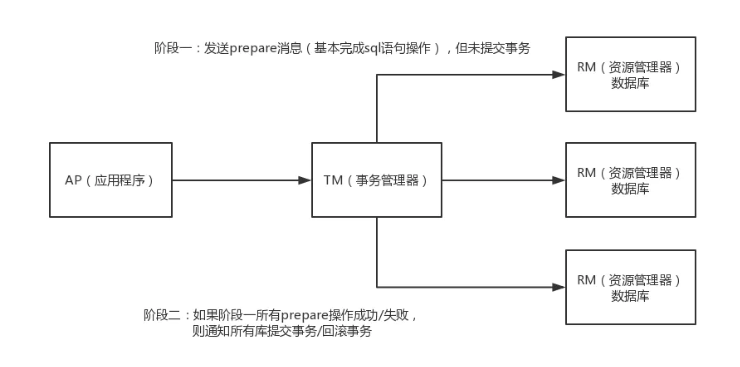
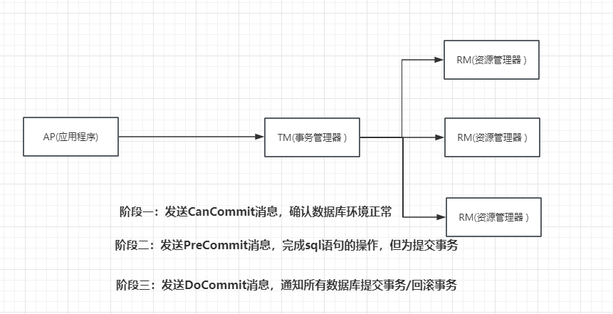

## 微服务、分布式

## 目录

-   [1、分布式和微服务的区别是什么？](#1分布式和微服务的区别是什么)
-   [2、什么是微服务架构？优势？特点？](#2什么是微服务架构优势特点)
-   [3、负载均衡算法、类型](#3负载均衡算法类型)
-   [4、分布式架构下，Session 共享有什么方案](#4分布式架构下Session-共享有什么方案)
-   [5、CAP理论，BASE理论](#5CAP理论BASE理论)
-   [6、分布式Id生成方案](#6分布式Id生成方案)
-   [7、分布式锁的解决方案](#7分布式锁的解决方案)
-   [8、实现一个分布式锁需要考虑哪些问题？](#8实现一个分布式锁需要考虑哪些问题)
-   [9、什么是分布式事务](#9什么是分布式事务)
-   [
    10、分布式事务解决方案](#10分布式事务解决方案)
-   [11、 什么是TCC，和2PC有什么区别？](#11-什么是TCC和2PC有什么区别)
-   [12、什么是柔性事务？](#12什么是柔性事务)
-   [13、如何基于本地消息表实现分布式事务？](#13如何基于本地消息表实现分布式事务)
-   [14、什么是Seata？他有哪几种模式？](#14什么是Seata他有哪几种模式)
-   [15、如何实现接口的幂等性](#15如何实现接口的幂等性)
    -   [1、token 机制](#1token-机制)
    -   [2、各种锁机制](#2各种锁机制)
    -   [3、各种唯一约束](#3各种唯一约束)
    -   [4、防重表](#4防重表)
-   [16、微服务架构的服务治理有哪些实现方案？](#16微服务架构的服务治理有哪些实现方案)

## 1、分布式和微服务的区别是什么？

分布式系统和微服务是两个相关但不同的概念，它们都涉及到软件架构中的组织和设计原则。以下是它们的区别：

1.  **定义和范围**：
    -   分布式系统：分布式系统是由多台计算机或服务器协同工作，通过网络通信来完成共同的任务。这些计算机可以分布在不同的地理位置，但它们通过网络连接进行协作。
    -   微服务：微服务是一种软件架构风格，将一个大型应用程序拆分成一组小型、独立的服务。每个微服务都专注于执行一个特定的业务功能，可以独立开发、部署和扩展。
2.  **关注点**：
    -   分布式系统：关注于如何将不同的计算机或服务器连接起来，以实现高性能、高可用性和负载均衡等目标。
    -   微服务：关注于如何将大型应用程序拆分成更小、更可管理的部分，并通过松耦合的方式来实现更灵活的开发、部署和维护。
3.  **通信方式**：
    -   分布式系统：分布式系统中的组件之间需要进行网络通信，常见的通信方式包括远程过程调用（RPC）、消息队列等。
    -   微服务：微服务之间通常使用HTTP等协议进行通信，可以通过RESTful API或其他通信方式来实现。
4.  **数据一致性**：
    -   分布式系统：在分布式系统中，确保数据一致性是一个挑战，需要考虑分布式事务、数据复制等问题。
    -   微服务：每个微服务可以拥有自己的数据存储，因此可以根据需求选择适当的数据库类型，并更容易管理数据一致性。
5.  **部署和扩展**：
    -   分布式系统：需要关注整体系统的部署和扩展，可能需要考虑多台服务器的管理和配置。
    -   微服务：每个微服务都可以独立部署和扩展，使得开发团队更容易管理和调整特定功能。

总的来说，分布式系统是一种基础架构模式，而微服务是一种架构风格。微服务通常可以在分布式系统中实现，但并不是所有分布式系统都采用微服务架构。微服务架构的主要目标是使开发、部署和维护更加灵活，适用于复杂的应用场景。

## 2、什么是微服务架构？优势？特点？

微服务架构是一种软件架构风格，将一个大型的应用程序拆分成多个小型、自治的服务单元，每个服务单元都专注于执行特定的业务功能。每个微服务可以独立开发、部署、扩展和维护，通过轻量级通信机制协同工作。微服务架构的优势和特点包括：

1.  **模块化与自治性**：微服务架构通过拆分应用为多个服务单元，使得开发团队可以更加专注于各自的业务领域。每个微服务都是独立的，有自己的代码、数据库、API等，可以在不影响其他服务的情况下进行修改和更新。
2.  **灵活性与快速交付**：微服务的自治性使得团队可以独立地开发、测试、部署和发布服务。这种独立性加速了开发周期，使团队能够更快地交付新功能和更新。
3.  **可扩展性**：微服务架构允许单独扩展每个服务，根据需求动态分配资源。这使得系统更具弹性，能够应对高负载和流量峰值。
4.  **技术多样性**：不同的微服务可以使用不同的技术栈，因为它们之间通过API通信。这允许团队选择最适合其任务的技术，而不受整个应用的技术限制。
5.  **容错性与隔离性**：由于微服务是自治的，一个服务的故障不会影响整个系统。故障在较小的范围内隔离，从而提高了整体系统的容错性。
6.  **持续集成与持续交付**：微服务架构有助于实现持续集成和持续交付，因为每个服务可以独立地构建、测试和发布。这有助于减少部署的风险，并快速响应用户需求。
7.  **灵活的团队组织**：微服务架构鼓励小团队负责特定的微服务，使得团队更加灵活，能够快速做出决策和调整。

然而，微服务架构也带来了一些挑战，如分布式系统的复杂性、服务间通信的管理、数据一致性等问题。对于不同的应用场景，需仔细权衡微服务的优势与挑战，以确定是否采用这种架构。

## 3、负载均衡算法、类型

**1、轮询法**
将请求按顺序轮流地分配到后端服务器上，它均衡地对待后端的每一台服务器，而不关心服务器实际的连接数和当前的系统负载。

**2、随机法**
通过系统的随机算法，根据后端服务器的列表大小值来随机选取其中的一台服务器进行访问。由概率统计理论可以得知，随着客户端调用服务端的次数增多，其实际效果越来越接近于平均分配调用量到后端的每一台服务器，也就是轮询的结果。

**3、源地址哈希法**
源地址哈希的思想是根据获取客户端的IP地址，通过哈希函数计算得到的一个数值，用该数值对服务器列表的大小进行取模运算，得到的结果便是客服端要访问服务器的序号。采用源地址哈希法进行负载均衡，同一IP地址的客户端，当后端服务器列表不变时，它每次都会映射到同一台后端服务器进行访问。

**4、加权轮询法**
不同的后端服务器可能机器的配置和当前系统的负载并不相同，因此它们的抗压能力也不相同。给配置高、负载低的机器配置更高的权重，让其处理更多的请；而配置低、负载高的机器，给其分配较低的权重，降低其系统负载，加权轮询能很好地处理这一问题，并将请求顺序且按照权重分配到后端。

**5、加权随机法**
与加权轮询法一样，加权随机法也根据后端机器的配置，系统的负载分配不同的权重。不同的是，它是按照权重随机请求后端服务器，而非顺序。

**6、最小连接数法**
最小连接数算法比较灵活和智能，由于后端服务器的配置不尽相同，对于请求的处理有快有慢，它是根据后端服务器当前的连接情况，动态地选取其中当前积压连接数最少的一台服务器来处理当前的请求，尽可能地提高后端服务的利用效率，将负责合理地分流到每一台服务器。

**类型：**
1、DNS 方式实现负载均衡
2、硬件负载均衡：F5 和 A10
3、软件负载均衡：Nginx 、 HAproxy 、 LVS&#x20;

其中的区别：
Nginx ：七层负载均衡，支持 HTTP、E-mail 协议，同时也支持 4 层负载均衡；
HAproxy ：支持七层规则的，性能也很不错。OpenStack 默认使用的负载均衡软件就是
HAproxy；
LVS ：运行在内核态，性能是软件负载均衡中最高的，严格来说工作在三层，所以更通用一些，
适用各种应用服务。

## 4、分布式架构下，Session 共享有什么方案

-   采用无状态服务，抛弃Session，使用中间件存储，比如MySQL/Redis等。

&#x20;    把 Session 放到 Redis 中存储，虽然架构上变得复杂，并且需要多访问一次 Redis ，但是这种方案带来的好处也是很大的。

-   存入cookie（要考虑跨域问题，且有安全风险）
-   Tomcat集群Session同步
-   使用Spring-Session
-   IP 绑定策略

&#x20;     使用 Nginx （或其他复杂均衡软硬件）中的 IP 绑定策略，同一个 IP 只能在指定的同一个机器访问，但是这样做失去了负载均衡的意义，当挂掉一台服务器的时候，会影响一批用户的使用，风险很大；

**实现了 Session 共享好处；**
1、可以水平扩展（增加 Redis 服务器）；
2、服务器重启 Session 不丢失（不过也要注意 数据在 Redis 中的刷新/失效机制）；
3、不仅可以跨服务器 Session 共享，甚至可以跨平台（例如网页端和 APP 端）；

## 5、CAP理论，BASE理论

**Consistency (一致性)：**
即更新操作成功并返回客户端后，所有节点在同一时间的数据完全一致。
对于客户端来说，一致性指的是并发访问时更新过的数据如何获取的问题。
从服务端来看，则是更新后如何复制分布到整个系统，以保证数据最终一致。

**Availability (可用性):**
即服务一直可用，而且是正常响应时间。系统能够很好的为用户服务，不出现用户操作失败或者访问超时等用户体验不好的情况。

**Partition Tolerance (分区容错性):**
即分布式系统在遇到某节点或网络分区故障的时候，仍然能够对外提供满足一致性和可用性的服务。分区容错性要求能够使应用虽然是一个分布式系统，而看上去却好像是在一个可以运转正常的整体。比如现在的分布式系统中有某一个或者几个机器宕掉了，其他剩下的机器还能够正常运转满足系统需求，对于用户而言并没有什么体验上的影响。

CP和AP：分区容错是必须保证的，当发生网络分区的时候，如果要继续服务，那么强一致性和可用性只能 2 选 1。

**BASE是Basically Available（基本可用）、Soft state（软状态）和Eventually consistent（最终一致性）**

BASE理论是对CAP中一致性和可用性权衡的结果，其来源于对大规模互联网系统分布式实践的总结，是基于CAP定理逐步演化而来的。BASE理论的核心思想是：即使无法做到强一致性，但每个应用都可以根据自身业务特点，采用适当的方式来使系统达到最终一致性。

**基本可用**：

-   响应时间上的损失: 正常情况下，处理用户请求需要 0.5s 返回结果，但是由于系统出现故障，处理用户请求的时间变为 3 s。
    系统功能上的损失：正常情况下，用户可以使用系统的全部功能，但是由于系统访问量突然剧增，系统的部分非核心功能无法使用。

**软状态：** 数据同步允许一定的延迟

**最终一致性：** 系统中所有的数据副本，在经过一段时间的同步后，最终能够达到一个一致的状态，不要求实时。

## 6、分布式Id生成方案

-   uuid

```text
1：当前日期和时间 时间戳
2：时钟序列。 计数器
3：全局唯一的IEEE机器识别号，如果有网卡，从网卡MAC地址获得，没有网卡以其他方式获得。

优点：代码简单，性能好（本地生成，没有网络消耗），保证唯一（相对而言，重复概率极低可以忽
略）
缺点：
1)每次生成的ID都是无序的，而且不是全数字，且无法保证趋势递增。
2)UUID生成的是字符串，字符串存储性能差，查询效率慢，写的时候由于不能产生顺序的append
操作，在进行insert操作，可能会导致频繁的页分裂，这种操作在记录占用空间比较大的情况下，性
能下降比较大，还会增加读取磁盘次数。
3)UUID长度过长，不适用于存储，耗费数据库性能。
4)ID无一定业务含义，可读性差。
```

-   数据库自增序列

```纯文本
单机模式： 
 优点： 
实现简单，依靠数据库即可，成本小。
ID数字化，单调自增，满足数据库存储和查询性能。
具有一定的业务可读性。（结合业务code）

 缺点： 
强依赖DB，存在单点问题，如果数据库宕机，则业务不可用。
DB生成ID性能有限，单点数据库压力大，无法扛高并发场景。
信息安全问题，比如暴露订单量，url查询改一下id查到别人的订单
分布式下生成的id会重复

 数据库高可用： 多主模式做负载，基于序列的起始值和步长设置，不同的初始值，相同的步长，步长大
于等于节点数。
 优点： 
解决了ID生成的单点问题，同时平衡了负载。
解决了分布式环境下id重复问题。
 缺点： 
系统扩容困难：系统定义好步长之后，增加机器之后调整步长困难。
主从同步的时候：电商下单->支付insert master db select数据 ，因为数据同步延迟导致
查不到这个数据。加cache(不是最好的解决方式)数据要求比较严谨的话查master主库。
```

-   基于redis、mongodb、zk等中间件生成
-   雪花算法

```纯文本
生成一个64bit的整性数字
第一位符号位固定为0，41位时间戳，10位workId，12位序列号
位数可以有不同实现。

 优点： 
每个毫秒值包含的ID值很多，不够可以变动位数来增加，性能佳（依赖workId的实现）。
时间戳值在高位，中间是固定的机器码，自增的序列在低位，整个ID是趋势递增的。
能够根据业务场景数据库节点布置灵活挑战bit位划分，灵活度高。

 缺点： 
强依赖于机器时钟，如果时钟回拨，会导致重复的ID生成，所以一般基于此的算法发现时钟回拨，
都会抛异常处 理，阻止ID生成，这可能导致服务不可用
```

## 7、分布式锁的解决方案

需要这个锁独立于每一个服务之外，而不是在服务里面。

**数据库**：利用主键冲突控制一次只有一个线程能获取锁，非阻塞、不可重入、单点、失效时间。
**Zookeeper分布式锁**：

```纯文本
zk通过临时节点，解决了死锁的问题，一旦客户端获取到锁之后突然挂掉（Session连接断开），那么这个临
时节点就会自动删除掉，其他客户端自动获取锁。临时顺序节点解决惊群效应
```

**Redis分布式锁**：setNX，单线程处理网络请求，不需要考虑并发安全性。
所有服务节点设置相同的key，返回为0、则锁获取失败

```纯文本
setnx
问题：
1、早期版本没有超时参数，需要单独设置，存在死锁问题（中途宕机）。
2、后期版本提供加锁与设置时间原子操作，但是存在任务超时，锁自动释放，导致并发问题，加锁与释
放锁不是同一线程问题。
```

删除锁：判断线程唯一标志，再删除。
可重入性及锁续期没有实现，通过redisson解决（类似AQS的实现，看门狗监听机制）
redlock：意思的机制都只操作单节点、即使Redis通过sentinel保证高可用，如果这个master节点由于
某些原因发生了主从切换，那么就会出现锁丢失的情况（redis同步设置可能数据丢失）。redlock从多
个节点申请锁，当一半以上节点获取成功、锁才算获取成功，redission有相应的实现。

## 8、实现一个分布式锁需要考虑哪些问题？

实现一个分布式锁时，需要考虑以下几个问题：

1.  锁的唯一性：在分布式环境下，需要确保同一把锁在不同的节点之间是唯一的。可以使用全局唯一标识符（例如基于ZooKeeper或Redis的分布式锁）来确保锁的唯一性。
2.  死锁和活锁：分布式环境下的死锁和活锁是需要避免的问题。死锁是指多个节点互相等待对方释放锁的情况，而活锁是指多个节点不断争夺锁资源，但没有一个节点能够成功获取锁。为了避免死锁和活锁，可以使用超时机制、重试机制、随机等待时间等策略来解决。
3.  锁的可重入性：分布式锁是否支持可重入是需要考虑的问题。可重入意味着同一个线程可以多次获取同一把锁，而不会发生死锁。在实现分布式锁时，需要考虑是否支持可重入，并在实现时进行相应的处理。
4.  锁的粒度：锁的粒度是指锁的范围，即锁定的是整个系统、模块、方法还是更细粒度的资源。在分布式环境下，锁的粒度需要根据实际需求进行选择，避免锁的范围大或过小。
5.  锁的性能和可靠性：分布式锁的性能和可靠性是需要考虑的问题。锁的获取和释放需要保证高效且可靠，同时要考虑网络延迟、节点故障等因素对锁性能和可靠性的影响。
6.  锁的容错和容量：在分布式环境下，需要考虑节点故障和网络分区等异常情况对锁的影响。可以使用多个节点进行容错和冗余，以确保锁的可用性和容量。

综上所述，实现一个分布式锁需要考虑锁的唯一性、死锁和活锁、锁的可重入性、锁的粒度、锁的性能和可靠性，以及锁的容错和容量等问题。根据具体需求选择适合的分布式锁方案，并在实现时合理处理这些问题。

## 9、什么是分布式事务

分布式事务是指在分布式系统中涉及多个独立的数据库或服务的事务操作，它需要确保这些操作要么全部成功执行，要么全部回滚，以保持数据的一致性和可靠性。分布式事务的目标是在不同的系统之间维护数据的一致性，即使在出现故障或部分操作失败的情况下也能够保持数据的正确性。

在传统的单一数据库事务中，事务是由数据库管理系统负责管理和保障的，但在分布式环境下，涉及到多个独立的数据库或服务，各自拥有独立的事务管理机制，因此需要特殊的方法来确保分布式事务的一致性。

分布式事务面临的挑战和问题包括：

原子性（Atomicity）： 分布式事务需要确保涉及的所有操作要么都成功执行，要么都回滚，不能出现部分操作成功而部分操作失败的情况。

一致性（Consistency）： 分布式事务需要保证各个参与方的数据保持一致性，即在事务开始和结束时，系统的数据状态应该满足特定的约束。

隔离性（Isolation）： 分布式事务的操作应该与其他事务隔离，避免不同事务之间的干扰和冲突。

持久性（Durability）： 分布式事务需要确保在事务提交后，其结果被可靠地持久化，以防止数据丢失。

为了实现分布式事务，有一些常见的方法和技术，包括两阶段提交（Two-Phase Commit，2PC）、三阶段提交（Three-Phase Commit，3PC）、补偿事务（Compensating Transaction）等。这些方法在不同的场景下有不同的适用性和权衡，开发人员需要根据系统的需求和复杂性选择适合的方法来处理分布式事务。同时，分布式事务的实现也需要考虑到性能、可靠性和复杂性等方面的因素。

## 10、分布式事务解决方案

XA规范：分布式事务规范，定义了分布式事务模型
四个角色：事务管理器(协调者TM)、资源管理器(参与者RM)，应用程序AP，通信资源管理器CRM。
全局事务：一个横跨多个数据库的事务，要么全部提交、要么全部回滚JTA事务时java对XA规范的实现，对应JDBC的单库事务

1、**两阶段协议：**



**第一阶段**（ prepare ） ：每个参与者执行本地事务但不提交，进入 ready 状态，并通知协调者已经准备就绪。

**第二阶段**（ commit ） 当协调者确认每个参与者都 ready 后，通知参与者进行 commit 操作；如果有参与者 fail ，则发送 rollback 命令，各参与者做回滚。

问题：
**单点故障：** 一旦事务管理器出现故障，整个系统不可用（参与者都会阻塞住）**数据不一致**：在阶段二，如果事务管理器只发送了部分 commit 消息，此时网络发生异常，那么
只有部分参与者接收到 commit 消息，也就是说只有部分参与者提交了事务，使得系统数据不一
致。
**响应时间较长**：参与者和协调者资源都被锁住，提交或者回滚之后才能释放
**不确定性**：当协事务管理器发送 commit 之后，并且此时只有一个参与者收到了 commit，那么当该参与者与事务管理器同时宕机之后，重新选举的事务管理器无法确定该条消息是否提交成功。

**2、三阶段协议：** 主要是针对两阶段的优化，解决了2PC单点故障的问题，但是性能问题和不一致问题仍然没有根本解决。



引入了超时机制解决参与者阻塞的问题，超时后本地提交，2pc只有协调者有超时机制。

**第一阶段**：CanCommit阶段，协调者询问事务参与者，是否有能力完成此次事务。

-   如果都返回yes，则进入第二阶段：
-   有一个返回no或等待响应超时，则中断事务，并向所有参与者发送abort请求。

**第二阶段**：PreCommit阶段，此时协调者会向所有的参与者发送PreCommit请求，参与者收到后开始执行事务操作。参与者执行完事务操作后（此时属于未提交事务的状态），就会向协调者反馈“Ack”表示我已经准备好提交了，并等待协调者的下一步指令。

**第三阶段**：DoCommit阶段， 在阶段二中如果所有的参与者节点都返回了Ack，那么协调者就会从“预提交状态”转变为“提交状态”。然后向所有的参与者节点发送"doCommit"请求，参与者节点在收到提交请求后就会各自执行事务提交操作，并向协调者节点反馈“Ack”消息，协调者收到所有参与者的Ack消息后完成事务。 相反，如果有一个参与者节点未完成PreCommit的反馈或者反馈超时，那么协调者都会向所有的参与者节点发送abort请求，从而中断事务。

**3、TCC（补偿事务）**：Try、Confirm、Cancel
针对每个操作，都要注册一个与其对应的确认和补偿（撤销）操作Try操作做业务检查及资源预留，Confirm做业务确认操作，Cancel实现一个与Try相反的操作既回滚操作。TM首先发起所有的分支事务的try操作，任何一个分支事务的try操作执行失败，TM将会发起所有
分支事务的Cancel操作，若try操作全部成功，TM将会发起所有分支事务的Confirm操作，其中Confirm/Cancel操作若执行失败，TM会进行重试。

TCC模型对业务的侵入性较强，改造的难度较大，每个操作都需要有 try 、 confirm 、 cancel 三个接口实现。
confirm 和 cancel 接口还必须实现幂等性。

**4、消息队列的事务消息：**

-   发送prepare消息到消息中间件
-   发送成功后，执行本地事务
    如果事务执行成功，则commit，消息中间件将消息下发至消费端（commit前，消息不会被
    消费）
    如果事务执行失败，则回滚，消息中间件将这条prepare消息删除
    消费端接收到消息进行消费，如果消费失败，则不断重试。

需要注意的是，每种分布式事务处理方法都有其适用的场景和权衡。选择适当的方法取决于系统的要求、复杂性和可用技术栈。

## 11、 什么是TCC，和2PC有什么区别？

TCC（Try-Confirm-Cancel）和2PC（Two-Phase Commit）都是用于处理分布式事务的协议，但它们在处理方式和适用场景上存在一些区别。

TCC (Try-Confirm-Cancel): TCC是一种分布式事务处理方法，它将事务拆分为三个阶段：尝试（Try）、确认（Confirm）和取消（Cancel）。每个阶段都有相应的操作。在尝试阶段，参与者尝试执行事务操作，检查是否满足执行条件。如果所有参与者的尝试都成功，进入确认阶段，参与者确认执行事务。如果任何一个参与者的尝试失败或确认阶段失败，将进入取消阶段，执行事务的补偿操作来恢复系统到一致状态。TCC注重于事务的补偿机制，以确保数据的一致性。

2PC (Two-Phase Commit): 2PC是另一种分布式事务处理协议，它在全局协调器和多个参与者之间进行通信。它有两个阶段：准备（Prepare）和提交（Commit）。在准备阶段，全局协调器将询问所有参与者是否可以执行事务，参与者会回复“可以”或“不可以”。如果所有参与者都回复“可以”，则进入提交阶段，在此阶段全局协调器通知所有参与者提交事务。如果任何一个参与者回复“不可以”，全局协调器会通知所有参与者中止事务。2PC依赖于中心化的协调器，其缺点包括单点故障和阻塞的可能性。

区别:

处理方式： TCC采用尝试-确认-取消的模式，强调补偿机制，而2PC采用两阶段提交的方式，依赖全局协调器来决定提交或中止事务。

灵活性： TCC相对更加灵活，因为它允许开发人员在尝试和确认阶段之间插入补偿逻辑。2PC较为严格，需要参与者在准备阶段做出确定性的回应。

复杂性和性能： TCC通常比2PC更适用于高并发环境，因为它的操作相对较轻，而2PC的中心化协调可能导致性能瓶颈。

可用性： TCC通常在局部事务级别上具有更好的可用性，因为每个参与者可以独立决定是否尝试事务。

在选择TCC还是2PC时，需要根据系统的需求、复杂性和可靠性等因素进行权衡。

## 12、什么是柔性事务？

柔性事务（Flexible Transactions）是一种用于分布式系统中的事务处理模式，旨在处理跨多个参与者的分布式事务。在分布式环境中，事务涉及到多个资源或服务，需要保证数据的一致性和可靠性。柔性事务是为了在分布式系统中实现事务处理的灵活性和可扩展性而设计的。

柔性事务模式通常允许开发人员在事务的各个阶段插入逻辑，以便在出现错误或异常情况时进行处理。这种模式的核心思想是，将事务处理拆分为三个阶段：尝试（Try）、确认（Confirm）和取消（Cancel）。

尝试（Try）： 在这个阶段，事务的参与者尝试执行操作，并在操作完成之前不对外部资源产生影响。这是一个"预提交"的阶段，用于检查所有资源是否可用，并为后续的确认阶段做准备。

确认（Confirm）： 如果所有参与者的尝试阶段都成功，那么系统会进入确认阶段。在这个阶段，参与者提交事务，并将操作的结果应用到资源中。如果在这个阶段发生了错误，可以触发补偿逻辑，回滚之前的操作，以确保数据的一致性。

取消（Cancel）： 如果在确认阶段发生错误，系统会进入取消阶段。在这个阶段，参与者会执行回滚操作，将之前尝试阶段所做的更改撤销，以保持数据的一致性。

柔性事务相对于传统的两阶段提交（2PC）来说，具有更高的灵活性和可用性。它允许在不同的阶段插入补偿逻辑，以应对各种异常情况，同时减少了全局协调器的依赖，从而降低了性能瓶颈的风险。这使得柔性事务在高并发和复杂的分布式系统中更具优势。

## 13、如何基于本地消息表实现分布式事务？

当基于本地消息表实现分布式事务时，通常会采用一种称为“基于消息的最终一致性”或“最终一致性补偿”模式。这个模式可以帮助在分布式环境中处理事务性操作，同时保持数据的一致性。

以下是基于本地消息表实现分布式事务的一般步骤：

操作记录与消息发送： 当一个分布式事务发起时，主节点（或服务）将事务操作记录到本地数据库，并将一个消息发送到消息队列中。这个消息包含了执行的操作、事务标识以及其他必要的信息。

消息传递与处理： 其他参与者节点在收到消息后，根据消息中的操作类型执行相应的本地操作。这些本地操作可能会修改各个节点的数据状态，但在这个阶段不会立即确认事务的完成。

确认阶段： 在所有参与者节点执行完本地操作后，各节点会将一个确认消息发送回主节点。主节点根据收到的确认消息来判断是否可以提交事务。如果有任何错误发生，主节点可以触发补偿逻辑。

补偿阶段： 如果在确认阶段发生错误，主节点可以通过发送补偿消息来触发参与者节点执行相反的操作，以撤销之前的更改，从而保持数据的一致性。这就是所谓的“最终一致性补偿”。

完成或取消： 一旦确认阶段中的所有参与者节点都成功确认，事务被视为成功完成。如果在确认阶段有任何错误，主节点会触发取消操作，参与者节点会执行补偿操作，将数据状态还原到事务开始前的状态。

基于本地消息表的分布式事务实现主要依赖于消息队列的可靠性和分布式事务的补偿能力。这种模式可以提高分布式系统的可用性和容错性，但同时也需要在应用程序中实现正确的补偿逻辑来处理可能的异常情况。

## 14、什么是Seata？他有哪几种模式？

Seata是由阿里巴巴开源的一款分布式事务解决方案，旨在解决分布式系统中的数据一致性问题。Seata提供了一套事务管理的解决方案，支持对分布式事务进行管理和协调。

Seata有以下三种常见的模式：

1 AT模式（Automatic Transaction）：AT模式是Seata最常用的模式，它基于数据库的本地事务实现分布式事务的一致性。在AT模式下，Seata通过拦截数据访问层的SQL操作，并将这些操作封装在一个全局事务中。Seata通过将事务信息存储在全局事务上下文中，并协调各个分支事务的提交或回滚来实现式事务的一致性。

2 TCC模式（Try-Confirm-Cancel）：TCC模式是一种补偿型的分布式事务模式。在TCC模式下，Seata通过定义三个阶段的操作：Try阶段尝试执行业务操作、Confirm阶段确认执行操作、Cancel阶段撤销执行操作。Seata通过补偿机制来保证分布式事务的一致性，即使在异常情况下也能够进行回滚或补偿。

3 Saga模式：Saga模式是一种长事务的分布式事务模式，通过将业务操作分解为一系列的子事务来实现。每个子事务都有自己的回滚操作，从而实现了分布式事务的逐步提交和回滚。Saga模式通过异步消息和补偿机制来实现事务的提交和回滚。

这三种模式在不同的场景下可以根据实际需求进行选择和组合使用，以满足分布式系统的事务管理需求。

## 15、如何实现接口的幂等性

##### **1、token 机制**

1、服务端提供了发送 token 的接口。我们在分析业务的时候，哪些业务是存在幂等问题的，
就必须在执行业务前，先去获取 token，服务器会把 token 保存到 redis 中。
2、然后调用业务接口请求时，把 token 携带过去，一般放在请求头部。
3、服务器判断 token 是否存在 redis 中，存在表示第一次请求，然后删除 token,继续执行业
务。
4、如果判断 token 不存在 redis 中，就表示是重复操作，直接返回重复标记给 client，这样
就保证了业务代码，不被重复执行。

**危险性：**
1、先删除 token 还是后删除 token；
(1) 先删除可能导致，业务确实没有执行，重试还带上之前 token，由于防重设计导致，
请求还是不能执行。
(2) 后删除可能导致，业务处理成功，但是服务闪断，出现超时，没有删除 token，别
人继续重试，导致业务被执行两边
(3) 我们最好设计为先删除 token，如果业务调用失败，就重新获取 token 再次请求。
2、Token 获取、比较和删除必须是原子性
(1) redis.get(token) 、token.equals、redis.del(token)如果这两个操作不是原子，可能导
致，高并发下，都 get 到同样的数据，判断都成功，继续业务并发执行
(2) 可以在 redis 使用 lua 脚本完成这个操作。

```java
if redis.call('get', KEYS[1]) == ARGV[1] then return redis.call('del', KEYS[1]) else return 0 end
```

##### **2、各种锁机制**

**1、数据库悲观锁**

**2、数据库乐观锁**
这种方法适合在更新的场景中，
update t\_goods set count = count -1 , version = version + 1 where good\_id=2 and version = 1根据 version 版本，也就是在操作库存前先获取当前商品的 version 版本号，然后操作的时候带上此 version 号。我们梳理下，我们第一次操作库存时，得到 version 为 1，调用库存服务version 变成了 2；但返回给订单服务出现了问题，订单服务又一次发起调用库存服务，当订
单服务传如的 version 还是 1，再执行上面的 sql 语句时，就不会执行；因为 version 已经变
为 2 了，where 条件就不成立。这样就保证了不管调用几次，只会真正的处理一次。

**3、业务层分布式锁**
如果多个机器可能在同一时间同时处理相同的数据，比如多台机器定时任务都拿到了相同数
据处理，我们就可以加分布式锁，锁定此数据，处理完成后释放锁。获取到锁的必须先判断
这个数据是否被处理过。

##### 3、各种唯一约束

**1、数据库唯一约束**
插入数据，应该按照唯一索引进行插入，比如订单号，相同的订单就不可能有两条记录插入。
我们在数据库层面防止重复。
这个机制是利用了数据库的主键唯一约束的特性，解决了在 insert 场景时幂等问题。但主键
的要求不是自增的主键，这样就需要业务生成全局唯一的主键。
如果是分库分表场景下，路由规则要保证相同请求下，落地在同一个数据库和同一表中，要
不然数据库主键约束就不起效果了，因为是不同的数据库和表主键不相关。

**2、redis set 防重**
很多数据需要处理，只能被处理一次，比如我们可以计算数据的 MD5 将其放入 redis 的 set，
每次处理数据，先看这个 MD5 是否已经存在，存在就不处理。

##### **4、防重表**

使用订单号 orderNo 做为去重表的唯一索引，把唯一索引插入去重表，再进行业务操作，且
他们在同一个事务中。这个保证了重复请求时，因为去重表有唯一约束，导致请求失败，避
免了幂等问题。这里要注意的是，去重表和业务表应该在同一库中，这样就保证了在同一个
事务，即使业务操作失败了，也会把去重表的数据回滚。这个很好的保证了数据一致性。

## 16、微服务架构的服务治理有哪些实现方案？

微服务架构的服务治理有以下几种实现方案：

1.  服务注册与发现：使用服务注册表来管理所有微服务的信息，包括服务名称、地址、版本等。服务提供者将自己的信息注册到注册表中，服务消费者通过注册表来发现可用的服务。常见的服务注册与发现工具有Consul、ZooKeeper和etcd等。
2.  负载均衡：通过在服务提供者与服务消费者之间引入负载均衡器，将请求平均分配到多个服务实例上，以提高系统的可伸缩性和可用性。常见的负载均衡器有Nginx、HAProxy和Envoy等。
3.  健康检查与容错机制：通过定期的健康检查来监测服务的可用性和状态，并根据检查结果进行容错处理，比如自动剔除不可用的服务实例。常见的健康检查工具有Spring Cloud的Spring Boot Admin、Netflix的Hystrix和Istio等。
4.  熔断器与降级：在高并发或异常情况下，通过熔断器来控制请求的流量，避免服务的雪崩效应。同时可以通过降级策略，在服务不可用时返回默认值或者静态数据，保证系统的可用性。常见的熔断器和降级工具有Netflix的Hystrix和Sentinel等。
5.  配置中心：将微服务的配置集中管理，实现配置的动态更新和版本控制。通过配置中心，可以动态修改微服务的配置，而无需重启服务。常见的配置中心有Spring Cloud Config、Apollo和Consul等。
6.  API 网关：通过引入 API 网关来对外暴露微服务的统一接口，实现请求的路由、转发和过滤等功能。API 网关可以对请求进行鉴权和限流，提供统一的访问控制和监控。常见的 API 网关有Spring Cloud Gateway、Netflix的Zuul和Kong等。

以上是常见的微服务架构的服务治理实现方案，可以根据实际需求选择适合的方案进行使用。
