# 一、相似概念辨析

## 1、程序、进程、线程

### ①程序

程序从开发到发布的过程：源程序（源代码） → 打包封装 → 应用软件

笼统的来说，源程序、应用软件都可以称之为『程序』。

相对于进程、线程来说，程序是一个**静态**的概念。

### ②进程

- 内部视角：程序运行起来就是一个进程。所以相对于程序来说，进程是一个**动态**的概念。
- 外部视角：站在操作系统的层次上来说，现代的大型操作系统都是支持多进程模式运行的，这样操作系统就可以同时执行很多个任务。

### ③线程

在一个进程中，需要同时处理多个不同任务，每一个任务由一个线程来执行。从这个意义上来说，我们可以<span style="color:blue;font-weight:bold;">
把进程看做是线程的容器</span>。


<br/>

## 2、串行、并行、并发

### ①串行

多个操作**在同一个线程内**按顺序执行。这种情况下的工作模式我们往往也称之为：**同步**
。按照同步模式执行的多个操作，当前操作没有结束时，下一个操作就必须**等待**。处于等待中的状态往往也称为：**阻塞**（block）。

### ②并行、并发

并行和并发都是以异步的模式来执行操作的。**异步**工作模式下不同线程内的操作互相不需要等待。

- 并行：多个 CPU（或 CPU 核心）同时执行多个任务
- 并发：一个 CPU（或 CPU 核心）同时执行多个任务

## 3、sleep() 和 wait() 区别

二者最关键的区别是下面两点：

- sleep() 会让线程**拿着锁**去睡
- wait() 会让线程**放开锁**去睡

### ①sleep() 进入等待状态不释放锁

```Java
// 1、创建一个对象，作为锁对象
Object lockObj=new Object();

// 2、创建执行 sleep 的线程
        new Thread(()->{

        System.out.println(Thread.currentThread().getName()+" begin");
// ※ 两个线程使用同一个锁对象，就会存在竞争关系
synchronized (lockObj){
        System.out.println(Thread.currentThread().getName()+" get lock");
        try{

        // ※ sleep() 方法拿着锁去睡
        TimeUnit.SECONDS.sleep(5);
        }catch(InterruptedException e){
        e.printStackTrace();
        }
        System.out.println(Thread.currentThread().getName()+" release lock");

        }
        System.out.println(Thread.currentThread().getName()+" end");

        },"thread-a").start();

// ※ 让主线程睡一会儿，确保 a 线程先启动
        try{TimeUnit.SECONDS.sleep(1);}catch(InterruptedException e){}

// 3、创建竞争锁的线程
        new Thread(()->{

        System.out.println(Thread.currentThread().getName()+" begin");
// ※ 两个线程使用同一个锁对象，就会存在竞争关系
synchronized (lockObj){
        System.out.println(Thread.currentThread().getName()+" get lock");
        }

        System.out.println(Thread.currentThread().getName()+" end");
        },"thread-b").start();
```

打印结果：

> thread-a begin
> thread-a get lock
> thread-b begin
> thread-a release lock
> thread-b get lock
> thread-b end
> thread-a end

### ②wait() 进入等待状态释放锁

```Java
// 1、创建一个对象，作为锁对象
Object lockObj=new Object();

// 2、创建执行 sleep 的线程
        new Thread(()->{

        System.out.println(Thread.currentThread().getName()+" begin");
// ※ 两个线程使用同一个锁对象，就会存在竞争关系
synchronized (lockObj){
        System.out.println(Thread.currentThread().getName()+" get lock");
        try{

        // ※ wait() 方法放开锁去睡
        lockObj.wait(5000);

        }catch(InterruptedException e){
        e.printStackTrace();
        }
        System.out.println(Thread.currentThread().getName()+" release lock");

        }
        System.out.println(Thread.currentThread().getName()+" end");

        },"thread-a").start();

// ※ 让主线程睡一会儿，确保 a 线程先启动
        try{TimeUnit.SECONDS.sleep(1);}catch(InterruptedException e){}

// 3、创建竞争锁的线程
        new Thread(()->{

        System.out.println(Thread.currentThread().getName()+" begin");
// ※ 两个线程使用同一个锁对象，就会存在竞争关系
synchronized (lockObj){
        System.out.println(Thread.currentThread().getName()+" get lock");
        }

        System.out.println(Thread.currentThread().getName()+" end");
        },"thread-b").start();

```

打印结果：

> thread-a begin
> thread-a get lock
> thread-b begin
> thread-b get lock
> thread-b end
> thread-a release lock
> thread-a end

### ③小结

| 比较的内容   | wait()                | sleep()                |
|---------|------------------------|--------------|
| 声明位置    | Object 类               | Thread 类     |
| 影响线程的方式 | 通过调用 wait() 方法的对象影响到线程 | 直接影响当前线程     |
| 性质      | 非静态方法                  | 静态方法         |
| 释放锁资源   | **放开锁进入等待**            | **不释放锁进入等待** |
| 同步要求    | 必须在同步上下文中使用            | 不要求在同步上下文中   |
| 应用场景    | 用于线程间通信                | 用来让线程暂停一段时间  |

<br/>

## 4、同步方法和同步代码块

### ①对比

#### [1]相同点

都会用到synchronized关键字。

#### [2]区别

|比较的方面|同步代码块|同步方法|
|---|---|---|
|锁定的范围|代码块自身的范围|整个方法体|
|锁对象|传入对象就是锁对象|静态同步方法：方法所在类.class<br/>非静态同步方法：this|

<br/>

### ②同步方法锁对象案例

#### [1]第一种情况

```Java
public class Demo04SynchMethod {

    // 第一种情况：用同一个对象调用两个非静态的同步方法
    // 执行的效果：等发短信执行完成之后，才打印打电话
    public static void situation01(String[] args) {

        // 1、创建 Phone 对象作为多个线程共享的对象
        Phone phone = new Phone();

        // 2、创建发短信的线程
        new Thread(() -> {

            phone.sendShortMessage();

        }, "thread-a").start();

        try {
            TimeUnit.SECONDS.sleep(1);
        } catch (InterruptedException e) {
        }

        // 3、创建打电话的线程
        new Thread(() -> {

            phone.call();

        }, "thread-b").start();

    }

}

class Phone {

    // this
    public synchronized void sendShortMessage() {

        System.out.println(Thread.currentThread().getName() + " 发短信");

        try {
            TimeUnit.SECONDS.sleep(5);
        } catch (InterruptedException e) {
        }
    }

    // this
    public synchronized void call() {
        System.out.println(Thread.currentThread().getName() + " 打电话");
    }

}
```

#### [2]第二种情况

```Java
// 第二种情况：用两个不同的对象调用分别两个非静态的同步方法
// 执行的效果：各自执行，不需要等待
// 1、创建 Phone 对象作为多个线程共享的对象
Phone phone01=new Phone();
        Phone phone02=new Phone();

// 2、创建发短信的线程
        new Thread(()->{

        phone01.sendShortMessage();

        },"thread-a").start();

        try{TimeUnit.SECONDS.sleep(1);}catch(InterruptedException e){}

// 3、创建打电话的线程
        new Thread(()->{

        phone02.call();

        },"thread-b").start();
```

#### [3]第三种情况

```Java
public class Demo04SynchMethod {

    // 第三种情况：两个线程分别调用两个静态同步方法
    // 执行效果：等发短信执行完成之后，才打印打电话
    public static void main(String[] args) {

        // 1、创建 A 线程发短信
        new Thread(() -> {

            Phone.sendShortMessage();

        }, "thread-a").start();

        try {
            TimeUnit.SECONDS.sleep(1);
        } catch (InterruptedException e) {
        }

        // 2、创建 B 线程打电话
        new Thread(() -> {

            Phone.call();

        }, "thread-b").start();

    }

}

class Phone {

    // Phone.class
    public static synchronized void sendShortMessage() {

        System.out.println(Thread.currentThread().getName() + " 发短信");

        try {
            System.out.println(Thread.currentThread().getName() + " 开始睡觉");
            TimeUnit.SECONDS.sleep(5);
            System.out.println(Thread.currentThread().getName() + " 结束睡觉");
        } catch (InterruptedException e) {
        }
    }

    // Phone.class
    public static synchronized void call() {
        System.out.println(Thread.currentThread().getName() + " 打电话");
    }

}
```

#### [4]第四种情况

```Java
public class Demo04SynchMethod {

    public static void main(String[] args) {

        // 第四种情况：类名调用静态同步方法；对象调用非静态同步方法
        // 执行效果：各自执行，不需要等待
        // 1、创建 A 线程发短信
        new Thread(() -> {

            Phone.sendShortMessage();

        }, "thread-a").start();

        try {
            TimeUnit.SECONDS.sleep(2);
        } catch (InterruptedException e) {
        }

        // 2、创建 Phone 对象
        Phone phone = new Phone();

        // 3、创建 B 线程打电话
        new Thread(() -> {

            phone.call();

        }, "thread-b").start();
    }
}

class Phone {

    // Phone.class
    public static synchronized void sendShortMessage() {

        System.out.println(Thread.currentThread().getName() + " 发短信");

        try {
            System.out.println(Thread.currentThread().getName() + " 开始睡觉");
            TimeUnit.SECONDS.sleep(5);
            System.out.println(Thread.currentThread().getName() + " 结束睡觉");
        } catch (InterruptedException e) {
        }
    }

    // this
    public synchronized void call() {
        System.out.println(Thread.currentThread().getName() + " 打电话");
    }

}
```

#### [5]结论

- 结论1：静态同步方法使用类.class作为锁对象；非静态同步方法使用this作为锁对象
- 结论2：多个线程如果使用同一个锁对象就会有竞争关系；否则没有竞争关系

<br/>

## 5、练习：卖票的例子

```Java
public class Demo05SaleTicket {

    // 票库存数量
    private int stock = 10;

    // 声明卖票的方法
    public synchronized void saleTicket() {
        if (stock > 0) {
            System.out.println(Thread.currentThread().getName() + " 号窗口操作：还剩" + --stock + "张票，");
        } else {
            System.out.println("票卖完了！！！");
        }
    }

    public static void main(String[] args) {

        // 创建当前类的对象
        Demo05SaleTicket demo = new Demo05SaleTicket();

        // 开三个窗口卖票
        new Thread(() -> {

            while (true) {

                try {
                    TimeUnit.SECONDS.sleep(1);
                } catch (InterruptedException e) {
                }

                demo.saleTicket();

            }

        }, "0001").start();

        new Thread(() -> {

            while (true) {

                try {
                    TimeUnit.SECONDS.sleep(1);
                } catch (InterruptedException e) {
                }

                demo.saleTicket();

            }

        }, "0002").start();

        new Thread(() -> {

            while (true) {

                try {
                    TimeUnit.SECONDS.sleep(1);
                } catch (InterruptedException e) {
                }

                demo.saleTicket();

            }

        }, "0003").start();

    }
}
```

# 二、创建多线程

无论有多少种形式，创建多线程的真正的方法，其实只有两种：

> 继承 Thread 类
> 实现 Runnable 接口

其它形式都是这两种方式的变体。

## 1、继承 Thread 类

### ①实现方式

- 第一步：继承 Thread 类
- 第二步：重写 run() 方法
- 第三步：创建 Thread 子类对象
- 第四步：调用 start() 方法启动线程

```Java
public class CreateThread01Extends {

    public static void main(String[] args) {
        DemoThread demo = new DemoThread("AAA");
        demo.start();
    }

}

class DemoThread extends Thread {

    public DemoThread(String threadName) {
        super(threadName);
    }

    @Override
    public void run() {
        System.out.println(Thread.currentThread().getName() + " thread working ...");
    }
}
```

### ②start() 方法和 run() 方法区别

调用 run() 方法仅仅只是调用了一个子类中重写的父类方法，并没有真正开启一个新的线程，还是在当前线程运行，也就是 main 线程。

### ③评价

因为 Java 是单继承的，一个类继承了 Thread 类就不能继承其它类，所以通常不采用这个办法创建多线程。

## 2、实现 Runnable 接口

### ①实现 Runnable 接口形式

```Java
public class CreateThread02Impl {

    public static void main(String[] args) {

        // 第四步：创建实现了 Runnable 接口的类的对象
        MyRunnableThread runnable = new MyRunnableThread();

        // 第五步：创建 Thread 类对象
        // 参数1：runnable 对象
        // 参数2：线程名称
        Thread thread = new Thread(runnable, "thread 002");

        // 第六步：调用 Thread 对象的 start() 方法启动线程
        thread.start();
    }

}

// 第一步：实现 Runnable 接口
class MyRunnableThread implements Runnable {

    // 第二步：实现 run() 方法
    @Override
    public void run() {

        // 第三步：编写线程中的逻辑代码
        System.out.println(Thread.currentThread().getName() + " is working");
    }
}
```

### ②匿名内部类形式

```Java
// 第一步：以匿名内部类的方式创建 Runnable 接口类型的对象
Runnable runnable=new Runnable(){
@Override
public void run(){
        // 第二步：编写线程中的逻辑代码
        System.out.println(Thread.currentThread().getName()+" is working");
        }
        };

// 第三步：创建 Thread 类对象
// 参数1：runnable 对象
// 参数2：线程名称
        Thread thread=new Thread(runnable,"thread 003");

// 第四步：调用 Thread 对象的 start() 方法启动线程
        thread.start();
```

### ③Lambda 表达式形式

#### [1]有声明变量的形式

```Java
// 编写 Lambda 表达式的口诀：
// 复制小括号
// 写死右箭头
// 落地大括号

// 第一步：以匿名内部类的方式创建 Runnable 接口类型的对象
Runnable runnable=()->{
        // 第二步：编写线程中的逻辑代码
        System.out.println(Thread.currentThread().getName()+" is working");
        };

// 第三步：创建 Thread 类对象
// 参数1：runnable 对象
// 参数2：线程名称
        Thread thread=new Thread(runnable,"thread 004");

// 第四步：调用 Thread 对象的 start() 方法启动线程
        thread.start();
```

#### [2]不声明变量形式

```Java
// 第一步：创建 Thread 类对象并调用 start() 方法启动线程
// 参数1：以Lambda 表达式形式创建的 runnable 对象
// 参数2：线程名称
new Thread(()->{
        // 第二步：编写线程中的逻辑代码
        System.out.println(Thread.currentThread().getName()+" is working");
        },"thread 005").start();
```

## 3、使用 Callable 接口配合 FutureTask

该方案最核心的价值是：使用 Callable 接口限定的功能 + Future 接口限定的功能 = 汇总各个线程执行结果

最终执行汇总操作的这一步会被阻塞，直到前面各个线程完成了计算。

### ①FutureTask类和Runnable接口的关系

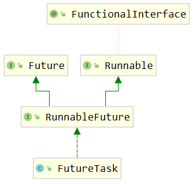

从继承关系能够看到，FutureTask本身也间接实现了Runnable接口。FutureTask类的对象也是Runnable接口的实例，可以用于在创建Thread对象时，传入Thread构造器。

### ②Future 接口

#### [1]停止任务

方法声明：

```Java
boolean cancel(boolean mayInterruptIfRunning);
```

如果尚未启动，它将停止任务。如果已启动，则仅在 mayInterrupt 为 true 时才会中断任务。

#### [2]获取任务的结果

```Java
V get()throws InterruptedException,ExecutionException;
```

如果任务完成，它将立即返回结果，否则将等待任务完成，然后返回结果。

#### [3]判断任务是否完成

```Java
boolean isDone();
```

如果任务完成，则返回true，否则返回false。

### ③FutureTask 类的构造器

#### [1]介绍

FutureTask 类兼具 Runnable 和 Future 接口的功能，并方便地将两种功能组合在一起。关于 FutureTask 类的使用有如下建议：

- 在主线程中需要执行比较耗时的操作时，但又不想阻塞主线程时，可以把这些作业交给 Future 对象在后台完成
- 当主线程将来需要时，就可以通过 Future 对象获得后台作业的计算结果或者执行状态
- 一般 FutureTask 多用于耗时的计算，主线程可以在完成自己的任务后，再去获取结果。
- 仅在计算完成时才能检索结果；如果计算尚未完成，则阻塞 get() 方法
- 一旦计算完成，就不能再重新开始或取消计算
- get() 方法而获取结果只有在计算完成时获取，否则会一直阻塞直到任务转入完成状态，然后会返回结果或者抛出异常
- get() 只执行一次，因此get() 方法放到最后

#### [2]可以使用的构造器

```Java
    public FutureTask(Callable<V> callable){
        if(callable==null)
        throw new NullPointerException();
        this.callable=callable;
        this.state=NEW;       // ensure visibility of callable
        }
```

根据这个构造器，我们知道，创建 FutureTask 对象时，传入一个 Callable 类型的对象即可。

### ④Callable 接口

```Java

@FunctionalInterface
public interface Callable<V> {
    /**
     * Computes a result, or throws an exception if unable to do so.
     *
     * @return computed result
     * @throws Exception if unable to compute a result
     */
    V call() throws Exception;
}
```

从 call() 方法的声明我们可以看出，它有一个返回值。这个返回值可以将当前线程内计算结果返回。

### ⑤测试代码

```Java
// 1.创建三个FutureTask对象，封装三个线程的执行逻辑
FutureTask<Integer> task01=new FutureTask<>(()->{

        int result=(int)(Math.random()*Math.random()*100);

        System.out.println(Thread.currentThread().getName());

        return result;
        });
        FutureTask<Integer> task02=new FutureTask<>(()->{

        int result=(int)(Math.random()*Math.random()*1000);

        System.out.println(Thread.currentThread().getName());

        return result;
        });
        FutureTask<Integer> task03=new FutureTask<>(()->{

        int result=(int)(Math.random()*Math.random()*10000);

        System.out.println(Thread.currentThread().getName());

        return result;
        });

// 2.创建三个线程对象，然后启动线程
        new Thread(task01,"thread01").start();
        new Thread(task02,"thread02").start();
        new Thread(task03,"thread03").start();

// 3.上面三个线程执行完成后，可以收集它们各自运算的结果
        Integer task01Result=task01.get();
        Integer task02Result=task02.get();
        Integer task03Result=task03.get();

        System.out.println("task01Result = "+task01Result);
        System.out.println("task02Result = "+task02Result);
        System.out.println("task03Result = "+task03Result);
```

### ⑥Callable和Runnable对比

|Runnable接口| Callable接口          |
|---|---------------------|
|重写run()方法| 重写call()方法          |
|run()没有返回值| call()有返回值          |
|run()没有声明抛出异常| call()声明抛出Exception |
|没有汇总各个线程结果的机制| 有汇总各个线程结果的机制        |

### ⑦Callable接口方案的特点

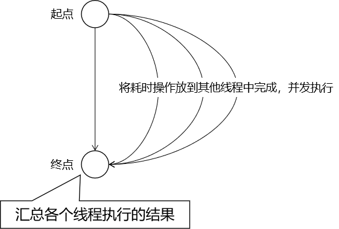

该方案仅在具体任务计算完成时才能检索结果；如果计算尚未完成，则阻塞 get()
方法。一旦计算完成，就不能再重新开始或取消计算。get() 方法获取结果只有在计算完成时获取，否则会一直阻塞直到任务转入完成状态，然后会返回结果或者抛出异常，
且只计算一次。

好处就是对于包含多个操作的任务，可以节约处理任务的时间。举例分析如下：

假设我们现在有 5 个操作要执行，每个操作耗时如下：

- 操作1：1秒
- 操作2：5秒
- 操作3：6秒
- 操作4：2秒
- 操作5：3秒

如果这些操作按顺序执行，那么需要：1 + 5 + 6 + 2 + 3 = 17秒

如果这些操作并行执行，那么需要：6秒——和耗时最长的任务时间一致

<br/>

## 4、线程池

### ①参考代码

```Java
// 1.创建线程池对象
ExecutorService pool=Executors.newFixedThreadPool(5);

// 2.给线程池对象分配任务，每一个任务是一个线程
        pool.execute(()->{
        System.out.println(Thread.currentThread().getName()+" "+new Date());
        });

        pool.execute(()->{
        System.out.println(Thread.currentThread().getName()+" "+new Date());
        });

        pool.execute(()->{
        System.out.println(Thread.currentThread().getName()+" "+new Date());
        });
```

### ②开发建议

阿里开发手册中对线程创建的规定：

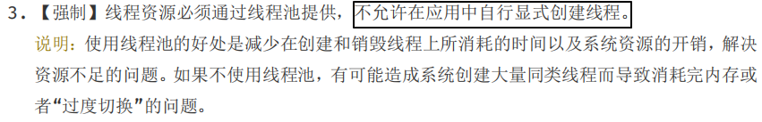

<br/>

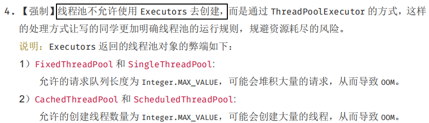

结论：实际开发中，建议使用『自定义线程池』的方式创建多线程。在创建自定义线程池时，使用合理的参数。

## 5、并行计算[了解]

```Java
List<String> list=Arrays.asList("a","b","c","d","e");

// 串行计算
        list.stream().forEach(System.out::print);

        System.out.println();

// 并行计算
        list.parallelStream().forEach(System.out::print);
```

## 6、Timer 定时任务[了解]

```Java
// 1、创建 Timer 对象封装定时任务中要执行的操作
// 每一个 Timer 对象会使用一个线程来执行定时任务
Timer timer01=new Timer();

// 2、调用 schedule() 指定任务和执行周期
// 参数1：timerTask 封装具体任务操作
// 参数2：delay 指定定时任务延迟多久后开始执行
// 参数3：period 指定定时任务执行的时间间隔
        timer01.schedule(new TimerTask(){
@Override
public void run(){
        System.out.println(Thread.currentThread().getName()+" is working");
        }
        },0,1000);

        Timer timer02=new Timer();

        timer02.schedule(new TimerTask(){
@Override
public void run(){
        System.out.println(Thread.currentThread().getName()+" is working");
        }
        },0,1000);
```

> Timer-0 is working
> Timer-1 is working
> Timer-0 is working
> Timer-1 is working

<br/>

## 7、Spring 异步方法[了解]

在 Spring 环境下，如果组件 A（假设是 ControllerA）要调用组件 B（假设是 ServiceB）的多个方法，而且希望这些方法能够异步执行。

### ①准备 SpringBoot 环境

#### [1]引入依赖

```XML

<dependencies>
    <dependency>
        <groupId>org.springframework.boot</groupId>
        <artifactId>spring-boot-starter-web</artifactId>
        <version>2.5.2</version>
    </dependency>
</dependencies>
```

#### [2]创建主启动类

```Java

@SpringBootApplication
public class Application {

    public static void main(String[] args) {
        SpringApplication.run(Application.class, args);
    }

}
```

#### [3]创建 Service

```Java

@Service
public class DemoService {

    public void doSth() {
        System.out.println("Demo Service " + Thread.currentThread().getName());
    }

}
```

#### [4]创建 Controller

```Java

@RestController
public class DemoController {

    @Autowired
    private DemoService demoService;

    @RequestMapping("/demo/test/async")
    public String callServiceMethod() {

        demoService.doSth();
        demoService.doSth();
        demoService.doSth();
        demoService.doSth();
        demoService.doSth();

        return "success";
    }

}
```

### ②使用异步方法

#### [1]开启异步功能

在主启动类使用 @EnableAsync 注解：

```Java
// 开启支持异步方法调用功能
@EnableAsync
@SpringBootApplication
public class Application {

    public static void main(String[] args) {
        SpringApplication.run(Application.class, args);
    }

}
```

#### [2]标记异步方法

在想要异步调用的方法上使用 @Async 注解：

```Java

@Service
public class DemoService {

    // 在想要实现异步调用的方法上加 @Async注解
    @Async
    public void doSth() {
        System.out.println("Demo Service " + Thread.currentThread().getName());
    }

}
```

## 8、小结

面试中如果被问到：创建多线程有哪些方法，至少要能说上来前四种。后面五种是用来卷别人、吹牛的。

其实 Fork Join、CompletableFuture 也可以，后面会讲到。

- [基本] 继承 Thread 类
- [基本] 实现 Runnable 接口
- [基本] 线程池
- [基本] Callable + FutureTask
- [内卷] CompletableFuture（后面讲）
- [内卷] Fork Join（后面讲）
- [内卷] 并行计算
- [内卷] Timer 定时任务
- [内卷] Spring 的异步方法调用

# 三、多线程的生命周期

## 1、线程状态的枚举类

在 java.lang.Thread 类中，有一个枚举类：State

|状态| 说明                                                             |
|---|----------------------------------------------------------------|
|NEW| 新建状态，代表线程刚刚创建出来，还没有启动                                          |
|RUNNABLE| 就绪状态，代表线程已经启动了，在等待CPU的时间片                                      |
|RUNNING| 运行状态，代表线程已经得到了CPU时间片，开始执行了（因为这个状态时间很短，所以JDK后面的版本就去掉了这个值）       |
|BLOCKED| 阻塞状态，线程执行过程中遇到了synchronized并且没有得到锁                             |
|WAITING| 等待状态，线程执行过程中调用了wait()方法，停止执行，被其它线程唤醒后才能继续执行                    |
|TIMED_WAITING| 限时等待状态，线程执行过程中调用了Thread.sleep()或wait(time)，停止执行，到达指定时间之后，会继续执行 |
|TERMINATED| 结束状态，线程结束，停止执行                                                 |

## 2、拍摄线程执行快照
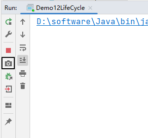

<br/>

## 3、RUNNABLE
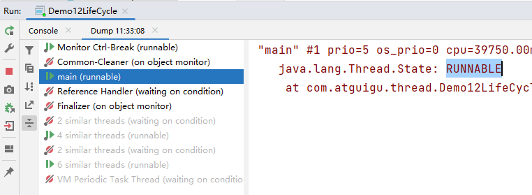

<br/>

## 4、BLOCKED
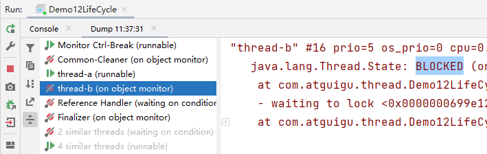

<br/>

```java
new Thread(()->{
    synchronized (Demo12LifeCycle.class) {
        while (true) {}
    }
}, "thread-a").start();

new Thread(()->{
    synchronized (Demo12LifeCycle.class) {

    }
}, "thread-b").start();
```

<br/>

## 5、WAITING
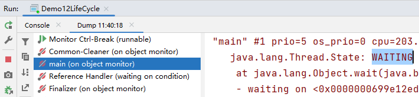

<br/>

```java
public static void main(String[] args) throws InterruptedException {
    synchronized (Demo12LifeCycle.class) {
        Demo12LifeCycle.class.wait();
    }
}
```

<br/>

## 6、TIMED_WAITING
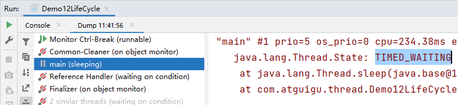

<br/>

```java
Thread.sleep(10000);
```

# 四、线程间通信
## 1、功能
一个大任务拆分成各个小任务并分配到新创建线程中执行之后，还需要各个子线程彼此配合才能完成，此时就需要线程间通信<br/>

## 2、可用 API
Object 类中有如下方法可以用于线程间通信：

|方法名|方法功能|
|---|---|
|wait()|让当前线程进入等待|
|notify()|随机唤醒一个等待中的线程|
|notifyAll()|唤醒全部等待中的线程|

## 3、案例
```java
public class Demo13Communication {

    private int number = 0;

    public void addValue() throws InterruptedException {
        synchronized (this) {
            if (number >= 1) {
                // 不该干活的时候，就歇着
                this.wait();
            }

            // 该干活的时候，干活
            System.out.println(Thread.currentThread().getName() + " number = " + ++number);

            // 自己的活干完，叫别的线程起来干活
            this.notifyAll();
        }
    }

    public void subValue() throws InterruptedException {
        synchronized (this) {
            if (number < 1) {
                // 不该干活的时候，就歇着
                this.wait();
            }

            // 该干活的时候，干活
            System.out.println(Thread.currentThread().getName() + " number = " + --number);

            // 自己的活干完，叫别的线程起来干活
            this.notifyAll();
        }
    }

    public static void main(String[] args) {

        Demo13Communication demo = new Demo13Communication();

        // 创建两个线程，一个执行加法，一个执行减法
        new Thread(()->{
            try {
                for (int i = 0; i < 100; i++) {
                    demo.addValue();
                }
            } catch (InterruptedException e) {
                throw new RuntimeException(e);
            }
        }, "thread-a").start();

        new Thread(()->{
            try {
                for (int i = 0; i < 100; i++) {
                    demo.subValue();
                }
            } catch (InterruptedException e) {
                throw new RuntimeException(e);
            }
        }, "thread-b").start();
    }

}
```

<br/>

## 4、虚假唤醒
没有重新执行是否该干活的判断，所以真正执行加法、减法操作的时候，可能是不该执行的时候执行了：<br/>

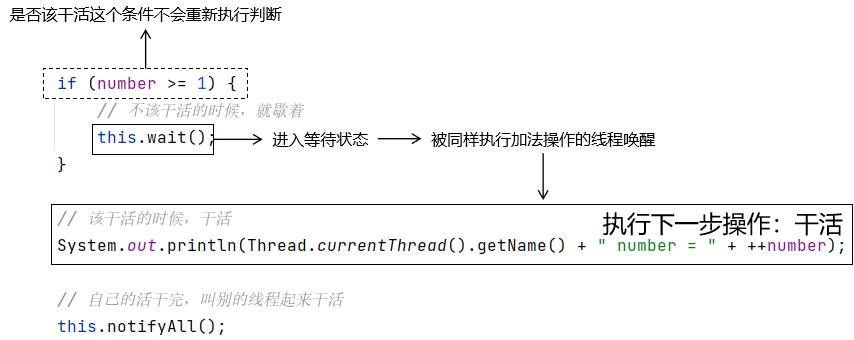

<br/>

解决方案：把 if 判断改成 while 循环：

<br/>

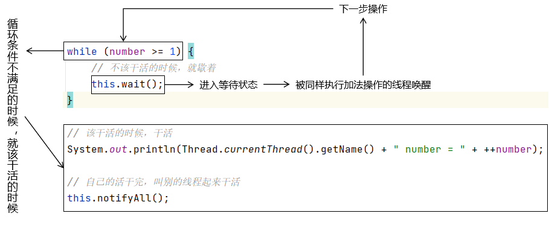