# 一、引入
Lock 系列 API 底层原理和 synchronized 完全不同，是两个独立的体系<br/>

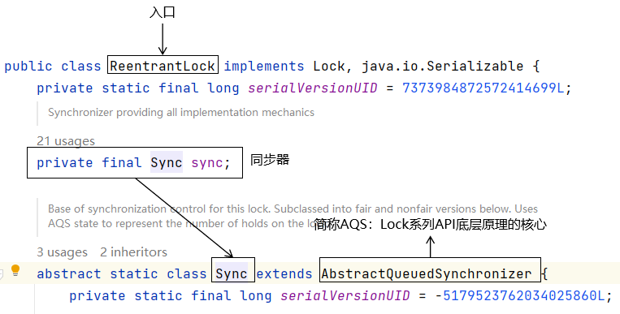

<br/>

Lock 系列 API 底层实现加锁、解锁操作，都需要直接或间接的用到同步器对象，同步器对象的类都继承自AQS，AQS的全类名是：<br/>
java.util.concurrent.locks.AbstractQueuedSynchronizer<br/>

<br/>

# 二、AbstractQueuedSynchronizer组成部分
## 1、内部类：Node
Node这个单词是节点的意思，在AQS中通过Node节点要组成一个双向链表，存放没有获取到锁的线程
```java
    abstract static class Node {
        volatile Node prev;       // 在双向链表中指向上一个节点
        volatile Node next;       // 在双向链表中指向下一个节点
        Thread waiter;            // 指向当前节点所保存的线程对象，这个线程对象没有申请到锁
```

<br/>

## 2、成员变量：state
- 初始值：0
- 作用表示当前锁对象是否被某个线程占用
  - 占用：给 state 增加值
  - 释放：给 state 减少值
- 修饰：用到了 volatile 关键词

<br/>

## 3、对 state 使用 CAS 方式修改
```java
    /**
     * Atomically sets synchronization state to the given updated
     * value if the current state value equals the expected value.
     * This operation has memory semantics of a {@code volatile} read
     * and write.
     *
     * @param expect the expected value
     * @param update the new value
     * @return {@code true} if successful. False return indicates that the actual
     *         value was not equal to the expected value.
     */
    protected final boolean compareAndSetState(int expect, int update) {
        return U.compareAndSetInt(this, STATE, expect, update);
    }
```

<br/>

## 4、总的体系说明
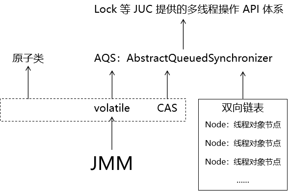

<br/>

# 三、JMM
## 1、概念
Java Memory Model：Java 内存模型<br/>
JMM和JVM在内存结构上存在对应关系，把JMM本身搞清楚，自然就知道它和JVM的关系了<br/>

## 2、产生的背景
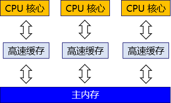

<br/>

CPU遵循摩尔定律运算增长非常快，但是内存速度的增长就没有那么快，所以逐渐发现内存和CPU的速度不匹配了<br/>

为了最大限度发挥CPU的性能优势，协调CPU和内存之间速度上的差异，硬件体系在CPU和内存之间引入了高速缓存<br/>
- 距离CPU越近：速度越快，材料越贵，容量越小
- 距离CPU越远：速度越慢，材料越贱，容量越大

<br/>

但是从上图我们很容易能发现问题：多个不同 CPU 核心都从主内存读取了同一个数据，又做了不同修改。那么同步会主内存的时候以哪个修改为准呢？这个问题有一个专门的名字：缓存一致性（Cache Coherence）。为了解决一致性的问题，需要各个处理器访问缓存时都要遵循一些协议，在读写时要根据协议来进行操作，这类协议有MSI、MESI（Illinois Protocol）、MOSI、Synapse、Firefly及Dragon Protocol等。

<br/>

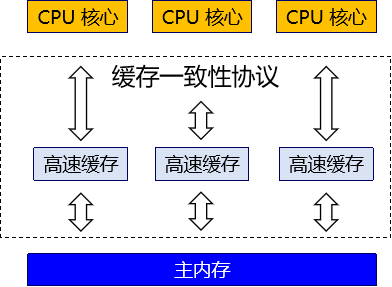

<br/>

## 3、Java 内存模型

### ①基本概念

对 Java 程序来说同样存在上面的问题。曾经同样的 Java 代码在不同的硬件平台上运行会出现计算结果不一致的情况。这就和不同硬件系统使用不同方式应对缓存不一致问题有关。<br/>

为了屏蔽系统和硬件的差异，让一套代码在不同平台下能到达相同的访问结果。JMM 从 Java 5 开始的 JSR-133 发布后，已经成熟和完善起来。<br/>

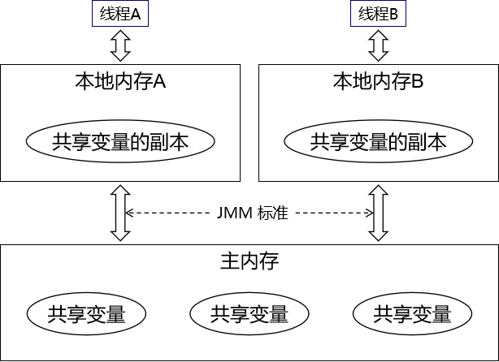

<br/>

要点如下：
- 线程执行计算操作，其实是针对本地内存（也叫工作内存）里的数据来操作的。
- 本地内存中的数据是从主内存中读取进来的。
- 线程在本地内存修改了数据之后，需要写回主内存。
- 各个线程自己的本地内存都是自己私有的，任何线程都不能读写其它线程的本地内存。
- 多线程共同修改同一个数据时，本质上都是需要借助主内存来完成。

<br/>

### ②主内存
主内存是各线程共享的内存区域。而JVM的内存结构中堆内存也是线程共享的。

<br/>

### ③本地内存
本地内存（也叫工作内存）是各线程私有的内存区域。而JVM的内存结构中栈内存是线程私有的。所以 JVM 内存结构和 JMM 内存模型既有关联有不完全等同。

<br/>

### ④作用
Java 内存模型（JMM）设计出来就是为了解决缓存一致性问题的，拆解开来说，缓存一致性涉及到三个具体问题：
- 原子性
- 可见性
- 有序性

## 4、原子性
### ①概念
“原子”，除了指特定的微观粒子，引申的意思是：不可再分<br/>

在我们的程序中，如果一个操作不能再拆分成更多的操作，那么这个操作就可以称之为：原子性操作<br/>

```java
// 原子性操作
a = 10;

// 非原子性操作
// a++ 是由两个操作组成的：a+1 和赋值
a++;
```

<br/>

### ②代码举例
```java
package com.atguigu.juc.day03;

import java.util.concurrent.TimeUnit;

public class Demo01AtomicTest {

    // 声明成员变量作为操作对象
    private int data = 0;

    // 声明专门的方法执行累加操作
    public void add() {System.out.println(Thread.currentThread().getName() + " data = " + ++data);}

    public static void main(String[] args) {

        // 创建线程共享对象
        Demo01AtomicTest demo = new Demo01AtomicTest();

        // 创建第一个线程执行累加操作
        new Thread(()->{
            for (int i = 0; i < 100; i++) {
                try {TimeUnit.SECONDS.sleep(1);} catch (InterruptedException e) {}
                demo.add();
            }
        }, "thread-01").start();

        // 创建第二个线程执行累加操作
        new Thread(()->{
            for (int i = 0; i < 100; i++) {
                try {TimeUnit.SECONDS.sleep(1);} catch (InterruptedException e) {}
                demo.add();
            }
        }, "thread-02").start();

    }

}
```

<br/>

### ③内存分析
> thread-01 data = 168  
> thread-02 data = 169  
> thread-01 data = 169  
> thread-01 data = 170  
> ……  
> thread-02 data = 177  
> thread-02 data = 178  
> thread-01 data = 179

中间重复的数据非常能说明问题：
- 读取数据：
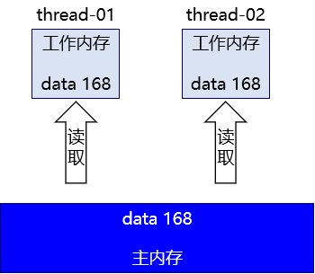

<br/>

- 执行计算：
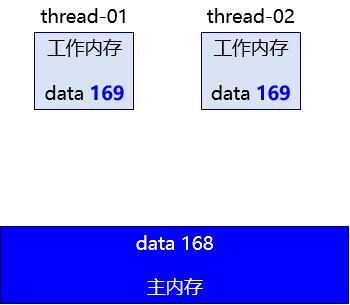

<br/>

- thread-01 结果写回：
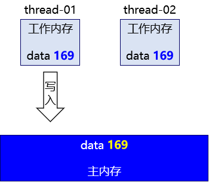

<br/>

- thread-02 结果写回：
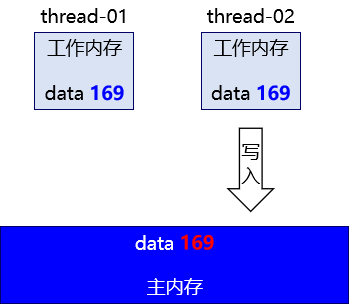

<br/>

但是其实现在 2 号线程应该做的是从 169 + 1 变成 170。

### ④使用 synchronized 同步

#### [1]修改 Java 代码

```Java
// 将累加方法修改为同步方法
public synchronized void add() {
    System.out.println(Thread.currentThread().getName() + " data = " + ++data);
}
```


#### [2]效果说明

使用同步锁之后可以保证最终结果计算准确：

> thread-01 data = 198  
> thread-02 data = 199  
> thread-01 data = 200

<br/>

### ⑤逻辑上的原子性操作
很多个操作在逻辑上是一个整体，我们就可以通过加同步锁的方式人为的把多个操作封装为一个整体，保证这个逻辑上是一个整体的代码每次只有一线程来执行<br/>
从而避免计算的错误<br/>

此时这个逻辑上的整体就具备了原子性<br/>

### ⑥原子类
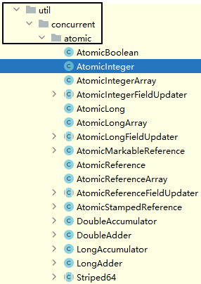

<br/>

下面我们修改上一个例子的代码，看看同样的需求用原子类如何实现：<br/>

#### [1]修改 Java 代码

```Java
// 声明成员变量作为操作对象
private AtomicInteger data = new AtomicInteger(0);

// 累加方法还是非同步方法
public void add() {
    System.out.println(Thread.currentThread().getName() + " data = " + data.incrementAndGet());
}

```

<br/>

#### [2]效果说明
可以保证计算结果正确：
> thread-01 data = 194  
> thread-02 data = 193  
> thread-01 data = 195  
> thread-02 data = 196  
> thread-01 data = 197  
> thread-02 data = 198  
> thread-02 data = 200  
> thread-01 data = 199

<br/>

#### [3]同步锁和原子类的性能比较
### ①情景设定

两个线程对同一个数据从 0 累加到 1000 万。数量大一些便于看到较为明显的效果，我们中间不执行线程睡眠就不会花很多时间。

### ②同步锁

#### [1] Java 代码

```Java
public class Demo12PKSync {

    private int data = 0;

    public synchronized void add() {
        data ++;
    }

    public static void main(String[] args) {
        Demo12PKSync demo = new Demo12PKSync();

        new Thread(()->{

            long beginTime = System.currentTimeMillis();

            for (int i = 0; i < 10000000; i++) {
                demo.add();
            }

            long endTime = System.currentTimeMillis();

            long usedTime = endTime - beginTime;

            System.out.println(Thread.currentThread().getName() + " usedTime = " + usedTime);

        }, "thread-01").start();

        new Thread(()->{

            long beginTime = System.currentTimeMillis();

            for (int i = 0; i < 10000000; i++) {
                demo.add();
            }

            long endTime = System.currentTimeMillis();

            long usedTime = endTime - beginTime;

            System.out.println(Thread.currentThread().getName() + " usedTime = " + usedTime);

        }, "thread-02").start();
    }
}
```

#### [2]效果

> thread-01 usedTime = 628  
thread-02 usedTime = 700

### ③原子类

#### [1] Java 代码

```Java
public class Demo12PKAtomic {

    private AtomicInteger data = new AtomicInteger(0);

    public void add() {
        data.incrementAndGet();
    }

    public static void main(String[] args) {
        Demo12PKAtomic demo = new Demo12PKAtomic();

        new Thread(()->{

            long beginTime = System.currentTimeMillis();

            for (int i = 0; i < 10000000; i++) {
                demo.add();
            }

            long endTime = System.currentTimeMillis();

            long usedTime = endTime - beginTime;

            System.out.println(Thread.currentThread().getName() + " usedTime = " + usedTime);

        }, "thread-01").start();

        new Thread(()->{

            long beginTime = System.currentTimeMillis();

            for (int i = 0; i < 10000000; i++) {
                demo.add();
            }

            long endTime = System.currentTimeMillis();

            long usedTime = endTime - beginTime;

            System.out.println(Thread.currentThread().getName() + " usedTime = " + usedTime);

        }, "thread-02").start();
    }
}
```


#### [2]效果

> thread-02 usedTime = 233
thread-01 usedTime = 239

性能的提升效果还是很明显的。原理我们会在后面结合 AQS 和 CAS 来说明。


## 5、可见性
### ①概念
JMM 模型中，每个线程都有自己私有的本地内存（工作内存），这个空间是不允许其它线程读写的<br/>

于是会导致一个问题：当前线程如果不重新从主内存加载数据，就看不到其它内存对数据的修改<br/>

### ②代码示例
```java
package com.atguigu.juc.day03;

import java.util.concurrent.TimeUnit;

public class Demo13CanSee {

    private int number = 100;

    public int getNumber() {
        return number;
    }

    public void setNumber(int number) {
        this.number = number;
    }

    public static void main(String[] args) {

        Demo13CanSee demo = new Demo13CanSee();

        new Thread(()->{
            while (demo.getNumber() == 100) {}

            System.out.println("A 线程看到了 number 的新值：" + demo.getNumber());
        }, "thread-a").start();

        new Thread(()->{
            try {
                TimeUnit.SECONDS.sleep(2);
                demo.setNumber(800);
                System.out.println("B 线程修改了 number 的值：" + demo.getNumber());
            } catch (InterruptedException e) {
                throw new RuntimeException(e);
            }
        }, "thread-b").start();

    }
}

```

### ③运行效果
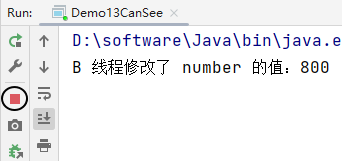

可以看到，程序一直在运行着没有停止。这是因为 while (demo.getNumber() == 100) 循环条件始终成立。证明 A 线程看到的 data 值始终是旧值。

<br/>

### ④内存分析
#### [1]两个线程加载变量
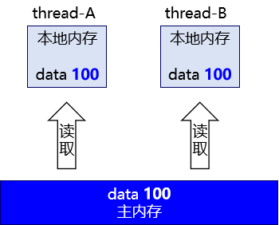

<br/>

#### [2]线程 B 修改变量
线程 B 首先在自己的本地内存修改数据：<br/>

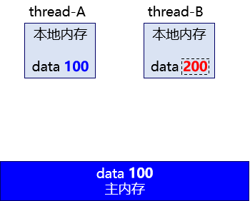

<br/>

#### [3]线程 B 将新数据写回主内存
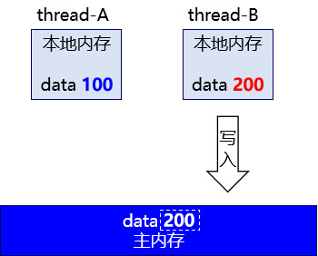

<br/>

#### [4]问题核心
线程 A 始终都是在从自己的本地内存获取数据，没有重新去读取主内存。

### ⑤问题解决
把 number 用 volatile 关键词修改即可

<br/>

## 6、有序性

### ①指令重排序

CPU 执行程序指令和 JVM 编译源程序之后，都会对指令做一定的重排序，目的是**提高**部分代码执行的**效率**。原则是重新排序后代码执行的结果和不重排**执行的结果必须预期的一样**。所以我们从开发的层面上完全感受不到。

<br/>

### ②有序性概念

从宏观和表面层次来看，我们感觉不到指令重排的存在，指令重排都是系统内部做的优化。保证无论是否指令重排，程序运行的结果都和预期一样，就是有序性。

<br/>

# 四、volatile
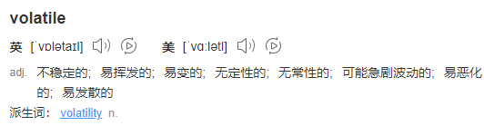

## 1、概述
### ①语法
volatile 关键词**只能修饰成员变量**：

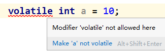

<br/>

### ②总体功能
- 微观层面：volatile 关键字能够提供有序性保证，但是从实际开发中编码层面感受不到。
- 宏观层面：volatile 关键字能够提供可见性保证，但是不能提供原子性保证。

|JMM特性| volatile能力 |
|---|------------|
|原子性| 无          |
|**可见性**| **有** |
|有序性| 有          |

<br/>

### ③定位
实际开发时，我们编写业务代码基本上不会用到volatile，因为对volatile的各种使用场景，JDK都已经封装好了<br/>

## 2、原子性角度分析

被 volatile 关键字修饰的变量是否满足原子性其实并不是由 volatile 本身来决定，而是和变量自身的数据类型有关。

```Java
public class Demo17AtomicTest {

    private volatile int data = 0;

    public void add() {
        System.out.println(Thread.currentThread().getName() + " data = " + ++data);
    }

    public static void main(String[] args) {

        Demo17AtomicTest demo = new Demo17AtomicTest();

        new Thread(()->{

            for (int i = 0; i < 100; i++) {
                try {TimeUnit.MILLISECONDS.sleep(10);} catch (InterruptedException e) {}
                demo.add();
            }

        }, "AAA").start();

        new Thread(()->{

            for (int i = 0; i < 100; i++) {
                try {TimeUnit.MILLISECONDS.sleep(10);} catch (InterruptedException e) {}
                demo.add();
            }

        }, "BBB").start();

    }

}
```

没有加到 200：

> BBB data = 195  
BBB data = 196  
BBB data = 197  
BBB data = 198  
BBB data = 199

但是把数据类型从 int 换成 AtomicInteger 即使不加 volatile 也能够保证原子性。所以，结论是：**volatile 关键字****不提供****原子性保证**。


## 3、可见性角度分析

volatile 写的内存语义：当写一个 volatile 变量时，JMM 会把该线程对应的本地内存中的变量值 flush 到主内存。

volatile 读的内存语义：当读一个 volatile 变量时，JMM 会把该线程对应的本地内存置为无效。线程接下来将从主内存中读取共享变量。

所以 volatile 关键字是能够保证可见性的。

大家可以运行下面的例子测试一下：

```Java
public class Demo15CanSeeTest {

    private volatile int data = 100;

    public int getData() {
        return data;
    }

    public void setData(int data) {
        this.data = data;
    }

    public static void main(String[] args) {

        Demo15CanSeeTest demo = new Demo15CanSeeTest();

        new Thread(()->{

            while (demo.getData() == 100) {}

            System.out.println("AAA 线程发现 data 新值：" + demo.getData());

        }, "AAA").start();

        new Thread(()->{

            try {
                TimeUnit.SECONDS.sleep(5);} catch (InterruptedException e) {}

            demo.setData(200);

            System.out.println("BBB 线程修改 data，新值是：" + demo.getData());

        }, "BBB").start();

    }

}
```


## 4、有序性角度分析

volatile确实是一个为数不多的能够从编码层面影响指令重排序的关键字。因为它可以在底层指令中添加**内存屏障**。

所谓内存屏障，就是一种特殊的指令。底层指令中加入内存屏障，会禁止一定范围内指令的重排。


### ①volatile 写

在每个 volatile 写操作的前面插入一个 StoreStore 屏障。在每个 volatile 写操作的后面插入一个 StoreLoad 屏障。
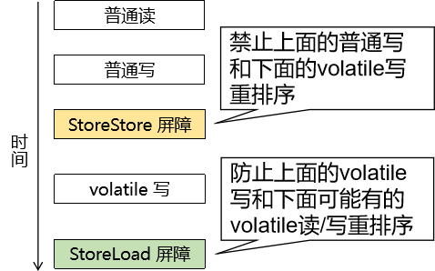

<br/>

### ②volatile 读

在每个 volatile 读操作的后面插入一个 LoadLoad 屏障和一个 LoadStore 屏障。<br/>

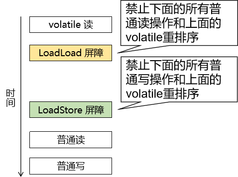

<br/>

## 5、请谈谈你对volatile的理解。
- 内涵
  - 从 JMM 三大特性的角度来说明 volatile 的功能：
    - 原子性：没有
    - 可见性：有
      - volatile读的内存语义
      - volatile写的内存语义
    - 有序性：有
      - 内存屏障
  - **volatile 关键词****最重要****的功能就是为我们的程序提供****可见性****保证**
- 外延
  - 从 volatile 在整个技术系统中的作用来说：
    - volatile + CAS = 原子类的底层原理
    - volatile + CAS + 线程对象的双向链表 = AQS 的底层原理
    - AQS 是 JUC 中各种 API 底层用到的同步器的实现原理
- 扩展
  - 从 Lock 系列 API 扩展到传统的 synchronized 同步方式
  - 从多线程的技术领域扩展到项目中多线程的实际应用
    - 本地锁：synchronized、ReentrantLock、ReentrantReadLock……
    - 分布式锁

<br/>

# 五、CAS
## 1、名称解释

CAS：**C**ompare **A**nd **S**wap 比较并交换。

谁和谁比较？

为什么比较完了才能交换？

谁和谁交换？

这东西有什么用？

下面我们一一来解释。

<br/>

## 2、工作机制
### ③初步体验
```java
// 1、创建原子类对象
AtomicInteger atomicValue = new AtomicInteger(0);

// 2、使用 CAS 的方式修改原子类对象的值
// [1]提供“期待值”：你要修改对象中的数据，那么就先猜一下对象中的当前值是多少
// 猜对了就可以修改，猜错了就不能修改
int expectedValue = 0;

// [2]提供“新值”
int newValue = 5;

// [3]执行修改
atomicValue.compareAndSet(expectedValue, newValue);

// [4]打印修改后的值
System.out.println(atomicValue.intValue());

// 3、测试猜错的情况
expectedValue = 3;
newValue = 8;
atomicValue.compareAndSet(expectedValue, newValue);
System.out.println(atomicValue.intValue());
```

<br/>

### ③底层实现
CAS底层是基于jdk.internal.misc.Unsafe类实现的<br/>
Unsafe是Java中直接基于内存地址操作数据的解决方案<br/>
本来Java是替程序员屏蔽了内存操作的，所以平时写Java代码不能直接操作内存地址<br/>
Unsafe这个类相当于是Java给自己留了一个后门，在特殊情况下操作内存地址<br/>
正因为它直接操作内存地址，这在程序中是危险的行为，所以它的名字叫：不安全<br/>

```java
// Object o：要修改的数据所在的对象
// long offset：要修改的数据所在的内存地址
// int expected：想要修改数据的人认为当前数据实际值是多少
// int x：修改后的新值
public final native boolean compareAndSetInt(Object o, long offset,
                                             int expected,
                                             int x);
```

<br/>

### ④自旋
尝试执行 CAS 修改的时候，先去读取当前地址对应的实际值，然后以此作为猜测值去执行 CAS 修改：
- 猜对了：执行修改，流程结束
- 猜错了：重新读取实际值，再次尝试修改

```java
    @IntrinsicCandidate
    public final int getAndAddInt(Object o, long offset, int delta) {
        int v;
        do {
            v = getIntVolatile(o, offset);
        } while (!weakCompareAndSetInt(o, offset, v, v + delta));
        return v;
    }
```

<br/>

## 3、非阻塞同步

前面我们比较过AtomicInteger和synchronized两种方案实现原子性操作的性能差距，AtomicInteger方式对比synchronized方式性能优势非常明显。

那AtomicInteger是如何做到既保证原子性（同步），又能够达到非常高的效率呢？

原因是：

- 使用 CAS 机制修改数据不需要对代码块加同步锁，各线程通过自旋的方式不断尝试修改，线程不会被阻塞。
- 配合 volatile 关键字使各个线程直接操作主内存避免了数据不一致。

所以 CAS 配合 volatile 不需要阻塞线程就能够实现同步效果，性能自然就会比 synchronized 更好。我们把这种机制称为：非阻塞同步。

当然，这种机制也并不能完全取代同步锁。因为 CAS 针对的是内存中的一个具体数据，无法对一段代码实现同步效果。

原子类的局限性：不能实现通用的加锁、解锁操作，它只能针对某个特定的值包装成原子类，对于这个特定值的操作提供原子性。

## 4、CAS和乐观锁
总体机制来说，很像，但是乐观锁比CAS机制多维护了一个版本号<br/>
在乐观锁机制中要求：必须基于最新版修改，否则就会拒绝<br/>
所以乐观锁不会有ABA问题<br/>
ABA问题：
- 数据初始状态下值是A
- 修改为B
- 修改为A
- 此时基于A所做的修改该不该允许？因为此时A不知道是不是最新版

# 六、DEBUG方式查看AQS工作机制
## 1、申请锁成功
```java
final boolean initialTryLock() {
    // 1、获取当前线程
    Thread current = Thread.currentThread();
    
    // 2、尝试使用 CAS 方式修改 state 的值
    // 锁对象没有被任何线程占用时，state 的值就是 0
    // 所以 CAS 修改成功，state 的值被修改成了 1
    if (compareAndSetState(0, 1)) { // first attempt is unguarded
        // 3、把独占当前锁对象的线程设置为当前线程
        setExclusiveOwnerThread(current);
        return true;
    } else if (getExclusiveOwnerThread() == current) {
        int c = getState() + 1;
        if (c < 0) // overflow
            throw new Error("Maximum lock count exceeded");
        setState(c);
        return true;
    } else
        return false;
}
```

<br/>

## 2、锁重入
```java
final boolean initialTryLock() {
    // 1、获取当前线程
    Thread current = Thread.currentThread();
        
    // 2、尝试修改 state 的值
    // 在锁重入的情况下，state 已经被当前线程自己在更早的时候改成 1
    // 所以用 0 去猜就猜错了
    if (compareAndSetState(0, 1)) { // first attempt is unguarded
        setExclusiveOwnerThread(current);
        return true;
    } 
    
    // 3、判断当前独占锁对象的线程是不是当前线程自己
    else if (getExclusiveOwnerThread() == current) {
        // 4、如果确实是当前线程自己，那么就知道是发生了锁重入，state 值再 +1
        int c = getState() + 1;
        if (c < 0) // overflow
            throw new Error("Maximum lock count exceeded");
        
        // 5、设置 state 的值
        setState(c);
        
        // 6、返回 true 表示获取锁成功
        return true;
    } else
        return false;
}
```

<br/>

## 3、申请锁失败
判断当前线程申请锁失败：<br/>

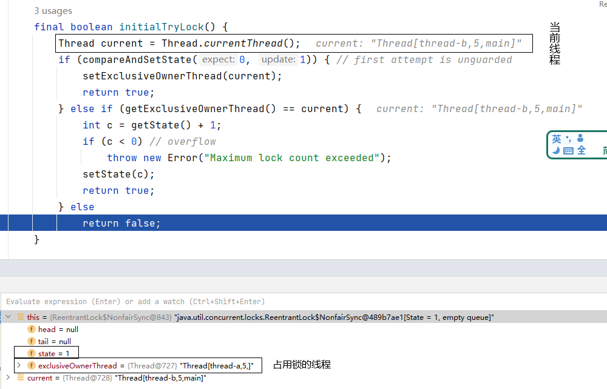

<br/>

把申请锁失败的线程存入双向链表：<br/>

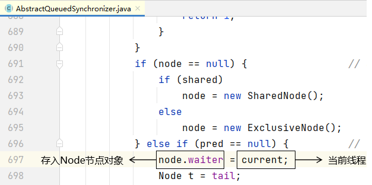

## 4、释放锁
```java
@ReservedStackAccess
protected final boolean tryRelease(int releases) {
    // 1、给 state 减去指定的值
    int c = getState() - releases;
        
    // 2、要求执行释放锁操作的必须是当前线程
    if (getExclusiveOwnerThread() != Thread.currentThread())
        throw new IllegalMonitorStateException();
        
    // 3、检查锁重入是否全部退出了
    boolean free = (c == 0);
    if (free)
        // 4、如果锁重入全部退出了，那么独占锁对象的线程这里置空
        setExclusiveOwnerThread(null);
    
    // 5、修改 state 的值
    setState(c);
    return free;
}
```


