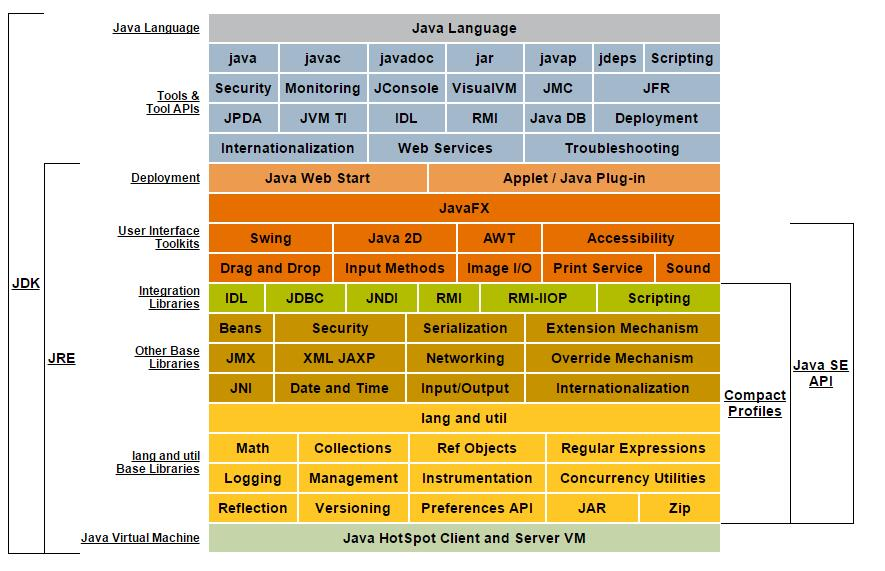
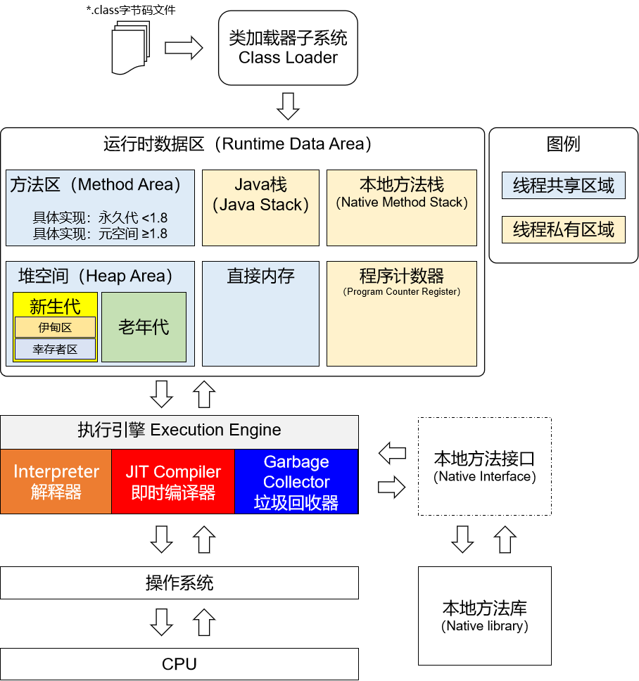

# 一、回顾
## 1、结构
- JVM：(Java Virtual Machine) Java虚拟机 一处编译，到处运行
- JRE：(Java Runtime Environment) Java运行时环境=JVM+Java运行时所需的jar包
- JDK：(Java Development Kits) Java开发工具集=JRE+辅助工具，例如：java、javac、javap……

 

 

## 2、Java程序可迁移性
JVM 帮助我们消除了不同操作系统之间的差异：
- Windows系统安装Windows版JVM
- Linux系统安装Linux版JVM

不同操作系统下的 JVM 遵循相同的 JVM 标准，只要是在兼容的标准下，Java程序就可以实现平滑的迁移

 

# 二、JVM工作的总体机制

## 1、Java 源程序编译运行过程
Java源程序→编译→字节码文件→放到JVM上运行

 

## 2、JVM 工作的总体运行机制

总体机制的粗略描述：

- 第一步：使用类加载器子系统将 *.class 字节码文件加载到 JVM 的内存
- 第二步：在 JVM 的内存空间存储相关数据
- 第三步：在执行引擎中将 *.class 字节码文件翻译成 CPU 能够执行的指令
- 第四步：将指令发送给CPU执行

## 3、JVM 落地产品

### ①Sun Classic VM

早在1996年Java1.0版本的时候，Sun公司发布了一款名为Sun Classic VM的Java虚拟机，它同时也是世界上**第一款商用**Java虚拟机，JDK1.4时完全被淘汰。

这款虚拟机内部只提供解释器。

> 目前我们使用的主流JVM中，通常既提供解释器，也提供JIT编译器。在JVM的执行引擎中，既可以使用解释器也可以使用JIT编译器，看具体场景。所以最初的JVM只有解释器是能够工作的。
只有解释器，效率较低。
JIT编译器可以对重复执行的代码进行预编译，提高执行效率。

要想使用JIT编译器，就需要进行外挂。而一旦外挂了JIT编译器，JIT就会接管虚拟机的执行系统。解释器就不再工作。解释器和编译器不能配合工作。

现在Hotspot内置了此虚拟机。

### ②Exact VM

为了解决Sun Classic VM的问题，JDK1.2时，SUN提供了此虚拟机。

Exact Memory Management：准确式内存管理

- 也可以叫Non-Conservative/Accurate Memory Management
- 虚拟机可以知道内存中某个位置的数据具体是什么类型。
    - 比如一个变量的值是：0xFFE5，分辨它是一个普通整数还是一个地址值。

具备现代高性能虚拟机的雏形

- 热点探测
- 编译器与解释器混合工作模式，仅针对热点代码执行即时编译

只在Solaris（Sun公司的Unix系统）平台短暂使用，其它平台上还是Classic VM。英雄气短，最终被Hotspot虚拟机替换。

> “开始了吗？”
“已经结束了。”

### ③三大商用VM之一：**Hotspot **VM

#### [1]Hotspot历史

- 最初由一家名为“Longview Technologies”的小公司设计
- 1997年，Longview Technologies被Sun收购
- 2009年，Sun公司被Oracle收购
- JDK1.3时，Hotspot VM成为默认虚拟机直到现在

#### [2]市场地位

- 目前Hotspot占有绝对的市场地位，称霸武林
- 不管是现在仍在广泛使用的JDK6，还是新锐JDK8，默认虚拟机都是Hotspot
- Sun/Oracle JDK和Open JDK的默认虚拟机
- 因此本课程中默认介绍的虚拟机都是Hotspot，相关机制也主要是指Hotspot的GC机制。（比如其它两个商用虚拟机：JRockit、J9，都没法方法区的概念）
- 从服务器、桌面应用程序到移动端、嵌入式都有应用

#### [3]名字含义

- Hotspot指的就是它的热点代码探测技术
- 通过计数器找到最具编译价值代码，触发即时编译或栈上替换
- 通过编译器与解释器协同工作，在最优化的程序响应时间与最佳执行性能中取得平衡

栈上替换：
如果一个对象确保只被一个局部变量所引用，那么JVM底层就可以把这个对象拆散，变成几个局部变量分别保存这个对象的各个属性。

栈上替换的好处：
①对象并没有被放在堆空间，而是在栈空间保存，不需要GC
②放在栈空间，有更大概率是存储在CPU的高速缓存中，进一步提升性能

逃逸分析：
如果一个对象不止被一个局部变量引用，那么就是发生了逃逸，此时不能做栈上替换；乖乖的在堆空间给对象分配存储空间。

### ④三大商用VM之一：BEA公司的JRockit

- 专注于服务器端应用
    - 不太关注程序启动速度，内部不包含解释器，全部代码都通过JIT编译器执行。
- 大量的行业基准测试显示，JRockit是世界上最快的JVM。
    - 使用JRockit产品，客户已经体验到了显著的性能提高（一些超过了70%）和硬件成本的减少（达50%）。
- 优势：全面的Java运行时解决方案组合
    - JRockit面向延迟敏感型应用的解决方案JRockit Real Time提供毫秒或微秒级的JVM响应时间，适合财务、军事指挥、电信网络的需要
    - MissionControl服务套件，它是一组以极低的开销来监控、管理和分析生产环境中的应用程序的工具。
- 2008年，BEA被Oracle收购。
- Oracle表达了整合两大优秀虚拟机的意愿，大致在JDK8中完成。整合的方式是在Hotspot的基础上，移植JRockit的优秀特性。

  其实二者架构差异很大，改动并不大。
- 高斯林：目前就职与谷歌，研究人工智能和水下机器人。

### ⑤三大商用VM之一：IBM的J9

- 全称：IBM Technology for Java Virtual Machine，简称IT4J
- 内部代号：J9
- 市场定位与Hotspot接近，服务器端、桌面应用、嵌入式等多用途VM
- 广泛用于IBM的各种Java产品。
- 目前是有影响力的三大商用虚拟机之一，也**号称**是世界上最快的Java虚拟机。

  > 这个“最快”大概率是基于在IBM自己的产品上测试的结果。
  从适应性角度来说，J9也更适合和IBM公司的产品配合使用，例如：WebSphere
- 2017年左右，IBM发布了开源J9 VM，命名为OpenJ9，交给Eclipse基金会管理，也称为Eclipse OpenJ9