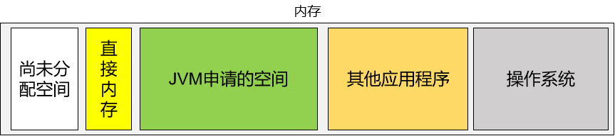

# 一、本地接口 Native Interface

本地接口的作用是融合不同的编程语言为 Java 所用，它的初衷是融合 C/C++程序。因为 Java 诞生的时候是 C/C++ 横行的时候，要想立足，必须有能力调用 C/C++。于是就在内存中专门开辟了一块区域处理标记为 native 的代码，它的具体做法是 Native Method Stack 中登记 native 方法，在Execution Engine 执行时加载 native libraies。

目前该方法使用的越来越少了，除非是与硬件有关的应用，比如通过 Java 程序驱动打印机或者 Java 系统管理生产设备，在企业级应用中已经比较少见。因为现在的异构领域间的通信很发达，比如可以使用 Socket 通信，也可以使用 Web Service 等等，不多做介绍。


# 二、本地方法栈 Native Method Stack

专门负责在本地方法运行时，提供栈空间，存放本地方法每一次执行时创建的栈帧。它的具体做法是在 Native Method Stack 中登记 native 方法，在 Execution Engine 执行时加载本地方法库。

native 方法举例：

```Java
public static native void yield();
```


> 栈：stack
堆：heap
如果抛开JVM内存结构，单独来看『栈』和『堆』其实没有区别，都是指：先进后出的数据结构。

# 三、程序计数器

也叫PC寄存器（**P**rogram **C**ounter Register）。用于保存程序执行过程中，下一条即将执行的指令的地址。也就是说能够保存程序当前已经执行到的位置。这个位置由执行引擎读取下一条指令，是一个非常小的内存空间，从内存空间使用优化这个角度来看：几乎可以忽略不记。

# 四、直接内存


## 1、作用

在特定场景提高性能。


## 2、应用场景

直接内存并不是虚拟机运行时数据区的一部分，也不是Java 虚拟机规范中定义的内存区域。在JDK1.4 中新加入了NIO(New Input/Output)类，引入了一种基于通道（Channel）与缓冲区（Buffer）的 I/O 方式，它可以使用native 函数库直接分配堆外内存，然后通过一个存储在 Java 堆中的 DirectByteBuffer 对象作为这块内存的引用进行操作。这样能在一些场景中显著提高性能，因为避免了在 Java 堆和 Native 堆中来回复制数据。 本机直接内存的分配不会受到 Java 堆大小的限制，受到本机总内存大小限制。 配置虚拟机参数时，不要忽略直接内存防止出现 OutOfMemoryError 异常。


## 3、直接内存和堆内存比较

直接内存申请空间耗费更高的性能，当频繁申请到一定量时尤为明显。直接内存 I/O 读写的性能要优于普通的堆内存，在多次读写操作的情况下差异明显。