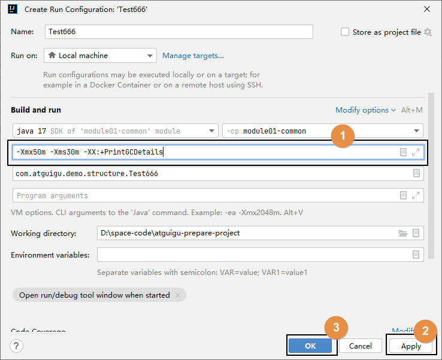

# 一、概述

## 1、堆空间存储结构


## 2、堆空间工作机制

- 新创建的对象会被放在Eden区
- 当Eden区中已使用的空间达到一定比例，会触发Minor GC
- 每一次在Minor GC中没有被清理掉的对象就成了幸存者
- 幸存者对象会被转移到幸存者区
- 幸存者区分成from区和to区
- from区快满的时候，会将仍然在使用的对象转移到to区
- 然后from和to这两个指针彼此交换位置

> 口诀：**复制必交换，谁空谁为to**

- 如果一个对象，经历15次GC仍然幸存，那么它将会被转移到老年代
- 如果幸存者区已经满了，即使某个对象尚不到15岁，仍然会被移动到老年代
- 最终效果：
    - Eden区主要是生命周期很短的对象来来往往
    - 老年代主要是生命周期很长的对象，例如：IOC容器对象、线程池对象、数据库连接池对象等等
    - 幸存者区作为二者之间的过渡地带
- 关于永久代：
    - 从理论上来说属于堆
    - 从具体实现上来说不属于堆

<br/>

## 3、堆、栈、方法区之间关系


## 4、常驻内存对象举例

数据库连接池对象（**容器**）

数据库连接 1

数据库连接 2

数据库连接 N

……

第三方中间件的Java客户端对象

Jedis

RabbitMQ客户端对象

ElasticSearch客户端对象

……

IOC**容器**对象 ApplicationContext iocContainer = new ClasspathXmlApplicationContext("xxx.xml");

我们自己创建的组件：EmpController对象

我们自己创建的组件：EmpService对象

我们自己创建的组件：EmpMapper对象

框架内部的组件：PlatformTransactionManager

框架内部的组件：ExecutionChain

框架内部的组件：DispatcherServlet

框架内部的组件：HandlerAdapter

框架内部的组件：CharacterEncodingFilter

框架内部的组件：HiddenMethodFilter

框架内部的组件：ContextLoaderListener

线程池（**容器**）

线程对象 1

线程对象 2

线程对象 N

……

Servlet**容器**

ServletContext

EmpServlet

TxFilter

OnlineListener

HttpSession（过期时间）


## 5、常用Web对象存活时间

生产环境下：

ServletContext存活时间：

    时间单位：月、年

HttpSession存活时间：

    时间单位：分钟、小时

HttpServletRequest存活时间：服务器端接收到请求~服务器提交响应

    时间单位：秒或毫秒

HttpServletResponse存活时间：服务器端接收到请求~服务器给客户端返回了响应数据

    时间单位：秒或毫秒


# 二、实验

## 1、测试代码

查看下面程序在每个步骤中内存的状态：

```Java
public class Review {

    // 静态变量，类变量
    public static Review review = new Review();

    public void showMessage() {

        // 局部变量
        Review reviewLocal = new Review();

    }

    // 程序入口
    public static void main(String[] args) {

        // 局部变量
        Review reviewMain = new Review();

        // 通过局部变量调用对象的方法
        reviewMain.showMessage();

        // 手动 GC
        System.gc();
        
        // 循环操作，让程序运行久一点
        for(int i = 0; i < 100; i++){
            TimeUnit.SECONDS.sleep(1);
        }
    }
}
```

<br/>

## 2、各状态分析

### 状态1：类加载过程链接阶段准备环节


<br/>

### 状态2：类加载过程初始化阶段

有类变量需要初始化，字节码文件中会生成出来&lt;clinit&gt;()方法，创建Review对象并赋值给类变量就是在&lt;clinit&gt;()方法中执行的。


<br/>

### 状态3：调用main()方法


<br/>

### 状态4：main()方法内创建对象


<br/>

### 状态5：调用对象的showMessage()方法


<br/>

### 状态6：showMessage()方法内创建新的对象


<br/>

### 状态7：showMessage()方法结束
该方法的栈帧被释放，栈帧内的局部变量也被释放。0xEEAA这个对象就成了断了线的风筝。<br/>


<br/>

### 状态8：手动GC


<br/>

### 状态9：幸存者区GC
#### [1]第一步
将存活对象从from区移动到to区。<br/>


<br/>

#### [2]第二步
原来的from区被清空，交换指针<br/>


<br/>

### 状态10：进入老年代


<br/>

### 状态11：程序结束
main()方法结束 → main线程结束 → JVM进程结束 → JVM的整个内存空间全部释放。<br/>

#### [1]main()方法结束
main()方法栈帧被释放<br/>


<br/>

#### [2]GC


<br/>

# 三、栈上替换
## 1、特殊情况
本来所有通过new的方式创建的对象都会在堆内存中开辟空间来保存，但有一种特殊情况，可以让对象在栈内存中保存<br/>
这种情况是：该对象只有一个局部变量指向它（相当于是线程私有的）<br/>

## 2、栈上替换
栈上替换（Stack Allocation）是一种JVM的优化技术，可以将某些对象分配在栈上而不是堆上。<br/>
这个特性最早出现在JDK 6版本中的HotSpot虚拟机中。<br/>
在JDK 6之前的版本中，所有对象的分配都是在堆上进行的。<br/>
具体做法是把对象按照它包含的属性拆散，像局部变量那样分别保存到Java栈<br/>

### 3、逃逸分析
如果一个对象不止被一个局部变量引用，那么就是发生了逃逸，此时不能做栈上替换；乖乖的在堆空间给对象分配存储空间。<br/>

### 4、好处
- ①对象并没有被放在堆空间，而是在栈空间保存，不需要在堆内存开辟空间，不需要GC
- ②放在栈空间，有更大概率是存储在CPU的高速缓存中，进一步提升性能

<br/>

# 四、JVM参数设置入门
## 1、示例 IDEA 版本


<br/>

## 2、针对方法设置参数


<br/>


<br/>


<br/>



## 3、测试程序
```java
public static void main(String[] args) {
    System.out.print("最多可以申请的堆大小：");
    System.out.println(Runtime.getRuntime().maxMemory() / 1024.0 / 1024 + "M");

    System.out.print("当前已申请到的堆大小：");
    System.out.println(Runtime.getRuntime().totalMemory() / 1024.0 / 1024 + "M");
    System.out.println("==================================================");

    byte[] b = null;
    for (int i = 0; i < 10; i++) {
        b = new byte[1 * 1024 * 1024];
    }
}
```

<br/>

## 4、设置JVM参数
> -Xmx50m -Xms30m -Xlog:gc*

<br/>
运行效果参考：
> [0.014s][info][gc] Using G1<br/>
> [0.015s][info][gc,init] Version: 17.0.6+9-LTS-190 (release)<br/>
> [0.015s][info][gc,init] CPUs: 4 total, 4 available<br/>
> [0.015s][info][gc,init] Memory: 24443M<br/>
> [0.015s][info][gc,init] Large Page Support: Disabled<br/>
> [0.015s][info][gc,init] NUMA Support: Disabled<br/>
> [0.015s][info][gc,init] Compressed Oops: Enabled (32-bit)<br/>
> [0.015s][info][gc,init] Heap Region Size: 1M<br/>
> [0.015s][info][gc,init] Heap Min Capacity: 30M<br/>
> [0.015s][info][gc,init] Heap Initial Capacity: 30M<br/>
> [0.015s][info][gc,init] Heap Max Capacity: 50M<br/>
> [0.015s][info][gc,init] Pre-touch: Disabled<br/>
> [0.015s][info][gc,init] Parallel Workers: 4<br/>
> [0.015s][info][gc,init] Concurrent Workers: 1<br/>
> [0.015s][info][gc,init] Concurrent Refinement Workers: 4<br/>
> [0.015s][info][gc,init] Periodic GC: Disabled<br/>
> [0.016s][info][gc,metaspace] CDS archive(s) mapped at: [0x0000000800000000-0x0000000800bd0000-0x0000000800bd0000), size 12386304, SharedBaseAddress: 0x0000000800000000, ArchiveRelocationMode: 0.<br/>
> [0.016s][info][gc,metaspace] Compressed class space mapped at: 0x0000000800c00000-0x0000000840c00000, reserved size: 1073741824<br/>
> [0.016s][info][gc,metaspace] Narrow klass base: 0x0000000800000000, Narrow klass shift: 0, Narrow klass range: 0x100000000<br/>
> 最多可以申请的堆大小：50.0M<br/>
> 当前已申请到的堆大小：30.0M<br/>
> ==================================================<br/>
> [0.146s][info][gc,start    ] GC(0) Pause Young (Concurrent Start) (G1 Humongous Allocation)<br/>
> [0.146s][info][gc,task     ] GC(0) Using 2 workers of 4 for evacuation<br/>
> [0.149s][info][gc,phases   ] GC(0)   Pre Evacuate Collection Set: 0.0ms<br/>
> [0.149s][info][gc,phases   ] GC(0)   Merge Heap Roots: 0.0ms<br/>
> [0.149s][info][gc,phases   ] GC(0)   Evacuate Collection Set: 1.8ms<br/>
> [0.149s][info][gc,phases   ] GC(0)   Post Evacuate Collection Set: 0.3ms<br/>
> [0.149s][info][gc,phases   ] GC(0)   Other: 0.3ms<br/>
> [0.149s][info][gc,heap     ] GC(0) Eden regions: 3->0(7)<br/>
> [0.149s][info][gc,heap     ] GC(0) Survivor regions: 0->2(2)<br/>
> [0.149s][info][gc,heap     ] GC(0) Old regions: 0->0<br/>
> [0.149s][info][gc,heap     ] GC(0) Archive regions: 0->0<br/>
> [0.149s][info][gc,heap     ] GC(0) Humongous regions: 14->2<br/>
> [0.149s][info][gc,metaspace] GC(0) Metaspace: 797K(960K)->797K(960K) NonClass: 733K(832K)->733K(832K) Class: 63K(128K)->63K(128K)<br/> 
> [0.149s][info][gc          ] GC(0) Pause Young (Concurrent Start) (G1 Humongous Allocation) 16M->3M(30M) 2.552ms<br/> 
> [0.149s][info][gc,cpu      ] GC(0) User=0.03s Sys=0.00s Real=0.00s<br/> 
> [0.149s][info][gc          ] GC(1) Concurrent Undo Cycle<br/> 
> [0.149s][info][gc,marking  ] GC(1) Concurrent Cleanup for Next Mark<br/> 
> [0.149s][info][gc,marking  ] GC(1) Concurrent Cleanup for Next Mark 0.357ms<br/> 
> [0.149s][info][gc          ] GC(1) Concurrent Undo Cycle 0.426ms<br/>
> [0.150s][info][gc,heap,exit] Heap<br/> 
> [0.150s][info][gc,heap,exit]  garbage-first heap   total 30720K, used 9471K [0x00000000fce00000, 0x0000000100000000)<br/> 
> [0.150s][info][gc,heap,exit]   region size 1024K, 3 young (3072K), 2 survivors (2048K)<br/> 
> [0.150s][info][gc,heap,exit]  Metaspace       used 798K, committed 960K, reserved 1056768K<br/> 
> [0.150s][info][gc,heap,exit]   class space    used 63K, committed 128K, reserved 1048576K<br/>

## 5、GC测试
JVM参数设置成最大可申请堆内存100M，初始化时申请堆内存10M：-Xmx100m -Xms10m -Xlog:gc*
```java
System.out.println("=====================Begin=========================");
System.out.print("最大可申请的堆大小：Xmx=");
System.out.println(Runtime.getRuntime().maxMemory() / 1024.0 / 1024 + "M");

System.out.print("空闲(已申请但尚未使用)的堆大小：free mem=");
System.out.println(Runtime.getRuntime().freeMemory() / 1024.0 / 1024 + "M");

System.out.print("当前已申请的堆大小：total mem=");
System.out.println(Runtime.getRuntime().totalMemory() / 1024.0 / 1024 + "M");

System.out.println("==================First Allocated===================");
byte[] b1 = new byte[5 * 1024 * 1024];
System.out.println("5MB array allocated");

System.out.print("空闲(已申请但尚未使用)的堆大小：free mem=");
System.out.println(Runtime.getRuntime().freeMemory() / 1024.0 / 1024 + "M");

System.out.print("当前堆大小：total mem=");
System.out.println(Runtime.getRuntime().totalMemory() / 1024.0 / 1024 + "M");

System.out.println("=================Second Allocated===================");
byte[] b2 = new byte[10 * 1024 * 1024];
System.out.println("10MB array allocated");

System.out.print("空闲(已申请但尚未使用)的堆大小：free mem=");
System.out.println(Runtime.getRuntime().freeMemory() / 1024.0 / 1024 + "M");

System.out.print("当前堆大小：total mem=");
System.out.println(Runtime.getRuntime().totalMemory() / 1024.0 / 1024 + "M");

System.out.println("=====================OOM=========================");
System.out.println("OOM预警!!!先手动执行GC");
System.gc();

System.out.println("第一个 40M 数组");
byte[] b3 = new byte[40 * 1024 * 1024];

System.out.println("第二个 40M 数组");
byte[] b4 = new byte[40 * 1024 * 1024];

System.out.println("第三个 40M 数组");
byte[] b5 = new byte[40 * 1024 * 1024];
```

<br/>

## 6、参数设置举例
### ①堆内存空间大小设置的建议。
- **最大堆内存**和**初始化堆内存**设置为一致：直接一步到位设置为能够使用的最大值，免除频繁申请空间的操作。
  - 空余堆内存小于40%时，JVM就会增大堆直到 -Xmx的最大限制
  - 空余堆内存大于70%时，JVM会减少堆直到 -Xms的最小限制
- 新生代大小：Sun官方推荐配置为整个堆的 3/8

> 如果咱妈给咱们设置的每个月零花钱的额度是 1000 元，那么为了少去烦她老人家，咱们一开始就是申请 1000 元全部。

<br/>

### ②Java 栈每个线程占用空间大小如何设置。

JDK5.0 以后每个线程默认所占用的栈内存大小为 1M，以前是 256K。

根据应用的线程所需内存大小进行调整。

在相同物理内存下，减小这个值能生成更多的线程。

但是操作系统对一个进程内的线程数还是有限制的，不能无限生成，经验值在 3000~5000 左右。

一般小的应用， 如果栈不是很深， 应该是128k够用的。

大的应用建议使用256k。

这个选项对性能影响比较大，需要严格的测试。

设置每个线程在Java栈中占用空间大小的参数名称是：-Xss

<br/>

## 7、常用的 JVM 参数
|参数名|星标| 说明                     |
|---|---|------------------------|
|-Xms|★| 堆内存的初始大小               |
|-Xmx|★| 堆内存的最大值（最多能够向操作系统申请多少） |
|-Xss|☆| 每个线程在Java 栈中占用空间的大小。   |
|-Xmn||新生代大小|
|-XX:PermSize||设置永久代(perm gen)初始值|
|-XX:MaxPermSize||设置永久代最大值|
|-XX:NewRatio||年轻代(包括Eden和两个Survivor区)与年老代的比值(除去持久代)|
|-XX:SurvivorRatio||Eden区与Survivor区的大小比值|

<br/>

# 五、内存溢出错误
### ①异常名称
java.lang.OutOfMemoryError，也往往简称为 OOM。
这个错误指的是：“内存溢出”，并不是专门指“堆溢出”这么一个情况。

### ②异常信息
- Java heap space：针对**新生代、老年代**整体进行Full GC后，内存空间还是放不下新产生的对象，且无法申请更多的空间
- PermGen space：永久代溢出。**方法区**中加载的类太多了（典型情况是框架创建的动态类太多，导致方法区溢出）
- Metaspace：元空间溢出。**方法区**中加载的类太多了（典型情况是框架创建的动态类太多，导致方法区溢出）
- Direct Memory space：**直接内存**溢出。

我们可以参考下面的控制台日志打印：

> 4479044K(5161984K), 4.3454766 secs] <br/>
> [Full GC (Ergonomics) 4479044K->3862071K(5416448K), 39.3706285 secs] <br/>
> [Full GC (Ergonomics) 4410423K->4410422K(5416448K), 27.7039534 secs] <br/>
> [Full GC (Ergonomics) 4629575K->4621239K(5416448K), 24.9298221 secs] <br/>
> [Full GC (Allocation Failure) 4621239K->4621186K(5416448K), 29.0616791 secs] Exception in thread "main"<br/>
> java.lang.OutOfMemoryError: **Java heap space**<br/>
> at java.util.Arrays.copyOf(Arrays.java:3210)<br/>
> at java.util.Arrays.copyOf(Arrays.java:3181)<br/>
> at java.util.ArrayList.grow(ArrayList.java:261)<br/>
> at java.util.ArrayList.ensureExplicitCapacity(ArrayList.java:235)<br/>
> at java.util.ArrayList.ensureCapacityInternal(ArrayList.java:227)<br/>
> at java.util.ArrayList.add(ArrayList.java:458)<br/>
> at com.atguigu.jvm.test.JavaHeapTest.main(JavaHeapTest.java:16)<br/>

> 方法区为啥会溢出？<br/>
> 基本就是方法区里加载的类太多了。而最典型的情况就是框架运行过程中由于某些错误导致动态生成的类太多了。<br/>
> 哪些情况下，框架会动态生成新的类呢？<br/>
> ●凡是我们自己只需要调用接口的方法，不需要给接口提供实现类的情况，都需要框架动态生成类。大概率是JDK的动态代理。<br/>
> ○例如：在Mybatis中调用Mapper接口<br/>
> ○例如：给有接口的类套上AOP<br/>
> ○例如：通过Feign接口调用微服务<br/>
> ●给没有接口的类套上AOP，底层使用CGLIB，CGLIB需要动态生成类来继承目标类。<br/>

# 五、OOM问题故障定位
## 1、导出 HPROF 文件
在给出错的程序设置 JVM 参数时，附加-XX:+HeapDumpOnOutOfMemoryError<br/>
然后运行程序

<br/>

> java.lang.OutOfMemoryError: Java heap space <br/>
> [0.231s][info][gc             ] GC(10) Concurrent Mark Cycle 8.007ms <br/>
> Dumping heap to java_pid14552.hprof ... <br/>
> Heap dump file created [61145120 bytes in 0.046 secs]

<br/>


<br/>

## 2、HPROF 文件分析
### ①下载 MAT 工具
下载地址：https://eclipse.dev/mat/downloads.php

<br/>

### ②解压运行


<br/>

### ③导入文件


<br/>

友情提示：分析文件之前，最好是把 HPROF 文件放到一个目录里，因为分析的过程会额外产生好多其它文件

<br/>

### ④分析结果


<br/>


