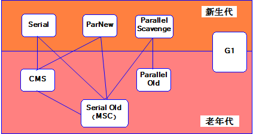

# 一、概述
> 为什么要有垃圾回收？<br/>
> ●线程私有空间：无需由系统来执行GC。因为线程结束，释放自己刚才使用的空间即可，不影响其它线程。<br/>
> ●线程共享空间：任何一个线程结束时，都无法确定刚才使用的空间是不是还有别的线程在使用。<br/>
> 所以不能因为线程结束而释放空间，必须在系统层面统一垃圾回收。<br/>
> <br/>
> GC的基本原则：<br/>
> ●频繁收集新生代<br/>
> ●较少收集老年代<br/>
> ●基本不动元空间<br/>

# 二、识别垃圾对象
> 最基本的原则：在程序中永远不再使用的对象，就是垃圾对象

<br/>

## 1、引用计数法（不采用）

### ①本意

- 在对象内部记录被引用次数
- 被引用一次，计数器 + 1
- 引用解除一个，计数器 - 1
- 计数器归零则表示该对象变成垃圾


### ②问题

循环引用问题，会导致计数器无法归零。

#### [1]一对多关联关系

Customer 类：

```Java
public class Customer {

    private List<Order> orderList;

    public List<Order> getOrderList() {
        return orderList;
    }

    public void setOrderList(List<Order> orderList) {
        this.orderList = orderList;
    }
}
```


Order 类：

```Java
public class Order {

    private Customer customer;

    public Customer getCustomer() {
        return customer;
    }

    public void setCustomer(Customer customer) {
        this.customer = customer;
    }
}
```


#### [2]SpringMVC 组件

- IOC 容器对象的接口类型：WebApplicationContext
    - WebApplicationContext 对象初始化过程中：将它自己存入 ServletContext 域
    - WebApplicationContext 对象也会把 ServletContext 存入 IOC 容器
- Servlet 上下文对象：ServletContext

<br/>


## 2、GC Roots 可达性分析

核心原理：判断一个对象，是否存在从『**堆外**』到『**堆内**』的引用。<br/>

因为我们写Java代码时，是不可能直接访问到堆内对象的，要么是通过方法里面局部变量，要么通过static修饰的常量、类变量。局部变量、类变量、常量这些都在堆外。<br/>


<br/>


<br/>

## 3、GC Root 对象

GC Root 对象：就是作为根节点出发，顺着引用路径一直查找到堆空间内，找到堆空间中的对象。

- 虚拟机栈(Java Stack栈帧中的局部变量区，也叫做局部变量表)中引用的对象
- 本地方法栈（Native Method Stack）中的局部变量
- 方法区中的类变量、常量引用的对象（说白了就是用static修饰的成员变量指向的对象）

## 4、四种引用
平时只会用到强引用和软引用。

### ①强引用
类似于 Object obj = new Object(); 只要强引用还存在，垃圾收集器永远不会回收掉被引用的对象。

<br/>

### ②软引用
SoftReference 类实现软引用。
在系统要发生内存溢出异常之前，才会将这些对象列进回收范围之中进行二次回收。
如果这次回收还没有足够的内存，才会抛出内存溢出异常。
软引用可用来实现内存敏感的高速缓存。

<br/>

### ③弱引用
WeakReference 类实现弱引用。
对象只能生存到下一次垃圾收集之前。
在垃圾收集器工作时，无论内存是否足够都会回收掉只被弱引用关联的对象。

<br/>

### ④虚引用
PhantomReference 类实现虚引用。
无法通过虚引用获取一个对象的实例，为一个对象设置虚引用关联的唯一目的就是能在这个对象被收集器回收时收到一个系统通知。

<br/>

# 三、垃圾回收相关概念
## 1、STW
Stop The World：字面意思是停止整个世界，具体是说在垃圾回收时让除了GC所需之外的所有线程都暂停、挂起，GC结束后再继续执行<br/>
事实上，GC优化很多时候就是指减少Stop-the-world发生的时间，从而使系统具有高吞吐 、低停顿的特点。<br/>

## 2、垃圾回收范围
JVM在进行GC时，并不是每次都对新生代、老年代、方法区这三个内存区域一起回收的，大部分时候回收的都是新生代。<br/>

### ①minor GC
在新生代执行垃圾回收<br/>
因为大多数Java对象存活率都不高，所以Minor GC非常频繁，一般回收速度也比较快。<br/>

### ②major GC
- 对老年代的垃圾回收。
- Major GC的速度一般会比Minor GC慢10倍以上，STW的时间更长。
- 如果Major GC后，内存还不足，就报OOM了。

### ③full GC
清理范围包括新生代、老年代和方法区，非常慢。

## 3、GC年龄
新生代的对象每经历一次GC，只要它还活着，GC年龄就会+1。当GC年龄达到15的时候，该对象就会转移到老年代。
对象在新生代的最大GC年龄可以设置：
```text
-XX:MaxTenuringThreshold
```
从JDK8开始，64位虚拟机的最大GC年龄不能超过15。

<br/>

# 四、垃圾回收算法
## 1、基本算法

### ①引用计数法（不采用）

优点：

- 实时性较高，不需要等到内存不够时才回收
- 垃圾回收时不用挂起整个程序，不影响程序正常运行


缺点：

- 回收时不移动对象, 所以会造成内存碎片问题
- 不能解决对象间的**循环引用**问题（致命问题，一票否决）


小结：

正是由于引用计数法不能解决对象间的循环引用问题，所以事实上并没有哪一款 JVM 产品采用这个机制。

> Stop-The-World：字面意思让整个世界停止。在 GC 机制中，Stop-The-World 表示挂起整个 JVM 程序，等执行完垃圾回收之后，再继续执行 JVM 程序。Stop-The-World 通常也会简称为 STW。


### ②标记清除法

它的做法是当堆中的有效内存空间被耗尽的时候，就会暂停、挂起整个程序（也被称为stop the world），然后进行两项工作，第一项则是标记，第二项则是清除。

- 标记：标记的过程其实就是，从根对象开始遍历所有的对象，然后将所有存活的对象标记为可达的对象。
- 清除：清除的过程将遍历堆中所有的对象，将没有标记的对象全部清除掉。

小结：

- 优点：实现简单
- 缺点：
  - 效率低，因为标记和清除两个动作都要遍历所有的对象
  - 垃圾收集后有可能会造成大量的内存碎片
  - 垃圾回收时会造成应用程序暂停

<br/>


<br/>

### ③标记压缩法

既然叫标记压缩算法，那么它也分为两个阶段，一个是标记(mark)，一个是压缩(compact)。所谓压缩就是把存在碎片的空间连起来。

标记压缩算法是在标记清除算法的基础之上，做了优化改进的算法。和标记清除算法一样，也是从根节点开始，对对象的引用进行标记，在清理阶段，并不是简单的清理未标记的对象，而是将存活的对象移动到内存的一端，然后清理边界以外的垃圾，从而解决了碎片化的问题。

- 标记 : 标记的过程其实就是，从根对象开始遍历所有的对象，然后将所有存活的对象标记为可达的对象。
- 压缩 : 移动所有的可达对象到堆内存的同一个区域中，使他们紧凑的排列在一起，从而将所有非可达对象释放出来的空闲内存都集中在一起，通过这样的方式来达到减少内存碎片的目的。


小结

- 优点：标记压缩算法是对标记清除算法的优化，解决了碎片化的问题
- 缺点：还是效率问题，在标记清除算法上又多加了一步，效率可想而知了

<br/>


### ④复制算法

复制算法的核心就是，将原有的内存空间一分为二，每次只用其中的一块，在垃圾回收时，将正在使用的对象复制到另一个内存空间中，并依次排列，
然后将该内存空间清空，交换两个内存的角色，完成垃圾的回收。

小结：

- 优点1：在垃圾多的情况下(新生代)，效率较高
- 优点2：清理后，内存无碎片
- 缺点：浪费了一半的内存空间，在存活对象较多的情况下(老年代)，效率较差。极端情况下，如果假设所有对象存活，那么需要复制全部对象且重置全部引用地址。

执行GC前：<br/>


<br/>

执行标记：<br/>


执行复制：<br/>


交换指针：<br/>


## 2、综合算法

### ①分代算法
前面介绍了多种回收算法，每一种算法都有自己的优点也有缺点，谁都不能替代谁，所以根据垃圾回收对象的特点进行选择，才是明智的。<br/>
分代算法其实就是这样的，根据回收对象的特点进行选择。<br/>
新生代适合使用复制算法<br/>
老年代适合使用标记清除或标记压缩算法<br/>
HotSpot JVM把年轻代分为了三部分：1个Eden区和2个Survivor区（分别叫from和to），默认比例为8:1:1。<br/>
一般情况下，新创建的对象都会被分配到Eden区。<br/>
因为年轻代中的对象90%以上基本都是朝生夕死的，所以在年轻代的垃圾回收算法使用的是复制算法。<br/>
在GC开始的时候，对象只会存在于Eden区和名为“From”的Survivor区，Survivor区“To”是空的。<br/>
紧接着进行GC，Eden区中所有存活的对象都会被复制到“To”，而在“From”区中，仍存活的对象会根据他们的年龄值来决定去向。<br/>
对象在Survivor区中每熬过一次Minor GC，年龄就会增加1岁。<br/>
年龄达到一定值的对象会被移动到老年代中，没有达到阈值的对象会被复制到“To”区域。<br/>
经过这次GC后，Eden区和From区已经被清空。这个时候，“From”和“To”会交换他们的角色，也就是新的“To”就是上次GC前的“From”，新的“From”就是上次GC前的“To”。<br/>
不管怎样，都会保证名为To的Survivor区域是空的。Minor GC会一直重复这样的过程，直到“To”区被填满，“To”区被填满之后，会将所有对象移动到年老代中。<br/>
因为Eden区对象一般存活率较低，一般使用两块10%的内存作为空闲和活动区间，<br/>
而另外80%的内存，则是用来给新建对象分配内存的。<br/>
一旦发生GC，将10%的from活动区间与另外80%中存活的eden对象转移到10%的to空闲区间，接下来，将之前90%的内存全部释放，以此类推。

<br/>

### ②分区算法
上面介绍的分代收集算法是将对象的生命周期按长短划分为两个部分，而分区算法则将整个堆空间划分为连续的不同小区间，每个小区间独立使用，独立回收。<br/>
这样做的好处是可以控制一次回收多少个小区间。<br/>
在相同条件下，堆空间越大。<br/>
一次GC耗时就越长，从而产生的停顿也越长。<br/>
为了更好地控制GC产生的停顿时间，将一块大的内存区域分割为多个小块，根据目标停顿时间每次合理地回收若干个小区间(而不是整个堆)，从而减少一次GC所产生的停顿。<br/>

# 五、finalize机制
## 1、总体介绍
java.lang.Object 类中有一个方法：
```Java
protected void finalize() throws Throwable { }
```
方法体内是空的，说明如果子类不重写这个方法，那么不执行任何逻辑。

<br/>


- 在执行 GC 操作前，调用 finalize() 方法的是 Finalizer 线程，这个线程优先级很低。
- 在对象的整个生命周期过程中，finalize() 方法只会被调用一次。

## 2、代码验证

```Java
public class FinalizeTest {

    // 静态变量
    public static FinalizeTest testObj;

    @Override
    protected void finalize() throws Throwable {
        // 重写 finalize() 方法
        System.out.println(Thread.currentThread().getName() + " is working");

        // 给待回收的对象（this）重新建立引用
        testObj = this;
    }

    public static void main(String[] args) {

        // 1、创建 FinalizeTest 对象
        FinalizeTest testObj = new FinalizeTest();

        // 2、取消引用
        testObj = null;

        // 3、执行 GC 操作
        System.gc();

        // ※ 让主线程等待一会儿，以便调用 finalize() 的线程能够执行
        try { TimeUnit.SECONDS.sleep(3);} catch (InterruptedException e) {}

        // 4、判断待回收的对象是否存在
        if (FinalizeTest.testObj == null) {
            System.out.println("待回收的对象没有获救，还是要被 GC 清理");
        } else {
            System.out.println("待回收的对象被成功解救");
        }

        // 5、再次取消引用
        FinalizeTest.testObj = null;

        // 6、再次执行 GC 操作
        System.gc();

        // 7、判断待回收的对象是否存在
        if (FinalizeTest.testObj == null) {
            System.out.println("待回收的对象没有获救，还是要被 GC 清理");
        } else {
            System.out.println("待回收的对象被成功解救");
        }
    }

}
```

执行效果：

> Finalizer is working  <br/>
> 待回收的对象被成功解救  <br/>
> 待回收的对象没有获救，还是要被 GC 清理

# 六、垃圾回收器
## 1、串行收集器
串行收集器是最古老、最稳定的收集器，可能会产生较长的停顿，只使用一个线程去回收。
新生代、老年代都可以使用；新生代采用复制算法、老年代采用标记-压缩算法；垃圾收集的过程中会Stop The World（服务暂停）

- 新生代：Serial
- 老年代：Serial Old

应用串行收集器的JVM参数：-XX:+UseSerialGC

<br/>


## 2、并行收集器
### ①ParNew
ParNew收集器收集器其实就是Serial收集器的多线程版本，除了使用多线程进行垃圾收集之外，
其余行为包括Serial收集器可用的所有控制参数、收集算法、Stop The world、对象分配规则、回收策略等都与Serial收集器完全一样，
实现上这两种收集器也共用了相当多的代码。ParNew收集器的工作过程如下图所示。

<br/>


- -XX:+UseParNewGC 启用ParNew收集器
- -XX:ParallelGCThreads 限制线程数量

## 3、Parallel / Parallel Old 收集器
Parallel Scavenge收集器类似ParNew收集器，Parallel收集器更关注系统的吞吐量。
可以通过参数来打开自适应调节策略，虚拟机会根据当前系统的运行情况收集性能监控信息，动态调整这些参数以提供最合适的停顿时间或最大的吞吐量；<br/>
也可以通过参数控制GC的时间不大于多少毫秒或者比例；新生代采用复制算法、老年代采用标记-压缩<br/>
<br/>
参数控制： `-XX:+UseParallelGC` 在新生代启用Parallel收集器，此时老年代采用的是串行收集器<br/>
<br/>
Parallel Old是Parallel Scavenge收集器的老年代版本，使用多线程和“标记－整理”算法。这个收集器是在JDK 1.6中才开始提供<br/>
<br/>
参数控制： `-XX:+UseParallelOldGC` 在老年代采用Parallel收集器<br/>

## 4、CMS收集器
CMS（Concurrent Mark Sweep）收集器是一种以回收停顿时间最短为目标的收集器。
目前很大一部分的Java应用都集中在互联网站或B/S系统的服务端上，这类应用尤其重视服务的响应速度，希望系统停顿时间最短，以给用户带来较好的体验。

从名字（包含“Mark Sweep”）上就可以看出CMS收集器是基于“标记-清除”算法实现的，它的运作过程相对于前面几种收集器来说要更复杂一些，整个过程分为4个步骤，包括：
- 初始标记（CMS initial mark）
- 并发标记（CMS concurrent mark）
- 重新标记（CMS remark）
- 并发清除（CMS concurrent sweep）

其中初始标记、重新标记这两个步骤仍然需要“Stop The World”。
初始标记仅仅只是标记一下GC Roots能直接关联到的对象，速度很快，并发标记阶段就是进行GC Roots Tracing的过程，而重新标记阶段则是为了修正并发标记期间，因用户程序继续运作而导致标记产生变动的那一部分对象的标记记录，这个阶段的停顿时间一般会比初始标记阶段稍长一些，但远比并发标记的时间短。

由于整个过程中耗时最长的并发标记和并发清除过程中，收集器线程都可以与用户线程一起工作，所以总体上来说，CMS收集器的内存回收过程是与用户线程一起并发地执行。

- **优点**: 并发收集、低停顿
- **缺点**: 产生大量空间碎片、并发阶段会降低吞吐量

参数控制：

- `-XX:+UseConcMarkSweepGC` 使用CMS收集器
- `-XX:+UseCMSCompactAtFullCollection` Full GC后，进行一次碎片整理；整理过程是独占的，会引起停顿时间变长
- `-XX:+CMSFullGCsBeforeCompaction` 设置进行几次Full GC后，进行一次碎片整理
- `-XX:ParallelCMSThreads` 设定CMS的线程数量（一般情况约等于可用CPU数量）


CMS是一种预处理垃圾回收器，它不能等到old内存用尽时回收，需要在内存用尽前，完成回收操作，否则会导致并发回收失败

<br/>

## 5、G1收集器
G1收集器是基于标记整理算法实现的，不会产生空间碎片，可以精确地控制停顿，将堆划分为多个大小固定的独立区域，并跟踪这些区域的垃圾堆积程度，在后台维护一个优先列表，每次根据允许的收集时间，优先回收垃圾最多的区域（Garbage First）。
G1是目前技术发展的最前沿成果之一，HotSpot开发团队赋予它的使命是未来可以替换掉JDK1.5中发布的CMS收集器。与CMS收集器相比G1收集器有以下特点：

- 并行与并发：G1能充分利用CPU、多核环境下的硬件优势，使用多个CPU（CPU或者CPU核心）来缩短stop-The-World停顿时间。部分其他收集器原本需要停顿Java线程执行的GC动作，G1收集器仍然可以通过并发的方式让Java程序继续执行。
- 分代收集：分代概念在G1中依然得以保留。虽然G1可以不需要其它收集器配合就能独立管理整个GC堆，但它能够采用不同的方式去处理新创建的对象和已经存活了一段时间、熬过多次GC的旧对象以获取更好的收集效果。也就是说G1可以自己管理新生代和老年代了。
- 空间整合：由于G1使用了独立区域（Region）概念，G1从整体来看是基于“标记-整理”算法实现收集，从局部（两个Region）上来看是基于“复制”算法实现的，但无论如何，这两种算法都意味着G1运作期间不会产生内存空间碎片。
- 可预测的停顿：这是G1相对于CMS的另一大优势，降低停顿时间是G1和CMS共同的关注点，但G1除了追求低停顿外，还能建立可预测的停顿时间模型，能提前明确指定一个长度为M毫秒的时间片段内执行GC，实际执行时消耗在垃圾收集上的时间不得超过N毫秒。

上面提到的垃圾收集器，收集的范围都是整个新生代或者老年代，而G1不再是这样。使用G1收集器时，Java堆的内存布局与其他收集器有很大差别，它将整个Java堆划分为多个大小相等的独立区域（Region），虽然还保留有新生代和老年代的概念，但新生代和老年代不再是物理隔阂了，它们都是一部分（可以不连续）Region的集合。


每个Region被标记了E、S、O和H，说明每个Region在运行时都充当了一种角色，其中H是以往算法中没有的，它代表Humongous，这表示这些Region存储的是**巨型对象（humongous object，H-obj）**，当新建对象大小超过Region大小一半时，直接在新的一个或多个连续Region中分配，并标记为H。

为了避免全堆扫描，G1使用了Remembered Set来管理相关的对象引用信息。
当进行内存回收时，在GC根节点的枚举范围中加入Remembered Set即可保证不对全堆扫描也不会有遗漏了。

如果不计算维护Remembered Set的操作，G1收集器的运作大致可划分为以下几个步骤：

- 初始标记（Initial Making）
- 并发标记（Concurrent Marking）
- 最终标记（Final Marking）
- 筛选回收（Live Data Counting and Evacuation）

看上去跟CMS收集器的运作过程有几分相似，不过确实也这样。
初始阶段仅仅只是标记一下GC Roots能直接关联到的对象，并且修改TAMS（Next Top Mark Start）的值，
让下一阶段用户程序并发运行时，能在正确可以用的Region中创建新对象，这个阶段需要停顿线程，但耗时很短。
并发标记阶段是从GC Roots开始对堆中对象进行可达性分析，找出存活对象，这一阶段耗时较长但能与用户线程并发运行。
而最终标记阶段需要把Remembered Set Logs的数据合并到Remembered Set中，这阶段需要停顿线程，但可并行执行。
最后筛选回收阶段首先对各个Region的回收价值和成本进行排序，根据用户所期望的GC停顿时间来制定回收计划，这一过程同样是需要停顿线程的，
但Sun公司透露这个阶段其实也可以做到并发，但考虑到停顿线程将大幅度提高收集效率，所以选择停顿。
下图为G1收集器运行示意图：


<br/>

## 6、垃圾回收器比较



如果两个收集器之间存在连线，则说明它们可以搭配使用。虚拟机所处的区域则表示它是属于新生代还是老年代收集器。


垃圾回收器选择策略：

|应用场景| 垃圾回收器选择建议                        |
|---|----------------------------------|
|桌面应用程序| Serial + Serial Old              |
|吞吐率优先的服务端程序（比如：计算密集型）| Parallel Scavenge + Parallel Old |
|响应时间优先的服务端程序| ParNew + CMS                     |