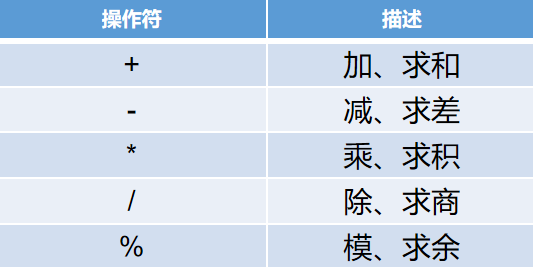
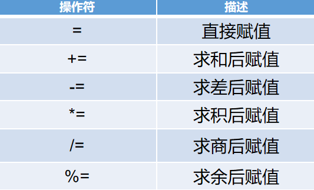
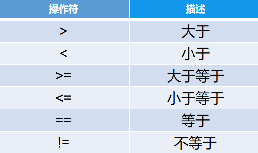
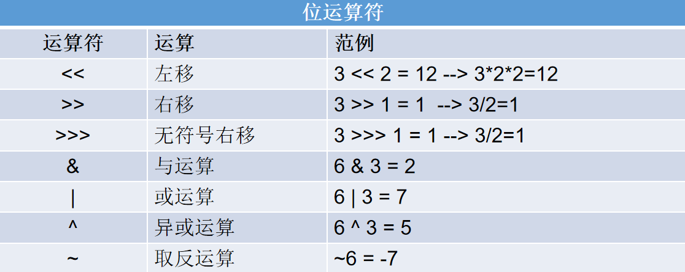

## 变量和数据类型

### 1. 强制类型转换的特殊情况

> 强制类型转换 特殊情况
>
>
> 如需修改类名 在类名的末尾 alt + 回车  rename file 即可
>
>
> 正数属于三码合一 正数的原返补码都一样
>
> ​	原码：可以通俗的理解为我们人能够直观的看明白的一种表示形式
>
> ​	反码：在原码的基础之上 符号位不变 其余各位取反 是0改为1  是1 改为0
>
> ​	补码：在反码的基础值上 +1

```java
/**
 * 强制类型转换 特殊情况
 *
 * 如需修改类名 在类名的末尾 alt + 回车  rename file 即可
 *
 *  正数属于三码合一 正数的原返补码都一样
 *  原码：可以通俗的理解为我们人能够直观的看明白的一种表示形式
 *  反码：在原码的基础之上 符号位不变 其余各位取反 是0改为1  是1 改为0
 *  补码：在反码的基础值上 +1
 *
 */
public class TestForceConvertSpecial {
    public static void main(String[] args) {
        // 长度不够 高位截断
        short s1 = 257;
        byte b1 = (byte)s1;
        System.out.println(b1);
        System.out.println("--------------------------------------------");


        // 符号位发生变化
        short s2 = 128;
        byte b2 = (byte)s2;
        System.out.println("b2 = " + b2);

        System.out.println("--------------------------------------------");

        // 符号位发生变化
        short s3 = 129;
        byte b3 = (byte)s3;
        System.out.println("b3 = " + b3);

    }
}

```

### 2. 自动类型转换补充

> 两个操作数有一个为double，计算结果提升为double。
>
> 如果操作数中没有double，有一个为float，计算结果提升为float。
>
> 如果操作数中没有float，有一个为long，计算结果提升为long。
>
> 如果操作数中没有long，有一个为int，计算结果提升为int。
>
> 如果操作数中没有int，均为short或byte或者char，计算结果仍旧提升为int。
>
>
> 总结：多个操作数进行数学计算 结果会提升为所有操作数中取值范围最大的类型

```java
/**
 * @author WHD
 * @description TODO
 * @date 2023/5/26 9:44
 *  两个操作数有一个为double，计算结果提升为double。
 *  如果操作数中没有double，有一个为float，计算结果提升为float。
 *  如果操作数中没有float，有一个为long，计算结果提升为long。
 *  如果操作数中没有long，有一个为int，计算结果提升为int。
 *  如果操作数中没有int，均为short或byte或者char，计算结果仍旧提升为int。
 *
 *  总结：多个操作数进行数学计算 结果会提升为所有操作数中取值范围最大的类型
 */
public class TestAutoConvert {
    public static void main(String[] args) {
        double a = 10;
        float b = 3.5F;
        long c = 50;
        int d = 100;
        short e = 23;
        byte f = 11;
        char g = 15;

        double result1 = a + b;

        float result2 =  b + c;

        long result3 = c + d;

        int result4 = d + e;

        int result5 = e + f;

        int result6 = e + f + g;

        System.out.println("a = " + a);


        char ch1 = 'A';

        System.out.println(ch1 + 1); // B  66


    }

}

```

### 3. 运算符

#### 3.1 算数运算符



```java
/**
 * @author WHD
 * @description TODO
 * @date 2023/5/26 9:52
 *  算数运算符
 *  + - * / %
 */
public class TestMathSign {
    public static void main(String[] args) {
        int a = 10;
        int b = 2;
        System.out.println( a + b); // 12
        System.out.println( a - b); // 8
        System.out.println( a * b); // 20
        System.out.println( a / b); // 5
        System.out.println( a % b); // 0


        int c = 10;
        int d = 3;

        System.out.println(c % d );

    }
}

```

#### 3.2 ++ 和 --


> ++ 或者 -- 单独作为一条语句书写 在前在后 是没有区别的
>
>  ++ 或者 -- 不是单独作为一条语句书写 在前在后 是有区别的
> ​    	其他的 包括 但不限于 赋值 比较 等等
> ​      	如果++或者-- 在前 先执行++或者-- 再执行其他的
> ​     	如果++或者-- 在后 先执行其他的  再执行++或者--

> 当使用++或者--操作同一个变量 再赋值给本身的情况 JVM会生成一个临时变量
>  来保存原本的值 然后把原本的值再赋值给n  所以n中保存的是10
>  而++或者--的操作 被保存在了一个临时变量中 而这个临时变量我们是无法访问

```java
package com.atguigu.test1; // 包的声明永远在Java文件的第一行

/**
 * @author WHD
 * @description TODO
 * @date 2023/5/26 10:24
 *  ++ 和 --
 *  ++ 表示自增1
 *  -- 表示自减1
 *
 *  main 或者 psvm 回车  生成main方法
 *  sout 回车 生成输出语句
 *  soutv 回车 生成输出语句 并且 将上一行的变量进行打印
 */
public class TestMathOperation {
    public static void main(String[] args) {
        int a = 10;
        a++; // 结果等同于  a = a + 1;
        System.out.println("a = " + a);

        int b = 10;
        ++b; // 结果等同于  b = b + 1;
        System.out.println("b = " + b);


        int c = 10;
        c--; // 结果等同于 c = c -1;
        System.out.println("c = " + c);


        int d = 10;
        --d; // 结果等同于d = d -1;
        System.out.println("d = " + d);

        System.out.println("--------------------------------------------------");

        // ++ 或者 -- 单独作为一条语句书写 在前在后 是没有区别的
        // ++ 或者 -- 不是单独作为一条语句书写 在前在后 是有区别的
        //      其他的 包括 但不限于 赋值 比较 等等
        //      如果++或者-- 在前 先执行++或者-- 再执行其他的
        //      如果++或者-- 在后 先执行其他的  再执行++或者--

        int e = 10;
        int f = e++;
        System.out.println("f = " + f);
        System.out.println("e = " + e);


        int j = 10;
        int k = ++j;
        System.out.println("k = " + k);
        System.out.println("j = " + j);

        System.out.println("--------------------------------------------------");

        // 当使用++或者--操作同一个变量 再赋值给本身的情况 JVM会生成一个临时变量
        // 来保存原本的值 然后把原本的值再赋值给n  所以n中保存的是10
        // 而++或者--的操作 被保存在了一个临时变量中 而这个临时变量我们是无法访问
        int n = 10;
        n = n++;
        System.out.println("n = " + n);


        int m = 11;
        m = ++m;

        System.out.println("m = " + m);


    }
}

```

#### 3.3 赋值运算符



> 赋值运算符
>
> =   直接赋值
>
> += 求和之后赋值
>
> -= 求差之后赋值
>
> *= 求积之后赋值
>
> /= 求商之后赋值
>
> %= 求余之后赋值

```java
package com.atguigu.test1;

/**
 * @author WHD
 * @description TODO
 * @date 2023/5/26 10:47
 *  赋值运算符
 *  =   直接赋值
 *  += 求和之后赋值
 *  -= 求差之后赋值
 *  *= 求积之后赋值
 *  /= 求商之后赋值
 *  %= 求余之后赋值
 */
public class TestAssignmentOperation {
    public static void main(String[] args) {
        int a = 10;
        a += 10; // 结果等同于  a = a + 10;

        System.out.println("a = " + a);

        a -= 10; // 结果等同于 a = a - 10;
        System.out.println("a = " + a);


        a *= 10; // 结果等同于 a = a * 10;
        System.out.println("a = " + a);

        a /= 10; // 结果等同于 a = a / 10;
        System.out.println("a = " + a);

        a %= 10; // 结果等同于  a = a % 10;
        System.out.println("a = " + a);


        System.out.println("---------------------------------------------------------");

        short s1 = 10;
        s1 += 10;  // 这里实现了隐式的类型转换  是JVM帮我们实现的

        short s2 = 10;
        s2 = (short) (s2 + 10);


    }
}

```


#### 3.4 关系运算符



> 关系运算符
>
> '>'大于
>
> < 小于
>
> '>=' 大于等于
>
> <= 小于等于
>
> == 等等于判断是否相等 相等为true 不等为false
>
> != 不等于 判断是否不相等 不相等为true 相等为false
>
>
> 关系运算最终的结果都为布尔类型 表示这种关系是否成立

```java
package com.atguigu.test1;

/**
 * @author WHD
 * @description TODO
 * @date 2023/5/26 10:55
 *  关系运算符
 *  > 大于
 *  < 小于
 *  >= 大于等于
 *  <= 小于等于
 *  == 等等于判断是否相等 相等为true 不等为false
 *  != 不等于 判断是否不相等 不相等为true 相等为false
 *
 *  关系运算最终的结果都为布尔类型 表示这种关系是否成立
 */
public class TestRelationOperation {
    public static void main(String[] args) {
        int a = 10;
        int b= 20;
        System.out.println(a > b); // false
        System.out.println(a < b); // true
        System.out.println(a >= b); // false
        System.out.println(a <= b); // true
        System.out.println(a == b); // false
        System.out.println(a != b); // true
    }
}

```

#### 3.5 逻辑运算符


> 逻辑运算符 ： 两个操作数 或者 表达式 进行逻辑比较 最终的结果为布尔类型
>
>
> && 短路与 要求两个或者多个表达式都成立 则结果为true
>
> 短路与 有短路的效果 如果前边表达式不成立 则后续的表达式不再执行了
>
>
>
> &  与     要求两个或者多个表达式都成立 则结果为true
>
> 没有短路效果 不管前边的表达式结果如何 都将执行完所有的表达式
>
>
>
> || 短路或 要求两个或者多个表达式至少有一个成立 则结果为true
>
> 短路或 有短路的效果 如果前边的条件已经成立 后续的表达式不再执行
>
>
> | 或      要求两个或者多个表达式至少有一个成立 则结果为true
>
> 没有短路效果 不管前边的表达式结果如何 都将执行完所有的表达式

```java
package com.atguigu.test2;

/**
 * @author WHD
 * @description TODO
 * @date 2023/5/26 11:19
 *  逻辑运算符 ： 两个操作数 或者 表达式 进行逻辑比较 最终的结果为布尔类型
 *
 *  && 短路与 要求两个或者多个表达式都成立 则结果为true
 *  短路与 有短路的效果 如果前边表达式不成立 则后续的表达式不再执行了
 *
 *
 *  &  与     要求两个或者多个表达式都成立 则结果为true
 *  没有短路效果 不管前边的表达式结果如何 都将执行完所有的表达式
 *
 *
 *  || 短路或 要求两个或者多个表达式至少有一个成立 则结果为true
 *  短路或 有短路的效果 如果前边的条件已经成立 后续的表达式不再执行
 *
 *  | 或      要求两个或者多个表达式至少有一个成立 则结果为true
 *  没有短路效果 不管前边的表达式结果如何 都将执行完所有的表达式
 */
public class TestLogicOperation {
    public static void main(String[] args) {
        int a = 10;
        int b = 20;
        int c = 15;

        System.out.println((a < b) && (b > c)); // true
        System.out.println((a < b) && (b < c)); // false


        System.out.println((a < b) & (b > c)); // true
        System.out.println((a < b) & (b < c)); // false

        System.out.println("----------------------------------------------------");

        int d = 23;
        int e = 55;
        int f = 66;

        System.out.println((d > e) || (e < f)); // true
        System.out.println((d > e) || (e > f)); // false
        System.out.println((d < e) || (e < f)); // true

        System.out.println("----------------------------------------------------");

        System.out.println((d > e) | (e < f)); // true
        System.out.println((d > e) | (e > f)); // false
        System.out.println((d < e) | (e < f)); // true


        System.out.println("----------------------------------------------------");


        System.out.println(!true);
        System.out.println(!false);


        System.out.println("----------------------------------------------------");

        int age = 19;

        System.out.println(age >= 18 ? "成年了" : "未成年");


        int numa = 10;
        int numb = numa > 5 ? 55 : 66;
        System.out.println("numb = " + numb);


    }
}

```

```java
package com.atguigu.test2;

/**
 * @author WHD
 * @description TODO
 * @date 2023/5/26 11:28
 *  逻辑运算符练习题 结合 ++ 和 --
 */
public class TestLogicOperationExercise {
    public static void main(String[] args) {
        int x = 10;
        int y = 9;
        System.out.println((x > y++) && (x < ++y)); // true
        System.out.println("y = " + y); // 11
        System.out.println("x = " + x); // 10


        int a = 10;
        int b = 9;
        System.out.println((a > ++b) && (a < ++b)); // false
        System.out.println("a = " + a); // 10
        System.out.println("b = " + b); // 10


        int c = 10;
        int d = 9;
        System.out.println((c > ++d) & (c < ++d)); // false
        System.out.println("c = " + c); // 10
        System.out.println("d = " + d); // 11


        int e = 10;
        int f = 9;
        System.out.println((e > f++) || (e < ++f)); // true
        System.out.println("e = " + e); // 10
        System.out.println("f = " + f); // 10


        int j = 10;
        int k = 9;
        System.out.println((j > k++) | (j < ++k)); // true
        System.out.println("j = " + j); // 10
        System.out.println("k = " + k); // 11


    }
}

```


#### 3.6 三元运算符

> 对布尔表达式进行判断  如果条件成立 则执行结果1  条件不成立 执行结果2
>
> 布尔表达式?结果1:结果2

```java
package com.atguigu.test2;

/**
 * @author WHD
 * @description TODO
 * @date 2023/5/26 11:19
 */
public class TestLogicOperation {
    public static void main(String[] args) {


        int age = 19;

        System.out.println(age >= 18 ? "成年了" : "未成年");


        int numa = 10;
        int numb = numa > 5 ? 55 : 66;
        System.out.println("numb = " + numb);

    }
}
```

#### 3.7 位运算符



> 位运算符
>
> << 左移 左移几位表示乘以2的几次方 会有可能变为负数的情况
>
> '>>'右移 右移几位表示除以2的几次方
>
> 如果符号位为0  则右移完以后空缺位 以0填充
>
> 如果符号位为1  则右移为以后空缺位 以1填充
>
>
> '>>>'无符号右移 不管符号位是0还是1 右移完以后 统一以0填充 即不管是正数还是负数 无符号右移之后都会变为正数
>
>
> & 相同二进制位 都为1 则结果为1  其他的均为0
>
> 可以将1 看做为true 0看做为false 进行逻辑比较
>
>
> | 相同二进制为 都为1  或者 有一个为1  则结果为1  其他均为0
>
> 可以将1 看做为true 0看做为false 进行逻辑比较
>
>
> ^ 异或(找不同) 相同二进制位 不相同 则结果为1  相同 则结果为0
>
>
> ~取反 包括符号位在内 每一个二进制位都去反  是0改为1  是1改为0

```java
package com.atguigu.test3;

/**
 * @author WHD
 * @description TODO
 * @date 2023/5/26 13:55
 *  位运算符
 *  << 左移 左移几位表示乘以2的几次方 会有可能变为负数的情况
 *  >> 右移 右移几位表示除以2的几次方
 *      如果符号位为0  则右移完以后空缺位 以0填充
 *      如果符号位为1  则右移为以后空缺位 以1填充
 *
 *  >>> 无符号右移 不管符号位是0还是1 右移完以后 统一以0填充 即不管是正数还是负数 无符号右移之后都会变为正数
 *
 *  & 相同二进制位 都为1 则结果为1  其他的均为0
 *      可以将1 看做为true 0看做为false 进行逻辑比较
 *
 *  | 相同二进制为 都为1  或者 有一个为1  则结果为1  其他均为0
 *      可以将1 看做为true 0看做为false 进行逻辑比较
 *
 *  ^ 异或(找不同) 相同二进制位 不相同 则结果为1  相同 则结果为0
 *
 *  ~取反 包括符号位在内 每一个二进制位都去反  是0改为1  是1改为0
 */
public class TestBitOperation {
    public static void main(String[] args) {
        int a = 1;
        System.out.println(a << 1);
        System.out.println(a << 2);
        System.out.println(a << 3);
        System.out.println(a << 4);
        System.out.println(a << 32);

        System.out.println("-------------------------------------------------");

        int b = 16; // 复制整行快捷键  ctrl + d
        System.out.println(b >> 1);
        System.out.println(b >> 2);
        System.out.println(b >> 3);
        System.out.println(b >> 4);
        System.out.println(b >> 5);


        int c = -10;
        System.out.println(c >> 1);
        System.out.println(c >> 2);
        System.out.println(c >> 3);

        System.out.println("-------------------------------------------------");
        int d = -10;
        System.out.println(d >>> 1);
        System.out.println(d >>> 2);
        System.out.println(d >>> 3);


        System.out.println("-------------------------------------------------");

        System.out.println(126 & 53);


        System.out.println(126 | 53);


        System.out.println(126 ^ 53);

        System.out.println(~6);

        System.out.println(~-6);


    }
}

```

### 4. 运算符的优先级

> 运算符的优先级不需要记忆。
>
> 必须知道：
>
> 1.小括号的优先级最高
>
> 2.赋值运算符的优先级最低


### 5. 包的概念

> 包就是文件夹  用于堆Java文件分门别类的管理  更加方便
>
> 包的命名规范：域名倒置 全部小写 不能以点开头或者结尾 可以包含点 每存在一个点 就相当于一个子文件夹 
>
> www.baidu.com   com.baidu.xxx 具体包名
>
> 在包中定义的java文件 必须在源文件的第一行声明所在包  使用package关键字来声 明

### 6.Scanner类

> Scanner类是JDK提供的一个工具类，位于java.util这个包中 作用为接收用户在控制台输入的内容 以实现让程序和用户产生交互效果。
>
> 使用此类必须要导包，使用import关键字在包声明之后的位置，导包。(只要是使用不再同一个包中的类，必须导包)。
>
> 此类提供了如下方法，用于接收不同类型的数据。
>
> `next() : 接收字符串`
>
> nextByte() 接收byte类型的整数
>
> nextShort() 接收short类型的整数
>
> `nextInt() ：接收int类型的整数`
>
> nextLong() 接收long类型的整数
>
> nextFloat() : 接收float类型的浮点数
>
> `nextDouble()： 接收double类型的浮点数`
>
> `nextBoolean() : 接收布尔类型的数据`
>
> nextLine() 接收整行的内容 不管这一行有什么
>
> 注意：没有nextChar() 也就是即使你需要让用户输入一个字符 也必须使用next()方法接收为一个字符串
>
> `如果输入了和接收类型不匹配的数据 将会出现: 输入不匹配异常  InputMismatchException`

```java
package com.atguigu.test3;

import java.util.Scanner;

/**
 * @author WHD
 * @description TODO
 * @date 2023/5/26 14:42
 *  提示用户输入相关信息并且打印
 *  如果输入了和接收类型不匹配的数据 将会出现: 输入不匹配异常  InputMismatchException
 */
public class TestInputMessage {
    public static void main(String[] args) {
        // 创建一个Scanner文本扫描器 取名为 input
        Scanner input = new Scanner(System.in);

        // 提示用户输入名字
        System.out.println("请输入您的姓名");

        // 接收用户输入的信息 并且赋值给name变量
        String name = input.next();

        // 将用户输入的内容打印
        System.out.println("你输入的名字为： " + name);

        System.out.println("请输入您的年龄");

        int age = input.nextInt();

        System.out.println("您输入的年龄为：" + age);

        System.out.println("请输入您的分数");

        double score = input.nextDouble();

        System.out.println("您输入的分数为：" + score);

        System.out.println("请输入您今天开心吗？");

        boolean isHappy = input.nextBoolean();

        System.out.println(isHappy == true ? "很开心" : "不开心");

        System.out.println(isHappy ? "很开心" : "不开心");

        System.out.println("程序结束");
    }
}
```

## 分支结构

### 1. 基本if结构

> 语法：
> if(布尔表达式){
> ​	//代码块1
> }
>
> 后续代码...
>
>
>
> 执行流程：
> 对布尔表达式进行判断。
> 结果为true，则先执行代码块1，再执行后续代码。
> 结果为false，则跳过代码块1，直接执行后续代码。

```java
package com.atguigu.test4;

import java.util.Scanner;

/**
 * @author WHD
 * @description TODO
 * @date 2023/5/26 15:32
 *  根据用户输入的年龄 判断用户是否成年 并且进行打印
 */
public class TestIf2 {
    public static void main(String[] args) {
        Scanner input = new Scanner(System.in);

        System.out.println("请输入您的年龄");

        int age = input.nextInt();

        if(age >= 18){
            System.out.println("恭喜你，成年了");
        }

        System.out.println("程序结束");
    }

}

```


### 2. if-else结构

> 语法：
> if(布尔表达式){
> ​	//代码块1
> }else{
> ​	//代码块2
> }
> 后续代码...
>
>
>
> 执行流程：
> 对布尔表达式进行判断。
> 结果为true，则先执行代码块1，再退出整个结构，执行后续代码。
> 结果为false，则先执行代码块2，再退出整个结构，执行后续代码。

```java
package com.atguigu.test4;

import java.util.Scanner;

/**
 * @author WHD
 * @description TODO
 * @date 2023/5/26 15:40
 */
public class TestIfElse2 {
    public static void main(String[] args) {
        Scanner input = new Scanner(System.in);

        System.out.println("请输入您的年龄");

        int age = input.nextInt();

        if(age >= 18){
            System.out.println("恭喜你，成年了");
        }else{
            System.out.println("很遗憾，未成年，猥琐发育");
        }

        System.out.println("程序结束");
    }
}

```

### 3. 多重if结构

> 语法：
> if(布尔表达式1){
> ​	//代码块1
> }else if(布尔表达式2){
> ​	//代码块2
> }else if(布尔表达式3){
> ​	//代码块3
> }else{
> ​	//代码块4
> }
>
>
>
> 执行流程：
> 表达式1为true，则执行代码块1，再退出整个结构。
>
> 表达式2为true，则执行代码块2，再退出整个结构。
>
> 表达式3为true，则执行代码块3，再退出整个结构。
>
> 以上均为false，则执行代码块4，再退出整个结构。
>
> 注意：相互排斥，有一个为true，其他均不再执行，
> 适用于区间判断。

> 多重if 可以用于判断多种情况  通常用于区间判断
>
> 使用多重if处理连续区间的情况 条件必须是有序的 升序或者 降序
>
> else if 结构没有个数限制 根据情况书写
>
> else if 不能单独出现 必须结合 if结构
>
> 多重if中的else结构是可选的 根据需求是否书写
>
> 但是注意 如果不书写else结构 那么整个多重if可能为多选0

> 需求：根据成绩判断等级
>
> 大于90分  优秀
>
> 大于80分  良好
>
> 大于70分  中等
>
> 大于等于60分 及格
>
> 小于60 不及格

```java
package com.atguigu.test4;

import java.util.Scanner;

/**
 * @author WHD
 * @description TODO
 * @date 2023/5/26 15:45
 *  多重if 可以用于判断多种情况  通常用于区间判断
 *  使用多重if处理连续区间的情况 条件必须是有序的 升序或者 降序
 *  else if 不能单独出现 必须结合 if结构
 *  多重if中的else结构是可选的 根据需求是否书写
 *  但是注意 如果不书写else结构 那么整个多重if可能为多选0
 *
 *  需求：根据成绩判断等级
 *  大于90分  优秀
 *  大于80分  良好
 *  大于70分  中等
 *  大于等于60分 及格
 *  小于60 不及格
 *
 */
public class TestManyIf1 {
    public static void main(String[] args) {
        Scanner input = new Scanner(System.in);

        System.out.println("请输入您的分数");

        double score = input.nextDouble();

        if(score > 90){
            System.out.println("优秀");
        }else if(score > 80){
            System.out.println("良好");
        }else if(score > 70){
            System.out.println("中等");
        }else if(score >= 60){
            System.out.println("及格");
        }

        System.out.println("程序结束");


    }
}

```


