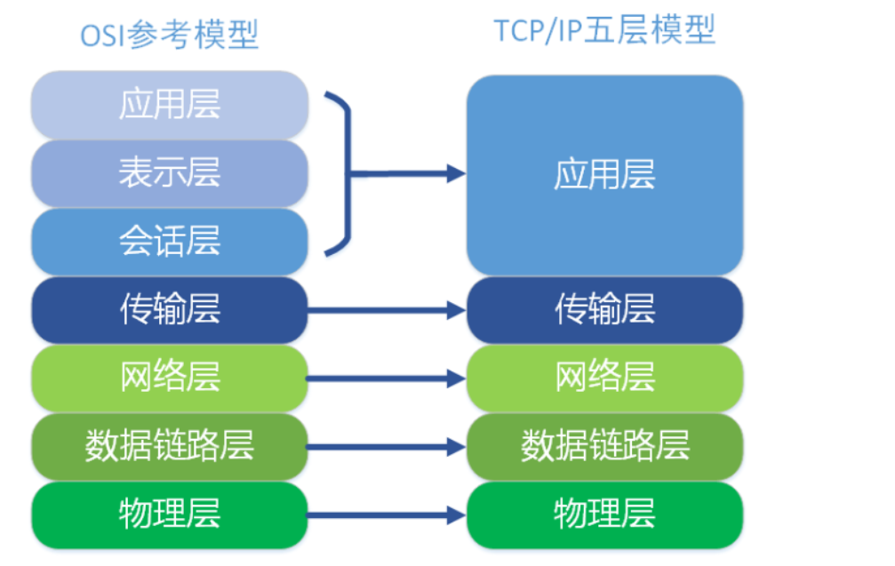

## 网络编程

### 1. 名词解释

> IP Internet  Protocol 网络协议 用于标识位于网络的每一台计算机 
>
> DNS Domain Name System 用于解析域名 将域名转换解析为与之关联的IP地址
>
> 端口号 用于标识计算机上每一个进程的编号   0 ~ 65535
>
> Socket 套接字 属于发送 接收数据的载体  

### 2. 网络模型

> 网络七层模型是  比 以下 五层 多了两层 ：会话层 和 表示层  因为七层模型太过理想化 未被实现 我们所使用的 是五层模型  




### 3.TCP

> TCP : 传输控制协议（Transmission Control Protocol）
>
> 面向连接的 安全的 可靠的传输协议 

> 三次握手和四次挥手
>
> TCP协议的三次握手：
>
> ​		第一次：客户端向服务器发送连接请求
>
> ​		第二次：服务器向客户端响应连接请求
>
> ​		第三次：客户端与服务器建立连接
>
> TCP协议的四次挥手：
>
> ​		第一次：客户端向服务器发送断开连接请求
>
> ​		第二次：服务器向客服端响应收到断开连接请求(因为TCP连接是双向的，所以此时服务器依然可以 向客户端发送信息)
>
> ​		第三次：客户端等待服务器发送信息完成，向服务器确定全部信息发送完毕，并且断开客户端与服务器的连接
>
> ​		第四次：服务器向客户端断开连接


```java
package com.atguigu.test3;

import java.io.IOException;
import java.net.ServerSocket;
import java.net.Socket;

/**
 * @author WHD
 * @description TODO
 * @date 2023/6/19 14:09
 *  服务器
 */
public class Server {
    public static void main(String[] args) throws IOException {
        ServerSocket serverSocket = new ServerSocket(8899);

        System.out.println("服务器已启动……");

        // 因为我们需要处理多个客户端的请求 所以我们需要编写死循环实现 服务器的持续监听
        while(true){

            Socket socket = serverSocket.accept();

            new ServerThread(socket).start();
        }


    }
}

```

```java
package com.atguigu.test3;

import java.io.*;
import java.net.Socket;

/**
 * @author WHD
 * @description TODO
 * @date 2023/6/19 14:14
 */
public class ServerThread extends Thread{
    private Socket socket;

    public ServerThread(Socket socket) {
        this.socket = socket;
    }

    @Override
    public void run() {
        try {
            InputStream inputStream = socket.getInputStream();

            BufferedReader reader = new BufferedReader(new InputStreamReader(inputStream));

            System.out.println(reader.readLine());

            OutputStream outputStream = socket.getOutputStream();

            outputStream.write("你好客户端".getBytes());

            socket.shutdownOutput();
        } catch (IOException e) {
            throw new RuntimeException(e);
        }


    }
}

```


```java
package com.atguigu.test3;

import java.io.*;
import java.net.Socket;

/**
 * @author WHD
 * @description TODO
 * @date 2023/6/19 14:12
 */
public class Client1 {
    public static void main(String[] args) throws IOException {
        Socket socket = new Socket("localhost", 8899);

        OutputStream outputStream = socket.getOutputStream();

        outputStream.write("你好 服务器 我是客户端1号".getBytes());

        socket.shutdownOutput();

        InputStream inputStream = socket.getInputStream();

        BufferedReader reader = new BufferedReader(new InputStreamReader(inputStream));

        System.out.println("服务器的回话是：" +  reader.readLine());


    }
}

```

```java
package com.atguigu.test3;

import java.io.*;
import java.net.Socket;

/**
 * @author WHD
 * @description TODO
 * @date 2023/6/19 14:12
 */
public class Client2 {
    public static void main(String[] args) throws IOException {
        Socket socket = new Socket("localhost", 8899);

        OutputStream outputStream = socket.getOutputStream();

        outputStream.write("你好 服务器 我是客户端2号".getBytes());

        socket.shutdownOutput();


        InputStream inputStream = socket.getInputStream();

        BufferedReader reader = new BufferedReader(new InputStreamReader(inputStream));

        System.out.println("服务器的回话是：" +  reader.readLine());

    }
}

```

### 4. UDP

> 基于UDP协议的数据传输
>
> User Datagram Protocol 非面向连接的 不安全 不可靠的传输协议  
>
> 将数据、源、目的封装成数据包，不需要建立连接
>
> 每个数据报的大小限制在64K内
>
> 发送不管对方是否准备好，接收方收到也不确认，故是不可靠的
>
> 可以广播发送
>
> 发送数据结束时无需释放资源，开销小，速度快

```java
package com.atguigu.test4;

import java.io.IOException;
import java.net.*;

/**
 * @author WHD
 * @description TODO
 * @date 2023/6/19 15:28
 */
public class Client {
    public static void main(String[] args) throws IOException {
        // DatagramPacket构造方法四个参数
        // 1.发送数据byte数组
        // 2.数据长度
        // 3.地址对象 IP地址
        // 4.端口号
        String msg = "你好，服务器";
        byte [] data = msg.getBytes();
        int length = data.length;
        InetAddress localHost = InetAddress.getLocalHost();
        int port = 8899;

        // 创建数据包、报  对象
        DatagramPacket sendPacket = new DatagramPacket(data,length ,localHost ,port);

        // 创建Socket对象
        DatagramSocket socket = new DatagramSocket();

        // 发送数据
        socket.send(sendPacket);

        System.out.println("-----------------------------------------------------------");

        // 准备一个长度为100的数组
        byte [] receiveData = new byte[100];

        // 定义接收数据的长度
        int receiveLength = receiveData.length;

        // 准备要接收数据的数据包  长度 大小 任意指定 有可能存在无法完整接收的情况
        DatagramPacket receivePacket = new DatagramPacket(receiveData,receiveLength);

        // 接收数据 此时数据在数据包对象中
        socket.receive(receivePacket);

        // 解析数据包对象
        byte[] data1 = receivePacket.getData();

        // 将数据包byte数组 转换为字符串对象
        System.out.println("服务器发送的信息为：" +  new String(data1, 0, data1.length));


    }
}

```

```java
package com.atguigu.test4;

import java.io.IOException;
import java.net.*;

/**
 * @author WHD
 * @description TODO
 * @date 2023/6/19 15:27
 *  基于UDP协议的数据传输
 *  DatagramSocket  发送接收数据类
 *  DatagramPackage 数据报类
 *  InetAddress  包含IP地址信息类
 *  SocketAddress 包含 IP地址 和 端口号信息类
 *
 */
public class Server {
    public static void main(String[] args) throws IOException {

        // 创建Socket对象 指定端口号为8899 没有指定IP地址 表示默认为本机
        DatagramSocket socket = new DatagramSocket(8899);

        System.out.println("启动服务器");

        // 准备接收数据数组
        byte [] receiveData = new byte[10];

        // 定义接收数据长度
        int length = receiveData.length;

        // 创建数据包对象 用于接收数据
        DatagramPacket receivePacket  = new DatagramPacket(receiveData,length);

        // 接收数据
        socket.receive(receivePacket);

        // 解析数据 将数据从 数据包中取出
        byte[] data = receivePacket.getData();

        // 将获取到的数据 转换为字符串对象
        System.out.println("客户端发送的信息为：" +new String(data, 0, data.length));

        System.out.println("----------------------------------------------------------");

        // 定义发送数据
        String msg = "你好客户端";

        // 将数据转换为byte数组
        byte [] sendData = msg.getBytes();

        // 定义数据长度
        int sendLength = sendData.length;

        // 因为我们目前属于服务器向客户端回复信息
        // 所客户端的地址 以及 端口号信息 我们可以直接从第一次接收到的数据包对象获取
        // 通过接收到数据包 获取 要发送给客户端的地址 和 端口号信息
        SocketAddress socketAddress = receivePacket.getSocketAddress();

        // 创建发送数据包对象
        DatagramPacket sendPacket = new DatagramPacket(sendData,sendLength,socketAddress);

        // 发送数据
        socket.send(sendPacket);


    }
}

```

### 5.TCP和UDP区别

