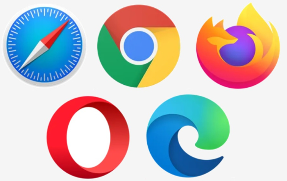
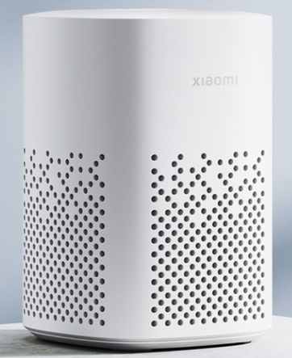
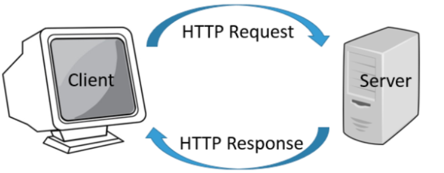
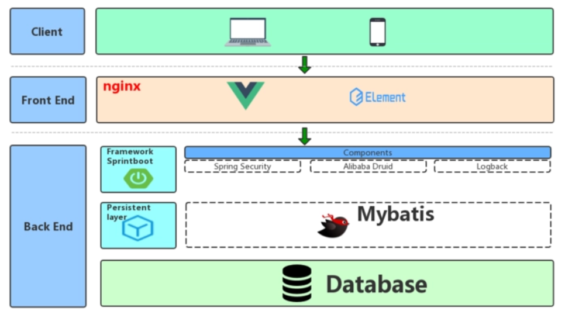

# 第一章 WEB概述

## 1.1 JAVAWEB简介

> 用Java技术来解决相关web互联网领域的技术栈.使用JAVAEE技术体系开发企业级互联网项目. 项目规模和架构模式与JAVASE阶段有着很大的差别. 在互联网项目下,首先需要明白客户端和服务器的概念

> 客户端 :与用户进行交互，用于接收用户的输入(操作)、展示服务器端的数据以及向服务器传递数据

+ 手机APP

+ 微信小程序

+ PC端程序

+ PC浏览器

+ 其他设备

> 服务端:与客户端进行交互，接收客户端的数据、处理具体的业务逻辑、传递给客户端其需要的数据

+ “服务器”是一个非常宽泛的概念，**从硬件而言:** 服务器是计算机的一种，它比普通计算机运行更快、负载更高、价格更贵。服务器在网络中为其它客户机（如PC机、智能手机、ATM等终端甚至是火车系统等大型设备）提供计算或者应用服务。**从软件而言:** 服务器其实就是安装在计算机上的一个软件，根据其作用的不同又可以分为各种不同的服务器，例如应用服务器、数据库服务器、Redis服务器、DNS服务器、ftp服务器等等

**综上所述:** 用我们自己的话来总结的话，服务器其实就是一台(或者一个集群)安装了服务器软件的高性能计算机

## 1.2 JAVAWEB技术栈

> 前端部分

HTML CSS  JavaScript ES6 Nodejs npm vite vue3 router pinia  axios  element-plus ...

> 后端部分

HTTP xml Tomcat  Servlet   Request   Response  Cookie  Sesssion  Filter Listener MySQL JDBC  Druid  Jackson lombok jwt ...

> 图解

## 1.3  JAVAWEB交互模式

> 请求

客户端向服务端传递数据的主要方式之一,客户端主动向服务端发送请求,可以携带数据,交给服务端处理. 请求只能是客户端向服务端

> 响应

服务端向客户端传递数据的主要方式之一,在接收请求后开始对数据进行处理,将结果反馈给客户端使用.响应只能是服务端向客户端

## 1.4 JAVAWEB的CS和BS模式

根据客户端的不同,我们可以将JAVA的互联网项目运行模式分为CS模式和BS模式

> CS模式  Client-Server模式   客户端-服务端模式, 该模式特点如下

1 程序分两部分,一部分是客户端需要安装的程序,一部分是要部署在服务器上的程序

2 用户需要在硬件设备或者操作系统中,下载安装特定的客户端程序才可以使用

3 程序运行的压力由客户端和服务端共同承担

4 可以借助客户端运算资源,对数据继续处理,一般可以有较好的画质和展现效果

5 程序更新时,往往需要同时更新客户端和服务端两部分

6 跨平台性能一般,不同的平台未必都有对应的客户端程序

7 开发成本较高,要为不同的客户端开发不同客户端程序

> BS模式 Browser-Server模式

1 程序就一部分,只要要部署在服务器上即可

2 无论用户使用什么设备和操作系统,只要有一个安装任意一款浏览器即可

3 程序运行的压力主要由服务端承担

4 客户端承担的计算压力小,可以对数据进行简单的继续处理,但是不像CS模式那些可以获得较好的画质和展现效果

5 程序更新时,只需要同时服务端部分

6 跨平台性能优秀,只要有一个浏览器,到处都可以使用

7 开发成本略低,不必为不同的客户端开发不同客户端程序

> 模式选择

+ 对于我们JAVA程序员来说,我们开发的是服务端代码,所有无论前端是何种类型的服务端,我们只要按照接口文档要求开发后端功能即可,尤其是在当前前后端分离模式开发为主的时代背景下,我们可以在几乎不接触前端的状态下完成开发

## 1.5 JAVAWEB实现前后端分离

> 非前后端分离

+ 1 开发不分离: 程序员既要编写后端代码,又要去修改甚至编写前端代码,程序员的工作压力较大
+ 2 部署不分离: 使用了后端动态页面技术(JSP,Thymeleaf等),前端代码不能脱离后端服务器环境,必须部署在一起

> 前后端分离

+ 1 开发分离:后端程序员只要按照接口文档去编写后端代码,无需编写或者关系前端代码,前后端程序员压力都降低
+ 2 部署分离:前端使用前端的页面动态技术,通过VUE等框架,工程化项目,前端项目可以部署到独立的服务器上

