# 一、数据库概述

<br/>

## 1、为什么要使用数据库

Java程序在运行过程中，数据在内存中维护。而一旦程序结束，内存释放，内存中所有数据都会丢失。<br/>
所以必须使用数据库把数据保存到硬盘上，做永久保存。这个效果我们称之为：持久化。<br/>
那么为什么不使用I/O流的方式来做持久化呢？<br/>
通过I/O流操作硬盘上的文件读写效率太低。其实数据库表本身就是硬盘上的文件，但由于数据库表中的数据都是结构化的，所以通过数据库来操作效率高很多。<br/>

<br/>

## 2、MySQL简介

在互联网行业，MySQL数据库毫无疑问已经是最常用的数据库。<br/>
MySQL数据库由瑞典MySQL AB公司开发。<br/>
公司名中的“AB”是瑞典语“aktiebolag”股份公司的首字母缩写。<br/>
该公司于2008年1月16号被Sun（Stanford University Network）公司收购。<br/>
然而2009年，SUN公司又被Oracle收购。<br/>
因此，MySQL数据库现在隶属于Oracle（甲骨文）公司。<br/>
MySQL中的“My”是其发明者（Michael Widenius，通常称为Monty）根据其女儿的名字来命名的。<br/>
对这位发明者来说，MySQL数据库就仿佛是他可爱的女儿。<br/><br/>

MySQL的优点有很多，其中主要的优势有如下几点：

- **可移植性**：MySQL数据库几乎支持所有的操作系统，如Linux、Solaris、FreeBSD、Mac和Windows。
- **免费**：MySQL的社区版完全免费，一般中小型网站的开发都选择 MySQL 作为网站数据库。
- **开源**：2000 年，MySQL公布了自己的源代码，并采用GPL（GNU General Public
  License）许可协议，正式进入开源的世界。开源意味着可以让更多人审阅和贡献源代码，可以吸纳更多优秀人才的代码成果。
- **关系型数据库**：MySQL可以利用标准SQL语法进行查询和操作。
- **速度快、体积小、易使用**
  ：与其他大型数据库的设置和管理相比，其复杂程度较低，易于学习。MySQL的早期版本（主要使用的是MyISAM引擎）在高并发下显得有些力不从心，随着版本的升级优化（主要使用的是InnoDB引擎），在实践中也证明了高压力下的可用性。从2009年开始，阿里的“去IOE”备受关注（I是IBM，O是Oracle，E是EJB），淘宝DBA团队再次从Oracle转向MySQL，其他使用MySQL数据库的公司还有Facebook、Twitter、YouTube、百度、腾讯、去哪儿、魅族等等，自此，MySQL在市场上占据了很大的份额。
- **安全性和连接性**：十分灵活和安全的权限和密码系统，允许基于主机的验证。连接到服务器时，所有的密码传输均采用加密形式，从而保证了密码安全。由于MySQL是网络化的，因此可以在因特网上的任何地方访问，提高数据共享的效率。
- **丰富的接口**：提供了用于C、C++、Java、PHP、Python、Ruby和Eiffel、Perl等语言的API。
- **灵活**：MySQL并不完美，但是却足够灵活，能够适应高要求的环境。同时，MySQL既可以嵌入到应用程序中，也可以支持数据仓库、内容索引和部署软件、高可用的冗余系统、在线事务处理系统等各种应用类型。
- **存储引擎架构**：MySQL最重要、最与众不同的特性，这种架构的设计将查询处理（Query Processing）及其他系统任务（Server
  Task）和数据的存储/提取相分离。这种处理和存储分离的设计可以在使用时根据性能、特性，以及其他需求来选择数据存储的方式。MySQL中同一个数据库，不同的表格可以选择不同的存储引擎。其中使用最多的是InnoDB
  和MyISAM，MySQL5.5之后InnoDB是默认的存储引擎。

<br/>

针对不同用户，MySQL提供三个不同的版本：

- （1）MySQL Enterprise Server（**企业版**）：能够以更高的性价比为企业提供数据仓库应用，该版本需要付费使用，官方提供电话技术支持。
- （2）MySQL Cluster（**集群版**）：MySQL 集群是 MySQL 适合于分布式计算环境的高可用、高冗余版本。它采用了 NDB Cluster 存储引擎，允许在
  1 个集群中运行多个 MySQL 服务器。它不能单独使用，需要在社区版或企业版基础上使用。
- （3）MySQL Community Server（**社区版**）：在开源GPL许可证之下可以自由的使用。该版本完全免费，但是官方不提供技术支持。本书是基于社区版讲解和演示的。在MySQL
  社区版开发过程中，同时存在多个发布系列，每个发布处在不同的成熟阶段。

<br/>

MySQL版本说明：

- MySQL5.7：在MySQL大版本为5的范围内，5.7是最后一个版本。
- MySQL8：相对于5.7有很多重大更新，所以不再以小版本更新，而是作为大版本更新。所以7后面的8不再作为小版本，而是作为大版本出现。

<br/>

# 二、MySQL数据库安装

<br/>

## 1、客户端和服务器

- 客户端：为用户提供操作界面
- 服务器：通过网络连接，为所有客户端提供服务

<br/>

## 2、使用MySQL的总的体系结构


<br/>
<br/>

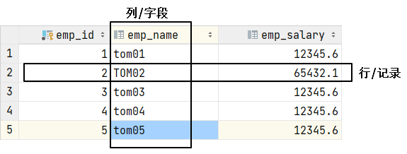

<br/>

## 3、卸载MySQL服务器

> 你要是以前安装过，而且现在能用，那就不要卸载，因为我们的重点是 SQL 语句的编写而不是 MySQL 的安装过程。<br/>
> 如果MySQL上的数据仍需使用，则必须提前备份。

<br/>


<br/>


<br/>

删除MySQL安装目录和数据目录。如果数据还需要使用则必须提前备份。

<br/>

清理注册表：

<br/>

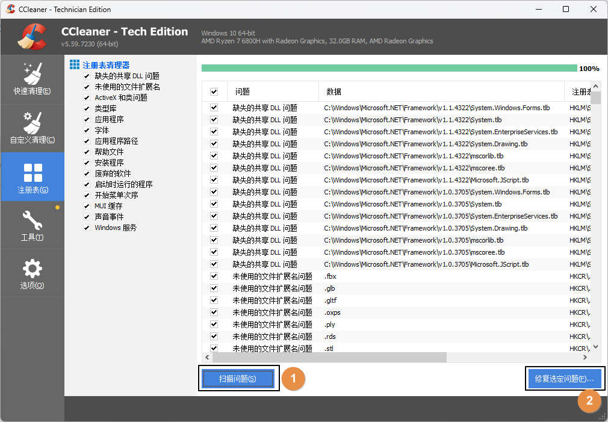

<br/>


<br/>


<br/>


<br/>

删除path环境变量：

<br/>


<br/>

<br/>

## 4、安装MySQL服务器

双击运行：mysql-installer-community-8.0.26.0.msi<br/>

<br/>


<br/>


<br/>


<br/>


<br/>


<br/>


<br/>


<br/>

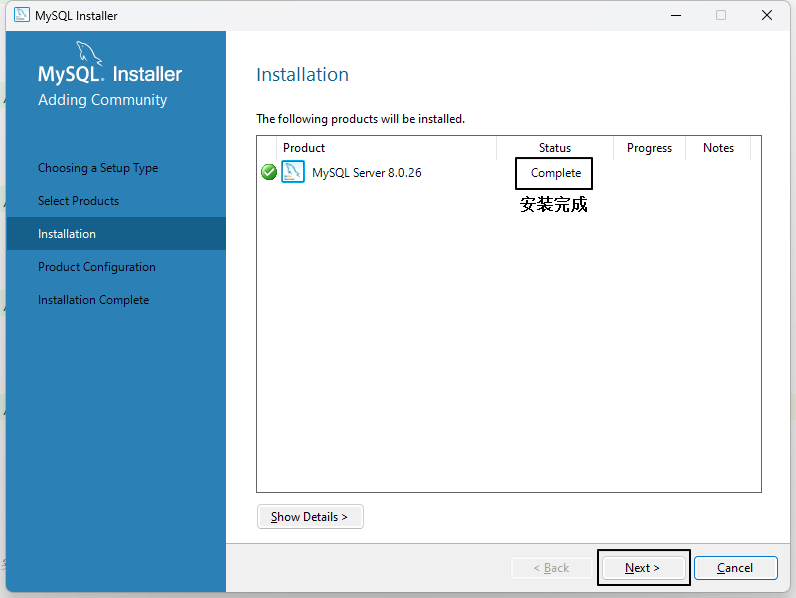

<br/>

<br/>

## 5、MySQL实例初始化

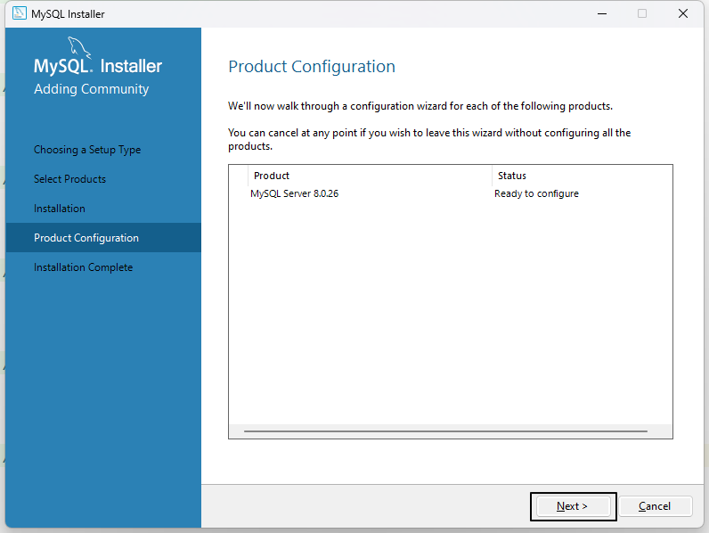

<br/>

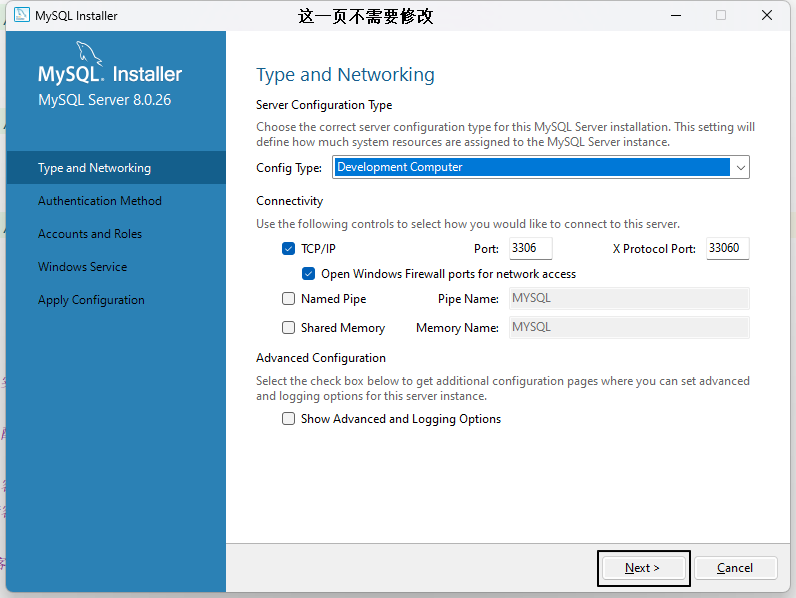

<br/>


<br/>


<br/>


<br/>


<br/>


<br/>


<br/>


<br/>

<br/>

## 6、MySQL配置环境变量


<br/>


<br/>


<br/>


<br/>

<br/>

## 7、MySQL客户端

<br/>

### ①命令行客户端

<br/>

#### [1]使用

只要正确完成以上步骤，命令行客户端就是可用的，无需额外安装。

<br/>


<br/>

<br/>

#### [2]登录

```shell
# 语法格式：mysql -h 主机名 -P 端口号 -u 用户名 -p密码
mysql -h localhost -P 3306 -u root -p
Enter password:****
```

<br/>

|参数| 含义       |含义|默认值|
|---|----------|---|---|
|-h| host     |用来指定MySQL服务器的主机地址|localhost|
|-P| port     |用来指定MySQL服务器的端口号|3306|
|-u| user     |用来指定登录MySQL时使用的用户名|&nbsp;|
|-p| password |用来指定登录MySQL时使用的密码。<br/>最好在下一行输入，让密码隐藏。|&nbsp;|

<br/>

当参数使用默认值时，这个参数可以省略。所以连接本机3306的MySQL服务器时登录命令可以简化为：
```shell
mysql -u root -p
Enter password:****
```

<br/>

<br/>

#### [3]操作

成功登录MySQL服务器之后，使用SQL语句操作MySQL数据库以及里面存储的数据。

<br/>


<br/>

命令行客户端的缺点在于没有提示，不够直观，所以往往还需要图形化界面客户端。图形化界面客户端有很多，找到你自己顺手的工具即可，具体用哪个都行，不是每一个都要装。

<br/>

### ②IDEA客户端
<br/>

#### [1]连接


<br/>


<br/>


<br/>


<br/>


<br/>

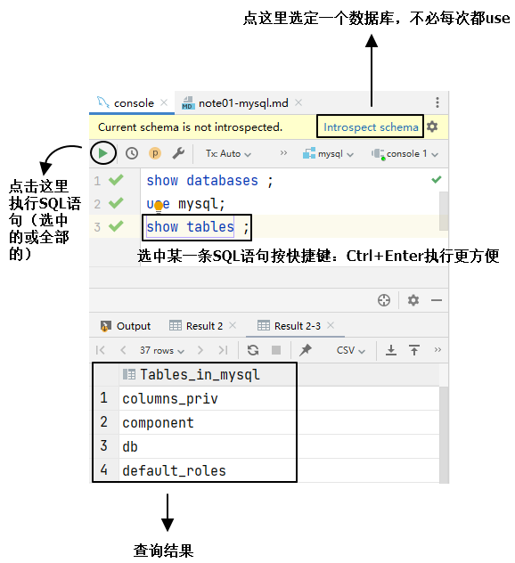

<br/>

<br/>

### ③SQLyog社区版
<br/>

#### [1]安装
运行：SQLyog-13.1.7-0.x64Community.exe

<br/>


<br/>


<br/>

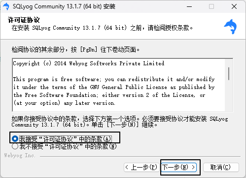

<br/>


<br/>


<br/>

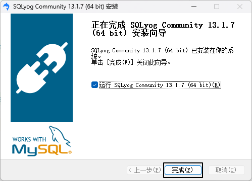

<br/>


<br/>

<br/>

#### [2]连接


<br/>

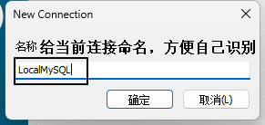

<br/>

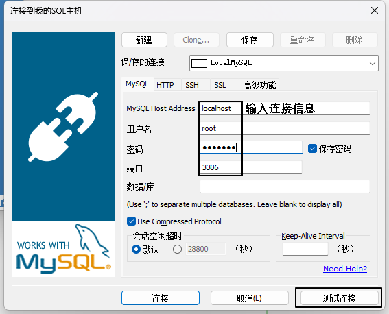

<br/>


<br/>


<br/>


<br/>


<br/>

<br/>

#### [3]操作


<br/>

<br/>

# 三、SQL基础语法
<br/>

## 1、SQL简介
SQL是结构化查询语言（Structured Query Language）的缩写，是一种用于管理关系型数据库的语言。<br/>
它可以用来创建、修改和查询数据库中的表、视图、存储过程和触发器等对象。<br/>
SQL是一种标准化的语言，被广泛应用于各种关系型数据库管理系统，如MySQL、Oracle、SQL Server等。<br/>
SQL语言具有简单易学、高效灵活、可扩展性强等特点，是数据管理领域中必不可少的工具之一。<br/>


<br/>

## 2、SQL分类
SQL (Structured Query Language) 是一种用于管理关系数据库系统 (RDBMS) 的编程语言。根据其用途和特点，SQL 可以分为以下几类：
- **DDL** (Data Definition Language **数据定义语言**)：用于定义数据库对象，如表、视图、索引等，常用的语句有 CREATE、ALTER、DROP 等。
- **DML** (Data Manipulation Language **数据操作语言**)：用于对数据库中的数据进行操作，如增加、修改、删除等，常用的语句有 INSERT、UPDATE、DELETE 等。
- **DQL** (Data Query Language **数据查询语言**)：用于查询数据库中的数据，常用的语句有 SELECT。
- **DCL** (Data Control Language **数据控制语言**)：用于控制数据库的访问权限和安全性，如授权、回收权限等，常用的语句有 GRANT、REVOKE 等。
- **TCL** (Transaction Control Language **事务控制语言**)：用于控制事务的提交和回滚，常用的语句有 COMMIT、ROLLBACK 等。

<br/>

## 3、SQL语法规范
<br/>

### ①大小写
SQL 关键词、数据库名、数据库表名、字段名都**不区分大小写**。

<br/>

### ②标识符命名规则
- 可以使用的符号包括：
  - 26个大小写英文字母
  - 数字0-9
  - 下划线
- 不能使用其它符号，可以用数字开头，但不能是纯数字
- 域内不同名
  - 同一个MySQL服务器上：数据库名必须唯一
  - 同一个数据库内：表名必须唯一
  - 同一个表内：字段名必须唯一

<br/>

### ③标识符命名规范
- 不建议以数字开头
- 因为SQL中不区分大小写，所以建议各个单词以下划线分开
- 不建议使用SQL关键词作为标识符（为什么说“不建议”而不是“不允许”呢？因为使用`符号（可称之为飘号）可以让SQL把关键词当做普通字符串）
- 在SQL中使用`符号（可称之为飘号）把数据库名、表名、字段名引起来，可以避免解析SQL时把标识符当做SQL关键词

<br/>

## 4、SQL注释
<br/>

### ①井号单行注释
```sql
# 单行注释，注释里的内容不会被执行
insert into t_emp(emp_name, emp_salary) VALUES ("tom", 12345.6);
```

<br/>

### ②双横线单行注释
```sql
-- 单行注释，注释里的内容不会被执行
insert into t_emp(emp_name, emp_salary) VALUES ("tom", 12345.6);
```

<br/>

### ③多行注释
```sql
/*
 多行注释，注释里的内容不会被执行
 多行注释，注释里的内容不会被执行
 多行注释，注释里的内容不会被执行
 */
insert into t_emp(emp_name, emp_salary) VALUES ("tom", 12345.6);
```

<br/>

## 5、MySQL数据类型初步
<br/>

### ①概述
我们现在最重要的并不是学习MySQL全部的数据类型，而应该是学习MySQL最常用的数据类型，然后对基本增删改查操作有了一定基础之后，再学习数据类型进一步的知识作为扩展。
- 整数类型：int
- 字符串类型：
  - char
  - varchar
- 小数类型：double

<br/>

### ②char类型
char类型是一种固定长度字符串。<br/>
什么意思呢？<br/>
就是说我们在把一个字段指定为char类型的时候，需要指定这个字段最多允许存放多少个字符：char(M)。<br/>
就好比char(4)表示最多存储4个字符，那么当字段值不够4个字符时，会在后面附加空格填充到4个字符。<br/>
从而确保这个字段中所有值都是4个字符。这就是所谓的固定长度字符串。<br/>
附加的空格在查询的时候会被去掉。<br/>
M的范围是0~255。当然char(0)这样的字段创建出来也没意义。<br/>

<br/>

### ③varchar类型
varchar类型是一种变长字符串。<br/>
我们在设定中同样会指定使用varchar类型的字段最多存放多少个字符：varchar(M)。<br/>
但和char的区别是，底层存储时并不是使用固定的字节数，而是根据实际存储的数据动态调整。<br/>
假设M设定为5：varchar(5)表示该字段最多保存5个字符。<br/>
再假设每个字符占一个字节（其实不一定），那么这个字段最多占5个字节。<br/>
那么当这个字段实际保存3个字符时，底层实际分配3个字节来存储这3个字符。

<br/>

## 6、数据库操作
<br/>

### ①查看所有数据库
```sql
# 列出当前数据库服务器上已经创建的所有数据库
show databases;
```

<br/>

### ②创建新的数据库
```sql
create database db_school;
```

<br/>

### ③删除数据库
```sql
drop database db_school;
```

<br/>

### ④指定当前要使用的数据库
由于一个服务器上可以有很多个数据库，所以我们需要明确指定一个现在要使用的数据库。<br/>
如果没有使用use语句，后面针对数据库的操作也没有加“数据库名”的限定，那么会报“ERROR 1046 (3D000): No database selected”（没有选择数据库）<br/>
使用完use语句之后，如果接下来的SQL都是针对一个数据库操作的，那就不用重复use了，如果要针对另一个数据库操作，那么要重新use。<br/>
```sql
use db_hr;
```

<br/>

### ⑤查看当前数据库中的所有数据库表
```sql
show tables;
```

<br/>

## 7、创建数据库表
<br/>

### ①基本语法


<br/>

### ②主键
<br/>

#### [1]提出问题
为什么需要主键？假设我们要给入学的学生录入信息，同时有两个tom，年龄都是15，录入下表后无法区分：
```sql
create table t_student(
    stu_name char(10),
    stu_age int
);
```

<br/>


<br/>

所以我们需要在创建数据库表时，用主键作为每一条记录的**唯一标识**。

<br/>

#### [2]主键的语法规则
我们对主键的要求是：
- 非空：在数据库表中主键字段非常重要，它是区分每一条记录的根本依据，所以绝对不能为空。
- 值唯一：为了能够区分每一条记录，所以主键值在数据库表中必须是唯一的。
- 设置唯一：一个表中主键只能有一个

#### [3]主键的业务规则
- 不可修改：作为每一条记录的唯一标识，一旦修改就可能导致这条记录找不到。但是这个要求是对我们编写代码的要求，MySQL没有这个限制。
- 不要使用业务字段作为主键：
什么是业务字段呢？在我们的项目中所有描述现实世界的都是业务字段。例如：学生姓名、年龄、性别、籍贯、身高、体重……<br/>
为什么不能使用业务字段作为主键呢？<br/>
即使使用唯一性的业务字段作为主键也不建议，因为业务字段可能为空，也可能删除导致表没有主键。<br/>

<br/>

#### [4]设定主键的语法
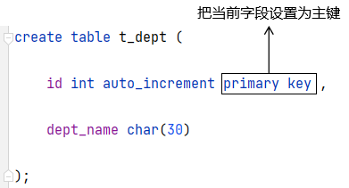

<br/>

#### [5]联合主键
大部分情况下，我们使用一个字段作为主键就够了。但是某些情况下，我们会使用多个字段共同构成主键。
```sql
# 创建老师表  
create table t_teacher(  
    teacher_id int auto_increment primary key ,  
    teacher_name char(100)  
);  
# 创建学生表  
create table t_student(  
    stu_id int auto_increment primary key ,  
    stu_name char(100)  
);  
# 表达多对多关联关系时，需要一张额外的中间表  
# 此时我们把 teacher_id 和 stu_id 的组合作为主键，这就是联合主键  
# 在联合主键中，单独来看，每个字段值都可以重复，但是参与联合的所有字段值的组合不能重复  
create table inner_teacher_student(  
    teacher_id int,  
    stu_id int,  
    primary key (teacher_id, stu_id)  
);
```
<br/>

### ③主键自增
为了保证主键值的唯一性（不重复），所以在数据库表层面为每一条新增的记录生成主键是最好的办法。<br/>
如果由程序员在Java程序中生成主键值，那么并发场景下A线程计算出来是5，B线程也计算出来是5，就重复了。<br/>
具体来说，在创建表时可以通过auto_increment关键词设置某个字段的值由MySQL生成，程序员不必指定。<br/>


<br/>

### ④查看表结构
desc是describe的缩写：
```sql
desc 表名;
```

<br/>

## 8、基础增删改查操作
先创建库和表做准备：
```sql
create database db_hr;
use db_hr;
create table t_emp(
    id int auto_increment primary key ,
    emp_name char(100),
    emp_age int,
    emp_salary double
);
```

<br/>

### ①insert语句


<br/>

```sql
# 插入一条数据，主键因为是自增的，所以不必指定数据了
insert into t_emp(emp_name, emp_age, emp_salary) VALUES ("tom",25,5000.00);

# 插入多条数据
insert into t_emp(emp_name, emp_age, emp_salary) VALUES ("jerry",35,6000.00), ("bob", 24, 3400.00), ("harry", 86, 6000.00);
```

<br/>

### ②delete语句
```sql
# 删除数据库表中的所有数据，但是这样做太危险了，几乎不可能发生在实际项目中
delete from t_emp;

# 根据查询条件指定要删除的记录，通常是根据主键来删除。where关键词后面通过表达式来构建查询条件，后面会详细讲
delete from t_emp where id=2;
```

<br/>

### ③update语句
在指定数据库表中修改指定字段
```sql
# 把 t_emp 表中的 emp_salary 字段设置为新值，但是这样会影响到所有记录
update t_emp set emp_salary=66666.66;

# 使用 where 子句设置查询条件，有针对性的修改
update t_emp set emp_salary=66666.66 where id=3;

# 涉及多个字段，用逗号分开  
update t_emp set emp_salary=400,emp_name='happy100' where id=14;  
  
# 在原来工资的基础上+200  
update t_emp set emp_salary=emp_salary+200 where id=13;
```

<br/>

### ④select语句
在指定数据库表中查询指定字段
```sql
# 查询 t_emp 表中的全部记录，每条记录都显示全部字段
select * from t_emp;

# 查询 t_emp 表中的全部记录，每条记录只显示指定字段
select id, emp_name, emp_salary from t_emp;

# 查询 t_emp 表中符合查询条件的记录，每条记录只显示指定字段
select id, emp_name, emp_salary from t_emp where id=3;
```

<br/>

> 实际开发中不要采用select \*的写法，因为这样不知道具体查询了哪些字段。<br/>
> 时间一长，别说别人，自己都不记得。

<br/>

## 9、运算符与表达式

<br/>

### ①算术运算符

|符号|说明|
|---|---|
|+|在MySQL中，加号就是求和，没有字符串拼接的功能|
|-|做减法|
|\*|做乘法|
|/|做除法|
|div|做除法，但只保留商的整数部分|
|%|取模|
|mod|取模|

<br/>

**注意**：MySQL中没有+=这样的写法。

### ②比较运算符

|符号|说明|
|---|---|
|&gt;|大于|
|&lt;|小于|
|&gt;=|大于或等于|
|&lt;=|小于或等于|
|=|等于|
|!=|不等于|
|&lt;&gt;|不等于|

<br/>

**注意**：=是做是否相等的判断，不是赋值。<br/>
**注意**：不能写 xxx = null，此时要写 xxx is null<br/>
**注意**：!=或&lt;&gt;也不能用于对null值进行判断，而是要写成 xxx is not null<br/>

### ③区间或集合范围比较运算符
- 查询在区间范围的记录：between x and y
- 查询不在区间范围的记录：not between x and y
- 查询在集合范围的记录：in (x,y,z)
- 查询不在集合范围的记录：not in (x,y,z)

### ④模糊匹配比较运算符

|符号|说明|
|---|---|
|%|表示这里可以匹配任意数量的任意字符|
|\_|每一个下划线匹配一个任意字符|

### ⑤逻辑运算符

|符号|说明|
|---|---|
|&&|逻辑与|
|and|逻辑与|
|\|\||逻辑或|
|or|逻辑或|
|!|逻辑非|
|xor|逻辑异或|

### ⑥关于null值
#### [1]null值的判断
```sql
xxx is null;
xxx is not null;
xxx <=> null;
```

#### [2]null值的计算
调用ifnull()函数，在某条记录中某个字段值为null时，使用替代值来计算：
```sql
ifnull(xxx,替代值)
```


# 四、SQL进阶语法

<br/>

## 1、SQL查询语句的各子句
- (1)**select**
- (2)**from**：从哪些表中筛选
- (3)**inner** | **left** | **right** ... **join**  **on**：关联多表查询时，去除笛卡尔积
- (4)**where**：从表中筛选的条件
- (5)**group by**：分组依据
- (6)**having**：在分组统计结果中再次筛选（with rollup)
- (7)**order by**：排序
- (8)**limit**：分页

必须按照从(1)到(8)的顺序编写各子句。

## 2、distinct去重

<br/>

```sql
# 使用 distinct 关键字对查询结果去重，重复的查询结果记录只保留一条  
select distinct emp_name, emp_salary, emp_subject from t_emp where emp_id in (54, 55);
```

<br/>

## 3、关联查询

<br/>

> 表和表之间，通过字段之间的关联可以设定表之间的关联关系：<br/>
> ❤一对一：一个人和他的身份证号之间的关系。<br/>
> ❤一对多：客户和订单之间的关系。<br/>
> ❤多对多：老师和学生之间的关系。<br/>

<br/>

当表和表之间建立了关联关系，那么我们很自然的就想知道和A表关联的B表中的记录信息，例如：<br/>
查询工资最高的员工所在部门的名称。

<br/>

### ①概念
当A表通过某个字段关联到B表时，我们说A表和B表之间建立了关联关系。<br/><br/>

当我们根据表之间的关联关系，在查询中涉及多张表时，就是关联查询。<br/><br/>

比如：员工表通过部门编号关联部门表。<br/><br/>

关联字段需要满足以下条件：
- 逻辑意义一样：比如t_emp表中使用dept_id关联t_dept表中的id
- 数据类型一样

<br/>

以下两方面不要求：
- 字段名不要求一样
- 创建外键约束不要求

### ②关联查询的各种情况


<br/>

### ③关联查询的语法要求
联合查询必须写关联条件，关联条件的个数 = n - 1。n是联合查询的表的数量。<br/>
- 如果2个表一起联合查询，关联条件数量是1， 
- 如果3个表一起联合查询，关联条件数量是2， 
- 如果4个表一起联合查询，关联条件数量是3， 
- 以此类推。。。。 
如果不指定连接条件，就会出现笛卡尔积现象，这是应该避免的。<br/>
所谓笛卡尔积就A表中每条记录都关联B表中的每条记录，既不符合逻辑，又会导致查询结果数据量暴增。<br/><br/>

```sql
# 笛卡尔积：A 表中每一条记录都和 B 表中的每一条记录匹配，  
# 查询结果数量=A表记录数×B表记录数  
# 危害1：记录全量匹配相乘导致记录数相乘，数据量暴增  
# 危害2：数据之间组合的关系不符合数据本身的逻辑关系  
select t_emp.emp_name, t_dept.dept_id from t_emp,t_dept;
```

关联条件可以用on子句编写，也可以写到where中。<br/>
但是建议用on单独编写，可读性更好。<br/>
每一个join后面都要加on子句：
- A inner|left|right join B on 条件
- A inner|left|right join B on 条件 inner|left|right jon C on 条件

### ④SQL实现
#### [1]内连接
- 语法：A表 inner join B表 on 连接条件
- 执行结果：A表 ∩ B表

<br/>


<br/>

如果遇到：“Column 'did' in field list is ambiguous”的错误提示，就是说两张表的同名字段必须加别名。

<br/>

```sql
# 写法二：内连接  
# MySQL 执行这条 SQL 语句时内部先做笛卡尔积，关联所有记录  
# 然后再使用下面的连接条件在笛卡尔积的基础上进行筛选  
# t_emp.dept_id = t_dept.dept_id 含义：员工表的部门 id 关联部门表的部门 id# 把符合连接条件的记录作为查询结果  
# 员工表没有显示的数据：dept_id 为 null 的数据（不满足连接条件的数据）  
# 部门表没有显示的数据：dept_id 没有在 t_emp 表中出现过的记录（不满足连接条件的数据）  
# 内连接的特点：参与连接的表都只采纳“满足连接条件”的记录  
select emp_id, emp_name, t_dept.dept_id, dept_name  
from t_emp  
         inner join t_dept on t_emp.dept_id = t_dept.dept_id;
```

<br/>

```sql
# 为了简化 SQL 语句，MySQL 允许我们给表设置别名  
select emp_id, emp_name, d.dept_id, dept_name  
from t_emp as e  
         inner join t_dept as d on e.dept_id = d.dept_id;  
  
select emp_id, emp_name, d.dept_id, dept_name  
from t_emp e  
         inner join t_dept d on e.dept_id = d.dept_id;  
  
# 字段也可以设置别名（as 也可以省略）  
# 字段别名加不加引号都行  
select emp_id as "员工编号", emp_name as "员工姓名", d.dept_id "部门编号", dept_name 部门名称  
from t_emp e  
         inner join t_dept d on e.dept_id = d.dept_id;  
  
# 表的别名不能加引号  
# [42000][1064] You have an error in your SQL syntax;  
# check the manual that corresponds to your MySQL server version for the right syntax to use near '"e" inner join t_dept "d" on e.dept_id = d.dept_id' at line 2  
select emp_id, emp_name, d.dept_id, dept_name  
from t_emp "e"  
         inner join t_dept "d" on e.dept_id = d.dept_id;  
select emp_id, emp_name, d.dept_id, dept_name  
from t_emp 'e'  
         inner join t_dept 'd' on e.dept_id = d.dept_id;
```

<br/>

#### [2]左外连接
- 语法：A表 left join B表 on 连接条件
- 执行结果：
	- A表全部
	- A表 - A∩B

<br/>

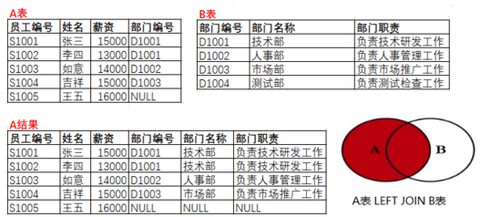

<br/>


<br/>

#### [3]右外连接
- 语法：A表 right join B表 on 连接条件
- 执行结果：
	- B表全部
	- B表 - A∩B

<br/>


<br/>

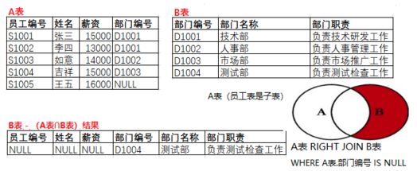

<br/>

#### [4]全外连接
- 语法：full outer join ... on，但是MySQL不支持这个关键字，MySQL使用union（合并）结果的方式代替
- 执行结果：A表 ∪ B表
- MySQL替代方案：A表查询语句 union B表查询语句

<br/>

union的语法细节：
- 参与union的查询语句，输出的字段必须是一样的
- UNION ALL合并不去重
- UNION合并且去重

<br/>


<br/>

```sql
#查询所有员工和所有部门，包括没有指定部门的员工和没有分配员工的部门。 
SELECT * FROM t_employee LEFT JOIN t_department 
ON t_employee.did = t_department.did

UNION 

SELECT * FROM t_employee RIGHT JOIN t_department 
ON t_employee.did = t_department.did;
```

<br/>


<br/>

```sql
#查询那些没有分配部门的员工和没有指定员工的部门，即A表和B表在对方那里找不到对应记录的数据。
SELECT *
FROM t_employee LEFT JOIN t_department
ON t_employee.did = t_department.did
WHERE t_employee.did IS NULL

UNION 

SELECT *
FROM t_employee RIGHT JOIN t_department
ON t_employee.did = t_department.did
WHERE t_employee.did IS NULL;
```

<br/>

#### [5]自连接
一张表自己和自己关联，物理上来说是同一张表，逻辑上当作两张表来写SQL。
```sql
/*
分析表结构：t_employee表
mid：是表示存储员工的领导编号。即该员工归谁管。领导编号其实就是“领导”作为员工身份的员工编号
   例如：eid为3的员工邓超远，他的mid是7，表示他的领导是员工编号为7的员工。
   eid为7的员工是贾宝玉，他的eid是7，贾宝玉作为员工来说，他的编号是7。

mid的取值范围受到eid字段的限制。mid的值选择必须是eid现有值范围。

可以理解为mid和eid是关联字段，如果要建外键，可以在mid字段上建外键。
foreign key(mid) references t_employee(eid)   

此时t_employee既是子表也是父表。
员工表t_employee建立了外键：
CONSTRAINT `t_employee_ibfk_3` FOREIGN KEY (`mid`) REFERENCES `t_employee` (`eid`) ON DELETE SET NULL ON UPDATE CASCADE
*/

#查询每一个员工自己的编号、名字、薪资和他的领导的编号、姓名、薪资。
#把t_employee当成两张表，通过取别名的方式
#t_employee AS emp 把员工表 当成员工表
# t_employee AS mgr 把员工表  当成存储领导信息的领导表
#emp.mid = mgr.eid; 员工表的领导编号就是领导表的员工编号
SELECT emp.eid,emp.ename,emp.salary,  mgr.eid,mgr.ename,mgr.salary
FROM t_employee AS emp INNER JOIN t_employee AS mgr
ON emp.mid = mgr.eid;
```

<br/>

#### [6]小结


<br/>

## 4、分组与聚合查询

<br/>

### ①分组的概念
根据某个（或某几个）字段的值，把查询结果分组，指定字段的值相同的划分到同一组。<br/>
例如：根据部门id分组<br/>


<br/>

### ②聚合的概念
分组之后，一个组内很可能包含很多条数据，而最终的查询结果中，一个组只生成一条记录。<br/>
所以问题来了，组内多条记录怎么压缩成一条？<br/>
两个办法：
- 情况一：某个字段在组内所有记录中的值都是一样的，那就可以直接用。
- 情况二：使用聚合函数。

<br/>

### ③练习案例一
目标：查询各部门员工的平均工资。<br/>

```sql
select avg(emp_salary), dept_id from t_emp group by dept_id;
```

<br/>

### ④练习案例二
目标：得到各部门平均工资之后显示合计数值
```sql
select avg(emp_salary), dept_id from t_emp group by dept_id with rollup ;
```

<br/>

### ⑤练习案例三
目标：先按照部门分组，在部门分组结果内再按照专业分组
```sql
select avg(emp_salary), emp_subject, dept_id  
from t_emp  
group by dept_id, emp_subject;
```

### ⑥练习案例四
目标：查询各部门平均工资，要求显示部门名称。
```sql
select avg(emp_salary), d.dept_id, dept_name  
from t_emp e  
         left join t_dept d on e.dept_id = d.dept_id  
group by dept_id;
```

### ⑦练习案例五
关于分组、聚合操作时涉及的查询条件，原则是：能在分组、聚合操作前执行的查询条件就在操作前执行。因为查询条件把不满足条件的数据过滤掉之后，分组、聚合操作运算量更小，效率更高。
- 分组、聚合操作前执行的查询条件：where子句
- 分组、聚合操作后执行的查询条件：having子句
```sql
# 分组、聚合操作前过滤数据：针对所有女员工数据根据部门 id 分组  
select avg(emp_salary), dept_id, emp_gender  
from t_emp  
where emp_gender = 'female'  
group by dept_id;  
  
# 分组、聚合操作后过滤数据：显示平均工资大于4000的聚合结果  
select avg(emp_salary) emp_avg_salary, dept_id  
from t_emp  
group by dept_id  
having emp_avg_salary > 4000;
```

## 5、子查询

<br/>

### ①概念
嵌套在另一个SQL语句中的查询。select、update、delete、insert、create等语句都可以嵌套子查询。

<br/>

### ②select嵌套子查询

<br/>

```sql
# 需求：计算每个员工的工资和所有员工平均工资的差值
select emp_id,   
       emp_name,   
       emp_salary,   
       emp_salary - (select avg(emp_salary) from t_emp) difference
from t_emp;
```

<br/>

### ③where嵌套子查询
where子句中嵌入子查询肯定是作为查询条件。所以子查询部分需要配合各种表达式。此时需要考虑一个因素：子查询返回的数据是一个值还是多个值？
- 子查询结果：单列单个值——直接使用比较运算符，如“<”、“<=”、“>”、“>=”、“=”、“!=”等与子查询结果进行比较。
- 子查询结果：单列多个值
	- 可以使用比较运算符IN或NOT IN进行比较。
	- 可以使用比较运算符, 如“<”、“<=”、“>”、“>=”、“=”、“!=”等搭配ANY、SOME、ALL等关键字与查询结果进行比较。

<br/>

```sql
# 查询工资最高的员工工资和姓名
SELECT ename,salary FROM t_employee WHERE salary = (SELECT MAX(salary) FROM t_employee);

# 在“t_employee”表中查询和“白露”，“谢吉娜”同一部门的员工姓名和电话。
SELECT ename,tel,did
FROM t_employee
WHERE did IN(SELECT did FROM t_employee WHERE ename='白露' || ename='谢吉娜');

SELECT ename,tel,did
FROM t_employee
WHERE did = ANY(SELECT did FROM t_employee WHERE ename='白露' || ename='谢吉娜');

# 在“t_employee”表中查询薪资比“白露”，“李诗雨”，“黄冰茹”三个人的薪资都要高的员工姓名和薪资。
SELECT ename,salary
FROM t_employee
WHERE salary >ALL(SELECT salary FROM t_employee WHERE ename IN('白露','李诗雨','黄冰茹'));
```

<br/>

### ④having嵌套子查询

<br/>

```sql
# 查询“t_employee”和“t_department”表，按部门统计平均工资，
# 显示部门平均工资比全公司的总平均工资高的部门编号、部门名称、部门平均薪资，
# 并按照部门平均薪资升序排列。
SELECT t_department.did,dname,AVG(salary)
FROM t_employee RIGHT JOIN t_department
ON t_employee.did = t_department.did
GROUP BY t_department.did
HAVING AVG(salary) >(SELECT AVG(salary) FROM t_employee)
ORDER BY AVG(salary);
```

<br/>


### ⑤EXISTS型子查询
<p>EXISTS型子查询也是存在外层SELECT的WHERE子句中，不过它和上面的WHERE型子查询的工作模式不相同，所以这里单独讨论它。</p>

<p>如果EXISTS关键字后面的参数是一个任意的子查询，系统将对子查询进行运算以判断它是否返回行，如果至少返回一行，那么EXISTS的结果为true，此时外层查询语句将进行查询；如果子查询没有返回任何行，那么EXISTS的结果为false，此时外层查询语句不进行查询。EXISTS和NOT EXISTS的结果只取决于是否返回行，而不取决于这些行的内容，所以这个子查询输入列表通常是无关紧要的。</p>

<p>如果EXISTS关键字后面的参数是一个关联子查询，即子查询的WHERE条件中包含与外层查询表的关联条件，那么此时将对外层查询表做循环，即在筛选外层查询表的每一条记录时，都看这条记录是否满足子查询的条件，如果满足就再用外层查询的其他WHERE条件对该记录进行筛选，否则就丢弃这行记录。</p>

<br/>

```sql
# 查询“t_employee”表中是否存在部门编号为NULL的员工，
# 如果存在，查询“t_department”表的部门编号、部门名称。
SELECT * FROM t_department 
WHERE EXISTS(SELECT * FROM t_employee  WHERE did IS NULL);

# 查询“t_department”表是否存在与“t_employee”表相同部门编号的记录，
# 如果存在，查询这些部门的编号和名称。
SELECT * FROM t_department
WHERE EXISTS(SELECT * FROM t_employee WHERE t_employee.did = t_department.did);

# 查询结果等价于下面的sql
SELECT DISTINCT t_department.*
FROM t_department INNER JOIN t_employee
ON t_department.did = t_employee.did;
```

<br/>

### ⑥from嵌套子查询
当子查询结果是多列的结果时，通常将子查询放到FROM后面，然后采用给子查询结果取别名的方式，把子查询结果当成一张“动态生成的临时表”使用。

<br/>

```sql
# 在“t_employee”表中，查询每个部门的平均薪资，
# 然后与“t_department”表联合查询
# 所有部门的部门编号、部门名称、部门平均薪资。

SELECT did,AVG(salary) FROM t_employee GROUP BY did;

+------+-------------+
| did  | AVG(salary) |
+------+-------------+
|    1 |  11479.3125 |
|    2 |       13978 |
|    3 |    37858.25 |
|    4 |       12332 |
|    5 |       11725 |
+------+-------------+
5 ROWS IN SET (0.00 sec)

# 用上面的查询结果，当成一张临时表，与t_department部门表做联合查询
# 要给这样的子查询取别名的方式来当临时表用，该临时表必须起别名。
# 而且别忘了：表的别名不能加引号（字段别名可以）

# 错误示范：from后面的t_department和temp表都没有salary字段，
# SELECT t_department.did ,dname,AVG(salary)出现AVG(salary)是错误的
SELECT t_department.did ,dname, AVG(salary)
FROM t_department LEFT JOIN (SELECT did,AVG(salary) FROM t_employee GROUP BY did) temp
ON t_department.did = temp.did;

# 正确写法是：
SELECT t_department.did,dname,pingjun
FROM t_department LEFT JOIN (SELECT did,AVG(salary) AS pingjun FROM t_employee GROUP BY did) temp
ON t_department.did = temp.did;
```

<br/>

### ⑦update嵌套子查询

<br/>

```sql
# [1]测试部员工涨薪1.5倍。
UPDATE t_employee
SET salary = salary * 1.5
WHERE did = (SELECT did FROM t_department WHERE dname = '测试部');

# [2]修改“t_employee”表中did为NULL的员工信息，
# 将他们的did值修改为“测试部”的部门编号。
# 子查询select did from t_department where dname = '测试部'
# 这种子查询必须是单个值，否则无法赋值
UPDATE t_employee 
SET did = (SELECT did FROM t_department WHERE dname = '测试部')
WHERE did IS NULL;

# [3]修改“t_employee”表中“李冰冰”的薪资值等于“孙红梅”的薪资值。
# 这里使用子查询先在“t_employee”表中查询出“孙红梅”的薪资。
# select salary from t_employee where ename = '孙红梅';

# 错误示范：You can't specify target table 't_employee' for update in FROM clause'
UPDATE t_employee
SET salary = (SELECT salary FROM t_employee WHERE ename = '孙红梅')
WHERE ename = '李冰冰';

# 当update的表和子查询的表是同一个表时，需要将子查询的结果用临时表的方式表示
# 也就是再套一层子查询，使得update和最外层的子查询不是同一张表
UPDATE t_employee
SET salary = (SELECT salary FROM(SELECT salary FROM t_employee WHERE ename = '孙红梅')temp)
WHERE ename = '李冰冰';

# [3]修改“t_employee”表“李冰冰”的薪资与她所在部门的平均薪资一样。
# 子查询第一层，查询李冰冰的部门编号 
# select did from t_employee where ename = '李冰冰';

# 子查询第二层，查询李冰冰所在部门的平均薪资
# select avg(salary) from t_employee where did = (select did from t_employee where ename = '李冰冰');

# 子查询第三层，把第二层的子查询结果当成临时表再查一下结果
# 目的使得和外层的update不是同一张表
SELECT pingjun 
FROM (
	SELECT AVG(salary) pingjun 
	FROM t_employee 
	WHERE did = (SELECT did FROM t_employee WHERE ename = '李冰冰') temp
);

# update更新
UPDATE t_employee
SET salary = 
(SELECT pingjun FROM 
  (SELECT AVG(salary) pingjun FROM t_employee WHERE did = 
    (SELECT did FROM t_employee WHERE ename = '李冰冰') ) temp)
WHERE ename = '李冰冰';
```

<br/>

### ⑧delete嵌套子查询

<br/>

```sql
# [1]从“t_employee”表中删除“测试部”的员工记录。
DELETE FROM t_employee 
WHERE did = (SELECT did FROM t_department WHERE dname = '测试部');

# [2]从“t_employee”表中删除和“李冰冰”同一个部门的员工记录。
# 子查询 “李冰冰”的部门编号
# select did from t_employee where ename = '李冰冰';

# You can't specify target table 't_employee' for update in FROM clause'
# 删除和子查询是同一张表
DELETE FROM t_employee WHERE did = (SELECT did FROM t_employee WHERE ename = '李冰冰');

DELETE FROM t_employee WHERE did = (SELECT did FROM (SELECT did FROM t_employee WHERE ename = '李冰冰')temp);
```

<br/>

### ⑨使用子查询复制表

<br/>

```sql
# 仅仅是复制表结构，可以用create语句
CREATE TABLE department LIKE t_department;

# 使用INSERT语句+子查询，复制数据，此时INSERT不用写values
INSERT INTO department (SELECT * FROM t_department WHERE did<=3);

# 同时复制表结构+数据
# 如果select后面是部分字段，复制的新表就只有这一部分字段
CREATE TABLE d_department AS (SELECT * FROM t_department);
```

<br/>

## 6、排序

<br/>

```sql
# 需求：查询员工姓名和工资，按照工资排序（默认是升序）  
select emp_name, emp_salary from t_employee order by emp_salary;  
select emp_name, emp_salary from t_employee order by emp_salary asc;  
  
# 需求：降序排序  
select emp_name, emp_salary from t_employee order by emp_salary desc;  
  
# 需求：先根据部门 id 排序，在部门 id 重复的范围内，再根据工资排序  
select emp_name, dept_id, emp_salary from t_employee order by dept_id asc, emp_salary desc;
```

<br/>


## 7、分页

### ①概念


<br/>

页面上每次只显示数据的一部分，而不是全部数据。

<br/>

分页显示数据的好处：
- 查询速度比加载全部数据要快。
- 只加载一部分数据，节约资源：内存、网络传输时间……
- 有利于改善用户体验：一次性看到非常多的数据（几百、上千），用户体验会不太好

<br/>

页面上用户操作的方式：
- 点击页码按钮
- 点击上一页、下一页按钮
- 在文本框输入指定页的页码
上面三种其实都是提供了一个参数：目标页面的页码（pageNo）

<br/>

除了页码，还有一个隐含的参数：每页显示数据的数量（pageSize）

<br/>

我们后端程序的任务就是根据前端提供的 pageNo、pageSize 把页面显示分页所需的数据查询出来。

<br/>

### ②MySQL分页
MySQL 分页需要用到 limit 子句。limit 子句需要传入两个参数：
- 参数1：index
- 参数2：pageSize

<br/>

使用 limit 子句的公式：(pageNo-1)\*pageSize,pageSize

<br/>

```sql
# limit 子句本身的含义是：从你指定的索引位置开始，加载指定数量的记录  
select emp_id, emp_name, emp_age from t_employee limit 0, 5;  
select emp_id, emp_name, emp_age from t_employee limit 5, 5;  
select emp_id, emp_name, emp_age from t_employee limit 10, 5;  
  
# 第一页 pageNo:1，index:0      0*5     (pageNo-1)*pageSize  
# 第二页 pageNo:2，index:5      1*5  
# 第三页 pageNo:3，index:10     2*5
```

## 8、系统函数
<p>函数：代表一个独立的可复用的功能。</p>
<p>和Java中的方法有所不同，不同点在于：MySQL中的函数必须有返回值，参数可以有可以没有。</p>
<p>MySQL函数分类：</p>
- 系统预定义函数：MySQL数据库管理软件给我们提供好的函数，直接用就可以，任何数据库都可以用公共的函数。
	- 聚合函数：或者又称为分组函数，多行函数，表示会对表中的多行记录一起做一个“运算”，得到一个结果。
	- 单行函数：表示会对表中的每一行记录分别计算，有n行得到还是n行结果
- 用户自定义函数：由开发人员自己定义的，通过CREATE FUNCTION语句定义，是属于某个数据库的对象。

<br/>

### ①单行函数举例
#### [1]concat字符串拼接
```sql
# 拼接字符串  
select concat("Hello", " ", "tom!");  
select emp_id, concat(emp_name, " ", emp_salary) from t_employee where emp_id=6;  
  
# 替换字符串  
select replace(emp_name, "a", "@") from t_employee;
```

#### [2]case ... when
```sql
SELECT eid,ename,salary,
CASE WHEN salary>20000 THEN '羡慕级别'
     WHEN salary>15000 THEN '努力级别'
     WHEN salary>10000 THEN '平均级别'
     ELSE '保底级别'
END AS "等级"
FROM t_employee;  
```

#### [3]round()
```sql
# ROUND(x,y) 返回参数x的四舍五入的有y位的小数的值  
select avg(emp_salary) from t_employee;  
select round(avg(emp_salary), 2) from t_employee;  
select round(avg(emp_salary), 1) from t_employee;
```

### ②聚合函数举例
- avg() 多个值计算平均数
- min() 多个值取最小值
- max() 多个值取最大值
- sum() 多个值求和
- count() 多个值计数
- group_concat() 分组后，组内多个值拼接成一个字符串

<br/>

```sql
# group_concat()分组后，组内多个值拼接成一个字符串  
select dept_id 部门id, group_concat(emp_name separator ",") 部门成员列表  
from t_employee  
group by dept_id;
```

# 五、约束
## 1、概述
### ①、约束的作用
给数据库表中的数据额外添加限制条件，以此来保证『数据完整性』（说白了就是数据正确性）：
- 实体完整性（Entity Integrity）：例如，同一个表中，不能存在两条完全相同无法区分的记录
- 域完整性（Domain Integrity）：例如：年龄范围0-120，性别范围“男/女”
- 引用完整性（Referential Integrity）：例如：员工所在部门，在部门表中要能找到这个部门
- 用户自定义完整性（User-defined Integrity）：例如：用户名唯一、密码不能为空等，本部门经理的工资不得高于本部门职工的平均工资的5倍。

<br/>

### ②约束的类型
#### [1]从约束目标来区分
- 键约束：主键约束、外键约束、唯一键约束
- Not NULL约束：非空约束
- Check约束：检查约束
- Default约束：默认值约束

<br/>

自增是键约束字段的一个额外的属性。

<br/>

#### [2]从约束范围来区分
- 表级约束：不仅要看约束字段当前单元格的数据，还要看其他单元格的数据。
	- 键约束
	- 检查约束
- 列级约束：约束字段只看当前单元格的数据即可，和其他单元格无关。
	- 非空约束
	- 默认值约束

<br/>

```sql
# 查询所有表级约束
SELECT * FROM information_schema.table_constraints WHERE table_name = '表名称';
```

<br/>

### ③约束和索引的关系
<p>在MySQL中键约束会自动创建索引，提高查询效率。索引的详细讲解在高级部分。</p>

<p>MySQL高级会给大家讲解索引、存储引擎等，因为高级要给大家分析SQL性能。而基础阶段先不管效率，只要能查出来就行。</p>

约束和索引不同：
- 约束是一个逻辑概念，它不会单独占用物理空间。
- 索引是一个物理概念，它是会占用物理空间。

<p>例如：字典</p>
<p>字典里面有要求，不能有重复的字（字一样，读音也一样），这是约束。</p>
<p>字典里面有“目录”，它可以快速的查找某个字，目录需要占用单独的页。</p>

<br/>

## 2、非空约束
### ①效果
在数据库表中，限定某个列的值不能为null。
- 细节1：只能针对单独一个列设定非空约束，不能同时针对多个字段设置组合非空。
- 细节2：一张数据库表中可以有多个字段设置非空约束。

### ②语法
在创建或修改表时，声明字段时指定not null。
```sql
create table 表名称(
  字段名 数据类型 not null,
  字段名 数据类型 not null,
  字段名 数据类型
);
```

### ③测试
非空约束会禁止以下行为：
- insert时，非空字段未提供值且没有默认值
- insert时，非空字段明确设置为null
- update时，非空字段明确设置为null

<br/>

```sql
create database db_hello;  
use db_hello;  
create table t_hello(  
    hello_id int auto_increment primary key ,  
    hello_name char(10) not null,  
    hello_age int  
);  
# 正常执行，没问题  
insert into t_hello(hello_name) values("goods");  
  
# [23000][1048] Column 'hello_name' cannot be null  
insert into t_hello(hello_name) VALUES(null);  
  
# [HY000][1364] Field 'hello_name' doesn't have a default value  
insert into t_hello(hello_age) values(55);  
  
# [23000][1048] Column 'hello_name' cannot be null  
update t_hello set hello_name=null where hello_id=1;
```


## 3、唯一键约束
### ①效果
- 单列唯一：单个字段值不可重复。
- 组合唯一：多个字段值的组合不可重复。

### ②特点
- 一个表可以有很多个唯一键约束
- 每一个唯一键约束字段都会自动创建唯一索引
- 创建唯一索引时也会自动添加唯一约束
- 唯一键约束允许为空，甚至允许约束范围内多个值为空
- 通过删除唯一键约束的索引来删除唯一键约束

### ③测试
```sql
create table t_stu(  
    stu_id int auto_increment primary key ,  
    stu_name char(100) unique key , # 单列唯一  
    stu_subject char(100),  
    stu_direct char(100),  
    unique key (stu_subject, stu_direct) # 组合唯一  
);  
# 测试单列唯一  
insert into t_stu(stu_name, stu_subject, stu_direct) VALUES ("tom", "Java", "RD");  
  
# [23000][1062] Duplicate entry 'tom' for key 't_stu.stu_name'  
insert into t_stu(stu_name, stu_subject, stu_direct) VALUES ("tom", "PHP", "QA");  
  
# 测试组合唯一  
# [23000][1062] Duplicate entry 'Java-RD' for key 't_stu.stu_subject'  
insert into t_stu(stu_name, stu_subject, stu_direct) VALUES ("jerry", "Java", "RD");  
  
# 测试唯一字段可以为空，空值可以有多个  
insert into t_stu(stu_subject) values ("MySQL");  
insert into t_stu(stu_subject) values ("Oracle");
```

## 4、主键约束
### ①作用
为数据库表中的每一条记录提供唯一标识。

<br/>

### ②特点
- 唯一并且非空
- 一个表最多只能有一个主键约束
- 主键可以由多列组成，这就是联合主键
- 主键列会自动创建索引（能够根据主键查询的，就根据主键查询，效率更高）
- 如果删除主键约束了，主键约束对应的索引就自动删除了，但是非空约束不会自动删除。

> 主键列的唯一并且非空是约束的概念，但是MySQL会给每个表的主键列创建索引，会开辟单独的物理空间来存储每一个主键的目录表（B+Tree结构）。这样设计的意义，可以根据主键快速查询到某一行的记录。

### ③主键约束和唯一键约束区别
- 在一张数据库表中：主键约束只能有一个，但是唯一约束可以有多个。
- 主键约束要求字段值不可为空，唯一键约束没有非空要求。

<br/>

### ④语法
```sql
create table 表名称(
	# 在声明字段时指定
	字段名  数据类型  primary key,
    字段名  数据类型,  
    字段名  数据类型  
);
create table 表名称(
	字段名  数据类型,
    字段名  数据类型,  
    字段名  数据类型,
    # 在表级别指定
    primary key(字段名或字段列表)
);
```

## 5、默认值约束
### ①效果
在插入记录时，如果没有给字段提供值，那么会自动使用默认值。

### ②语法
```sql
create table 表名称(
	字段名  数据类型  primary key,
    字段名  数据类型  【unique key】 【not null】,  
    字段名  数据类型  【not null】 【default 默认值】 
);
```

### ③测试
```sql
create table t_flower(  
    flower_id int primary key auto_increment,  
    flower_name char(100),  
    flower_color char(100) default 'red'  
);  
insert into t_flower(flower_name) values ("mother solo");
```

## 6、自增属性
### ①效果
给某个字段自动赋值，这个值是一直往上增加，如果没有特殊设定，每次自增1。

<br/>

### ②特点和要求
- 一个表只能有一个自增字段
- 并且自增字段只能是key字段，即定义了主键、唯一键等键约束的字段。一般都是给主键或唯一键加自增。
- 自增字段应该是数值类型，一般都是整数类型。
- 如果插入数据时，自增列指定了 0 和 null，会在当前最大值的基础上自增，
- 如果自增列手动指定了具体值，直接赋值为具体值。

<br/>

### ③语法
```sql
create table 表名称(
  字段名  数据类型 primary key auto_increment,
  字段名  数据类型,  
  字段名  数据类型
) auto_increment=自增起点值;
```

<br/>

### ④测试
```sql
# 测试：一个表只能有一个自增字段  
# [42000][1075] Incorrect table definition;  
# there can be only one auto column and it must be defined as a key  
create table t_user(  
    user_id int auto_increment,  
    user_age int auto_increment  
);

# 测试：自增字段必须是数值类型  
# [42000][1063] Incorrect column specifier for column 'user_name'  
create table t_user(  
    user_name char(100) auto_increment  
);

create table t_pen(  
    pen_id int primary key auto_increment, # 指定字段值自增生成  
    pen_name char(100)  
) auto_increment=66; # 指定自增值起点  
insert into t_pen(pen_name) values("pen01");  
insert into t_pen(pen_name) values("pen02");  
insert into t_pen(pen_name) values("pen03");  
  
# 如果自增列指定了 0 和 null，会在当前最大值的基础上自增  
insert into t_pen(pen_id, pen_name) values(0, "pen04");  
insert into t_pen(pen_id, pen_name) values(null, "pen05");  
  
# 如果自增列手动指定了具体值，直接赋值为具体值。  
insert into t_pen(pen_id, pen_name) values(144, "pen06");
```

<br/>

## 7、检查约束
### ①效果
<p>检查（CHECK） 约束用于限制字段中的值的范围。如果对单个字段定义 CHECK 约束，那么该字段只允许特定范围的值。</p>

<p>如果对一个表定义 CHECK 约束，那么此约束会基于行中其他字段的值在特定的字段中对值进行限制。</p>

<p>在MySQL 8.0.16版本之前， CREATE TABLE语句支持给单个字段定义CHECK约束的语法，但是不起作用。</p>

<p>在MySQL8.0.16版本之后，CREATE TABLE语句既支持给单个字段定义列级CHECK约束的语法，还支持定义表级CHECK约束的语法。</p>

### ②语法
```sql
#在建表时，可以指定检查约束
create table 表名称(
  字段名1 数据类型 check(条件),  # 列级检查约束
  字段名2 数据类型,
  字段名3 数据类型,
  check (条件) # 表级检查约束
);
```

### ③测试
```sql
create table t_employee(  
    employee_id int auto_increment primary key ,  
    employee_name char(100) check ( employee_name like '%dog%'), # 列级检查约束  
    hire_date date,  
    birthday date,  
    check ( year(hire_date)-year(birthday)>=18 ) # 表级检查约束  
);  
  
# 正确插入  
insert into t_employee(employee_name, hire_date, birthday)  
values ("tom dog peter", "2023-05-11", "1986-10-14");  
  
# 违反列级约束  
# [HY000][3819] Check constraint 't_employee_chk_1' is violated.  
insert into t_employee(employee_name, hire_date, birthday)  
values ("tom peter", "2023-05-11", "1986-10-14");  
  
# 违反表级约束  
# [HY000][3819] Check constraint 't_employee_chk_2' is violated.  
insert into t_employee(employee_name, hire_date, birthday)  
values ("tom dog peter", "2023-05-11", "2019-10-14");
```

## 8、外键约束(了解)
### ①效果
<p>限定表中某个字段的引用完整性。</p>
如果t_emp表通过dept_id字段关联到t_dept表，那么外键约束会要求t_emp表中的dept_id字段值在t_dept表中都能够找到。

### ②相关概念
- 主表（父表）：被引用的表，被参考的表
- 从表（子表）：引用别人的表，参考别人的表

<br/>

例如：员工表的员工所在部门这个字段的值要参考部门表，
- 部门表是主表
- 员工表是从表。

<br/>

### ③特点
- 在“从表”中指定外键约束，并且一个表可以建立多个外键约束
- 创建(create)表时就指定外键约束的话，先创建主表，再创建从表
- 删表时，先删从表（或先删除外键约束），再删除主表。或者先解除关系，再各自删除。
- 从表的外键列，必须引用/参考主表的键列（主键或唯一键），因为被依赖/被参考的值必须是唯一的
- 从表的外键列的数据类型，要与主表被参考/被引用的列的数据类型一致，并且逻辑意义一致。
- 外键列也会自动建立索引（根据外键查询效率很高，很多）
- 外键约束的删除，所以不会自动删除索引，如果要删除对应的索引，必须手动删除

### ④语法
```sql
create table 主表名称(
	字段1  数据类型  primary key,
	字段2  数据类型
);

create table 从表名称(
	字段1  数据类型  primary key,
	字段2  数据类型,
	foreign key （从表的某个字段) references 主表名(被参考字段)
);
```

### ⑤测试
```sql
create table t_author(  
    author_id int auto_increment primary key,  
    author_name char(100)  
);  
  
create table t_book(  
    book_id int auto_increment primary key,  
    book_name char(100),  
    author_id int,  
    foreign key (author_id) references t_author(author_id)  
);  
insert into t_author(author_name) values ("tom");  
insert into t_book(book_name, author_id) VALUES ("tom and pig", 1);  
  
# [23000][1452] Cannot add or update a child row: a foreign key constraint fails (`db_hello`.`t_book`, CONSTRAINT `t_book_ibfk_1` FOREIGN KEY (`author_id`) REFERENCES `t_author` (`author_id`))  
insert into t_book(book_name, author_id) VALUES ("tom and pig2", 6);
```

## 9、修改表结构和约束
### ①修改表结构
```sql
# 操作1：表重命名  
alter table t_book rename to t_book2;
  
# 操作2：表重命名的另一种写法  
rename table t_book2 to t_book;
  
# 操作3：表中删除字段  
alter table t_flower drop flower_name;
  
# 操作4：表中增加字段  
alter table t_flower add flower_name char(100);
  
# 操作5：表中增加字段，并将字段顺序设置为第一个
alter table t_flower add flower_love char(100) first ;
  
# 操作6：表中增加字段，并将字段顺序设置为指定字段的后面
alter table t_flower add flower_good char(100) after flower_color;
  
# 操作7：修改字段名称，虽然是修改名称，但是新字段名还是要附加字段类型
alter table t_flower change flower_name2 flower_name char(50);
  
# 操作8：修改字段类型等细节，column 关键词可以省略。first、after关键字仍然可以使用  
alter table t_flower modify column flower_name varchar(60);
```

### ②修改约束

<br/>

```sql
# 操作1：给表添加主键  
create table t_pig(  
    pig_id int,  
    pig_name char(100),  
    pig_age int,  
    pig_weight int  
);  
alter table t_pig add primary key(pig_id);  
alter table t_pig modify pig_id int auto_increment;  
  
# 操作2：给表删除主键  
alter table t_pig modify pig_id int;  
alter table t_pig drop primary key ;  
  
# 操作3：增加唯一键约束  
alter table t_pig add unique key (pig_name);  
alter table t_pig add unique key (pig_age, pig_weight);  
  
# 操作4：删除唯一键约束，通过删除唯一索引实现  
alter table t_pig drop index pig_age;  
  
# 操作5：查看指定表的索引信息
# 查看索引
show index from t_pig;
# 查看约束
SELECT * FROM information_schema.table_constraints WHERE table_name = 't_pig' and CONSTRAINT_SCHEMA="db_good";  
  
# 操作6：非空约束、默认值约束、自增属性通过修改字段的方式添加或删除  
alter table t_pig modify pig_age int not null default 20;  
  
# 操作7：添加检查约束  
# 无效  
alter table t_pig modify pig_age int check ( pig_age between 0 and 10);  
# 有效  
alter table t_pig add check ( pig_age between 0 and 10);  
  
# 操作8：删除检查约束  
alter table t_pig drop check t_pig_chk_1;  
  
# 操作9：查看表中的约束  
SELECT * FROM information_schema.table_constraints WHERE table_name = 't_pig';  
  
# 操作10：增加外键约束  
create table t_master(  
    master_id int primary key auto_increment,  
    master_name char(100)  
);  
  
create table t_slave(  
    slave_id int primary key auto_increment,  
    slave_name char(100),  
    master_id int  
);  
  
# 添加外键约束  
alter table t_slave add foreign key (master_id) references t_master(master_id);  
  
# 查看约束  
SELECT * FROM information_schema.table_constraints WHERE table_name = 't_slave';  
  
# 删除外键约束  
alter table t_slave drop foreign key t_slave_ibfk_1;  
  
# 查看索引  
show index from t_slave;  
  
# 删除创建外键约束时附带创建的索引  
alter table t_slave drop index master_id;
```

<br/>

# 六、事务
## 1、概念
<p>实际开发过程中，往往完成一个完整的业务功能需要执行多条SQL语句。而整体功能中的每一条SQL语句都缺一不可，一旦任何一条SQL语句执行失败，数据就会变得不正确。</p>
<br/>

以银行转换为例：
- A账户转出100元，执行update语句
- B账户转入100元，执行update语句
- A账户所在银行保存交易记录，执行insert语句
- B账户所在银行保存交易记录，执行insert语句
- 总行保存交易记录，执行insert语句

<br/>

<p>以上操作缺失任何一个，整个功能就执行失败了。所以这些SQL语句必须当作一个整体来对待。</p>
<p>要生效一起生效，有任何失败则整体撤销。</p>

<br/>

## 2、事务ACID特性
### ①Automicity原子性
从功能逻辑的角度来说：事务中的各个操作缺一不可，不可再分。缺少任何一个操作，事务整体在逻辑上就不成立了，就不能满足业务需求了。

<br/>

上面转账是一个例子，这里我们再举一个下单的例子：
- 保存订单数据：t_order表执行insert操作
- 保存订单详情数据：t_order_item表执行insert操作
- 更新库存数据：t_stock表执行update操作
- 更新销量数据：t_sales表执行update操作
- 更新用户积分：t_user_score表执行update操作

<br/>

### ②Consistency一致性
<p>事务执行前，数据处于一致性状态——说白了就是都正确。</p>
<p>事务执行后，数据仍然处于一致性状态。</p>
<br/>

为了做到这一点：
- 提交事务：事务中所有操作全部都成功（要么都做）
- 回滚事务：事务中有任何一个操作失败（要么都撤）

<br/>

### ③Isolation隔离性
事务可以在彼此隔离的状态下并发执行。

<br/>

### ④Durability持久性
事务一旦被提交，它对数据库中数据的改变就是永久性的，接下来的其他操作和数据库故障不应该对其有任何影响。

<br/>

## 3、测试
### ①开启事务
<p>MySQL中事务是默认开启的，也就是说，一条SQL语句执行完成后会自动提交。一条SQL语句自己是一个事务整体。</p>
<p>如果我们需要把多条SQL语句设置为一个事务，那显然需要手动控制，也就是把自动提交改成手动提交。</p>

```sql
# 下面语句执行之后，它之后的所有sql，都需要手动提交才能生效，直到恢复自动提交模式。
# 关闭事务的自动提交方式一
set autocommit = false;

# 关闭事务的自动提交方式二
set autocommit = 0;

# 恢复事务为自动提交：把 autocommit 设置为 true 或 1
```

<br/>

```sql
set autocommit = false;  

# 未提交时修改不生效
update t_pig set pig_name="uuu" where pig_id=3;  

commit ;
```

### ②DDL不支持事务
```sql
# 说明：DDL不支持事务
# DDL：create,drop,alter等创建库、创建表、删除库、删除表、修改库、修改表结构等这些语句不支持事务。
# 换句话只有insert,update,delete语句支持事务。
# TRUNCATE 表名称; 清空整个表的数据，不支持事务。 把表drop掉，新建一张表。

START TRANSACTION;
TRUNCATE t_employee;
ROLLBACK; # 回滚无效
```

## 4、事务隔离级别

<p>**数据库事务的隔离性**：数据库系统必须具有隔离并发运行各个事务的能力, 使它们不会相互影响, 避免各种并发问题。</p>
<p>**一个事务与其他事务隔离的程度称为隔离级别。** 数据库规定了多种事务隔离级别, 不同隔离级别对应不同的干扰程度, 隔离级别越高, 数据一致性就越好, 但并发性越弱。</p>


<br/>

### ①并发问题

|并发问题|现象描述|
|---|---|
|脏读|事务A读取了事务B修改的数据，但是事务B回滚了操作，事务A读取到的数据就是错误的，这样的数据我们称之为脏数据。|
|不可重复读|事务A在执行期间多次读取同一个数据，但是由于这个数据被其它事务修改了，所以每次读取到的数据不一样。|
|幻读|事务A执行过程中，表中的记录数量有变化，就像发生了幻觉。|

<br/>

### ②隔离级别

|隔离级别|英文名称|工作机制|可以解决的并发问题|
|---|---|---|---|
|读未提交|read-uncommitted|当前事务可以读取其它事务尚未提交的修改|无|
|读已提交|read-committed|当前事务只读取其它事务已经提交的修改|脏读|
|可重复读|repeatable-read|当前事务在读取数据过程中多次读取同一个数据可以得到相同结果|脏读、不可重复读|
|串行化|serializable|当前事务执行过程中，锁定整个表|脏读、不可重复读、幻读|

<br/>

- 数据一致性评价：从上到下，数据一致性越来越好
- 性能评价：从上到下，性能越来越差

<br/>

### ③产品支持
- Oracle只支持READ-COMMITED和SERIALIZABLE。默认隔离级别是READ-COMMITED。
- MySQL支持四种隔离级别，默认是REPEATABLE-READ。由于MySQL内部使用了MVCC多版本控制技术，所以在REPEATABLE-READ这个级别也可以避免幻读。

### ④查看事务隔离级别
```sql
# 全局范围  
SELECT @@global.transaction_isolation;  
  
# 当前会话范围  
SELECT @@session.transaction_isolation;
```

### ⑤设置事务隔离级别
```sql
# 全局范围  
SET global TRANSACTION ISOLATION LEVEL read committed;  

# 当前会话范围  
SET SESSION TRANSACTION ISOLATION LEVEL read committed;
```

# 七、选学内容

<br/>

## 1、MySQL字符集与比较规则

<br/>

在很多资料文档中，我们经常会看到这样的建库语句：
```sql
CREATE DATABASE my_database CHARACTER SET utf8mb4 COLLATE utf8mb4_unicode_ci;
```

<br/>

这条语句的含义是创建数据库的同时设置字符集和排序规则。那么为什么这里的字符集是utf8mb4呢？排序规则又是什么意思呢？下面我们先从字符集说起。

<br/>

### ①字符集
计算机中保存任何数据都是用二进制数。那么为什么二进制数可以展示出文本、图像、音频、视频等等这些丰富多彩的媒体形式呢？
- 编码：把文本、图像、音频、视频信号按照特定算法进行编码，得到二进制数据。
- 解码：读取二进制数据按照特定算法得到文本、图像、音频、视频信号。

<br/>

所谓字符集就是把一个一个字符和特定二进制数对应起来的表格。不同字符集的对应关系是不同的。

<br/>

1. UTF-8（Unicode字符集）：UTF-8是最常用的字符集之一，能够表示几乎所有的字符，包括国际字符集和特殊符号。它支持各种语言，如英语、汉语、德语、法语等。
   
2. Latin1（ISO 8859-1字符集）：Latin1是西欧国家最常用的字符集，也被称为ISO 8859-1字符集。它支持大部分欧洲语言，但不支持亚洲字符。
   
3. GBK（中文字符集）：GBK是基于GB2312标准扩展的字符集，主要用于存储简体中文字符。它支持汉字、数字和标点符号。
   
4. Latin2（ISO 8859-2字符集）：Latin2是中欧国家常用的字符集，也被称为ISO 8859-2字符集。它支持波兰语、捷克语等中欧地区的语言。
   
5. **UTF8MB4**（UTF-8的超集）：UTF8MB4是UTF-8的一个变种，支持辅助平面字符（如Emoji表情符号）。它比标准的UTF-8字符集更全面，适用于处理包含辅助平面字符的数据。

### ②排序规则
<p>在MySQL中，排序规则（Collation）用于定义字符串比较的方式。它决定了在排序和比较操作中，如何对字符进行排序、比较和区分大小写。</p>

排序规则主要作用于下列情况：
- ORDER BY语句：在查询中使用ORDER BY子句对结果进行排序时。
- 比较运算符：比较字符串值时，如=、<、>等运算符。
- 字符串索引：对字符串类型的列创建索引时，根据排序规则确定索引的顺序。

<p>排序规则由两部分组成：字符集（Character Set）和排序规则本身（Collation）。字符集定义了可以存储的字符集合，而排序规则则定义了如何对这些字符进行排序和比较。</p>

<p>例如，常见的排序规则是utf8mb4_general_ci，其中"utf8mb4"表示字符集为utf8mb4，而"general_ci"表示不区分大小写（case-insensitive）。这意味着在排序和比较时，不考虑字符的大小写差异。</p>

<p>MySQL排序规则列表如下：</p>

|排序规则|介绍|
|---|---|
|utf8mb4_general_ci|不区分大小写，以通用排序规则对字符串进行排序|
|utf8mb4_bin|区分大小写，以二进制方式对字符串进行排序|
|utf8mb4_unicode_ci|不区分大小写，使用Unicode排序算法对字符串进行排序。<br/>支持多语言排序，包括特殊字符和变音符号。|
|utf8mb4_unicode_520_ci|不区分大小写，基于Unicode 5.20版本的排序规则。<br/>支持更广泛的语言和排序方式|
|utf8_general_ci|不区分大小写，以通用排序规则对字符串进行排序。<br/>适用于旧版本的UTF-8字符集|
|utf8_bin|区分大小写，以二进制方式对字符串进行排序。适用于旧版本的UTF-8字符集|
|latin1_swedish_ci|不区分大小写，以瑞典语排序规则对字符串进行排序。<br/>适用于ISO 8859-1字符集|

<br/>

## 2、MySQL数据类型进阶
### ①VARCHAR格式最大长度的计算方式

> char(M)，M的范围是0~255。

<br/>

#### [1]行格式
<p>在MySQL中，行格式（Row Format）是指存储引擎用来表示数据行的方式。不同的行格式会影响到表格的存储空间、查询效率和可靠性等方面。</p>

<p>常见的行格式包括Dynamic、Fixed和Compact三种。其中，Dynamic和Compact都是InnoDB存储引擎的行格式，而Fixed则主要应用于MyISAM存储引擎。这里我们重点了解一下InnoDB存储引擎中的Dynamic和Compact行格式。</p>
<p>Dynamic行格式（也称为DYNAMIC或者Dynamically sized rows）是一种变长行格式，可以根据实际数据长度动态调整存储空间。在Dynamic行格式中，每个数据列前面都会有一个额外的字节用于存储该列的长度信息。这使得变长类型的数据（如VARCHAR和TEXT等）可以更加高效地存储，并且在插入或更新数据时，可以避免数据的碎片化和浪费。</p>

<p>与Dynamic行格式相比，Compact行格式更加紧凑，适合存储较小的数据行。它不会像Dynamic行格式那样存储每个变长列的长度信息，而是通过一些算法来进行数据压缩和存储。这使得Compact行格式存储空间更小，但也导致在更新变长类型的数据时需要进行更多的操作，可能会影响到性能。</p>
<p><b>不同行格式下，一条记录所占存储空间不同。</b></p>

<br/>

```sql
# 查看表的状态，包含行格式信息
show table status like "t_pig";
```

<br/>

#### [2]varchar字段所占空间
一条记录所占空间（字节数）减去行头信息空间，再减去其它字段占空间，剩下的就是一个varchar字段所占空间（字节数）。

#### [3]单个字符所占空间

|字符集|单个字符所需字节|
|---|---|
|ASCII|1|
|Latin1|1|
|UTF-8|1~4|
|GBK|2|

<br/>

#### [4]最终计算方式
(一条记录总共占空间字节数-行头信息所占空间字节数-其它字段所占空间字节数)/具体字符集下每个字符所占空间字节数

<br/>

### ②枚举类型
<p>ENUM类型的字段在赋值时，只能在指定的枚举列表中取值，而且一次只能取一个。枚举列表最多可以有65535个成员。ENUM值在内部用整数表示，每个枚举值均有一个索引值， MySQL存储的就是这个索引编号。例如，定义ENUM类型的列(‘first’, ‘second’, ‘third’)。</p>

<br/>

<p>SET类型的字段在赋值时，可从定义的值列表中选择1个或多个值的组合。SET列最多可以有64个成员。SET值在内部也用整数表示，分别是1，2，4，8……，都是2的n次方值，因为这些整数值对应的二进制都是只有1位是1，其余是0。</p>

### ③BINARY和VARBINARY
<p>BINARY和VARBINARY类似于CHAR和VARCHAR，只是它们存储的是二进制字符串。</p>

<p>BINARY (M)为固定长度的二进制字符串，M表示最多能存储的字节数，取值范围是0~255个字节，如果未指定(M)表示只能存储1个字节。例如BINARY (8)，表示最多能存储8个字节，如果字段值不足(M)个字节，将在右边填充'\0'以补齐指定长度。</p>

<p>VARBINARY (M)为可变长度的二进制字符串，M表示最多能存储的字节数，总字节数不能超过行的字节长度限制65535，另外还要考虑额外字节开销，VARBINARY类型的数据除了存储数据本身外，还需要1或2个字节来存储数据的字节数。VARBINARY类型和VARCHAR类型一样必须指定(M)，否则报错。</p>

### ④BLOB和TEXT类型
<p>BLOB是一个二进制大对象，用来存储可变数量的二进制字符串，分为TINYBLOB、BLOB、MEDIUMBLOB、LONGBLOB四种类型。TINYTEXT、TEXT、MEDIUMTEXT和LONGTEXT四种文本类型，它们分别对应于以上四种BLOB类型，具有相同的最大长度和存储要求。</p>

BLOB类型与TEXT类型的区别如下：
- BLOB类型存储的是二进制字符串，TEXT类型存储的是文本字符串。BLOB类型还可以存储图片和声音等二进制数据。
- BLOB类型没有字符集，并且排序和比较基于列值字节的数值，TEXT类型有一个字符集，并且根据字符集对值进行排序和比较。

<br/>

### ⑤日期时间类型

|类型名称|类型说明|字节数|日期格式|取值范围|
|---|---|---|---|---|
|YEAR|年份|1|'YYYY'|1901 到 2155|
|DATE|日期值|3|'YYYY-MM-DD'|'1000-01-01' 到 '9999-12-31'|
|TIME|时间值|3|'HH:MM:SS'|'-838:59:59' 到 '838:59:59'|
|DATETIME|日期和时间组合|8|'YYYY-MM-DD HH:MM:SS'|'1000-01-01 00:00:00' 到 '9999-12-31 23:59:59'|
|TIMESTAMP|时间戳，记录时间和时区|4|'YYYY-MM-DD HH:MM:SS'|'1970-01-01 00:00:01' 到 '2038-01-19 03:14:07' (32位系统)|

<br/>

### ⑥double类型
```sql
# double类型也可以指定小数的精度  
# double(整个数据一共多少位,小数部分占多少位)  
alter table t_worker add worker_salary double(10, 3);
```

<br/>

## 3、SQL脚本导入、导出

### ①SQL脚本导入

```bash
mysql> source d:\dir\database.sql
```

<br/>

### ②SQL脚本导出

```sql
mysqldump -u用戶名 -p密码 数据库名 > 脚本名.sql
mysqldump -u用戶名 -p密码 数据库名 表名 > 脚本名.sql
```

<br/>

## 4、用户管理
### ①简介
<p>MySQL中的用户和权限都保存在mysql系统库相应的数据表中。MySQL服务器通过权限表来控制用户对数据库的访问，由MySQL_install_db脚本初始化。存储账户权限信息的表主要有user、db、host、tables_priv、columns_priv和procs_priv。</p>

- user表：存储连接MySQL服务的账户信息，账户对全局有效；
- db表：存储用户对某个具体数据库的操作权限；
- tables_priv表：存储用户对某个数据表的操作权限；
- columns_priv表：存储用户对数据表的某一列的操作权限；
- procs_priv表：存储用户对存储过程和函数的操作权限。

<br/>

```sql
# 查看用户信息
select * from mysql.user;
```

<br/>

### ②操作
[第三章 MySQL8与可视化工具sqlyog (wolai.com)](https://www.wolai.com/tmX1oTbMDWEhgBsuRVZEGn)

## 5、部分MySQL8新特性
[第二章 MySQL8与SQL语言 (wolai.com)](https://www.wolai.com/3UXPapMAEcnCjNvjyCnGxh)