# 一、JDBC概述
## 1、应用程序结构
『三层架构』：
- **表述层**（表示层、表现层）：负责对接浏览器（由Servlet负责实现）
  - 控制层：Servlet负责接收请求、处理请求、请求处理完成后跳转页面
  - 视图层：通过HTML、CSS、JavaScript、Vue等技术给用户展示网页操作界面
- **业务逻辑层**：负责处理业务逻辑（由Service负责实现）
  - 获取数据
  - 组装数据
  - 根据业务逻辑需求计算数据
- **持久化层**：负责对接数据库，执行数据库的读写操作（由Dao负责实现）

<br/>

## 2、JDBC解决的问题
Java面对的数据库有很多不同选择：
- MySQL
- Oracle
- DB2
- SQLServer
- ……

<br/>

每个具体数据库产品连接方式都不一样，如果每连接一个数据库，都单独编写代码，会有两个问题：
- 增加了程序员的学习成本
- 导致代码不可迁移

<br/>

所以为了屏蔽这个层面的差异，Java官方设定了JDBC这样一套标准。各个数据库厂商基于标准提供具体连接方式。<br/>
这样一来，程序员就可以按照相同的方式来对接不同数据库，降低了学习成本、提高了开发效率。

<br/>

具体到代码层面：
- JDBC标准体现为**一组接口**
- 各个数据库厂商为这一套接口提供的实现，我们称之为：**数据库驱动**
	- 例如：MySQL数据库的驱动是mysql-connector-java-8.0.19.jar

<br/>

什么是jar包？<br/>
> jar包本质上是一个压缩包。里面存放的是一整套xxx.class字节码文件。<br/>
> 这些字节码文件当然是Java源文件编译得到的。<br/>
> 在我们的程序中引入jar包，那么相当于我们的工程中就有了这些xxx.class字节码文件。<br/>
> 于是我们就可以在自己的工程中，使用xxx.class字节码文件里面的类。

<br/>

如何导入jar包？<br/>
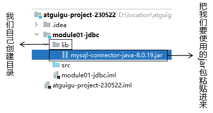

<br/>

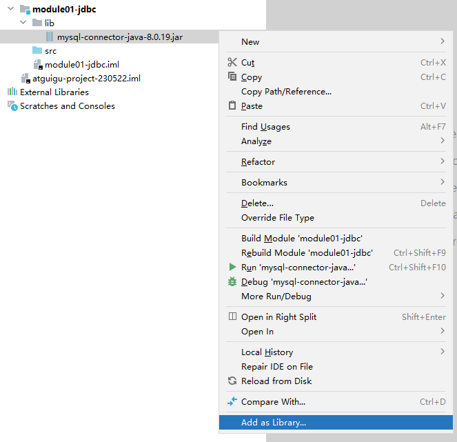

<br/>

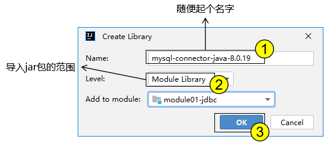

## 3、面向接口编程
- JDBC标准的具体体现就是一组接口。
- 各个数据库厂商提供的数据库驱动是这一组接口的具体实现。
- 只要接口不变，不管实现层怎么调整，上层代码都不需要改变。
- 让上层和下层代码得到了充分的解耦

<br/>

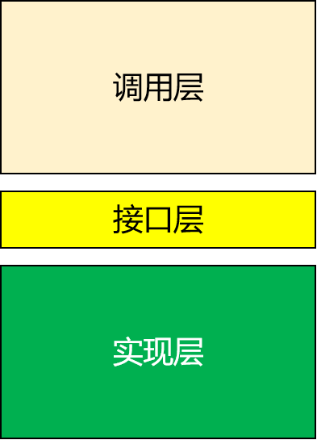

<br/>

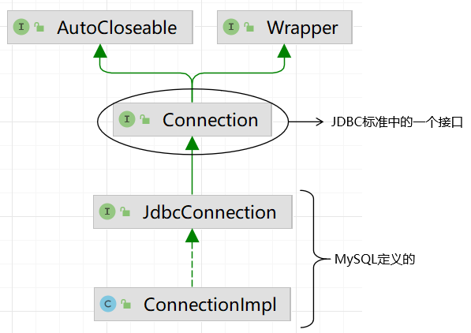

<br/>

# 二、JDBC 连接 MySQL
## 1、导入 jar 包

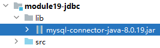

## 2、编写代码
```java
@Test  
public void test01Connection() throws ClassNotFoundException, SQLException {  
    // 1、加载 MySQL 驱动类：驱动类会在底层做一个操作，叫做『注册驱动』  
    // 反射机制加载全类名，底层会通过类加载器把 xxx.class 文件加载到内存  
    // 此时会执行类中的静态代码块  
    Class.forName("com.mysql.cj.jdbc.Driver");  
  
    // 2、准备连接数据库需要使用的详细参数  
    // [1]连接数据库时使用的 URL 地址  
    // 协议名称://MySQL数据库的 IP 地址:MySQL数据库的端口号  
    // MySQL8需要我们在这个连接地址后附带时区信息  
    // 如果没有附加时区信息，会抛出异常  
    // java.sql.SQLException: The server time zone value '�й���׼ʱ��' is unrecognized or represents more than one time zone. You must configure either the server or JDBC driver (via the 'serverTimezone' configuration property) to use a more specifc time zone value if you want to utilize time zone support.  
    String jdbcUrl = "jdbc:mysql://localhost:3306/db_hr?serverTimezone=Asia/Shanghai";  
  
    // [2]连接数据库时使用的用户名  
    String username = "root";  
  
    // [3]连接数据库时使用的密码  
    String userPwd = "atguigu";  
  
    // 3、通过驱动管理器类创建数据库连接  
    // java.sql.Connection 是 JDBC 标准中定义的一个接口  
    Connection connection = DriverManager.getConnection(jdbcUrl, username, userPwd);  
    System.out.println("connection = " + connection);  
  
    // 4、像使用 I/O 流一样，数据库连接对象用完也需要关闭  
    if (connection != null) {  
        connection.close();  
    }  
}
```

<br/>

如何理解注册驱动这个操作？<br/>

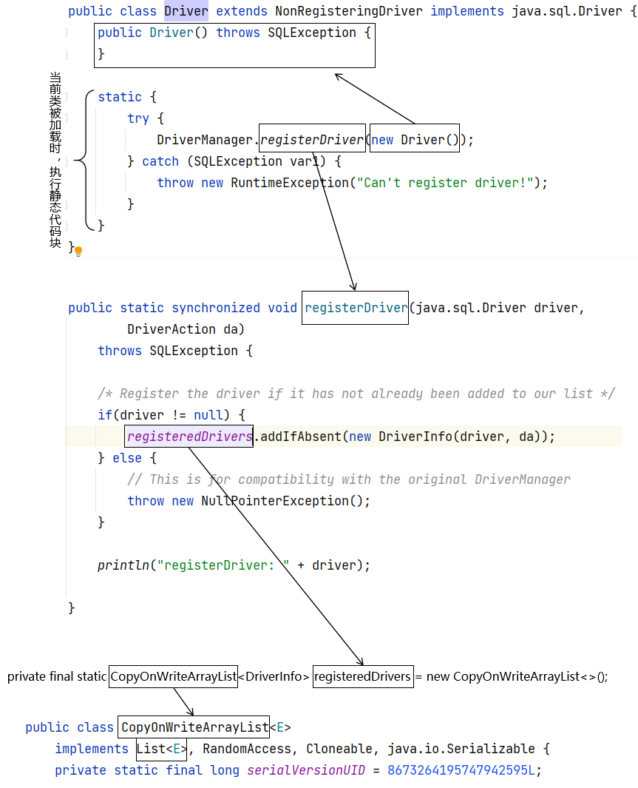


## 3、借助junit注解抽取代码
```java
// 把数据库连接对象声明为成员变量，这样各个方法都可以使用  
private Connection connection;  
  
// 在每一个 @Test 方法前执行  
@Before  
public void init() throws ClassNotFoundException, SQLException {  
    Class.forName("com.mysql.cj.jdbc.Driver");  
    String jdbcUrl = "jdbc:mysql://localhost:3306/db_hr?serverTimezone=Asia/Shanghai";  
    String username = "root";  
    String userPwd = "atguigu";  
    connection = DriverManager.getConnection(jdbcUrl, username, userPwd);  
}  
  
// 在每一个 @Test 方法后执行  
@After  
public void clear() throws SQLException {  
    if (connection != null) {  
        connection.close();  
    }  
}
```

# 三、具体操作
## 1、建库建表
```sql
create database db_hr;

use db_hr;

create table t_emp(
    emp_id int auto_increment primary key,
    emp_name char(100),
    emp_salary double(10, 3)
);

create table t_user(  
    user_id int primary key auto_increment,  
    user_name char(100),  
    user_pwd char(100)  
);
```

## 2、增删改
### ①API选择
- Statement：SQL语句的参数只能通过拼字符串的方式传入。
  - 编写代码非常繁琐、容易错
  - 有 SQL 注入的风险
- PreparedStatement：能够执行预编译 SQL 语句。SQL 语句的参数通过“?占位符”方式传入。
  - 防止 SQL 注入
  - 避免拼接 SQL 语句字符串出错

### ②测试：Statement
执行SQL语句：参数写死
```sql
@Test  
public void test02Insert() throws SQLException {  
    // 1、编写 SQL 语句  
    String sql = "insert into t_employee(emp_name, emp_salary, emp_gender) VALUES('jdbc name01', 1111, 'male')";  
  
    // 2、创建 Statement 对象  
    // java.sql.Statement 是 JDBC 标准中定义的一个接口  
    Statement statement = connection.createStatement();  
  
    // 3、调用 Statement 对象的方法执行 SQL 语句  
    // 返回值是受影响的行数  
    int effectedRows = statement.executeUpdate(sql);  
    System.out.println("effectedRows = " + effectedRows);  
}
```

执行SQL语句：
```java
@Test  
public void test02Statement() throws SQLException {  
  
    String empName = "tom";  
    Double empSalary = 25.37d;  
  
    // 1、编写 SQL 语句  
    String sql = "insert into t_emp(emp_name,emp_salary) values('"+empName+"','"+empSalary+"')";  
  
    // 2、创建 Statement 对象  
    Statement statement = connection.createStatement();  
  
    // 3、执行 SQL 语句  
    boolean executeResult = statement.execute(sql);  
    System.out.println("executeResult = " + executeResult);  
}
```

<br/>

SQL注入：
```sql
@Test  
public void test03SQLInjection() throws SQLException {  
    String userName = "harry";  
      
    // 刻意拼接 SQL 字符串，让 SQL 原本的查询条件失效  
    String userPassword = "' or '1'='1";  
    // "select user_id, user_name, user_pwd from t_user where user_name='harry' and user_pwd='' or '1'='1'"  
    String sql = "select user_id, user_name, user_pwd from t_user where user_name='"+userName+"' and user_pwd='"+userPassword+"'";  
      
    Statement statement = connection.createStatement();  
      
    statement.execute(sql);  
      
    ResultSet resultSet = statement.getResultSet();  
      
    boolean next = resultSet.next();  
    System.out.println(next?"登录成功":"登录失败");  
}
```

### ③测试：PreparedStatement
```java
@Test
public void test01OperationUpdate() throws SQLException {
    // update、delete、insert语句的Java代码都是下面套路：
    // 1、SQL 字符串
    String sql = "insert into t_emp(emp_name, emp_salary) values(?,?)";

    // 2、通过 Connection 对象获取 PreparedStatement 对象
    PreparedStatement preparedStatement = connection.prepareStatement(sql);

    // 3、准备 SQL 语句所需参数
    String empName = "tom";
    Double empSalary = 2255.33d;

    // 4、给 SQL 语句设置参数
    preparedStatement.setString(1, empName);
    preparedStatement.setDouble(2, empSalary);

    // 5、执行 SQL 语句
    int effectedRows = preparedStatement.executeUpdate();
    System.out.println("effectedRows = " + effectedRows);
}
```

<br/>

PreparedStatement不怕 SQL 注入：
```java
@Test  
public void test04SQLInjection() throws SQLException {  
    String userName = "harry";  
  
    // 即使刻意拼接，也会被视作一个整体字符串，无法实现 SQL 注入  
    String userPassword = "' or '1'='1";  
  
    String sql = "select user_id, user_name, user_pwd from t_user where user_name=? and user_pwd=?";  
  
    PreparedStatement preparedStatement = connection.prepareStatement(sql);  
    preparedStatement.setString(1, userName);  
    preparedStatement.setString(2, userPassword);  
  
    ResultSet resultSet = preparedStatement.executeQuery();  
  
    boolean next = resultSet.next();  
    System.out.println(next?"登录成功":"登录失败");  
  
}
```

## 3、查询

<br/>

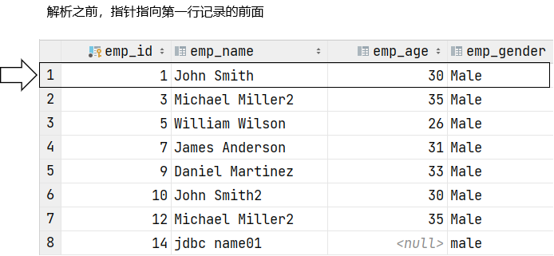

<br/>

- 每一次调用 next() 方法都会向下移动指针
- 指针指向的新的位置：
	- 有数据：next()方法返回true
	- 无数据：next()方法返回false

<br/>

```java
@Test
public void test02OperationQuery() throws SQLException {
    // 1、SQL 字符串
    String sql = "select emp_id, emp_name, emp_salary from t_emp where emp_id=?";

    // 2、准备 SQL 语句的参数
    Integer empId = 1;

    // 3、获取 PreparedStatement 对象
    PreparedStatement preparedStatement = connection.prepareStatement(sql);

    // 4、给 SQL 语句设置参数
    preparedStatement.setInt(1, empId);

    // 5、执行 SQL 语句
    ResultSet resultSet = preparedStatement.executeQuery();

    // 6、解析结果集
    // next()方法：移动指针，指向查询结果中的下一条记录。初始状态下，位于第一条记录前面。
    // 所以第一次调用 next() 方法就指向了第一条记录。
    // 如果指针移动后指向的位置存在查询结果记录，返回 true，否则返回 false
    while (resultSet.next()) {
        // getXxx("字段名") 返回当前记录中指定字段名的数据
        int empIdFromDB = resultSet.getInt("emp_id");
        String empName = resultSet.getString("emp_name");
        double empSalary = resultSet.getDouble("emp_salary");

        System.out.println("empIdFromDB = " + empIdFromDB);
        System.out.println("empName = " + empName);
        System.out.println("empSalary = " + empSalary);
    }
}
```

## 4、获取自增主键
### ①应用场景
在订单功能中，有两个表：
- t_order：订单表
  - order_id：本表的主键
- t_order_item：订单详情表
  - item_id：本表的主键
  - item_name：商品名称
  - item_price：商品价格
  - item_count：商品数量
  - order_id：指向当前详情所在订单的外键

<br/>

对t_order_item表执行insert操作：
```sql
# 保存订单详情时，必须指定它所在的订单的主键值
insert into t_order_item(..., order_id) values (...)
```

<br/>

所以必须能够获取到保存订单时数据库表自增的主键值。

### ②代码实现
```java
@Test
public void test03OperationAutoIncr() throws SQLException {
    // 1、SQL 字符串
    String sql = "insert into t_emp(emp_name, emp_salary) values(?,?)";

    // 2、通过 Connection 对象获取 PreparedStatement 对象
    // ※想要拿到自增主键需要在获取 PreparedStatement 对象时多指定一个参数
    // PreparedStatement.RETURN_GENERATED_KEYS 是 Statement 接口定义的一个常量
    PreparedStatement preparedStatement = connection.prepareStatement(sql, PreparedStatement.RETURN_GENERATED_KEYS);

    // 3、准备 SQL 语句所需参数
    String empName = "jerry";
    Double empSalary = 6699.33d;

    // 4、给 SQL 语句设置参数
    preparedStatement.setString(1, empName);
    preparedStatement.setDouble(2, empSalary);

    // 5、执行 SQL 语句
    int effectedRows = preparedStatement.executeUpdate();
    System.out.println("effectedRows = " + effectedRows);

    // 6、获取自增主键所在的结果集
    ResultSet generatedKeysResultSet = preparedStatement.getGeneratedKeys();

    // 7、解析结果集获取自增主键
    if (generatedKeysResultSet.next()) {
        // 从结果集中读取自增主键值（不能使用字段名称，只能使用索引）
        int empId = generatedKeysResultSet.getInt(1);
        System.out.println("自增主键值：empId = " + empId);
    }
}
```

## 5、批量增删改
### ①为什么需要批量操作
假设今天中午你想吃五个菜：
- 方式一：在美团外卖上每点一个菜单独下单，外卖小哥送五次。多费很多时间，多在路上。
- 方式二：在美团外卖五个菜下一个订单

所以我们JDBC和数据库交互也一样，如果一个功能需要执行很多条 SQL 语句，那么最好一次性发送给数据库，
而不是一条一条单独发送给数据库。

### ②实现代码
```java
@Test
public void test04OperationUseBatch() throws SQLException {
    // 1、使用 insert 操作举例
    String sql = "insert into t_emp(emp_name, emp_salary) values(?,?)";

    // 2、获取 PreparedStatement
    PreparedStatement preparedStatement = connection.prepareStatement(sql);

    // 3、设置参数并且执行
    long beginTime = System.currentTimeMillis();
    for (int i = 0; i < 10000; i++) {
        preparedStatement.setString(1, "name" + i);
        preparedStatement.setDouble(2, Math.random()*i*100);

        // 先不执行 SQL 语句，而是积攒到一起
        preparedStatement.addBatch();
    }

    // 4、全部收集完成后，一起执行
    // 再给连接数据库的 URL 地址后面附加一个参数：?rewriteBatchedStatements=true
    // 表示开启批量执行 SQL 语句功能，把多条 SQL 语句编译为一条执行
    preparedStatement.executeBatch();

    long endTime = System.currentTimeMillis();

    long usedTime = endTime - beginTime;
    // 11346ms（没有加rewriteBatchedStatements参数，和逐条执行效果一样）
    // 262ms（加rewriteBatchedStatements参数之后，体现出了批量操作的威力）
    // 11685ms（把insert语句中values改成value，也会导致批量操作失效）
    System.out.println("usedTime = " + usedTime + "ms");
}
```

## 6、保存二进制文件到BLOB [了解]
### ①BLOB概念
Binary Large Object，二进制的大对象。可以用来保存二进制的文件数据。<br/>
但是实际开发时，用户上传的文件都是保存到专门的文件服务器。<br/>

### ②代码实现
```java
@Test
public void test05OperationBLOB() throws FileNotFoundException, SQLException {
    // 1、SQL 语句
    String sql = "insert into t_emp(emp_name, emp_salary, emp_photo) values(?,?,?)";

    // 2、准备给 SQL 语句设置的参数
    String empName = "harry";
    Double empSalary = 8866.33d;

	// ※ 图片文件可以放在module根目录
    InputStream inputStream = new FileInputStream("mi.jpg");

    // 3、创建 PreparedStatement
    PreparedStatement preparedStatement = connection.prepareStatement(sql);

    // 4、设置参数
    preparedStatement.setString(1, empName);
    preparedStatement.setDouble(2, empSalary);
    preparedStatement.setObject(3, inputStream);

    // 5、执行 SQL 语句
    // 如果文件大小超过 BLOB 类型的容量，会抛异常：
    // com.mysql.cj.jdbc.exceptions.MysqlDataTruncation: Data truncation: Data too long for column 'emp_photo' at row 1
    int effectedRows = preparedStatement.executeUpdate();
    System.out.println("effectedRows = " + effectedRows);
}
```

<br/>

## 7、事务处理 [重要]
### ①概念
一个具体功能中包含多条 SQL 语句（增删改语句），这些 SQL 语句一个都不能少。<br/>
如果执行的时候，有任何一条 SQL 语句执行失败，那么所有 SQL 语句执行的效果都撤销。

### ②ACID属性
- A：原子性 一个具体功能中包含的多条 SQL 语句一个都不能少，缺任何一个都无法完成功能。
- C：一致性 SQL 语句执行之前数据是正确的，执行之后数据仍然是正确的。
  - 情况一：所有 SQL 语句执行成功，提交事务
  - 情况二：有任何一条 SQL 语句失败，回滚事务
- I：隔离性 事务在并发执行过程中，各个事务之间彼此独立
  - 并发问题：脏读、不可重复读、幻读
  - 隔离级别：读未提交、读已提交、可重复读、串行化
- D：持久性 事务一旦提交就不能再撤销了

### ③代码
```java
@Test
public void test06OperationTransaction() throws SQLException {

    // 0、准备两个更新操作的 SQL 语句
    String sql01 = "update t_emp set emp_name=?,emp_salary=? where emp_id=?";
    String sql02 = "update t_2emp set emp_name=?,emp_salary=? where emp_id=?";

    try {

        // 1、关闭事务的自动提交（也可以称之为：开启事务）
        // 之所以要这么做是因为：事务自动提交时每执行一条 SQL 语句就直接提交事务
        // 多条 SQL 语句就是多个事务，就无法纳入同一个事务统一管理了
        connection.setAutoCommit(false);

        // 2、获取 PreparedStatement
        PreparedStatement preparedStatement01 = connection.prepareStatement(sql01);
        PreparedStatement preparedStatement02 = connection.prepareStatement(sql02);

        // 3、给 SQL 语句设置参数
        preparedStatement01.setString(1, "**********");
        preparedStatement01.setDouble(2, 1000.00d);
        preparedStatement01.setInt(3, 1);

        preparedStatement02.setString(1, "---------");
        preparedStatement02.setDouble(2, 2000.00d);
        preparedStatement02.setInt(3, 2);

        // 5、执行 SQL 语句
        preparedStatement01.executeUpdate();
        preparedStatement02.executeUpdate();

        // 6、如果能够执行到这里：说明执行 SQL 语句成功，没有抛异常
        // 所以提交事务
        connection.commit();
    } catch (Exception exception) {
        // 7、打印异常信息
        String message = exception.getMessage();
        System.out.println("message = " + message);

        // 8、回滚事务
        connection.rollback();
    }
}
```

# 四、数据库连接池
## 1、需求背景
每一次建立数据库连接，创建 Connection 对象，都需要通过网络和数据库进行通信；数据库这边还需要检查用户名、密码是否正确，鉴定权限。

<br/>

所以建立数据库连接并不轻松，每一次连接数据库都需要付出一定的开销：
- CPU计算资源
- 网络传输时间开销

<br/>
另外，每一个 Connection 对象如果用完即弃，被抛弃的 Connection 对象就需要由垃圾回收（GC）机制回收。
- GC需要付出各种资源代价
- 下次用的时候又需要重新创建 Connection 对象

<br/>

如果每一次需要数据库连接都自己随便创建，那么很可能造成无节制的创建，进而造成内存空间不够（OOM内存溢出）。

<br/>

结论：创建、使用、释放数据库连接应该有一个总体的妥善的管理。
- 创建出来的Connection对象最好能够实现复用
- 限制最大数量，避免内存溢出

## 2、数据库连接池工作机制
### ①初始状态
- 数据库连接池对象创建时，会按照初始连接数创建数据库连接对象
- 没有和客户端建立连接的conn对象是空闲状态
- 和客户端建立连接的conn对象是繁忙（正在使用）状态

<br/>

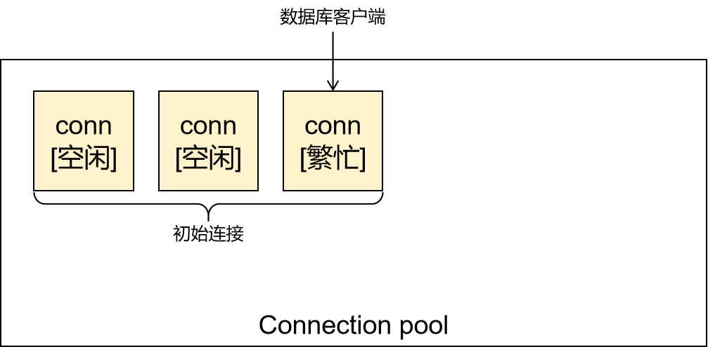

### ②最大连接数
- 数据库连接达到最大连接数就不会再创建新对象了
- 达到最大连接数之后，还需要连接的话就需要等待

<br/>

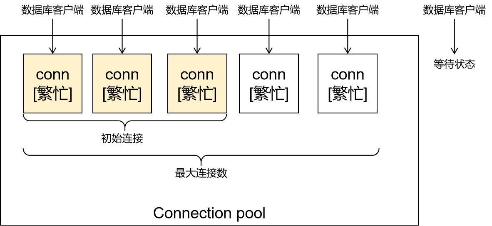

## 3、Druid连接池用法
### ①初步实现
数据库连接池也叫数据源，JDBC中数据源的顶级接口：javax.sql.DataSource。数据库连接池也有很多不同实现。
- C3P0
- DBCP
- Druid（阿里开发的，推荐使用）
- ……

使用步骤：
- 导入druid-1.0.9.jar
- 准备连接数据库的参数
- 把参数封装到Properties 对象中
- 调用工厂类的方法创建数据源
- 再从数据源中获取数据库连接

```java
@Test
public void test01GenerateDataSource() throws Exception {
    // 1、准备数据库连接池的相关参数
    String jdbcUrl = "jdbc:mysql://localhost:3306/db_hr?serverTimezone=Asia/Shanghai";
    String username = "root";
    String password = "atguigu";
    String initialSize = "3";
    String maxActive = "5";
    String maxWait = "2000";
    String driverClassName = "com.mysql.cj.jdbc.Driver";

    // 2、把上面参数封装到 Properties 对象中
    Properties properties = new Properties();
    properties.setProperty("url", jdbcUrl);
    properties.setProperty("username", username);
    properties.setProperty("password", password);
    properties.setProperty("initialSize", initialSize);
    properties.setProperty("maxActive", maxActive);
    properties.setProperty("maxWait", maxWait);
    properties.setProperty("driverClassName", driverClassName);

    // 3、根据 Properties 对象创建数据库连接池
    DataSource dataSource = DruidDataSourceFactory.createDataSource(properties);

    // 4、获取数据库连接
    // 在一个线程中按顺序执行，每一次循环用完连接、关闭之后才申请下一个
    for (int i = 0; i < 10; i++) {
        Connection connection = dataSource.getConnection();
        System.out.println("数据库连接建立 " + i);
        Thread.sleep(3000);
        // TimeUnit.SECONDS.sleep(3);
        connection.close();
    }

}
```

### ②把连接信息提取到文件
#### [1]创建配置文件
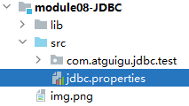

<br/>

```properties
url=jdbc:mysql://localhost:3306/db_hr?serverTimezone=Asia/Shanghai
username=root
password=atguigu
initialSize=3
maxActive=5
maxWait=2000
driverClassName=com.mysql.cj.jdbc.Driver
```

#### [2]Java代码
```java
@Test
public void test02DataSource() throws Exception {
    // 1、创建 Properties 对象
    Properties properties = new Properties();

    // 2、从类路径下加载配置文件的输入流
    InputStream inputStream = DataSourceTest.class.getClassLoader().getResourceAsStream("jdbc.properties");

    // 3、让 Properties 对象通过输入加载配置信息
    properties.load(inputStream);

    // 4、创建数据源
    DataSource dataSource = DruidDataSourceFactory.createDataSource(properties);
    Connection connection = dataSource.getConnection();
    System.out.println("connection = " + connection);
}
```

#### [3]意义
- Java代码和配置信息解耦
- 配置信息如果有修改，不会导致 Java 代码重新编译、项目重新部署
- 可以准备多套配置文件分别对应不同服务器环境
  - 开发环境：团队内的服务器，部署开发过程中尚不稳定的版本，方便模块之间互相调用
  - 测试环境：给测试工程师使用的环境
  - 生产环境：项目正式上线之后，最终用户实际使用的环境

## 4、JDBC管理数据库连接的工具类

```java
/**
 * 当前类的作用：初始化数据源，提供数据库连接的获取和释放
 */
public class JDBCUtil {

    private static DataSource dataSource;

    static {
        // 1、创建 Properties 对象
        Properties properties = new Properties();
        try {
            // 2、加载外部配置信息
            properties.load(JDBCUtil.class.getClassLoader().getResourceAsStream("jdbc.properties"));

            // 3、创建数据源对象
            dataSource = DruidDataSourceFactory.createDataSource(properties);

        } catch (IOException e) {
            throw new RuntimeException(e);
        } catch (Exception e) {
            throw new RuntimeException(e);
        }
    }

    /**
     * 获取数据库连接的工具方法
     * @return
     */
    public static Connection getConnection() {
        try {
            return dataSource.getConnection();
        } catch (SQLException e) {
            throw new RuntimeException(e);
        }
    }

    /**
     * 释放数据库连接的工具方法
     * @param connection
     */
    public static void releaseConnection(Connection connection) {
        try {
            if (connection != null) {
                connection.close();
            }
        } catch (SQLException e) {
            throw new RuntimeException(e);
        }
    }

}
```

<br/>

# 五、DAO
## 1、三层架构结构梳理


## 2、DAO接口和实现类
### ①EmployeeDao接口
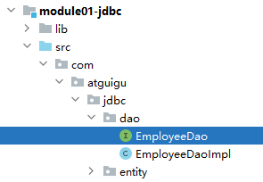

<br/>

```java
public interface EmployeeDao {
}
```

### ②EmployeeDaoImpl实现类
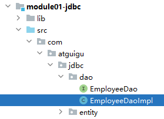

<br/>

```java
public class EmployeeDaoImpl extends BaseDao implements EmployeeDao{
}
```

### ③BaseDao
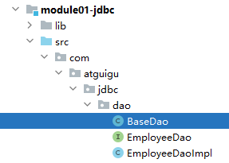

<br/>

```java
public class BaseDao<T> {
}
```

## 3、BaseDao手动实现
### ①通用增删改方法
```java
/**
 * 通用增删改方法
 * @param sql 执行增删改操作的 SQL 语句
 * @param params 以可变参数形式传入的 SQL 语句的参数
 * @return 执行 SQL 语句之后，受影响的行数
 */
public int commonUpdate(String sql, Object ... params) {

    // 1、声明变量
    Connection connection = JDBCUtils.getConnection();
    PreparedStatement preparedStatement = null;

    try {
        // 2、创建 PreparedStatement 对象
        preparedStatement = connection.prepareStatement(sql);

        // 3、遍历可变参数数组，给 SQL 设置参数
        for (int i = 0; params != null && i < params.length; i++) {
            // 4、从数组中取出具体参数值
            Object param = params[i];

            // 5、设置参数，参数索引从 1 开始，所以是 i + 1
            preparedStatement.setObject(i + 1, param);
        }

        // 6、执行 SQL 语句
        return preparedStatement.executeUpdate();

    } catch (SQLException e) {

        // ※把编译时异常转换为运行时异常继续抛出，这么做是为了避免掩盖问题
        throw new RuntimeException(e);
    } finally {

        // 7、释放资源
        if (preparedStatement != null) {
            try {
                preparedStatement.close();
            } catch (SQLException e) {
                throw new RuntimeException(e);
            }
        }

        JDBCUtils.releaseConnection(connection);

    }
}
```

### ②通用查询方法：返回 List
```java
/**
 * 查询数据库表，每一条记录封装一个实体类对象，多条记录组成 List 集合
 * @param sql
 * @param clazz 当前要查询的实体类对象的 Class 对象
 * @param params
 * @return 查询结果组成的 List 集合
 */
public List<T> getBeanList(String sql, Class<T> clazz, Object ... params) {

    // 1、声明变量
    Connection connection = JDBCUtils.getConnection();
    PreparedStatement preparedStatement = null;
    ResultSet resultSet = null;

    try {
        // 2、创建 PreparedStatement 对象
        preparedStatement = connection.prepareStatement(sql);

        // 3、给 SQL 语句设置参数
        for (int i = 0; params != null && i < params.length; i++) {
            // 4、从数组中取出具体参数值
            Object param = params[i];

            // 5、设置参数，参数索引从 1 开始，所以是 i + 1
            preparedStatement.setObject(i + 1, param);
        }

        // 6、执行 SQL 语句
        resultSet = preparedStatement.executeQuery();

        // 7、创建集合对象，用来存放每一个从结果集中解析得到的 Java 实体类对象
        List<T> list = new ArrayList<>();

        // 8、解析结果集
        while (resultSet.next()) {

            // 9、创建当前指针指向记录对应的 Java 实体类对象
            T instance = clazz.newInstance();

            // ※提出问题：作为通用的查询，此时无法确定字段名称、数量……
            // ※解决问题的前提：Java 实体类的属性和数据库表字段一一对应
            // ※API 层面的支持：Java 反射技术
            // ※API 层面的支持：ResultSetMetaData 结果集元数据
            // 10、获取结果集元数据对象
            ResultSetMetaData resultSetMetaData = resultSet.getMetaData();

            // 11、通过结果集元数据对象获取结果集中字段的数量
            int columnCount = resultSetMetaData.getColumnCount();

            // 12、遍历当前行指针指向的记录
            for (int i = 1; i <= columnCount; i++) {
                // 13、根据循环变量从当前行获取对应单元格的值
                Object value = resultSet.getObject(i);

                // 14、通过反射的方式把 value 存入实体类对象的对应的属性中
                // 假设 value 是 emp_name 字段的值
                // 那么它对应的 Java 实体类对象的属性 empName
                // ※这里我们可以要求 SQL 语句给每一个字段都设置别名，
                // 别名需要正好就是 Java 实体类对象的属性名
                // [1]从结果集元数据中读取当前索引（i）对应的列的别名
                String columnLabel = resultSetMetaData.getColumnLabel(i);

                // [2]以 columnLabel 作为属性名获取 Java 实体类对应的 Field 对象
                Field field = clazz.getDeclaredField(columnLabel);

                // [3]突破 Field 对象的访问限制
                field.setAccessible(true);

                // [4]调用 Field 对象的 set() 方法设置属性值
                field.set(instance, value);
            }

            // 15、把已经填充好的 Java 实体类对象存入 List<T> 集合
            list.add(instance);
        }

        // 16、把填充好的 List<T> 集合作为返回值返回
        return list;

    } catch (Exception e) {
        throw new RuntimeException(e);
    } finally {

        if (resultSet != null) {
            try {
                resultSet.close();
            } catch (SQLException e) {
                throw new RuntimeException(e);
            }
        }

        if (preparedStatement != null) {
            try {
                preparedStatement.close();
            } catch (SQLException e) {
                throw new RuntimeException(e);
            }
        }

        JDBCUtils.releaseConnection(connection);

    }
}
```

### ③通用查询方法：返回单个对象
```java
/**
 * 查询单个实体类对象
 * @param sql
 * @param clazz 当前要查询的实体类对象的 Class 对象
 * @param params
 * @return 单个实体类对象
 */
public T getSingleBean(String sql, Class<T> clazz, Object ... params) {

    // 1、调用查询集合的方法先根据 SQL 语句查询 List 集合
    List<T> beanList = getBeanList(sql, clazz, params);

    // 2、对 beanList 进行判空操作
    if (beanList == null || beanList.size() == 0) {
        return null;
    }

    // 3、检查 beanList 长度是否大于 1
    if (beanList.size() > 1) {
        throw new RuntimeException("too many results!");
    }

    // 4、取出集合中唯一的元素返回
    return beanList.get(0);
}
```

### ④通用批量增删改方法
```sql
/**
 * 通用批量增删改方法
 * @param sql
 * @param paramArrays 二维数组
 *        二维数组中的每一个数组对应 SQL 语句执行一次
 *        insert into t_employee(emp_name, emp_age, emp_salary) values(?,?,?); ["name01", 21, 1000]
 *        insert into t_employee(emp_name, emp_age, emp_salary) values(?,?,?); ["name02", 22, 2000]
 *        insert into t_employee(emp_name, emp_age, emp_salary) values(?,?,?); ["name03", 23, 3000]
 */
public void batchUpdate(String sql, Object[][] paramArrays) {
    // 1、声明变量
    Connection connection = JDBCUtils.getConnection();
    PreparedStatement preparedStatement = null;

    try {
        // 2、创建 PreparedStatement 对象
        preparedStatement = connection.prepareStatement(sql);

        // 3、遍历二维数组
        for (int i = 0; paramArrays != null && i < paramArrays.length; i++) {
            Object[] paramArray = paramArrays[i];

            // 4、遍历可变参数数组，给 SQL 设置参数
            for (int j = 0; paramArray != null && j < paramArray.length; j++) {
                Object param = paramArray[j];

                preparedStatement.setObject(j + 1, param);
            }

            // 5、把上面设置的参数执行一次积攒
            preparedStatement.addBatch();
        }

        // 6、执行 SQL 语句
        preparedStatement.executeBatch();

    } catch (SQLException e) {

        // ※把编译时异常转换为运行时异常继续抛出，这么做是为了避免掩盖问题
        throw new RuntimeException(e);
    } finally {

        // 7、释放资源
        if (preparedStatement != null) {
            try {
                preparedStatement.close();
            } catch (SQLException e) {
                throw new RuntimeException(e);
            }
        }

        JDBCUtils.releaseConnection(connection);

    }
}
```

## 4、BaseDao借助DBUtils实现
### ①DBUtils简介
DBUtils是Apache软件基金会组织维护的一款JDBC工具集，可以帮助我们极大的简化JDBC代码。

<br/>


<br/>

### ②导入jar包
commons-dbutils-1.7.jar

<br/>

### ③重构BaseDao
```java
public class BaseDaoDBUtilImpl<T> implements BaseDao<T> {

    private QueryRunner queryRunner = new QueryRunner();

    @Override
    public int update(String sql, Object... params) {

        try {
            // 1、获取数据库连接
            Connection connection = JDBCUtils.getConnection();

            // 2、调用 QueryRunner 的方法执行更新操作
            return queryRunner.update(connection, sql, params);
        } catch (SQLException e) {
            throw new RuntimeException(e);
        }
    }

    @Override
    public List<T> selectByCondition(String sql, Class<T> clazz, Object... param) {

        try {
            // 1、获取数据库连接
            Connection connection = JDBCUtils.getConnection();

            // 2、调用 QueryRunner 的方法执行查询操作
            return queryRunner.query(connection, sql, new BeanListHandler<>(clazz), param);
        } catch (SQLException e) {
            throw new RuntimeException(e);
        }
    }

    @Override
    public T selectSingleEntity(String sql, Class<T> clazz, Object... param) {

        try {
            // 1、获取数据库连接
            Connection connection = JDBCUtils.getConnection();

            // 2、调用 QueryRunner 的方法执行查询操作
            return queryRunner.query(connection, sql, new BeanHandler<>(clazz), param);
        } catch (SQLException e) {
            throw new RuntimeException(e);
        }
    }
}
```

<br/>

## 5、小结
搭建持久化层开发环境操作步骤：
- 导入jar包
  - commons-dbutils-1.4.jar
  - druid-1.0.9.jar
  - mysql-connector-java-8.0.19.jar
- 创建jdbc.properties属性文件
- 加入JDBCUtils
- 加入BaseDao（DBUtils实现的）