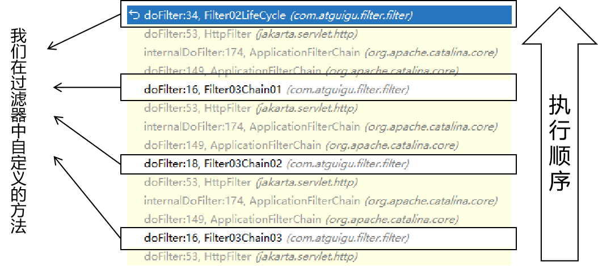

# 今天目标
- Filter
	- Filter生命周期
	- Filter链
	- Filter匹配规则（了解）
	- 注解方式配置Filter（了解）
- Listener
	- 概念
	- HelloWorld
	- 其它监听器类型（了解）
- JavaScript基本语法复习
- 前端工程化：ES6语法规则
	- 简介
	- 变量
	- 模板字符串
	- 解构表达式
	- 箭头函数
	- 对象相关的新关键字
	- 对象拷贝

# 一、过滤器
## 1、提出问题


<br/>

## 2、三要素
### ①拦截
作为过滤器这样的组件，首先需要能够把请求拦截住，然后才能做后续的相关操作。

<br/>

### ②过滤
通常是基于业务功能的需要，在拦截到请求之后编写特定的代码，对请求进行相关的处理或检查。<br/>

最典型的就是登录检查：检查当前请求是否已经登录。

<br/>

### ③放行
如果当前请求满足过滤条件，那么就应该放行：让请求继续去找它原本要访问的资源。

<br/>

## 3、HelloWorld
### ①创建Filter类
要求实现接口：jakarta.servlet.Filter。更简洁的做法是继承jakarta.servlet.http.HttpFilter类。

<br/>

```java
/**  
 * 假设请求中携带一个特定的请求参数表示用户已经登录，可以访问私密资源。  
 * 特定请求参数名称：message，特定的值：monster  
 */public class Filter01HelloWorld extends HttpFilter {  
  
    @Override  
    public void doFilter(HttpServletRequest request, HttpServletResponse response, FilterChain chain) throws ServletException, IOException {  
  
        // 1、获取请求参数  
        String message = request.getParameter("message");  
  
        // 2、检查请求参数是否满足预设的要求  
        if ("monster".equals(message)) {  
            // 3、满足条件的请求放行  
            chain.doFilter(request, response);  
        } else {  
            // 4、不满足预设条件就把请求转发到拒绝页面  
            request.getRequestDispatcher("/WEB-INF/pages/forbidden.html").forward(request, response);  
        }  
  
    }  
}
```

### ②注册
```xml
<!-- 注册 Filter --><filter>  
    <!-- Filter 友好名称 -->  
    <filter-name>Filter01HelloWorld</filter-name>  
  
    <!-- Filter 全类名 -->  
    <filter-class>com.atguigu.filter.filter.Filter01HelloWorld</filter-class>  
</filter>  
<filter-mapping>  
    <!-- 引用 Filter 友好名称 -->  
    <filter-name>Filter01HelloWorld</filter-name>  
  
    <!-- 当前 Filter 要拦截的请求的 URL 地址的匹配模式 -->  
    <url-pattern>/private/*</url-pattern>  
</filter-mapping>
```

<br/>

## 4、Filter生命周期
| |Servlet生命周期|Filter生命周期|
|---|---|---|
|创建对象|第一次接收到请求创建对象<br/>通过反射调用无参构造器<br/>执行一次|Web应用启动时创建对象<br/>通过反射调用无参构造器<br/>执行一次|
|初始化|创建对象之后立即执行<br/>init()方法<br/>执行一次|创建对象之后立即执行<br/>init()方法<br/>执行一次|
|干活|每一次接收到请求，处理请求<br/>service()方法<br/>可能多次|每一次接收到请求，过滤请求<br/>doFilter()方法|
|销毁|Web应用卸载时执行<br/>destroy()方法<br/>执行一次|Web应用卸载时执行<br/>destroy()方法<br/>执行一次|

<br/>

```java
package com.atguigu.filter.filter;  
  
import jakarta.servlet.FilterChain;  
import jakarta.servlet.ServletException;  
import jakarta.servlet.http.HttpFilter;  
import jakarta.servlet.http.HttpServletRequest;  
import jakarta.servlet.http.HttpServletResponse;  
  
import java.io.IOException;  
  
public class Filter02LifeCycle extends HttpFilter {  
  
    // 生命周期相关：无参构造器  
    public Filter02LifeCycle() {  
        System.out.println("Filter02LifeCycle 执行了无参构造器！创建了对象！");  
    }  
  
    // 生命周期相关：初始化操作  
    @Override  
    public void init() throws ServletException {  
        System.out.println("Filter02LifeCycle 执行了init()方法，初始化完成！");  
    }  
  
    // 生命周期相关：清理或销毁操作  
    @Override  
    public void destroy() {  
        System.out.println("Filter02LifeCycle 执行了destroy()方法！");  
    }  
  
    // 生命周期相关：过滤请求操作  
    @Override  
    protected void doFilter(HttpServletRequest request, HttpServletResponse response, FilterChain chain) throws IOException, ServletException {  
        System.out.println("Filter02LifeCycle 执行了doFilter()方法！");  
        chain.doFilter(request, response);  
    }  
}
```

<br/>

```xml
<filter>  
    <filter-name>Filter02LifeCycle</filter-name>  
    <filter-class>com.atguigu.filter.filter.Filter02LifeCycle</filter-class>  
</filter>  
<filter-mapping>  
    <filter-name>Filter02LifeCycle</filter-name>  
    <!-- 拦截当前 Web 应用下的所有资源 -->  
    <url-pattern>/*</url-pattern>  
</filter-mapping>
```

## 5、Filter链
### ①Filter链的形成
当多个Filter拦截同一个资源，那么访问这个资源的请求就需要逐个经过各个Filter。<br/>


<br/>

### ②Filter链的执行
- 每个Filter都放行，请求才能到达原本要访问的目标资源
- 有任何一个Filter没有放行，那么后面的Filter和目标资源就都不会被执行
- Filter如果没有放行，那么需要给出响应。例如：转发、重定向等方式。
- Filter如果没有放行，也没有给出响应，那么浏览器窗口就是一片空白。

<br/>

### ③Filter链执行的顺序
参考web.xml中filter-mapping的顺序：
- filter-mapping靠前的：Filter执行时在外层（先执行：先开始，后结束）
- filter-mapping靠后的：Filter执行时在内层（后执行：后开始，先结束）

<br/>

本质上来说，同一个Filter链中的各个方法都是在同一个线程里依次调用的方法：

<br/>



<br/>

### ④引申
- 方法栈：同一个线程内，先调用的方法后结束；后调用的方法先结束
- 同一个线程内，所有操作本质上都是按顺序执行的。前面操作没有执行完，后面操作就需要等待（操作之间需要彼此等待：同步）。
- 在不同线程（或进程）内，各个操作都不需要等待其它线程中操作的执行（操作之间不需要彼此等待：异步）。

<br/>

## 6、Filter匹配规则（了解）
- 模糊匹配（现在使用和建议使用的）
- 精确匹配（从程序结构角度来说，更适合在Servlet中来做）
- 扩展名匹配（偶尔使用）
- servlet-name匹配

## 7、基于注解配置Filter（了解）
```java
package com.atguigu.filter.filter;  
  
import jakarta.servlet.FilterChain;  
import jakarta.servlet.ServletException;  
import jakarta.servlet.annotation.WebFilter;  
import jakarta.servlet.http.HttpFilter;  
import jakarta.servlet.http.HttpServletRequest;  
import jakarta.servlet.http.HttpServletResponse;  
  
import java.io.IOException;  
  
// 注解替代 web.xml 中的配置  
@WebFilter(filterName = "Filter07Annotation", value = "/annotation/*")  
public class Filter07Annotation extends HttpFilter {  
  
    @Override  
    protected void doFilter(HttpServletRequest request, HttpServletResponse response, FilterChain chain) throws IOException, ServletException {  
        System.out.println("Filter07Annotation执行了！");  
        chain.doFilter(request, response);  
    }  
}
```

# 二、监听器
## 1、观察者模式
- 观察者：监控『被观察者』的行为，一旦发现『被观察者』触发了事件，就会调用事先准备好的方法执行操作。
- 被观察者：『被观察者』一旦触发了被监控的事件，就会被『观察者』发现。

<br/>


<br/>

监听器就是在我们后端程序中监听特定的事件，一旦被监听的事件触发，就会执行事先准备好的程序。

<br/>

## 2、HelloWorld
### ①目标
监听ServletContext对象的生命周期：
- 在ServletContext对象初始化时触发事件
- 在ServletContext对象销毁前触发事件

<br/>

### ②Java代码
```java
package com.atguigu.listener;  
  
import jakarta.servlet.ServletContext;  
import jakarta.servlet.ServletContextEvent;  
import jakarta.servlet.ServletContextListener;  
  
public class MyServletContextListener implements ServletContextListener {  
  
    public MyServletContextListener() {  
        System.out.println("MyServletContextListener创建对象。");  
    }  
  
    @Override  
    public void contextInitialized(  
            // 事件对象：代表当前触发的事件：ServletContext 对象完成初始化（或 Web 应用启动）  
            ServletContextEvent sce) {  
        ServletContext servletContext = sce.getServletContext();  
        System.out.println("servletContext = " + servletContext + " contextInitialized()");  
        servletContext.setAttribute("appAttrName", "appAttrValueInit");  
    }  
  
    @Override  
    public void contextDestroyed(  
            // 事件对象：代表当前触发的事件：ServletContext 对象即将要释放（或 Web 应用停止）  
            ServletContextEvent sce) {  
        ServletContext servletContext = sce.getServletContext();  
        System.out.println("servletContext = " + servletContext + " contextDestroyed()");  
    }  
}
```

<br/>

### ③web.xml配置
```xml
<listener>  
    <!-- 指定全类名即可 -->  
    <listener-class>com.atguigu.listener.MyServletContextListener</listener-class>  
</listener>
```

# 三、ES6新语法
## 1、变量
- 记住：在ES6新语法中，使用let声明变量更好！

<br/>

```javascript
// 1、使用 let 关键字声明变量

let a = 10;

console.log("a=" + a);

  

// 2、使用 let 比 var 更严谨

console.log(b);

var b = 5;

  

// 使用 let 声明的变量，作用域就是从声明的地方开始

// 如果在声明前使用，会报错：Uncaught ReferenceError: Cannot access 'c' before initialization

// console.log(c);

// let c = 10;

  

// let 不能重复声明变量

var m = 10;

console.log(m);

  

var m = 10;

console.log(m);

  

let n = 100;

console.log(n);

  

// Uncaught SyntaxError: Identifier 'n' has already been declared

// let n = 100;

// console.log(n);

  

// let 变量只能在花括号内部访问

if (true) {

    var x = 88;

}

console.log(x);

  

if (true) {

    let y = 99;

}

// console.log(y);

  

// let 声明的全局变量，不会作为 window 的属性

var atguigu = "is very good";

console.log(window.atguigu);

  

let good = "good is very good";

console.log(window.good);
```

## 2、常量
```javascript
// 使用 const 声明常量

const PI = 3.1415926;

console.log(PI);

// PI = 5;

  

const arr = [5, 13, 27];

arr.push(188);
```

## 3、模板字符串
```javascript
// 1、多行普通字符串

let ulStr =

'<ul>'+

'<li>JAVA</li>'+

'<li>html</li>'+

'<li>VUE</li>'+

'</ul>';

console.log(ulStr);

  

// 2、多行模板字符串

let ulStr2 = `

    <ul>

        <li>JAVA</li>

        <li>html</li>

        <li>VUE</li>

    </ul>`;

console.log(ulStr2);

  

// 3、普通字符串拼接

let name ='张小明';

let infoStr =name+'被评为本年级优秀学员';

console.log(infoStr);

  

// 4、模板字符串拼接

let infoStr2 =`${name}被评为本年级优秀学员`;

console.log(infoStr2)
```

## 4、解构表达式
```javascript
// 1、使用数组形式的解构表达式

let [a1, b1, c1] = ["w", "e", "t"];

console.log(a1);

console.log(b1);

console.log(c1);

  

// 2、在解构表达式中指定默认值

let [a2, b2, c2, d2 = "u"] = ["w", "e", "t"];

console.log(a2);

console.log(b2);

console.log(c2);

console.log(d2);

  

// 3、使用对象中的属性给解构表达式中同名的变量赋值

let {stuName, stuAge} = {stuName: "tom", stuAge: 528};

console.log(stuName);

console.log(stuAge);

  

let {soldierName:soldierNameNew, soldierAge:soldierAgeNew} = {soldierName:"jerry", soldierAge:324};

console.log(soldierNameNew);

console.log(soldierAgeNew);

  

// 4、使用解构表达式声明函数的形参

function sum([x, y]) {

    console.log(arguments);

    return x+y;

}

  

// 使用数组作为调用函数的实参

var sumResult = sum([100, 50]);

console.log(sumResult);
```

## 5、箭头函数
```javascript
// 1、传统方式声明函数

let fun01 = function(){};

  

// 2、箭头函数方式声明函数

let fun02 = ()=>{

    console.log("初步编写箭头函数。");

};

fun02();

  

// 3、箭头函数中只有一行代码可以省略大括号

let fun03 = ()=>console.log("编写箭头函数。省略大括号");

fun03();

  

// 4、只有一个参数时可以省略小括号

let fun04 = p=>console.log("编写箭头函数。只有一个参数时可以省略小括号 p=" + p);

fun04(5);

  

// 5、箭头函数中只有一行代码可以省略大括号和return

let fun05 = p=>p+100;

let fun05Result = fun05(80);

console.log("箭头函数中只有一行代码可以省略大括号和return fun05Result = " + fun05Result);
```

# 四、总结
- 理论
	- 理解并且能够表达Filter生命周期各个环节
		- 什么时候执行
		- 调用哪个方法
		- 执行几次
	- 理解Filter链的工作机制
	- 能够正确表述Filter链执行顺序是以什么为依据的
	- 理解Listener在Web应用中起的作用
	- 前端：理解JavaScript函数中this的指向（单击响应函数中的this和回调函数中this指向的对象不同）
- 操作
	- 测试Filter生命周期
	- 测试Filter链
	- 测试Listener的HelloWorld
	- 前端：使用let声明变量
	- 前端：使用const声明常量
	- 前端：使用模板字符串
	- 前端：声明箭头函数，测试各种不同简化写法