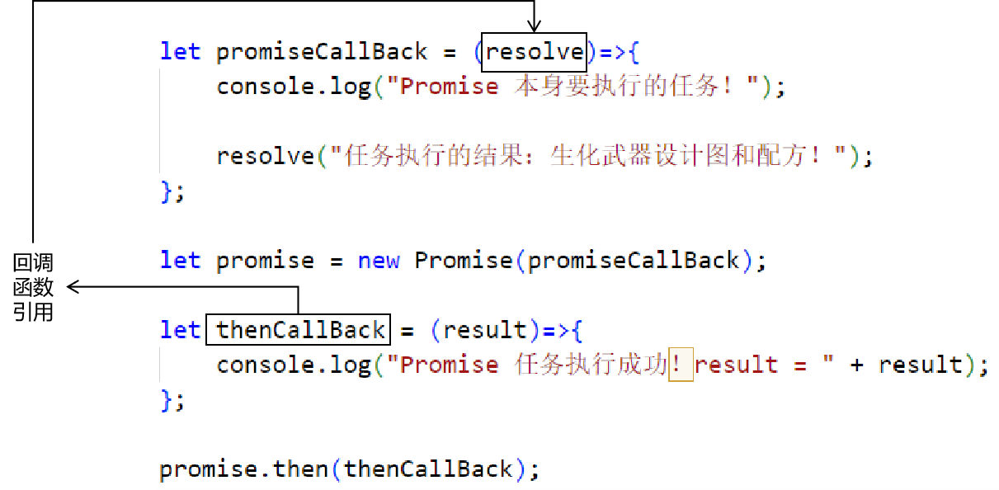

# 今天目标
- ES6新语法：
	- 箭头函数：
		- rest参数
		- spread参数
	- 创建类：
		- class关键词
		- constructor关键词
		- get关键词
		- set关键词
		- 声明私有属性
	- 多线程操作：使用Promise
		- 使用Promise执行异步操作
		- Promise异步操作成功之后怎么办？
		- Promise异步操作失败之后怎么办？
		- Promise对象的三个状态
		- 如何解决回调地狱问题？
	- 模块化开发：代码的暴露和导入
		- 分别导出
		- 统一导出
		- 默认导出
- 前端工程化环境搭建：
	- Node.js
	- Vite
- Vue3初步使用

# 一、箭头函数
## 1、箭头函数和this的回顾
```html
<body>

  

    <button id="btn01">点我你会发财！</button>

    <button id="btn02">点我你会幸福！</button>

    <button id="btn03">点我你会优雅！</button>

</body>

<script>

    // 1、声明一个函数

    function showInfo() {

        console.log(this.info);

    }

  

    // 2、创建两个对象

    let obj01 = {

        info:"i am obj01",

        _showInfo: showInfo

    };

    let obj02 = {

        info:"i am obj02",

        _showInfo: showInfo

    };

  

    // 3、分别通过两个不同的对象调用showInfo()

    obj01._showInfo();

    obj02._showInfo();

  

    console.log("==================================");

  

    // 4、探索回调函数中的this

    // [1]setTimeout()函数中的this

    // setTimeout(回调函数,以毫秒为单位的延迟时间)函数可以在指定的延迟时间之后执行回调函数

    setTimeout(function(){

        // 代表浏览器窗口的 window 对象

        console.log(this);

    }, 3000);

  

    // [2]单击响应函数中的this

    document.getElementById("btn01").onclick = function(){

        // 代表按钮标签的那个DOM元素对象

        console.log(this);

    };

  

    // [3]在单击响应函数中使用setTimeout()函数

    document.getElementById("btn02").onclick = function(){

        // 代表按钮标签的那个DOM元素对象

        console.log(this);

  

        setTimeout(function(){

            // 代表浏览器窗口的 window 对象

            // ※此时在延迟调用的这个回调函数中，如果需要使用按钮元素对象，就不能使用this来引用

            // 内外两层回调函数中this不同，会给我们开发带来很大的不便

            console.log(this);

        }, 2000);

    };

  

    // [4]使用箭头函数解决内外this不同导致使用不便的问题

    document.getElementById("btn03").onclick = function(){

        console.log(this);

        setTimeout(() => {

            // 使用箭头函数之后，内层回调函数就可以通过this引用到外层回调的this

            console.log(this);

            console.log("延迟调用：" + this.innerText);

        }, 2000);

    }

  
  

</script>
```

<br/>

## 2、rest参数
### ①普通函数使用arguments即可实现可变参数效果
```javascript
// 有了函数中可以直接使用的 arguments 其实不需要设计可变参数

function sum() {

    for(let i = 0; i < arguments.length; i++) {

        console.log(arguments[i]);

    }

}

  

sum(1);

sum(1, 2);

sum(1, 2, 3);
```

<br/>

### ②箭头函数中无法使用arguments
```javascript
// 但是箭头函数中无法使用 arguments

// let funSum = ()=>{

//     for(let i = 0; i < arguments.length; i++) {

//         console.log(arguments[i]);

//     }

// };

// funSum(1);

// funSum(1,2);

// funSum(1,2,3);
```

<br/>

### ③箭头函数使用rest参数实现可变参数效果
```javascript
// 箭头函数中想要实现可变参数的效果，需要使用rest参数

let funSum = (...numbers)=>{

    let count = 0;

    for(let i=0; i<numbers.length; i++) {

        let number = numbers[i];

        count += number;

    }

    console.log(count);

};

funSum(1, 2, 3);

funSum(1, 2, 3, 4);

  

// rest参数只能写在整个参数列表最后

// let funShowMsg = (info, ...args, param)=>{};

  

// rest参数不能写多个

// let funShowMsg = (...args, ...param)=>{};
```

<br/>

## 3、spread参数
### ①基本用法
```javascript
// 1、声明一个数组

let happyThings = ["eat", "drink", "watchTV", "sleep"];

  

// 2、使用spread参数的形式把数组作为实参传给函数

function showHappyThings(thing01, thing02, thing03, thing04) {

    console.log(thing01, thing02, thing03, thing04, Math.random());

}

  

showHappyThings(happyThings[0], happyThings[1], happyThings[2], happyThings[3]);

  

// 3、通过spread参数形式把数组拆开，依次传入函数的各个参数位置

showHappyThings(...happyThings);

  

// 4、此时如果使用解构表达式，会因为函数声明方式不匹配，参数只传给了第一个参数

showHappyThings(["a", "b", "c", "d"]);
```

<br/>

### ②其它用法
```javascript
// 5、给数组下标位置赋值

let someThingArr = ["walk", ...happyThings, ...happyThings];

  

console.log(someThingArr);

  

// 错误写法

// someThingArr[2] = ...happyThings;

  

// 6、给对象属性赋值

let p1={name:"张三"}

let p2={age:10}

let p3={gender:"boy"}

let person ={...p1,...p2,...p3}

console.log(person);
```

<br/>

# 二、创建类
```javascript
// 1、使用class关键字声明一个类

class Person {

    // 2、声明一个私有属性

    #personId = 5;

  

    personName;

    personAge;

  

    // 3、在类内部声明函数读取私有属性

    showPersonId() {

        console.log(this.#personId);

    }

  

    // 5、为私有属性提供 GET 方法

    get _personId() {

        console.log("GET 方法被调用");

        return this.#personId;

    }

  

    // 6、为私有属性提供 SET 方法

    set _personId(personId) {

        console.log("SET 方法被调用");

        this.#personId = personId;

    }

  

    // 8、使用 constructor 关键字声明构造器

    // ※和Java不同，不会因为声明了有参构造器而取消无参构造器

    constructor (personId, personName, personAge) {

        this.#personId = personId;

        this.personName = personName;

        this.personAge = personAge;

    }

}

  

let person = new Person();

person.showPersonId();

  

// 4、在类外部访问私有属性

// [1]写操作

// person.#personId = 100;

  

// [2]读操作

// console.log(person.#personId);

  

// 6、通过 SET 方法设置私有属性的值

person._personId = 666;

  

// 7、通过 GET 方法获取私有属性的值

console.log(person._personId);

  

// 类中定义的 GET、SET 方法不能像调用方法一样使用

// Uncaught TypeError: person.personId is not a function

// person.personId(777);

  

// 9、调用有参构造器创建对象

let person2 = new Person(999, "name999", 999);

console.log(person2);

  

// 10、声明一个类继承Person

class Student extends Person {

    subject;

    showInfo() {

        // Uncaught SyntaxError: invalid access of private field on 'super'

        // console.log(super.#personId, super.personName, super.personAge, this.subject);

  

        // 对于非私有的属性，子类继承到自己这儿了，所以不要用super访问父类的这些属性了，父类这些属性是undefined

        // console.log(super._personId, super.personName, super.personAge, this.subject);

  

        // 无法继承的私有属性，通过super访问父类的GET、SET方法，能够继承的非私有属性使用this访问

        console.log(super._personId, this.personName, this.personAge, this.subject);

    }

    constructor (personId, personName, personAge, subject) {

        super(personId, personName, personAge);

        this.subject = subject;

    }

}

let student = new Student(777, "name777", 777, "Java777");

student.showInfo();

  

// 11、声明一个类包含静态方法

class SomeUtils {

    static utilsName;

    static reverseStr(str) {

        if(str == null || str == "") {

            throw new Error("字符串不能为空！");

        }

  

        return str.split("").reverse().join("");

    }

}

  

// 12、访问静态属性

SomeUtils.utilsName = "ATGUIGU UTIL";

console.log(SomeUtils.utilsName);

  

// 13、调用静态方法

let reverseResult = SomeUtils.reverseStr("abcde");

console.log("reverseResult = " + reverseResult);

  

SomeUtils.reverseStr("");
```

<br/>

# 三、Promise
## 1、HelloWorld
```javascript
// 1、“主线程”每隔1秒打印信息

// setInterval(回调函数,以毫秒为单位的时间间隔);

setInterval(() => {

    console.log("-----------主线程打印信息-----------" + Math.trunc(Math.random()*100));

}, 1000);

  

// 2、创建 Promise 对象执行类似操作

new Promise(()=>{

    // 线程内要执行的操作

    setInterval(() => {

        console.log("***************子线程打印信息***************" + Math.trunc(Math.random()*100));

    }, 1000);

});
```

<br/>

## 2、then()方法
### ①代码
```javascript
// 1、创建 Promise 对象

let promise = new Promise((resolve)=>{

    // Promise 对象要执行的任务

    console.log("Promise 本身要执行的任务！");

  

    // 调用 resolve 代表的方法，在参数位置传入任务执行的结果

    resolve("任务执行的结果：生化武器设计图和配方！");

});

  

// 2、Promise执行任务成功之后，如果我们需要再做一个后续操作，那么就可以封装到 then() 方法中

promise.then((result)=>{

    console.log("Promise 任务执行成功！result = " + result);

});
```

<br/>

### ②分析
#### [1]为了便于分析调整代码
```javascript
let promiseCallBack = (resolve)=>{

    console.log("Promise 本身要执行的任务！");

  

    resolve("任务执行的结果：生化武器设计图和配方！");

};

  

let promise = new Promise(promiseCallBack);

  

let thenCallBack = (result)=>{

    console.log("Promise 任务执行成功！result = " + result);

};

  

promise.then(thenCallBack);
```

<br/>

#### [2]result是怎么传的？


<br/>

#### [3]回调函数的设定


<br/>

## 3、catch()方法
```javascript
// 1、创建 Promise 对象

let promise = new Promise((resolve, reject)=>{

    console.log("Promise 子线程任务*************");

  

    let flag = false;

    if(flag) {

        resolve("子线程任务执行结果！●●●");

    } else {

        reject("出错了！救命！○○○");

    }

});

  

// 2、指定子线程任务成功后要做的操作

promise.then((result)=>{

    console.log("Promise 子线程任务*************成功了！result = " + result);

});

  

// 3、指定子线程任务失败后要做的操作

promise.catch((errorMessage)=>{

    console.log("Promise 子线程任务-------------失败了！errorMessage = " + errorMessage);

});
```

<br/>

## 4、Promise对象的三个状态
```javascript
// 1、创建 Promise 对象

let promise = new Promise((resolve, reject)=>{

    setTimeout(() => {

        console.log("子线程任务正在执行……");

  

        let flag = false;

  

        if(flag) {

            resolve("子线程任务执行结果！●●●");

        } else {

            reject("出错了！救命！○○○");

        }

    }, 5000);

});

  

// 打印内容：Promise { <state>: "pending" }

// 说明 Promise 对象的状态是：pending

// 表示任务正在执行

console.log(promise);

  

// 2、指定子线程任务成功后要做的操作

promise.then((result)=>{

    // 打印内容：Promise { <state>: "fulfilled", <value>: "子线程任务执行结果！●●●" }

    // 说明 Promise 对象的状态是：fulfilled

    // 表示任务已经执行完成

    console.log(promise);

});

  

// 3、指定子线程任务失败后要做的操作

promise.catch((errorMessage)=>{

    // 打印内容：Promise { <state>: "rejected", <reason>: "出错了！救命！○○○" }

    // 说明 Promise 对象的状态是：rejected

    // 表示任务失败了

    console.log(promise);

});
```

<br/>

三个状态是不可逆的：
- pending进入fulfilled就不能回到pending了。
- pending进入rejected就不能回到pending了。

<br/>

## 5、all()方法
```javascript
let taskOne = new Promise((resolve, reject)=>{

    setTimeout(() => {

        console.log("任务1111111111111111111");

        resolve("任务结果11111111111111111");

    }, 1000);

});

  

let taskTwo = new Promise((resolve, reject)=>{

    setTimeout(() => {

        console.log("任务2222222222222");

        resolve("任务结果2222222222");

    }, 2000);

    // reject("任务2222222失败：error");

});

  

let taskThree = new Promise((resolve, reject)=>{

    setTimeout(() => {

        console.log("任务33333333333333333");

        resolve("任务结果333333333333333333333333");

    }, 3000);

});

  

// all()静态方法作用：对多个异步任务进行汇总

let promiseAll = Promise.all([taskOne, taskTwo, taskThree]);

  

// 汇总的所有任务都成功之后，执行then()设定的回调函数

promiseAll.then((result)=>{

    // result 是所有成功的任务的结果组成的数组

    console.log(result);

});

  

// 汇总的所有任务中有任何一个失败，就会执行catch()设定的回调函数

promiseAll.catch((errorMessage)=>{

    // errorMessage 是失败的任务的错误信息

    console.log(errorMessage);

});
```

<br/>

## 6、回调地狱
```javascript
// 回调任务有多个，此时我们需要获取各个任务的结果

let taskOne = new Promise((resolve, reject)=>{

    setTimeout(() => {

        console.log("任务1111111111111111111");

        resolve("任务结果11111111111111111");

    }, 1000);

});

  

let taskTwo = new Promise((resolve, reject)=>{

    setTimeout(() => {

        console.log("任务2222222222222");

        resolve("任务结果2222222222");

    }, 2000);

});

  

let taskThree = new Promise((resolve, reject)=>{

    setTimeout(() => {

        console.log("任务33333333333333333");

        resolve("任务结果333333333333333333333333");

    }, 3000);

});

  

// 在第一个任务的 then 回调函数中获取第一个任务的执行结果

taskOne.then((result)=>{

    console.log("第一个任务的结果：" + result);

  

    // 在确保拿到第一个任务结果之后，再去获取第二个任务的结果

    taskTwo.then((result)=>{

        console.log("第二个任务的结果：" + result);

  

        // 在确保拿到第二个任务结果之后，再去获取第三个任务的结果

        taskThree.then((result)=>{

            console.log("第三个任务的结果：" + result);

        }).catch((errorMessage)=>{

            console.log("第三个任务失败：errorMessage = " + errorMessage);

        });

  

    }).catch((errorMessage)=>{

        console.log("第二个任务失败：errorMessage = " + errorMessage);

    });

  

}).catch((errorMessage)=>{

    console.log("第一个任务失败：errorMessage = " + errorMessage);

});
```

<br/>

## 7、解决回调地狱问题
### ①代码效果
```javascript
// 回调任务有多个，此时我们需要获取各个任务的结果

let taskOne = new Promise((resolve, reject)=>{

    setTimeout(() => {

        console.log("任务1111111111111111111");

        resolve("任务结果11111111111111111");

    }, 1000);

});

  

let taskTwo = new Promise((resolve, reject)=>{

    setTimeout(() => {

        console.log("任务2222222222222");

        resolve("任务结果2222222222");

    }, 2000);

});

  

let taskThree = new Promise((resolve, reject)=>{

    setTimeout(() => {

        console.log("任务33333333333333333");

        resolve("任务结果333333333333333333333333");

    }, 3000);

});

  

async function fetchData() {

    let taskOneResult = await taskOne;

    console.log(taskOneResult);

    let taskTwoResult = await taskTwo;

    console.log(taskTwoResult);

  

    let taskThreeResult = await taskThree;

    console.log(taskThreeResult);

}

  

fetchData();
```

<br/>

### ②关键词语法说明
- await：就是为了直接拿到Promise对象执行任务成功后的结果
	- await右侧的表达式一般为一个promise对象，但是也可以是一个其他值
	- 如果表达式是promise对象，await返回的是promise成功的值
	- 如果表达式是其他值，则直接返回该值
	- await会等右边的promise对象执行结束，然后再获取结果,后续代码也会等待await的执行
	- await必须在async函数中，但是async函数中可以没有await
	- 如果await右边的promise失败了，就会抛出异常，此时需要通过 try ... catch 捕获处理
- async：当一个函数内使用了await，那么这个函数必须使用async声明
	- async标识函数后，async函数的返回值会变成一个promise对象
	- 如果函数内部返回的数据是一个非promise对象，async函数的结果会返回一个成功状态 promise对象
	- 如果函数内部返回的是一个promise对象，则async函数返回的状态与结果由该对象决定
	- 如果函数内部抛出的是一个异常，则async函数返回的是一个失败的promise对象

<br/>

### ③异步执行，同步收集


<br/>

- 异步执行：并发执行，节约执行任务的总时间
- 同步收集：每个任务都要等执行完了才能拿到结果

<br/>

# 四、ES6模块化开发
## 1、组件化、模块化开发思想
整个项目的层级结构：
- 项目级别------->人
- 子系统级别------->消化系统、免疫系统、血液循环系统、呼吸系统……
- 模块级别------->器官：心、肝、脾、胃、肾……
- 组件级别（类）------->组织：肌肉组织、结缔组织、脂肪组织……
- 方法级别------->细胞
- 代码级别------->细胞壁、细胞液、细胞核

<br/>

## 2、语法层面
- export：导出
	- 一段JavaScript代码，放在专门的*.js文件中，使用export关键词导出之后，才能在有需要的页面导入
- import：导入
	- 在当前*.js文件的JavaScript代码中使用import导入其它文件导出的代码

<br/>


<br/>

## 3、基础设定
- import语句不写在HTML的script标签中
- import语句写在*.js文件中，然后通过script标签导入到HTML文件
```html
<!-- 一定要把type属性设置为module -->
<script src="./scripts/app.js" type="module"></script>
```

## 4、具体导出方式
### ①分别导出
```javascript
// 导出一个变量（常量）

export let message = "i love you";

export const PI = 3.1415926;

  

// 导出一个函数

export function sayHelloToYou() {

    return "you are stupid.";

}

  

// 导出一个类

export class Teacher {

    teacherName;

    teacherAge;

}
```

<br/>

### ②批量导出
```javascript
let age = 100;

const info = "happy info";

function printGood () {

    console.log("good");

}

  

// 批量一起导出

export {

    age,

    info,

    printGood

}
```

<br/>

### ③默认导出
```javascript
let userName = "peter";

export default userName;
```

## 5、具体导入方式
### ①批量导入
```javascript
// *代表module.js中暴露的所有成员，export01代表所有成员所属的对象

import * as export01 from "./export01.js";
```

<br/>

### ②分别导入
```javascript
import {message, PI, sayHelloToYou, Teacher} from "./export01.js";

import {age as ageAliar, info, printGood} from "./export02.js";
```

<br/>

### ③默认导入
```javascript
import {default as userName} from "./export03.js";
```

<br/>

# 五、前端工程化环境搭建
## 1、Node.js安装
- 双击安装程序：node-v18.16.0-x64.msi
- 选择一个非中文、没有空格的目录
- 后面一直下一步……
- 验证：
	- 查看Node.js版本：node -v
	- 查看npm版本：npm -v
	- 运行JavaScript文件：
		- 进入JavaScript文件所在目录
		- 运行node JavaScript文件名

<br/>

## 2、npm设置
### ①设置阿里镜像
```shell
npm config set registry https://registry.npm.taobao.org/
```

<br/>

### ②验证设置镜像是否成功
```shell
npm config get registry
```

<br/>

### ③设置本地存储目录
记得提前创建一下这个目录：
```shell
npm config set prefix D:\node-repo
```

<br/>

### ④验证设置本地存储目录是否成功
```shell
npm config get prefix
```

<br/>

### ⑤升级npm
```shell
npm install -g npm@9.6.6
```

<br/>

### ⑥npm执行工程初始化
```shell
npm init
```

效果是生成package.json文件。

<br/>

### ⑦npm执行package.json中的脚本


<br/>

# 六、总结
- 箭头函数中this的使用方法
- 箭头函数中rest参数、spread参数用法敲一遍
- 面向对象：
	- 使用class声明一个类
	- 在类中声明一个私有属性
	- 给私有属性声明GET、SET方法
	- 通过GET、SET方法访问私有属性
	- 使用constructor关键字声明构造器
	- 测试类之间的继承
- Promise
	- 使用Promise创建子线程：每隔1秒打印一句话
	- 通过then()函数设置Promise任务成功后的操作
	- 通过catch()函数设置Promise任务失败后的操作
	- 能说出来Promise对象的三种不同状态
	- 使用async、await关键字优雅的获取多个异步任务的结果
- ES6模块导出：
	- 在HTML文件中引入app.js
	- 在app.js中引入export.js文件导出（暴露）的资源
- 前端工程化环境搭建
	- 确保Node.js已安装
	- 确保npm已安装，版本升级到9.6.6
	- 对某一个前端工程执行npm初始化
	- 使用npm run名称运行package.json中的某个脚本