# 今天的目标
- Vue3初体验
- 使用Vite创建Vue3工程目录结构
- Vue3语法细节
	- 标签渲染
	- 属性渲染
	- 事件绑定
	- 响应式渲染
	- 条件渲染
	- 列表渲染
	- 双向绑定

# 一、Vue3初体验
## 1、框架
### ①从抽取代码的角度来说
其实目前来说我们用过框架：junit——单元测试的框架。<br/>
最早的时候是没有框架的，但是随着开发经验越来越丰富，慢慢的就会发现特定场景下特定需求，往往是使用高度相似的代码来实现的。<br/>
那我们如果把这些特定场景、特定需求、相对固定的代码抽取出来，以后用的时候就不必重新编写这些代码，就可以称之为：最佳实践。<br/>
然后类似这样的最佳实践也积累的越来越多，慢慢的某一个特定领域的最佳实践积累越来越多之后，汇总到一起就形成了框架。<br/>
- 生活中的例子：
	- 洗衣机是洗衣服的框架
	- 汽车是出行的框架
	- 家政服务是干家务活的框架
	- ……
- 未来要使用的框架：
	- SpringMVC是表述层的框架
	- Mybatis是持久化层的框架
	- Spring是组件管理的框架
- JavaScript的框架：
	- Vue
	- React
	- AngelaJS
- Ajax的框架：Axios

<br/>

### ②从开发体验角度来说
- 框架打格儿
- 我们在格儿里填写特定业务的具体实现

<br/>

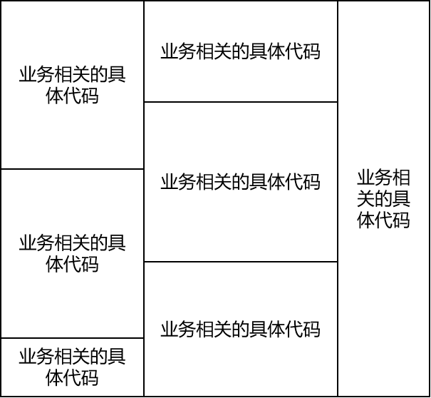

## 2、Vue3简介
- Vue主流的是2和3这两个大版本：从使用的角度来说2和3区别较大
- 作者：尤雨溪

<br/>

## 3、HelloWorld
### ①目标
- 渲染文本标签体
- 渲染HTML标签属性
- 绑定单击响应函数

<br/>

### ②准备环境
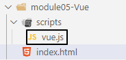

<br/>

在index.html页面中引入vue.js：
```html
<head>

    <meta charset="UTF-8">

    <meta http-equiv="X-UA-Compatible" content="IE=edge">

    <meta name="viewport" content="width=device-width, initial-scale=1.0">

    <!-- 引入 vue.js -->

    <script src="./scripts/vue.js"></script>

    <title>Document</title>

</head>
```

<br/>

Vue对象挂载div标签：
```javascript
// 准备参数对象

let paramObj = {

    // setup 是固定的名称，这里这个函数必须叫 setup

    setup: function() {
		// 这里返回的数据，就是要用来渲染视图的
        return {

            "message": "我热爱小动物，每顿饭都得有。"

        };

    }

};

  

// 调用 Vue 调用静态方法：createApp(参数对象)

let vueApp = Vue.createApp(paramObj);

  

// vueApp 和 HTML 标签之间需要做一个挂载的操作：

// #id 值

vueApp.mount("#vueAppAtguigu");
```

<br/>

### ③渲染文本标签体
#### [1]插值表达式
```html
<div id="vueAppAtguigu">

    <p>我是一头猪(´•(00)•`)</p>

  

    <!-- 使用插值表达式渲染p标签的文本标签体 -->

    <p>{{message}}</p>

</div>
```

<br/>

#### [2]v-text
```html
<!-- 使用v-text方式渲染p标签的文本标签体 -->

<p v-text="info">我是一头猪(´•(00)•`)</p>
```

<br/>

#### [3]v-html
- 当文本数据中包含HTML标签，v-html就能够解析，v-text不能解析

<br/>

```javascript
// 准备参数对象

let paramObj = {

    // setup 是固定的名称，这里这个函数必须叫 setup

    setup: function() {

        return {

            "message": "我热爱小动物，每顿饭都得有。",

            "info": "你是一个<span style='color:red;font-weight:bolder;'>好人</span>，但是我们不适合。"

        };

    }

};
```

<br/>

```html
<!-- 使用v-html方式渲染p标签的文本标签体 -->

<p v-html="info">我是一头猪(´•(00)•`)</p>
```

<br/>

### ④渲染HTML属性
```javascript
// 准备参数对象

let paramObj = {

    // setup 是固定的名称，这里这个函数必须叫 setup

    setup: function() {

        return {

            "message": "我热爱小动物，每顿饭都得有。",

            "info": "你是一个<span style='color:red;font-weight:bolder;'>好人</span>，但是我们不适合。",

            "styleValue": "color:green;font-weight:bolder;"

        };

    }

};
```

<br/>

```html
<!-- 到渲染数据的对象中找属性名，用对应的属性值渲染当前HTML属性 -->

<p v-bind:style="styleValue">论鸡蛋灌饼和手抓饼的本质区别。</p>

  

<!-- 简化写法：冒号后面直接写HTML属性名 -->

<p :style="styleValue">论鸡蛋灌饼和手抓饼的本质区别。</p>
```

<br/>

### ⑤绑定单击响应函数
声明单击响应函数：<br/>

```javascript
// 准备参数对象

let paramObj = {

    // setup 是固定的名称，这里这个函数必须叫 setup

    setup: function() {

        return {

            "message": "我热爱小动物，每顿饭都得有。",

            "info": "你是一个<span style='color:red;font-weight:bolder;'>好人</span>，但是我们不适合。",

            "styleValue": "color:green;font-weight:bolder;",

            "doClick": function() {

                alert("哇！你点击了我！");

            }

        };

    }

};
```

<br/>

```html
<!-- 给按钮绑定单击响应函数 -->
<button v-on:click="doClick()">点我你会快乐！</button>

<!-- 简化写法 -->
<button @click="doClick()">点我你会快乐！</button>
```

### ⑥综合
目标：准备div，当鼠标在div中移动时，在p标签中实时显示鼠标的坐标。
```html
<body>
    <div id="vueApp">
        <div @mousemove="showMouseCoordinate"></div>
        <p>{{coordinate}}</p>
    </div>
</body>
<script>
    Vue.createApp({
        // 准备渲染数据
        data: function() {
            return {
                coordinate: ""
            };
        },
        // 声明事件响应函数
        methods: {
            showMouseCoordinate(){
                this.coordinate = event.clientX + " " + event.clientY;
            }
        }
    }).mount("#vueApp");
</script>
```

# 二、Vue3通过Vite实现工程化
## 1、需求
通过Vite帮助我们生成Vue3组件化开发时工程的目录结构。

<br/>

## 2、操作
第一次使用Vite时会通过npm下载，以后就不用了：<br/>

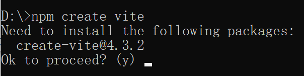

<br/>

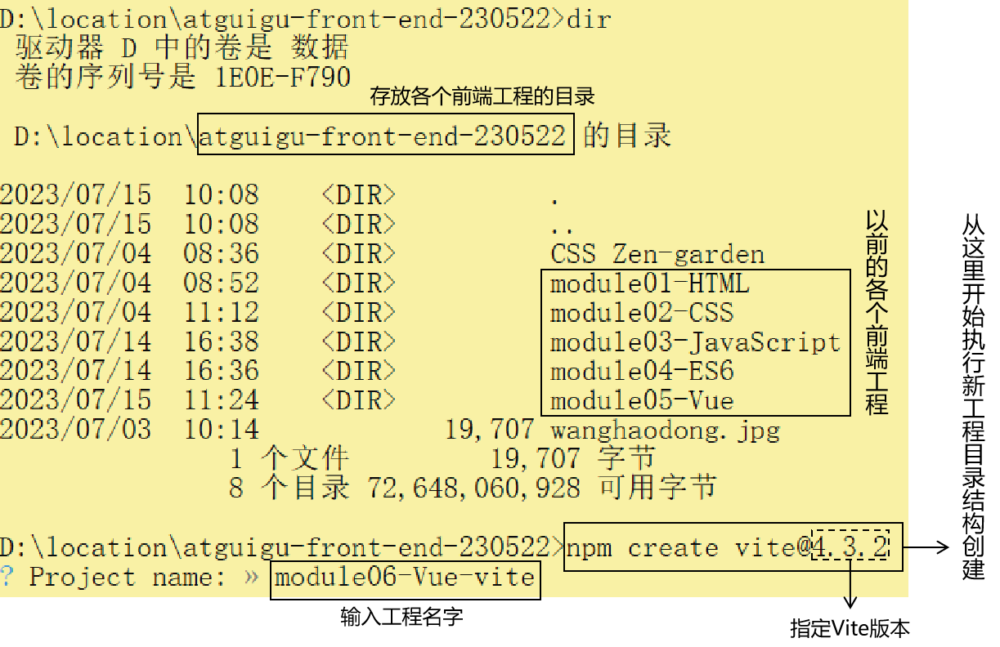
<br/>

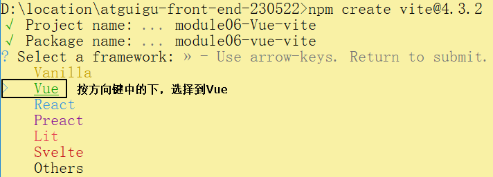

<br/>

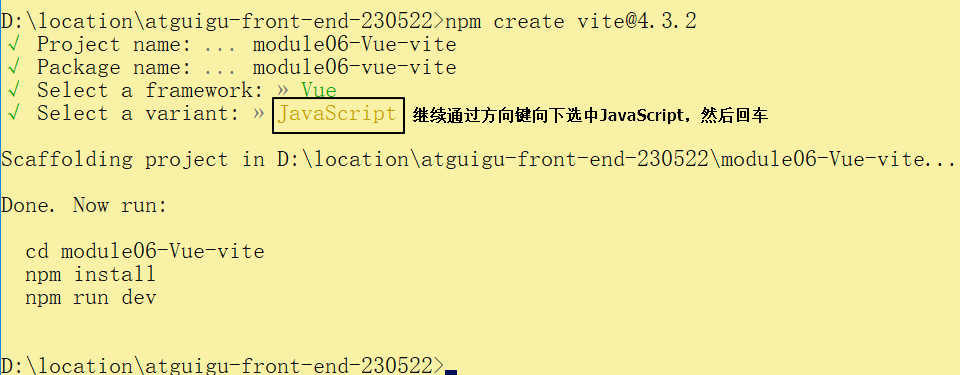

<br/>

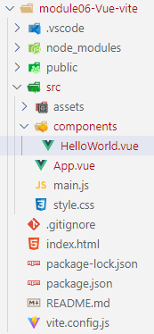

<br/>

## 3、启动并访问
```shell
# 第一步：进入刚才创建的工程目录
cd module06-vue-vite

# 第二步：安装package.json中指定的依赖信息
npm install

# 第三步：执行dev脚本启动当前前端工程
npm run dev
```

<br/>

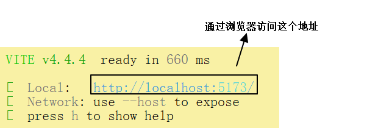

# 三、Vue3的组件化开发
## 1、组件文件和组件标签对应关系
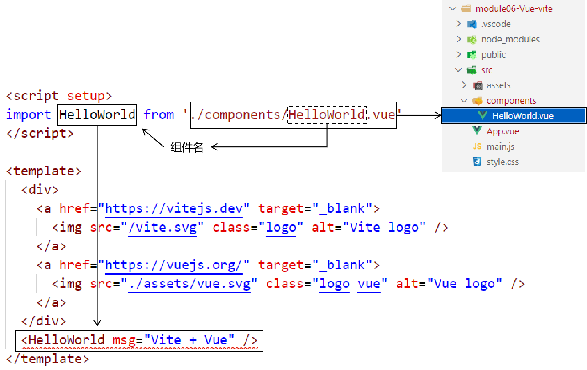

<br/>

## 2、开发第一个我们自己的组件
### ①创建组件文件
创建一个扩展名为vue的文件：

<br/>

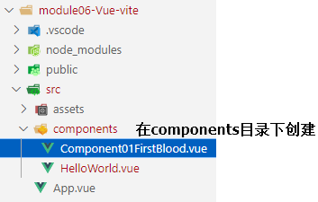

<br/>


### ②编写组件内容

<br/>

```html
<script type="module">

    export default {
        setup() {
            let textContent = "你好！Vue!";
            return {
                textContent
            }
        }
    }

</script>
<template>
    <div>{{ textContent }}</div>
</template>

<!-- style标签加scoped属性表示这里设置的样式仅针对当前组件生效，对其它组件没有任何影响 -->
<style scoped>
    div {
        border: 1px solid black;
        width: 100px;
        height: 100px;
    }
</style>
```

<br/>

### ③在App.vue导入自定义组件

<br/>

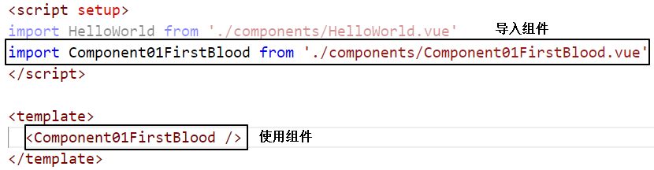

<br/>

### ④组件的简化写法

<br/>

```html
<script setup>

    let word = "I am not a pig.";
    let sayHello = function() {
        return "Good morning!";
    }

</script>
<template>

    <div>
        <span>{{ word }}</span>
        <span>{{ sayHello() }}</span>
    </div>

</template>
<style scoped>
    div {
        border: 1px dashed black;
        width: 100px;
        height: 100px;
    }
</style>
```

<br/>

# 四、Vue视图渲染技术
## 1、模板语法
### ①插值表达式
```html
<script setup>
    // 1、声明一个变量，用来渲染页面
    let textValue = "This is text value.";
</script>
<template>
    <div>
        <!-- 使用插值表达式渲染文本标签体 -->
        <p>{{ textValue }}</p>
        {{ textValue }}
    </div>
</template>
```

### ②v-text
```html
<!-- 使用v-text形式渲染文本标签体 -->
<p v-text="textValue"></p>
```

### ③v-html
```html
<!-- 使用v-html形式渲染文本标签体，能够解析数据中的HTML标签 -->
<p v-html="textValue"></p>
```

<br/>

## 2、条件渲染
```html
<p v-if="age >= 18">欢迎您入职：<span>{{ empName }}</span></p>
<span>something else</span>
<p v-if="age < 18">等你长大了再来：<span>{{ empName }}</span></p>

<br/><br/>

<p v-if="age >= 18">欢迎您入职：<span>{{ empName }}</span></p>
<!-- 在v-if和v-else之间不能有任何会在页面显示的实际内容：<span>something else</span> -->
<p v-else>等你长大了再来：小屁孩儿！</p>

<br/><br/>

<p v-if="age > 60">恭喜您：<span>{{ empName }}</span>光荣退休！</p>
<p v-else-if="age > 18">恭喜您：<span>{{ empName }}</span>继续工作！</p>
<p v-else>恭喜您：<span>{{ empName }}</span>青春常在！</p>

<br/><br/>

<!-- v-show和v-if的区别是： -->
<!-- v-if仅在条件满足时渲染。，如果条件改变，需要显示了，不能立即显示，要渲染之后才能显示。 -->
<!-- v-show在页面初始化时完成渲染，如果条件改变，需要显示了，可以立即显示。 -->
<p v-show="age > 0">恭喜您：<span>{{ empName }}</span>来到我们这个世界！</p>
```

<br/>

## 3、列表渲染
### ①应用场景
前端访问后端程序，得到了一个List集合数据，遍历List集合，显示到页面上。<br/>

### ②代码：简单数组
```html
<script setup>
    let simpleArr = ["香蕉", "苹果", "橘子", "梨", "西瓜"];
</script>
<template>
    <div>
        <ul>
            <!-- v-for="每一个元素的引用名称 in 遍历的数组" -->
            <li v-for="fruit in simpleArr">{{ fruit }}</li>
        </ul>
    </div>
</template>
<style scoped>
div {
    border: 1px solid black;
    width: 300px;
    height: 300px;
}
</style>
```

<br/>

### ③代码：对象数组
```html
<script setup>
    let simpleArr = ["香蕉", "苹果", "橘子", "梨", "西瓜"];
    let empArr = [{
        empId: 10,
        empName: "tom10",
        empAge: 100
    }, {
        empId: 20,
        empName: "tom20",
        empAge: 200
    }, {
        empId: 30,
        empName: "tom30",
        empAge: 300
    }];
</script>
<template>
    <div>
        <ul>
            <!-- v-for写在那个重复出现的标签上 -->
            <!-- v-for="每一个元素的引用名称 in 遍历的数组" -->
            <li v-for="fruit in simpleArr">{{ fruit }}</li>
        </ul>
        <br/>
        <table>
            <tr>
                <th>员工id</th>
                <th>员工Name</th>
                <th>员工Age</th>
            </tr>
            <!-- v-for写在那个重复出现的标签上 -->
            <tr v-for="emp in empArr">
                <td>{{ emp.empId }}</td>
                <td>{{ emp.empAge }}</td>
                <td>{{ emp.empName }}</td>
            </tr>
        </table>
    </div>
</template>
```

### ④代码：获取遍历索引
```html
<table>
    <tr>
        <th>编号</th>
        <th>员工id</th>
        <th>员工Name</th>
        <th>员工Age</th>
    </tr>
    <!-- 如果需要遍历过程中的索引值，那么按照下面格式声明index -->
    <tr v-for="(emp,index) in empArr">
        <td>{{ index+2 }}</td>
        <td>{{ emp.empId }}</td>
        <td>{{ emp.empAge }}</td>
        <td>{{ emp.empName }}</td>
    </tr>
</table>
```


## 4、响应式渲染
### ①概念
当渲染页面上数据的那个属性值改变了，就自动执行对应位置的重新渲染。

<br/>

### ②ref()方式
```html
<script setup>
    // 导入 ref 函数
    import {ref} from 'vue';

    // 把希望有响应式效果的数据，用 ref() 函数包装一下，ref()函数参数这里传入的是初始值
    // ref() 函数只能针对基本数据类型来包装
    let number = ref(100);

    // 声明一个函数可以弹出 number 的值
    let showNumber = function() {
        // number 经过 ref() 函数包装之后，它本身不是那个基本数据类型数据，而是一个包装后的对象
        alert(number);

        // 如果我们想要得到（或计算）它包装的基本数据类型数据，需要访问value属性
        alert(number.value);
    };

</script>
<template>
    <div>
        <button @click="number--">number-1</button>
        <!-- 但是插值表达式里面是自动解除包装的，不需要.value了 -->
        {{ number }}
        <button @click="number++">number+1</button>
        <button @click="showNumber()">查看Number值</button>
    </div>
</template>
```

<br/>

# 五、总结
- 使用Vite创建Vue开发所需的目录结构
- 创建好目录结构之后，使用npm run dev启动Web工程
- 访问启动的Web工程
- 在Web工程的components目录下开发Vue组件
- 把Vue组件加入App.vue中，到页面看效果显示没有
- 创建组件：测试插值表达式渲染
- 创建组件：测试v-text表达式渲染
- 创建组件：测试v-html表达式渲染
- 创建组件：测试v-if条件渲染
- 创建组件：测试v-if v-else条件渲染
- 创建组件：测试v-if v-else-if条件渲染
- 创建组件：测试v-show条件渲染
- 创建组件：测试v-for条件渲染(简单数组)
- 创建组件：测试v-for条件渲染(对象数组)
- 创建组件：测试ref()函数实现的响应式渲染
