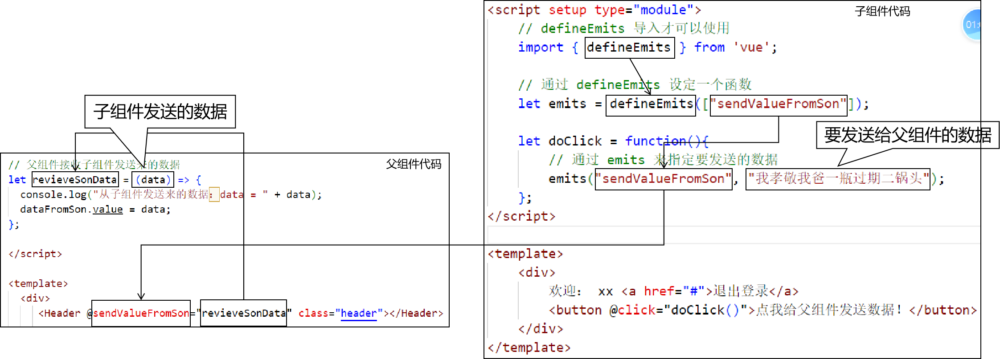
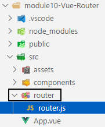

# 今天内容
- Vue3页面渲染技术
	- reactive响应式渲染
	- 双向绑定
	- 属性计算
	- 数据监听
	- 事件响应
	- Vue生命周期
- Vue3组件
	- 入门案例
	- 组件之间传递数据：父传子
	- 组件之间传递数据：子传父
	- 组件之间传递数据：兄传弟
- Vue3路由机制
	- 概念
	- 入门案例

<br/>

# 一、Vue3页面渲染技术
## 1、响应式渲染
概念：
- 假设变量x是用来渲染页面元素的数据
- 当x的值发生改变后，让页面元素重新渲染

<br/>

## 2、ref()函数
负责基本数据类型的响应式渲染。<br/>

## 3、reactive()函数
负责引用类型数据的响应式渲染。<br/>

```html
<script setup>
    // 导入后面需要使用 reactive 函数
    import { reactive } from 'vue';

    // 准备渲染页面的数据：使用reactive()函数封装对象的初始值
    let student = reactive({
        stuId: 56,
        stuName: "tom",
        stuAge: 25
    });

    let reverseStuName = function() {
        // 表达式和JavaScript代码中都是直接访问属性即可
        student.stuName = student.stuName.split("").reverse().join("");
    };
</script>
<template>
    <div>
        <table>
            <tr>
                <th>字段</th>
                <th>值</th>
            </tr>
            <tr>
                <td>StuId：</td>
                <td>{{ student.stuId }}</td>
            </tr>
            <tr>
                <td>StuName：</td>
                <td>{{ student.stuName }}</td>
            </tr>
            <tr>
                <td>StuAge：</td>
                <td>{{ student.stuAge }}</td>
            </tr>
        </table>
        <!-- 在@click事件响应中，如果是简短的JavaScript代码，那么可以不声明函数，直接写代码 -->
        <button @click="student.stuAge++">点我给学生年龄增加1岁</button>
        <button @click="student.stuAge--">点我给学生年龄减少1岁</button>
        <button @click="reverseStuName()">点我把学生名字颠倒顺序</button>
    </div>
</template>
<style scoped>
div {
    border: 1px solid black;
    width: 300px;
    height: 300px;
}
</style>
```

<br/>

## 4、双向绑定
### ①概念
- 单向绑定：值改变 --> 触发 --> 重新渲染
- 双向绑定：
	- 值改变 --> 触发 --> 重新渲染
	- 页面上值改变 --> 触发 --> 值改变

<br/>

页面元素在浏览器窗口显示之后，只有表单项里面的值才可以修改。从这个意义上来说，双向绑定就是为了在JavaScript代码中获取用户在表单项输入的值。

<br/>

### ②例子01
```html
<script setup>
    import { ref } from 'vue';
    let loginAccount = ref("peter");
    let season = ref([]);
    let team = ref([]);
</script>
<template>
    <div>
        <h4>普通属性渲染</h4>
        登录账号：<input type="text" name="loginAccount" v-bind:value="loginAccount" /><br/>
        <br/>

        <h4>双向绑定</h4>
        <!-- 在有些版本中，v-model:value简写为v-model -->
        <!-- 现在版本：v-model后面不能写:value -->
        登录账号：<input type="text" name="loginAccount" v-model="loginAccount" /><br/>
        登录账号：<span>{{ loginAccount }}</span>

        <br/>
        <br/>

        你喜欢的季节：<br/>
        <!-- 对于单选按钮、多选按钮这样多个值的标签来说，v-model要设置成ref()包装过的数组 -->
        春天：<input type="radio" name="season" v-model="season" value="spring" /><br/>
        夏天：<input type="radio" name="season" v-model="season" value="summer" /><br/>
        秋天：<input type="radio" name="season" v-model="season" value="autumn" /><br/>
        冬天：<input type="radio" name="season" v-model="season" value="winter" /><br/>
        你喜欢的季节：<span>{{ season }}</span>

        <br/>
        <br/>

        你支持的球队：<br/>
        中国队：<input type="checkbox" name="team" v-model="team" value="china" /><br/>
        德国队：<input type="checkbox" name="team" v-model="team" value="german" /><br/>
        巴西队：<input type="checkbox" name="team" v-model="team" value="brazil" /><br/>
        法国队：<input type="checkbox" name="team" v-model="team" value="france" /><br/>
        你支持的球队：<span>{{ team }}</span>

    </div>
</template>
<style scoped>

</style>
```

<br/>

### ③例子02
整个表单封装为一个对象：<br/>

```html
<script setup>
    import { reactive } from 'vue';
    let user = reactive({
        loginAccount: null,
        loginPwd: null,
        nickName: null,
        description: null,
        season: [],
        team: []
    });
</script>
<template>
    <div>
        登录账号：<input type="text" name="loginAccount" v-model="user.loginAccount" /><br/>
        登录密码：<input type="password" name="loginPwd" v-model="user.loginPwd" /><br/>
        用户昵称：<input type="text" name="nickName" v-model="user.nickName" /><br/>
        自我介绍：<textarea v-model="user.description"></textarea><br/>

        你喜欢的季节：<br/>
        <!-- 对于单选按钮、多选按钮这样多个值的标签来说，v-model要设置成ref()包装过的数组 -->
        春天：<input type="radio" name="season" v-model="user.season" value="spring" /><br/>
        夏天：<input type="radio" name="season" v-model="user.season" value="summer" /><br/>
        秋天：<input type="radio" name="season" v-model="user.season" value="autumn" /><br/>
        冬天：<input type="radio" name="season" v-model="user.season" value="winter" /><br/>

        <br/>
        <br/>

        你支持的球队：<br/>
        中国队：<input type="checkbox" name="team" v-model="user.team" value="china" /><br/>
        德国队：<input type="checkbox" name="team" v-model="user.team" value="german" /><br/>
        巴西队：<input type="checkbox" name="team" v-model="user.team" value="brazil" /><br/>
        法国队：<input type="checkbox" name="team" v-model="user.team" value="france" /><br/>

        <br/>
        <br/>
        整个User对象：<span>{{ user }}</span>

    </div>
</template>
<style scoped>

</style>
```

<br/>

## 5、属性计算
### ①提出问题
渲染的时候，是通过执行一个函数得到具体值。<br/>

```html
<script setup>
    let computeValue = function() {
        console.log("computeValue() 函数执行了。");
        let data01 = 10;
        let data02 = 20;
        let data03 = 30;
        return data01 + data02 + data03;
    };
</script>
<template>
    <div>
        <p>{{ computeValue() }}</p>
        <p>{{ computeValue() }}</p>
        <p>{{ computeValue() }}</p>
    </div>
</template>
```

<br/>

### ②解决问题
```html
<script setup>
    // 导入 computed
    import { computed } from 'vue';

    // 把我们执行操作的函数封装起来，返回表达式中可以直接使用的属性
    let computedValue = computed(()=>{
        console.log("computedValue() 函数执行了。-------");
        let data01 = 10;
        let data02 = 20;
        let data03 = 30;
        return data01 + data02 + data03;
    });
</script>
<template>
    <div>
        <!-- 只在第一次渲染时执行被封装的函数，以后都是使用属性中缓存的数据 -->
        <p>{{ computedValue }}</p>
        <p>{{ computedValue }}</p>
        <p>{{ computedValue }}</p>
    </div>
</template>
<style scoped>
div {
    border: 1px solid black;
    width: 300px;
    height: 300px;
}
</style>
```

<br/>

### ③新的问题
当封装计算数据操作的函数中，数据变化了，computed封装的属性是否会重新计算。<br/>
也就是computed机制是否存在缓存不一致问题：<br/>

```html
<script setup>
    import { computed, ref } from 'vue';

    // 准备渲染需要使用的数据
    let number = ref(10);

    // 使用 computed 包装对 number 进行计算的操作
    let numberComputed = computed(()=>{
        console.log("numberComputed 封装的函数执行了。**********");
        return number.value * 10;
    });

</script>
<template>
    <div>
        <p>{{ numberComputed }}</p>
        <p>{{ numberComputed }}</p>
        <p>{{ numberComputed }}</p>
        <input type="text" v-model="number" />
    </div>
</template>
<style scoped>
div {
    border: 1px solid black;
    width: 300px;
    height: 300px;
}
</style>
```

<br/>

## 6、数据监听
### ①概念
当用户在浏览器窗口内，修改表单项的值，触发事件。在事件响应函数中把新值、旧值都拿到，还可以做一些定制的操作。<br/>

### ②举例：监控基本数据类型
```html
<script setup>
    import { ref, watch } from 'vue';
    let number = ref(100);

    // 监控 number 数据的修改
    // wathc(被监控的数据, (newValue, oldValue)=>{})
    watch(number, (newValue, oldValue)=>{
        console.log(`${oldValue}变成了${newValue}`);
    });

</script>
<template>
    <div>
        请输入一个数字：<input type="text" v-model="number" /><br/>
        您输入的数字是：<span>{{ number }}</span>
    </div>
</template>
<style scoped>
div {
    border: 1px solid black;
    width: 300px;
    height: 300px;
}
</style>
```

<br/>

### ③举例：监控对象属性
```html
<script setup>
    
    import { reactive, watch } from 'vue';

    // 使用 reactive 包装一个对象
    let soldier = reactive({weapon:"gun"});

    // 针对被包装对象的weapon这一个属性进行监控
    // 设定被监控的属性：通过箭头函数来返回
    watch(()=>soldier.weapon , (newValue, oldValue)=>{
        console.log(`${oldValue}变为${newValue}`);
    });

</script>
<template>
    <div>
        请输入士兵的武器：<input type="text" v-model="soldier.weapon" /><br/>
        您输入的武器是：<span>{{ soldier.weapon }}</span>
    </div>
</template>
<style scoped>
div {
    border: 1px solid black;
    width: 300px;
    height: 300px;
}
</style>
```

<br/>

### ④举例：监控整个对象
```html
<script setup>
    
    import { reactive, watch } from 'vue';

    // 使用 reactive 包装一个对象
    let soldier = reactive({
        weapon:"gun",
        soldierName:"tom"
    });

    // 针对被包装对象的weapon这一个属性进行监控
    // 设定被监控的对象：通过箭头函数来返回
    // 此时newValue和oldValue就都是改变之后的对象，是同一个值
    // 还需设置deep为true，进行深度监控
    // 对整个对象全面进行监控，会导致任何属性修改都触发监控的方法，会有一些浪费性能的担心
    watch(()=>soldier , (newValue, oldValue)=>{
        console.log(newValue);
        console.log(oldValue);
    }, {deep:true});

</script>
<template>
    <div>
        请输入士兵的武器：<input type="text" v-model="soldier.weapon" /><br/>
        您输入的武器是：<span>{{ soldier.weapon }}</span>
    </div>
</template>
<style scoped>
div {
    border: 1px solid black;
    width: 300px;
    height: 300px;
}
</style>
```

<br/>

### ⑤WatchEffect
```html
<script setup>
    
    import { reactive, watchEffect } from 'vue';

    let soldier = reactive({
        weapon:"gun",
        name:"tom"
    });

    // 所有响应式渲染的数据被修改都会触发监控
    watchEffect(()=>{
        // 想要获取哪个数据值，就直接访问其属性即可
        console.log(soldier.weapon);
        console.log(soldier.name);
    });

</script>
<template>
    <div>
        请输入士兵的武器：<input type="text" v-model="soldier.weapon" /><br/>
        请输入士兵的姓名：<input type="text" v-model="soldier.name" /><br/>
        您输入的武器是：<span>{{ soldier.weapon }}</span><br/>
        您输入的武器是：<span>{{ soldier.name }}</span>
    </div>
</template>
<style scoped>
div {
    border: 1px solid black;
    width: 300px;
    height: 300px;
}
</style>
```

<br/>

## 7、事件响应
### ①基本写法
```html
<!-- 完整写法 -->
<button v-on:click="事件响应函数名()">点我</button>

<!-- 简化写法 -->
<button @click="事件响应函数名()">点我</button>
```

<br/>

### ②设置事件属性
- 事件类型.once：只触发一次事件。[重点]
- 事件类型.prevent：取消控件默认行为。[重点]
- 事件类型.stop：阻止事件冒泡。
- 事件类型.capture：使用事件捕获模式而不是冒泡模式。
- 事件类型.self：只在事件发送者自身触发时才触发事件。

<br/>

### ③代码举例
```html
<script setup>
    let doClickOnce = function(){
        alert("该事件只触发一次。");
    };

    let clickAnchor = function(){
        let confirmResult = confirm("你真的要去百度吗？");
        if(confirmResult) {
            // 去：手动操作
            window.location.href = "http://www.baidu.com";
        } else {
            // 不去
        }
    };

    let clickSubmitBtn = function(){
        let confirmResult = confirm("你真的要提交表单吗？");
        if(confirmResult) {
            // 1、获取当前点击按钮的单击事件对象
            console.log(event);

            // 2、通过事件对象获取当前点击的按钮对象
            console.log(event.target); // 是我们要的
            console.log(this); // 不是我们要的

            // 3、通过按钮元素对象获取表单form元素对象
            console.log(event.target.parentElement);

            // 4、调用表单元素对象的submit()方法提交表单
            event.target.parentElement.submit();
        }
    }
</script>
<template>
    <div>
        <button @click.once="doClickOnce()">我只能点一次，再点就不管用了</button>
    
        <br/><br/>
    
        <!-- .prevent修饰符：彻底取消控件的默认行为，不会参考任何条件 -->
        <a href="http://www.baidu.com" @click.prevent="clickAnchor()">点击超链接弹出confirm确认框</a>

        <br/><br/>
        <form action="http://www.baidu.com" method="post">
            <input type="text" name="userName" value="tom2013" />
            <button type="submit" @click.prevent="clickSubmitBtn()">点我提交表单</button>
        </form>

    </div>
</template>
<style scoped>
div {
    border: 1px solid black;
    width: 300px;
    height: 300px;
}
</style>
```

<br/>

## 8、Vue生命周期
### ①应用场景
页面初始化的时候，给后端程序发送请求，得到数据，再拿这些数据渲染页面。<br/>

### ②测试代码
```html
<script setup>
    // 生命周期的钩子函数必须导入才可以使用
    // Vue3中已经没有created函数了
    import { ref, onBeforeMount, onMounted, onBeforeUpdate, onUpdated } from 'vue';
    let userName = ref("harry");

    onBeforeMount(()=>{
        // 获取被挂载的元素对象：null
        let pEle = document.getElementById("pEle");
        console.log(pEle);
    });

    onMounted(()=>{
        // 获取被挂载的元素对象：有值，能获取到
        let pEle = document.getElementById("pEle");
        console.log(pEle);

        // 获取元素对象的文本标签体：有值，说明此时已经基于初始值完成了渲染
        console.log(pEle.innerText);
    });

    onBeforeUpdate(()=>{
        // 获取文本框中用户输入的新值
        console.log(userName.value);

        let pEle = document.getElementById("pEle");

        // 获取p元素对象的文本标签体
        console.log(pEle.innerText);
    });

    onUpdated(()=>{
        // 获取文本框中用户输入的新值
        console.log(userName.value);

        let pEle = document.getElementById("pEle");

        // 获取p元素对象的文本标签体
        console.log(pEle.innerText);
    });

</script>
<template>
    <div>
        <input type="text" name="userName" v-model="userName" />
        <p id="pEle">{{ userName }}</p>
    </div>
</template>
```

# 二、组件之间传值
## 1、父传子
### ①父组件
```html
<script setup>
import Header from './components/Header.vue';
import Content from './components/Content.vue';
import Navigator from './components/Navigator.vue';
import { ref } from 'vue';

// 声明一个属性，作为父要传给子的
let parentData = ref("咱们家祖传的花瓶");

</script>

<template>
  <div>
     <Header class="header"></Header>
     <Navigator class="navigator"></Navigator>
     <Content :parentData="parentData" class="content"></Content>
  </div>
</template>
```

<br/>

### ②子组件
```html
<script setup type="module">

    // 调用 defineProps() 函数，传入对象
    defineProps({
        "parentData":"String"
    });

</script>

<template>
    <div>
        展示的主要内容！
        <p>{{ parentData }}</p>
    </div>
</template>
```

<br/>

## 2、子传父
### ①代码：子组件代码
```html
<script setup type="module">
    // defineEmits 导入才可以使用
    import { defineEmits } from 'vue';

    // 通过 defineEmits 设定一个函数
    let emits = defineEmits(["sendValueFromSon"]);

    let doClick = function(){
        // 通过 emits 来指定要发送的数据
        emits("sendValueFromSon", "我孝敬我爸一瓶过期二锅头");
    };
</script>

<template>
    <div>
        欢迎： xx <a href="#">退出登录</a>
        <button @click="doClick()">点我给父组件发送数据！</button>
    </div>
</template>
```

<br/>

### ②代码：父组件代码
```html
<script setup>
import Header from './components/Header.vue';
import Content from './components/Content.vue';
import Navigator from './components/Navigator.vue';
import { ref } from 'vue';

// 声明一个属性，作为父要传给子的
let parentData = ref("咱们家祖传的花瓶");

// 声明一个响应式渲染的属性
let dataFromSon = ref("");

// 父组件接收子组件发送来的数据
let revieveSonData = (data) => {
  console.log("从子组件发送来的数据：data = " + data);
  dataFromSon.value = data;
};

</script>

<template>
  <div>
     <Header @sendValueFromSon="revieveSonData" class="header"></Header>
     
     <Navigator class="navigator"></Navigator>
     <Content :parentData="parentData" class="content"></Content>
     <p>{{ dataFromSon }}</p>
  </div>
</template>
```

<br/>

### ③代码分析


<br/>

## 3、兄传弟
- 本质：兄传父，父传给“弟”。
- 代码：参考上面

<br/>

# 三、路由
## 1、功能和效果
让页面跳转功能不再是传统的超链接跳转页面，而是Vue通过不同组件的切换，在浏览器本地就完成不同内容的显示。<br/>

整个浏览器窗口没有重新加载，用户体验更好。<br/>

## 2、操作步骤
### ①创建新module
```shell
# 创建新前端工程
npm create vite

# 进入新工程目录
cd xxx

# 安装vue依赖
npm install

# 安装vue-router依赖
npm install vue-router@4 --save
```

<br/>

### ②准备所需的各个组件
参考代码

<br/>

### ③配置路径和组件之间的对应关系


<br/>

```javascript
// 导入创建路由对象所需的 API
import {createRouter, createWebHashHistory} from 'vue-router';
import Page01Home from '../components/Page01Home.vue';

import Page02Add from '../components/Page02Add.vue';

import Page03Delete from '../components/Page03Delete.vue';

import Page04Update from '../components/Page04Update.vue';

import Page05Query from '../components/Page05Query.vue';

// 创建路由对象
const router = createRouter({
    history: createWebHashHistory(),

    // 指定路径和组件之间的对应关系
    routes: [
        {
            path: "/",
            component: Page01Home
        },
        {
            path: "/add",
            component: Page02Add
        },
        {
            path: "/delete",
            component: Page03Delete
        },
        {
            path: "/update",
            component: Page04Update
        },
        {
            path: "/query",
            component: Page05Query
        }
    ]
});

// 暴露路由对象
export default router;
```

<br/>

### ④在main.js中引入router.js
```javascript
import { createApp } from 'vue'
import './style.css'
import App from './App.vue'

// 导入路由规则
import router from './router/router.js';

let app = createApp(App);

// 应用路由规则
app.use(router);

app.mount('#app');
```

<br/>

### ⑤在App.vue中创建路由超链接
```html
<script setup>
import Page01Home from './components/Page01Home.vue'
import Page02Add from './components/Page02Add.vue'
import Page03Delete from './components/Page03Delete.vue'
import Page04Update from './components/Page04Update.vue'
import Page05Query from './components/Page05Query.vue'
</script>

<template>
  <div>
    <router-link to="/">首页</router-link>&nbsp;
    <router-link to="/add">添加操作</router-link>&nbsp;
    <router-link to="/delete">删除操作</router-link>&nbsp;
    <router-link to="/update">更新操作</router-link>&nbsp;
    <router-link to="/query">查询操作</router-link>&nbsp;
    <router-view></router-view>
  </div>
</template>
```

# 四、总结
- Vue3页面渲染技术
	- reactive响应式渲染
	- 双向绑定
	- 属性计算
	- 数据监听
	- 事件响应
	- Vue生命周期
		- 页面初始化时在onMounted()设置的钩子函数给后端发请求获取数据
- Vue3组件
	- 入门案例
	- 组件之间传递数据：父传子
	- 组件之间传递数据：子传父
	- 组件之间传递数据：兄传弟
- Vue3路由机制
	- 概念
	- 入门案例