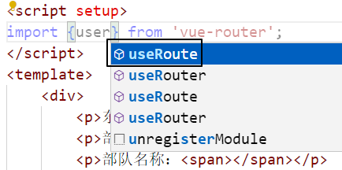
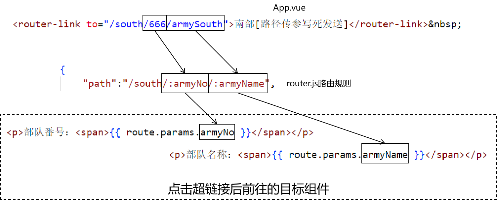
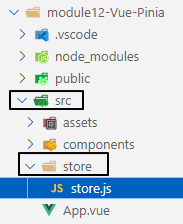
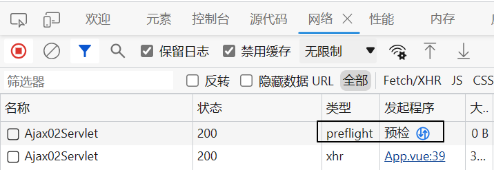
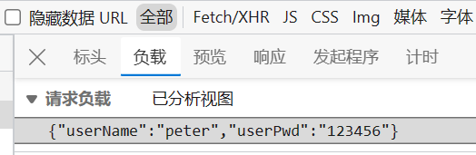

# 一、路由
## 1、路由重定向
访问A地址，通过路由规则跳转到B地址：
```html
<router-link to="/">首页</router-link>&nbsp;
<router-link to="/east">东部</router-link>&nbsp;
<router-link to="/west">西部</router-link>&nbsp;
<router-link to="/south">南部</router-link>&nbsp;
<router-link to="/north">北部</router-link>&nbsp;
<router-link to="/show/west">测试路由重定向</router-link>&nbsp;
```

<br/>

```javascript
{
    "path":"/show/west",
    "redirect":"/west"
}
```

<br/>

## 2、动态路由
### ①应用场景
动态指定要访问的路由地址。<br/>

### ②实现方式
```html
<button @click="testDynamicRouting()">测试动态路由</button>
```

<br/>

```javascript
  // 导入动态路由所需要的 useRouter() 函数
  import {useRouter} from "vue-router";

  // 调用 useRouter() 函数得到 router 对象
  let router = useRouter();

  // 在单击响应函数中完成动态路由功能
  let testDynamicRouting = function() {
    let targetPath = prompt("你想去哪？");

    // 把当前要前往的目标地址压入 router 中
    router.push({
      "path":targetPath
    });
  };
```

## 3、路由传参
### ①发生的场景
点击链接，加载一个新的组件，此时给新组件传递参数数据。

<br/>

### ②两种传参的形式
#### [1]键值对形式
```html
<a href="/demo/remove?empId=5&empName=tom">删除一条记录</a>
```

<br/>

这就是我们熟悉的在URL地址后面附着请求参数的形式。

<br/>

#### [2]路径传参
```html
<a href="/demo/remove/5/tom">删除一条记录</a>
```

<br/>

对比两种传参方式区别：
- 路径传参看不到参数的名字了
- 因为看不到参数名字，所以：整个URL地址更简洁、更优雅
- 因为看不到参数名字，所以：和参数相关的信息更隐晦，不容易被猜到
- 由于格式发生了变化，路径传参已经不能叫做“请求参数”了

### ③各种情况测试
#### [1]键值对传参：写死
```html
<!-- 发送请求参数的写法 -->
<router-link to="/east?armyNo=1&armyName=eastArmy">东部</router-link>
```

<br/>

来到目标组件，接收请求参数：
```html
<script setup>
// 导入创建 route 对象所需的 useRoute() 函数
import {useRoute} from 'vue-router';

// 调用 useRoute() 函数得到 route 对象
let route = useRoute();
</script>
<template>
    <div>
        <p>东部战区</p>
        <!-- 在插值表达式中访问 route 对象的 query 属性，获取键值对形式的请求参数 -->
        <p>部队番号：<span>{{ route.query.armyNo }}</span></p>
        <p>部队名称：<span>{{ route.query.armyName }}</span></p>
    </div>
</template>
```

<br/>

导入时注意：<br/>



<br/>

#### [2]键值对传参：动态写法一
```html
<script setup>
  let queryParamPath = {
    "path":"/east",
    "query":{
      "armyNo":"001", // 这里 "001" 部分将来就可以动态替换为实时的数据
      "armyName":"super east army" // 这里 "super east army" 部分将来就可以动态替换为实时的数据
    }
  };
</script>

<template>
  <div>
    <!-- 相当于渲染了 to 这个属性 -->
    <router-link v-bind:to="queryParamPath">东部[键值对动态发送][写法一]</router-link>&nbsp;
    <router-view></router-view>
  </div>
</template>
```

<br/>

#### [3]键值对传参：动态写法二
```javascript
// 声明一个对象，用来封装发送键值对请求参数的对象
// 动态发送键值对数据写法一：拿这里声明的对象直接渲染 to 属性
let queryParamPath = {
  "path":"/east",
  "query":{
    "armyNo":"002", // 这里 "001" 部分将来就可以动态替换为实时的数据
    "armyName":"super super east army" // 这里 "super east army" 部分将来就可以动态替换为实时的数据
  }
};

// 单击响应函数
let sendQueryParamDynamic = function(){
  // 动态发送键值对数据写法二：把上面声明的对象压入 router 对象中
  router.push(queryParamPath);
};
```

<br/>

#### [4]路径传参：写死
```html
<!-- App.vue -->
<router-link to="/south/666/armySouth">南部[路径传参写死发送]</router-link>&nbsp;
```

<br/>

```javascript
{
    "path":"/south/:armyNo/:armyName",
    "component": Cmp04South
},
```

<br/>

```html
<script setup>
import { useRoute } from 'vue-router';
let route = useRoute();
</script>
<template>
    <div>
        <p>南部战区</p>
        <!-- 在插值表达式中访问 route 对象的 params 属性，获取路径参数 -->
        <p>部队番号：<span>{{ route.params.armyNo }}</span></p>
        <p>部队名称：<span>{{ route.params.armyName }}</span></p>
    </div>
</template>
```

<br/>



<br/>

#### [5]路径传参：动态写法一
```html
<button @click="sendPathParamDynamic01()">南部[路径传参动态发送][写法一]</button>
```

<br/>

```javascript
let sendPathParamDynamic01 = function() {

  let armyNo = 333;
  let armyName = "good south army";

  // 1、准备一下要访问的路径
  let path = `/south/${armyNo}/${armyName}`;

  // 2、把准备好的路径压入 router 对象中
  router.push(path);
};
```

<br/>

#### [6]路径传参：动态写法二
```html
<!-- App.vue -->
<button @click="sendPathParamDynamic02()">南部[路径传参动态发送][写法二]</button>
```

<br/>

```javascript
// App.vue
let sendPathParamDynamic02 = function() {
  let armyNo = 888;
  let armyName = "good good south army";

  // 在 router 对象中压入一个对象
  router.push({
    // 根据 name 属性指定路由规则
    "name":"Cmp04SouthName",

    // 在 params 属性中设置路径中的参数
    "params":{
      "armyNo": armyNo,
      "armyName": armyName
    }
  });
};
```

<br/>

```javascript
// router.js：在路由规则中增加name属性
{
    "path":"/south/:armyNo/:armyName",
    "component": Cmp04South,
    "name":"Cmp04SouthName"
},
```

<br/>

## 4、路由守卫
### ①概念
- 在路由切换到目标组件之前：执行类似登录检查这样的操作
	- 满足条件：放行
	- 不满足条件：转向到其它组件
- 在路由切换到目标组件之后：执行类似渲染页面这样的操作

<br/>

### ②可用API
```javascript
// 设定全局前置路由守卫
router.beforeEach((to, from, next)=>{
    // to 参数：代表目标组件，是一个被包装的对象。通过to.path获取目标组件的访问地址
    // from 参数：代表来源组件，是一个被包装的对象。通过from.path获取来源组件的访问地址
    // next 参数：这是一个函数，调用这个函数前往指定的组件
    //     next() 不传参数：相当把当前请求放行到目标组件
    //     next(path) 传参数：相当把当前转到path指定的目标组件
    console.log("[前置路由守卫]来源地址：" + from.path);
    console.log("[前置路由守卫]目标地址：" + to.path);
    console.log("[前置路由守卫]请求参数：" + to.query.armyName);
    console.log("[前置路由守卫]路径参数：" + to.params.armyName);
    console.log("[前置路由守卫]next()函数引用：" + next);

    // 执行放行操作
    next();
});

// 设定全局后置路由守卫
router.afterEach((to, from) => {
    console.log("[后置路由守卫]来源地址：" + from.path);
    console.log("[后置路由守卫]目标地址：" + to.path);
});
```

<br/>

### ③案例：检测身份
```javascript
// 设定全局前置路由守卫
router.beforeEach((to, from, next)=>{
    // =======================Demo：检查身份是不是中国人=======================
    // 1、获取请求参数（代表身份）
    let country = to.query.country;

    // ※"/" 和 "/foreigner"不需要做身份检查，如果目标地址是这个，则直接放行
    if(to.path == "/foreigner" || to.path == "/") {
        // 放行操作
        next();

        // 放行之后，当前方法结束
        return ;
    }

    // 2、判断身份是否是中国人
    if(country == "China") {
        // 3、如果是则放行
        next();
    } else {
        // 4、如果不是，则跳转到专门的组件
        next("/foreigner");
    }
});
```

# 二、Pinia
## 1、概念
维护各个组件之间全局范围的统一数据（或者说状态）：

<br/>


<br/>

## 2、创建一个带有Pinia功能的工程
```shell
# 创建vite工程
npm create vite

# 进入工程目录
cd 工程目录

# 安装vue
npm install

# 安装router
npm install vue-router@4 --save

# 安装Pinia
npm install pinia
```

<br/>

## 3、创建store.js维护全局状态数据


<br/>

```javascript
import {defineStore} from 'pinia';

// 调用 defineStore() 函数获取要暴露的对象，其中包含我们需要在全局范围维护的数据
const defineSoldier = defineStore({
    // id 属性：给当前store对象设定一个全局唯一的标识
    "id": "soldierStore",

    // state 属性：全局维护的数据本身，具体提供方式是箭头函数的返回值
    "state": ()=>{
        return {
            "soldierId": 1,
            "soldierName": "tom",
            "soldierAge": 20,
            "soldierWeapon": ["gun", "sword"]
        };
    },

    // getters 属性：提供一组对全局数据做读操作的方法
    "getters": {
        "getSoldierName": function() {
            return this.soldierName;
        },
        "getSoldierAge": function() {
            return this.soldierAge;
        }
    },

    // actions 属性：提供一组对全局数据进行计算操作的方法
    "actions": {
        "doubleSoldierAge": function() {
            this.soldierAge = this.soldierAge * 2;
        }
    }
});

// 暴露 defineSoldier 对象
export default defineSoldier;
```

<br/>

## 4、在main.js中引入store.js
```javascript
import { createApp } from 'vue'

import './style.css'
import router from './router/router.js'

// defineSoldier 是在需要用到全局数据的组件中，才导入
// import defineSoldier from './store/store.js'

// 导入 createPinia 函数
import {createPinia} from 'pinia'
import App from './App.vue'

// 调用 createPinia 函数，得到 pinia 对象
let pinia = createPinia();

// 通过 use() 方法传入 pinia 对象
createApp(App).use(router).use(pinia).mount('#app')
```

<br/>

## 5、读取Pinia数据的组件
```html
<script setup>
// 导入封装了全局数据的 defineSoldier
import defineSoldier from '../store/store.js';

// 调用 defineSoldier() 函数，得到封装了全局数据的对象
let soldier = defineSoldier();

</script>
<template>
    <div>
        <p>兵营 读Pinia数据</p>
        <p>士兵的id：{{ soldier.soldierId }}</p>
        <p>士兵的Name：{{ soldier.soldierName }}</p>
        <p>士兵的Age：{{ soldier.soldierAge }}</p>
        <p>士兵的Weapon：{{ soldier.soldierWeapon }}</p>
    </div>
</template>
```

<br/>

## 6、修改Pinia数据的组件
```html
<script setup>
// 导入封装了全局数据的 defineSoldier
import defineSoldier from '../store/store.js';

// 调用 defineSoldier() 函数，得到封装了全局数据的对象
let soldier = defineSoldier();

</script>
<template>
    <div>
        <p>训练场 写Pinia数据</p>
        士兵的id：<input type="text" name="id" v-model="soldier.soldierId" /><br/>
        士兵的Name：<input type="text" name="id" v-model="soldier.soldierName" /><br/>
        士兵的Age：<input type="text" name="id" v-model="soldier.soldierAge" /><br/>
        士兵的Weapon：<br/>
        枪：<input type="checkbox" name="weapon" v-model="soldier.soldierWeapon" value="gun" /><br/>
        剑：<input type="checkbox" name="weapon" v-model="soldier.soldierWeapon" value="sword" /><br/>
        盾：<input type="checkbox" name="weapon" v-model="soldier.soldierWeapon" value="shield" /><br/>
    </div>
</template>
```

<br/>

## 7、系统方法操作Pinia数据
```html
调用我们定义的两倍年龄方法：<button @click="soldier.doubleSoldierAge()">两倍年龄</button><br/>
系统方法操作Pinia数据：<button @click="soldier.$reset()">恢复默认值</button><br/>
系统方法操作Pinia数据：<button @click="updatePiniaData()">一次性修改多个值</button><br/>
```

<br/>

## 8、Pinia数据修改的监控
```javascript
// 监控Pinia数据的修改
soldier.$subscribe((mutation, state)=>{
    // 箭头函数是Pinia数据修改后调用的回调函数
    // state 是一个代理对象，state.event.target属性就是我们设定的全局数据
    console.log(state);

    // mutation 也是一个代理对象，封装了我们的全局数据
    console.log(mutation);
    console.log(mutation.storeId);
    console.log(soldier.$id)
    console.log(mutation.type)
    console.log(mutation.payload)
});
```

## 9、拓展
前端存储数据的新办法：
- localStorage
- sessionStorage

### ①说明
```text
localStorage和sessionStorage都是HTML5 Web Storage API提供的用于在浏览器端存储数据的方法，它们的主要区别如下：

1. 作用域：localStorage的作用域是整个浏览器窗口，在同一个窗口的不同页面中可以共享数据；而sessionStorage的作用域是当前会话（session），仅在同一个窗口的同一个页面中共享数据，页面刷新或重新打开页面会创建新的会话。
    
2. 生命周期：localStorage的数据没有过期时间，除非被手动删除，否则会一直保存在浏览器中；而sessionStorage的数据仅在当前会话有效，当会话关闭后数据会自动清除。
    
3. 存储容量：localStorage的存储容量较大，一般为5MB或更大；而sessionStorage的存储容量较小，一般为5MB左右。
    
4. 数据共享：由于localStorage的作用域是整个浏览器窗口，不同页面之间可以共享数据，因此适合用于存储全局数据；而sessionStorage的作用域仅限于当前页面，适合用于存储局部数据。
    

总结来说，localStorage适合用于持久化存储需要长期保存、全局共享的数据；而sessionStorage适合用于临时存储、页面内部共享的数据。
```

<br/>

### ②用法
```javascript
// 把数据存入 localStorage
window.localStorage.setItem("userName", "peter");

// 从 localStorage 读取数据
let userName = window.localStorage.getItem("userName");
console.log("userName = " + userName);

window.sessionStorage.setItem("loginInfo", "good");

let loginInfo = window.sessionStorage.getItem("loginInfo");
console.log("loginInfo = " + loginInfo);
```

<br/>

# 三、Ajax
## 1、概念
- 名称：**A**synchronous **J**avaScript **a**nd **X**ML（异步的 JavaScript 和 XML）
- 特征：给服务器发送请求，服务器返回的不是一个完整的页面，而仅仅是数据本身。Ajax程序从服务器响应中拿到数据，再回过头来更新页面上的DOM元素。
	- 在整个过程中浏览器窗口没有加载新的页面，用户体验更好。
	- 如果整个项目全部都是基于Ajax这样异步操作，那么整个项目可以称之为：前后端分离

<br/>

## 2、准备环境
```shell
# 创建vite工程
npm create vite

# 进入工程目录
cd 工程目录

# 安装vue
npm install

# 安装axios
npm install axios
```

<br/>

## 3、跨域
### ①概念
- 在A网站的页面下，通过Ajax方式，访问B网站
- B网站觉得从A网站来的这个Ajax请求不可靠，所以对这个请求的禁止就导致了跨域问题

<br/>

### ②哪些情况算跨域
- 情况1：IP地址不同
	- A页面：47.36.155.21
	- B页面：68.34.51.7
- 情况2：IP地址相同，但是端口号不同（我们现在就是这个情况）
	- A页面：localhost:5173
	- B页面：localhost:8080
- 情况3：域名中的二级域名不同
	- A页面：www.jd.com
	- B页面：www.tmall.com
- 情况4：协议不同

<br/>

### ③跨域问题的解决
我们使用CORS机制解决跨域问题：
- 先发送一个预检请求：拿到服务器返回的“跨域白名单”
- 如果当前请求在“跨域白名单”中，那么下一个正式请求就可以正常访问了

<br/>



<br/>

### ④创建专门的Filter
在Filter中统一设置CORS机制相关的响应消息头，这样就能统一解决跨域问题。
```java
package com.atguigu.ajax.filter;  
  
import jakarta.servlet.FilterChain;  
import jakarta.servlet.ServletException;  
import jakarta.servlet.http.HttpFilter;  
import jakarta.servlet.http.HttpServletRequest;  
import jakarta.servlet.http.HttpServletResponse;  
  
import java.io.IOException;  
  
public class CORSFilter extends HttpFilter {  
  
    @Override  
    protected void doFilter(HttpServletRequest request, HttpServletResponse response, FilterChain chain) throws IOException, ServletException {  
        // 设置解决跨域问题的响应消息头  
        // ※目前我们这里是完全开放了，相当于完全不设防，工作中要慎重设置  
        response.setHeader("Access-Control-Allow-Origin", "*");  
        response.setHeader("Access-Control-Allow-Methods", "POST, GET, OPTIONS, DELETE, HEAD");  
        response.setHeader("Access-Control-Max-Age", "3600");  
        response.setHeader("Access-Control-Allow-Headers", "access-control-allow-origin, authority, content-type, version-info, X-Requested-With");  
  
        // 请求直接放行  
        chain.doFilter(request, response);  
    }  
}
```

<br/>

```xml
<filter>  
    <filter-name>CORSFilter</filter-name>  
    <filter-class>com.atguigu.ajax.filter.CORSFilter</filter-class>  
</filter>  
<filter-mapping>  
    <filter-name>CORSFilter</filter-name>  
    <!-- 拦截当前 Web 应用的所有资源 -->  
    <url-pattern>/*</url-pattern>  
</filter-mapping>
```


## 4、实验
### ①实验一
- 发送请求：携带键值对形式的请求参数
- 接收响应：服务器端返回普通文本

#### [1]前端代码
```javascript
<script setup>

// 导入 axios
import axios from 'axios';

let testAjax01 = function(){

  // 声明一个对象，封装发送Ajax请求的参数
  let paramObj = {
    // 请求目标资源的 URL 地址
    "url":"http://localhost:8080/demo/Ajax01Servlet",

    // 请求方式
    "method":"post",

    // 使用params设置请求参数：即使当前是POST请求，也会把请求参数以键值对形式放在URL地址后面
    "params": {
        "userName":"tom",
        "userPwd":"123456"
    }
  };

  // 调用 axios() 函数，传入参数对象
  let axiosReturn = axios(paramObj);

  // 调用 axiosReturn 的 then() 方法设定回调函数
  // 回调函数会在服务器处理请求成功后执行
  axiosReturn.then((response)=>{
    // 通过 response 对象获取服务器返回的响应
    console.log(response);

    // 访问 response 对象的 data 属性获取服务器返回的响应体
    console.log("服务器返回的响应体：" + response.data)
  });
};

</script>

<template>
  <button @click="testAjax01()">实验一：键值对请求参数 服务器返回简单文本</button>
</template>
```

<br/>

#### [2]后端代码
```java
package com.atguigu.ajax.servlet;  
  
import jakarta.servlet.*;  
import jakarta.servlet.http.*;  
  
import java.io.IOException;  
  
public class Ajax01Servlet extends HttpServlet {  
    @Override  
    protected void doGet(HttpServletRequest request, HttpServletResponse response) throws ServletException, IOException {  
        doPost(request, response);  
    }  
  
    @Override  
    protected void doPost(HttpServletRequest request, HttpServletResponse response) throws ServletException, IOException {  
        // 1、接收请求参数  
        String userName = request.getParameter("userName");  
        String userPwd = request.getParameter("userPwd");  
  
        System.out.println("userName = " + userName);  
        System.out.println("userPwd = " + userPwd);  
  
        // 2、服务器端返回简单的文本数据响应  
        response.getWriter().write("server response:ok!");  
  
    }  
}
```

<br/>

### ②实验二
- 发送请求：把请求参数放到请求体
- 接收响应：服务器端返回普通文本

#### 【1】前端代码
```javascript
let testAjax02 = function(){

  axios({
    "url":"http://localhost:8080/demo/Ajax02Servlet",
    "method":"post",

    // 要把发送给服务器的数据放在请求体，必须使用 data 属性
    // 但是此时axios会把整个JSON对象放在请求体，所以服务器端接收的方式就不一样了
    "data": {
      "userName":"peter",
      "userPwd":"123456"
    }
  }).then((response)=>{
    console.log("服务器返回的响应体数据：" + response.data);
  });

};
```

#### 【2】后端代码
为什么不能继续使用request.getParameter()获取请求参数？<br/>
因为请求参数的格式已经变成JSON格式了：<br/>



<br/>

```java
@Override  
protected void doPost(HttpServletRequest request, HttpServletResponse response) throws ServletException, IOException {  
  
    // 请求体是 JSON 数据的时候如何处理？  
    // 1、通过请求对象获取输入流  
    BufferedReader reader = request.getReader();  
  
    // 2、创建 StringBuffer 对象存储从输入流中读取到的数据  
    StringBuffer stringBuffer = new StringBuffer();  
  
    String line = null;  
  
    // 3、把输入流中的数据读取到 StringBuffer 对象中  
    while ((line = reader.readLine()) != null) {  
        stringBuffer.append(line);  
    }  
  
    // 4、获取整个请求体字符串  
    String requestBody = stringBuffer.toString();  
    System.out.println("requestBody = " + requestBody);  
  
    // 5、创建 Gson 对象  
    Gson gson = new Gson();  
  
    // 6、把 JSON 字符串解析成一个 Java 对象  
    User user = gson.fromJson(requestBody, User.class);  
    System.out.println("user = " + user);  
  
    response.getWriter().write("server response.");  
}
```

<br/>

### ③实验三
```javascript
let testAjax03 = function() {
  axios({
    "url":"http://localhost:8080/demo/Ajax03Servlet",
    "method":"get"
  }).then((response)=>{
    // 获取服务器端返回的响应体
    console.log(response.data);
    console.log(typeof response.data);

    // axios框架已经自动帮我们把JSON字符串转换为了JSON对象
    // 所以我们可以直接访问响应体数据的属性名
    console.log(response.data.userName);
    console.log(response.data.userPwd);

    // 下面是手动互转的方法：
    // JSON对象转JSON字符串：JSON.stringify(JSON对象)
    // JSON字符串转JSON对象：JSON.parse(JSON字符串)
  });
};
```

<br/>

```java
@Override  
protected void doGet(HttpServletRequest request, HttpServletResponse response) throws ServletException, IOException {  
  
    // 1、创建 User 对象  
    User user = new User("harry", "987765");  
  
    // 2、创建 Gson 对象  
    Gson gson = new Gson();  
  
    // 3、调用 Gson 对象的方法把 Java 对象转换为 JSON 字符串  
    String responseBody = gson.toJson(user);  
  
    // 4、返回响应  
    response.getWriter().write(responseBody);  
  
}
```


### ④实验四
- 前端请求：不发送数据，只发送请求
- 后端响应：返回JSON字符串

#### 【1】前端代码
```javascript
let testAjax04 = function() {
  axios({
    "url":"http://localhost:8080/demo/Ajax04Servlet",
    "method":"get"
  }).then((response)=>{
    console.log(response.data);
  }).catch((errorResponse)=>{
    // catch中指定的回调函数在服务器端处理请求失败后执行
    // 打印整个响应对象
    console.log(errorResponse);

    // 当前响应对象
    console.log(errorResponse.response);

    // 响应状态码
    console.log(errorResponse.response.status);

    // 响应状态码的说明信息
    console.log(errorResponse.response.statusText);
  });
};
```

<br/>

#### [2]后端代码
```java
@Override  
protected void doGet(HttpServletRequest request, HttpServletResponse response) throws ServletException, IOException {  
  
    response.setContentType("text/html;charset=UTF-8");  
  
    throw new RuntimeException("我是俄罗斯，按下核按钮，咱们一起完蛋！");  
}
```

<br/>

# 四、总结
大家回去敲代码的顺序：
- Ajax axios
- 路由相关
- Pinia