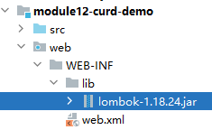
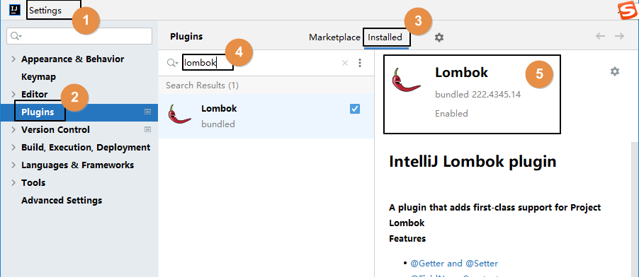
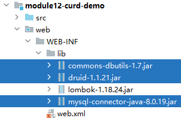
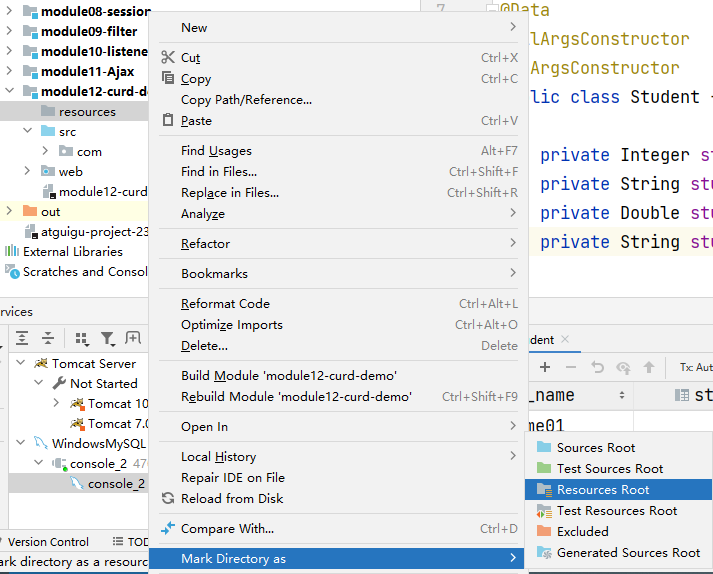
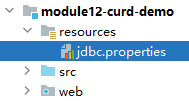
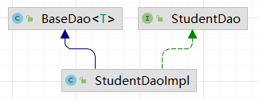
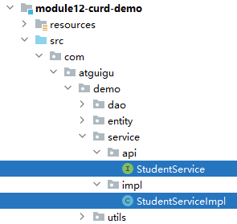
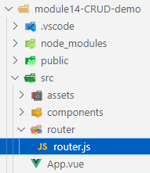

# 一、搭建后端环境
## 1、SQL语句
```sql
# 创建数据库  
create database db_demo230522;  
  
# 使用数据库  
use db_demo230522;  
  
# 创建数据库表  
create table t_student(  
    stu_id int primary key auto_increment,  
    stu_name char(100),  
    stu_score double(10, 3),  
    stu_gender enum('female', 'male')  
);  
  
# 插入测试数据  
insert into t_student(stu_name, stu_score, stu_gender) values ("stuName01", "100.00", "male");  
insert into t_student(stu_name, stu_score, stu_gender) values ("stuName02", "200.00", "female");  
insert into t_student(stu_name, stu_score, stu_gender) values ("stuName03", "300.00", "male");  
insert into t_student(stu_name, stu_score, stu_gender) values ("stuName04", "400.00", "female");  
insert into t_student(stu_name, stu_score, stu_gender) values ("stuName05", "500.00", "male");
```

<br/>

## 2、创建后端程序module
略<br/>

## 3、逻辑建模
```java
package com.atguigu.demo.entity;  
  
import lombok.AllArgsConstructor;  
import lombok.Data;  
import lombok.NoArgsConstructor;  
  
@Data  
@AllArgsConstructor  
@NoArgsConstructor  
public class Student {  
  
    private Integer stuId;  
    private String stuName;  
    private Double stuScore;  
    private String stuGender;  
  
}
```

<br/>

## 4、lombok
### ①导入jar包


<br/>

### ②确认IDEA是否安装了lombok插件


<br/>

### ③原理
- lombok读取注解
- 根据注解的要求生成代码
- 把生成代码植入字节码文件中

<br/>

## 5、持久化层环境搭建
### ①导入jar包


<br/>

### ②创建专门存放配置文件的目录
友情提示：不是必须的，但是有利于程序结构清晰

<br/>



### ③jdbc.properties



<br/>

```properties
url=jdbc:mysql://localhost:3306/db_demo230522?serverTimezone=Asia/Shanghai  
username=root  
password=atguigu  
initialSize=3  
maxActive=5  
maxWait=2000  
driverClassName=com.mysql.cj.jdbc.Driver
```

<br/>

### ④Dao结构


<br/>

- BaseDao的完整代码参考发的代码

## 6、业务逻辑层
### ①组件结构


<br/>

### ②StudentServiceImpl
```java
public class StudentServiceImpl implements StudentService {  
  
    // 面向接口编程：成员变量使用接口类型，创建对象使用实现类  
    // 好处：实现类改变，不会导致 Service 类跟着改变  
    private StudentDao studentDao = new StudentDaoImpl();  
  
}
```

<br/>

## 7、表述层
### ①BaseController
#### 【1】提出问题
为什么需要给各个Servlet抽取一个父类？<br/>

目前创建Servlet是继承HttpServlet，重写doGet()、doPost()方法。<br/>

在具体业务开发过程中，一个Servlet只能处理一个请求。<br/>

为了在一个Servlet中能够对接多个请求，所以开发BaseController。<br/>

#### [2]实现思路
设定请求地址规范：
- /user/login
- /user/register
- /user/logout
- /student/queryAll
- /student/queryById
- /student/update
- /student/remove

<br/>

web.xml中配置Servlet的url-pattern：
- /user/*
- /student/*

<br/>

在BaseController中获取每个请求地址的最后一部分，再用这个最后一部分去找到对应的Servlet方法，执行这个方法。

<br/>

#### [3]实现代码
```java
package com.atguigu.demo.controller;  
  
import jakarta.servlet.ServletException;  
import jakarta.servlet.http.HttpServlet;  
import jakarta.servlet.http.HttpServletRequest;  
import jakarta.servlet.http.HttpServletResponse;  
  
import java.io.IOException;  
import java.lang.reflect.Method;  
  
public class BaseController extends HttpServlet {  
  
    @Override  
    protected void service(HttpServletRequest request, HttpServletResponse response) throws ServletException, IOException {  
        // 1、获取当前请求的路径  
        String requestURI = request.getRequestURI();  
  
        // 2、根据“/”对 requestURI 进行拆分  
        String[] split = requestURI.split("/");  
  
        // 3、获取拆解后数组的最后一个元素  
        String methodName = split[split.length - 1];  
  
        try {  
            // 4、基于反射技术调用对应的方法  
            Class<? extends BaseController> clazz = this.getClass();  
  
            Method method = clazz.getDeclaredMethod(methodName, HttpServletRequest.class, HttpServletResponse.class);  
  
            method.setAccessible(true);  
  
            method.invoke(this, request, response);  
  
        } catch (Exception e) {  
            throw new RuntimeException(e);  
        }  
    }  
}
```

<br/>

### ②StudentController
```java
public class StudentController extends BaseController{  
  
    private StudentService studentService = new StudentServiceImpl();  
  
    public void queryAll(HttpServletRequest request, HttpServletResponse response) throws ServletException, IOException {  
        response.setContentType("text/html;charset=UTF-8");  
        response.getWriter().write("queryAll()方法执行了！");  
    }  
  
    public void queryById(HttpServletRequest request, HttpServletResponse response) throws ServletException, IOException {  
  
    }  
}
```

<br/>

### ③CORSFilter
解决跨域问题：<br/>

```java
package com.atguigu.ajax.filter;  
  
import jakarta.servlet.FilterChain;  
import jakarta.servlet.ServletException;  
import jakarta.servlet.http.HttpFilter;  
import jakarta.servlet.http.HttpServletRequest;  
import jakarta.servlet.http.HttpServletResponse;  
  
import java.io.IOException;  
  
public class CORSFilter extends HttpFilter {  
  
    @Override  
    protected void doFilter(HttpServletRequest request, HttpServletResponse response, FilterChain chain) throws IOException, ServletException {  
        // 设置解决跨域问题的响应消息头  
        // ※目前我们这里是完全开放了，相当于完全不设防，工作中要慎重设置  
        response.setHeader("Access-Control-Allow-Origin", "*");  
        response.setHeader("Access-Control-Allow-Methods", "POST, GET, OPTIONS, DELETE, HEAD");  
        response.setHeader("Access-Control-Max-Age", "3600");  
        response.setHeader("Access-Control-Allow-Headers", "access-control-allow-origin, authority, content-type, version-info, X-Requested-With");  
  
        // 请求直接放行  
        chain.doFilter(request, response);  
    }  
}
```

<br/>

```xml
<filter>  
    <filter-name>CORSFilter</filter-name>  
    <filter-class>com.atguigu.ajax.filter.CORSFilter</filter-class>  
</filter>  
<filter-mapping>  
    <filter-name>CORSFilter</filter-name>  
    <!-- 拦截当前 Web 应用的所有资源 -->  
    <url-pattern>/*</url-pattern>  
</filter-mapping>
```

<br/>

### ④给前端Ajax请求返回统一的数据结构
```java
package com.atguigu.demo.utils;  
  
/**  
 * 全局统一返回结果类  
 * code 属性：我们项目中，根据业务功能人为设定的返回码，和 HTTP 协议中定义的响应状态码是两回事  
 * message 属性：对当前状况的说明信息  
 * data 属性：封装查询操作封装的查询结果数据  
 */  
public class Result<T> {  
    // 返回码  
    private Integer code;  
    // 返回消息  
    private String message;  
    // 返回数据  
    private T data;  
    public Result(){}  
    // 返回数据  
    protected static <T> Result<T> build(T data) {  
        Result<T> result = new Result<T>();  
        if (data != null)  
            result.setData(data);  
        return result;  
    }  
    public static <T> Result<T> build(T body, Integer code, String message) {  
        Result<T> result = build(body);  
        result.setCode(code);  
        result.setMessage(message);  
        return result;  
    }  
    public static <T> Result<T> build(T body, ResultCodeEnum resultCodeEnum) {  
        Result<T> result = build(body);  
        result.setCode(resultCodeEnum.getCode());  
        result.setMessage(resultCodeEnum.getMessage());  
        return result;  
    }  
    /**  
     * 操作成功  
     * @param data  baseCategory1List  
     * @param <T>  
     * @return  
     */    public static<T> Result<T> ok(T data){  
        Result<T> result = build(data);  
        return build(data, ResultCodeEnum.SUCCESS);  
    }  
    public Result<T> message(String msg){  
        this.setMessage(msg);  
        return this;  
    }  
    public Result<T> code(Integer code){  
        this.setCode(code);  
        return this;  
    }  
    public Integer getCode() {  
        return code;  
    }  
    public void setCode(Integer code) {  
        this.code = code;  
    }  
    public String getMessage() {  
        return message;  
    }  
    public void setMessage(String message) {  
        this.message = message;  
    }  
    public T getData() {  
        return data;  
    }  
    public void setData(T data) {  
        this.data = data;  
    }  
}
```

<br/>

```java
package com.atguigu.demo.utils;  
/**  
 * 统一返回结果状态信息类  
 *  
 */public enum ResultCodeEnum {  
  
    SUCCESS(200,"success"),  
    USERNAME_ERROR(501,"usernameError"),  
    PASSWORD_ERROR(503,"passwordError"),  
    NOTLOGIN(504,"notLogin"),  
    USERNAME_USED(505,"userNameUsed")  
    ;  
  
    private Integer code;  
    private String message;  
    private ResultCodeEnum(Integer code, String message) {  
        this.code = code;  
        this.message = message;  
    }  
    public Integer getCode() {  
        return code;  
    }  
    public String getMessage() {  
        return message;  
    }  
}
```

<br/>

### ⑤WebUtil
```java
package com.atguigu.demo.utils;  
  
  
import com.fasterxml.jackson.databind.ObjectMapper;  
import jakarta.servlet.http.HttpServletRequest;  
import jakarta.servlet.http.HttpServletResponse;  
  
import java.io.BufferedReader;  
import java.io.IOException;  
import java.text.SimpleDateFormat;  
  
public class WebUtil {  
    private static ObjectMapper objectMapper;  
     
    // 初始化objectMapper  
    static{  
        objectMapper=new ObjectMapper();  
        // 设置JSON和Object转换时的时间日期格式  
        objectMapper.setDateFormat(new SimpleDateFormat("yyyy-MM-dd HH:mm:ss"));  
    }  
   // 从请求中获取JSON串并转换为Object  
    public static <T> T readJson(HttpServletRequest request,Class<T> clazz){  
        T t =null;  
        BufferedReader reader = null;  
        try {  
            reader = request.getReader();  
            StringBuffer buffer =new StringBuffer();  
            String line =null;  
            while((line = reader.readLine())!= null){  
                buffer.append(line);  
            }  
  
            t= objectMapper.readValue(buffer.toString(),clazz);  
        } catch (IOException e) {  
            throw new RuntimeException(e);  
        }  
        return t;  
    }  
   // 将Result对象转换成JSON串并放入响应对象  
    public static void writeJson(HttpServletResponse response, Result result){  
        response.setContentType("application/json;charset=UTF-8");  
        try {  
            String json = objectMapper.writeValueAsString(result);  
            response.getWriter().write(json);  
        } catch (IOException e) {  
            throw new RuntimeException(e);  
        }  
    }  
}
```

# 二、搭建前端环境
## 1、创建前端工程
```shell
npm create vite
cd .\module14-CRUD-demo\
npm i
npm i vue-router@4 --save
npm i pinia
npm i axios

# 安装 ElementPlus
npm i element-plus
```

<br/>

## 2、创建首页组件


<br/>

```html
<script setup>

</script>

<template>
  <div>
    <p>首页</p>
  </div>
</template>

<style scoped>
div {
    border: 1px solid black;
    width: 300px;
    height: 300px;
}
</style>
```


## 3、创建router.js路由规则


<br/>

```javascript
import {createRouter, createWebHashHistory} from 'vue-router';
import Cmp01Home from '../components/Cmp01Home.vue';

const router = createRouter({
    "history": createWebHashHistory(),
    "routes": [
        {
            "path":"/",
            "component":Cmp01Home
        }
    ]
});

export default router;
```

<br/>

## 4、App.vue
```html
<script setup>

</script>

<template>
  <div>
    <router-link to="/">首页</router-link>
    <router-view></router-view>
  </div>
</template>

<style scoped>
</style>
```


## 5、配置main.js
```javascript
import { createApp } from 'vue'
import './style.css'

// 导入路由规则
import router from './router/router'
import App from './App.vue'

// 导入 ElementPlus 组件库
import ElementPlus from 'element-plus'
import 'element-plus/dist/index.css'

// 应用路由规则：use(router)
// 应用组件库：use(ElementPlus)
createApp(App).use(router).use(ElementPlus).mount('#app')
```

# 三、具体功能
## 1、查询全部数据的列表
### ①前端代码分析
- Vue生命周期
	- beforeCreate
	- created
	- beforeMount
	- mounted：挂载完成
	- beforeUpdate
	- updated
- mounted调用axios给后端发送请求
- 后端返回数据
- then()函数中指定的回调函数会执行
- 回调函数拿到数据之后，更新那个响应式渲染的数据，然后页面重新渲染

<br/>

### ②后端数据查询代码
#### [1]StudentController

```java
public void queryAll(HttpServletRequest request, HttpServletResponse response) throws ServletException, IOException {  
    // 1、调用 Service 方法查询数据  
    List<Student> studentList = studentService.getAllStudentList();  
  
    // ※给前端程序返回数据时，有个问题：  
    // 当前操作：返回 List<Student> studentList    // 根据id查询：返回 Student student    // 增删改操作：返回受影响行数  
    // 服务器端抛异常：返回500响应状态码  
    // 服务器端返回的数据五花八门、各不相同，就不能让前端同事按照统一格式解析数据  
    // 所以至少我们针对 Ajax 请求，返回统一格式  
    // 2、把 studentList 封装到 Result 对象中  
    Result<List<Student>> result = Result.ok(studentList);  
  
    // 3、把 Result 对象转换为 JSON 字符串作为响应体返回  
    WebUtil.writeJson(response, result);  
}
```

<br/>

#### [2]StudentService
```java
@Override  
public List<Student> getAllStudentList() {  
    return studentDao.selectAllStudentList();  
}
```

<br/>

#### [3]StudentDao
```java
@Override  
public List<Student> selectAllStudentList() {  
  
    String sql = "select stu_id stuId, stu_name stuName, stu_score stuScore, stu_gender stuGender from t_student";  
  
    return getBeanList(sql, Student.class);  
}
```

<br/>

### ③前端：封装一个专门的方法加载列表数据
```javascript
import { onMounted, reactive } from "vue";
import axios from "axios";

// 创建响应式对象，封装页面要显示的数据
let dataList = reactive([]);

// 声明一个方法：抽取从服务器加载数据的操作
// 之所以要抽取出来，是因为将来保存成功、删除成功、更新成功之后，都需要回到列表页面
// 而此时需要让列表页面显示数据库中的最新数据
// 我们肯定不会在保存、删除、更新功能里把查询操作代码再写一遍
// 而封装为一个专门的方法，就可以在上述操作成功后，直接调用即可
let reloadStudentList = function () {
  // 发送 Ajax 请求
  axios({
    url: "http://localhost:8080/demo/student/queryAll",
    method: "get",
  }).then((response) => {
    // console.log(response.data);

    // response 是整个响应对象
    // response.data 是响应体对应服务器端返回的 Result 对象
    // response.data.data 是 Result 对象的 data 属性，也就是查询结果

    // 错误写法
    // 错误原因分析：dataList变量本身指向『响应式对象』
    // 使用 response.data.data 给 dataList 赋值之后，
    // dataList 就不指向『响应式对象』了，
    // 『响应式对象』没有被改变，那么标签就不会被重新渲染
    // dataList = response.data.data;

    // 正确的写法
    // 调用 dataList 的 push() 方法逐个压入响应数据
    for (let i = 0; i < response.data.data.length; i++) {
      let student = response.data.data[i];
      dataList.push(student);
    }
  });
};
```

<br/>

### ④前端：在组件加载后通过Ajax获取数据
```javascript
onMounted(() => {
  // 在路由切换过程中，每次会重新执行组件挂载
  // console.log("onMounted...");
  reloadStudentList();
});
```