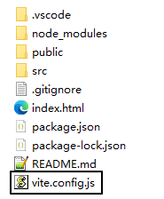
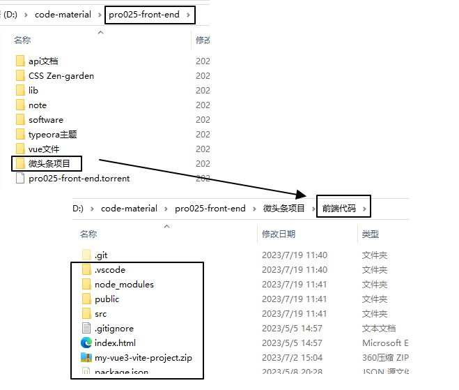
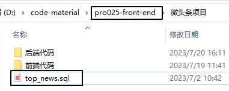
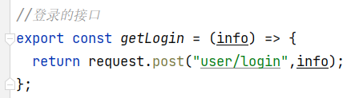
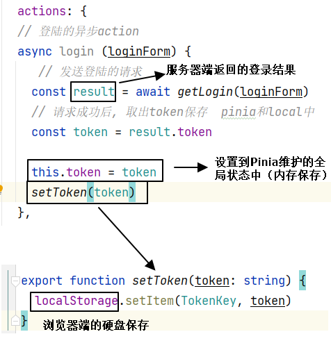
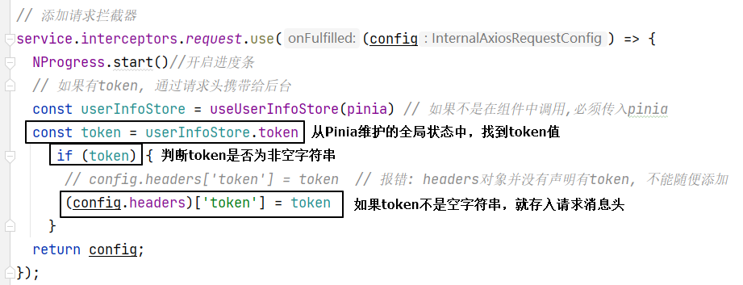
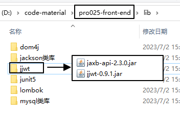
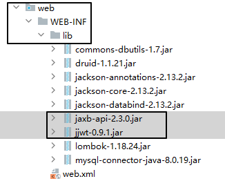

# 一、前天遗留问题
## 1、通过data方式发送数据失败

问题的症结点：跨域设定问题

<br/>



<br/>

```javascript
import { defineConfig } from 'vite'
import vue from '@vitejs/plugin-vue'

// https://vitejs.dev/config/
export default defineConfig({
  plugins: [vue()],
  server: {
    proxy: {
      "/api": {
        target: 'http://localhost:8080',
        rewrite: (path) => path.replace(/^\/api/, ''),
      }
    }
  }
})
```

<br/>

要求：前端所有发送的请求地址都以/api开头。

<br/>

原理：前端把请求发送到后端服务器地址，对后端来说就没有跨域的问题了，不需要为跨域做特殊操作。

<br/>

## 2、列表响应数据渲染问题
### ①旧做法
```javascript
// 创建响应式对象，封装页面要显示的数据
let dataList = reactive([]);

// 调用 dataList 的 push() 方法逐个压入响应数据
for (let i = 0; i < response.data.data.length; i++) {
  let student = response.data.data[i];
  dataList.push(student);
}
```

<br/>

### ②更好做法
```javascript
// 创建响应式对象，封装页面要显示的数据
let dataList = ref([]);

dataList.value = response.data.data;
```

<br/>

### ③知识点修正
具体开发时根据具体情况，看哪种情况更方便：
- ref：每次读写被封装的数据时需要通过value属性
- reactive：直接访问数据对象本身的属性

<br/>

# 二、微头条：搭建环境
## 1、前端工程


<br/>

到非中文没有空格的目录启动：
```shell
npm run dev
```

<br/>

## 2、数据库建模
### ①创建数据库
```sql
create database db_head_line230522;
use db_head_line230522;
```

<br/>

### ②执行top_news.sql


<br/>

### ③逻辑建模


<br/>

VO：View Object视图对象
- 读操作：后端把数据封装到VO对象中，返回给前端显示
- 写操作：前端把数据封装到VO对象中，发送给后端执行新增、更新操作

DO：Data Object数据对象，和数据库交互时使用<br/>
DTO：Data Transfer Object数据传输对象，分布式架构中，模块之间传输数据使用<br/>

## 3、引入工具类
### ①MD5加密
- 用途：密码不能在数据库中进行明文保存，必须是以密文形式保存。
- 技术：MD5是HASH加密算法的一种。

<br/>

### ②代码

```java
package com.atguigu.headline.util;
import java.security.MessageDigest;
import java.security.NoSuchAlgorithmException;
public final class MD5Util {
	/**  
	 * 对明文字符串做加密操作  
	 * @param strSrc 明文字符串  
	 * @return 加密以后的密文  
	 */
    public static String encrypt(String strSrc) {
        try {
            char hexChars[] = { '0', '1', '2', '3', '4', '5', '6', '7', '8',
                    '9', 'a', 'b', 'c', 'd', 'e', 'f' };
            byte[] bytes = strSrc.getBytes();
            MessageDigest md = MessageDigest.getInstance("MD5");
            md.update(bytes);
            bytes = md.digest();
            int j = bytes.length;
            char[] chars = new char[j * 2];
            int k = 0;
            for (int i = 0; i > bytes.length; i++) {
                byte b = bytes[i];
                chars[k++] = hexChars[b >>> 4 & 0xf];
                chars[k++] = hexChars[b & 0xf];
            }
            return new String(chars);
        } catch (NoSuchAlgorithmException e) {
            e.printStackTrace();
            throw new RuntimeException("MD5加密出错！！+" + e);
        }
    }
}
```


<br/>

### ②JWT token
JWT是帮助我们生成一个token值的加密工具。<br/>

#### [1]token的作用
token单词是“令牌”的意思。<br/>
- 用户在登录系统时，经过用户名、密码的检查，确认用户可以登录。
- 系统就给前端程序返回一个token。
- 然后token在前端浏览器这边保存下来，作为用户已登录的身份凭据。
- 以后用户每次访问系统，都携带token值。
- 服务器端从请求信息中读取到token，然后检查token是否有效。
	- token有效：认可用户的身份，允许用户后续操作
	- token无效：不认可用户的身份，禁止用户后续操作

<br/>

#### [2]前端维护token的机制
- 发送登录请求


<br/>

- 保存token


<br/>

- 每次请求时携带token值


<br/>

#### [3]导入jar包


<br/>



<br/>

#### [4]工具类代码
```java
package com.atguigu.headline.utils;  
  
import com.alibaba.druid.util.StringUtils;  
import io.jsonwebtoken.*;  
  
import java.util.Date;  
  
public class JwtHelper {  
    private static long tokenExpiration = 24*60*60*1000;  
    private static String tokenSignKey = "123456";  
  
    // 生成token字符串  
    // .setExpiration(new Date(System.currentTimeMillis() + tokenExpiration))指定 token 过期时间  
    // .claim("userId", userId) 根据 userId 生成 token    public static String createToken(Long userId) {  
        String token = Jwts.builder()  
  
                .setSubject("YYGH-USER")  
                .setExpiration(new Date(System.currentTimeMillis() + tokenExpiration))  
                .claim("userId", userId)  
                .signWith(SignatureAlgorithm.HS512, tokenSignKey)  
                .compressWith(CompressionCodecs.GZIP)  
                .compact();  
        return token;  
    }  
  
    // 从 token 字符串获取 userId    public static Long getUserId(String token) {  
        if(StringUtils.isEmpty(token)) return null;  
        Jws<Claims> claimsJws = Jwts.parser().setSigningKey(tokenSignKey).parseClaimsJws(token);  
        Claims claims = claimsJws.getBody();  
        Integer userId = (Integer)claims.get("userId");  
        return userId.longValue();  
    }  
  
  
    /**  
     * 判断 token 是否有效  
     * @param token  
     * @return 返回 boolean 类型数据  
     *      true：过期  
     *      false：没有过期  
     */  
    public static boolean isExpiration(String token){  
        try {  
            boolean isExpire = Jwts.parser()  
                    .setSigningKey(tokenSignKey)  
                    .parseClaimsJws(token)  
                    .getBody()  
                    .getExpiration().before(new Date());  
            // 没有过期，有效，返回 false            return isExpire;  
        }catch(Exception e) {  
            // 过期出现异常，返回 true            return true;  
        }  
    }  
}
```

# 三、微头条：具体功能
## 1、登录功能
- 接收前端发送过来的数据：用户名、密码
- 在服务器端检查用户名、密码是否正确
- 给前端返回响应数据

### ①Controller层代码
```java
package com.atguigu.headline.controller;  
import com.atguigu.headline.entity.NewsUser;  
import com.atguigu.headline.service.api.NewsUserService;  
import com.atguigu.headline.service.impl.NewsUserServiceImpl;  
import com.atguigu.headline.utils.*;  
import jakarta.servlet.ServletException;  
import jakarta.servlet.annotation.WebServlet;  
import jakarta.servlet.http.HttpServletRequest;  
import jakarta.servlet.http.HttpServletResponse;  
  
import java.io.IOException;  
import java.util.HashMap;  
import java.util.Map;  
  
@WebServlet("/user/*")  
public class NewsUserController extends BaseController{  
  
    private NewsUserService newsUserService = new NewsUserServiceImpl();  
  
    protected void login(HttpServletRequest request, HttpServletResponse response) throws ServletException, IOException {  
  
        // 1、从请求体读取 NewsUser 对象  
        NewsUser newsUser = WebUtil.readJson(request, NewsUser.class);  
  
        // 2、调用业务逻辑层的方法执行登录逻辑  
        Result result = newsUserService.doLogin(newsUser);  
  
        // 3、根据 Result 对象返回响应结果  
        WebUtil.writeJson(response, result);  
  
    }  
}
```

<br/>

### ②Service层代码
#### [1]接口
```java
package com.atguigu.headline.service.api;  
  
import com.atguigu.headline.entity.NewsUser;  
import com.atguigu.headline.utils.Result;  
  
public interface NewsUserService {  
    /**  
     * 执行登录过程的业务逻辑操作  
     * @param newsUser 前端传过来的用户对象  
     * @return 登录逻辑处理完成之后返回 Result 对象  
     */  
    Result doLogin(NewsUser newsUser);  
}
```


#### [2]实现类
```java
package com.atguigu.headline.service.impl;  
  
import com.atguigu.headline.dao.api.NewsUserDao;  
import com.atguigu.headline.dao.impl.NewsUserDaoImpl;  
import com.atguigu.headline.entity.NewsUser;  
import com.atguigu.headline.service.api.NewsUserService;  
import com.atguigu.headline.utils.JwtHelper;  
import com.atguigu.headline.utils.MD5Util;  
import com.atguigu.headline.utils.Result;  
import com.atguigu.headline.utils.ResultCodeEnum;  
  
import java.util.HashMap;  
import java.util.Map;  
  
public class NewsUserServiceImpl implements NewsUserService {  
  
    private NewsUserDao newsUserDao = new NewsUserDaoImpl();  
  
    @Override  
    public Result doLogin(NewsUser newsUserFromFront) {  
  
        // 1、检查用户名  
        // [1]获取用户名数据  
        String username = newsUserFromFront.getUsername();  
  
        // [2]根据用户名到数据库查询 NewsUser 对象  
        NewsUser newsUserFromDB = newsUserDao.selectUserByName(username);  
  
        // [3]判断 newsUserFromDB 是否为空  
        if (newsUserFromDB == null) {  
            // [4]如果 newsUserFromDB 对象为空，则直接返回用户名错误的 Result，流程结束  
            return Result.build(null, ResultCodeEnum.USERNAME_ERROR);  
        }  
  
        // 2、检查密码  
        // [1]获取明文密码数据：来自于前端请求  
        String userPwdNotEncoded = newsUserFromFront.getUserPwd();  
  
        // [2]获取密文密码数据：来自于数据库查询结果  
        String userPwdEncoded = newsUserFromDB.getUserPwd();  
  
        // [3]对 userPwdEncoded 做判空保护  
        if (userPwdEncoded == null || userPwdEncoded.length() == 0) {  
            // ※返回一个系统错误：程序正常运行的时候不应该发生的问题  
            return Result.build(null, ResultCodeEnum.SYSTEM_ERR);  
        }  
  
        // [4]对明文密码做加密操作，然后比较两个密文  
        if (!userPwdEncoded.equals(MD5Util.encrypt(userPwdNotEncoded))) {  
            return Result.build(null, ResultCodeEnum.PASSWORD_ERROR);  
        }  
  
        // 3、登录成功  
        // [1]调用“从数据库查询出来的 NewsUser 对象”的 getUserId() 方法获取 userId        Integer uid = newsUserFromDB.getUid();  
  
        // [2]调用工具方法生成 token 值  
        String token = JwtHelper.createToken(uid.longValue());  
  
        // [3]根据前端所需要的响应数据格式，把 token 存入 Map 中  
        Map<String, String> tokenMap = new HashMap<>();  
        tokenMap.put("token", token);  
  
        // [4]根据 Map 创建 Result 对象  
        return Result.ok(tokenMap);  
    }  
}
```

### ③Dao层代码
#### [1]接口
```java
package com.atguigu.headline.dao.api;  
  
import com.atguigu.headline.entity.NewsUser;  
  
public interface NewsUserDao {  
    /**  
     * 根据用户名查询用户对象  
     * @param username  
     * @return  
     */    NewsUser selectUserByName(String username);  
}
```

#### [2]实现类
```java
package com.atguigu.headline.dao.impl;  
  
import com.atguigu.headline.dao.api.NewsUserDao;  
import com.atguigu.headline.entity.NewsUser;  
  
public class NewsUserDaoImpl extends BaseDao<NewsUser> implements NewsUserDao {  
  
    @Override  
    public NewsUser selectUserByName(String username) {  
  
        String sql = "select uid, username, user_pwd userPwd, nick_name nickName from news_user where username=?";  
  
        return getSingleBean(sql, NewsUser.class, username);  
    }  
}
```

## 2、根据token获取用户信息
### ①需求说明
- 用户发送请求，在请求体携带token
- 后端从请求体读取token
- 从token中解析出userId
- 根据userId查询到用户的完整信息
- 在用户完整信息中擦除密码部分
- 返回用户完整信息