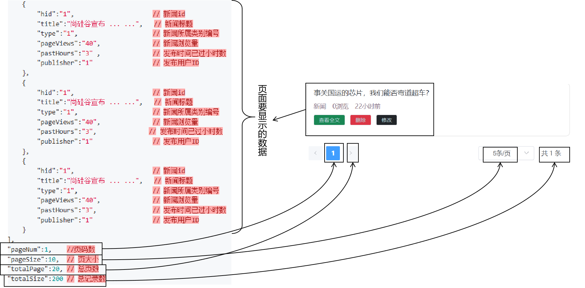

# 一、分页功能
## 1、MySQL分页语法
```sql
# 每页显示5条记录：pageSize  
# 显示第一页：pageNo  
# limit 子句的第一个参数（index）：从0开始  
# 通过罗列一部分数据实际查看发现：  
# pageNo 为 1 的时候：0,5    0*5,5   (1-1)*5,5  
# pageNo 为 2 的时候：5,5    1*5,5   (2-1)*5,5  
# pageNo 为 3 的时候：10,5   2*5,5   (3-1)*5,5  
# 通过 pageNo 计算 index 的公式：(pageNo - 1)*pageSize  
select hid,  
       title,  
       article,  
       type,  
       publisher,  
       page_views,  
       create_time,  
       update_time,  
       is_deleted  
from news_headline  
limit 10, 5;
```

<br/>

## 2、后端需要给前端提供的数据


<br/>

- 页面要显示的数据本身：使用limit查询
- 总记录数：专门写SQL语句查询
- 总页数：需要在Java代码计算

<br/>

## 3、总页数计算
- 总记录数除以pageSize
- 看总记录数对pageSize是否能够整除
	- 能够整除：+0
	- 不能整除：+1

<br/>

## 4、动态查询条件
- 头条分类信息不一定有
	- type：非空并且非零表示用户选择了某一个分类
- 搜索关键词不一定有
	- keyWords：非空字符串时表示用户输入的关键词

<br/>

注意：不仅在查询页面显示数据时要动态添加查询条件，而且查询总记录数也是在指定查询条件下查的。

<br/>

## 5、Dao查询页面要显示数据的方法
### ①接口方法
```java
/**  
 * 对分页要显示数据的查询  
 * @param keyword 搜索关键词  
 * @param type 头条分类  
 * @param pageNum 页码  
 * @param pageSize 每页显示多少条数据  
 * @return  
 */List<NewsHeadline> selectNewsHeadlinePage(String keyword, Integer type, Integer pageNum, Integer pageSize);
```

<br/>

### ②实现方法
```java
@Override  
public List<NewsHeadline> selectNewsHeadlinePage(String keyword, Integer type, Integer pageNum, Integer pageSize) {  
    // 0、创建 List 集合，存放 SQL 语句的参数  
    List<Object> sqlArgList = new ArrayList<>();  
  
    // 1、基础 SQL 语句  
    String sql = "select hid,title,article,type,publisher,page_views pageViews,create_time createTime,update_time updateTime from news_headline where is_deleted=0";  
  
    // 2、判断用户是否输入了搜索关键词  
    if (keyword != null && keyword.length() > 0) {  
        // ❤keyword是非空字符串时在 SQL 语句中附加查询条件  
        sql += " and title like ?";  
  
        // ❤keyword是非空字符串时在最终执行查询时使用的 SQL 参数数组中添加参数  
        // ❤两边加上%实现模糊查询的效果  
        sqlArgList.add("%" + keyword + "%");  
    }  
  
    // 3、判断用户是否输入了头条的类型  
    if (type != null && type != 0) {  
        // ❤type非空非零时在 SQL 语句中附加查询条件  
        sql += " and type = ?";  
  
        // ❤type非空非零时在最终执行查询时使用的 SQL 参数数组中添加参数  
        sqlArgList.add(type);  
    }  
  
    // 4、给 SQL 语句附加 limit 子句部分  
    sql += " limit ?,?";  
    sqlArgList.add((pageNum -1)*pageSize);  
    sqlArgList.add(pageSize);  
  
    // 5、把 SQL 参数的 List 集合转换为数组传递给父类的查询方法  
    return getBeanList(sql, NewsHeadline.class, sqlArgList.toArray());  
}
```

<br/>

## 6、Dao查询总记录数的方法
### ①接口方法
```java
/**  
 * 查询分页时需要使用的总记录数  
 * @param keyword  
 * @param type  
 * @return  
 */int selectNewsHeadlineCount(String keyword, Integer type);
```

<br/>

### ②实现方法
```java
@Override  
public int selectNewsHeadlineCount(String keyword, Integer type) {  
  
    // 0、创建 List 集合，存放 SQL 语句的参数  
    List<Object> sqlArgList = new ArrayList<>();  
  
    // 1、基础 SQL 语句  
    String sql = "select count(*) from news_headline where is_deleted=0";  
  
    // 2、判断用户是否输入了搜索关键词  
    if (keyword != null && keyword.length() > 0) {  
        // ❤keyword是非空字符串时在 SQL 语句中附加查询条件  
        sql += " and title like ?";  
  
        // ❤keyword是非空字符串时在最终执行查询时使用的 SQL 参数数组中添加参数  
        // ❤两边加上%实现模糊查询的效果  
        sqlArgList.add("%" + keyword + "%");  
    }  
  
    // 3、判断用户是否输入了头条的类型  
    if (type != null && type != 0) {  
        // ❤type非空非零时在 SQL 语句中附加查询条件  
        sql += " and type = ?";  
  
        // ❤type非空非零时在最终执行查询时使用的 SQL 参数数组中添加参数  
        sqlArgList.add(type);  
    }  
  
    // 4、调用父类方法执行 SQL 语句  
    Long count = getSingleValue(sql, sqlArgList.toArray());  
  
    return count.intValue();  
}
```

<br/>

## 7、Service方法：汇总分页数据
### ①接口方法
```java
package com.atguigu.headline.service.api;  
  
import com.atguigu.headline.entity.vo.HeadlineQueryVo;  
  
import java.util.Map;  
  
public interface NewsHeadlineService {  
  
    /**  
     * 执行分页操作，封装为 Map 返回  
     * @param headlineQueryVo  
     * @return  
     */    Map<String, Object> getNewsHeadlinePage(HeadlineQueryVo headlineQueryVo);  
  
}
```

<br/>

### ②实现方法
```java
package com.atguigu.headline.service.impl;  
  
import com.atguigu.headline.dao.api.NewsHeadLineDao;  
import com.atguigu.headline.dao.impl.NewsHeadlineDaoImpl;  
import com.atguigu.headline.entity.NewsHeadline;  
import com.atguigu.headline.entity.vo.HeadlineQueryVo;  
import com.atguigu.headline.service.api.NewsHeadlineService;  
  
import java.util.HashMap;  
import java.util.List;  
import java.util.Map;  
  
public class NewsHeadlineServiceImpl implements NewsHeadlineService {  
  
    private NewsHeadLineDao newsHeadLineDao = new NewsHeadlineDaoImpl();  
  
    @Override  
    public Map<String, Object> getNewsHeadlinePage(HeadlineQueryVo headlineQueryVo) {  
  
        // 1、查询页面所需要的数据  
        List<NewsHeadline> newsHeadlineList = newsHeadLineDao.selectNewsHeadlinePage(  
                headlineQueryVo.getKeyWords(),  
                headlineQueryVo.getType(),  
                headlineQueryVo.getPageNum(),  
                headlineQueryVo.getPageSize()  
        );  
  
        // 2、查询总记录数  
        int totalSize = newsHeadLineDao.selectNewsHeadlineCount(headlineQueryVo.getKeyWords(), headlineQueryVo.getType());  
  
        // 3、计算总页数  
        Integer pageSize = headlineQueryVo.getPageSize();  
  
        int totalPage = totalSize / pageSize + ((totalSize % pageSize == 0) ? 0 : 1);  
  
        // 4、组装 Map        Map<String, Object> pageMap = new HashMap<>();  
  
        pageMap.put("pageData", newsHeadlineList);  
        pageMap.put("pageNum", headlineQueryVo.getPageNum());  
        pageMap.put("pageSize", headlineQueryVo.getPageSize());  
        pageMap.put("totalPage", totalPage);  
        pageMap.put("totalSize", totalSize);  
  
        return pageMap;  
    }  
}
```

## 8、Controller方法
```java
package com.atguigu.headline.controller;  
import com.atguigu.headline.entity.NewsType;  
import com.atguigu.headline.entity.vo.HeadlineQueryVo;  
import com.atguigu.headline.service.api.NewsHeadlineService;  
import com.atguigu.headline.service.api.NewsTypeService;  
import com.atguigu.headline.service.impl.NewsHeadlineServiceImpl;  
import com.atguigu.headline.service.impl.NewsTypeServiceImpl;  
import com.atguigu.headline.utils.Result;  
import com.atguigu.headline.utils.WebUtil;  
import jakarta.servlet.ServletException;  
import jakarta.servlet.annotation.WebServlet;  
import jakarta.servlet.http.HttpServletRequest;  
import jakarta.servlet.http.HttpServletResponse;  
  
import java.io.IOException;  
import java.util.HashMap;  
import java.util.List;  
import java.util.Map;  
  
@WebServlet("/portal/*")  
public class PortalController extends BaseController{  
  
    private NewsHeadlineService headlineService = new NewsHeadlineServiceImpl();  
    private NewsTypeService newsTypeService = new NewsTypeServiceImpl();  
      
    protected void findNewsPage(HttpServletRequest request, HttpServletResponse response) throws ServletException, IOException {  
        // 1、读取请求体 JSON 获取前端发送过来的数据  
        HeadlineQueryVo headlineQueryVo = WebUtil.readJson(request, HeadlineQueryVo.class);  
  
        // 2、调用 Service 方法执行分页查询  
        Map<String, Object> pageMap = headlineService.getNewsHeadlinePage(headlineQueryVo);  
  
        // 3、封装 Result 对象  
        Map<String, Map<String, Object>> pageInfoMap = new HashMap<>();  
  
        pageInfoMap.put("pageInfo", pageMap);  
  
        Result<Map<String, Map<String, Object>>> result = Result.ok(pageInfoMap);  
  
        // 4、返回响应  
        WebUtil.writeJson(response, result);  
  
    }  
}
```

<br/>

# 二、显示头条详情

# 三、登录检查

# 四、新增

# 五、删除

# 六、修改

# 七、事务
## 1、概念
在实际开发中，很可能多条SQL语句，构成一个逻辑上的整体。
这个逻辑整体中的SQL语句，要生效就一起生效，有任何一条执行失败，整个逻辑整体都应该撤销。

<br/>

## 2、事务的ACID
- A：原子性 事务作为一个逻辑的整体是不可再分的。整体缺少任何一条SQL语句，逻辑就不成立。
- C：一致性 事务中的多个操作，要生效就一起生效，有任何一条执行失败，整个逻辑整体都应该撤销。
- I：隔离性 事务在并发操作过程中，能够彼此隔离，互不影响。
- D：持久性 事务一旦提交，就在数据库中永久保存，无法再撤销。

<br/>

## 3、事务的并发执行
### ①事务的并发问题
- 脏读：当前事务读取了其它事务尚未提交的修改，其它事务回滚之后，当前事务读取的数据就是错误的。
- 不可重复读：当前事务两次读取同一个数据，但是这两次读取的数据不相同，但数据都是正确的，是其它事务提交了的修改。
- 幻读：当前事务执行过程中，数据库表中的记录增加或减少了。

<br/>

### ②事务的隔离级别
- 读未提交：当前事务可以读取其它事务尚未提交的修改（不能解决任何并发问题）
- 读已提交：当前事务只读取其它事务已经提交的修改（能解决脏读的问题）
- 可重复读：当前事务执行过程中，要求多次读取到的数据都是一样的（能够解决脏读、不可重复读问题）
- 串行化：当前事务执行过程中，整个表不允许其它事务操作（能够解决所有并发问题，但是性能最差）

<br/>

## 4、Java代码中实现事务控制
- 编程式事务：自己写代码实现
- 声明式事务：通过在框架中配置实现

<br/>

```java
try {
	// 1、获取数据库连接
	Connection conn = ...;
	
	// 2、开启事务（关闭事务的自动提交）
	conn.setAutoCommit(false);
	
	// 3、执行SQL语句
	// ...

	// 4、执行成功，提交事务
	conn.commit();
}catch(Exception e){
	// 5、执行失败，回滚事务
	conn.rollBack();
}finally{
	// 6、不管成功还是失败，释放资源……
	// ...
}

```

## 5、事务代码抽取
如果每个需要事务的方法，都单独加事务，那么会造成大量冗余、重复的代码：<br/>

```java
@Override  
public void saveNewsHeadline(NewsHeadline newsHeadline) {  
  
    Connection connection = JDBCUtils.getConnection();  
      
    try {  
        // 1、设置 NewsHeadline 对象的其它属性（前端没有提供的）  
        newsHeadline.setPageViews(0);  
        newsHeadline.setCreateTime(new Date());  
        newsHeadline.setUpdateTime(new Date());  
        newsHeadline.setIsDeleted(0);  
  
        // 2、调用 Dao 方法执行保存  
        newsHeadLineDao.insertNewsHeadline(newsHeadline);  
  
        // 3、保存日志  
        NewsLog newsLog = new NewsLog();  
  
        newsLog.setLogContent("saveNewsHeadline:" + newsHeadline.getTitle() + ":" + newsHeadline.getPublisher());  
  
        logDao.insertLog(newsLog);  
          
        connection.commit();  
    } catch (Exception e) {  
        connection.rollback();  
        throw new RuntimeException(e);  
    } finally {  
        JDBCUtils.releaseConnection(connection);  
    }  
  
}
```

<br/>

为了最大限度减少代码冗余，把事务代码抽取到了Filter：
```java
package com.atguigu.headline.filter;  
  
import com.atguigu.headline.utils.JDBCUtils;  
import jakarta.servlet.FilterChain;  
import jakarta.servlet.ServletException;  
import jakarta.servlet.http.HttpFilter;  
import jakarta.servlet.http.HttpServletRequest;  
import jakarta.servlet.http.HttpServletResponse;  
  
import java.io.IOException;  
import java.sql.Connection;  
import java.sql.SQLException;  
  
public class TransactionFilter extends HttpFilter {  
  
    @Override  
    protected void doFilter(HttpServletRequest request, HttpServletResponse response, FilterChain chain) throws IOException, ServletException {  
        // 1、获取数据库连接  
        Connection connection = JDBCUtils.getConnection();  
  
        try {  
            // 2、开启事务（把事务自动提交关闭）  
            connection.setAutoCommit(false);  
  
            // 3、直接放行  
            chain.doFilter(request, response);  
  
            // 4、提交事务  
            connection.commit();  
  
        } catch (Throwable throwable) {  
  
            // 5、回滚事务  
            try {  
                connection.rollback();  
            } catch (SQLException e) {  
                throw new RuntimeException(e);  
            }  
  
            throw new RuntimeException(throwable);  
        } finally {  
  
            // 6、释放数据库连接  
            JDBCUtils.releaseConnection(connection);  
  
        }  
    }  
}
```

<br/>

但是运行结果发现，事务没有生效。原因是：底层实际执行SQL语句用的并不是TransactionFilter中获取的数据库连接。

<br/>

## 6、统一数据库连接
### ①需求
在一个事务中，执行各个SQL语句时，必须使用同一个数据库连接，事务才能生效。

<br/>

### ②困难
- 最初获取数据库连接：TransactionFilter
- 使用数据库连接：BaseDao
- 通过给方法传参的方式传递数据库连接对象，无法做到

<br/>

### ③解决思路
各个涉及数据库连接的方法虽然不能直接调用的，但是它们都在同一个线程上。
所以我们把数据库连接对象绑定到当前线程即可：
- TransactionFilter：把数据库连接对象绑定到当前线程
- BaseDao：从当前线程获取数据库连接

<br/>

### ④具体实现
重构现有的两个类：
- JDBCUtils
- BaseDao

#### [1]JDBCUtils
- 增加了ThreadLocal：
```java
private static ThreadLocal<Connection> threadLocal = new ThreadLocal<>();

/**  
 * 从数据源中获取数据库连接  
 * @return  
 */public static Connection getConnection() {  
    try {  
  
        // 1、尝试从当前线程获取数据库连接  
        Connection connection = threadLocal.get();  
  
        // 2、判断数据库连接释放为空  
        if (connection == null) {  
            // 3、从数据源中获取数据库连接  
            connection = dataSource.getConnection();  
  
            // 4、绑定到当前线程上  
            threadLocal.set(connection);  
        }  
  
        return connection;  
    } catch (SQLException e) {  
        throw new RuntimeException(e);  
    }  
}

/**  
 * 释放数据库连接，本质上是把数据库连接标记为空闲  
 * @param connection  
 */  
public static void releaseConnection(Connection connection) {  
    try {  
        if (connection != null) {  
            connection.close();  
            threadLocal.remove();  
        }  
    } catch (SQLException e) {  
        throw new RuntimeException(e);  
    }  
}
```

<br/>

#### [2]BaseDao
- 不做关闭数据库连接的操作：
```java
/**  
 * 借助DBUtils实现的查询数据库表，每一条记录封装一个实体类对象，多条记录组成 List 集合  
 * @param sql  
 * @param clazz 当前要查询的实体类对象的 Class 对象  
 * @param params  
 * @return 查询结果组成的 List 集合  
 */  
public List<T> getBeanList(String sql, Class<T> clazz, Object ... params) {  
  
    // 1、获取数据库连接  
    Connection connection = JDBCUtils.getConnection();  
  
    try {  
        // 2、创建 ResultSetHandler 对象  
        ResultSetHandler<List<T>> resultSetHandler = new BeanListHandler(clazz);  
  
        // 3、调用 QueryRunner 方法执行查询操作  
        List<T> beanList = queryRunner.query(connection, sql, resultSetHandler, params);  
  
        return beanList;  
    } catch (SQLException e) {  
        throw new RuntimeException(e);  
    } /*finally {  
  
        // 4、释放资源  
        JDBCUtils.releaseConnection(connection);    
    }*/
}
```

<br/>

体现关闭资源的原则：谁开的谁关。

<br/>

