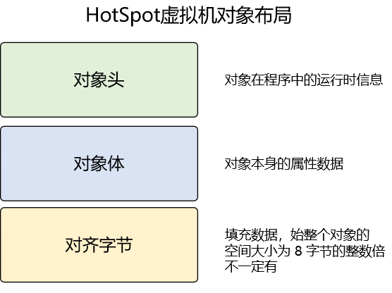
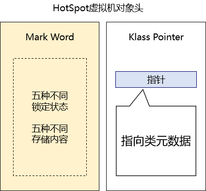
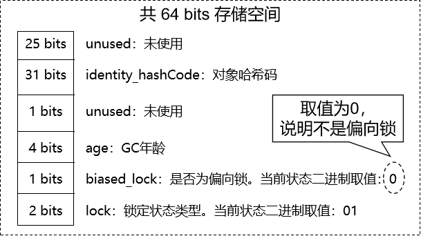
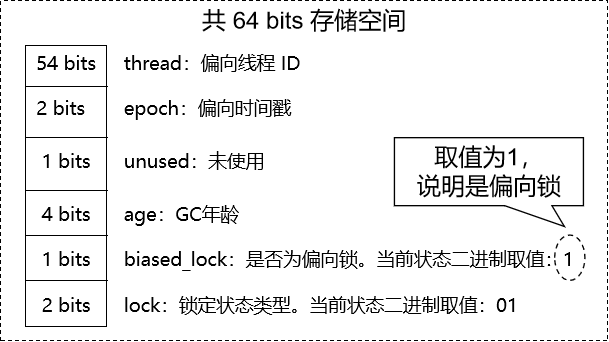
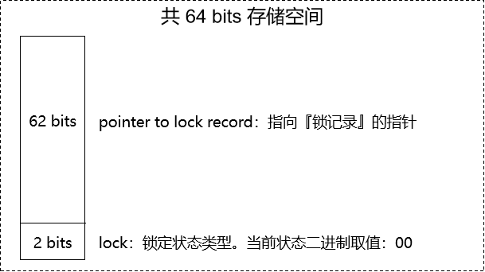
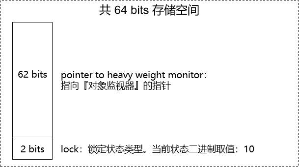
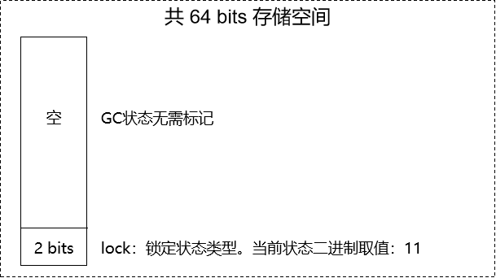
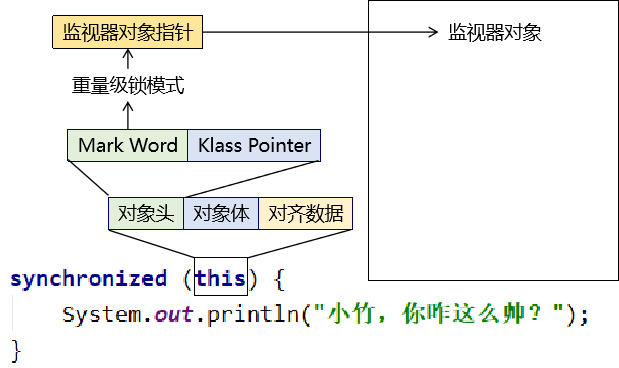
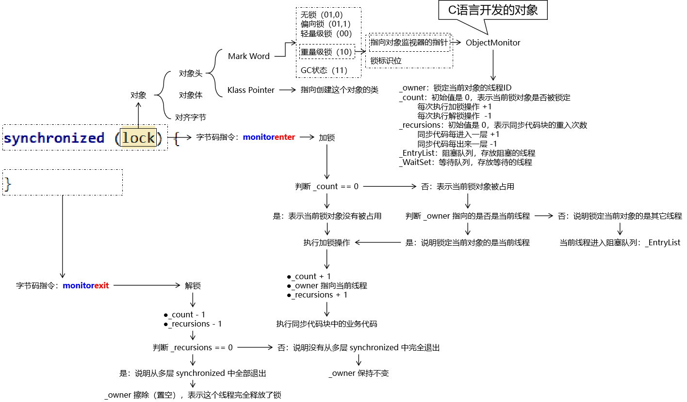

# 一、概述
synchronized 实现加锁、解锁操作的底层逻辑：
- 从前我以为：用钥匙开锁
- 但是实际上：小狗撒尿，哪只小狗留下了痕迹，这块地盘就属于谁
  - 监视器对象：小狗留下痕迹的地方
  - 申请锁的线程：小狗
  - 锁对象：线程通过锁对象找到监视器对象

<br/>

# 二、锁膨胀机制
## 1、初衷
锁膨胀机制是 JDK1.6 引入的，在引入之前，线程申请锁都必须严格执行加锁、解锁这样的操作<br/>

但是其实，如果来申请锁的只有一个线程，那么没必要严格执行加锁、解锁<br/>

因为此时没有竞争，此时不执行加锁、解锁的操作就可以节约操作时间<br/>

## 2、锁膨胀机制的过程
- 无锁状态：没有线程来申请锁
- 偏向锁状态：只有一个线程来申请锁，<span style="color:blue;font-weight:bold;">没有竞争</span>，不需要做加锁、解锁的操作
  - 从无锁状态到当前状态，每次来申请锁的都是这同一个线程，中间没有别的线程来申请过
- 轻量级锁状态：只有一个线程来申请锁，<span style="color:blue;font-weight:bold;">没有竞争</span>，不需要做加锁、解锁的操作
  - 从上一个状态到现在状态，锁对象被不同线程申请过，只不过每次都是只有一个线程来申请
- 重量级锁状态：同时有多个线程来申请锁，<span style="color:blue;font-weight:bold;">有竞争</span>，需要做加锁、解锁的操作

<br/>

## 3、通过程序查看锁膨胀过程
### ①导入依赖
```xml
<dependency>
    <groupId>org.openjdk.jol</groupId>
    <artifactId>jol-core</artifactId>
    <version>0.16</version>
</dependency>
```

<br/>

### ②开启偏向锁功能
```text
-XX:+UseBiasedLocking
-XX:BiasedLockingStartupDelay=0
```

### ③测试代码
```java
// non-biasable：不可偏向，意思是当前 JVM 没有开启偏向锁功能
// biasable：可偏向，意思是当前 JVM 开启了偏向锁功能
// biased：偏向锁
// thin lock：轻量级锁
// fat lock：重量级锁
public class Demo01LockPangPang {

    public static void main(String[] args) throws InterruptedException {

        // 1、创建一个对象作为锁对象
        Object lock = new Object();

        // 2、没有线程申请锁
        System.out.println(ClassLayout.parseInstance(lock).toPrintable());

        // 3、main 线程申请锁
        synchronized (lock) {
            System.out.println(ClassLayout.parseInstance(lock).toPrintable());
        }

        // 4、创建两个线程申请锁
        new Thread(() -> {
            synchronized (lock) {
                while (true) {
                }
            }
        }, "thread-a").start();

        new Thread(() -> {
            synchronized (lock) {
                while (true) {
                }
            }
        }, "thread-b").start();

        TimeUnit.SECONDS.sleep(1);

        System.out.println(ClassLayout.parseInstance(lock).toPrintable());
    }

}
```

<br/>

## 4、锁膨胀不可逆
- 从当前状态不能回到上一个状态
- 但是，如果重量级锁释放之后，又回到没有竞争的状态，那么锁状态也会直接回到最初

<br/>

## 5、锁自旋
### ①发生的场景
在轻量级锁状态下，A 线程正在执行同步代码，B 线程来申请同步锁<br/>
按说这个时候，锁应该升级到重量级锁，但是考虑到升级到重量级锁会导致以后的操作都需要加锁、解锁，所以就考虑能不能再想想办法，能不升级尽量不升<br/>

### ②锁自旋机制
锁对象还是保持在轻量级锁状态下，B 线程不进入阻塞(BLOCKED)，保持在 RUNNABLE 状态执行一些无意义的代码<br/>
B 线程自旋一会儿之后，再看 A 线程是否执行完了同步代码：
- 执行完啦：B 线程去执行同步代码，锁对象仍然保持在轻量级锁状态
- 没执行完：B 线程阻塞，锁对象升级到重量级锁状态

<br/>

### ③自适应自旋
自旋时无意义代码循环执行的次数，参考上一次自旋成功时，循环的次数，以增大自旋成功的几率<br/>

### ④评价
- 自旋成功率高：总体上节约了性能
- 自旋成功率低：自旋操作本身浪费了CPU性能

所以锁自旋机制适合用于同步代码执行时间相对固定的场景

<br/>

## 6、性能验证
```java
private int number = 0;

public synchronized void add() {
    number++;
}

public static void situation1(String[] args) {

    Demo02LockSpeed demo = new Demo02LockSpeed();

    long beginTime = System.currentTimeMillis();

    // 一个线程不加同步锁，执行 1000 万次累加（11ms）
    for (int i = 0; i < 10000000; i++) {
        demo.add();
    }

    long endTime = System.currentTimeMillis();
    long usedTime = endTime - beginTime;
    System.out.println("usedTime = " + usedTime);
}

public static void situation2(String[] args) {
    Demo02LockSpeed demo = new Demo02LockSpeed();

    long beginTime = System.currentTimeMillis();

    // 一个线程加了同步锁，执行 1000 万次累加（364ms）
    for (int i = 0; i < 10000000; i++) {
        demo.add();
    }

    long endTime = System.currentTimeMillis();
    long usedTime = endTime - beginTime;
    System.out.println("usedTime = " + usedTime);
}

public static void main(String[] args) {
    Demo02LockSpeed demo = new Demo02LockSpeed();

    // 两个个线程加了同步锁，各自执行 1000 万次累加（404ms、424ms）
    new Thread(()->{
        long beginTime = System.currentTimeMillis();

        for (int i = 0; i < 10000000; i++) {
            demo.add();
        }

        long endTime = System.currentTimeMillis();
        long usedTime = endTime - beginTime;
        System.out.println("usedTime = " + usedTime);
    }, "thread-a").start();

    new Thread(()->{
        long beginTime = System.currentTimeMillis();

        for (int i = 0; i < 10000000; i++) {
            demo.add();
        }

        long endTime = System.currentTimeMillis();
        long usedTime = endTime - beginTime;
        System.out.println("usedTime = " + usedTime);
    }, "thread-b").start();
}
```

<br/>

# 三、对象存储结构
为了了解从锁对象出发，是如何一步一步找到监视器对象的，所以来学习对象存储结构<br/>

## 1、总体结构
现在我们都知道了对象（包括数组）都是放在堆内存中，那么对象在堆内存中保存时的数据结构是什么样子的呢？<br/>



### ①对象头
- 非数组对象
  - Mark Word
  - 类型指针
- 数组
  - Mark Word
  - 类型指针
  - 数组长度



<br/>

### ②对象体
这一部分也称为：实例数据。也就是对象中实际包含的属性数据。

### ③对齐字节
为了寻址方便，JVM 要求每一个对象起始地址必须是 8 字节的整数倍，也就是要求每一个对象的存储空间都是 8 字节的整数倍。所以对于占空间不满足这一要求的对象会进行填充。所以这一部分是不一定存在的。

## 2、Mark Word
Mark Word 部分用于存储对象自身运行时数据，如哈希码、GC分代年龄等，这部分数据的长度在 32 位和 64 位的虚拟机中分别为 32 位和 64 位。<br/>
由于对象头的信息是与对象自身定义的数据没有关系的额外存储成本，因此考虑到 JVM 的空间效率，Mark Word 被设计成为一个非固定的数据结构，<br/>
以便存储更多有效的数据，它会根据对象本身的状态复用自己的存储空间。<br/>
在 Mark Word 各种状态下的数据结构中，我们首先要关注一个数据：锁标识位。下面表格需要大家记住：<br/>

|锁标识位数值|是否偏向| 锁标识位含义 |
|---|---|--------|
|01|0| 无锁状态   |
|01|1| 偏向锁状态  |
|00|——| 轻量级锁状态 |
|10|——| 重量级锁状态 |
|11|——| GC状态   |

> Mark Word 的存储结构对应五种状态。同一时刻它只可能是五种状态中的其中一种，所以没有必要把 Mark Word 分成五份儿分别保存这五种状态。<br/>
> Mark Word 在每一个时刻只需要保存当前状态的数据即可。<br/>
> 每一种状态保存的数据结构不同。

所以 Mark Word 这同一块存储空间，在不同的状态下，有不同数据结构。

### ①无锁状态



<br/>

### ②偏向锁状态



<br/>

### ③轻量级锁状态



<br/>

### ④重量级锁状态

这里我们看到了下一个非常重要的数据：指向对象监视器的指针。当前对象是由哪一个线程所锁定就是由这个对象监视器来记录的。



<br/>

### ⑤GC 状态



## 3、监视器对象
监视器对象是 C/C++ 开发的，Java 环境下看不到，类名称是：ObjectMonitor 
```C
ObjectMonitor() {
    _header       = NULL;
    _count        = 0;  // 锁计数器
    _waiters      = 0;
    _recursions   = 0; // 锁的重入次数
    _object       = NULL;
    _owner        = NULL; // 指向持有 ObjectMonitor 对象的线程
    _WaitSet      = NULL; // 处于 wait 状态的线程，会被加入到 _WaitSet（等待队列）
    _WaitSetLock  = 0 ;
    _Responsible  = NULL ;
    _succ         = NULL ;
    _cxq          = NULL ;
    FreeNext      = NULL ;
    _EntryList    = NULL ; // 处于等待锁 block 状态的线程，会被加入到该列表（阻塞队列）
    _SpinFreq     = 0 ;
    _SpinClock    = 0 ;
    OwnerIsThread = 0 ;
  }
```

锁对象和监视器对象的关系：<br/>



# 四、锁重入机制
## 1、概念
同步锁发生了多层的嵌套：<br/>

```java
synchroinized (this) {
    synchroinized (this) {
    
    }
}
```

<br/>

## 2、举例证明存在的意义
```java
public void method01() {
    // 包含同步代码块的方法调用另一个包含同步代码块的方法，导致同步代码块简介嵌套
    synchronized (this) {
        method02();
    }
}

public void method02() {
    synchronized (this) {
        // 如果根据业务的需要，当前方法确实需要加 synchronized，那么就不应该去掉
        // 因为外界调用当前方法未必会提供 synchronized 保证
    }
}

public void method03() {
    method02();
}
```

## 3、为什么要支持锁重入？
同一个线程，在外层synchronized得到锁之后，执行同步代码的过程中，又遇到了同一个锁对象的synchronized，<br/>
此时系统必须允许这个线程继续得到锁，否则程序无法继续执行

<br/>

# 五、synchronized 字节码指令
## 1、Java 代码
```java
public class Demo04SyncByteCode {
    public static void main(String[] args) {
        synchronized (Demo04SyncByteCode.class){

        }
    }
}
```

<br/>

## 2、执行字节码指令分析
```shell
# 进入字节码文件所在目录，运行下面命令：
javap -c 字节码文件文件名
```

<br/>

## 3、结论
- 加锁操作对应的字节码指令：monitorenter
- 解锁操在对应的字节码指令：monitorexit

<br/>

# 六、加锁解锁流程
