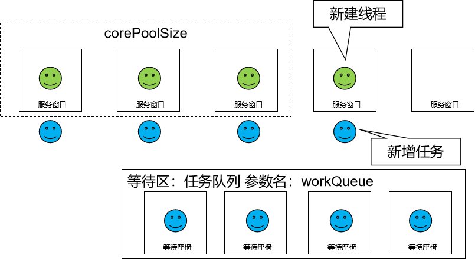

# 一、概述
## 1、线程池的意义
复用：让线程对象能够实现复用
- 不必反复执行线程对象的创建
- 不必反复执行线程对象的GC回收

管理：避免无度、过多创建线程对象

<br/>

## 2、大致结构
- 等待队列：有现在来不及处理的任务，就存放到这个等待队列中，将来有空闲的线程就到这里提取任务执行
- 核心线程
- 非核心线程
- 拒绝策略

<br/>

## 3、创建线程池对象
创建线程池对象不要使用 Executors 工具类，而应该自己创建 ThreadPoolExecutor 类的对象，使用它七个参数的构造器：
```java
public ThreadPoolExecutor(int corePoolSize,
                          int maximumPoolSize,
                          long keepAliveTime,
                          TimeUnit unit,
                          BlockingQueue<Runnable> workQueue,
                          ThreadFactory threadFactory,
                          RejectedExecutionHandler handler) {
    if (corePoolSize < 0 ||
        maximumPoolSize <= 0 ||
        maximumPoolSize < corePoolSize ||
        keepAliveTime < 0)
        throw new IllegalArgumentException();
    if (workQueue == null || threadFactory == null || handler == null)
        throw new NullPointerException();
    this.corePoolSize = corePoolSize;
    this.maximumPoolSize = maximumPoolSize;
    this.workQueue = workQueue;
    this.keepAliveTime = unit.toNanos(keepAliveTime);
    this.threadFactory = threadFactory;
    this.handler = handler;
}
```

<br/>

## 4、七个参数各自的含义
- int corePoolSize 核心线程的数量
- int maximumPoolSize 最大线程数
- long keepAliveTime 非核心线程的最大空闲时间的数量（核心线程之外的线程，这些线程对象空闲时间达到keepAliveTime指定的值就会被释放）
- TimeUnit unit 非核心线程的最大空闲时间的单位
- BlockingQueue\<Runnable\> workQueue 等待队列
- ThreadFactory threadFactory 创建线程对象的工厂
- RejectedExecutionHandler handler 某一个具体的拒绝策略

# 二、工作机制
重要的事情说三遍——以下重要！以下重要！以下重要！我们对照的模型就是去银行网点办理业务，如果窗口所有工作人员都在忙碌，我们需要等叫号。那么线程池中和这个模型一致的就按照生活中的经验来理解和记忆即可。有和生活中不一样的地方，会标【**反直觉**】，请大家留意！

❤【**反直觉**】刚创建线程池时，线程池中的线程数为零。<br/>


<br/>

❤当调用execute()方法添加一个请求任务时，线程池会做出如下判断：<br/>
❤如果正在运行的线程数量小于corePoolSize，那么马上创建线程运行这个任务；<br/>


<br/>


<br/>

❤【反直觉】如果正在运行的线程数量大于或等于corePoolSize，那么将这个任务放入队列；<br/>


<br/>


<br/>

❤【反直觉】如果这个时候队列满了且正在运行的线程数量还小于maximumPoolSize，那么还是要创建非核心线程立刻运行这个新增的任务而不是等待时间最长的任务；<br/>



<br/>

❤如果队列满了且正在运行的线程数量大于或等于maximumPoolSize，那么线程池会启动饱和拒绝策略来执行。<br/>


❤当一个线程完成任务时，它会从队列中取下一个任务来执行。<br/>


<br/>

❤当一个线程空闲的时间超过keepAliveTime时，线程池会判断：<br/>
❤当前运行线程数大于corePoolSize：空闲时间超时线程会被停掉<br/>


<br/>

❤当前运行线程数小于等于corePoolSize：无动作（所以线程池的所有任务完成后，它最终会收缩到corePoolSize的大小。）<br/>


<br/>

# 三、阻塞队列
## 1、顶层接口
java.util.concurrent.BlockingQueue

## 2、主要特征
- take()：在队列为空时，可以在阻塞状态中等待，直到队列中有了元素
- put()：在队列满时，可以在阻塞状态中等待，直到队列中有了空位置

## 3、体验
```java
// 1、指定阻塞队列的容量
int capacity = 3;

// 2、创建阻塞队列
BlockingQueue<String> breadShop = new ArrayBlockingQueue<>(capacity);

// 3、调用 take() 方法查看阻塞状态
// System.out.println("顾客前来购买面包：");
// String bread = breadShop.take();
// System.out.println("bread = " + bread);

// 4、给阻塞队列中添加元素
System.out.println("面包 1 烤好了~");
breadShop.put("bread01");

System.out.println("面包 2 烤好了~");
breadShop.put("bread02");

System.out.println("面包 3 烤好了~");
breadShop.put("bread03");

// 5、阻塞队列满了，调用 put() 方法查看阻塞状态
System.out.println("面包 4 烤好了~");
breadShop.put("bread04");
System.out.println("面包 4 存入了~");
```

# 四、创建线程池并测试拒绝策略
```java
// 1、准备创建线程池所需的数据
// 核心线程数
int corePoolSize = 3;

// 最大线程数
int maximumPoolSize = 5;

// 最大空闲时间的数量
long keepAliveTime = 5;

// 最大空闲时间的单位
TimeUnit unit = TimeUnit.SECONDS;

// 阻塞队列的容量
int capacity = 5;

// 阻塞队列
BlockingQueue<Runnable> workQueue = new ArrayBlockingQueue<>(capacity);

// 创建线程对象的工厂
ThreadFactory threadFactory = Executors.defaultThreadFactory();

// 指定一个具体的拒绝策略
// AbortPolicy：任务满了之后，通过抛异常的方式表示拒绝
// CallerRunsPolicy：任务满了之后，把新增的任务返还给调用者
// DiscardPolicy：任务满了之后，随机丢弃某个任务
// DiscardOldestPolicy：任务满了之后，丢弃等待时间最长的任务
RejectedExecutionHandler handler =
        // new ThreadPoolExecutor.AbortPolicy();
        // new ThreadPoolExecutor.CallerRunsPolicy();
        // new ThreadPoolExecutor.DiscardPolicy();
        new ThreadPoolExecutor.DiscardOldestPolicy();

// 2、创建线程池对象
ThreadPoolExecutor threadPoolExecutor = new ThreadPoolExecutor(
        corePoolSize,
        maximumPoolSize,
        keepAliveTime,
        unit,
        workQueue,
        threadFactory,
        handler);

// 3、给线程池分配任务
while (true) {
    threadPoolExecutor.submit(()->{
        while (true) {
            System.out.println(Thread.currentThread().getName() + " is working ...");
            TimeUnit.SECONDS.sleep(1);
        }
    });
    TimeUnit.SECONDS.sleep(1);
}
```

<br/>

# 五、开发时线程池参数设置的建议
- 核心线程数和最大线程数设置成一样的，避免非核心线程反复创建、释放
- 核心线程数参考CPU的核心数量，最好是CPU核心数量的整数倍