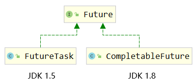

# 一、Future接口的局限性

从实现类的版本情况能看出，CompletableFuture是FutureTask的升级版：<br/>



<br/>

## 1、Future接口回顾

java.util.concurrent.Future\<V\>

|方法名| 功能                                                                       |
|---|--------------------------------------------------------------------------|
|V get()| 调用get()方法获取任务结果，但是会阻塞当前线程，直到目标任务返回                                       |
|V get(timeout)| 调用get()方法获取任务结果，同样会阻塞当前线程，但是如果超过预设时间则放弃获取                                |
|boolean isDone()| 判断目标任务是否完成<br/>返回true：目标任务完成<br/>返回false：目标任务未完成<br/>注：正常完成、被取消、抛异常结束都算完成        |
|boolean cancel(boolean mayInterruptIfRunning)| 尝试取消当前任务。<br/>如果当前任务已经结束或被取消或由于某些原因无法取消，则取消失败。<br/>返回true：取消成功<br/>返回false：取消失败，无法取消 |
|boolean isCancelled()| 判断当前任务是否被取消<br/>返回true：已取消<br/>返回false：未取消                                       |

<br/>

## 2、局限性

### ①任务结果获取方式

在Future接口下，我们只能通过调用get()方法来获取任务计算结果，但是只要目标任务没有执行完，get()
方法会被阻塞——阻塞方式又回到了同步调用，这就和异步操作的初衷相违背了。

```Java
Callable<String> callable=()->{

        // 睡 10 秒
        TimeUnit.SECONDS.sleep(10);
        return"task result";
        };

        FutureTask<String> futureTask=new FutureTask<>(callable);

        new Thread(futureTask).start();

// 阻塞 10 秒
        String taskResult=futureTask.get();
        System.out.println("taskResult = "+taskResult);
```

> 我们的理想状态是使用观察者模式，当计算结果完成的时候通知监听者，采用回调的方式实现异步编程。
> 那什么是回调呢？
> 就是我们声明方法，由系统在适当的时机调用这个方法。
> CompletableFuture的whenComplete()就是这样一个方法。

<br/>

### ②取消任务之后的兜底值

调用Future接口的cancel()
方法可以取消当前任务，但是取消之后呢？期待任务结果的线程无法拿到一个兜底值，代码不够优雅、流畅。而CompletableFuture的complete()
方法不仅能够强制结束某个任务，而且还能够传入一个和原来任务结果类型一致的数据作为任务结果，起到一个**兜底值**
的作用。这一做法**和SpringCloud中熔断、降级的思路一致**。<br/>

```Java
// 1、在 Callable 接口类型的对象中封装线程要执行的任务
Callable<String> callable=()->{

        TimeUnit.MINUTES.sleep(10);

        return"task result";
        };

// 2、创建 FutureTask 对象封装线程任务
        FutureTask<String> futureTask=new FutureTask<>(callable);

// 3、启动线程执行 FutureTask 封装的任务
        new Thread(futureTask,"thread-a").start();

// 4、让主线程等待一段时间
        TimeUnit.SECONDS.sleep(5);

// 5、等待一段时间后，我们自己手动取消这个任务
        boolean isCanceled=futureTask.cancel(true);
        System.out.println("isCanceled = "+isCanceled);

// 6、把任务执行取消之后，再调用 get() 方法
        String taskResult=futureTask.get();
        System.out.println("taskResult = "+taskResult);
```

上面代码执行的结果：

> isCanceled = true
> Exception in thread "main" **java.util.concurrent.CancellationException**
> at java.util.concurrent.FutureTask.report(FutureTask.java:121)
> at java.util.concurrent.FutureTask.get(FutureTask.java:192)
> at com.atguigu.juc.day05.Demo04FutureCancel.main(Demo04FutureCancel.java:38)

<br/>

### ③Future接口和线程池的关系

Future接口可以配合线程池使用，但是并没有限定说“必须使用”。<br/>

但是CompletableFuture本身就内置了线程池，而且支持传入一个自定义线程池，这么看来：CompletableFuture和线程池结合的更紧密。可以说CompletableFuture会要求程序员必须使用线程池。<br/>

而基于线程池创建线程是实际开发过程中的一个非常好的实践。不基于线程池，自己创建线程是没有约束机制的，有可能造成线程创建太多且没有复用效果。

<br/>

## 3、CompletableFuture的改进

CompletableFuture相比较于Callable+FutureTask组合、相比较于Future接口定义的基础功能确实做了诸多改进：

- 支持异步回调
- 手动完成任务并返回兜底值
- 支持进一步的非阻塞调用
- 支持链式调用
- 支持多任务合并
- 支持异常处理

<br/>

# 二、CompletableFuture初体验

## 1、提供线程池对象的工具方法

CompletableFuture对象在工作时可以使用自己内置的线程池（Fork Join
Pool），但是最好还是使用我们自己自定义的线程池，因为这样一来，线程池工作时使用的各个参数就可以由我们自己指定了

```java
package com.atguigu.juc.utls;

import java.util.concurrent.*;

public class ThreadPoolProvider {

    private static ExecutorService threadPool;

    static {
        // 1、准备创建线程池所需的数据
        // 核心线程数
        int corePoolSize = 3;

        // 最大线程数
        int maximumPoolSize = 5;

        // 最大空闲时间的数量
        long keepAliveTime = 5;

        // 最大空闲时间的单位
        TimeUnit unit = TimeUnit.SECONDS;

        // 阻塞队列的容量
        int capacity = 5;

        // 阻塞队列
        BlockingQueue<Runnable> workQueue = new ArrayBlockingQueue<>(capacity);

        // 创建线程对象的工厂
        ThreadFactory threadFactory = Executors.defaultThreadFactory();

        // 指定一个具体的拒绝策略
        // AbortPolicy：任务满了之后，通过抛异常的方式表示拒绝
        // CallerRunsPolicy：任务满了之后，把新增的任务返还给调用者
        // DiscardPolicy：任务满了之后，随机丢弃某个任务
        // DiscardOldestPolicy：任务满了之后，丢弃等待时间最长的任务
        RejectedExecutionHandler handler =
                // new ThreadPoolExecutor.AbortPolicy();
                // new ThreadPoolExecutor.CallerRunsPolicy();
                // new ThreadPoolExecutor.DiscardPolicy();
                new ThreadPoolExecutor.DiscardOldestPolicy();

        // 2、创建线程池对象
        threadPool = new ThreadPoolExecutor(
                corePoolSize,
                maximumPoolSize,
                keepAliveTime,
                unit,
                workQueue,
                threadFactory,
                handler);
    }

    public static ExecutorService getThreadPool() {
        return threadPool;
    }
}
```

<br/>

## 2、设定并执行异步任务

```java
// 1、获取线程池对象
ExecutorService threadPool=ThreadPoolProvider.getThreadPool();

// 2、调用 CompletableFuture 的静态方法指定新线程中要执行的任务
// runAsync(Runnable 类型对象封装线程中要执行的任务, 线程池对象)
        CompletableFuture.runAsync(()->{
        while(true){
        try{TimeUnit.SECONDS.sleep(1);}catch(InterruptedException e){throw new RuntimeException(e);}

        System.out.println(Thread.currentThread().getName()+" is working ...");
        }
        },threadPool);
```

<br/>

# 三、获取任务返回值

## 1、带返回值的任务

```java
ExecutorService threadPool=ThreadPoolProvider.getThreadPool();

// 封装有返回值的任务，调用 supplyAsync() 方法
CompletableFuture<String> future=CompletableFuture.supplyAsync(()->{
    System.out.println(Thread.currentThread().getName()+" 线程执行了~");
    return"hello CompletableFuture ...";
},threadPool);
```

<br/>

## 2、同步方式获取任务结果
```java
// 获取任务返回值，方式一：调用 get() 方法（同步操作）
String taskResult = future.get();
System.out.println("taskResult = " + taskResult);
```

<br/>

## 3、异步回调的方式获取任务结果
```java
// 获取任务返回值，方式二：调用 whenComplete() 方法（异步操作）
future.whenComplete((String taskResult, Throwable throwable) -> {
    System.out.println(Thread.currentThread().getName() + " 任务执行的结果：" + taskResult);
    System.out.println(Thread.currentThread().getName() + " 任务抛出的异常：" + throwable);
});
```

<br/>

## 4、异步回调
- 异步：体现在使用main之外的其它线程调用回调函数
- 回调：体现在我们自己声明的方法，由系统来调用，系统是在对应的事件触发之后，调用函数

|地雷|回调函数|
|---|---|
|埋地雷|whenComplete() 参数传入回调函数，相当于和事件进行了绑定|
|埋地雷的地方|future 对象|
|触发地雷的引信|触发了回调函数绑定的事件|
|地雷爆炸|回调函数执行|

<br/>

> 基本上我们可以断言：但凡是由特定事件触发的代码执行，都会使用异步回调机制<br/>
> 异步：因为我们不知道事件什么时候触发，所以不能把当前线程（通常是处理请求的线程）阻塞<br/>
> 回调：肯定需要把事件触发之后要执行的操作封装到某个函数中，系统检测到事件发生，然后调用我们这个函数

<br/>

# 四、任务接续
## 1、任务没有返回值
```java
// thenRun() 执行多个任务使用同一个线程
// pool-1-thread-1 is working. Task 01
// pool-1-thread-1 is working. Task 02
// pool-1-thread-1 is working. Task 03
// thenRunAsync() 执行多个任务不局限在同一个线程，但仍然保证前面任务结束了再执行后面的
// pool-1-thread-1 is working. Task 01
// pool-1-thread-2 is working. Task 02
// pool-1-thread-3 is working. Task 03

CompletableFuture.runAsync(()->{
    System.out.println(Thread.currentThread().getName() + " is working. Task 01");
}, threadPool).thenRunAsync(()->{
    while(true) {
        try {TimeUnit.SECONDS.sleep(1);} catch (InterruptedException e) {throw new RuntimeException(e);}
        System.out.println(Thread.currentThread().getName() + " is working. Task 02");
    }
}, threadPool).thenRunAsync(()->{
    while(true) {
        try {TimeUnit.SECONDS.sleep(1);} catch (InterruptedException e) {throw new RuntimeException(e);}
        System.out.println(Thread.currentThread().getName() + " is working. Task 03");
    }
}, threadPool);
```

<br/>

## 2、任务有返回值
```java
ExecutorService threadPool = ThreadPoolProvider.getThreadPool();

// thenApply() 参数中设置的回调函数：接收前面任务的执行结果，自己也可以有执行结果
// thenApplyAsync() 参数中设置的回调函数：以异步方式执行，各个任务不局限在一个线程内
// 如果前面任务有返回值，但后续调用 thenRun()，那么过程中的任务结果就丢失了

CompletableFuture<Integer> completableFuture = CompletableFuture
        .supplyAsync(() -> "task 01 result", threadPool)
        .thenApply(prevTaskResult -> {
            System.out.println("prevTaskResult = " + prevTaskResult);

            return 10000;
        });

Integer taskResult = completableFuture.get();
System.out.println("taskResult = " + taskResult);
```

<br/>

# 五、任务异常处理
## 1、exceptionally()
```java
ExecutorService threadPool = ThreadPoolProvider.getThreadPool();

// exceptionally() 函数中指定的回调函数：
//  1、如果前面操作没有抛出异常，那么不执行
//  2、如果前面操作抛出了异常，那么回调函数执行并且接收异常对象
//  3、回调函数被要求和前面任务返回相同类型的数据，相当于起到兜底值作用

String taskFinalResult = CompletableFuture
        .supplyAsync(() -> {
            // System.out.println(10 / 0);
            return "Task Normal Result";
        }, threadPool)
        .exceptionally(throwable -> {
            // throwable 接收前面任务执行过程中抛出的异常
            System.out.println("前面任务出故障了：" + throwable);

            // 返回值的类型必须和前面任务返回值的类型一致
            return "Task Exceptionally Result";
        }).get();

System.out.println("taskFinalResult = " + taskFinalResult);
```

<br/>

## 2、handle()方法
```java
ExecutorService threadPool = ThreadPoolProvider.getThreadPool();

String taskFinalResult = CompletableFuture
        .supplyAsync(() -> {
            System.out.println(10 / 0);
            return "Task Normal Result";
        }, threadPool)
        .handle((String prevTaskResult, Throwable throwable) -> {

            // 回调函数：不管前面任务是否抛异常，都会执行
            // 前面任务顺利执行完，接收前面任务执行的结果
            // 前面任务抛异常，接收异常对象
            // prevTaskResult：前一个任务执行的结果
            // throwable：前面任务抛出的异常
            System.out.println("prevTaskResult = " + prevTaskResult);
            System.out.println("throwable = " + throwable);

            // 回调函数也可以返回一个结果
            return "Task Handle Result";
        }).get();

System.out.println("taskFinalResult = " + taskFinalResult);
```

<br/>

# 六、任务汇总
## 1、allOf()
```java
ExecutorService threadPool = ThreadPoolProvider.getThreadPool();

CompletableFuture<String> future01 = CompletableFuture.supplyAsync(() -> {
    System.out.println("task 01 begin ...");
    try {
        TimeUnit.SECONDS.sleep(2);
    } catch (InterruptedException e) {
        throw new RuntimeException(e);
    }
    System.out.println("task 01 end ...");

    return "task 01 result";
}, threadPool);

CompletableFuture<String> future02 = CompletableFuture.supplyAsync(() -> {
    System.out.println("task 02 begin ...");
    try {
        TimeUnit.SECONDS.sleep(4);
    } catch (InterruptedException e) {
        throw new RuntimeException(e);
    }
    System.out.println("task 02 end ...");

    return "task 02 result";
}, threadPool);

CompletableFuture<String> future03 = CompletableFuture.supplyAsync(() -> {
    System.out.println("task 03 begin ...");
    try {
        TimeUnit.SECONDS.sleep(6);
    } catch (InterruptedException e) {
        throw new RuntimeException(e);
    }
    System.out.println("task 03 end ...");

    return "task 03 result";
}, threadPool);

// allOf() 方法汇总多个任务，并且返回一个 CompletableFuture 对象
// 汇总的效果：参与汇总的多个任务全部结束，总任务才会触发任务完成事件
CompletableFuture<Void> summaryFuture = CompletableFuture.allOf(future01, future02, future03);
summaryFuture.whenComplete((Void value, Throwable throwable)->{
    System.out.println("汇总任务报告：前面三个任务都执行完啦！！！");
});

// 如果需要获取各个任务自己的执行结果，那么就单独调用它们的 get() 方法
String task01Result = future01.get();
System.out.println("task01Result = " + task01Result);

String task02Result = future02.get();
System.out.println("task02Result = " + task02Result);

String task03Result = future03.get();
System.out.println("task03Result = " + task03Result);
```

<br/>

## 2、anyOf()
```java
ExecutorService threadPool = ThreadPoolProvider.getThreadPool();

CompletableFuture<String> future01 = CompletableFuture.supplyAsync(() -> {
    System.out.println("task 01 begin ...");
    try {
        TimeUnit.SECONDS.sleep(2);
    } catch (InterruptedException e) {
        throw new RuntimeException(e);
    }
    System.out.println("task 01 end ...");

    return "task 01 result";
}, threadPool);

CompletableFuture<String> future02 = CompletableFuture.supplyAsync(() -> {
    System.out.println("task 02 begin ...");
    try {
        TimeUnit.SECONDS.sleep(4);
    } catch (InterruptedException e) {
        throw new RuntimeException(e);
    }
    System.out.println("task 02 end ...");

    return "task 02 result";
}, threadPool);

CompletableFuture<String> future03 = CompletableFuture.supplyAsync(() -> {
    System.out.println("task 03 begin ...");
    try {
        TimeUnit.SECONDS.sleep(6);
    } catch (InterruptedException e) {
        throw new RuntimeException(e);
    }
    System.out.println("task 03 end ...");

    return "task 03 result";
}, threadPool);

// 汇总多个任务，有任何一个完成，总任务就算完成
CompletableFuture<Object> completableFuture = CompletableFuture.anyOf(future01, future02, future03);

completableFuture.whenComplete((Object taskResult, Throwable throwable)->{
    System.out.println("汇总任务报告：有一个任务完成了！结果是：" + taskResult);
});

// 如果需要获取各个任务自己的执行结果，那么就单独调用它们的 get() 方法
String task01Result = future01.get();
System.out.println("task01Result = " + task01Result);

String task02Result = future02.get();
System.out.println("task02Result = " + task02Result);

String task03Result = future03.get();
System.out.println("task03Result = " + task03Result);
```

# 总结


