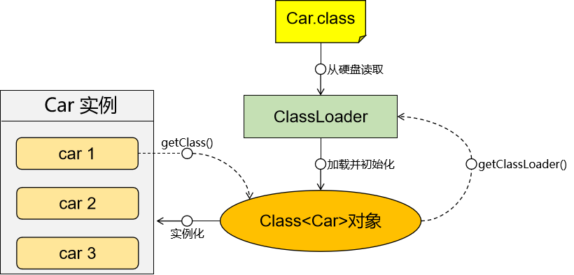
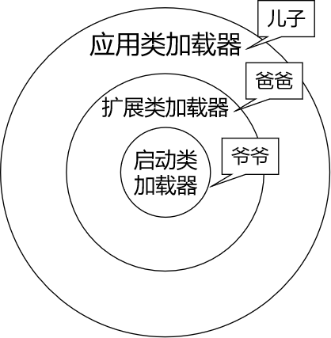

# 一、类加载器
## 1、JDK1.8 类加载器
- 启动类加载器：负责加载JRE的核心类
- 扩展类加载器：负责加载JRE核心扩展的目录
- 应用类加载器：负责加载程序员开发的应用程序和引入第三方jar包
- 自定义类加载器：允许开发人员继承ClassLoader编写自定义的类加载逻辑

<br/>



<br/>

- 类加载器子系统负责从文件系统或者网络中加载*.class字节码文件
- 字节码文件开头必须有特定的文件标识

  如果使用二进制文件查看工具打开Java编译得到的字节码文件，会发现，文件开头是：CA FE BA BE

  它们都是十六进制数的符号。
- ClassLoader只负责字节码文件的加载，至于它是否可以运行，则由Execution Engine执行引擎决定的
- 加载的类信息存放于一块称为**方法区**的内存空间。除了类的信息外，方法区中还会存放运行时常量池信息，可能还包括字符串字面量和数字字面量（这部分常量信息是字节码文件中常量池部分的内存映射）

<br/>

|中文名称|英文名称|说明| 加载范围                                                                                              |
|---|---|---|---------------------------------------------------------------------------------------------------|
|启动类加载器|Bootstrap|C++ 语言编写，不是 ClassLoader 子类，Java 中为 null| $JAVA_HOME/jre/lib/rt.jar                                                                         |
|扩展类加载器|Extension|sun.misc.Launcher.ExtClassLoader| $JAVA_HOME/jre/lib/*.jar -Djava.ext.dirs 参数指定目录下的 jar 包 $JAVA_HOME/jre/lib/ext/classes 目录下的 class |
|应用类加载器|AppClassLoader|sun.misc.Launcher.AppClassLoader| classpath中指定的 jar 包及目录中的 class 以及我们导入的第三方框架的jar包                                                  |
|自定义类加载器|&nbsp;|程序员自己开发一个类继承 java.lang.ClassLoader， 定制类加载方式| &nbsp;                                                                                            |

<br/>

## 2、JDK 17类加载器
JDK 9 引入了模块化系统，类加载器体系中也引入了一个新的成员：PlatformClassLoader

<br/>

对应关系是：
- 应用类加载器的父加载器是：PlatformClassLoader
- PlatformClassLoader的父加载器是：启动类加载器

<br/>

PlatformClassLoader和扩展类加载器区别：
> JDK 17 中的 PlatformClassLoader 和之前 JDK 版本中的 ExtClassLoader 具有相似的功能，但在一些细节上有所不同。

1. 命名和位置：ExtClassLoader 是 JDK 8 及之前版本中定义的扩展类加载器，而 PlatformClassLoader 是从 JDK 9 开始引入的。它们的命名和位置略有不同，但都属于应用程序类加载器的子类。

2. 类加载范围：ExtClassLoader 主要用于加载 Java 扩展库（Java Extension），即位于 JRE 的 "lib/ext" 目录下的 JAR 文件。而 PlatformClassLoader 主要用于加载模块化平台的类，包括 Java SE 平台的核心类和模块。

3. 模块化支持：PlatformClassLoader 是在 JDK 9 引入的模块化系统中新增的类加载器，它与 Java 平台模块系统（JPMS）紧密集成。PlatformClassLoader 被设计为按模块进行类加载，可以加载模块路径上的模块，并且具有更灵活的类路径处理能力。

总体来说，PlatformClassLoader 是 JDK 9 后引入的类加载器，专门用于加载模块化平台的类，与 JPMS 集成。而 ExtClassLoader 则是 JDK 8 及之前版本的扩展类加载器，主要用于加载 Java 扩展库。它们在功能和使用场景上有所不同，但都属于应用程序类加载器的子类。

<br/>



<br/>

## 3、父子关系说明
类加载器之间的父子关系，不是类和类之间的继承关系，而是逻辑上的父子关系。

<br/>

从继承角度来说：AppClassLoader的父类是BuiltinClassLoader
```java
private static class AppClassLoader extends BuiltinClassLoader
```

从逻辑角度来说：AppClassLoader的父加载器是PlatformClassLoader

# 二、双亲委派机制


<br/>

- 当我们需要加载任何一个范围内的类时，首先找到这个范围对应的类加载器
- 但是当前这个类加载器不是马上开始查找
- 当前类加载器会将任务交给上一级类加载器
- 上一级类加载器继续上交任务，一直到最顶级的启动类加载器
- 启动类加载器开始在自己负责的范围内查找
- 如果能找到，则直接开始加载
- 如果找不到，则交给下一级的类加载器继续查找
- 一直到应用程序类加载器
- 如果应用程序类加载器同样找不到要加载的类，那么会抛出ClassNotFoundException

<br/>

双亲委派机制的好处：

- 避免类的重复加载：父加载器加载了一个类，就不必让子加载器再去查找了。同时也保证了在整个 JVM 范围内**全类名是类的唯一标识**。
- 安全机制：避免恶意替换 JRE 定义的核心 API。这方面还有一个名词『**沙箱安全机制**』。

# 三、程序计数器

也叫PC寄存器（**P**rogram **C**ounter Register）。用于保存程序执行过程中，下一条即将执行的指令的地址。也就是说能够保存程序当前已经执行到的位置。这个位置由执行引擎读取下一条指令，是一个非常小的内存空间，从内存空间使用优化这个角度来看：几乎可以忽略不计。

# 四、直接内存


## 1、作用

在特定场景提高性能。

## 2、应用场景

直接内存并不是虚拟机运行时数据区的一部分，也不是Java 虚拟机规范中定义的内存区域。在JDK1.4 中新加入了NIO(New Input/Output)类，引入了一种基于通道（Channel）与缓冲区（Buffer）的 I/O 方式，它可以使用native 函数库直接分配堆外内存，然后通过一个存储在 Java 堆中的 DirectByteBuffer 对象作为这块内存的引用进行操作。这样能在一些场景中显著提高性能，因为避免了在 Java 堆和 Native 堆中来回复制数据。 本机直接内存的分配不会受到 Java 堆大小的限制，受到本机总内存大小限制。 配置虚拟机参数时，不要忽略直接内存防止出现 OutOfMemoryError 异常。


## 3、直接内存和堆内存比较

直接内存申请空间耗费更高的性能，当频繁申请到一定量时尤为明显。直接内存 I/O 读写的性能要优于普通的堆内存，在多次读写操作的情况下差异明显。


