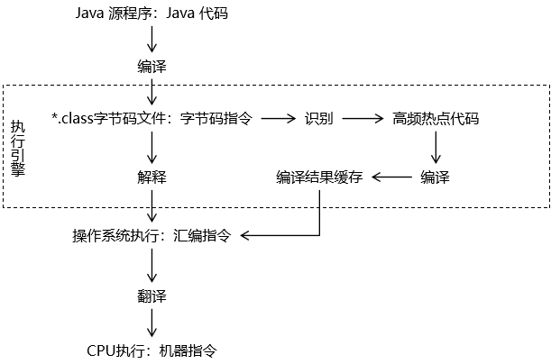

作用：用于执行字节码文件中的指令。

执行指令的具体技术：

- 解释执行：第一代JVM。
- 即时编译：JIT，第二代JVM。
- 自适应优化：目前Sun的Hotspot JVM采用这种技术。吸取了第一代JVM和第二代JVM的经验，在一开始的时候对代码进行解释执行， 同时使用一个后台线程监控代码的执行。如果一段代码经常被调用，那么就对这段代码进行编译，编译为本地代码，并进行执行优化。若方法不再频繁使用，则取消编译过的代码，仍对其进行解释执行。
- 芯片级直接执行：内嵌在芯片上，用本地方法执行Java字节码。