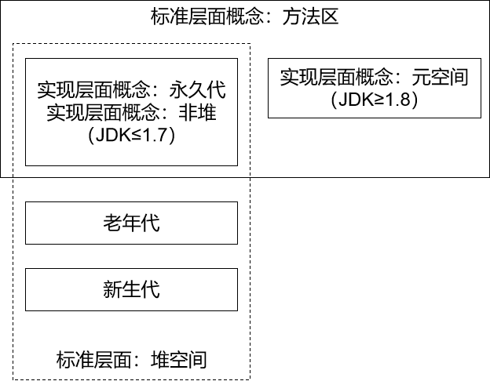
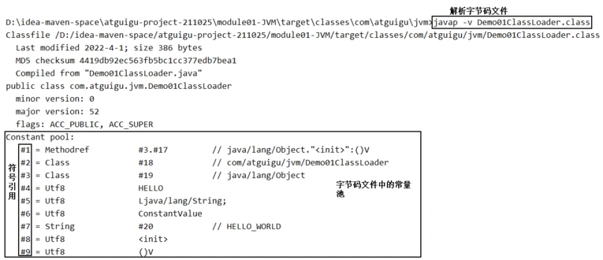
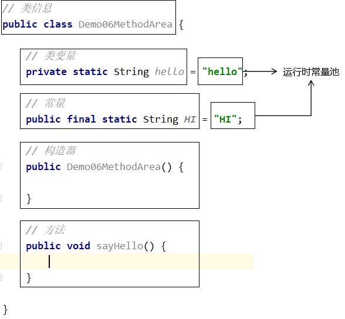

# 一、概念

- 标准层面：方法区（Method Area）
- 具体实现层面：
    - ≤1.6 永久代（PermGen）
    - =1.7 永久代仍然存在，但是已经开始提出：去永久代
    - ≥1.8元空间（Meta Space）

# 二、概念的辨析

- 从方法区角度来说
    - 方法区的具体实现：JDK 版本 ≤ 1.7 时，使用永久代作为方法区。
    - 方法区的具体实现：JDK 版本 ≥ 1.8 时，使用元空间作为方法区。
- 从堆空间角度来说
    - 新生代：从标准和实现层面都确定属于堆
    - 老年代：从标准和实现层面都确定属于堆
    - 永久代
        - 名义上属于堆
        - 实现上不属于堆，它另外有一个名字叫：非堆（Non-heap）

 

# 三、方法区存放内容

- 类信息：类中定义的构造器、接口定义
- 静态变量（类变量）：private static String some;
- 常量：public static final String SYS_MESSAGE="hello";
- 运行时常量池："a"、"abc"、"hello"
- 类中方法的代码

 

# 四、类加载机制和方法区的关系

- 类加载到JVM内存后，类的静态存储结构转化为方法区的运行时数据结构
- 类加载后，会在内存中生成一个代表这个类的java.lang.Class对象，作为方法区中这个类的各种数据的访问入口
- 类的字节码文件中有存放静态数据的常量池，类加载到内存后，字节码文件中的常量池会映射到方法区中的常量池

 

# 五、代码示例

> 说明：即使多个线程执行的是同一个方法，也并不是都拥挤到方法区去执行方法代码。而是取得一份方法中代码指令的拷贝。