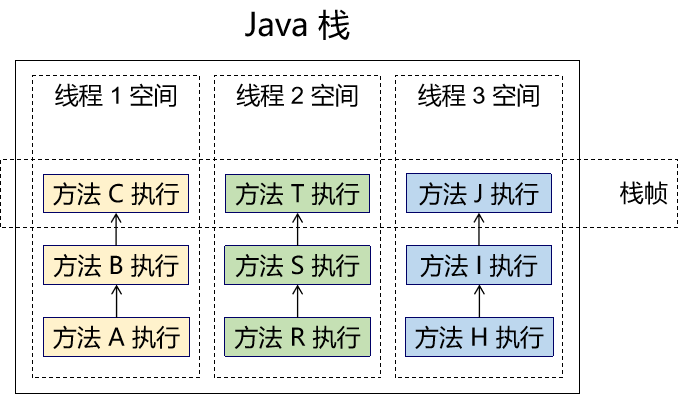
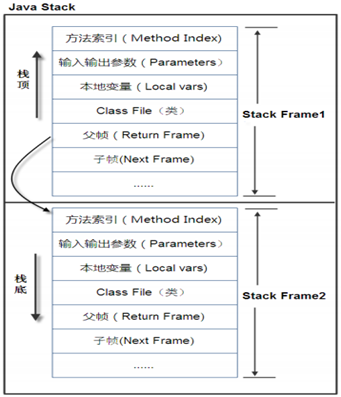
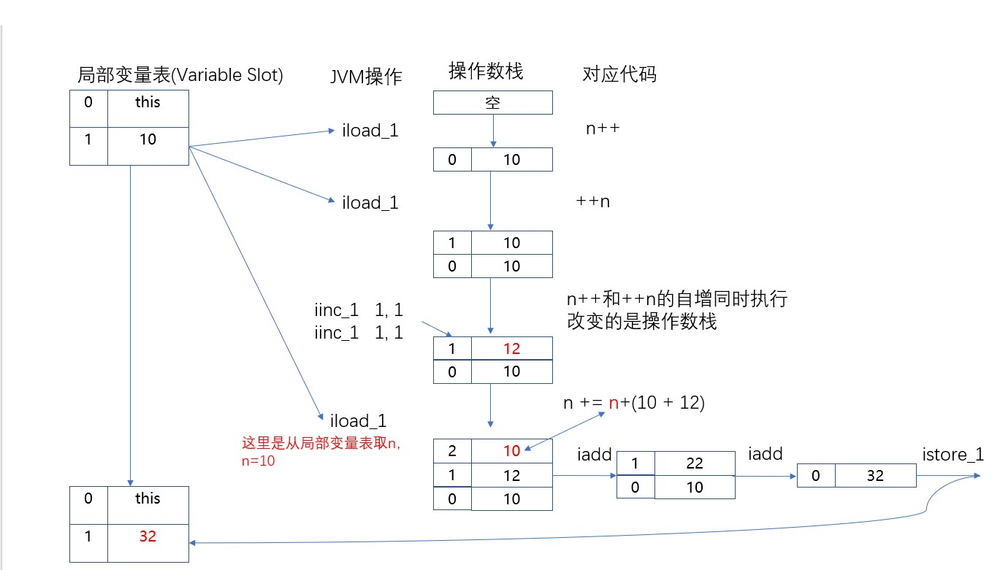

> 更规范的名称是：虚拟机栈，Java栈是以前的叫法习惯了。

# 一、总体结构



<br/>

# 二、栈帧
> 栈帧的概念：<br/>
> 方法的每一次调用都会产生一个栈帧，线程中每一次调用一个方法，就会在Java栈中开辟一块空间保存栈帧。<br/>
> 方法本次执行完成，本次执行对应的栈帧就会被释放。<br/>
> 整个线程要调用的所有方法都执行完成，则整个线程空间释放。

## 1、栈帧存储的数据

方法在本次执行过程中所用到的局部变量、动态链接、方法出口等信息。栈帧中主要保存3 类数据：

- 本地变量（Local Variables）：也叫局部变量，输入参数和输出参数以及方法内的变量。

```Java
    // 返回值：输出的参数
    public int sum(
            // 参数列表：输入的参数
            int i, int j) {

        // 方法内的变量
        int result = i + j;

        return result;
    }
```
- 栈操作（Operand Stack）：记录出栈、入栈的操作。
- 栈帧数据（Frame Data）：包括类文件、方法等等。


## 2、栈帧的结构

- 局部变量表：方法执行时的参数、方法体内声明的局部变量
- 操作数栈：存储中间运算结果，是一个临时存储空间
- 帧数据区：保存访问常量池指针，异常处理表


## 3、栈帧工作机制

当一个方法 A 被调用时就产生了一个栈帧 F1，并被压入到栈中，

A 方法又调用了 B 方法，于是产生栈帧 F2 也被压入栈，

B 方法又调用了 C 方法，于是产生栈帧 F3 也被压入栈，

……

C 方法执行完毕后，弹出 F3 栈帧；

B 方法执行完毕后，弹出 F2 栈帧；

A 方法执行完毕后，弹出 F1栈帧；

……

遵循“先进后出”或者“后进先出”原则。



<br/>

图示在一个栈中有两个栈帧：

栈帧 2 是最先被调用的方法，先入栈，

然后方法 2 又调用了方法 1，栈帧 1 处于栈顶的位置，

栈帧 2 处于栈底，执行完毕后，依次弹出栈帧 1 和栈帧 2，

线程结束，栈释放。

每执行一个方法都会产生一个栈帧，保存到栈的顶部，顶部栈就是当前方法，该方法执行完毕后会自动将此栈帧出栈。

> 两组配套概念：
> ①串行，同步操作，按顺序执行，前一个操作不执行完后面操作就要等待
> ②并行，异步操作，由操作系统和CPU调度，不同操作之间不需要互相等待

# 三、典型案例

请预测下面代码打印的结果：34

```Java
int n = 10;
n += (n++) + (++n);
System.out.println(n);
```

实际执行结果：32

使用 javap 命令查看字节码文件内容：

> D:\record-video-original\day03\code>javap -c Demo03JavaStackExample.class  
> Compiled from "Demo03JavaStackExample.java"  
> public class Demo03JavaStackExample{  
> public Demo03JavaStackExample();  
> Code:  
> 0: aload_0  
> 1: invokespecial #1 // Method java/lang/Object."\<init\>: ()V  
> 4: return
> 
> public static void main(java.lang.String[]);  
> Code:  
> 0: bipush 10  
> 2: istore_1  
> 3: iload_1  
> 4: iload_1  
> 5: iinc 1, 1  
> 8: iinc 1, 1  
> 11: iload_1  
> 12: iadd  
> 13: iadd  
> 14: istore_1  
> 15: getstatic #2 // Field java/lang/System.out:Ljava/io/PrintStream;  
> 18: iload_1  
> 19: invokevirtual #3 // Method java/io/PrintStream.println:(I)V  
> 22: return  
> }

内存执行过程分析：



<br/>

# 四、栈溢出错误

## 1、错误名称

java.lang.StackOverflowError

产生这个错误原因：Java栈分配给当前线程的空间被不断申请的栈帧耗尽了。


## 2、错误产生举例

下面的例子是一个没有退出机制的递归：

```Java
public class StackOverFlowTest {

    public static void main(String[] args) {
        methodInvokeToDie();
    }

    public static void methodInvokeToDie() {
        methodInvokeToDie();
    }

}
```

抛出的异常信息：

> Exception in thread "main" java.lang.StackOverflowError
> at com.atguigu.jvm.test.StackOverFlowTest.methodInvokeToDie(StackOverFlowTest.java:10)
> at com.atguigu.jvm.test.StackOverFlowTest.methodInvokeToDie(StackOverFlowTest.java:10)
> at com.atguigu.jvm.test.StackOverFlowTest.methodInvokeToDie(StackOverFlowTest.java:10)
> at com.atguigu.jvm.test.StackOverFlowTest.methodInvokeToDie(StackOverFlowTest.java:10)
> at com.atguigu.jvm.test.StackOverFlowTest.methodInvokeToDie(StackOverFlowTest.java:10)

原因总结：方法每一次调用都会在栈空间中申请一个栈帧，来保存本次方法执行时所需要用到的数据。但是一个没有退出机制的递归调用，会不断申请新的空间，而又不释放空间，这样迟早会把当前线程在栈内存中自己的空间耗尽。

『没有退出机制的递归』是产生栈溢出异常的典型原因，但不是唯一原因。也可能是栈空间给每个线程分配的内存大小确实不够。

<br/>

# 五、栈空间中线程独立运行

在多线程运行过程中，某一个线程抛出异常停止执行不会影响到其它线程。

