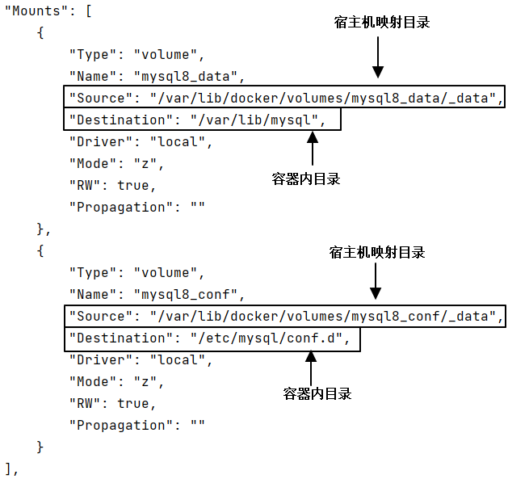
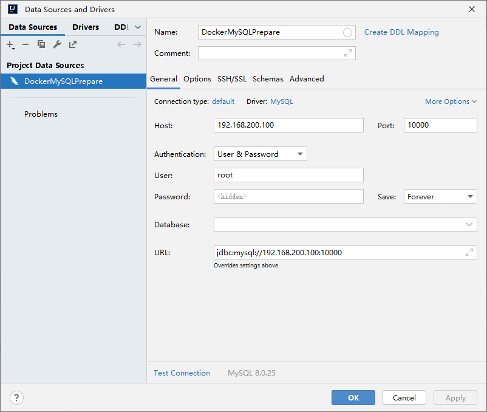
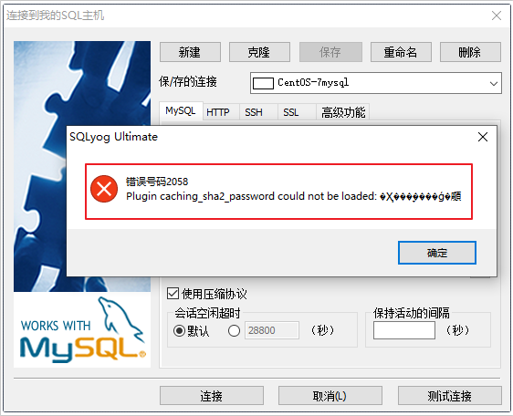
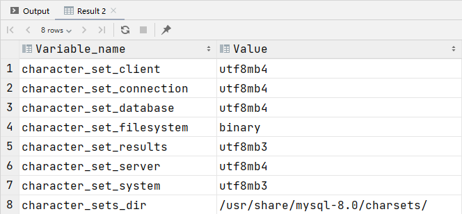

# 一、MySQL安装与连接
## 1、主体程序安装
```shell
# 关闭防火墙（如已操作请忽略）
systemctl stop firewalld

# 取消防火墙服务的开机自动启动（如已操作请忽略）
systemctl disable firewalld

# 安装 docker（如已安装请忽略）
yum install -y docker

# 查看 docker 版本
docker -v

# 把 docker 服务设置为开机自动启动
systemctl enable docker

# 启动 docker 服务
systemctl start docker

# 安装并启动 MySQL 镜像
docker run -d \
-p 10000:3306 \
-v mysql8_conf:/etc/mysql/conf.d \
-v mysql8_data:/var/lib/mysql \
-e MYSQL_ROOT_PASSWORD=atguigu \
--name atguigu-mysql8 \
mysql:8.0.25

# 查看容器信息
docker inspect atguigu-mysql8
```

<br/>



<br/>

## 2、建立客户端连接


<br/>



<br/>

配置新连接报错：错误号码 2058，出现这个原因是MySQL 8 之前的版本中加密规则是mysql_native_password，而在MySQL 8之后，加密规则是
caching_sha2_password。<br/>
解决方案:
- 方案一：升级SQLyog和Navicat（因此，新版SQLyog和Navicat不会出现此问题）
- 方案二：把MySQL用户登录密码加密规则还原成mysql_native_password。

<br/>

解决方案： 登录你的 MySQL 数据库 登录你的 MySQL 数据库
```shell
#进入容器：env LANG=C.UTF-8 避免容器中显示中文乱码
docker exec -it atguigu-mysql8 env LANG=C.UTF-8 /bin/bash

#进入容器内的mysql命令行
mysql -uroot -p

#修改默认密码校验方式
ALTER USER 'root'@'%' IDENTIFIED WITH mysql_native_password BY '1234';
```

<br/>

# 二、MySQL相关配置
## 1、字符集
MySQL 8默认字符集是UTF8mb4不需要更改
```sql
show variables like "%char%";
```

<br/>



<br/>

UTF8 字符集表示一个字符需要使用1～4个字节，但是我们常用的一些字符使用1～3个字节就可以表示了。<br/>
而字符集表示一个字符所用的最大字节长度，在某些方面会影响系统的存储和性能，所以设计MySQL的设计者偷偷的定义了两个概念：
- utf8mb3：阉割过的 UTF8 字符集，只使用1～3个字节表示字符（无法存储emoji表情）。
- utf8mb4：正宗的 UTF8 字符集，使用1～4个字节表示字符（可以存储emoji表情）。
注意：MySQL5.7中的UTF8是utf8mb3字符集 , MySQL8.0中的UTF8是utf8mb4字符集

<br/>

## 2、SQL大小写规范
### ①Windows和Linux的区别
- Windows系统环境：全部不区分大小写
- Linux系统环境：
  - 数据库名、表名、表的别名、变量名严格区分大小写
  - 列名与列的别名不区分大小写
  - 关键字、函数名称不区分大小写

<br/>

### ②Linux下大小写规则设置
在MySQL 8中设置的具体步骤为：
- 停止 MySQL 服务
- 删除数据目录，即删除 /var/lib/mysql 目录
- 在MySQL配置文件（/etc/my.cnf ）的 [mysqld] 中添加 lower_case_table_names=1
注意：不要在开发过程中修改此参数，将会丢失所有数据

<br/>

## 3、sql_mode
### ①简介
字面意思就是“SQL的模式”：

|模式|含义|
|---|---|
|STRICT_TRANS_TABLES|严格模式，要求插入或更新操作中的数据类型必须与表定义的数据类型完全匹配，否则会抛出错误|
|NO_ZERO_IN_DATE|禁止在日期中使用零值，例如'0000-00-00'，否则会抛出错误|
|NO_ZERO_DATE|禁止在日期或日期时间字段中使用零值，例如'0000-00-00'或'0000-00-00 00:00:00'，否则会抛出错误|
|ERROR_FOR_DIVISION_BY_ZERO|当除数为零时，执行除法运算会抛出错误|
|ONLY_FULL_GROUP_BY|要求GROUP BY子句中的列必须出现在SELECT列表中，或者是聚合函数的参数，否则会抛出错误|
|ANSI_QUOTES|启用ANSI_QUOTES模式，要求使用双引号来引用字符串，而不是单引号|

除了上述常见的sql_mode值，还有其他一些选项可以根据需要进行配置。
可以通过以下方式查看当前的sql_mode设置：
```sql
SHOW VARIABLES LIKE 'sql_mode';
```

<br/>

### ②更改sql_mode
#### [1]临时设置
```sql
SET GLOBAL sql_mode = 'mode1,model2,...';  -- 全局针对所有的客户端连接有效，要重新启动客户端生效，重启MySQL服务后失效
SET SESSION sql_mode = 'mode1,model2,...'; -- 当前会话生效，关闭当前会话就不生效了。可以省略SESSION关键字
```

<br/>

#### [2]永久设置
只有在MySQL配置文件中设置才能永久生效<br/>

参考步骤如下（在宿主机执行操作）：
```shell
# 创建配置文件
touch /var/lib/docker/volumes/mysql8_conf/_data/my.cnf
```

<br/>

编辑文件内容如下：
```text
[mysqld]
sql-mode = "mode1,model2,..."
```

<br/>

重启MySQL：
```shell
docker restart atguigu-mysql8
```

<br/>