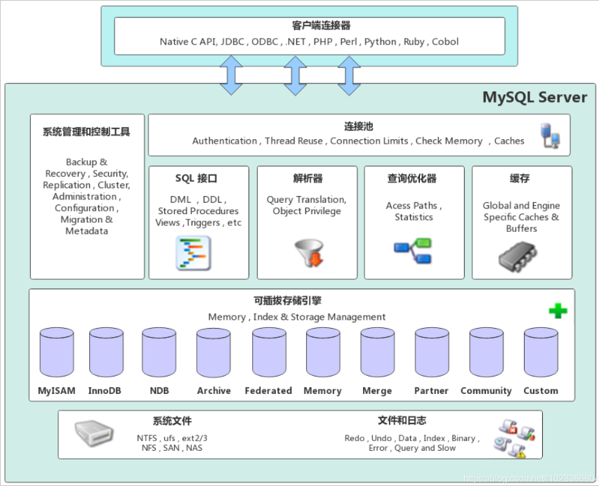
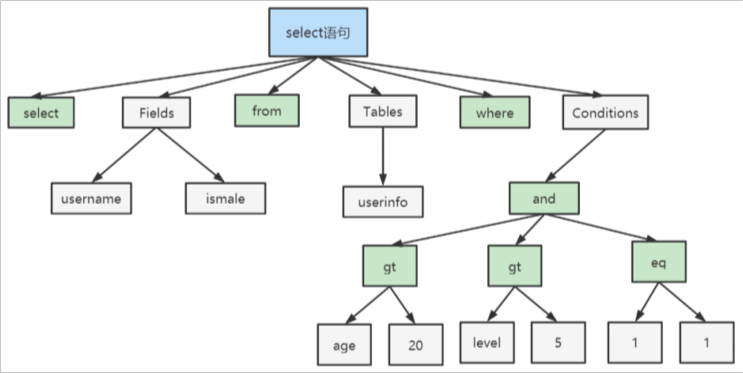
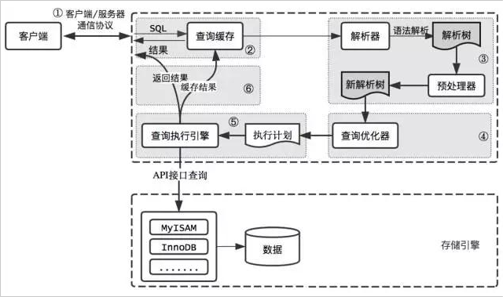
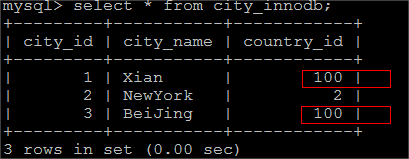
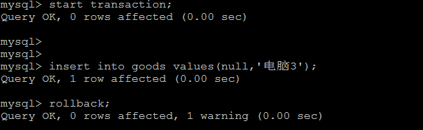

# 一、逻辑架构详解
## 1、Connectors（客户端）
MySQL服务器之外的客户端程序，与具体的语⾔相关，例如Java中的JDBC，图形⽤户界⾯SQLyog等。本质上都是在TCP连接上通过MySQL协议和MySQL服务器进⾏通信。

<br/>

## 2、SQL层（服务层）
### ①连接层
- 客户端访问 MySQL 服务器前，做的第⼀件事就是建⽴TCP连接。
- 经过三次握⼿建⽴连接成功后， MySQL 服务器对 TCP 传输过来的账号密码做⾝份认证、权限获取。
- ⽤户名或密码不对，会收到⼀个Access denied for user错误，客户端程序结束执⾏
- ⽤户名密码认证通过，会从权限表查出账号拥有的权限与连接关联，之后的权限判断逻辑，都将依赖于此时读到的权限
- TCP 连接收到请求后，必须要分配给⼀个线程专⻔与这个客户端的交互。所以还会有个线程池，去⾛后⾯的流程。每⼀个连接从线程池中获取线程，省去了创建和销毁线程的开销。

<br/>

### ②系统管理和控制⼯具
⽤于管理和控制MySQL数据库服务器的软件⼯具。这些⼯具提供了对MySQL服务器的配置、监控、维护和故障排除等功能。<br/>
以下是⼀些常⻅的MySQL系统管理和控制⼯具：

|工具| 说明                                                                                          |
|---|---------------------------------------------------------------------------------------------|
|MySQL命令⾏客户端| MySQL⾃带的命令⾏客户端是⼀个基本的系统管理⼯具，可以通过命令⾏界⾯与MySQL服务器进⾏交互。<br/>管理员可以使⽤命令⾏客户端执⾏SQL语句、管理⽤户权限、查看⽇志等操作。 |
|MySQL Workbench|官⽅提供的图形化管理⼯具，提供了丰富的功能来管理和控制MySQL服务器。它包括数据库设计、查询开发、备份恢复、性能优化等模块，使管理员可以通过可视化界⾯轻松地进⾏各种管理任务。|
|phpMyAdmin|基于Web的MySQL管理⼯具，通过浏览器访问，提供了图形化界⾯来管理MySQL服务器。它⽀持数据库的创建、表的管理、数据的导⼊导出等操作，适合于简单的数据库管理需求|
|MySQL Enterprise Monitor|官⽅提供的⾼级监控和管理⼯具。它可以实时监控MySQL服务器的性能指标、健康状态和资源利⽤情况，并提供警报和建议来优化和调整MySQL环境。|
|Percona Toolkit|由Percona开发的⼀组命令⾏⼯具，⽤于MySQL数据库的管理和维护。它包括了各种实⽤⼯具，如备份恢复、查询分析、性能优化、数据同步等，可以帮助管理员更好地管理MySQL服务器。|

<br/>

这些系统管理和控制⼯具提供了不同级别的功能和灵活性，使管理员能够根据需要选择适合⾃⼰的⼯具来管理和控制MySQL服务器。⽆论是通过命令⾏还是图形界⾯，这些⼯具都可以帮助管理员更⾼效地管理MySQL数据库。

<br/>

### ③SQL接口
- 接收⽤户的SQL命令，并且返回⽤户需要查询的结果。⽐如SELECT ... FROM就是调⽤SQL Interface
- MySQL⽀持DML（数据操作语⾔）、DDL（数据定义语⾔）、存储过程、视图、触发器、⾃定义函数等多种SQL语⾔接⼝

<br/>

### ④解析器
在SQL命令传递到解析器的时候会被解析器验证和解析。<br/>
解析器中 SQL 语句进⾏词法分析、语法分析、语义分析，并为其创建语法树。
- 词法分析：检测SQL语句的关键字是否正确
- 语法分析：检测SQL语句是否符合MySQL的语法要求，按照MySQL语法规则，⽣成解析树
- 语义分析：检查解析树是否合法，⽐如查看表是否存在，列是否存在

<br/>



<br/>

### ⑤查询优化器
SQL语句在语法解析后、查询前会使⽤查询优化器对查询进⾏优化，确定SQL语句的执⾏路径，⽣成⼀个执⾏计划。

<br/>

### ⑥查询缓存组件
MySQL内部维持着⼀些Cache和Buffer<br/>
⽐如Query Cache⽤来缓存⼀条SELECT语句的执⾏结果，如果能够在其中找到对应的查询结果，<br/>
那么就不必再进⾏查询解析、查询优化和执⾏的整个过程了，直接将结果反馈给客户端。<br/>
这个缓存机制是由⼀系列⼩缓存组成的。<br/>
⽐如表缓存，记录缓存，key缓存，权限缓存等。<br/>
这个查询缓存可以在不同客户端之间共享。<br/>
但⼤多数情况查询缓存就是个鸡肋，为什么呢？<br/>
只有相同的SQL语句才会命中查询缓存。<br/>
两个查询请求在任何字符上的不同（例如：空格、注释、⼤⼩写），都会导致缓存不会命中。<br/>
在两条查询之间有 INSERT 、 UPDATE 、 DELETE 、 TRUNCATE TABLE 、 ALTER TABLE 、 DROP TABLE 或 DROP DATABASE 语句也会导致缓存失效<br/>
因此 MySQL的查询缓存命中率不⾼。所以在MySQL 8之后就抛弃了这个功能。

<br/>

### ⑦存储引擎层
存储引擎层（ Storage Engines），负责MySQL中数据的存储和提取，对物理服务器级别维护的底层数据执⾏操作，服务器通过API与存储引擎进⾏通信。<br/>
不同的存储引擎具有的功能不同，管理的表有不同的存储结构，采⽤的存取算法也不同，这样我们可以根据⾃⼰的实际需要进⾏选取。例如MyISAM引擎和InnoDB引擎。<br/>

### ⑧存储层
所有的数据、数据库、表的定义、表的每⼀⾏的内容、索引，都是存在⽂件系统上，以⽂件的⽅式存在，并完成与存储引擎的交互<br/>

# 二、查询流程
⼀条查询的SQL语句的执⾏流程如下所示：<br/>



<br/>

- MySQL客户端通过协议与MySQL服务器建连接
- 通过SQL接⼝发送SQL语句，先检查查询缓存
  - 命中：直接返回结果
  - 未命中：进⾏语句解析

<br/>

接下来是解析过程：MySQL解析器通过关键字将SQL语句进⾏解析，并⽣成⼀棵对应的解析树，解析器使⽤MySQL语法规则验证和解析SQL语句<br/>
例如，它将验证是否使⽤了错误的关键字，或者使⽤关键字的顺序是否正确，引号能否前后匹配等<br/>
预处理器则根据MySQL规则进⼀步检查解析树是否合法，例如，这⾥将检查数据表和数据列是否存在，还会解析名字和别名，看是否有歧义等，并⽣成⼀棵新解析树，新解析树可能和旧解析树结构⼀致<br/>

<br/>

然后是优化过程：MySQL优化程序会对我们的语句做⼀些优化，将查询的IO成本和CPU成本降到最低。
优化的结果就是⽣成⼀个执⾏计划。
这个执⾏计划表明了应该使⽤哪些索引执⾏查询，以及表之间的连接顺序是啥样，必要时将⼦查询转换为连接、表达式简化等等。
我们可以使⽤EXPLAIN语句来查看某个语句的执⾏计划。

<br/>

最后，进⼊执⾏阶段。完成查询优化后，查询执⾏引擎会按照⽣成的执⾏计划调⽤存储引擎提供的接⼝执⾏SQL查询并将结果返回给客户端。<br/>
在MySQL8以下的版本，如果设置了查询缓存，这时会将查询结果进⾏缓存，再返回给客户端。

<br/>

# 三、SQL执行流程
## 1、启用 profiling 功能
```sql
# 查看 profiling 功能是否已启用
show variables like "%profiling%";
    
# 启用 profiling 功能
set profiling=1;
set profiling_history_size=100;
    
# 执行查询语句
select emp_id, emp_name from t_emp;

# 显示最近的几次查询，找到查询语句的 query Id
show profiles ;
    
# 根据 query Id 显示查询语句执行流程
SHOW PROFILE FOR QUERY 286;
```

<br/>

## 2、执行过程说明

<br/>

|操作步骤|说明|
|---|---|
|starting|事务开始|
|Executing hook on transaction|在事务期间执行钩子函数|
|checking permissions|检查权限，确保用户有权执行相应的操作|
|Opening tables|打开相关数据库表|
|init|初始化操作|
|System lock|获取系统级别的锁定|
|optimizing|优化查询计划|
|statistics|收集统计信息|
|preparing|准备执行查询|
|executing|执行查询|
|end|事务结束|
|query end|查询结束|
|waiting for handler commit|等待处理程序提交|
|closing tables|关闭数据库表|
|freeing items|释放资源|
|cleaning up|清理操作|

<br/>

# 四、存储引擎
## 1、查看存储引擎
### ①查看系统中所有存储引擎
```sql
SHOW ENGINES;
```

<br/>

### ②查看当前系统中默认的存储引擎
```sql
SHOW VARIABLES LIKE '%default_storage_engine%';
```

<br/>

## 2、设置存储引擎（了解）
### ①方式一
设置默认存储引擎：
```sql
SET DEFAULT_STORAGE_ENGINE=MyISAM;
```

<br/>

### ②方式二
修改 my.cnf 文件：vim /etc/my.cnf<br/>
在[mysqld]节点下新增一行：default-storage-engine=MyISAM<br/>
重启MySQL<br/>

### ③方式三
我们可以为 不同的表设置不同的存储引擎：
```sql
CREATE TABLE 表名( 建表语句 ) ENGINE = 存储引擎名称;
ALTER TABLE 表名 ENGINE = 存储引擎名称;
-- 例如：
CREATE TABLE student(id INT, `name` VARCHAR(16),age INT,dept INT) ENGINE = MyISAM;
```

<br/>

## 3、常见存储引擎介绍
在MySQL8中提供了很多的存储引擎，不同的存储引擎的特点是不一样的，常见的存储引擎有：InnoDB、MyISAM、Memory、Archive(高压缩比)、
Blackhole（黑洞）、CSV引擎、Federated引擎等。

<br/>

### ①InnoDB
- 默认存储引擎：在MySQL 5.5版本之后，InnoDB成为了MySQL的默认存储引擎。
- 支持事务：InnoDB是一个支持ACID事务的存储引擎，可以提供数据的一致性和可靠性。
- 行级锁定：InnoDB使用行级锁定来实现并发控制，允许多个事务同时读取和写入不同的行，提高了并发性能。
- 外键约束：InnoDB支持外键约束，可以保证数据的完整性和一致性。
- 支持崩溃恢复：InnoDB具有崩溃恢复机制，可以在数据库异常关闭后进行恢复。

<br/>

#### [1]测试事务
```sql
create table goods_innodb(
    id int NOT NULL AUTO_INCREMENT,
    name varchar(20) NOT NULL,
    primary key(id)
)ENGINE=innodb DEFAULT CHARSET=utf8;
-- sql语句
start transaction;
insert into goods_innodb(id,name)values(null,'Meta20');
commit;
```

<br/>

#### [2]测试外键
MySQL支持外键的存储引擎只有InnoDB ,在创建外键的时候， 要求父表必须有对应的索引,子表在创建外键的时候， 也会自动的创建对应的索引。
下面两张表中， country_innodb是父表 ， country_id为主键索引，city_innodb表是子表，country_id字段为外键，对应于country_innodb表的主
键country_id。
```sql
create table country_innodb(
    country_id int NOT NULL AUTO_INCREMENT,
    country_name varchar(100) NOT NULL,
    primary key(country_id)
)ENGINE=InnoDB DEFAULT CHARSET=utf8;
create table city_innodb(
    city_id int NOT NULL AUTO_INCREMENT,
    city_name varchar(50) NOT NULL,
    country_id int NOT NULL,
    primary key(city_id),
    CONSTRAINT `fk_city_country` FOREIGN KEY(country_id) REFERENCES country_innodb(country_id) ON DELETE RESTRICT ON
    UPDATE CASCADE
)ENGINE=InnoDB DEFAULT CHARSET=utf8;
insert into country_innodb values(null,'China'),(null,'America'),(null,'Japan');
insert into city_innodb values(null,'Xian',1),(null,'NewYork',2),(null,'BeiJing',1);
```

<br/>

在创建外键时， 可以指定在删除、更新父表时，对子表进行的相应操作，包括 RESTRICT、CASCADE、SET NULL 和 NO ACTION。<br/>
RESTRICT和NO ACTION相同， 是指限制在子表有关联记录的情况下， 父表不能更新；<br/>
CASCADE(级联)表示父表在更新或者删除时，更新或者删除子表对应的记录；<br/>
SET NULL 则表示父表在更新或者删除的时候，子表的对应字段被SET NULL 。<br/>
针对上面创建的两个表， 子表的外键指定是ON DELETE RESTRICT ON UPDATE CASCADE 方式的， 那么在主表删除记录的时候， 如果子表有对<br/>
应记录， 则不允许删除， 主表在更新记录的时候， 如果子表有对应记录， 则子表对应更新 。<br/>

表中数据如下表所示：<br/>



<br/>

外键信息可以使用如下方式查看 ：<br/>

```sql
show create table city_innodb ;
```

<br/>

外键关联性测试：
- 删除country_id为1 的country数据
- 更新主表country表的字段 country_id，然后观察子表中对应的数据

<br/>

开发建议：
- 在功能开发过程中，为了使用测试数据方便，通常先不加外键约束
- 在正式上线或发版之前再添加外键约束

<br/>

### ②MyISAM
- 不支持事务：MyISAM是一个不支持事务的存储引擎，无法提供数据的一致性和可靠性。
- 表级锁定：MyISAM使用表级锁定来实现并发控制，只允许一个事务对整个表进行读写操作，限制了并发性能。
- 较低的存储空间占用：相比InnoDB，MyISAM在存储空间占用方面较低，适合存储大量非事务性的数据。

<br/>

```sql
create table goods_myisam(
    id int NOT NULL AUTO_INCREMENT,
    name varchar(20) NOT NULL,
    primary key(id)
)ENGINE=myisam DEFAULT CHARSET=utf8;
```

<br/>



<br/>

### ③Memory
- 数据存储在内存中：Memory存储引擎将数据完全存储在内存中，因此读写速度非常快。
- 不支持持久化：Memory存储引擎不支持数据的持久化，数据库重启后数据会丢失。
- 表级锁定：Memory使用表级锁定来实现并发控制，只允许一个事务对整个表进行读写操作，限制了并发性能。
- 适用于临时数据和缓存：由于数据存储在内存中且不支持持久化，Memory存储引擎适用于存储临时数据和缓存，而不适合长期存储。

<br/>

```sql
-- 建表语句
CREATE TABLE goods_memory (
    id INT PRIMARY KEY,
    column1 VARCHAR(50),
    column2 INT
) ENGINE=MEMORY;
-- 测试数据存储在内存中
INSERT INTO goods_memory (id, column1, column2) VALUES (1, 'value1', 100);
SELECT * FROM goods_memory;
-- 重启mysql容器，数据丢失
```

<br/>

## 4、MyISAM 和 InnoDB 对比

|&nbsp;| MyISAM                    |InnoDB|
|---|---------------------------|---|
|外键| 不支持                       |支持|
|事务| 不支持                       |支持|
|行表锁| 表锁，操作一条记录也会锁定整个表，不适合高并发操作 |行锁，操作哪一行就锁定哪一行，对其它行没有影响，适合高并发操作<br/>也支持表锁|
|缓存| 只缓存索引，不缓存真实数据             |不仅缓存索引还缓存真实数据，对内存要求较高，内存大小对性能有决定性影响，支持聚簇索引|
|关注点| 并发查询、节省资源、消耗少、简单业务        |并发写、事务、更大更复杂的资源操作|
|默认使用| MySQL5.5之前                |MySQL5.5开始|
|自带系统表|有|无|