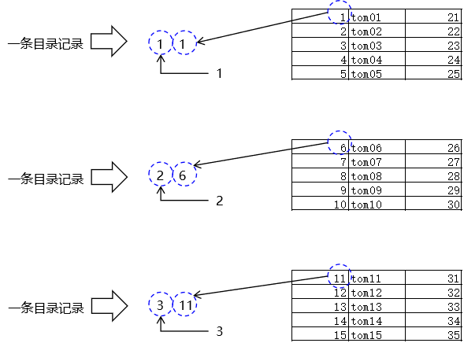
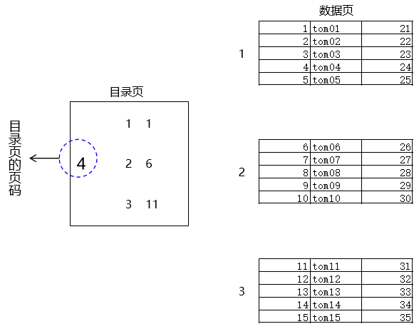
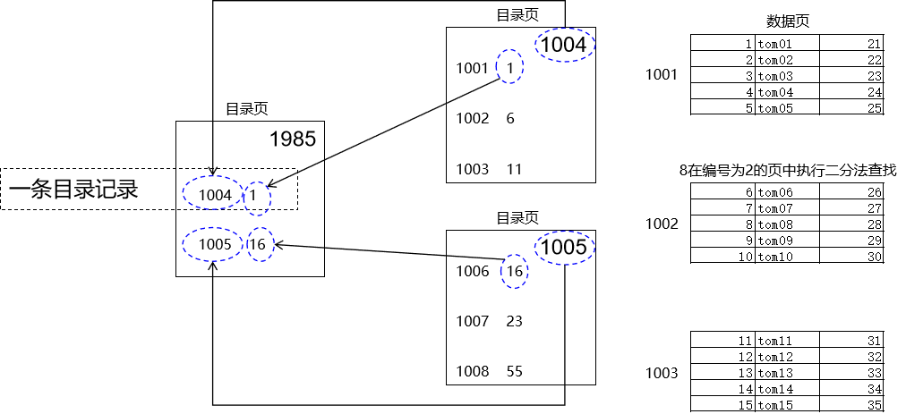

# 一、概念
## 1、不使用索引的一般的查询
- 设定查询条件
- 逐一检查每一条记录，看看是否满足查询条件

<br/>

例如：
- 查字典：在正文中一页一页查找某一个字
- 到图书馆找某一本书：逐个楼层、逐个房间、逐个书架、一本书一本书去找……
- 到医院找某一个科室：逐个楼层、逐个房间、一个一个找……

<br/>

## 2、使用索引查询
检索：通常就是只基于索引查询<br/>

- 查字典：先在检字表里找到这个字在第几页，然后直接翻到这一页，检字表就是字典的索引
- 到图书馆找某一本书：先在外面通过电脑或卡片找到你所需书在具体哪个位置，然后直奔这个位置找到这本书
- 到医院找某一个科室：先在楼下看看楼层科室牌子

所以索引是在数据之外，额外建立的一组数据，专门帮助我们提高查询的效率<br/>

## 3、索引的评价
- 使用索引的好处：在特定场景下大幅度提高查询的效率
- 使用索引的弊端：
  - 索引本身也需要占用存储的空间
  - 一旦执行了增删改操作，索引就需要跟着修改，所以会增删改操作的效率

<br/>

# 二、操作索引
## 1、创建索引
创建数据库表之后，只要指定了主键字段，那么主键索引就自动创建了，不需要额外手动创建<br/>
所以我们手动创建的索引，都是在非主键字段上创建的，这样的索引可以称之为：
- 非主键索引
- 二级索引
- 非聚簇索引

<br/>

```sql
# 针对一个字段，创建一个普通的索引
create index idx_emp_name on t_emp(emp_name);

# 针对一个字段，创建一个唯一索引
# 唯一索引会要求这个字段的值不能重复
# 底层 MySQL 会在创建唯一索引的时候，自动添加唯一约束
create unique index idx_emp_salary on t_emp(emp_salary);

# 针对多个字段，创建一个普通索引
create index idx_emp_name_salary on t_emp(emp_name, emp_salary);

# 针对多个字段，创建一个唯一索引
# 当我们针对多个字段设定唯一约束时，只要保证这多个字段的值组合起来不重复即可
# 延伸：主键也不是只能包含一个字段，主键包含多个字段时称为联合主键
create unique index idx_emp_name_subject on t_emp(emp_name, emp_subject);
```

<br/>

## 2、删除索引
```sql
# 删除索引
drop index idx_emp_name on t_emp;
```

# 三、索引的分类
- 从索引包含的字段数量角度
  - 单列索引（单值索引）
  - 多列索引（多值索引）
- 从索引字段是否是主键角度
  - 主键索引（值不能重复，且不能为空）
  - 非主键索引（二级索引）
- 从是否有唯一性要求角度
  - 唯一索引（值不能重复，但null值可以有多个）
  - 非唯一索引
- 从索引和原始数据是否在一起角度
  - 聚簇索引
  - 非聚簇索引
- 从索引实现的特定功能角度
  - 空间索引：用于做基于地理位置（经纬度）的数据的保存
  - 全文索引：先对原始字符串做分词操作，然后使用搜索关键词和分词结果进行匹配

<br/>

# 四、推演索引的构成
## 1、基础概念
InnoDB 存储数据的最小单位：页<br/>
页默认大小：16KB<br/>
假设一条记录大小：1KB<br/>
由此推断：一页可以保存记录的数量16KB÷1KB=16

<br/>

## 2、页码


<br/>

## 3、抽取第一层目录
### ①目录记录的来历


<br/>

### ②推算一条目录记录占空间大小
假设主键字段和页码都是整数，都使用big int类型（相当于Java中的long类型），所以一条目录记录，我们就按8×2=16B计算

<br/>

### ③页存储目录记录容量
InnoDB引擎中，存储目录记录页是使用页作为最小的存储单元：
- 页默认大小：16KB
- 一条目录记录：16B
- 目录记录容量：1024

<br/>

### ④目录页的来历


<br/>

## 4、基于目录的查找


<br/>

## 5、抽取第二层目录


<br/>

通过两次抽取，我们能够体会到，按照目前这个抽取方式，不断向上汇总，最终一定能够汇总到一个节点中——在最顶端，一个目录页就够了<br/>

此时我们把每一个页都看做一个节点，那么它们整体就形成了一个树形结构：<span style="color:blue;font-weight:bold;">B+Tree</span><br/>

## 6、基于两层目录的搜索方式


<br/>

# 五、BTree和B+Tree的区别
## 1、BTree特点
- 不区分目录节点、数据节点，所有节点都是既保存子节点的指针，又保存原始数据记录
- 所以每个节点保存的记录数量就会减少
- 横向来看：变窄
- 纵向来看：变高
- BTree的整体形态：高瘦、尖锐
  - 层次深度多
  - 每一层能够保存的数据少

<br/>

## 2、B+Tree特点
- 仅在叶子节点保存原始记录数据
- 非叶子节点都是目录节点
- 目录节点只保存目录，所以每个节点能够保存的记录数量就大
- 横向来看：变宽
- 纵向来看：变矮
- B+Tree的整体形态：矮胖、扁平
  - 层次深度少
  - 每一层能够保存的数据多

<br/>

## 3、树形结构对查询效率的影响
- MySQL 默认把树形结构的根节点加载到内存
- 需要使用子节点时到硬盘加载
- 每需要一层就到硬盘加载一层
- 所以树形结构层次深度多的时候，访问硬盘的I/O次数就会多，性能就会差

## 4、推算B+Tree容量
- 一个数据页容量：16
- 一个目录页容量：1024
- 整个B+Tree如果只有一层：意味着只能有一个根节点，这个节点只能是一个数据节点，此时总容量的数量级就是 10 这个级别
- 整个B+Tree如果有两层：意味着根节点是目录节点，叶子节点是数据节点
  - 目录节点容量：1024条记录，意味着目录节点下可以有1024个子节点
  - 每一个子节点存放数据的容量：16
  - 总计：1024×16≈1000×10=10000
- 整个B+Tree如果有三层：意味着根节点是目录节点，中间一层还是目录节点，叶子节点是数据节点
  - 根节点：容量是1024
  - 第二层有1024个节点
  - 第二层中的节点，每一个又可以存放1024个子节点
  - 叶子节点每一个可以存放16条数据记录
  - 总计：1024×1024×16约等于1000×1000×10=10000000
- 规律：按照我们目前的设定，整个树形结构每增加一层，数据的总容量就乘以 1000

<br/>

MySQL 数据库表实际存储能力：
- 单表存储数据的极限是大约1000万条数据（此时很可能执行查询语句的时间需要以分钟为单位计算）
- 单表数据量达到300万，趋势还是不断增加，那么就该考虑拆分表了

<br/>

