# 一、聚簇索引和非聚簇索引
## 1、聚簇索引
- 索引和原始数据在一起，从硬盘存储文件的角度来说，存放在同一个文件中，就是聚簇索引
- 主键索引本身就是聚簇索引，同时也是数据库表本身
- 所以下面三个概念指的是同一个东西：
    - 主键索引：侧重点在于强调索引是基于主键字段创建的
    - 聚簇索引：侧重点在于强调索引和数据在一起
    - 数据库表本身：测试重点在于面向应用

注意：实际上上面这个说法需要有一个前提条件，那就是在InnoDB引擎中才成立；MyISAM引擎即使是主键索引页是非聚簇的

<br/>

## 2、非聚簇索引
索引结构和原始数据不在一起，在数据库表文件之外的另一个文件中保存索引结构，这就是非聚簇索引<br/>
以下三个概念也是一样的：
- 非主键索引：侧重于强调索引是根据非主键字段创建的
- 二级索引：把主键索引视为一级索引，非主键索引就是二级的
- 非聚簇索引：侧重于强调索引结构和原始数据不在一起

<br/>

## 3、非主键索引的构成
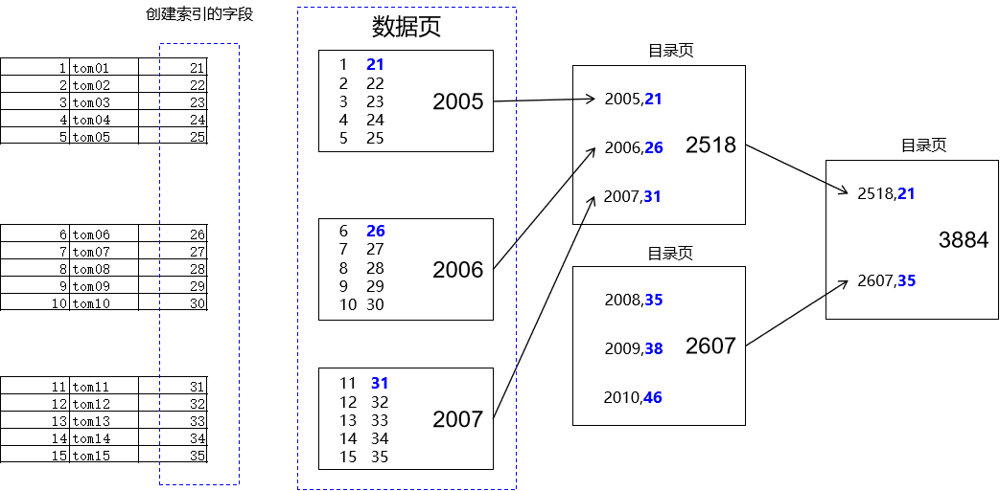

<br/>

- 用于创建索引的字段，总体上需要排序
- 在排序过程中，遇到相同的字段值，就会连在一起

|主键值|索引字段值|
|---|---|
|38|22|
|36|23|
|15|23|
|66|23|
|7|34|

- 字符串也可以排序
  - 根据字母顺序排序
  - 底层字符编码排序

<br/>

## 4、多个字段的情况
### ①多字段排序问题
首先要解决一个问题：多个字段如何排序？<br/>
回想：SQL 中order by子句是不是可以包含多个字段？<br/>
规则：先根据第一个字段排序
- 如果第一个字段中没有重复值，那么就单纯根据第一个字段排序，后面字段就不看了
- 如果第一个字段中有重复值，那么在重复值范围内，再根据第二个字段排序
- 如果第二个字段中也有重复值，那么在重复值范围内，再根据第三个字段排序

<br/>

```sql
order by age,salary,grade
```

<br/>

| age |salary|grade|
|-----|---|---|
| 21  |6600|5|
| 22  |5533|4|
| 23  |2211|3|
| 23  |1000|8|
| 23  |1500|18|
| 23  |1500|19|
| 23  |1500|20|
| 23  |1800|4|

<br/>

### ②构成


<br/>

### ③索引值
用哪个字段创建了索引，这个字段的值就是索引值
- 主键索引：主键值就是索引值
- 非主键索引：创建索引的字段的值，就是索引值
- 单列索引：索引值就是一个单个值
- 多列索引：索引值就是创建索引时指定的多个字段的值

<br/>

# 二、回表
## 1、非主键索引的查询过程
假设我们有数据库表如下：

| emp_id | emp_name |emp_age|emp_subject|emp_salary|
|--------|----------|--|---|---|
| 1      | tom1     |21|Java|1000|
| 2      | tom2     |22|Java|2000|
| 3      | tom3     |23|Java|3000|
| 4      | tom4     |24|Java|4000|
| 5      | tom5     |25|Java|5000|
| 6      | tom6     |26|Java|6000|
| 7      | tom7     |27|Java|7000|

```sql
# 创建索引
create index idx_emp_age on t_emp(emp_age);

# 查询语句
select emp_id,emp_name,emp_age,emp_subject,emp_salary from t_emp where emp_age=24;
```

执行回表操作：
<br/>

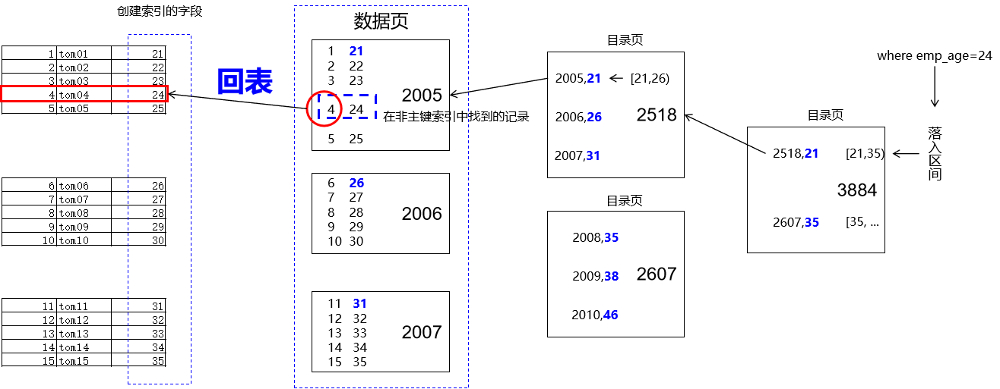

<br/>

## 2、不需要回表的情况
```sql
# 查询之后，想要打印的字段在二级索引结构中全部都能找到，此时就不需要再回到主键索引中查询了
select emp_id, emp_name, emp_age from emp_age=24;
```

<br/>

覆盖索引：创建索引时用到的字段，已经能够把查询所需的数据都覆盖了，查询之后不需要回表<br/>
所以覆盖索引并不是某一种索引类型，而只是描述一种效果，创建索引时如果能够尽量做到覆盖索引，减少回表操作，也能够提高性能

<br/>

# 三、与索引相关的数据结构

## 1、索引结构

索引结构是指在数据库中用于**组织和管理索引的数据结构**。索引结构的设计和实现对于数据库的性能和效率具有重要影响。

常见的索引结构包括：

1、B树(B-tree): B树是一种平衡的**多路搜索树**，被广泛应用于数据库系统中。B树的特点是每个节点可以存储多个键值，并且保持有序。B树的高

度相对较低，可以快速定位到目标数据。

2、Hash索引（Hash Index）：Hash索引使用哈希函数将索引列的值映射为一个固定长度的哈希码，并将哈希码作为索引的键值。Hash索引适用于

等值查询，可以快速定位到目标数据。然而，Hash索引不支持范围查询和排序操作。

3、R树（R-tree）：R树是一种用于处理多维数据的索引结构，常用于地理信息系统（GIS）和空间数据库中。R树可以高效地支持范围查询和最近邻

查询。

4、Full-text （全文索引） ：全文索引也是MyISAM的一个特殊索引类型，主要用于全文索引，InnoDB从Mysql5.6版本开始支持全文索引。


MyISAM、InnoDB、Memory三种存储引擎对各种索引类型的支持

| 索引        | InnoDB引擎      | MyISAM引擎 | Memory引擎 |
| ----------- | --------------- | ---------- | ---------- |
| BTREE索引   | 支持            | 支持       | 支持       |
| HASH 索引   | 不支持          | 不支持     | 支持       |
| R-tree 索引 | 不支持          | 支持       | 不支持     |
| Full-text   | 5.6版本之后支持 | 支持       | 不支持     |

我们平常所说的索引，如果没有特别指明，都是指**B+树**（多路搜索树，并不一定是二叉的）结构组织的索引。其中聚集索引、复合索引、前缀索引、

唯一索引默认都是使用 B+tree 索引，统称为索引。

## 2、索引结构-树

### ①二叉树

#### [1]二叉树

树有很多种，**每个节点最多只能有两个子节点**的一种形式称为二叉树。二叉树的子节点分为左节点和右节点。

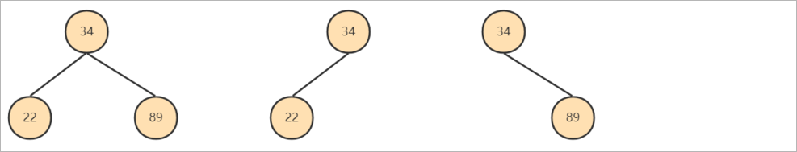

#### [2]BST树

##### <1>BST的简介

BST(Binary Sort(Search) Tree)：对于二叉排序树的任何一个非叶子节点，要求左子节点的值比当前节点的值小，右子节点的值比当前节点的值大。

特别说明：如果有相同的值，可以将该节点放在左子节点或右子节点。

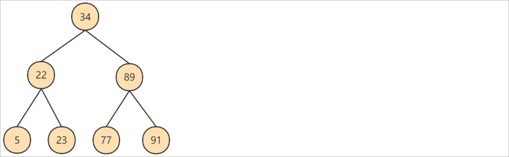

BST的生成演示：https://www.cs.usfca.edu/~galles/visualization/BST.html

##### <2>BST的问题

二叉搜索树存在一个常见的问题：**瘸腿问题** ， 例如左子树全部为空，从形式上看，更像一个单链表，不能发挥BST的优势，影响了查询数据效率。


#### [3]AVL树

##### <1>AVL树简介

AVL树全称G.M. Adelson-Velsky和E.M. Landis，这是两个人的人名。

平衡二叉树也叫**平衡二叉搜索树**（Self-balancing binary search tree）又被称为AVL树， 可以保证较高的查询效率。


具有以下特点：

1、它是一棵空树或它的左右两个子树的高度差的绝对值不超过1

2、并且左右两个子树都是一棵平衡二叉树。

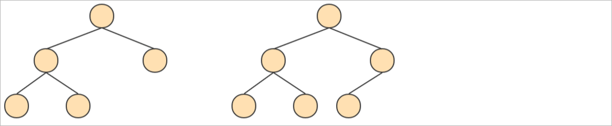

AVL的生成演示：https://www.cs.usfca.edu/~galles/visualization/AVLtree.html

##### <2>AVL树问题

众所周知，IO操作的效率很低，在大量数据存储中，查询时我们不能一下子将所有数据加载到内存中，只能逐节点加载（一个节点一次IO）。如果我

们利用二叉树作为索引结构，那么**磁盘的IO次数和索引树的高度是相关**的。平衡二叉树由于树深度过大而造成磁盘IO读写过于频繁，进而导致效率

低下。

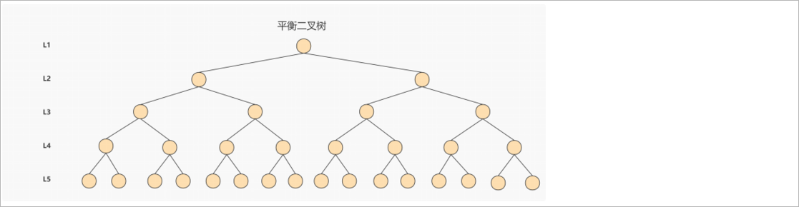

为了提高查询效率，就需要 减少磁盘IO数 。**为了减少磁盘IO的次数，就需要尽量降低树的高度**，需要把原来“瘦高”的树结构变的“矮胖”，树的每

层的分叉越多越好。针对同样的数据，如果我们把二叉树改成 三叉树：

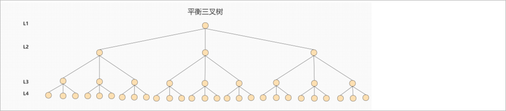

上面的例子中，我们将二叉树变成了三叉树，降低了树的高度。如果能够在一个节点中存放更多的数据，我们还可以进一步减少节点的数量，从而进一

步降低树的高度。这就是多叉树。

### ②B-tree

#### [1]B-tree简介

B-tree又叫**多路平衡搜索树**，一颗m叉的B-tree特性如下：

1、树中每个节点最多包含m个子节点。

2、除根节点与叶子节点外，每个节点至少有[ceil(m/2)]个孩子。

3、若根节点不是叶子节点，则至少有两个孩子。

4、所有的叶子节点都在同一层。

5、每个非叶子节点由n个key与n+1个指针组成，其中[ceil(m/2)-1] <= n <= m-1

如下所示：

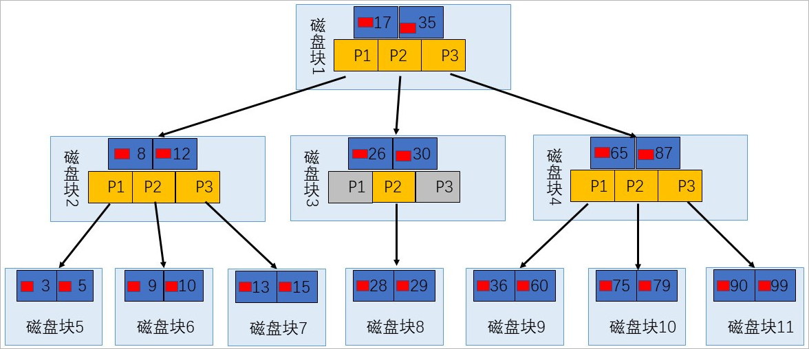

#### [2]数据搜索

上图所表示的 B 树就是一棵 3 阶(叉)的 B 树。假设一个磁盘块可以存储一个节点的数据。我们可以看下磁盘块 2，里面的关键字为（8，12），它有 3

个孩子 (3，5)，(9，10) 和 (13，15)，你能看到 (3，5) 小于 8，(9，10) 在 8 和 12 之间，而 (13，15)大于 12，三节点的子树的值大小仍然遵守 BST

二叉排序树的规则。

<br/>

假设我们想要 查找的数据项是 9 ，那么步骤可以分为以下几步：

1、第一次磁盘IO：找到根节点磁盘块1，读入内存，执行二分查找，9 小于 17 ，得到指针 P1

2、第二次磁盘IO：按照指针P1找到磁盘块 2，读入内存，执行二分查找， 9 在 8 和 12 之间，得到指针 P2

3、第三次磁盘IO：按照指针P2找到磁盘块 6，读入内存，执行二分查找， 找到了数据项 9。

你能看出来在 B 树的搜索过程中，我们比较的次数并不少，但如果**把数据读取出来然后在内存中进行比较，这个时间就是可以忽略不计的**。而读

取磁盘块本身需要进行 I/O 操作，消耗的时间比在内存中进行比较所需要的时间要多，是数据查找用时的重要因素。 B树相比于平衡二叉树来说磁盘

I/O 操作要少 ，在数据查询中比平衡二叉树效率要高。所以只要树的高度足够低，IO次数足够少，就可以提高查询性能 。

# 四、MyISAM索引结构
## 1、索引结构简介

MyISAM引擎使用 B+Tree 作为索引结构，**叶子节点的data域存放的是数据记录的地址** 。

下图是MyISAM索引的原理图**（索引和数据分开存储，是非聚簇索引）**：

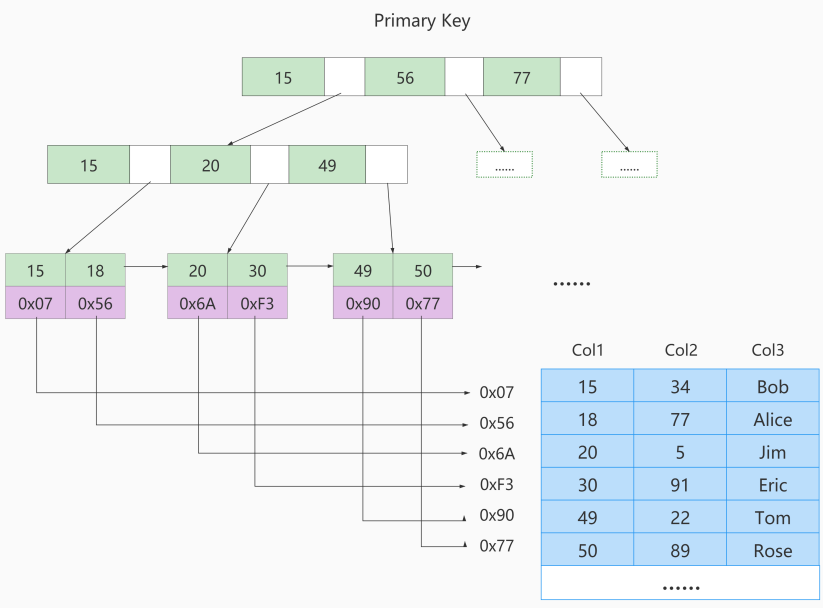

<br/>

如果我们在Col2上建立一个二级索引，则此索引的结构如下图所示**（是非聚簇索引）**：

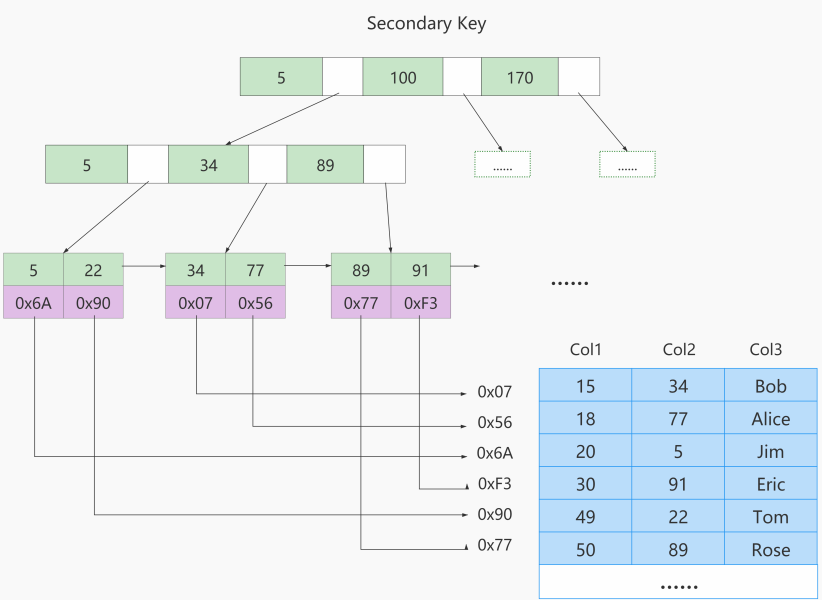

<br/>

## 2、MyISAM与InnoDB对比

1、InnoDB的数据文件本身就是索引文件，而MyISAM索引文件和数据文件是分离的：

- InnoDB的表在磁盘上存储在以下文件中： **.ibd（表结构、索引和数据都存在一起,MySQL5.7表结构放在.frm中）**
- MyISAM的表在磁盘上存储在以下文件中：**.sdi（描述表结构，MySQL5.7是.frm）**、**.MYD（数据）**，**.MYI（索引）**

2、InnoDB中主键索引是聚簇索引，叶子节点中存储完整的数据记录；其他索引是非聚簇索引，存储相应记录主键的值 。

3、InnoDB要求表必须有主键 （ MyISAM可以没有 ）。如果没有显式指定，则MySQL系统会自动选择一个可以**非空且唯一**标识数据记录的列作为

主键。如果不存在这种列，则MySQL自动为InnoDB表生成一个隐含字段作为主键。

4、MyISAM中无论是主键索引还是非主键索引都是非聚簇的，叶子节点记录的是数据的地址。

5、MyISAM的回表操作是十分快速的，因为是拿着地址偏移量直接到文件中取数据的，反观InnoDB是通过获取主键之后再去聚簇索引里找记录，虽

然说也不慢，但还是比不上直接用地址去访问。

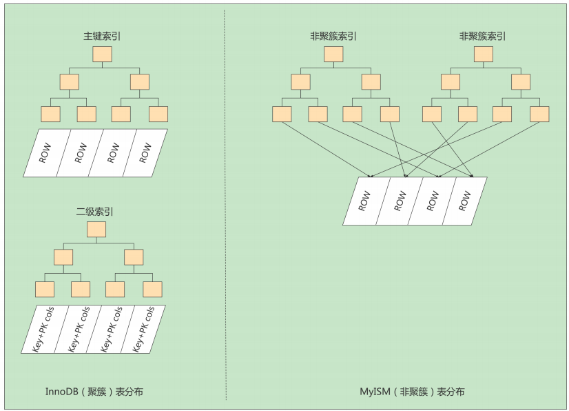

<br/>


