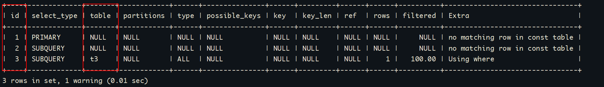
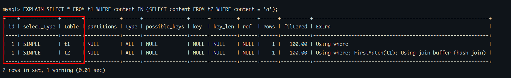
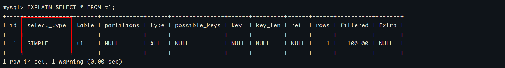
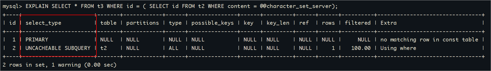
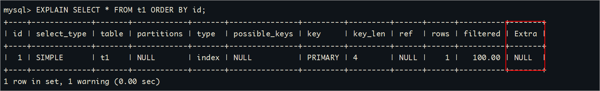
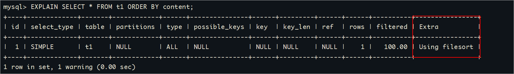

# 1 MySQL优化（索引优化）

## 1.1 优化简介

MySQL性能调优是指通过对MySQL数据库系统进行优化，以**提高其执行速度、响应时间和资源利用率**的过程。MySQL是一种常用的关系型数据库

管理系统，因此针对MySQL的性能调优主要集中在以下几个方面：

1、查询优化：通过分析和优化查询语句，包括使用合适的索引、避免全表扫描、优化JOIN操作等，以提高查询性能。

2、索引优化：合理设计和使用索引，包括选择合适的列作为索引、创建复合索引、删除不必要的索引等，以加快数据检索速度。

3、配置优化：调整MySQL的配置参数，如缓冲区大小、并发连接数、线程池大小等，以适应不同的工作负载和硬件环境。

4、内存管理：合理配置MySQL的内存使用，包括设置合适的缓冲池大小、排序缓冲区大小、临时表空间大小等，以提高内存利用率和减少磁盘IO。

5、存储引擎选择：根据应用需求选择合适的存储引擎，如InnoDB、MyISAM等，并针对不同存储引擎进行相应的优化。

6、数据库设计优化：合理设计数据库表结构、字段类型和关系，以减少数据冗余和提高查询效率。

以上只是MySQL性能调优的一些常见方面，具体的调优策略和方法需要根据具体情况进行分析和优化。通过综合考虑硬件、操作系统、网络和应用程

序等因素，可以全面提升MySQL数据库的性能和可伸缩性。

## 1.2 性能分析（EXPLAIN）

### 1.2.1 EXPLAIN简介

查看SQL执行计划：使用EXPLAIN关键字可以**模拟优化器执行SQL查询语句**，从而知道MySQL是如何处理你的SQL语句的。分析你的查询语句或

是表结构的性能瓶颈。

**用法：**

```sql
EXPLAIN + SQL语句
```

### 1.2.2 数据准备

```sql
USE atguigudb;
 
CREATE TABLE t1(id INT(10) AUTO_INCREMENT, content VARCHAR(100) NULL, PRIMARY KEY (id));
CREATE TABLE t2(id INT(10) AUTO_INCREMENT, content VARCHAR(100) NULL, PRIMARY KEY (id));
CREATE TABLE t3(id INT(10) AUTO_INCREMENT, content VARCHAR(100) NULL, PRIMARY KEY (id));
CREATE TABLE t4(id INT(10) AUTO_INCREMENT, content1 VARCHAR(100) NULL, content2 VARCHAR(100) NULL, PRIMARY KEY (id));

CREATE INDEX idx_content1 ON t4(content1);  -- 创建普通索引

# 以下新增sql多执行几次，以便演示
INSERT INTO t1(content) VALUES(CONCAT('t1_',FLOOR(1+RAND()*1000)));
INSERT INTO t2(content) VALUES(CONCAT('t2_',FLOOR(1+RAND()*1000)));
INSERT INTO t3(content) VALUES(CONCAT('t3_',FLOOR(1+RAND()*1000)));
INSERT INTO t4(content1, content2) VALUES(CONCAT('t4_',FLOOR(1+RAND()*1000)), CONCAT('t4_',FLOOR(1+RAND()*1000)));
```

### 1.2.3 EXPLAIN结果字段说明

#### table

单表：显示这一行的数据是关于哪张表的

```sql
EXPLAIN SELECT * FROM t1;
```


多表：关联查询中，显示在执行计划第一行的是驱动表，第二行是被驱动表

```sql
EXPLAIN SELECT * FROM t1, t2 WHERE t1.id = t2.id;
```


#### id

在一个完整的查询语句中，每个SELECT关键字，都对应一个唯一的id。同时通过id也可以知道操作表的顺序。<br/>
id 字段显示出来都是整数值，这些整数值有相同的，有不同的
- 不相同的整数值：代表执行SQL语句的大步骤
- 相同的整数值出现的次数：代表一个大步骤中，包含几个小步骤

<br/>
下面id值的含义：总共有3个大步骤，取值为1的大步骤中，包含3个小步骤；取值为2的大步骤中，包含两个小步骤；取值为3的大步骤中包含3个小步骤：
- 1 a
- 1 b
- 1 c
- 2 d
- 2 e
- 3 f
- 3 g
- 3 h

<br/>

- 大步骤：按照数值从大到小的顺序执行
- 小步骤：在它所在的大步骤内，按照从上到下的顺序执行
- 所以上面例子的执行顺序应该是：f g h d e a b c

<br/>

大步骤越少越好，总的步骤数量越少越好

<br/>

**id相同：** 一个SELECT，id都是1

```sql
EXPLAIN SELECT * FROM t1, t2, t3;
```


**id不同：**三个SELECT，id是1、2、3

```sql
EXPLAIN SELECT t1.id FROM t1 WHERE t1.id =(
  SELECT t2.id FROM t2 WHERE t2.id =(
    SELECT t3.id FROM t3 WHERE t3.content = 't3_479'
  )
);
```


**注意**：如果t3表查询无结果，则table列t1和t2处为NULL




**注意：**查询优化器可能对涉及子查询的语句进行优化，**转为连接查询**

```sql
EXPLAIN SELECT * FROM t1 WHERE content IN (SELECT content FROM t2 WHERE content = 'a');
```




**id为NULL：** 把t1和t2的查询结果合并，并创建名为<union1,2>的临时表，然后对结果去重 把t1和t2的查询结果合并

```sql
EXPLAIN SELECT * FROM t1 UNION SELECT * FROM t2;
```


因此包含UNION ALL的执行计划中就没有这条记录

```sql
EXPLAIN SELECT * FROM t1 UNION ALL SELECT * FROM t2;
```


1. UNION：使用UNION操作符时，会将多个SELECT语句的结果集合并，并去除重复的行。即，如果多个SELECT语句返回了相同的行，则只保留

   一行。

2. UNION ALL：使用UNION ALL操作符时，也会将多个SELECT语句的结果集合并，但不去除重复的行。即，如果多个SELECT语句返回了相同

   的行，则全部保留。

**小结：**

- id如果相同，可以认为是一组，`从上往下顺序执行`
- 在所有组中，`id值越大，越先执行`
- 关注点：每个id号码，表示一次独立的查询, `一个sql的查询趟数越少越好`

#### select_type

查询的类型，主要是用于区别普通查询、联合查询、子查询等的复杂查询。<br/>
从SQL优化的角度来看：
- 最希望看到的是所有步骤都是SIMPLE
- SUBQUERY如果能够改成SIMPLE就尽量改，也就是尽量不用子查询
- SUBQUERY比DEPENDENT SUBQUREY要好

<br/>

**SIMPLE：**简单查询，查询中不包含子查询或者UNION。

```sql
EXPLAIN SELECT * FROM t1;
```




**PRIMARY：**主查询，查询中若包含子查询，则最外层查询被标记为PRIMARY。

**SUBQUERY：**子查询，在SELECT或WHERE列表中包含了子查询。

```sql
EXPLAIN SELECT * FROM t3 WHERE id = ( SELECT id FROM t2 WHERE content= 'a');
```


**DEPENDENT SUBQUREY：**如果包含了子查询，并且查询语句不能被优化器转换为连接查询，并且子查询是**相关子查询（子查询基于外部数据**

**列）**，则子查询就是DEPENDENT SUBQUREY。

```sql
EXPLAIN SELECT * FROM t3 WHERE id = ( SELECT id FROM t2 WHERE content = t3.content);
```


UNCACHEABLE SUBQUREY： 表示一个子查询（subquery）被标记为无法缓存。在某些数据库管理系统中，查询优化器会尝试将查询结果缓存起来

以提高性能，但对于被标记为UNCACHEABLE的子查询，查询优化器将不会缓存其结果。

```sql
EXPLAIN SELECT * FROM t3 WHERE id = ( SELECT id FROM t2 WHERE content = @@character_set_server);
```




**UNION：** 对于包含UNION或者UNION ALL的查询语句，除了最左边的查询是PRIMARY，其余的查询都是UNION。

**UNION RESULT：** UNION会对查询结果进行查询去重，MYSQL会使用临时表来完成UNION查询的去重工作，针对这个临时表的查询就

是"UNION RESULT"。

```sql
EXPLAIN 
SELECT * FROM t3 WHERE id = 1 
UNION  
SELECT * FROM t2 WHERE id = 1;
```


**DEPENDENT UNION：** 子查询中的UNION或者UNION ALL，除了最左边的查询是DEPENDENT SUBQUREY，其余的查询都是

DEPENDENT UNION。

```sql
 EXPLAIN SELECT * FROM t1 WHERE content IN
 (
 SELECT content FROM t2 
 UNION 
 SELECT content FROM t3
 );
```


**DERIVED：** 在包含**派生表（子查询在from子句中）**的查询中，MySQL会递归执行这些子查询，把结果放在临时表里。

```sql
EXPLAIN SELECT * FROM (
   SELECT content, COUNT(*) AS c FROM t1 GROUP BY content
) AS derived_t1 WHERE c > 1;
```

这里的**\<derived2\>**就是在id为2的查询中产生的派生表。


#### type

type字段表示了查询操作的**访问类型**，用于描述查询引擎在执行查询时使用的访问方法。

**ALL：** 全表扫描，Full Table Scan，将遍历全表以找到匹配的行

```sql
EXPLAIN SELECT * FROM t1;
```


**index：**表示全索引扫描，即遍历整个索引树来获取结果，而**不需要回表**查找数据。

```sql
EXPLAIN SELECT content1 FROM t4;
```


```sql
EXPLAIN SELECT id FROM t1;
```


**range：** 只检索给定范围的行，使用一个索引来选择行。key 列显示使用了哪个索引，一般就是在你的where语句中出现了between、<、>、in等

的查询。这种范围扫描索引扫描比全表扫描要好，因为它只需要开始于索引的某一点，而结束于另一点，不用扫描全部索引。

```sql
EXPLAIN SELECT * FROM t1 WHERE id > 2;
```


**ref：** 表示使用了非唯一索引进行的等值比较，可能返回多个匹配的行。

```sql
EXPLAIN SELECT * FROM t4 WHERE content1 = 'a';
```


**eq_ref：**表示使用了连接（join）查询，并且连接条件是通过唯一索引进行的等值比较。

```sql
EXPLAIN SELECT * FROM t1, t2 WHERE t1.id = t2.id;
```


**system**：表示只有一行数据的表，这是最快的访问方式。

```sql
CREATE TABLE t(i int) Engine=MyISAM;
INSERT INTO t VALUES(1);
EXPLAIN SELECT * FROM t;
```


#### possible_keys 和 key

1、possible_keys表示执行查询时可能用到的索引，一个或多个。 查询涉及到的字段上若存在索引，则该索引将被列出，但不一定被查询实际使用。

2、keys表示实际使用的索引。如果为NULL，则没有使用索引。

```sql
EXPLAIN SELECT id FROM t1 WHERE id = 1;
```


#### key_len

表示索引使用的字节数，根据这个值可以判断索引的使用情况，`检查是否充分利用了索引，针对联合索引值越大越好。`

**如何计算：**

1、先看索引上字段的类型。比如：int=4 ; varchar(20) =20 ; char(20) =20

2、如果是varchar或者char这种字符串字段，视字符集要乘不同的值，比如utf8要乘 3(MySQL5.7)，如果是utf8mb4要乘4，GBK要乘2

3、varchar这种动态字符串要加2个字节

4、允许为空的字段要加1个字节


```sql
CREATE TABLE `t_emp` (
  `id` INT(11) NOT NULL AUTO_INCREMENT,
  `empno` INT NOT NULL ,					-- 可以使用随机数字，或者从1开始的自增数字，不允许重复
  `name` VARCHAR(20) DEFAULT NULL,  		-- 随机生成，允许姓名重复 20 * 4 + 2 + 1= 83
  `age` INT(3) DEFAULT NULL,				-- 区间随机数  4 + 1
  `deptId` INT(11) DEFAULT NULL,			-- 1-1w之间随机数
  PRIMARY KEY (`id`)
) ENGINE=INNODB AUTO_INCREMENT=1;

-- 创建索引
CREATE INDEX idx_age_name ON t_emp(age, `name`);

-- 测试1
EXPLAIN SELECT * FROM t_emp WHERE age = 30 AND `name` = 'ab%';

-- 测试2
EXPLAIN SELECT * FROM t_emp WHERE age = 30;
```


#### ref

ref字段表示连接操作中使用的索引列。

**const：**  与索引列进行等值比较的东西是啥，const表示一个常数

```sql
EXPLAIN SELECT * FROM t4 WHERE content1 = 'a';
```


**ref=atguigudb.t1.id**   关联查询时出现，t2表和t1表的哪一列进行关联

```sql
EXPLAIN SELECT * FROM t1, t2 WHERE t1.id = t2.id;
```


#### rows

rows字段的值是一个估计值，表示查询操作在执行时**可能会扫描的行数**。这个估计值是根据统计信息和查询优化器的算法得出的，并不是实际执行时

的准确值。它可以用来帮助我们评估查询的性能和效率。rows字段的值越小越好!

```sql
-- 如果是全表扫描，rows的值就是表中数据的估计行数
EXPLAIN SELECT * FROM t_emp WHERE empno = '100001';

-- 如果是使用索引查询，rows的值就是预计扫描索引记录行数
EXPLAIN SELECT * FROM t_emp WHERE deptId = 1;
```


#### filtered

最后查询出来的数据占所有服务器端（server）检查行数（rows）的百分比。值越大越好。


#### Extra

Extra字段提供了一些与查询操作相关的**附加信息**，帮助我们更好地理解查询的执行过程和性能特点。MySQL提供的额外信息有好几十个，这里只挑

比较重要的介绍。

**Impossible WHERE**：where子句的值总是false

```sql
EXPLAIN SELECT * FROM t_emp WHERE 1 != 1;
```


**Using where：** 使用了where，但在where上有字段没有创建索引。也可以理解为如果数据从引擎层被返回到server层进行过滤，那么就是Using

where。

```sql
EXPLAIN SELECT * FROM t_emp WHERE `name` = '风清扬';
```


**Using filesort**：在对查询结果中的记录进行排序时，是可以使用索引的，如下所示：

```sql
EXPLAIN SELECT * FROM t1 ORDER BY id;
```



如果排序操作无法使用到索引，只能在内存中（记录较少时）或者磁盘中（记录较多时）进行排序（filesort），如下所示：

```sql
EXPLAIN SELECT * FROM t1 ORDER BY content;
```




**Using index：** **使用了覆盖索引**，表示直接访问索引就足够获取到所需要的数据，不需要通过索引回表

```sql
 EXPLAIN SELECT id, content1 FROM t4;
```


**Using index condition**: 叫作Index Condition Pushdown Optimization （**索引下推优化**）

```sql
-- content1列上有索引idx_content1
EXPLAIN SELECT * FROM t4 WHERE content1 > 'z' AND content1 LIKE '%a';
```

>1、`如果没有索引下推（ICP）`，那么MySQL在存储引擎层找到满足`content1 > 'z'`条件的第一条二级索引记录。`主键值进行回表`，返回完整
>
>的记录给server层，server层再判断其他的搜索条件是否成立。如果成立则保留该记录，否则跳过该记录。
>
>2、`如果使用了索引下推（ICP）`，那么MySQL在存储引擎层找到满足`content1 > 'z'`条件的第一条二级索引记录。`不着急执行回表`，而是在这
>
>条记录上先判断一下所有关于`idx_content1`索引中包含的条件是否成立，也就是`content1 > 'z' AND content1 LIKE '%a'`是否成立。如果
>
>这些条件不成立，则直接跳过该二级索引记录，去找下一条二级索引记录；如果这些条件成立，则执行回表操作，返回完整的记录给server层。


**注意：** 如果这里的查询条件`只有content1 > 'z'`，那么找到满足条件的索引后也会进行一次索引下推的操作，判断content1 > 'z'是否成立（这是源

码中为了编程方便做的冗余判断）


