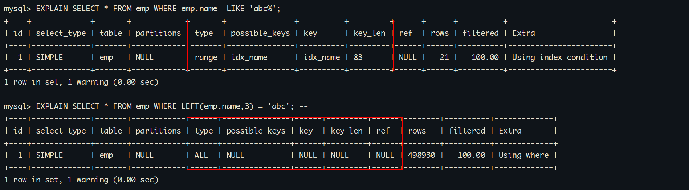
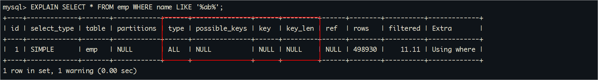
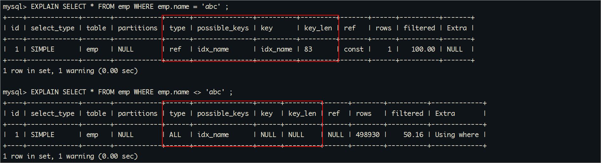
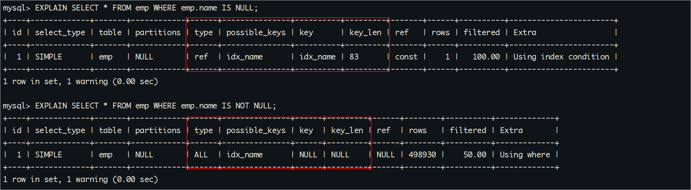
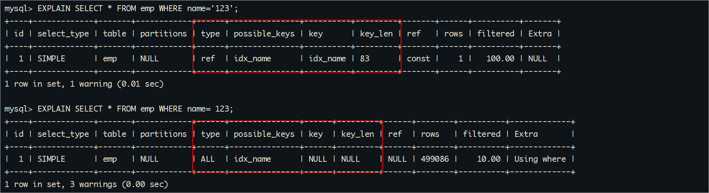
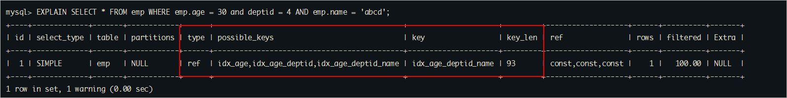
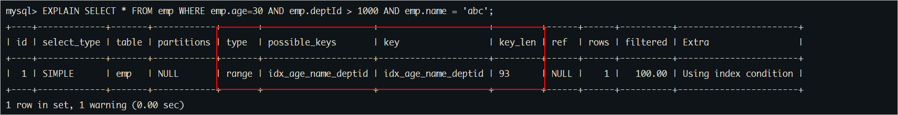

# 一、数据准备
## 1、表结构说明
在做优化之前，要准备大量数据。接下来创建两张表，并往员工表里插入50W数据，部门表中插入1W条数据。
怎么快速插入50w条数据呢?

1、使用jdbc程序

2、使用存储过程

怎么保证插入的数据不重复? 函数

```sql
CREATE TABLE `dept` (
  `id` INT(11) NOT NULL AUTO_INCREMENT,
  `deptName` VARCHAR(30) DEFAULT NULL,		-- 随机字符串，允许重复
  `address` VARCHAR(40) DEFAULT NULL,		-- 随机字符串，允许重复
  ceo INT NULL ,							-- 1-50w之间的任意数字
  PRIMARY KEY (`id`)
) ENGINE=INNODB AUTO_INCREMENT=1;

CREATE TABLE `emp` (
  `id` INT(11) NOT NULL AUTO_INCREMENT,
  `empno` INT NOT NULL ,					-- 可以使用随机数字，或者从1开始的自增数字，不允许重复
  `name` VARCHAR(20) DEFAULT NULL,  		-- 随机生成，允许姓名重复
  `age` INT(3) DEFAULT NULL,				-- 区间随机数
  `deptId` INT(11) DEFAULT NULL,			-- 1-1w之间随机数
  PRIMARY KEY (`id`)
  #CONSTRAINT `fk_dept_id` FOREIGN KEY (`deptId`) REFERENCES `t_dept` (`id`)
) ENGINE=INNODB AUTO_INCREMENT=1;
```

总结： 需要产生随机字符串和区间随机数的函数。

## 2、随机函数

在MySQL中提供了很多的随机数函数，如下所示：

1、rand()：rand()函数返回一个0到1之间的随机浮点数。

2、rand(n)：rand(n)函数接受一个种子值n，并返回一个0到1之间的随机浮点数。当使用相同的种子值n时，rand(n)将会生成相同的随机数序列。

3、uuid()：uuid()函数用于生成一个通用唯一标识符（Universally Unique Identifier），也就是一个随机的字符串。

使用方式如下所示：

```sql
SELECT RAND(); 				-- 返回一个0到1之间的随机浮点数
SELECT FLOOR(RAND() * 10); 	-- 返回一个0到9之间的随机整数
SELECT UUID(); 				-- 返回一个随机的唯一标识符
```


自定义生成随机数的函数：

```sql
-- 查看mysql是否允许创建函数：
SHOW VARIABLES LIKE 'log_bin_trust_function_creators';
SET GLOBAL log_bin_trust_function_creators=1; 				-- 命令开启：允许创建函数设置：（global-所有session都生效）

-- 随机产生字符串
DELIMITER $$  -- 将分隔符设置为"$$"，以便在自定义函数中使用多个语句。
CREATE FUNCTION rand_string(n INT) RETURNS VARCHAR(255)  -- n表示的随机字符串的长度 
BEGIN    
  DECLARE chars_str VARCHAR(100) DEFAULT 'abcdefghijklmnopqrstuvwxyzABCDEFJHIJKLMNOPQRSTUVWXYZ';
  DECLARE return_str VARCHAR(255) DEFAULT '';
  DECLARE i INT DEFAULT 0;
  WHILE i < n DO  
    SET return_str = CONCAT(return_str,SUBSTRING(chars_str,FLOOR(1+RAND()*52),1));  
    SET i = i + 1;
  END WHILE;
  RETURN return_str;
END $$

-- 假如要删除
-- drop function rand_string;


-- 用于随机产生区间数字
DELIMITER $$
CREATE FUNCTION rand_num (from_num INT ,to_num INT) RETURNS INT(11)
BEGIN   
 DECLARE i INT DEFAULT 0;  
 SET i = FLOOR(from_num +RAND()*(to_num - from_num + 1));
RETURN i;  
END$$

-- 假如要删除
-- drop function rand_num;
```

## 3、存储过程

### ①存储过程简介

存储过程（Stored Procedure）是一组**预编译的SQL语句集合**，它们被命名并存储在数据库中，可以像调用函数一样被应用程序或其他存储过程调

用。存储过程通常用于**执行特定的业务逻辑操作**，并且可以接受参数、返回结果。

存储过程具有以下特点：

1、封装性：存储过程将一系列SQL语句封装在一个单独的代码块中，使得这些SQL语句可以作为一个整体进行管理和调用。

2、可重用性：存储过程可以被多个应用程序或其他存储过程调用，提高了代码的复用性。

3、安全性：存储过程可以设置访问权限，只允许授权用户或角色执行，从而保护数据的安全性。

4、性能优化：存储过程在数据库服务器端执行，减少了网络传输开销，提高了查询性能。

存储过程可以完成复杂的业务逻辑，包括数据处理、事务管理、错误处理等。它们还可以通过输入参数和输出参数与应用程序进行交互，实现更灵活

和可定制的数据操作。

### ②创建存储过程

```sql
-- 插入员工数据
DELIMITER $$			-- 将分隔符设置为"$$"，以便在存储过程中使用多个语句。
CREATE PROCEDURE insert_emp(START INT, max_num INT)
BEGIN  
  DECLARE i INT DEFAULT 0;   
  SET autocommit = 0;   -- 将自动提交事务的选项设置为0，即关闭自动提交。
  REPEAT  				-- REPEAT ... END REPEAT; ：开始一个循环，循环结束条件是`i = max_num`，每次循环`i`递增1。
    SET i = i + 1;  
    INSERT INTO emp (empno, NAME, age, deptid ) VALUES ((START+i) ,rand_string(6), rand_num(30,50), rand_num(1,10000));  
    UNTIL i = max_num  
  END REPEAT;  
  COMMIT;  
END$$
 
-- 删除
-- drop PROCEDURE insert_emp;


-- 插入部门数据
DELIMITER $$
CREATE PROCEDURE insert_dept(max_num INT)
BEGIN  
  DECLARE i INT DEFAULT 0;   
  SET autocommit = 0;    
  REPEAT  
    SET i = i + 1;  
    INSERT INTO dept ( deptname,address,ceo ) VALUES (rand_string(8),rand_string(10),rand_num(1,500000));  
    UNTIL i = max_num  
  END REPEAT;  
  COMMIT;  
END$$
 
-- 删除
-- DELIMITER ;
-- drop PROCEDURE insert_dept;
```

### ③调用存储过程

```sql
-- 执行存储过程，往dept表添加1万条数据
CALL insert_dept(10000); 

-- 执行存储过程，往emp表添加50万条数据，编号从100000开始
CALL insert_emp(100000,500000); 
```

### ④开启SQL执行时间的显示

为了方便后面的测试中随时查看SQL运行的时间，测试索引优化后的效果，我们开启profiling

```sql
-- 显示sql语句执行时间
SET profiling = 1;
SHOW VARIABLES  LIKE '%profiling%';
SHOW PROFILES;
```

# 二、单表索引失效案例

MySQL中提高性能的一个最有效的方式是对数据表**设计合理的索引**。索引提供了高效访问数据的方法，并且加快查询的速度，因此索引对查询的速度

有着至关重要的影响。

我们创建索引后，用不用索引，最终是优化器说了算。**优化器会基于开销选择索引，怎么开销小就怎么来**。不是基于规则，也不是基于语义。

另外SQL语句是否使用索引，和数据库的版本、数据量、数据选择度（查询中选择的列数）运行环境都有关系。

```sql
-- 创建索引
CREATE INDEX idx_name ON emp(`name`);
```

## 1、计算、函数导致索引失效

```sql
-- 显示查询分析
EXPLAIN SELECT * FROM emp WHERE emp.name  LIKE 'abc%';
EXPLAIN SELECT * FROM emp WHERE LEFT(emp.name,3) = 'abc'; -- 索引失效
```

执行结果如下所示：



## 2、LIKE以%开头索引失效

```sql
EXPLAIN SELECT * FROM emp WHERE name LIKE '%ab%'; -- 索引失效
```

执行结果如下所示：



注意：Alibaba《Java开发手册》【强制】页面搜索严禁左模糊或者全模糊，如果需要请走搜索引擎来解决。

## 3、不等于(!= 或者<>)索引失效

```sql
EXPLAIN SELECT * FROM emp WHERE emp.name = 'abc' ;
EXPLAIN SELECT * FROM emp WHERE emp.name <> 'abc' ; -- 索引失效
```

执行结果如下所示：



## 4、IS NOT NULL 和 IS NULL

```sql
EXPLAIN SELECT * FROM emp WHERE emp.name IS NULL;
EXPLAIN SELECT * FROM emp WHERE emp.name IS NOT NULL; -- 索引失效
```

执行结果如下所示：



**注意：** 当数据库中的数据的**索引列的NULL值达到比较高的比例的时候**，即使在IS NOT NULL 的情况下 MySQL的查询优化器会选择使用索引，

此时**type的值是range（范围查询）**

```sql
-- 将 id>20000 的数据的 name 值改为 NULL
UPDATE emp SET `name` = NULL WHERE `id` > 20000;

-- 执行查询分析，可以发现 IS NOT NULL 使用了索引
-- 具体多少条记录的值为NULL可以使索引在IS NOT NULL的情况下生效，由查询优化器的算法决定
EXPLAIN SELECT * FROM emp WHERE emp.name IS NOT NULL;
```

执行结果如下所示：


**测试完将name的值改回来**

```sql
UPDATE emp SET `name` = rand_string(6) WHERE `id` > 20000;
```

## 5、类型转换导致索引失效

```sql
EXPLAIN SELECT * FROM emp WHERE name='123'; 
EXPLAIN SELECT * FROM emp WHERE name= 123; -- 索引失效
```

执行结果如下所示：



## 6、全索引匹配效率最高

```sql
-- 删除之前在emp表上的创建的索引
drop index idx_name on emp ;
```

**问题**： 为以下查询语句创建哪种索引效率最高

```sql
-- 查询分析
EXPLAIN SELECT * FROM emp WHERE emp.age = 30 and deptid = 4 AND emp.name = 'abcd';
-- 执行SQL
SELECT * FROM emp WHERE emp.age = 30 and deptid = 4 AND emp.name = 'abcd';
-- 查看执行时间
SHOW PROFILES;
```

**创建索引并重新执行以上测试：**

```sql
-- 创建索引：分别创建以下三种索引的一种，并分别进行以上查询分析
CREATE INDEX idx_age ON emp(age);
CREATE INDEX idx_age_deptid ON emp(age,deptid);
CREATE INDEX idx_age_deptid_name ON emp(age,deptid,`name`);
```

结论： 可以发现最高效的查询应用了联合索引idx_age_deptid_name



## 7、违背了最佳左前缀法则

**准备：**

```sql
-- 首先删除之前创建的索引
drop index idx_age ON emp ;
drop index idx_age_deptid ON emp ;
drop index idx_age_deptid_name ON emp ;

-- 创建索引
CREATE INDEX idx_age_deptid_name ON emp(age,deptid,`name`);
```

问题： 以下这些SQL语句能否命中idx_age_deptid_name 索引，可以匹配多少个索引字段

**测试：**

1、如果索引了多列，要遵守最左前缀法则。即查询**从索引的最左前列开始并且不跳过索引中的列**。

2、过滤条件要使用索引，必须按照**索引建立时的顺序，依次满足**，一旦跳过某个字段，索引后面的字段都无法被使用。

```sql
EXPLAIN SELECT * FROM emp WHERE emp.age=30 AND emp.name = 'abcd' ;
-- EXPLAIN结果：
-- key_len：5 只使用了age索引
-- 索引查找的顺序为 age、deptid、name，查询条件中不包含deptid，无法使用deptid和name索引

EXPLAIN SELECT * FROM emp WHERE emp.deptid=1 AND emp.name = 'abcd';
-- EXPLAIN结果：
-- type： ALL， 执行了全表扫描
-- key_len： NULL， 索引失效
-- 索引查找的顺序为 age、deptid、name，查询条件中不包含age，无法使用整个索引

EXPLAIN SELECT * FROM emp WHERE emp.age = 30 AND emp.deptid=1 AND emp.name = 'abcd';
-- EXPLAIN结果：
-- 索引查找的顺序为 age、deptid、name，匹配所有索引字段

EXPLAIN SELECT * FROM emp WHERE emp.deptid=1 AND emp.name = 'abcd' AND emp.age = 30;
-- EXPLAIN结果：
-- 索引查找的顺序为 age、deptid、name，匹配所有索引字段
```

## 8、索引中范围条件右边的列失效

**准备：**

```sql
-- 首先删除之前创建的索引
drop index idx_age_deptid_name ON emp ;
```

问题：为以下查询语句创建哪种索引效率最高

```sql
EXPLAIN SELECT * FROM emp WHERE emp.age=30 AND emp.deptId > 1000 AND emp.name = 'abc'; 
```

**测试1：**

```sql
-- 创建索引并执行以上SQL语句的EXPLAIN
CREATE INDEX idx_age_deptid_name ON emp(age,deptid,`name`);
-- key_len：10， 只是用了 age 和 deptid索引，name失效
```

**测试2**：

```sql
-- 创建索引并执行以上SQL语句的EXPLAIN（将deptid索引的放在最后）
CREATE INDEX idx_age_name_deptid ON emp(age,`name`,deptid);

-- 使用了完整的索引
```

执行结果如下所示：



补充：以上两个索引都存在的时候，MySQL优化器会自动选择最好的方案