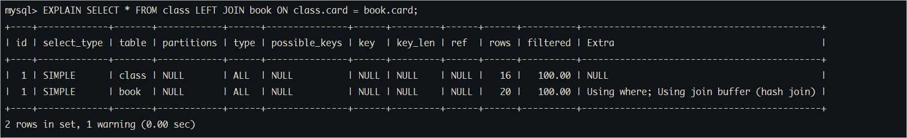
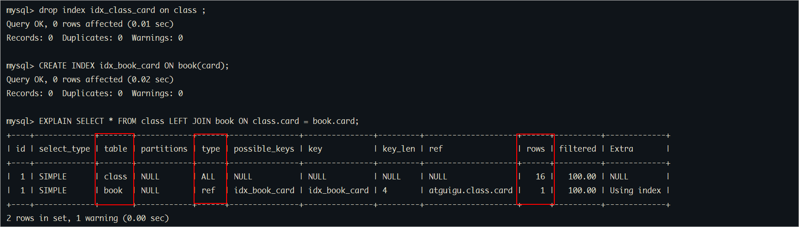
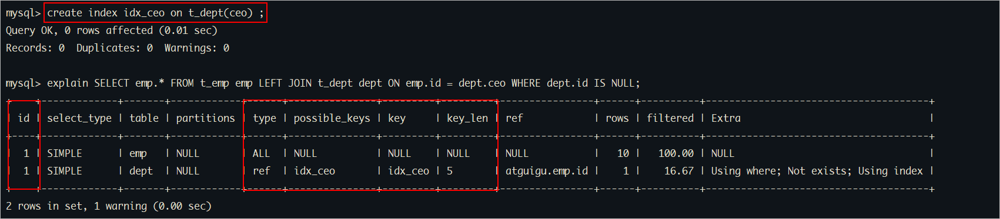

# 一、MySQL关联查询优化

## 1、数据准备

创建两张表，并分插入16条和20条数据：

```sql
-- 分类
CREATE TABLE IF NOT EXISTS `class` (
`id` INT(10) UNSIGNED NOT NULL AUTO_INCREMENT,
`card` INT(10) UNSIGNED NOT NULL,
PRIMARY KEY (`id`)
);
-- 图书
CREATE TABLE IF NOT EXISTS `book` (
`bookid` INT(10) UNSIGNED NOT NULL AUTO_INCREMENT,
`card` INT(10) UNSIGNED NOT NULL,
PRIMARY KEY (`bookid`)
);
 
-- 插入16条记录
INSERT INTO class(card) VALUES(FLOOR(1 + (RAND() * 20)));
INSERT INTO class(card) VALUES(FLOOR(1 + (RAND() * 20)));
INSERT INTO class(card) VALUES(FLOOR(1 + (RAND() * 20)));
INSERT INTO class(card) VALUES(FLOOR(1 + (RAND() * 20)));
INSERT INTO class(card) VALUES(FLOOR(1 + (RAND() * 20)));
INSERT INTO class(card) VALUES(FLOOR(1 + (RAND() * 20)));
INSERT INTO class(card) VALUES(FLOOR(1 + (RAND() * 20)));
INSERT INTO class(card) VALUES(FLOOR(1 + (RAND() * 20)));
INSERT INTO class(card) VALUES(FLOOR(1 + (RAND() * 20)));
INSERT INTO class(card) VALUES(FLOOR(1 + (RAND() * 20)));
INSERT INTO class(card) VALUES(FLOOR(1 + (RAND() * 20)));
INSERT INTO class(card) VALUES(FLOOR(1 + (RAND() * 20)));
INSERT INTO class(card) VALUES(FLOOR(1 + (RAND() * 20)));
INSERT INTO class(card) VALUES(FLOOR(1 + (RAND() * 20)));
INSERT INTO class(card) VALUES(FLOOR(1 + (RAND() * 20)));
INSERT INTO class(card) VALUES(FLOOR(1 + (RAND() * 20)));
 
-- 插入20条记录
INSERT INTO book(card) VALUES(FLOOR(1 + (RAND() * 20)));
INSERT INTO book(card) VALUES(FLOOR(1 + (RAND() * 20)));
INSERT INTO book(card) VALUES(FLOOR(1 + (RAND() * 20)));
INSERT INTO book(card) VALUES(FLOOR(1 + (RAND() * 20)));
INSERT INTO book(card) VALUES(FLOOR(1 + (RAND() * 20)));
INSERT INTO book(card) VALUES(FLOOR(1 + (RAND() * 20)));
INSERT INTO book(card) VALUES(FLOOR(1 + (RAND() * 20)));
INSERT INTO book(card) VALUES(FLOOR(1 + (RAND() * 20)));
INSERT INTO book(card) VALUES(FLOOR(1 + (RAND() * 20)));
INSERT INTO book(card) VALUES(FLOOR(1 + (RAND() * 20)));
INSERT INTO book(card) VALUES(FLOOR(1 + (RAND() * 20)));
INSERT INTO book(card) VALUES(FLOOR(1 + (RAND() * 20)));
INSERT INTO book(card) VALUES(FLOOR(1 + (RAND() * 20)));
INSERT INTO book(card) VALUES(FLOOR(1 + (RAND() * 20)));
INSERT INTO book(card) VALUES(FLOOR(1 + (RAND() * 20)));
INSERT INTO book(card) VALUES(FLOOR(1 + (RAND() * 20)));
INSERT INTO book(card) VALUES(FLOOR(1 + (RAND() * 20)));
INSERT INTO book(card) VALUES(FLOOR(1 + (RAND() * 20)));
INSERT INTO book(card) VALUES(FLOOR(1 + (RAND() * 20)));
INSERT INTO book(card) VALUES(FLOOR(1 + (RAND() * 20)));
```

## 2、左外连接

没有创建索引前的测试： 进行了全表扫描，查询次数为16*20

```sql
EXPLAIN SELECT * FROM class LEFT JOIN book ON class.card = book.card;
-- 左表class：驱动表、右表book：被驱动表
```

执行结果如下所示：



### ①测试1
在驱动表上创建索引：进行了全索引扫描，查询次数是16*20<br/>

```sql
-- 创建索引
CREATE INDEX idx_class_card ON class(card);
```

执行结果如下所示：


### ②测试2
仅在被驱动表上创建索引：可以避免全表扫描，查询次数是16*1

```sql
-- 首先删除之前创建的索引
drop index idx_class_card on class ;

-- 创建索引
CREATE INDEX idx_book_card ON book(card);
```

执行结果如下所示：




### ③测试3
同时给两张表添加索引：充分利用了索引，查询次数是16*1

```sql
-- 已经有了book索引
CREATE INDEX idx_class_card ON class(card);
```

执行结果如下所示：


结论：针对两张表的连接条件涉及的列，索引要创建在被驱动表上，驱动表尽量是小表

## 3、内连接

测试：将前面外连接中的LEFT JOIN 变成 INNER JOIN

```sql
-- 换成inner join
EXPLAIN SELECT * FROM class INNER JOIN book ON class.card=book.card;

-- 交换class和book的位置
EXPLAIN SELECT * FROM book INNER JOIN class ON class.card=book.card;
```

### ①都有索引
查询优化器自动选择数据量小的表做为驱动表


### ②仅class表有索引
book表是驱动表


<br/>

### ③book表有索引
class表是驱动表


<br/>

### ④都没有索引
选择数据量小的表做为驱动表


### ⑤结论

- 发现即使交换表的位置，MySQL优化器也会自动选择驱动表。
- 自动选择驱动表的原则是：索引创建在被驱动表上，驱动表是小表。

<br/>

## 4、不同查询方式对比
### ①准备数据
需求：查询每一个人物所对应的掌门人名称

```sql
CREATE TABLE `t_dept` (
 `id` INT NOT NULL AUTO_INCREMENT,
 `deptName` VARCHAR(30) DEFAULT NULL,
 `address` VARCHAR(40) DEFAULT NULL,
 PRIMARY KEY (`id`)
);
 
CREATE TABLE `t_emp` (
 `id` INT NOT NULL AUTO_INCREMENT,
 `name` VARCHAR(20) DEFAULT NULL,
 `age` INT DEFAULT NULL,
 `deptId` INT DEFAULT NULL,
`empno` INT NOT NULL,
 PRIMARY KEY (`id`),
 KEY `idx_dept_id` (`deptId`)
 #CONSTRAINT `fk_dept_id` FOREIGN KEY (`deptId`) REFERENCES `t_dept` (`id`)
);

INSERT INTO t_dept(id,deptName,address) VALUES(1,'华山','华山');
INSERT INTO t_dept(id,deptName,address) VALUES(2,'丐帮','洛阳');
INSERT INTO t_dept(id,deptName,address) VALUES(3,'峨眉','峨眉山');
INSERT INTO t_dept(id,deptName,address) VALUES(4,'武当','武当山');
INSERT INTO t_dept(id,deptName,address) VALUES(5,'明教','光明顶');
INSERT INTO t_dept(id,deptName,address) VALUES(6,'少林','少林寺');

INSERT INTO t_emp(id,NAME,age,deptId,empno) VALUES(1,'风清扬',90,1,100001);
INSERT INTO t_emp(id,NAME,age,deptId,empno) VALUES(2,'岳不群',50,1,100002);
INSERT INTO t_emp(id,NAME,age,deptId,empno) VALUES(3,'令狐冲',24,1,100003);

INSERT INTO t_emp(id,NAME,age,deptId,empno) VALUES(4,'洪七公',70,2,100004);
INSERT INTO t_emp(id,NAME,age,deptId,empno) VALUES(5,'乔峰',35,2,100005);

INSERT INTO t_emp(id,NAME,age,deptId,empno) VALUES(6,'灭绝师太',70,3,100006);
INSERT INTO t_emp(id,NAME,age,deptId,empno) VALUES(7,'周芷若',20,3,100007);

INSERT INTO t_emp(id,NAME,age,deptId,empno) VALUES(8,'张三丰',100,4,100008);
INSERT INTO t_emp(id,NAME,age,deptId,empno) VALUES(9,'张无忌',25,5,100009);
INSERT INTO t_emp(id,NAME,age,deptId,empno) VALUES(10,'韦小宝',18,NULL,100010);

-- 给t_dept表添加ceo字段，该字段的值为t_emp表的id
ALTER TABLE t_dept ADD CEO INT(11);
UPDATE t_dept SET CEO=2 WHERE id=1;
UPDATE t_dept SET CEO=4 WHERE id=2;
UPDATE t_dept SET CEO=6 WHERE id=3;
UPDATE t_dept SET CEO=8 WHERE id=4;
UPDATE t_dept SET CEO=9 WHERE id=5;
```

<br/>

### ②方式一：三表左连接方式

```sql
-- 员工表(t_emp)、部门表(t_dept)、ceo(t_emp)表 关联查询
EXPLAIN SELECT emp.name, ceo.name AS ceoname 
FROM t_emp emp
LEFT JOIN t_dept dept ON emp.deptid = dept.id 
LEFT JOIN t_emp ceo ON dept.ceo = ceo.id;
```

执行结果如下所示：


一趟查询，用到了主键索引，**效果最佳**

<br/>

### ③方式二：子查询方式

```sql
explain SELECT 
emp.name, 
(SELECT ceo.name FROM t_emp ceo WHERE ceo.id = dept.ceo) AS ceoname
FROM t_emp emp
LEFT JOIN t_dept dept ON emp.deptid = dept.id;
```

执行结果如下所示：


两趟查询，用到了主键索引，跟第一种比，效果稍微差点。

<br/>

### ④方式三：在 FROM 子句使用临时表

```sql
EXPLAIN SELECT emp_with_ceo_id.name, emp.name AS ceoname FROM 
-- 查询所有员工及对应的ceo的id
( 
SELECT emp.name, dept.ceo 
FROM t_emp emp 
LEFT JOIN t_dept dept ON emp.deptid = dept.id 
) emp_with_ceo_id
LEFT JOIN t_emp emp ON emp_with_ceo_id.ceo = emp.id;
```

执行结果如下所示：


查询一趟，**MySQL查询优化器将衍生表查询转换成了连接表查询**，速度堪比第一种方式

<br/>

### ⑤方式四：在 JOIN 子句使用临时表

```sql
explain SELECT emp.name, ceo.ceoname FROM t_emp emp LEFT JOIN
( 
SELECT emp.deptId AS deptId, emp.name AS ceoname 
FROM t_emp emp 
INNER JOIN t_dept dept ON emp.id = dept.ceo 
) ceo
ON emp.deptId = ceo.deptId;

-- 查询并创建临时表ceo：包含ceo的部门id和ceo的name
```

执行结果如下所示：


查询一趟，MySQL查询优化器将衍生表查询转换成了连接表查询，但是只有一个表使用了索引，数据检索的次数稍多，性能最差。

### ⑥总结
能够直接多表关联的尽量直接关联，不用子查询。(减少查询过程中大步骤的数量)

<br/>

# 二、MySQL子查询优化
需求：查询非掌门人的信息

## 1、方式一

```sql
-- 查询员工，这些员工的id没在（掌门人id列表中）
-- 【查询不是CEO的员工】
explain SELECT * FROM t_emp emp WHERE emp.id NOT IN 
(SELECT dept.ceo FROM t_dept dept WHERE dept.ceo IS NOT NULL);
```

执行结果如下所示：


<br/>

## 2、方式二

```sql
-- 推荐
explain SELECT emp.* FROM t_emp emp LEFT JOIN t_dept dept ON emp.id = dept.ceo WHERE dept.id IS NULL;
```

执行结果如下所示：


<br/>

也可以为ceo添加一个索引字段：



<br/>

## 3、总结
- 实现同样的效果，关联查询要好于子查询
- 尽量不要使用NOT IN 或者 NOT EXISTS，用LEFT JOIN xxx ON xx = xx WHERE xx IS NULL替代

<br/>

# 三、MySQL排序优化
## 1、排序索引失效情况
### ①未使用过滤条件，索引无效

准备工作：
```sql
-- 删除emp表中的所有的索引
-- 创建新的索引结构
CREATE INDEX idx_age_deptid_name ON emp (age,deptid,`name`);
```

SQL演示：

```sql
-- 没有过滤条件，索引不生效：
-- order by语句如果没有使用索引，在extra中会出现using filesort。
EXPLAIN SELECT * FROM emp ORDER BY age,deptid;

-- 附加过滤条件，使索引生效（以 limit 子句作为过滤条件）：
EXPLAIN SELECT * FROM emp ORDER BY age,deptid LIMIT 10;

-- 附加过滤条件，使索引生效（以 where 子句作为过滤条件）：
EXPLAIN SELECT * FROM emp where age>50 ORDER BY age,deptid;
```

执行结果如下所示：


<br/>

### ②方向不一致，索引无效

SQL演示：<br/>

```sql
-- 排序使用了索引：排序条件和索引一致，并方向相同，可以使用索引
EXPLAIN SELECT * FROM emp WHERE age=45 ORDER BY deptid DESC, `name` DESC;

-- 排序未使用索引
EXPLAIN SELECT * FROM emp WHERE age=45 ORDER BY deptid ASC, `name` DESC;
```

<br/>

### ③其它细节
```sql
-- 更多细节例子：
-- 排序使用了索引
-- 注意：key_len = 5是where语句使用age索引的标记，order by语句使用索引不在key_len中体现。
EXPLAIN SELECT * FROM emp WHERE age=45 ORDER BY deptid;

-- 排序使用了索引
EXPLAIN SELECT * FROM emp WHERE age=45 ORDER BY deptid, `name`;

-- 排序未使用索引：empno 字段未出现在索引中
EXPLAIN SELECT * FROM emp WHERE age=45 ORDER BY deptid, empno;

-- 排序未使用索引：排序字段顺序与索引不一致
EXPLAIN SELECT * FROM emp WHERE age=45 ORDER BY `name`, deptid;

-- 排序没有使用索引：排序在条件过滤之后执行，条件过滤没有遵循最左前缀法则
EXPLAIN SELECT * FROM emp WHERE deptid=45 ORDER BY age;
```

<br/>

## 2、排序优化案例

排序优化的目的是，去掉 Extra 中的 using filesort，但这仅仅只是一个局部，更重要的是SQL本身执行效率足够高<br/>

```sql
# ★★★准备工作 01：删除所有之前的索引
drop index idx_age_name on emp;

# ★★★准备工作 02：开启 profile 功能
SET profiling = 1;
set profiling_history_size=100;

# ★★★测试场景 01：无任何索引
# 执行 SQL 语句，配合 show profiles 查看消耗时间
select * from emp where emp.age = 30 and emp.empno < 101000 order BY emp.`name` ;
# 执行耗时： 0.16191375
show profiles ;
# Explain 分析查看索引是否生效：当前情况下没有索引，当然不可能有索引生效
explain select * from emp where emp.age = 30 and emp.empno < 101000 order BY emp.`name` ;

# ★★★测试场景 02：创建一个索引覆盖 SQL 语句中用到的所有字段
CREATE INDEX idx_age_empno_name ON emp (age,empno,`name`);

# 执行 SQL 语句，配合 show profiles 查看消耗时间
select * from emp where emp.age = 30 and emp.empno < 101000 order BY emp.`name` ;
# 执行耗时：0.00146125
show profiles ;
# Explain 分析查看索引是否生效：索引生效
# key_len 值：9=5+4 说明索引生效的字段是 emp.age 和 emp.empno
# 总结：最后的name索引没有用到，出现了Using filesort。
# 原因是，因为empno是一个范围过滤，所以索引后面的字段不会再使用索引了。
# 所以当前方案没有达到最佳的理想状态。
explain select * from emp where emp.age = 30 and emp.empno < 101000 order BY emp.`name` ;

# ★★★测试场景 03：想办法去掉 Using filesort
# 要想去掉 Using filesort，那么就必须保证排序时能够用上索引
# 为此思路就是：在过滤条件中，不给 empno 创建索引；然后创建索引时把排序中用到的 name 字段包含进去
# 操作 01：删除上一步创建的索引
drop index idx_age_empno_name on emp;

# 操作 02：创建索引包含 age 和 name 两个字段
create index idx_age_name on emp(age, name);

# 执行 SQL 语句，配合 show profiles 查看消耗时间
select * from emp where emp.age = 30 and emp.empno < 101000 order BY emp.`name` ;
# 执行耗时：0.29925475
show profiles ;
# Explain 分析查看索引是否生效：索引生效了，排序也用到了索引
# key_len 值：5 说明只有 age 字段
# 总结 01：排序使用的字段不进入 key_len 计算
# 总结 02：排序用到了索引，但是性能反而大幅度下降
# 总结 03：排序之前的过滤条件 emp.empno < 101000 没有用到索引，花费了大量时间
explain select * from emp where emp.age = 30 and emp.empno < 101000 order BY emp.`name` ;

# ★★★测试场景 04：让过滤条件使用索引，排序不使用索引
# 操作 01：删除上一步创建的索引
drop index idx_age_name on emp;

# 操作 02：创建索引包含 age 和 empno 两个字段
create index idx_age_empno on emp(age, empno);

# 执行 SQL 语句，配合 show profiles 查看消耗时间
select * from emp where emp.age = 30 and emp.empno < 101000 order BY emp.`name` ;
# 执行耗时：0.00151575
show profiles ;
# Explain 分析查看索引是否生效：过滤条件用到了索引，排序没有用到索引
# key_len 值：9=5+4 说明索引生效的字段是 emp.age 和 emp.empno
# 总结：所有的排序都是在条件过滤之后才执行的，所以，如果条件过滤掉大部分数据的话，剩下几百几千条数据进行排序其实并不是很消耗性能，
# 即使索引优化了排序，但实际提升性能很有限。  相对的**empno < 101000** 这个条件，如果没有用到索引的话，要对几万条的数据进行扫描，这是非
# 常消耗性能的，所以索引放在这个字段上性价比最高，是最优选择。
explain select * from emp where emp.age = 30 and emp.empno < 101000 order BY emp.`name` ;

# 综合对比
# 未创建索引：           0.16191375
# 过滤条件用到了索引：     0.00146125
# 过滤条件未充分使用索引：  0.29925475
# 过滤条件用到了索引：     0.00151575

# ★★★结论：当【范围条件】和【group by 或者 order by】的字段出现二选一时，优先观察条件字段的过滤数量，如果过滤的数据足够多，而需要排序的数据并不多时，优先把索引放在范围字段上。也可以将选择权交给MySQL：索引同时存在，MySQL自动选择最优的方案：（对于这个例子，MySQL选择idx_age_empno），但是，随着数据量的变化，选择的索引也会随之变化。
```

<br/>

## 3、双路排序和单路排序

如果排序没有使用索引，引起了filesort，那么filesort有两种算法

- 双路排序
- 单路排序

### ①双路排序


原理：第一遍扫描出需要排序的字段，然后进行排序后，根据排序结果，第二遍再扫描一下需要select的列数据。这样会引起大量的随机IO，效率不高，但是节约内存。排序算法用的是快速排序，如果内存不够则会按照block进行排序，将排序结果写入磁盘文件，然后再将结果合并。

具体过程：<br/>

- ①读取所有满足条件的记录。
- ②对于每一行，存储一对值到缓冲区（排序列，行记录指针），一个是排序的索引列的值，即order by用到的列值，和指向该行数据的行指针。
- ③当缓冲区满后，运行一个快速排序来将缓冲区中数据排序，并将排序完的数据存储到一个临时文件，并保存一个存储块的指针，当然如果缓冲区不满，则不会创建临时文件了。
- ④重复以上步骤，直到将所有行读完，并建立相应的有序的临时文件。
- ⑤对块级进行排序，这个类似于归并排序算法，只通过两个临时文件的指针来不断交换数据，最终达到两个文件，都是有序的。
- ⑥重复5直到所有的数据都排序完毕。
- ⑦采取顺序读的方式，将每行数据读入内存，并取出数据传到客户端，这里读取数据时并不是一行一行读，读取缓存大小由read_rnd_buffer_size 来指定。

<br/>
总结：<br/>
双路排序采取的方法是快速排序 + 归并排序。<br/>
但有一个问题，就是，一行数据会被读两次，第一次是where条件过滤时，第二个是排完序后还得用行指针去读一次。<br/>
一个优化的方法是，直接读入数据，排序的时候也根据这个排序，排序完成后，就直接发送到客户端了——这就是下面要说的单路排序。<br/>

### ②单路排序

在MySQL4.1版本之前只有第一种排序算法双路排序，第二种算法是从MySQL4.1开始的改进算法，主要目的是为了减少第一次算法中需要两次访问表数据的IO操作，将两次变成了一次，但相应也会耗用更多的sort buffer空间。当然，MySQL4.1开始的以后所有版本同时也支持第一种算法。


具体过程：

- 读取满足条件的记录
- 对于每一行，记录排序的key和数据行指针，并且把要查询的列也读出来
- 根据索引key排序
- 读取排序完成的文件，并直接根据数据位置读取数据返回客户端，而不是去访问表

特点：

- 单路排序一次性将结果读取出来，然后在sort buffer中排序，避免了双路排序的两次读的随机IO。
- 这也有一个问题：当 select 获取的列很多的时候，排序起来就很占空间

<br/>

### ③结论及引申出的问题
- 单路比多路要多占用更多内存空间
- 因为单路是把所有字段都取出，所以有可能取出的数据的总大小超出了sort_buffer_size的容量，导致每次只能取sort_buffer_size容量大小的数据，进行排序（创建tmp文件，多路合并），排完再取sort_buffer容量大小，再排……从而多次I/O。
- 单路本来想省一次I/O操作，反而导致了大量的I/O操作，反而得不偿失。

<br/>

### ④排序优化策略
优化策略：
- 减少select 后面的查询的字段：order by时select * 是一个大忌，至少要把业务需要的字段明确写出来，不需要的一个都不写。
- 查询字段过多会占用sort_buffer_size的容量。可以考虑增大sort_buffer_size参数的设置：当然，要根据系统的能力去提高，因为这个参数是针对每个进程（connection）的 1M-8M之间调整。 MySQL8.0，InnoDB存储引擎默认值是1048576字节，1MB。

```sql
SHOW VARIABLES LIKE '%sort_buffer_size%'; -- 默认1MB
```

查看结果如下所示：


<br/>

- 增大**max_length_for_sort_data**参数的设置：MySQL根据max_length_for_sort_data变量来确定使用哪种算法，默认值是4096字节，如果需要返回的列的总长度**大于max_length_for_sort_data，使用双路排序算法**，否则使用单路排序算法。但是如果设的太高，数据总容量超出sort_buffer_size的概率就增大，明显症状是高的磁盘I/O活动和低的处理器使用率。1024-8192之间调整。

```sql
SHOW VARIABLES LIKE '%max_length_for_sort_data%'; -- 默认4K
```

查看结果如下所示：


**举例：**

- 1、如果数据总量很小（单路一次就可以读取所有数据），单条记录大小很大（大于4K，默认会使用双路排序），此时，可以增加 max_length_for_sort_data 的值，增加 sort_buffer_size 的值，让服务器默认使用单路排序。
- 2、如果数据总量很大（单路很多次IO才可以），单条记录大小很小（小于4K，默认会使用单路排序），此时，可以减小 max_length_for_sort_data 的值，让服务器默认使用双路排序。

<br/>

## 4、排序优化总结
- 最好的情况：排序能够用到索引
  - 包含过滤条件
  - 过滤条件要保证索引生效
  - 排序字段都出现在索引中
  - 排序字段出现顺序和索引中一致
  - 排序字段排序的方向一致
- 其次的情况：单路排序，只有一次I/O
  - max_length_for_sort_data参数设置的值能够容纳当前要读取的所有字段（排序字段+select字段）
  - sort_buffer_size参数设置的值能够容纳所有读取的数据
- 再次的情况：双路排序，两次I/O
- 最差的情况：单路排序，多次I/O

<br/>

# 三、MySQL分组优化
- 1、group by 使用索引的原则几乎跟order by一致。但是**group by 即使没有过滤条件用到索引，也可以直接使用索引**（Order By 必须有过滤条件才能使用上索引）
- 2、包含了order by、group by、distinct这些查询的语句，where条件过滤出来的结果集请保持在1000行以内，否则SQL会很慢。
- 3、group by和数据过滤：能在分组前过滤数据，就尽量分组前过滤，这样可以让分组操作面对的数据量更小
  - where 子句过滤数据
  - having 子句过滤数据

```sql
# 底层执行 SQL 语句时，和编写 SQL 语句的顺序一样，先执行 where 子句的过滤条件
# 在 where 子句过滤结果的基础上执行分组操作
# 分组之后再执行 having 子句的过滤条件
select avg(age) avg_age, deptId from emp where empno>100000 group by deptId having avg_age>40;
```

<br/>

# 四、覆盖索引优化
创建索引时，让索引中包含的字段，尽量和select子句要查询的字段匹配，如果能够不回表，那就又节约一定的时间
- 1、禁止使用select *，禁止查询与业务无关字段
  - select * 危害1：有可能导致单路排序多次I/O
  - select * 危害2：有可能导致本来不需要回表的操作，现在需要回表
  - select * 危害3：SQL 语句可读性降低，从 SQL 语句本身看不出来要查询哪些字段
- 2、尽量利用覆盖索引


