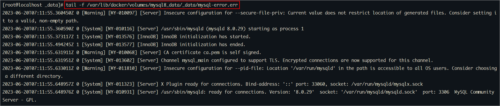
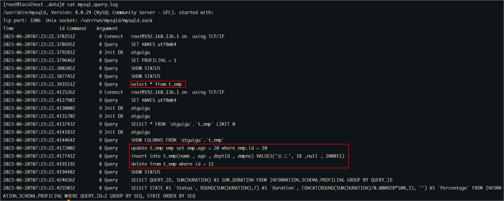

# 一、日志分类

在任何一种数据库中，都会有各种各样的日志，记录着数据库工作的方方面面，以帮助数据库管理员追踪数据库曾经发生过的各种事件。<br/>
MySQL有多种类型的日志，用于记录数据库的操作和状态。以下是一些常见的MySQL日志：

- 错误日志（Error Log）：记录MySQL服务器在启动、运行过程中发生的错误和异常情况，如启动错误、语法错误等。
- 查询日志（Query Log）：记录所有执行的SQL语句，包括SELECT、INSERT、UPDATE、DELETE等操作。可以用于分析查询性能和调试问题，但需要注意对于高负载的系统，开启查询日志可能会对性能产生影响。
- 慢查询日志（Slow Query Log）：记录执行时间超过指定**阈值**的查询语句。慢查询日志可以帮助你找出执行时间较长的查询，以便进行性能优化。
- 二进制日志（Binary Log）：记录所有对数据库的更改操作，包括数据修改、表结构变更等。二进制日志可以用于数据恢复、主从复制等场景。
- 事务日志（Transaction Log）：包括Redo Log和Undo Log，记录正在进行的事务的更改操作。事务日志用于保证数据库的ACID特性，并支持崩溃恢复。

# 二、错误日志

错误日志是 MySQL 中最重要的日志之一，它记录了当 mysqld 启动和停止时，以及服务器在运行过程中发生任何严重错误时的相关信息。<br/>
当数据库出现任何故障导致无法正常使用时，可以首先查看此日志。

<br/>

查看日志位置指令：
```sql
show variables like 'log_error%';
```

执行结果如下所示：


log_error设置为stderr并且MySQL以守护进程（daemon）方式运行，<br/>
那么错误日志将被重定向到系统日志文件（如/var/log/syslog）或其他操作系统特定的日志文件中，而不是直接输出到控制台。<br/>
可以通过如下配置，设置错误日志的输出位置：<br/>

打开MySQL的配置文件my.cnf。该文件通常位于MySQL安装目录下的/etc或者/etc/mysql子目录中。

```shell
[mysqld]
log_error = /var/lib/mysql/mysql-error.err
```

重启mysql进行测试。

<br/>

查看日志内容 ：

```sql
tail -f /var/lib/docker/volumes/mysql8_data/_data/mysql-error.err
```



<br/>

# 三、查询日志

查询日志中记录了客户端的所有操作语句【CRUD】，而二进制日志不包含查询数据的SQL语句。

默认情况下， 查询日志是未开启的。如果需要开启查询日志，可以设置以下配置 ：

```sql
# 该选项用来开启查询日志 ， 可选值 ： 0 或者 1 ； 0 代表关闭， 1 代表开启 
general_log = 1

# 设置日志的文件名 ， 如果没有指定， 默认的文件名为 host_name.log 
general_log_file=file_name
```


在mysql 的配置文件 /var/lib/mysql/my.cnf 中配置如下内容 ：

```sql
general_log=1
general_log_file=mysql_query.log
```

配置完毕之后，在数据库执行以下操作 ：

```sql
select * from emp ;
update emp set age = 20 where id = 10 ;
insert into emp(name , age , deptId , empno) VALUES('张三', 18 ,null , 100011) ;
delete from emp where id = 11 ;
```

执行完毕之后， 再次来查询日志文件 ：



<br/>

开启查询日志注意事项：

1、开启查询日志会对MySQL的性能产生一定影响，特别是在高负载环境下。因此，在生产环境中建议谨慎使用，并根据需要进行开启和关闭。

2、查询日志可能会记录大量的查询语句，导致日志文件过大。可以通过定期清理或限制日志文件大小来处理这个问题。

3、查询日志可能会包含敏感信息（如密码），因此要确保只有授权的人员可以访问查询日志文件。

<br/>

# 四、慢查询日志

慢查询日志记录了所有执行时间超过参数 long_query_time 设置值，long_query_time 默认为 10 秒，最小为 0，精度可以到微秒。

## 1、日志参数配置
默认情况下，MySQL数据库没有开启慢查询日志，需要我们手动来设置这个参数。<br/>
当然，如果不是调优需要的话，一般不建议启动该参数，因为开启慢查询日志会或多或少带来一定的性能影响。<br/>
还是在my.cnf中修改以下参数来控制慢查询日志：

```shell
# 该参数用来控制慢查询日志是否开启， 可取值： 1 和 0 ， 1 代表开启， 0 代表关闭
slow_query_log=1 

# 该参数用来指定慢查询日志的文件名
slow_query_log_file=slow_query.log

# 该选项用来配置查询的时间限制， 超过这个时间将认为值慢查询， 将需要进行日志记录， 默认10s
long_query_time=10
```

重启mysql进行测试。

## 2、日志内容读取

和错误日志、查询日志一样，慢查询日志记录的格式也是纯文本，可以被直接读取。

1、查询慢查询是否开启以及日志文件位置

```sql
SHOW VARIABLES LIKE '%slow_query_log%'; 
```

2、查询long_query_time 的值。

```sql
SHOW VARIABLES LIKE '%long_query_time%'; -- 查看值：默认10秒
```

3、执行查询操作

```sql
select * from emp ;
```

由于在查询的执行时间小于10s，因此该查询不会记录到慢查询日志中。模拟慢查询效果：
```sql
select * from emp where id = 10 and sleep(11) ;   -- 使用SLEEP函数可以让查询暂停指定的时间
```

查看慢查询日志内容：


