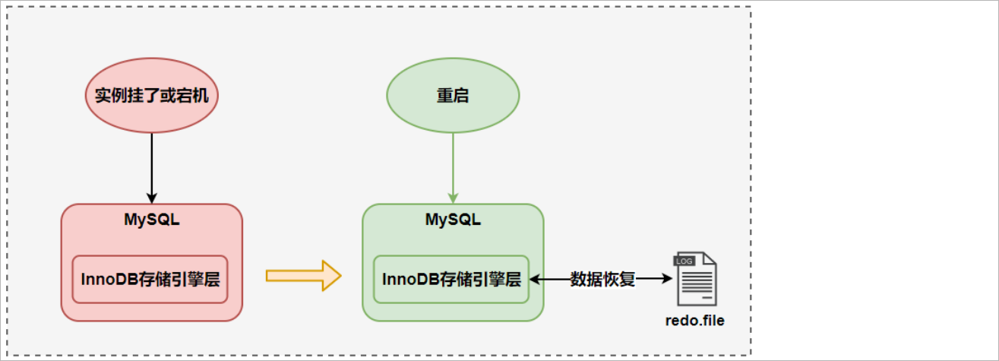
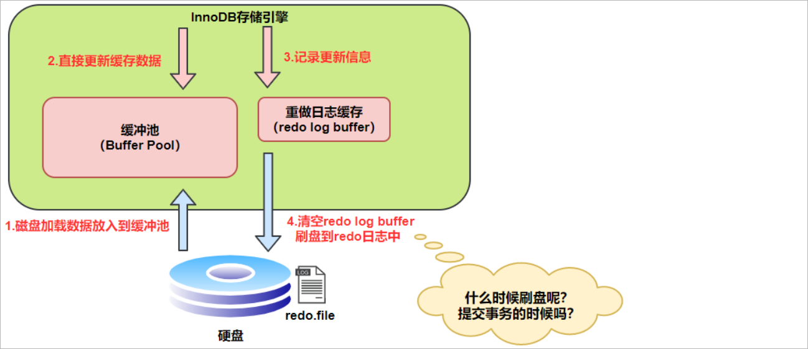
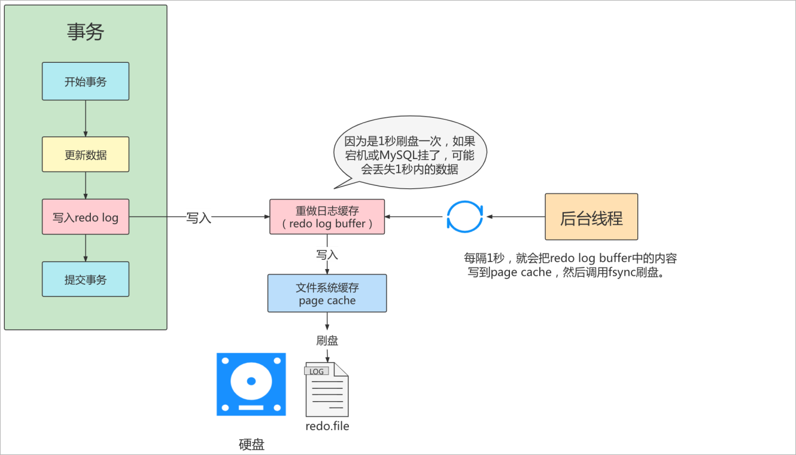
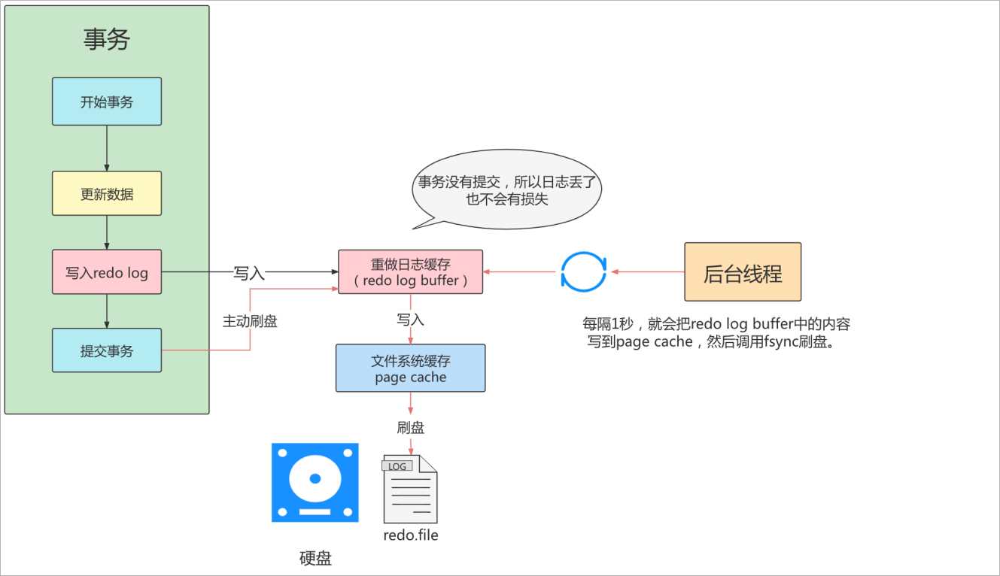
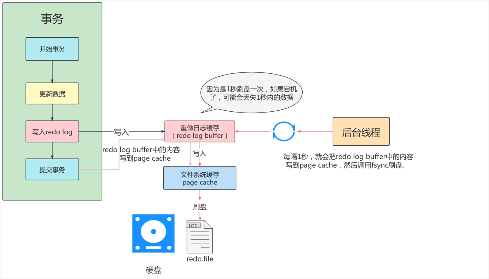
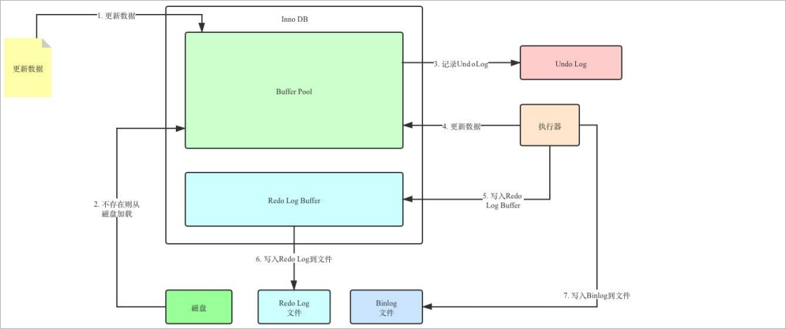
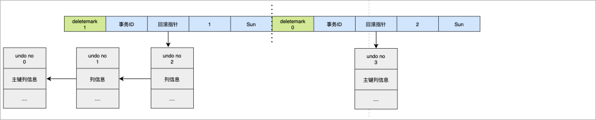

# 一、事务概念回顾
概述：就是由多个操作组成的一个逻辑单元，组成这个逻辑单元的多个操作要么都左要么都不做。<br/>
作用：保证数据的一致性<br/>
举例：转账<br/>

# 二、ACID四大特性
## 1、A：原子性(Atomicity)

数据库系统把事务中包含的多个操作视为逻辑上的一个整体，要么全部都执行，要不一个都不执行，没有中间状态<br/>

## 2、C：一致性(Consistency)

事务的一致性指的是在一个事务执行之前和执行之后数据库都必须处于一致性的状态。<br/>
为了做到这一点，一个事务(transaction)中的所有操作，要么全部完成，要么全部不完成，不会结束在中间某个环节。<br/>
事务在执行过程中发生错误，会被回滚（Rollback）到事务开始前的状态，就像这个事务从来没有执行过一样。<br/>

## 3、I：隔离性(Isolation)

指的是在并发环境中，当不同的事务同时操纵相同的数据时，每个事务都有各自的完整数据空间。由并发事务所做的修改必须与任何其他并发事务所做的修改隔离。<br/>
事务查看数据更新时，数据所处的状态要么是另一事务修改它之前的状态，要么是另一事务修改它之后的状态，事务不会查看到中间状态的数据。<br/>

## 4、D：持久性(Durability)

指的是只要事务成功结束，它对数据库所做的更新就必须保存下来。即使发生系统崩溃，重新启动数据库系统后，数据库还能恢复到事务成功结束时的状态。<br/>

底层原理：
- 1、事务的隔离性由 **锁机制** 实现。
- 2、事务的原子性、一致性依赖数据库底层的回滚操作，而回滚操作由**undo日志**实现。
- 3、事务的持久性由**redo日志**实现。

<br/>

|英文名称|中文名称|说明|
|---|---|---|
|redo log|重做日志|记录了对数据库进行修改的操作，包括插入、更新和删除等<br/>主要作用是保证数据库的持久性和恢复能力|
|undo log|回滚日志|记录了对数据库进行修改的操作的**逆操作**，用于实现事务的回滚和MVCC（多版本并发控制）|

<br/>

# 三、redo日志
## 1、innodb写数据过程
innodb存储引擎是以**页为单位**来管理存储空间的。在真正访问页面之前，需要把磁盘上的页缓存到内存【**Buffer Pool**】之后在可以访问。<br/>
所有的变更必须**先更新缓存池**中的数据。<br/>
然后缓存池中的**脏页**会以一定的频率被刷到磁盘，通过缓存池来优化CPU和磁盘之间的性能鸿沟。<br/>

## 2、redo日志的意义

### ①没有redo log存在的问题

缓冲池可以帮助我们消除CPU和磁盘之间性能上的鸿沟，checkpoint机制可以保证数据的最终落盘，然而由于checkpoint **并不是每次变更的时候就触发的**，<br/>
而是master线程隔一段时间去处理的。所以最坏的情况就是事务提交后，刚写完缓冲池，数据库服务器宕机了，那么这段数据就是丢失的，无法恢复。<br/>

> checkPoint（检查点）机制主要的作用是将缓冲池中的脏页刷新到磁盘

<br/>

### ②事务的持久性怎么保证

事务包含持久性的特性，就是说对于一个已经提交的事务，在事务提交后即使系统发生了崩溃，这个事务对数据库中所做的更改也不能丢失。

#### [1]方案一

在事务提交完成之前把该事务所修改的所有页面都刷新到磁盘，但是这个简单粗暴的做法有些问题

**1、修改量与刷新磁盘工作量严重不成比例**

有的时候我们仅仅修改了一个页中的某一个字节，但是我们都知道在innodb中是以页为单位来进行磁盘io的，也就是说我们在进行事务提交的时候不得不将一个完整的页面从内存刷到磁盘，我们都知道一个页面是16KB，只修改了一个字节就需要刷新16KB的数据到磁盘显然有点小题大做。

**2、随机IO刷新较慢**

一个事务可能包含很多个语句，即使一条语句可能也**会修改很多页面**，假如该事务修改的这些页面可能并不相邻，这就意味着在将某个事务修改的Buffer Pool的页刷新到磁盘时，需要进行很多的磁盘IO，随机IO比顺序IO慢，尤其对传统的机械磁盘来说。

#### [2]方案二

我们只是想让已经提交了的事务对数据库中数据所做的修改永久生效，即使后来系统崩溃，在重启后也能把这种修改恢复出来。<br/>
所以我们其实没有必要在每次事务提交时就把该事务在内存中修改过的全部页面刷新到磁盘，只需要把**修改了哪些东西记录一下**就好。<br/>
比如，某个事务将系统中第0号表空间中第10号页面中偏移量为100处的那个字节的值 1 改成 2 。<br/>
我们只需要记录一下：将第0号表空间的10号页面的偏移量为100处的值更新为2。<br/>
然后根据记录定期更新磁盘（不是每次提交事务时更新磁盘）<br/>
宕机重启后，读取这里的记录，把未写入磁盘的记录依次执行完即可<br/>
而且要求这样的记录写入完成才算事务提交成功<br/>
这样就保证了数据的修改一定可以写入磁盘<br/>

<br/>

Innodb 引擎采用的就是方案二。<br/>
Innodb 引擎采用的是WAL技术(write-ahead logging)，这种技术就是先写日志，再写磁盘，只有日志写入成功，才算事务提交成功，这里的日志就是 redo log。<br/>

redo  log可以简单分为以下两个部分：<br/>
1、重做日志的缓冲 (**redo log buffer**)，保存在内存中，是易失的。redo log buffer 大小，默认 16M ，最大值是4096M，最小值为1M。

```sql
show variables like '%innodb_log_buffer_size%';
```

2、重做日志文件 (**redo log file**) ，保存在硬盘中，是持久的。redo log日志文件如下所示：


整体写数据的流程如下所示：


整体流程说明：

- 第1步：先将原始数据从磁盘中读入内存中来，修改数据的内存拷贝
- 第2步：生成一条重做日志并写入redo log buffer，记录的是数据被修改后的值
- 第3步：当事务commit时，将redo log buffer中的内容刷新到 redo log file，对redo log file采用追加写的方式
- 第4步：定期将内存中修改的数据刷新到磁盘中

<br/>

当发生宕机且数据未刷新到磁盘的时候，可以通过redo log来恢复，保证了ACID中的D，这就是redo log的作用。



## 3、redo log的好处和特点

优点：

1、redo日志降低了刷盘频率

2、redo日志占用的空间非常小

特点：

1、redo日志是顺序写入磁盘的

2、事务执行过程中，redo log不断记录

## 4、redo log的刷盘策略

redo log的写入并不是直接写入磁盘的，InnoDB引擎会在写redo log的时候先写redo log buffer，之后以一定策略将redo log buffer刷入到真正的 redo log file 中。<br/>
这里的策略这就是我们要说的刷盘策略。<br/>



**注意**：redo log buffer刷盘到redo log file的过程并不是真正的刷到磁盘中去，只是刷入到 **文件系统缓存**（page cache）中去（这是现代操作系统为了提高文件写入效率做的一个优化），真正的写入会**交给系统自己来决定**（比如page cache足够大了）。
那么对于InnoDB来说就存在一个问题，如果交给系统来同步，同样如果系统宕机，那么数据也丢失了（虽然整个系统宕机的概率还是比较小的）。<br/>
针对这种情况，InnoDB给出 **innodb_flush_log_at_trx_commit** 参数，该参数控制 commit提交事务时，如何将 redo log buffer 中的日志刷新到 redo log file 中。

```sql
-- 查看innodb_flush_log_at_trx_commit变量的值
SHOW VARIABLES LIKE '%innodb_flush_log_at_trx_commit%';
```

它支持三种策略：

1、**设置为0** ：表示每次事务提交时不进行刷盘操作【不往文件系统中写】。（系统默认master thread每隔1s进行一次重做日志的同步）。**性能最佳、数据风险较高。**



2、**设置为1** ：表示每次事务提交时都将进行同步，刷盘操作（ 默认值 ）。**数据安全性较高、性能稍差。**



3、**设置为2** ：表示每次事务提交时都只把 **redo log buffer 内容写入 page cache**，不进行同步。由os自己决定什么时候同步到磁盘文件。
**性能较高数据安全性较高**，在发生数据库故障时，可能会丢失最近提交的事务的数据，因为尚未刷新到磁盘上的日志文件中。



# 四、undo日志

## 1、undo日志简介

事务需要保证 **原子性** 、 **一致性** ，也就是事务中的操作要么全部完成，要么什么也不做。但有时候事务执行到一半会出现一些情况，比如：<br/>
情况一：事务执行过程中可能遇到各种错误，比如服务器本身的错误，操作系统错误，甚至是突然断电导致的错误。<br/>
情况二：程序员可以在事务执行过程中手动输入 ROLLBACK 语句结束当前事务的执行。<br/>
以上情况出现，我们需要把数据改回原先的样子，这个过程称之为 **回滚**，这样就像是什么都没做一样，所以符合一致性要求。<br/>

如何实现呢? 每当我们要对一条记录做改动时(INSERT、DELETE、UPDATE)，都需要**留一手** -------- 要把改动的东西记下来。比如：

1、你**插入一条记录**时，至少要把这条记录的**主键值记录**下来，之后回滚的时候只需要把这个**主键值**对应的**记录删除**掉就好了(对于INSER，INNODB存储引擎会完成一个DELETE)。

2、你**删除一条记录**时，至少把这条记录的**内容都记录**下来，这样之后回滚时再把这些内容组成的**记录插入**到表中就好了(对于每个DELETE，INNODB存储引擎会执行一个INSERT)。

3、你**修改一条记录**时，至少要把修改这条记录前的**旧值都记录**下来，这样之后回滚时把这条**记录更新**为旧值就好了(对于每个UPDATE,INNODB存储引擎会执行一个反向的UPDATE,将修改之前的行放回去)。

<br/>

MySQL把这些为了回滚而记录的这些内容称之为**撤销日志**或者**回滚日志**(undo log)

<br/>

redo log是事务持久性的保证，undo log是事务原子性、一致性的保证。在事务中**更新数据**的**前置操作**其实是要先写入一个undo log。


<br/>

undo日志作用：

- 1、回滚数据
- 2、MVCC

<br/>

## 2、undo log的生命周期
### ①undo log生成过程
#### [1]简要生成过程

假设有2个数值，分别为A=1和B=2, 然后将A修改为3，B修改为4

```shell
1、start transaction ;
2、记录A=1到undo log  ;
3、update A = 3		;
4、记录A=3到redo log  ;
5、记录B=2到undo log  ;
6、update B = 4 ;
7、记录B=4到redo log  ;
8、将redo log刷新到磁盘
9、commit
```

异常情况分析：

- 1、在1~7步骤的任意一步系统宕机，事务未提交，该事务就不会对磁盘上的数据有任何影响。
- 2、如果在8~9之间宕机，恢复之后可以选择回滚，也可以选择继续完成事务提交，因为此时redo log已经持久化。
- 3、若在9之后系统宕机，数据库表中的数据（Buffer Pool）还来不及刷回磁盘，那么系统恢复之后，可以根据redo log把数据刷回磁盘。

<br/>

**只有Buffer Pool没有Redo Log和Undo log的流程：**


**有了Redo Log和Undo Log之后：**



在更新Buffer Pool中数据之前，我们需要先将该数据事务开始之前的状态写入Undo log中。假设更新到一半出错了，我们就可以通过Undo log来回滚

到事务开始前。

<br/>

#### [2]详细生成过程

对于InnoDB引擎来说，每个行记录（数据库表中的记录本身）除了记录本身的数据之外，还有几个隐藏的列：

1、DB_ROW_ID: 如果没有为表显式的定义主键，并且表中也没有定义非空唯一索引，那么InnoDB会自动为表添加一个row_id的隐藏列作为主键。

2、DB_TRX_ID: 每个事务都会分配一个事务的ID，当对某条记录发生变更时，就会将这个事务的事务ID写入trx_id中。

3、DB_ROLL_PTR: 回滚指针，本质上就是指向undo log的指针。


<br/>

假设在一个事务中先执行一个INSERT操作：

```sql
begin;
INSERT INTO user (name) VALUES ("tom");
```

插入的数据都会生成一条insert undo log , 并且数据的回滚指针会指向它。undo log会记录undo log的序号，插入主键的列和值...., 那么在进行rollback的时候，通过主键直接把对应的数据删除即可。


<br/>

接下来，我们在insert操作之后，继续执行UPDATE操作：<br/>

对于更新的操作会产生update undo log，并且会分更新主键的和不更新主键的，假设现在执行：

```sql 
update user set name = 'Sun' where id = 1 ;
```


这时，为了能够对update操作执行回滚，会把老的记录写入新的undo log<br/>
让回滚指针指向新的undo log，它的undo log的编号是1，并且新的undo log会指向上一条insert语句的undo log(undo no = 0)。

假设现在执行：

```sql
update user set id = 2 where id = 1 ;
```



对于更新主键的操作，会先**把原来的数据deletemark标识打开**（打开deletemark意思是把当前记录标记为“待删除”，等待MySQL的**清理线程**执行真正的删除），然后在后面插入

一条新的数据，新数据也会产生undo log，并且undo log的序号会递增。

<br/>

可以发现每次对数据的变更都会产生一个undo log，当一条记录被变更多次时，那么就会产生多条undo log，undo log记录的是变更前的日志，并且每

个undo log的序号是递增的，那么要当回滚的时候，按照序号依次向前，这样就会找到原始数据了。

### ②回滚流程

以上面的例子来说，假设执行rollback，那么对应的流程应该是这样：

- 1、通过undo no=3的日志把id=2的数据删除
- 2、通过undo no=2的日志把id=1的数据的deletemark还原成0
- 3、通过undo no=1的日志把id=1的数据的name还原成Tom
- 4、通过undo no=0的日志把id=1的数据删除

所以总的来说，回滚操作就是从最后一条undo Log开始，按照undo Log no依次执行逆操作，所有逆操作都执行完，数据也就全部恢复了

<br/>

### ③undo log的删除

- 1、针对于insert undo log 因为insert操作的记录，只对事务本身可见，对其他事务不可见。故该undo log可以在事务提交后直接删除，不需要进行purge操作。
  - 之所以只对事务本身可见，对其它事务不可见，是因为insert操作的是原本数据库表里面没有的数据，不可能和其它事务共享、相关
- 2、针对于update undo log 该undo log可能需要提供MVCC机制，因此不能在事务提交时就进行删除。提交时放入undo log链表，等待purge线程进行最后的删除。
  - update和delete操作的是数据库表中原本存在的数据，有可能和其它事务存在关联

> purge线程：用于删除不再使用、过期的undo Log数据

<br/>

## 3、undo log存储结构
### ①回滚段与undo页
InnoDB对undo log的管理采用段的方式，也就是回滚段（**rollback segment**）。<br/>
每个回滚段记录了 1024 个 **undo log segment** ，而在每个undo log segment段中进行 **undo页** (存储的就是回滚记录)的申请。<br/>
在 InnoDB1.1版本之前 （不包括1.1版本），只有一个rollback segment，因此支持同时在线的事务限制为 1024。<br/>
虽然对绝大多数的应用来说都已经够用。从1.1版本开始InnoDB支持最大 128个rollback segment ，故其支持同时在线的事务限制提高到 了 128*1024 。<br/>


```shell
# 通过如下的SQL语句查询回滚段的大小
mysql> SHOW VARIABLES LIKE 'innodb_rollback_segments';
+--------------------------+-------+
| Variable_name            | Value |
+--------------------------+-------+
| innodb_rollback_segments | 128   |
+--------------------------+-------+
1 row in set (0.00 sec)
```

### ②undo页的重用

在MySQL中，undo页的重用是指当事务提交或回滚后，**之前使用的undo页可以被重新利用**来存储新的事务的undo信息。这个过程称为undo页的重用。<br/>
**当一个事务提交或回滚后，其对应的undo页就不再需要了**。<br/>
为了节省空间和提高性能，MySQL会将这些不再需要的undo页标记为可重用状态，并将它们添加到一个undo页的空闲链表中。<br/>
当新的事务需要分配undo页时，MySQL会首先尝试从空闲链表中获取可重用的undo页，而不是分配新的页。通过重用undo页，可以减少对磁盘空间的需求，提高系统性能。<br/>
然而，如果系统中存在长时间运行的读事务或长时间运行的只读事务，可能会导致undo页无法及时重用，从而增加了undo段的大小和磁盘空间的占用。<br/>

|undo页|undo Log|
|---|---|
|租屋|房客|

<br/>

### ③回滚段与事务

- 1、每个事务只会属于一个回滚段，一个回滚段在同一时刻可能会包含多个事务。
- 2、当一个事务开始的时候，会指定一个回滚段，在事务进行的过程中，当数据被修改前，原始的数据会被复制到回滚段。
- 3、当事务提交时，InnoDB存储引擎会做以下两件事情：
    - 将undo log放入列表中，以供之后的purge(**清理**)操作
    - 判断undo log所在的undo页是否可以重用，若可以重用，则分配给下个事务使用

<br/>

### ④回滚段中的数据分类

#### [1]uncommitted undo information

未提交的回滚数据（uncommitted undo information）是指在**事务执行过程中所做的修改，但尚未提交的数据**。这些数据包括已插入、已更新或已删除的记录。<br/>
在数据库中，当一个事务开始时，它可能会对数据库中的数据进行修改。<br/>
这些修改操作会生成相应的undo信息，用于在事务回滚时撤销这些修改。<br/>
这些undo信息被存储在回滚段（rollback segment）中。 <br/>
当一个事务还没有提交时，其所做的修改被视为未提交的回滚数据。<br/>
这意味着其他事务无法看到这些修改，因为它们尚未被永久保存到数据库中。如果该事务被回滚，那么这些未提交的回滚数据将被撤销，数据库恢复到事务开始之前的状态。<br/>
需要注意的是，未提交的回滚数据只存在于回滚段中，并且**只对当前正在执行的事务可见**。其他事务无法读取或修改这些未提交的数据。<br/>
只有在事务成功提交后，这些数据才会成为已提交的数据，对其他事务可见。<br/>

#### [2]committed undo information

已经提交但未过期的回滚数据（committed undo information）是指在事务执行过程中所做的修改，并且已经成功提交到数据库中的数据。<br/>
这些数据包括已插入、已更新或已删除的记录。在数据库中，当一个事务成功提交后，其所做的修改会被永久保存到数据库中。<br/>
同时，相应的undo信息也会保留在回滚段中，以便在需要时进行回滚操作。<br/>
已经提交的回滚数据**对其他事务可见**，可以被读取和修改。这意味着其他事务可以看到并访问这些已提交的数据，而不仅仅局限于当前事务的范围内。<br/>
需要注意的是，已经提交的回滚数据只有**在没有过期的情况下才能被保留**。过期数据是指由于某些原因（如长时间未使用）而被标记为可回收的数据。<br/>

#### [3]expired undo information

事务已经提交并过期的数据（expired undo information）是指在事务执行过程中所做的修改，并且已经成功提交到数据库中，但由于某些原因被标记为可回收的数据。<br/>
这些数据包括已插入、已更新或已删除的记录。在数据库中，当一个事务成功提交后，其所做的修改会被永久保存到数据库中。<br/>
同时，相应的undo信息也会保留在回滚段中，以便在需要时进行回滚操作。<br/>
然而，由于一些策略或配置的原因，一些已经提交的回滚数据可能会被标记为过期。<br/>
过期数据通常是由于长时间未使用或其他管理策略而被认为是可以回收的数据。<br/>
**过期的回滚数据可能会被后续的事务覆盖或清理，以释放存储空间或提高性能。**这意味着虽然这些数据已经成功提交，但它们**可能**不再对其他事务可见或可访问。**<br/>
需要注意的是，过期的回滚数据的处理方式可能因数据库管理系统而异。一些数据库系统会自动清理过期数据，而另一些则需要手动管理和清理。<br/>

## 4、undo log类型

在InnoDB存储引擎中，undo log分为：insert undo log和update undo log

### ①insert undo log

Insert undo log（插入撤销日志）是数据库中用于记录**插入操作**的一种撤销日志。
因为insert操作的记录，只对事务本身可见，对其他事务不可见(这是事务的隔离性的要求)，因此 undo log可以在**事务提交之后删除**。

### ②update undo log

Update undo log（更新撤销日志）是数据库中用于记录**更新操作**(delete、update)的一种撤销日志。<br/>
该undo log需要提供MVCC机制，因此不能**在事务提交之后就进行删除，而是放入undo log链表，等待purge线程进行最后的删除。**<br/>


