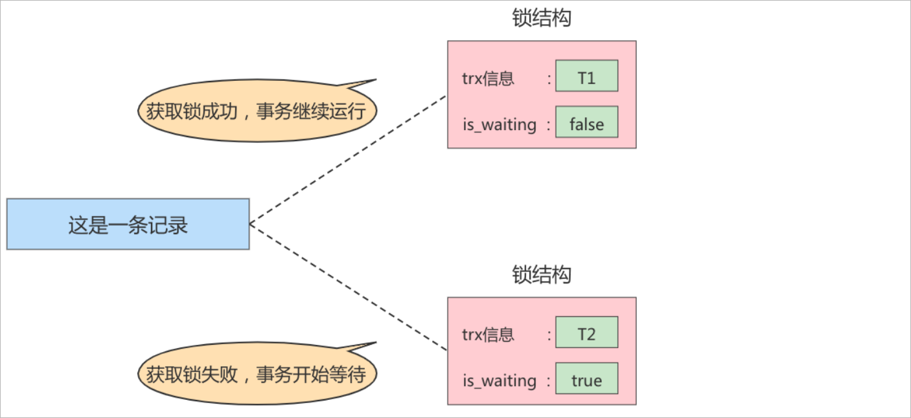

事务的 **隔离性** 由这章讲述的 **锁** 来实现。

# 一、锁概述

**锁**是计算机协调多个进程或者线程**并发访问某一个资源**的机制。<br/>
在程序开发中会存在多线程同步的问题，当多个线程并发访问某一个数据的时候，尤其针对一些敏感的数据(比如订单、金额等)，<br/>
我们就需要保证这个数据在任何时刻**最多只有一个线程**在访问，保证数据的完整性和一致性。<br/>
在开发过程中加锁是为了保证数据的一致性，这个思想在数据库领域中同样很重要。<br/>
在数据库中，除传统的计算资源（如CPU、RAM、I/O等）的争用以外，数据也是一种供许多用户共享的资源。<br/>
为保证数据的一致性，需要对**并发操作**进行控制，因此产生了锁。同时锁机制也为实现MySQL的各个隔离级别提供了保证。<br/>
**锁冲突** 也是影响数据库 **并发访问性能** 的一个重要因素。所以锁对数据库而言显得尤其重要，也更加复杂。<br/>

# 二、并发事务带来的问题

在典型的应用程序中，多个事务并发运行，经常会操作相同的数据来完成各自的任务（多个用户对同一数据进行操作）。并发虽然是必须的，但可能会导致以下的问题。

**脏读（Dirty read）**: 当一个事务正在访问数据并且对数据进行了修改，而这种修改还没有提交到数据库中，这时另外一个事务也访问了这个数据，

然后使用了这个数据。因为这个数据是还没有提交的数据，那么另外一个事务读到的这个数据是“脏数据”，依据“脏数据”所做的操作可能是不正确的。

**丢失修改（Lost to modify）**：指在一个事务读取一个数据时，另外一个事务也访问了该数据，那么在第一个事务中修改了这个数据后，第二个事

务也修改了这个数据。这样第一个事务内的修改结果就被丢失，因此称为丢失修改。 例如：事务1读取某表中的数据A=20，事务2也读取A=20，事务1

修改A=A-1，事务2也修改A=A-1，最终结果A=19，事务1的修改被丢失。

**不可重复读（Unrepeatableread）**：指在一个事务内多次读同一数据。在这个事务还没有结束时，另一个事务修改了该数据。那么，在第一个事务

中的两次读数据之间，由于第二个事务的修改导致第一个事务两次读取的数据可能不太一样。这就发生了在一个事务内两次读到的数据是不一样的情

况，因此称为不可重复读。

**幻读（Phantom read）**：幻读与不可重复读类似。它发生在一个事务（T1）读取了几行数据，接着另一个并发事务（T2）插入了一些数据时。在随

后的查询中，第一个事务（T1）就会发现多了一些原本不存在的记录，就好像发生了幻觉一样，所以称为幻读。

# 三、并发事务的解决方案

解决方案：对事务进行隔离

MySQL的四种隔离级别如下:

**读未提交(READ UNCOMMITTED)**：这个隔离级别下,其他事务可以看到本事务没有提交的部分修改。因此会造成脏读的问题(读取到了其他事务未提交的部分,而之后该事务进行了回滚)。<br/>
这个级别的性能没有足够大的优势，但是又有很多的问题，因此很少使用。

sql演示：

```sql
# 创建数据库表
create table goods_innodb(
	id int NOT NULL AUTO_INCREMENT,
	name varchar(20) NOT NULL,
    primary key(id)
)ENGINE=innodb DEFAULT CHARSET=utf8;

# 插入数据
insert into goods_innodb(name) values('华为');
insert into goods_innodb(name) values('小米');

# 会话一
set session transaction isolation level read uncommitted ;		# 设置事务的隔离级别为read uncommitted
start transaction ;												# 开启事务
select * from goods_innodb ;									# 查询数据

# 会话二
set session transaction isolation level read uncommitted ;		# 设置事务的隔离级别为read uncommitted
start transaction ;												# 开启事务
update goods_innodb set name = '中兴' where id = 2 ;			   # 修改数据

# 会话一
select * from goods_innodb ;									# 查询数据
```

**读已提交(READ COMMITTED)**：其他事务只能读取到本事务已经提交的部分。<br/>
这个隔离级别有不可重复读的问题，在同一个事务内的两次读取，拿到的结果竟然不一样,因为另外一个事务对数据进行了修改。

sql演示：

```sql
# 会话一
set session transaction isolation level read committed ;		# 设置事务的隔离级别为read committed
start transaction ;												# 开启事务
select * from goods_innodb ;									# 查询数据

# 会话二
set session transaction isolation level read committed ;		# 设置事务的隔离级别为read committed
start transaction ;												# 开启事务
update goods_innodb set name = '小米' where id = 2 ;			   # 修改数据

# 会话一
select * from goods_innodb ;									# 查询数据

# 会话二
commit;															# 提交事务

# 会话一
select * from goods_innodb ;									# 查询数据
```

**REPEATABLE READ(可重复读)**：可重复读隔离级别解决了上面不可重复读的问题(看名字也知道)，但是不能完全解决幻读。<br/>
MySql默认的事务隔离级别就是：**REPEATABLE READ**

```sql
SELECT @@global.transaction_isolation ;
```

sql演示(解决不可重复读)：

```sql
# 会话一
set session transaction isolation level REPEATABLE READ ;
start transaction ;												# 开启事务
select * from goods_innodb ;									# 查询数据

# 会话二
set session transaction isolation level REPEATABLE READ ;
start transaction ;												# 开启事务
update goods_innodb set name = '荣耀' where id = 1 ;			   # 修改数据

# 会话一
select * from goods_innodb ;									# 查询数据

# 会话二
commit;															# 提交事务

# 会话一
select * from goods_innodb ;									# 查询数据
```


sql演示(测试不会出现幻读的情况)：

```sql
# 会话一
set session transaction isolation level REPEATABLE READ ;
start transaction ;												# 开启事务
select * from goods_innodb ;									# 查询数据

# 会话二
set session transaction isolation level REPEATABLE READ ;
start transaction ;												# 开启事务
insert into goods_innodb(name) values('小米');			   	   # 插入数据
commit;															# 提交事务

# 会话一
select * from goods_innodb ;									# 查询数据
```

sql演示(测试出现幻读的情况)：

```sql
# 表结构进行修改
ALTER TABLE goods_innodb ADD version int(10) NULL ;

# 会话一
set session transaction isolation level REPEATABLE READ ;
start transaction ;												# 开启事务
select * from goods_innodb where version = 1;					# 查询一条不满足条件的数据

# 会话二
set session transaction isolation level REPEATABLE READ ;
start transaction ;												# 开启事务
insert into goods_innodb(name, version) values('vivo', 1);	    # 插入一条满足条件的数据 
commit;															# 提交事务

# 会话一
update goods_innodb set name = '金立' where version = 1; 		   # 将version为1的数据更改为'金立'
select * from goods_innodb where version = 1;					# 查询一条不满足条件的数据
```

**SERIALIZABLE(可串行化)**：这是最高的隔离级别，可以解决上面提到的所有问题，因为他强制将所有的操作串行执行，这会导致并发性能极速下降，因此也不是很常用。

<br/>

# 四、并发事务访问情况说明

并发事务访问相同记录的情况大致可以划分为3种：读-读情况、写-写情况、读-写或写-读情况

## 1、读-读情况

**读-读**情况，即并发事务相继**读取相同的记录** 。读取操作本身不会对记录有任何影响，并不会引起什么问题，所以允许这种情况的发生。

## 2、写-写情况

写-写 情况，即并发事务相继对相同的记录做出改动。 在这种情况下会发生 **脏写(脏写读取、脏写覆盖)** 的问题，任何一种隔离级别都不允许这

种问题的发生。所以在多个未提交事务相继对一条记录做改动时，需要让它们排队执行 ，这个排队的过程其实是通过**锁**来实现的。这个所谓 的锁其

实是一个 内存中的结构 ，在事务执行前本来是没有锁的，也就是说一开始是没有 锁结构 和记录进 行关联的，如图所示：


当一个事务想对这条记录做改动时，首先会看看内存中有没有与这条记录关联的**锁结构** ，当没有的时候 就会在内存中生成一个 锁结构 与之关联。比

如，事务 T1 要对这条记录做改动，就需要生成一个 锁结构 与之关联：


在锁结构中存在很多的信息，为了简化理解，只把两个比较重要的属性拿出来：

1、trx信息：代表这个锁结构是哪一个事务生成的

2、is_waiting: 代表当前事务是否在等待

当事务T1改动了这条记录后，就生成了一个锁结构与该条记录关联，因为之前没有别的事务为这条记录加锁，所以is_waiting属性就是false，我们把

这个场景就称之为获取锁成功，或者加锁成功。然后就可以继续进行操作了。


在事务T1提交之前，另外一个事务T2也想对该记录做更改，那么先看看有没有锁结构与该条记录关联，发现有一个锁结构与之关联，然后也生成了一

个锁结构与这条记录关联，不过锁结构的is_waiting属性就是true，表示当前事务需要等待，我们把这个场景就称之为获取锁失败，或者加锁失败。如

下图所示：



当事务T1提交之后，就会把该事务生成的**锁结构释放掉**，然后看看有没有别的事务在等待获取锁，发现了事务T2还在等待获取锁，所以把**事务T2对**

**应的锁结构的is_waiting属性设置为false**，然后把该事务对应的线程唤醒，让他继续执行，此时事务T2就算获取到了锁，效果如下所示：


小结几种说法：

1、**不加锁** 意思就是不需要在内存中生成对应的 锁结构 ，可以直接执行操作。

2、**获取锁成功，或者加锁成功** 意思就是在内存中生成了对应的 锁结构 ，而且锁结构的 is_waiting 属性为 false ，也就是事务 可以继续执行操作。

3、**获取锁失败，或者加锁失败**，或者没有获取到锁 意思就是在内存中生成了对应的 锁结构 ，不过锁结构的 is_waiting 属性为 true ，也就是事务

需要等待，不可以继续执行操作。

## 3、读-写情况

读-写 或 写-读 ，即一个事务进行读取操作，另一个进行改动操作。这种情况下可能发生 脏读 、 不可重 复读 、 幻读 的问题。

要想解决这些问题就需要使用到到事务的隔离级别，而事务的隔离性的实现原理有两种：

1、使用**MVCC**：读操作利用多版本并发控制（ MVCC ），写操作进行加锁 。

> 普通的SELECT语句在READ COMMITTED和REPEATABLE READ隔离级别下会使用到MVCC读取记录。
>
> 1、在 READ COMMITTED 隔离级别下，一个事务在执行过程中**每次**执行SELECT操作时都会生成一 个**ReadView**，ReadView的存在本身就保证
>
> 了 事务不可以读取到未提交的事务所做的更改 ，也就 是避免了脏读现象；
>
> 2、在 REPEATABLE READ 隔离级别下，一个事务在执行过程中只有 **第一次**执行SELECT操作 才会 生成一个**ReadView**，之后的SELECT操作都
>
> 复用 这个ReadView，这样也就避免了不可重复读 和部分幻读的问题。

2、读、写操作都采用 加锁 的方式。

<br/>

小结对比发现：

1、采用 MVCC 方式的话， 读-写 操作彼此并不冲突， 性能更高 。

2、采用 加锁 方式的话， 读-写 操作彼此需要 排队执行 ，影响性能。

一般情况下我们当然愿意采用 MVCC 来解决 读-写 操作并发执行的问题，但是业务在某些特殊情况 下，要求必须采用 加锁 的方式执行。


# 五、锁的分类

从对数据操作的粒度分 ：

1） 表锁：操作时，会锁定整个表。

2）页面锁：操作时，会锁定某一页的数据。

3） 行锁：操作时，会锁定当前操作行。

从对数据操作的类型分：

1） 读锁（共享锁）：针对同一份数据，多个读操作可以同时进行而不会互相影响。

2） 写锁（排它锁）：当前操作没有完成之前，它会阻断其他写锁和读锁。


相对其他数据库而言，MySQL的锁机制比较简单，其最显著的特点是不同的存储引擎支持不同的锁机制。下表中罗列出了各存储引擎对锁的支持情

况：

| 存储引擎 | 表级锁 | 行级锁 | 页面锁 |
| -------- | ------ | ------ | ------ |
| MyISAM   | 支持   | 不支持 | 不支持 |
| InnoDB   | 支持   | 支持   | 不支持 |
| MEMORY   | 支持   | 不支持 | 不支持 |
| BDB      | 支持   | 不支持 | 支持   |

MySQL这3种锁的特性可大致归纳如下 ：

| 锁类型 | 特点                                                         |
| ------ | ------------------------------------------------------------ |
| 表级锁 | 偏向MyISAM 存储引擎，开销小，加锁快；不会出现死锁；锁定粒度大，发生锁冲突的概率最高,并发度最低。 |
| 行级锁 | 偏向InnoDB 存储引擎，开销大，加锁慢；会出现死锁；锁定粒度最小，发生锁冲突的概率最低,并发度也最高。 |
| 页面锁 | 开销和加锁时间界于表锁和行锁之间；会出现死锁；锁定粒度界于表锁和行锁之间，并发度一般。 |

从上述特点可见，很难笼统地说哪种锁更好，只能就具体应用的特点来说哪种锁更合适！仅从锁的角度来说：表级锁更适合于以查询为主，只有少量按

索引条件更新数据的应用，如Web 应用；而行级锁则更适合于有大量按索引条件并发更新少量不同数据，同时又有并查询的应用。


