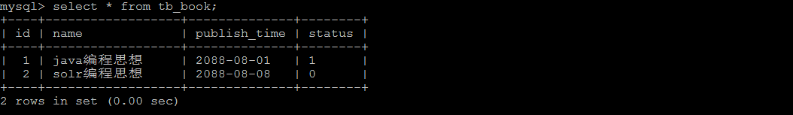

MyISAM 存储引擎只支持表锁，这也是MySQL开始几个版本中唯一支持的锁类型。

# 一、加锁特点

MyISAM 在执行查询语句（SELECT）前，**会自动给涉及的所有表加读锁**，在执行更新操作（UPDATE、DELETE、INSERT 等）前，**会自动给涉及的表加写锁**，这个过程并不需要用户干预，因此，用户一般不需要直接用 LOCK TABLE 命令给 MyISAM 表显式加锁。

显示加表锁语法：

```sql
加读锁 ： lock table table_name read;
加写锁 ： lock table table_name write；
```

# 二、读锁案例

准备环境

```SQL
create database demo_03 default charset=utf8mb4;

use demo_03;

CREATE TABLE `tb_book` (
  `id` INT(11) auto_increment,
  `name` VARCHAR(50) DEFAULT NULL,
  `publish_time` DATE DEFAULT NULL,
  `status` CHAR(1) DEFAULT NULL,
  PRIMARY KEY (`id`)
) ENGINE=myisam DEFAULT CHARSET=utf8 ;

INSERT INTO tb_book (id, name, publish_time, status) VALUES(NULL,'java编程思想','2088-08-01','1');
INSERT INTO tb_book (id, name, publish_time, status) VALUES(NULL,'solr编程思想','2088-08-08','0');

CREATE TABLE `tb_user` (
  `id` INT(11) auto_increment,
  `name` VARCHAR(50) DEFAULT NULL,
  PRIMARY KEY (`id`)
) ENGINE=myisam DEFAULT CHARSET=utf8 ;

INSERT INTO tb_user (id, name) VALUES(NULL,'令狐冲');
INSERT INTO tb_user (id, name) VALUES(NULL,'田伯光');
```

<br/>

客户端 一 ：

1）获得tb_book 表的读锁

```sql
lock table tb_book read;
```


2） 执行查询操作

```sql
select * from tb_book;
```



可以正常执行 ， 查询出数据。


客户端 二 ：

3） 执行查询操作

```sql
select * from tb_book;
```


客户端 一 ：

4）查询未锁定的表

```sql
select name from tb_user;
```


客户端 二 ：

5）查询未锁定的表

```sql
select name from tb_user;
```


可以正常查询出未锁定的表；


客户端 一 ：

6） 执行插入操作

```sql
insert into tb_book values(null,'Mysql高级','2088-01-01','1');
```


执行插入， 直接报错 ， 由于当前tb_book 获得的是 读锁， 不能执行更新操作。


客户端 二 ：

7） 执行插入操作

```sql
insert into tb_book values(null,'Mysql高级','2088-01-01','1');
```


当在客户端一中释放锁指令 **unlock tables**  后 ， 客户端二中的 inesrt 语句 ， 立即执行 ；

# 三、写锁案例

客户端 一 :

1）获得tb_book 表的写锁

```sql
lock table tb_book write ;
```

2）执行查询操作

```sql
select * from tb_book ;
```


查询操作执行成功；

3）执行更新操作

```sql
update tb_book set name = 'java编程思想（第二版）' where id = 1;
```


更新操作执行成功 ；


客户端 二 :

4）执行查询操作

```sql
select * from tb_book ;
```


当在客户端一中释放锁指令 unlock tables  后 ， 客户端二中的 select 语句 ， 立即执行 ；


# 四、结论

锁模式的相互兼容性如表中所示：


由上表可见：

- 1、对MyISAM表加读锁之后，不会阻塞其他用户对同一表的读请求，但会阻塞对同一表的写请求；
- 2、对MyISAM表加写锁之后，则会阻塞其他用户对同一表的读和写操作；

简而言之，就是**读锁会阻塞写，但是不会阻塞读。而写锁，则既会阻塞读，又会阻塞写**。

此外，MyISAM 的读写锁调度是写优先，这也是MyISAM不适合做写为主的表的存储引擎的原因。<br/>
因为写锁后，其他线程不能做任何操作，大量的更新会使查询很难得到锁，从而造成较长时间的阻塞。


