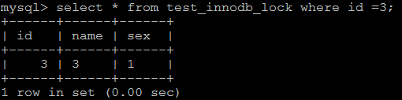
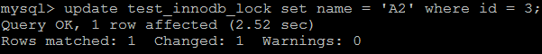
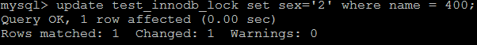
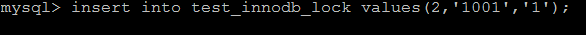

# 一、加锁特点

行锁特点 ：偏向InnoDB 存储引擎，开销大，加锁慢；会出现死锁；锁定粒度最小，发生锁冲突的概率最低,并发度也最高。

InnoDB 与 MyISAM 的最大不同有两点：一是支持事务；二是 采用了行级锁。


InnoDB  实现了以下两种类型的行锁。

1、共享锁（S）：又称为读锁，简称S锁，共享锁就是多个事务对于同一数据可以共享一把锁，都能访问到数据，但是只能读不能修改。

2、排他锁（X）：又称为写锁，简称X锁，排他锁就是不能与其他锁并存，如一个事务获取了一个数据行的排他锁，其他事务就不能再获取该行的其他锁，包括共享锁和排他锁，但是获取排他锁的事务可以读取和修改。

**对于UPDATE、DELETE和INSERT语句，InnoDB会自动给涉及数据集加排他锁（X)；**

**对于普通SELECT语句，InnoDB不会加任何锁；**

<br/>

可以通过以下语句显式给记录集加共享锁或排他锁 。

```sql
共享锁（S）：SELECT * FROM table_name WHERE ... LOCK IN SHARE MODE
排他锁（X) ：SELECT * FROM table_name WHERE ... FOR UPDATE
```

# 二、案例准备工作

```sql
create table test_innodb_lock(
	id int(11),
	name varchar(16),
	sex varchar(1)
)engine = innodb default charset=utf8;

insert into test_innodb_lock values(1,'100','1');
insert into test_innodb_lock values(3,'3','1');
insert into test_innodb_lock values(4,'400','0');
insert into test_innodb_lock values(5,'500','1');
insert into test_innodb_lock values(6,'600','0');
insert into test_innodb_lock values(7,'700','0');
insert into test_innodb_lock values(8,'800','1');
insert into test_innodb_lock values(9,'900','1');
insert into test_innodb_lock values(1,'200','0');

create index idx_test_innodb_lock_id on test_innodb_lock(id);
create index idx_test_innodb_lock_name on test_innodb_lock(name);
```

# 三、行锁基本演示

| Session-1                                                            | Session-2                                                                        |
|----------------------------------------------------------------------|----------------------------------------------------------------------------------|
| <br/>关闭自动提交功能              | <br/>关闭自动提交功能                          |
| <br/>可以正常的查询出全部的数据         | <br/>可以正常的查询出全部的数据                     |
| <br/>查询id 为3的数据 ；               | <br/>获取id为3的数据 ；                       |
| <br/>更新id为3的数据，但是不提交；          | <br/>更新id为3 的数据， 处于等待状态                |
| <br/>通过commit， 提交事务            | <br/>解除阻塞，更新正常进行                       |
| 以上， 操作的都是同一行的数据，接下来，演示不同行的数据 ：                                       |                                                                                  |
| <br/>更新id为3数据，正常的获取到行锁 ， 执行更新 ； | <br/>由于与Session-1 操作不是同一行，获取当前行锁，执行更新； |

<br/>

# 四、无索引行锁升级为表锁

如果不通过索引条件检索数据，那么InnoDB将对表中的所有记录加锁，实际效果跟表锁一样。一定需要注意索引失效的问题。

<br/>

查看当前表的索引 ： show  index  from test_innodb_lock ;


| Session-1                                               | Session-2                                                  |
|---------------------------------------------------------| ---------------------------------------------------------- |
| 关闭事务的自动提交<br/> | 关闭事务的自动提交<br/> |
| 执行更新语句：<br/>       | 执行更新语句， 但处于阻塞状态：<br/> |
| 提交事务：<br/>         | 解除阻塞，执行更新成功：<br/> |
|                                                         | 执行提交操作：<br/>    |

由于 执行更新时 ， name字段本来为varchar类型， 我们是作为数字类型使用，存在类型转换，索引失效，最终行锁变为表锁 ；


# 五、间隙锁危害

当我们用范围条件，而不是使用相等条件检索数据，并请求共享或排他锁时，InnoDB会给符合条件的所有数据进行加锁； <br/>

这就带来一个问题：即使是不存在的记录，如果在条件范围内也会被锁定<br/>

**对于键值在条件范围内但并不存在的记录**，叫做 "间隙（GAP）"，这种锁机制就是所谓的间隙锁（Next-Key锁）。<br/>

危害：原本不存在的记录被加了锁，有可能导致某些特定场合出现不符合我们预期的操作结果<br/>

示例 ：

| Session-1                                               | Session-2                                                   |
|---------------------------------------------------------|-------------------------------------------------------------|
| 关闭事务自动提交<br/> | 关闭事务自动提交<br/>          |
| 根据id范围更新数据<br/>    |                                                             |
|                                                         | 插入id为2的记录， 处于阻塞状态<br/> |
| 提交事务<br/>        |                                                             |
|                                                         | 解除阻塞 ， 执行插入操作<br/>   |
|                                                         | 提交事务 ：                                                      |

# 六、InnoDB 行锁争用情况

```sql
show status like 'innodb_row_lock%';
```


```properties
Innodb_row_lock_current_waits: 当前正在等待锁定的数量
Innodb_row_lock_time: 从系统启动到现在锁定总时间长度
Innodb_row_lock_time_avg:每次等待所花平均时长
Innodb_row_lock_time_max:从系统启动到现在等待最长的一次所花的时间
Innodb_row_lock_waits: 系统启动后到现在总共等待的次数

当等待的次数很高，而且每次等待的时长也不小的时候，我们就需要分析系统中为什么会有如此多的等待，然后根据分析结果着手制定优化计划。
```

<br/>

# 七、总结

InnoDB存储引擎由于实现了行级锁定，虽然在锁定机制的实现方面带来了性能损耗可能比表锁会更高一些，但是在整体并发处理能力方面要远远高于

MyISAM的表锁的。当系统并发量较高的时候，InnoDB的整体性能和MyISAM相比就会有比较明显的优势。

但是，InnoDB的行级锁同样也有其脆弱的一面，当我们使用不当的时候，可能会让InnoDB的整体性能表现不仅不能比MyISAM高，甚至可能会更差。


**优化建议：**

1、尽可能让所有数据检索都能通过索引来完成，避免无索引导致行锁升级为表锁。

2、合理设计索引，尽可能减少索引条件，及索引范围，避免间隙锁

3、尽量控制事务大小，减少锁定资源量和时间长度

4、在满足业务需求的前提下，事务隔离级别越低越好


