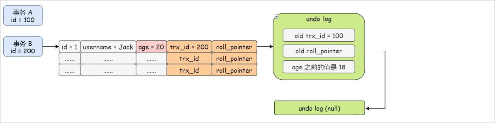
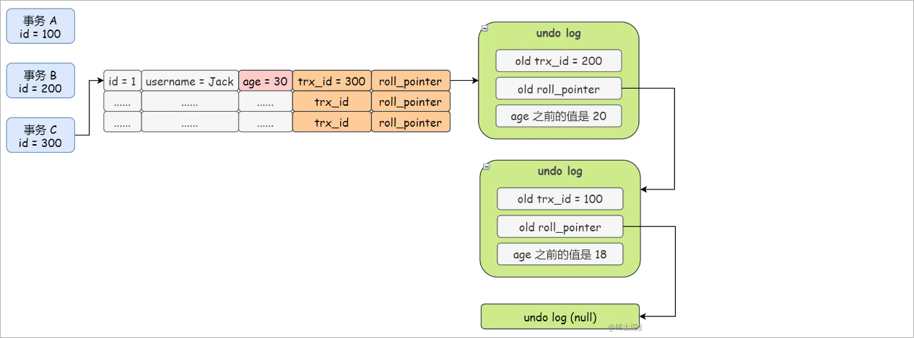

对于使用 InnoDB 存储引擎的表来说，它的数据库表记录中都包含两个必要的隐藏列。

- 1、trx_id：每次一个事务对当前数据库表记录进行改动时，都会把该事务的 **事务id** 赋值给 trx_id 隐藏列。
- 2、roll_pointer ：每次对某条数据库表记录进行改动时，都会把旧的版本写入到 undo日志 中，然后这个隐藏列就相当于一个指针，可以通过它来找到该记录修改前的信息。

**insert undo只在事务回滚时起作用**，当事务提交后，该类型的undo日志就没用了，它占用的Undo Log Segment也会被系统回收（也就是该undo日志占用的Undo页面链表要么被重用，要么被释放）。

假设 id = 100 的事务 A **插入一条行**记录（id = 1, username = "Jack", age = 18），那么，这行记录的两个隐藏字段 trx_id = 100 和 roll_pointer

指向一个空的 undo log，因为在这之前并没有事务操作 id = 1 的这行记录。如图所示：

然后，id = 200 的事务 B 修改了这条行记录，把 age 从 18 修改成了 20，于是，这条行记录的 trx_id就变成了 200，roll_pointer就指向事务 B 生

成的 undo log
- 在事务 B 的 undo Log 中，再通过 old trx_id 字段指向 A 事务
- 在事务 B 的 undo Log 中，再通过 old roll_pointer 字段指向 A 事务的 undo Log，从而形成 undo Log 的版本链

具体图解如下：

接着，id = 300 的事务 C 再次修改了这条行记录，把 age 从 20 修改成了 30，如下图：

可以看到，每次修改行记录都会更新 trx_id 和 roll_pointer 这两个隐藏字段，之前的多个数据快照对应的 undo log 会通过 roll_pointer 指针串联起

来，从而形成一个**版本链**。MVCC 这个机制，其实就是靠 update undo log 实现的。

那么，一条记录在同一时刻可能有多个事务在执行，那么，undo log会有一条记录的多个快照，那么在这一时刻发生SELECT要进行快照读的时候，要

读哪个快照呢？