# 一、ReadView简介

**Read View 主要来帮我们解决可见性的问题的**, 即他会来告诉我们本次事务应该看到哪个快照，不应该看到哪个快照。

MVCC主要针对的是READ COMMITTED、REPEATABLE READ

1、READ UNCOMMITTED 隔离级别的事务，由于可以读到未提交事务修改过的记录，所以直接读取记录的最新版本就好了。

2、SERIALIZABLE 隔离级别的事务，InnoDB规定使用加锁的方式来访问记录。

3、READ COMMITTED 和 REPEATABLE READ 隔离级别的事务，都必须保证读到 **已经提交了的** 事务修改过的记录。


这个ReadView中主要包含4个比较重要的内容，分别如下：

1、creator_trx_id ，创建这个 Read View 的事务 ID。

2、m_ids，生成 ReadView 时有哪些事务在执行但是还没提交的（称为 ”**活跃事务**“），这些活跃事务的 id 就存在这个字段里。

3、min_trx_id：m_ids 里最小的值

4、max_trx_id：生成 ReadView 时 InnoDB 将分配给下一个事务的 ID 的值（事务 ID 是递增分配的，越后面申请的事务 ID 越大）max_trx_id是

系统最大的事务id值，这里要注意是系统中的事务id，需要区别于正在活跃的事务ID。


注意：max_trx_id并不是trx_ids中的最大值，事务id是递增分配的。比如，现在有id为1， 2，3这三个事务，之后id为3的事务提交了。那么一个新

的读事务在生成ReadView时， m_ids就包括1和2，min_trx_id的值就是1，max_trx_id的值就是4。

# 二、ReadView工作原理

通过一个例子来理解下 ReaView 机制是如何做到判断当前事务能够看见哪些版本的：


假设表中已经被之前的事务 A（id = 100）插入了一条行记录（id = 1, username = "Jack", age = 18），如图所示：

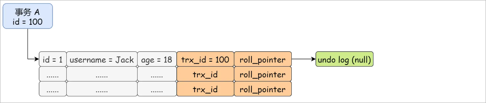


接下来，有两个事务 B（id = 200） 和 C（id = 300）过来**并发执行**，这两个事务都执行了相应的操作但是**还没有进行提交**：

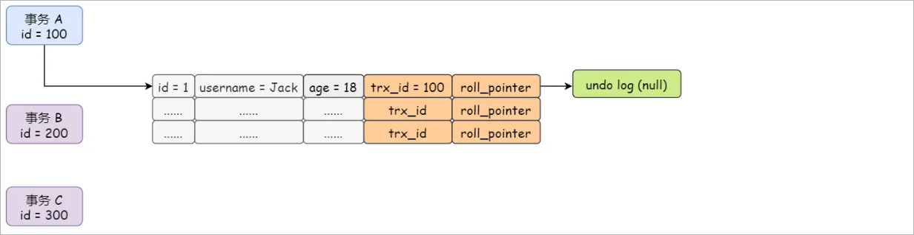


如果现在事务 B 开启了一个 ReadView，在这个 ReadView 里面：

1、m_ids 就包含了当前的活跃事务的 id，即事务 B 和事务 C 这两个 id，200 和 300

2、min_trx_id就是 200

3、max_trx_id是下一个能够分配的事务的 id，那就是 301

4、creator_trx_id是当前创建 ReadView 事务 B 的 id 200

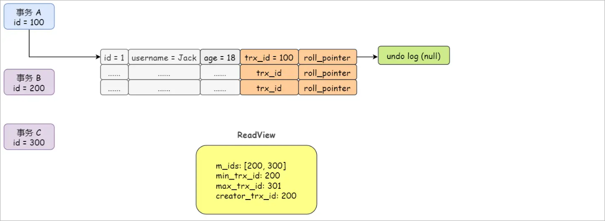


现在事务 B 进行第一次查询，会把使用行记录的隐藏字段 **trx_id 和 ReadView 的 min_trx_id 进行比较**，此时，发现 trx_id 是100，小于

ReadView 里的 min_trx_id（200），这说明在事务 B 开始之前，修改这行记录的事务 A 已经提交了，所以开始于事务 A 提交之后的事务 B是可以

查到事务 A 对这行记录的更新的。此时事务 B 不需要范围版本链，直接从行记录中读取数据即可。

```sql
row.trx_id < ReadView.min_trx_id
```

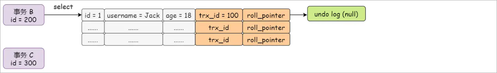


接着事务 C 过来修改这行记录，把 age = 18 改成了 age = 20，所以这行记录的 trx_id就变成了 300，同时 roll_pointer指向了事务 C 修改之前生成

的 undo log：

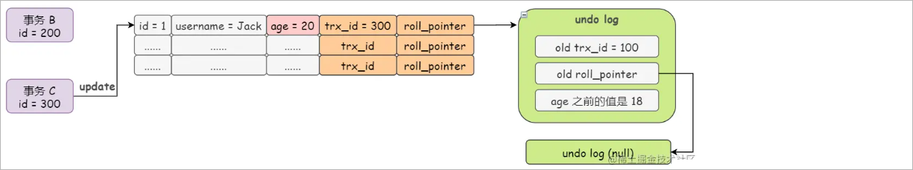


那这个时候事务 B 再次进行查询操作，会发现这行记录的 trx_id（300）大于 ReadView 的 min_trx_id（200），并且小于 max_trx_id（301）。

```sql
row.trx_id > ReadView.min_trx_id && row.trx_id < max_trx_id
```

这说明一个问题，就是更新这行记录的事务很有可能也存在于 ReadView 的 m_ids（活跃事务）中。所以事务 B 会去判断下 ReadView 的 m_ids 里面

是否存在 trx_id = 300的事务，显然是存在的，这就表示这个 id = 300 的事务是跟自己（事务 B）在同一时间段并发执行的事务且未提交，也就说明这行

age = 20 的记录，事务 B 是不能使用、不能接受的。

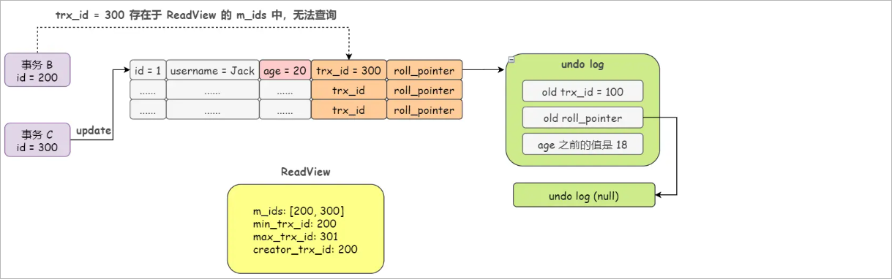

既然无法查询，那该咋整？事务 B 这次的查询操作能够查到啥呢？ 没错，undo log 版本链！

这时事务 B 就会顺着这行记录的 roll_pointer 指针往下找，就会找到最近的一条old trx_id = 100 的 undo log，100 小于 min_trx_id 的值 200，即说明这个

trx_id = 100 的 undo log 版本必然是在事务 B 开启之前就已经提交的了。所以事务 B 的这次查询操作读到的就是这个版本的数据即 age = 18。

通过上述的例子，我们得出的结论是，**通过 undo log 版本链和 ReadView 机制，可以保证一个事务不会读到并发执行且未提交的另一个事务的更新**。


那自己修改的值，自己能不能读到呢？肯定可以读到。不过上面的例子我们只涉及到了 ReadView 中的前三个字段，而 **creator_trx_id** 就与自己读

自己的修改有关，所以这里还是图解出来让大家更进一步理解下 ReadView 机制：


假设事务 C 的修改已经提交了，然后事务 B 更新了这行记录，把 age = 20 改成了 age = 66，如下图所示：

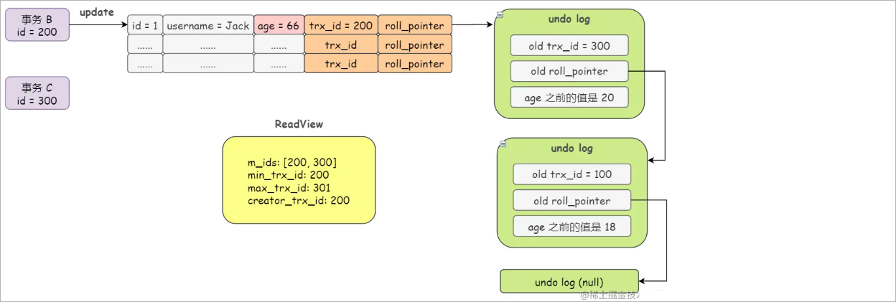

然后，事务 B 再来查询这条记录，发现 trx_id = 200与 ReadView 里的 creator_trx_id = 200 一样，这就说明这是我自己刚刚修改的啊，当然可以

被查询到。

```sql
row.trx_id = ReadView.creator_trx_id
```

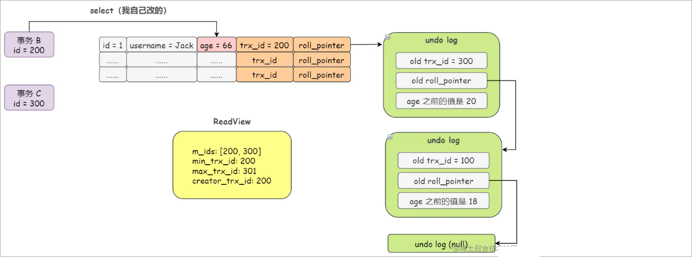


那如果在事务 B 的执行期间，突然开了一个 id = 500 的事务 D，然后更新了这行记录的 age = 88，然后事务 B 再去读这行记录，能读到吗？

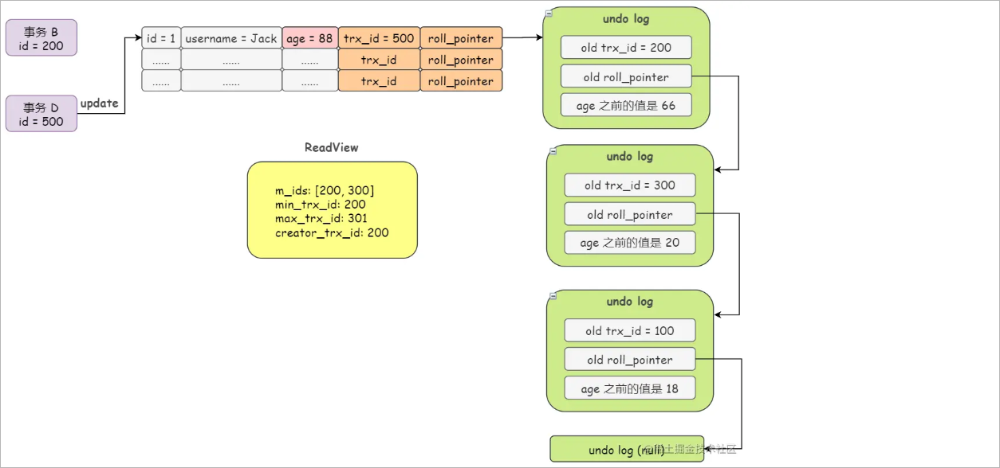

答案是不能的。

因为这个时候事务 B 再去查询这行记录，就会发现 trx_id = 500大于 ReadView 中的 max_trx_id = 301，这说明事务 B 执行期间，有另外一个事务

更新了数据，所以不能查询到另外一个事务的更新。

```sql
row.trx_id > ReadView.max_trx_id
```

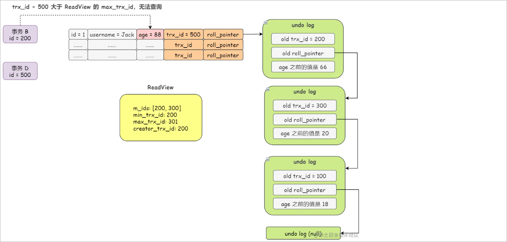

那通过上述的例子，我们得出的结论是，**通过 undo log 版本链和 ReadView 机制，可以保证一个事务只可以读到该事务自己修改的数据或该**

**事务开始之前的数据**。

<br/>

# 三、ReadView总结

## 1、ReadView的规则

有了这个ReadView，这样在访问某条记录时，只需要按照下边的步骤判断记录的某个版本是否可见。

1、如果被访问版本的trx_id属性值与ReadView中的 creator_trx_id 值相同，意味着当前事务在访问 它自己修改过的记录，所以该版本可以被当前事务访问。

2、如果被访问版本的trx_id属性值小于ReadView中的 min_trx_id 值，表明生成该版本的事务在当前事务生成ReadView前已经提交，所以该版本可以被当前事务访问。

3、如果row.trx_id > ReadView.min_trx_id && row.trx_id < max_trx_id说明，在执行当前事务的时候很有可能存在一个并发事务，然后需要判断当前行记录的事务的id，是否在ReadView的m_ids中，如果存在就说明的确存在一个并发的未提交的事务，在进行数据读取的时候不允许读取当前行记录，可以通过行记录的回滚指针读取undo log获取数据。

4、如果row.trx_id > max_trx_id，说明在执行当前事务的时候，有其它新开启的并发事务，无法判断其是否提交，那么当前事务在读取数据的时候不允许读取当前行数据，可以通过行记录的回滚指针读取undo log获取数据。

<br/>

## 2、MVCC整体操作流程

了解了这些概念之后，我们来看下当查询一条记录的时候，系统如何通过MVCC找到它：

1、首先获取事务自己的版本号，也就是事务 ID；

2、获取 ReadView；

3、查询得到的数据，然后与 ReadView 中的事务版本号进行比较；

4、如果不符合 ReadView 规则，就需要从 Undo Log 中获取历史快照；

最后返回符合规则的数据。 在隔离级别为读已提交（Read Committed）时，一个事务中的每一次 SELECT 查询都会重新获取一次 Read View。

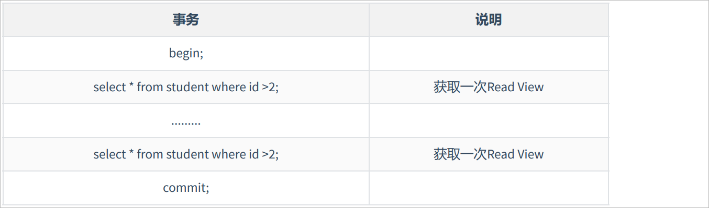

注意：此时同样的查询语句都会重新获取一次 Read View，这时如果 Read View 不同，就可能产生不可重复读或者幻读的情况。


当隔离级别为可重复读的时候，就避免了不可重复读，这是因为一个事务只在第一次 SELECT 的时候会 获取一次 Read View，而后面所有的 SELECT

都会复用这个 Read View，如下表所示：

 


