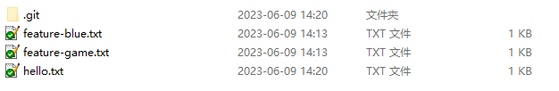
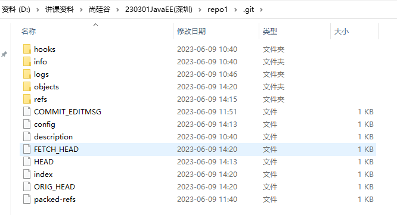
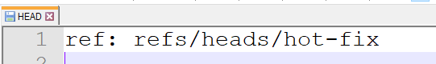
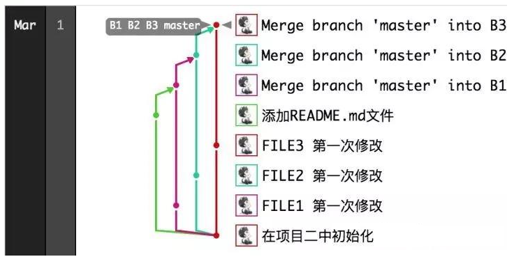
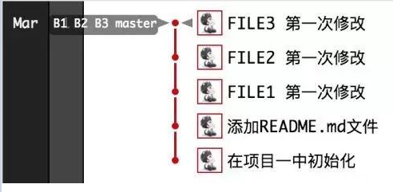
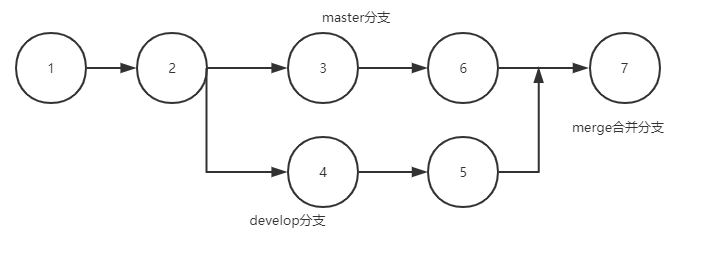
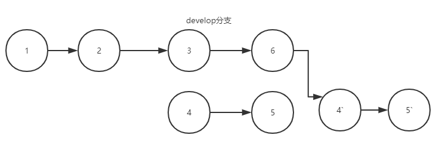
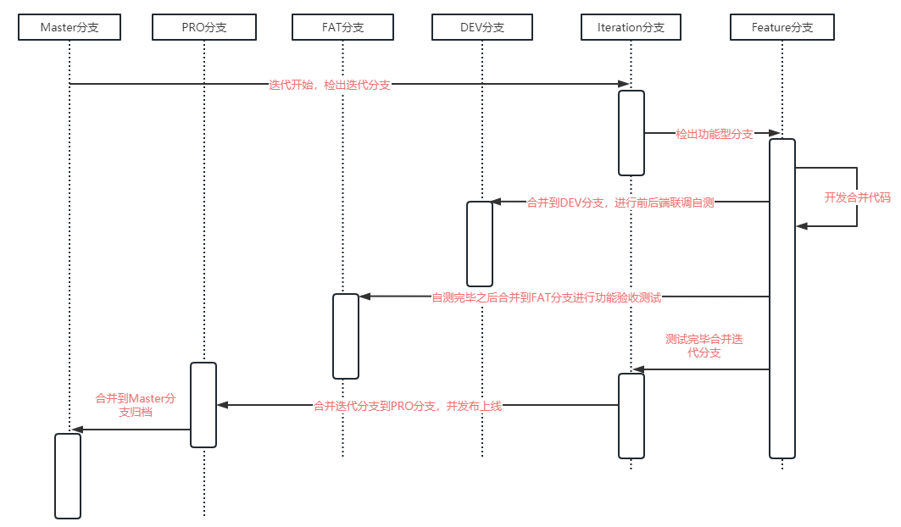
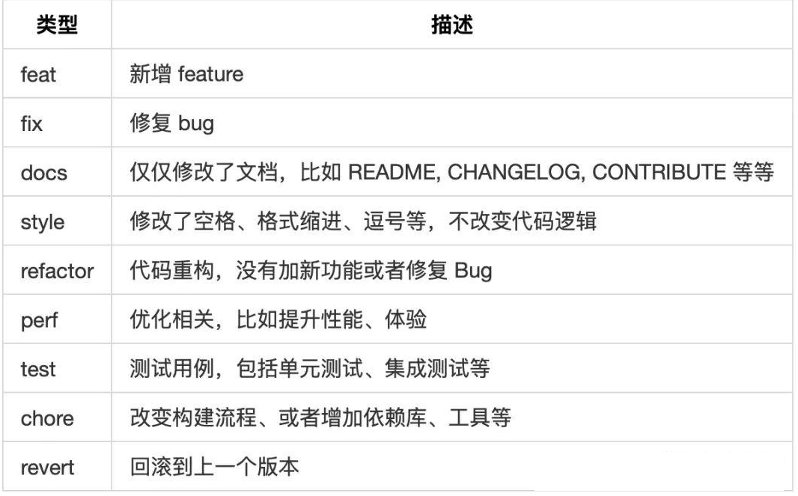

# 一、Git的四个空间

## 1. 工作区

工作区其实就是代码的目录



## 2. 版本库

版本库其实就是.git目录



### 2.1 暂存区( stage )

index文件就是暂存区，暂存区中记录的是将要被commit的文件列表

### 2.2 本地仓库

### 2.2.1 refs目录


refs目录中的heads目录包含了本地每一个分支执行的commit版本

remotes目录包含了远程每一个分支执行的commit版本

### 2.2.2 HEAD文件



记录当前是在哪个分支

### 2.2.3 objects目录

类似Git的数据库(键值对数据库)，以键值对方式保存Git对象，key就是内容的SHA1值

查询对象的命令:

```shell
git cat-file 
```

#### 2.2.3.1 数据对象

数据对象就是文件内容

#### 2.2.3.2 树对象

用于保存文件路径


#### 2.2.3.3 提交对象

用于保存commit信息

## 3. 远程仓库

# 二、Git的分支

## 1. 分支操作命令

1. `git branch` 查看本地分支
2. `git branch -r` 查看远程分支
3. `git branch 分支名` 创建分支
4. `git checkout 分支名` 检出分支
5. `git branch -D 分支名` 删除本地分支

## 2. merge合并分支

1. `git merge 要合并过来的分支名` 将某个分支合并到当前分支
2. `git log 分支名` 查看某个分支的提交记录

## 3. rebase合并分支

1. `git rebase 要合并过来的分支` 将某个分支合并到当前分支

## 4. merge和rebase的区别

### 4.1 图解

#### 4.1.1 使用merge



#### 4.1.2 使用rebase



### 4.2 文字描述

#### 4.2.1 merge

找到两个分支的祖先commit，合并的时候对比两个分支最新的commit，从而确定是否有冲突，会产生一条新的提交记录



#### 4.2.2 rebase

将当前分支从祖先的commit后的所有commit先撤销，放到一个缓存中，然后将需要rebase过来的那个分支变成当前分支的基，然后再从缓存中取出当前分支的commit，加到基的后面，不会产生一条新的提交记录



但是此时由于缓存中的commit有多个，rebase之后如果有冲突，可能需要解决多次冲突; 并且rebase之后，可能会导致 `git push 远程别名 分支名`失效，因为rebase之后，本地仓库的分支相较于远程仓库而言已经变基了，所以无法直接push， 所以确保没有问题的情况下必须使用 `--force` 参数才能提交；  

### 4.3 优缺点

#### 4.3.1 merge

##### 4.3.1.1 优点

1. 详细记录各个分支合并的情况:由谁合并的、什么时候合并的等等
2. 合并时如果有冲突，只需要解决一次

##### 4.3.1.2 缺点

1. 合并后分支图谱很乱
2. 每次合并都会产生一条提交记录

#### 4.3.2 rebase

##### 4.3.2.1 优点

1. 合并后分支图谱是一条线
2. 每次合并不会产生一条提交记录

##### 4.3.2.2 缺点

1. 合并后如果有冲突可能要解决多次冲突
2. 无法详细记录合并情况

## 5. 具体怎么选择使用merge和rebase

1. 上游分支合并下游分支使用merge
2. 下游分支合并更新上游分支代码使用rebase
3. 更新当前分支代码最好是使用`git pull 远程别名 分支名 --rebase `,这样可以避免多出一条merge远程的日志

## 6. 分支管理规范

### 6.1 分支介绍

- **Master :** 主干分支, 是一个归档分支, 保留最新的一个稳定版本代码
- **PRO** : Production 生产环境分支, 用于测试完毕后发布生产环境
- **FAT** : Feature Acceptance Test功能验收测试环境，用于软件测试者测试使用
- **DEV** : Development 开发环境分支, 用于前后端联调测试, 以及代码自测发布使用
- **Iteration** : Iteration 敏捷迭代分支, 每个迭代开始时从Master检出的分支, 用于维护一个迭代周期的开发代码维护整合
- **Features** : 功能特性分支, 每个迭代多个Story对应的多个分支, 以一个可独立发布的功能为单位从Iteration分支检出

Master、PRO、FAT、DEV为常驻分支, 不与迭代相关联. 且Master与PRO同为 Protected 受保护分支, 仅SM(Scrum Master)具有合并权限, FAT分支则是仅QA(测试负责人)具有合并权限, 当有新功能需要提测时, 则将Itetation分支合并到FAT并发布测试环境. 而Iteration与Features分支则为迭代相关分支, 生命周期与迭代保持一致, 在每个迭代开始的时候重新创建, 然后迭代结束后也同时删除销毁。

### 6.2 GIT分支与敏捷迭代时序图



### 6.3 敏捷迭代分支管理流程图


# 三、Git版本回退

## 1. 提交日志

1. `git log 分支名`显示详细提交日志，但是只会列出有效日志不包含回退的日志
2. `git log --oneline 分支名`，一条日志一行
3. `git reflog` 会显示所有的日志，包含回滚日志

## 2. 本地仓库回退

### 2.1 reset

回退命令`git reset --参数 版本号`

#### 2.1.1 hard参数

回退工作区、暂存区、本地仓库中的内容

#### 2.1.2 mixed参数

回退暂存区和本地仓库中的内容

#### 2.1.3 soft参数

回退本地仓库中的内容

### 2.2 revert

`revert 回退版本` 相当于将某个版本从提交中去掉，然后就可以重做该版本的内容(重新提交一次)

### 2.3 reset和revert的区别

## 4. 远程仓库回退

`git push --force` 强制将本地回退后的代码推送到远程仓库

# 四、GIT commit message 填写规范

现在市面上比较流行的方案是约定式提交规范（Conventional Commits），它受到了Angular提交准则的启发，并在很大程度上以其为依据。约定式提交规范是一种基于提交消息的轻量级约定。 它提供了一组用于创建清晰的提交历史的简单规则；这使得编写基于规范的自动化工具变得更容易。这个约定与SemVer相吻合，在提交信息中描述新特性、bug 修复和破坏性变更。它的 message 格式如下:

<类型>[可选的作用域]: <描述>

[可选的正文]

[可选的脚注]

**1. type**

type为必填项，用于指定commit的类型，约定了feat、fix两个主要type，以及docs、style、build、refactor、revert五个特殊type，其余type暂不使用。

\# 主要type feat: 增加新功能 fix: 修复bug # 特殊type docs: 只改动了文档相关的内容 style: 不影响代码含义的改动，例如去掉空格、改变缩进、增删分号 build: 构造工具的或者外部依赖的改动，例如webpack，npm refactor: 代码重构时使用 revert: 执行git revert打印的message # 暂不使用type test: 添加测试或者修改现有测试 perf: 提高性能的改动 ci: 与CI（持续集成服务）有关的改动 chore: 不修改src或者test的其余修改，例如构建过程或辅助工具的变动

当一次改动包括主要type与特殊type时，统一采用主要type。

**2. scope**

scope也为必填项，用于描述改动的范围，格式为项目名/模块名，例如： node-pc/common rrd-h5/activity，而we-sdk不需指定模块名。如果一次commit修改多个模块，建议拆分成多次commit，以便更好追踪和维护。

**3. body**

body填写详细描述，主要描述改动之前的情况及修改动机，对于小的修改不作要求，但是重大需求、更新等必须添加body来作说明。

**4. break changes**

break changes指明是否产生了破坏性修改，涉及break changes的改动必须指明该项，类似版本升级、接口参数减少、接口删除、迁移等。

**5. affect issues**

affect issues指明是否影响了某个问题。例如我们使用jira时，我们在commit message中可以填写其影响的JIRA_ID，若要开启该功能需要先打通jira与gitlab



# 五、其它

1. `git cherry-pick 需要复制过来的commit的id` 将其它的分支的某个commit复制到当前分支: 当两个分支都还未开发完，不能进行合并，但是刚好此时A分支需要B分支某次commit的内容，这个时候就可以用该命令
2. `git stash ` 贮藏当前的changes:当正在开发一个需求，还未开发完，此时我们需要切换去另一个分支开发，如果我们直接切换分支拉代码的话，那么我们当前未提交的内容就丢失了。而且我们又不想因为要切换分支，而先将当前代码进行commit导致产生一次不必要的commit，此时我们可以使用该命令将我们做的changes贮藏起来，等另一个需求做完了，我们再切换回这个分支的时候再使用`git stash pop`命令弹出最后一次贮藏的change继续开发
3. `git fetch`和`git pull `的区别:
   1. `git fetch` 是拉取远程仓库的代码到本地仓库，但是不会与本地的分支进行合并
   2. `git pull`相当于`fetch + merge` 是拉取远程仓库代码到本地仓库，并且进行自动合并