# 1 docker初体验

## 1.1 docker简介

docker官网地址：https://www.docker.com/

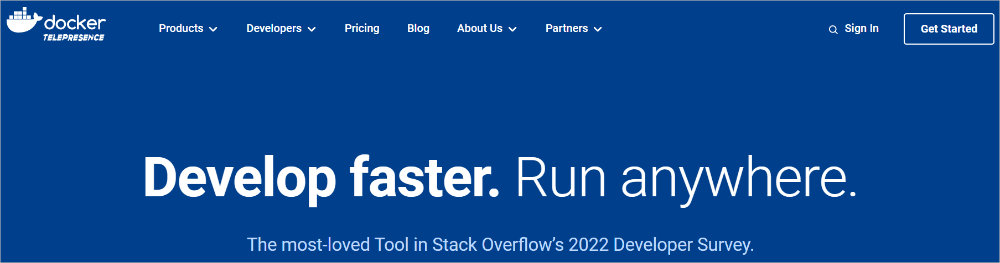   

docker 是一个开源的**应用容器引擎**，让开发者可以打包他们的应用(Redis、MySQL、Spring Boot程序、Centos...)以及依赖包到一个可移植的容器中,然后发布到任何流行的Linux或Windows操作系统的机器上。

## 1.2 docker的优势

docker的优势包括：

1、可移植性：docker容器可以在任何支持docker的环境中运行，包括本地开发环境、测试环境和生产环境，从而提高了应用程序的可移植性。

2、可伸缩性：docker容器可以根据负载的变化进行快速扩展和收缩，从而更好地满足应用程序的需求。

3、隔离性：docker容器提供了隔离的运行环境，从而使得不同容器中运行的应用程序互相隔离，避免了应用程序之间的干扰。

## 1.3 docker和虚拟机的区别

docker和虚拟机的区别如下图所示：

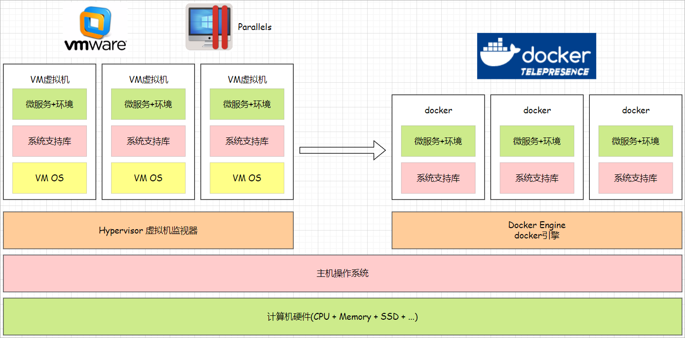   

**隔离性**：在于隔离性上面，由于vm对操作系统也进行了虚拟化，隔离的更加彻底。而docker共享宿主机的操作系统，隔离性较差。

**运行效率**：由于vm的隔离操作，导致生成虚拟机的速率大大低于容器docker生成的速度，因为docker直接利用宿主机的系统内核。它们的启动速度

是在数量级上的差距。

**资源利用率**：在资源利用率上虚拟机由于隔离更彻底，因此利用率也会相对较低。

经典名句：虚拟机已死，容器才是未来

## 1.4 docker架构

docker的架构图如下所示：

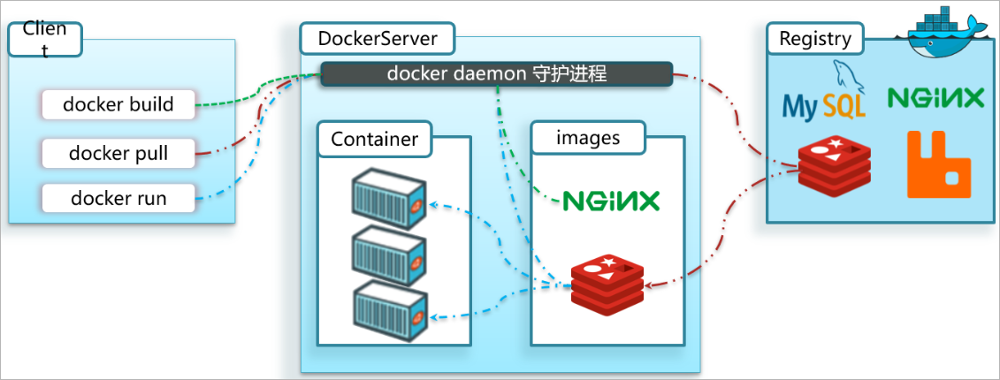  

**docker Client**：docker的客户端，简单的来说就是docker所提供的一些命令。 docker的客户端负责与docker的守护进程进行通讯。

**docker主机**：docker主机就是docker的服务端、在docker主机中存在一个守护进程。这个守护进行负责管理docker中常见的一些对象（比如：镜像、容器、数据卷...）。

1、docker镜像：是一种特殊的文件系统(**软件包**)。用于封装应用项目以及该项目所需要的软件环境。比如一个Redis的镜像中，就封装了Redis这个

软件，并且封装了这个Redis软件所需要的一些依赖环境。镜像是一个静态的概念，不包含任何动态数据，其内容在构建之后也不会被改变。

2、docker容器：容器是由镜像产生的**运行实例**，最终在服务器上运行的就是一个个容器。对于镜像和容器的关系，可以理解为Java中的类与对象的

关系。

**注册中心(Registry)**：就是存储镜像的仓库。在创建容器的时候首先会检测本地是否存在这个容器所对应的镜像，如果不存在此时会从注册中心

上进行拉取镜像到本地，然后在进行使用。如果本地已经存在该镜像了，就不会再次进行拉取直接使用本地的镜像即可。然后默认的注册中心就是

docker Hub（https://hub.docker.com/），这个注册中心可以看做成是一个大的仓库，在这个大的仓库下有存在很多的子仓库，每一子仓库中

存储的就是同一类镜像。各个镜像之间是通过镜像的tag(标签：可以理解为就是镜像的版本)进行区分。


访问docker Hub搜索Redis镜像

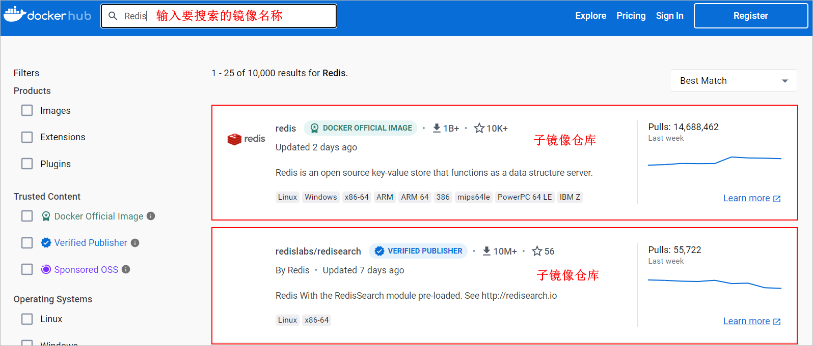  

一般都会选择官方的的子镜像仓库：

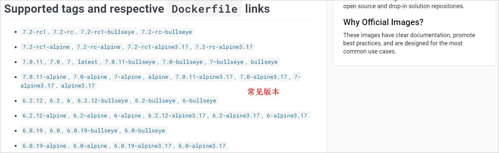  

在子镜像仓库中会存在很多的版本的镜像。

## 1.5 docker的安装与卸载

docker 从 17.03 版本之后分为 CE（Community Edition: 社区版） 和 EE（Enterprise Edition: 企业版），CE版本是免费的，EE版本是收费的。本次

我们用社区版就可以了。

docker的安装和卸载可以参考官方文档：https://docs.docker.com/engine/install/centos/

卸载命令：

```shell
sudo yum remove docker \
                  docker-client \
                  docker-client-latest \
                  docker-common \
                  docker-latest \
                  docker-latest-logrotate \
                  docker-logrotate \
                  docker-engine
```

安装命令：

```shell
# 安装依赖
sudo yum install -y yum-utils

# 安装docker的下载源
sudo yum-config-manager \
    --add-repo \
    https://download.docker.com/linux/centos/docker-ce.repo
    
#通过阿里源进行设置
sudo yum-config-manager --add-repo http://mirrors.aliyun.com/docker-ce/linux/centos/docker-ce.repo
    
# 安装docker    
sudo yum install docker-ce docker-ce-cli containerd.io docker-buildx-plugin docker-compose-plugin
```

## 1.6 docker服务相关命令

docker服务操作的相关命令如下所示：

```shell
# 查看docker服务的运行状态
systemctl status docker

# 启动docker服务
systemctl start docker

# 关闭docker服务
systemctl stop docker

# 重启docker服务
systemctl restart docker
```

## 1.7 阿里云镜像加速器

docker的使用过程中，需要从远程仓库下载镜像，但是默认为国外网站，所以在下载时会出现下载连接超时导致下载失败，因此需要为其配置镜像加速器，以提高下载速度。目前使用的较多的就是阿里云镜像加速器。接下来就来给大家演示一下如何去给docker配置阿里云镜像加速器。

在配置阿里云镜像仓库之前，可以使用如下命令查看docker的详细信息：

```shell
docker info
```


阿里云镜像加速器的使用步骤：

1、注册和登录

2、进入管理后台

3、搜索**容器镜像服务**

4、查看示例代码进行配置即可

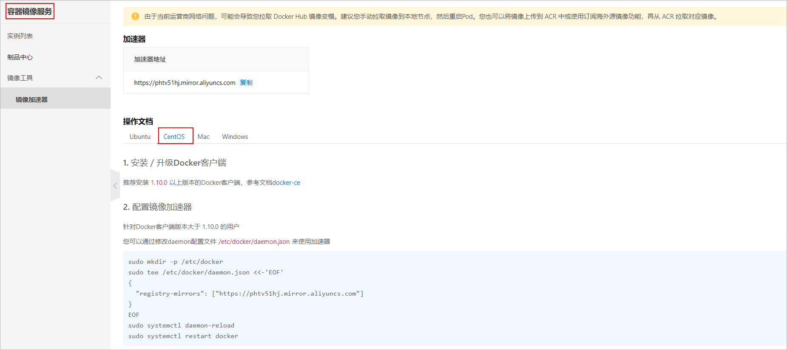  

对应的配置代码如下所示

```shell
# 在etc目录下创建一个docker文件夹
sudo mkdir -p /etc/docker

# 在/etc/docker文件夹下创建一个daemon.json文件，然后写入如下内容
sudo tee /etc/docker/daemon.json <<-'EOF'
{
  "registry-mirrors": ["https://phtv51hj.mirror.aliyuncs.com"]
}
EOF

# 重新加载docker的守护进程
sudo systemctl daemon-reload

# 重启docker服务
sudo systemctl restart docker
```

# 2 docker镜像操作

## 2.1 搜索远程镜像

相关命令如下所示：

```shell
命令：docker search
格式：docker search 镜像关键字
示例：docker search redis								 # 搜索镜像名称中包含redis关键字的镜像
```

执行效果如下所示：

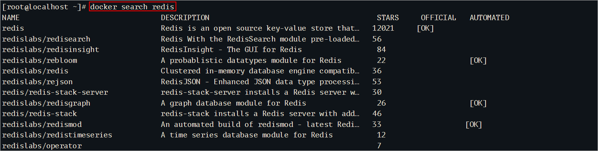  

列介绍：

1、name：            镜像仓库源名称

2、description：  镜像的描述

3、official:		  是否 docker 官方发布

4、stars: 		    镜像的收藏数，收藏数越多表示此镜像的受欢迎程度越高

5、automated:     是否自动构建

## 2.2 拉取镜像

相关命令如下所示：

```shell
命令: docker pull
格式: docker pull 镜像名称[:tag]		# tag表示的镜像的标签，也可以理解为就是镜像的版本
示例1: docker pull redis			   # 默认拉取的是最新的redis镜像
示例2: docker pull redis:7.0.10	   # 拉取redis7.0.10镜像，一个镜像到底存在哪些标签，需要上docker hub中进行查看
```

执行效果如下所示：

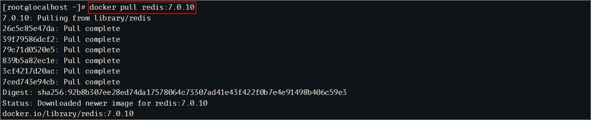  

## 2.3 查看本地镜像

相关命令如下所示：

```shell
命令: docker images									
格式: docker images [options]							# 可以添加一些常见参数选项
示例: docker images
```

执行效果如下所示：

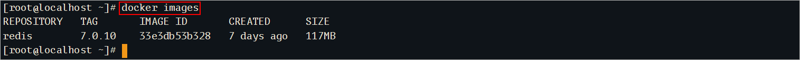  

列介绍：

1、repository：镜像来源仓库名称

2、tag：		  镜像标签

3、image id：  镜像id

4、created：  创建时间

5、size：		镜像的大小


常见的参数选项：

```shell
-q, --quiet												# 查询镜像的id
-f, --filter string								    	# 按照指定的过滤条件进行查询
	常见的过滤条件选项：reference						  	  # 按照正在表达式进行过滤
--format string											# 按照指定的格式化字符串进行结果格式化操作
	常见的格式化字符串：.Repository(镜像仓库)、.Tag(镜像标签)        

示例1：docker images -q
示例2：docker images --filter reference="redis:*"	  	  # 搜索镜像名称为redis，镜像标签是任意的所有镜像
示例3：docker images --format "{{.Repository}}:{{.Tag}}" # 搜索结果中只包含仓库名称和标签名称
```

执行效果如下所示：

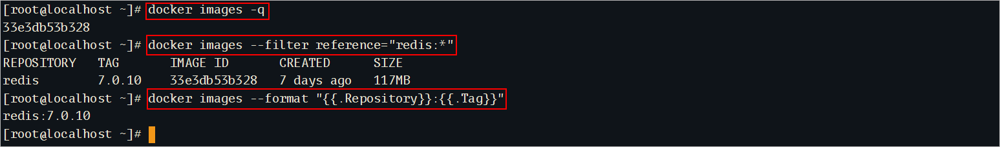  

## 2.4 删除本地镜像

相关命令如下所示：

```shell
命令：docker rmi 										
格式：docker rmi 镜像名称[:镜像标签]/镜像的id	# 根据镜像的id或者镜像的名称进行删除，如果不添加镜像的标签删除的就是最新的镜像
示例: docker rmi redis:7.0.10				# 删除redis:7.0.10镜像
```

执行效果如下所示：

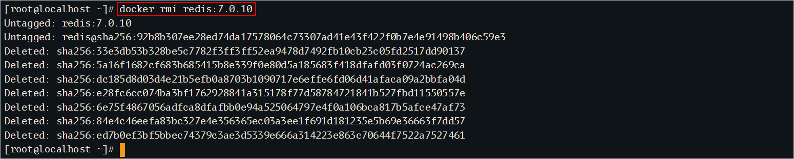  

注意：如果一个镜像存在对应的容器，此时这个镜像是无法进行删除的。


删除所有镜像：

```shell
docker rmi $(docker images -q)			# 慎用
```

## 2.5 帮助文档使用

docker中提供了很多命令，每一个命令也可以加很多的参数选项。把一个命令以及对应的参数选项都记住很显然是不太现实的。可以通过查看docker

帮助文档来学习docker的常用命令以及参数选项的使用。

帮助文档的使用如下所示：

```shell
# 查询docker可以使用到的命令
docker --help

# 查询images命令的使用文档
docker images --help
```

执行效果如下所示：

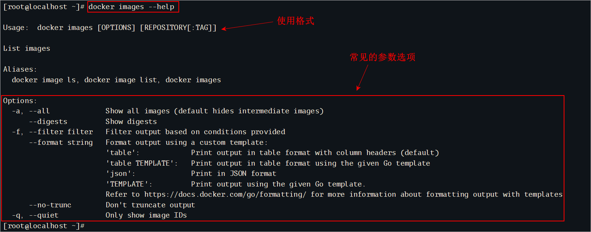  

# 3 docker容器操作

## 3.1 查询容器

相关命令如下所示：

```shell
命令：docker ps 
格式：docker ps [options]	# 可以添加一些参数选项，如果不添加表示查询本地所有正在运行的容器
示例: docker ps 			# 查看本地正在运行的容器
```

执行效果如下所示：

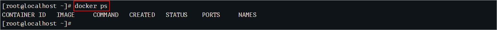  

列介绍：

1、container id：   容器名称

2、image:			  镜像名称

3、command：      容器启动时所执行的命令

4、created：        创建时间

5、status：		  容器状态

6、ports：            端口映射情况

7、names：          容器的名称


常见参数选项：

```shell
-a,--all															# 查询所有的镜像，包含未运行的容器
-q,--quiet															# 查询容器的id

示例1：docker ps -a												  # 查询所有的容器包含未运行的容器
示例2：docker ps -q												  # 查询容器的id	
```

## 3.2 创建容器

### 3.2.1 容器创建入门

容器分类：

1、交互型容器：具有和用户交互的输入和输出终端，容器创建后自动进入容器中，退出容器后，容器自动关闭。

2、守护型容器：没有和用户交互终端，需要使用docker exec进入容器，退出后，容器不会关闭。

命令介绍：

```shell
命令:  docker run
格式： docker run [OPTIONS] 镜像的名称:镜像标签/镜像id [COMMAND] [ARG...]

类型参数选项：
-d,--detach								# 以后台的模式执行命令
-t, --tty								# 分配一个虚拟终端，通常和-i参数一起使用
-i,--interactive						# 把交互界面一直保留，通常和-t参数一起使用

示例1：docker run -it redis:7.0.10       # 创建一个交互型容器，容器在启动的时候打开一个shell窗口，并且让这个窗口一直保留
示例2：docker run -d  redis:7.0.10       # 创建一个守护型容器，容器以后台的方式运行
```


执行效果如下所示：

效果1：

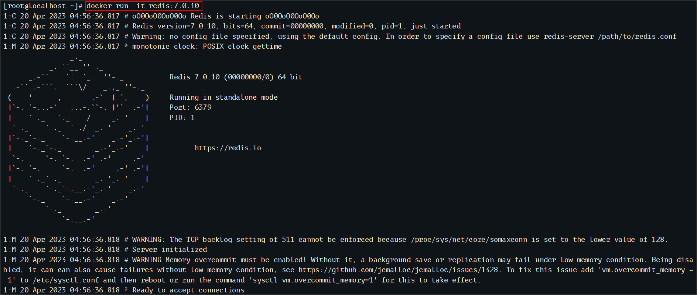  

交互型容器创建好了以后，直接进入到容器的内部了。

效果2：

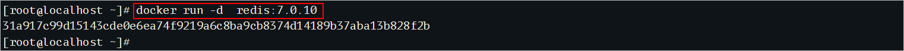  

守护型容器创建好了以后，容器就是以后台的方式进行运行。

### 3.2.2 常见参数选项

#### --name 

--name参数可以给创建的容器设置名称。如果没有加该参数，那么此时docker会为容器随机分配一个名字。

使用方式如下所示：

```shell
docker run -d --name redis01 redis:7.0.10
```

执行效果如下所示：

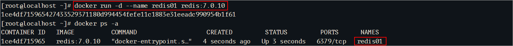  

#### -p

注意：docker容器内部所运行的进程是无法被外部机器(windows)直接访问的, 如果外部机器向访问容器内的进程，那么在创建容器的时候就需要在

linux宿主机上开一个端口号，并且需要建立这个端口号和容器内进程端口号之间的映射关系，这样外部机器就可以通过宿主机的端口号访问到容器内

的进程了。

如下图所示：

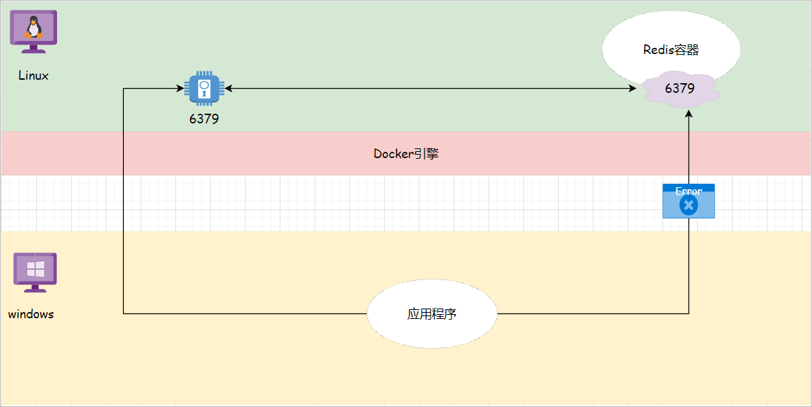  

要实现端口映射关系的指定就需要使用-p参数。

使用方式如下所示：

```shell
docker run -d --name redis01 -p 6379:6379 redis:7.0.10
```

## 3.3 容器服务管理

容器管理的相关命令如下所示：

```shell
docker stop 容器名称/容器id											# 关闭容器
docker start  容器名称/容器id											# 启动容器
docker restart 容器名称/容器id										# 重启容器
```

## 3.4 删除容器

删除容器的常见命令如下所示：

```shell
命令: docker rm
格式：docker rm 容器名称/容器的id							#  删除容器
示例：docker rm angry_lamport							 #  删除angry_lamport容器
```

注意：上述的命令只能删除已经关闭的容器，如果想删除正在运行的容器，可以通过添加-f参数进行实现。


删除所有的容器

```shell
docker rm $(docker ps -aq)
```

## 3.5 进入容器

思考问题：检查容器是否可以和linux宿主机之间进行通讯，怎么实现？

实现思路：进入到容器内部通过ping命令检测

进入容器命令如下所示：

```shell
命令：docker exec
格式：docker exec [OPTIONS] CONTAINER COMMAND [ARG...]
常见的参数选项：												  
-t, --tty														# 分配一个虚拟终端，通常和-i参数一起使用
-i,--interactive												# 把交互界面一直保留，通常和-t参数一起使用

示例1：docker exec -it redis01 /bin/bash					 	  # 进入到容器中同时打开一个shell窗口
```

执行效果如下所示：

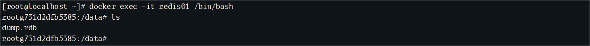  

docker exec命令也可以在容器中执行一个命令：

```shell
docker exec redis01 echo atguigu
```


## 3.6 其他命令

如下所示：

```shell
docker logs -f 容器名称/容器的id						# 查询容器内进程日志，-f参数表示实时监控日志信息
docker inspect 容器名称/容器的id						# 查看容器的详情信息
docker cp 											 # 完成容器和宿主机之间的文件copy

示例1: docker logs -f redis01				   # 实时查看redis01这个容器中的日志信息
示例2: docker inspect redis01				   # 查看容器的详情信息，主要就是：目录映射情况、端口映射情况、ip地址
示例3: docker cp a.txt redis01:/root		   # 把宿主机中a.txt文件拷贝到redis01的root目录中
示例4: docker cp redis01:/root/a.txt .       # 把容器中的root目录下的a.txt文件拷贝到宿主机中当前目录中
```


## 3.7 备份与迁移

对某一个容器修改完毕以后，我们可以把最新的容器部署到其他的环境中。具体的流程操作如下所示：

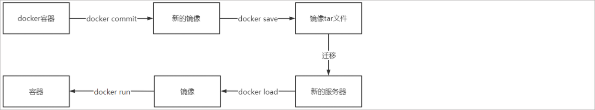  

涉及的docker命令：

```shell
docker commit 容器名称/容器的id 镜像名称			  # 把docker容器保存成一个镜像
docker save -o 镜像tar文件名称 镜像名称/镜像id		 # 把镜像保存为tar文件
docker load -i 镜像名称							  # 把tar文件恢复成为一个镜像
```

示例代码：

```shell
docker commit redis01 myredis				     # 将redis01容器保存为一个镜像
docker save -o myredis.tar myredis 				 # 将myredis镜像保存为一个tar文件
docker rmi myredis								 # 删除之前的myredis镜像
docker load -i myredis.tar 						 # 将myredis.tar恢复成一个镜像
```

# 4 docker数据卷操作

## 4.1 数据卷概述

思考问题：在Redis容器中存储的数据，如果Redis容器被删除了，数据是否还存在?

解决方案：将数据存储到Linux宿主机的磁盘目录中


数据卷概述：数据卷是docker所提供的一个虚拟目录，这个虚拟目录会对应宿主机的一个真实目录。在创建容器的时候就可以将这个数据卷挂载到容

器中的某一个目录下，那么此时在该目录下所产生的数据就会存储到宿主机的目录下，实现了容器和宿主机之间的文件共享。

如下图所示：

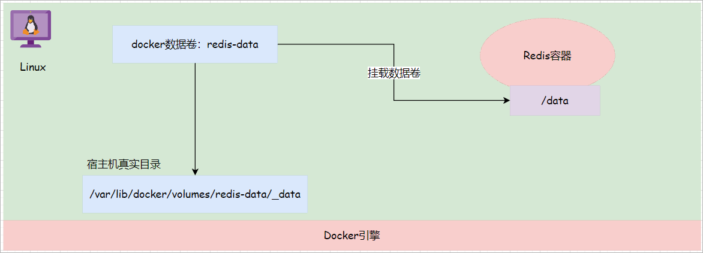  

## 4.2 常见命令

### 4.2.1 查看数据卷

命令如下所示：

```shell
docker volume ls
```

执行效果如下所示：

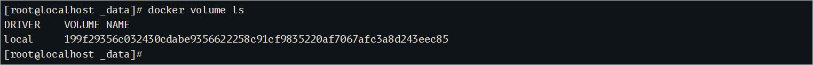  

### 4.2.2 创建数据卷

命令如下所示：

```shell
docker volume create 数据卷名称
```

执行效果如下所示：

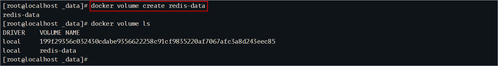 

### 4.2.3 查询数据卷详情

命令如下所示：

```shell
docker volume inspect 数据卷名称
```

执行效果如下所示：

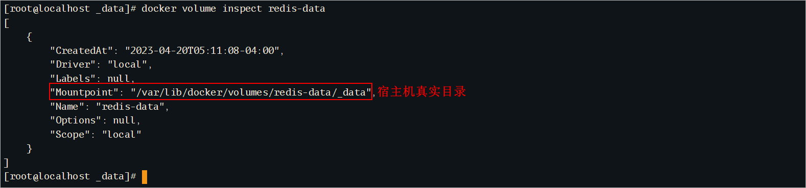 

### 4.2.4 删除数据卷

命令如下所示：

```shell
docker volume rm 数据卷名称  # 删除指定的数据卷
docker volume prune 		# 删除未使用的数据卷
```

执行效果如下所示：

 

## 4.3 数据卷挂载

数据卷创建好了以后，在创建容器的时候就可以通过-v参数，将创建好的数据卷挂载到容器中的某一个目录下。

命令如下所示：

```shell
格式: -v 数据卷名称:容器目录
示例：docker run -d --name redis02 -p 6380:6379 -v redis-data:/data redis:7.0.10
```

注意事项：

1、如果数据卷没有提前创建好，那么在创建容器的时候会自动创建对应的数据卷

2、数据卷挂载的时候数据卷名称前面**没有/**

3、容器目录不存在会自动创建

4、数据卷目录如果不为空，此时会使用数据卷目录内容覆盖容器目录内容

5、数据卷目录如果为空，容器目录不为空，此时就会使用容器目录内容覆盖数据卷目录

## 4.4 目录挂载

通过-v参数也可以将宿主机上的某一个目录挂载到容器中的某一个目录下。

命令如下所示：

```shell
格式: -v 宿主机目录:容器目录
示例：docker run -d --name redis03 -p 6381:6379 -v /redis-data:/data redis:7.0.10
```

注意事项：

1、如果宿主机目录没有提前创建好，那么在创建容器的时候会自动创建对应的宿主机目录

2、宿主机目录挂载的时候宿主机目录名称前面**有/**

3、容器目录不存在会自动创建

4、宿主机目录如果不为空，此时会使用宿主机目录内容覆盖容器目录内容

5、宿主机目录如果为空，容器目录不为空，此时就会使用容器目录内容清空掉

# 5 Portainer工具

## 5.1 安装与启动

上述对容器和镜像的管理都是基于docker客户端的命令来完成，不太方便。为了方便的对docker中的一些对象(镜像、容器、数据卷...)来进行管理，

可以使用Portainer来完成。Portainer是一个**可视化**的容器镜像的图形管理**工具**，利用Portainer可以轻松构建，管理和维护docker环境。


Portainer安装：

```shell
# 搜索portainer
docker search portainer

# 拉取镜像
docker pull portainer/portainer

#创建并启动容器,注意需要做一个docker.sock文件的映射，后期portainer会通过这个文件和docker的守护进程进行通讯，管理docker的相关对象
# --restart=always: 表示随着docker服务的启动而启动
docker run -d -p 9000:9000 --name=portainer --restart=always -v /var/run/docker.sock:/var/run/docker.sock portainer/portainer
```


访问：ip:9000   第一次登陆需要设置登陆密码，密码不得少于8位

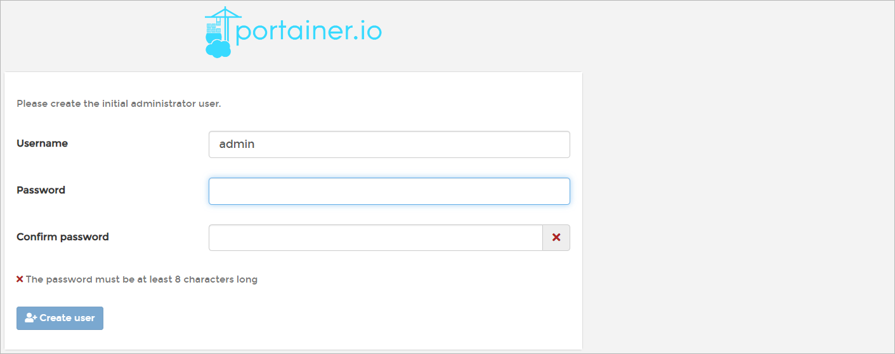 

选择portainer需要管理的环境（本地还是远程）

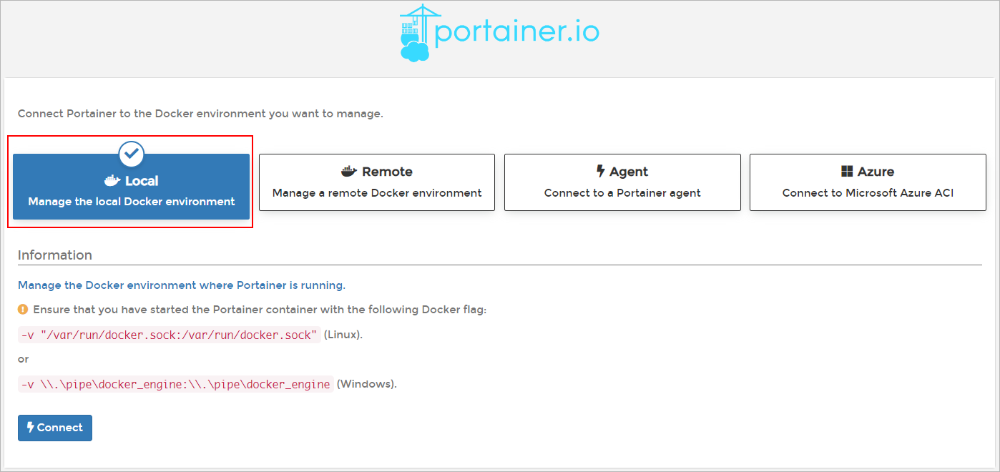 

Portainer的首页

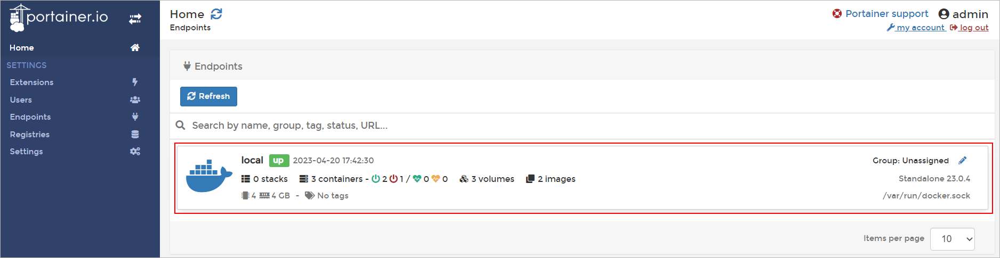 

## 5.2 镜像管理

选择docker服务，进入到如下页面

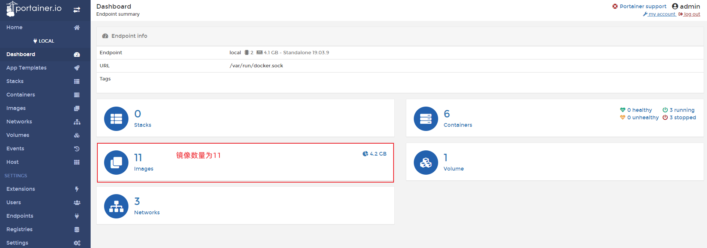 

点击镜像页签，对镜像进行相关管理

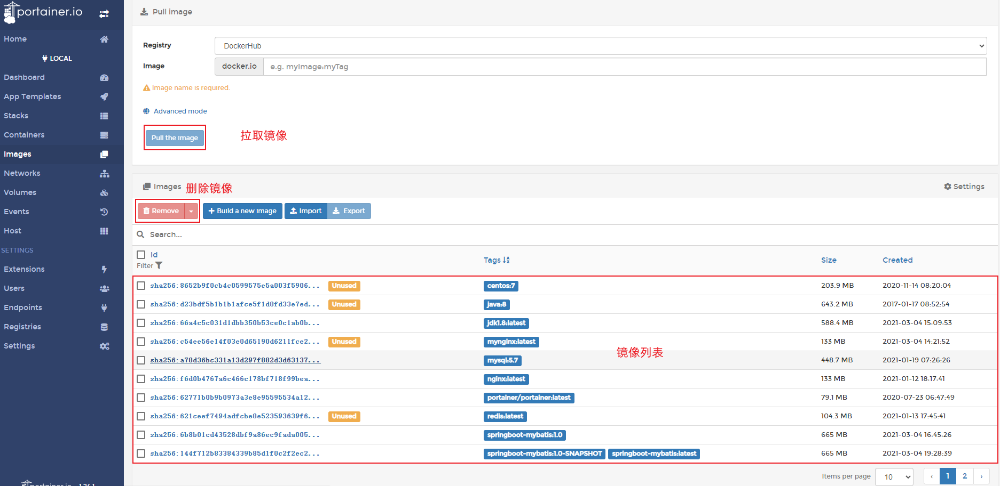 

## 5.3 容器管理

在首页选择docker服务，进入到如下页面

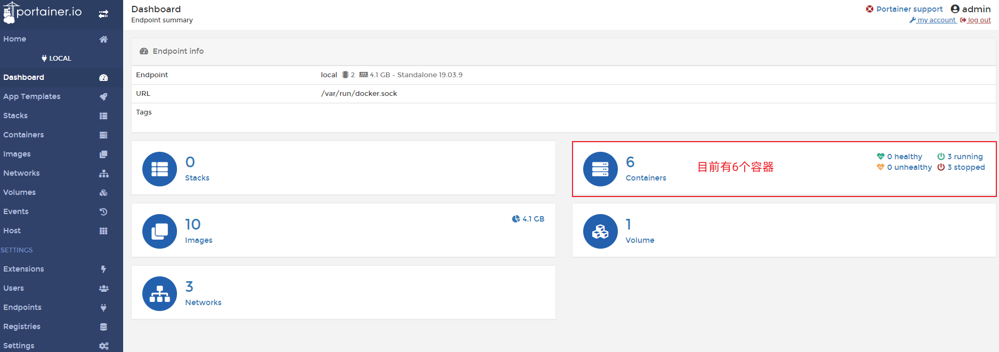 

 点击容器页签，对容器进行相关管理

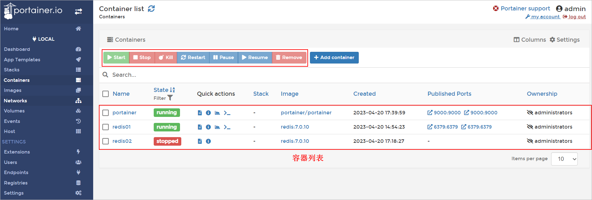 

创建容器

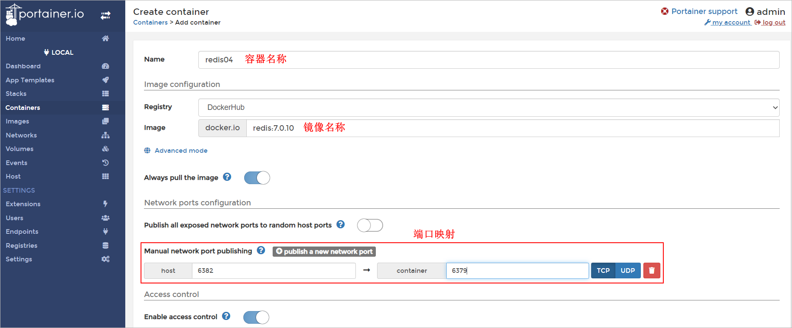 

数据卷挂载：需要先创建数据卷，然后在下方选择volumes完成数据卷的挂载。

# 6 Spring Boot项目部署

本章节主要讲解的就是如何把一个Spring Boot项目使用docker进行部署，以减少整个项目的维护成本。

## 6.1 dockerfile

### 6.1.1 dockerfile简介

前面我们所使用的镜像都是别人构建好的，但是别人构建好的镜像不一定能满足我们的需求。为了满足我们自己的某一些需求，此时我们就需要构建自

己的镜像，怎么构建？使用dockerfile。

dockerfile就是一个**文本文件**，在这个文本文件中可以使用docker所提供的一些指令来指定我们构建镜像的细节，后期就可以使用这个dockerfile文

件来构建自己的镜像。

dockerfile文件内容一般分为4部分：

1、基础镜像信息(必选)

2、维护者信息(可选)

3、镜像操作指令(可选)

4、容器启动时执行的指令(可选)


常用命令

|    指令    | 用法                                   | 作用                                                         |
| :--------: | :------------------------------------- | :----------------------------------------------------------- |
|    FROM    | FROM  image_name:tag                   | 指定一个构建镜像的基础源镜像，如果本地没有就会从公共库中拉取，没有指定镜像的标签会使用默认的latest标签，可以出现多次，如果需要在一个dockerfile中构建多个镜像。 |
| MAINTAINER | MAINTAINER user_name                   | 描述镜像的创建者，名称和邮箱                                 |
|    RUN     | RUN "command" "param1" "param2"        | 用来执行一些命令，可以写多条                                 |
|    ENV     | ENV key value                          | 设置容器的环境变量，可以写多条。                             |
|    ADD     | ADD source_dir/file                    | 将宿主机的文件复制到容器内，如果是压缩文件，则复制后自动解压 |
| ENTRYPOINT | ENTRYPOINT "command" "param1" "param2" | 用来指定容器启动时所执行的命令                               |

### 6.1.2 入门案例

需求：使用dockerfile来构建一个包含Jdk17的centos7镜像

分析：

1、基础的镜像的应该选择centos:7

2、在自己所构建的镜像中需要包含Jdk17，就需要把Jdk17添加到centos:7的基础镜像中

3、为了方便的去使用自己构建的镜像中的Jdk17，就需要去配置环境变量

4、因为Jdk17仅仅是一个开发工具，并不是一个服务进程，因此在启动容器的时候可以不指定任何的执行命令

实现步骤：

1、将Jdk17的安装包上传到linux服务器的指定目录下

2、在Jdk17所在的目录下创建一个dockerfile文件

3、使用docker build命令构建镜像

4、使用docker images查看镜像构建情况

5、使用自己所构建的镜像创建容器，测试Jdk17的安装情况


代码实现

```shell
# 1、创建目录
mkdir –p /usr/local/dockerfilejdk17
cd /usr/local/dockerfilejdk17
  
# 2、下载jdk-17_linux-x64_bin.tar.gz并上传到服务器（虚拟机）中的/usr/local/dockerfilejdk17目录
# 3、在/usr/local/dockerfilejdk17目录下创建dockerfile文件，文件内容如下：
vi dockerfile

FROM centos:7
MAINTAINER atguigu
RUN mkdir -p /usr/local/java
ADD jdk-17_linux-x64_bin.tar.gz /usr/local/java/
ENV JAVA_HOME=/usr/local/java/jdk-17.0.8
ENV PATH=$PATH:$JAVA_HOME/bin

# 4、执行命令构建镜像；不要忘了后面的那个 .
docker build -t centos7-jdk17 .

# 5、查看镜像是否建立完成
docker images

# 6、创建容器
docker run -it --name atguigu-centos centos7-jdk17 /bin/bash
```

## 6.2 案例介绍与需求分析

需求：将提供的Spring Boot项目使用容器化进行部署

分析：

1、Spring Boot项目中使用到了Mysql环境，因此需要先使用docker部署mysql环境

2、要将Spring Boot项目使用docker容器进行部署，就需要将Spring Boot项目构建成一个docker镜像

实现步骤：

1、使用docker部署mysql

2、使用dockerfile构建Spring Boot镜像

* 将Spring Boot打包成一个Jar包
* 把Jar包上传到Linux服务器上
* 编写dockerfile文件
* 构建Spring Boot镜像

3、创建容器进行测试

## 6.3 docker部署Mysql

使用docker部署Mysql步骤如下所示：

```shell
# 创建容器。 -e: 设置环境变量	--privileged=true 开启root用户权限
docker run -di --name mysql -p 3306:3306 -v mysql_data:/var/lib/mysql -v mysql_conf:/etc/mysql --privileged=true -e MYSQL_ROOT_PASSWORD=1234

# 进入容器
docker exec -it mysql /bin/bash
mysql -uroot -p								# 登录mysql
```

使用Navicat连接mysql，并创建对一个的数据库和数据库表

创建数据库：docker

创建表：

```sql
CREATE TABLE `tb_school` (
  `id` int(11) NOT NULL AUTO_INCREMENT,
  `name` varchar(255) DEFAULT NULL,
  `address` varchar(255) DEFAULT NULL,
  PRIMARY KEY (`id`)
) ENGINE=InnoDB DEFAULT CHARSET=utf8;
```

添加测试数据

```sql
INSERT INTO `tb_school` VALUES (1, '尚硅谷-北京校区', '北京市昌平区宏福科技园2号楼3层');
INSERT INTO `tb_school` VALUES (2, '尚硅谷-上海校区', '上海市松江区谷阳北路166号大江商厦3层');
INSERT INTO `tb_school` VALUES (3, '尚硅谷-深圳校区', '深圳市宝安区西部硅谷大厦B座C区一层');
INSERT INTO `tb_school` VALUES (4, '尚硅谷-西安校区', '西安市雁塔区和发智能大厦B座3层');
INSERT INTO `tb_school` VALUES (5, '尚硅谷-成都校区', '成都市成华区北辰星拱青创园综合楼3层');
INSERT INTO `tb_school` VALUES (6, '尚硅谷-武汉校区', '武汉市东湖高新区东湖网谷6号楼4层');
```

## 6.4 dockerfile构建镜像

### 6.4.1 项目打包

具体步骤：

1、在idea中部署资料\基础项目\ebuy-docker项目，并启动项目访问：http://localhost:8081/

2、执行mvn package命令进行项目打包

3、上传jar包到linux服务器上

### 6.4.2 dockerfile文件

dockerfile文件的内容如下所示：

```shell
FROM centos7-jdk17
MAINTAINER atguigu

# 声明容器内主进程所对应的端口
EXPOSE 8081
ADD ebuy-docker-1.0-SNAPSHOT.jar /ebuy-docker-1.0-SNAPSHOT.jar

# 相当于windows中的cd命令
WORKDIR /      
ENTRYPOINT ["java" , "-jar" , "ebuy-docker-1.0-SNAPSHOT.jar"]
```

目录结构如下所示：

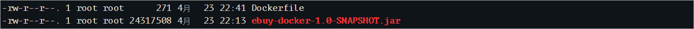 

### 6.4.3 构建镜像

命令如下所示：

```shell
docker build -t ebuy-docker:v1.0 .
```

执行效果如下所示：

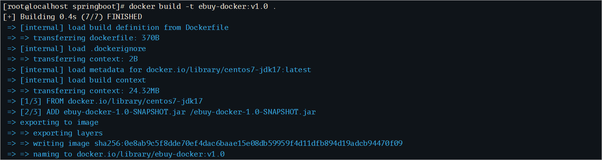 

## 6.5 创建容器

命令如下所示：

```shell
docker run -d --name ebuy-docker -p 8081:8081 ebuy-docker:v1.0
```

访问测试: http://192.168.136.142:8081


# 7 Maven的docker插件

刚才的构建过程是手动镜像构建的过程。使用Maven的docker插件可以实现镜像的自动化部署。

步骤：

1、在pom.xml文件中添加Maven的docker插件

2、开启docker服务端的远程访问

3、在工程的根目录下创建dockerfile文件

4、使用maven的打包命令进行打包

5、创建容器并访问

实操：

1、在pom.xml文件中添加Maven的docker插件

```xml
<plugin>
                
    <groupId>com.spotify</groupId>
    <artifactId>docker-maven-plugin</artifactId>
    <version>1.2.2</version>

    <!--将插件绑定在某个phase执行-->
    <executions>
        <execution>
            <id>build-image</id>
            <!--将插件绑定在package这个phase(阶段)上。也就是说，用户只需执行mvn package，就会自动执行mvn docker:build-->
            <phase>package</phase>
            <goals>
                <goal>build</goal>
            </goals>
        </execution>
    </executions>

    <configuration>

        <!--指定生成的镜像名-->
        <imageName>${project.artifactId}</imageName>

        <!--指定标签,也就是版本号,可以自定义-->
        <imageTags>
            <imageTag>v2.0</imageTag>
        </imageTags>
        
        <!--指定远程 docker api地址 也就是服务器ip+docker的端口号-->
        <dockerHost>http://192.168.136.142:2375</dockerHost>

        <!-- 指定 dockerfile 路径-->
        <dockerDirectory>${project.basedir}</dockerDirectory>
        
        <!-- 是否跳过docker构建 -->
        <skipDockerBuild>false</skipDockerBuild>

    </configuration>

</plugin>
```

2、docker服务端开启远程访问

```shell
#修改该文件
vim /lib/systemd/system/docker.service

#找到ExecStart行，修改成如下内容
ExecStart=/usr/bin/dockerd -H tcp://0.0.0.0:2375 -H fd:// --containerd=/run/containerd/containerd.sock

systemctl daemon-reload				#重启守护进程
systemctl restart docker			#重启docker
```

3、编写dockerfile文件

注意：

1、该文件的位置必须是和pom.xml处于同一个目录

2、关闭防火墙

```shell
FROM centos7-jdk17
MAINTAINER atguigu
EXPOSE 8081
ADD target/ebuy-docker-1.0-SNAPSHOT.jar /ebuy-docker-1.0-SNAPSHOT.jar

WORKDIR /
ENTRYPOINT ["java" , "-jar" , "ebuy-docker-1.0-SNAPSHOT.jar"]
```

4、执行maven的打包命令

```shell
mvn clean package -DskipTests								# 打包跳过测试
mvn clean package -DskipTests -DskipdockerBuild				# 打包跳过测试的同时跳过构建
```

5、创建容器并进行访问

```shell
docker run -d --name ebuy-docker -p 8082:8081 ebuy-docker:latest
```

# 8 docker compose

## 8.1 docker compose简介

1、Docker Compose是一个工具，用于定义和运行多容器应用程序的工具；

2、Docker Compose通过yml文件定义多容器的docker应用；

3、Docker Compose通过一条命令根据yml文件的定义去创建或管理多容器；

如下图所示：

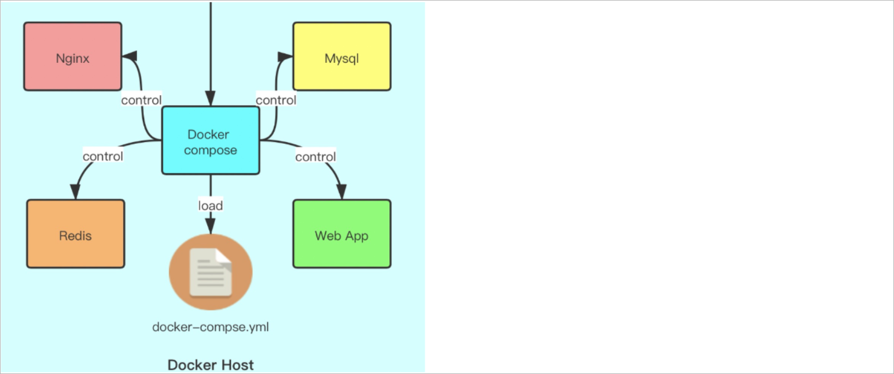 

Docker Compose 是用来做Docker 的多容器控制，有了 Docker Compose 你可以把所有繁复的 Docker 操作全都一条命令，自动化的完成。

官网地址：https://docs.docker.com/compose/install/linux/

## 8.2 下载与安装

下载与安装：

```shell
# 创建指定目录存储docker compose
mkdir -p /usr/local/lib/docker/cli-plugins

# 下载并移动
curl -SL https://github.com/docker/compose/releases/download/v2.14.2/docker-compose-linux-x86_64 -o /usr/local/lib/docker/cli-plugins/docker-compose

# 给docker-compose文件赋予可执行权限
sudo chmod +x /usr/local/lib/docker/cli-plugins/docker-compose

# 查看docker compose的版本
docker compose version
```

## 8.3 入门案例

需求：使用docker compose部署redis

docker-compose.yml文件的内容如下所示：

```yml
services:
  redis:
    image: redis:7.0.10
    container_name: redis
    ports:
      - "6379:6379"
    volumes:
      - redis-data:/data
volumes:
  redis-data: {}
```

docker compose相关命令：  

```shell
# 启动容器(如果不存在容器就创建、存在则修改)
docker compose -f docker-compose.yml up -d

# 删除所有容器
docker compose -f docker-compose.yml down

# 停止所有容器
docker compose -f docker-compose.yml stop

# 启动所有容器
docker compose -f docker-compose.yml start

# 重启所有容器
docker compose -f docker-compose.yml restart
```

docker compose文件中其他的常见指令参考官方文档：https://docs.docker.com/compose/compose-file/05-services/

## 8.4 编排Spring Boot项目

需求：使用docker compose部署第六章的spring boot项目

docker-compose.yml文件的内容如下所示：

```yaml
services:
  # 部署mysql
  mysql:
    container_name: mysql
    image: mysql:8.0.29
    ports:
      - "3306:3306"
    volumes:
      - mysql_data:/var/lib/mysql
      - mysql_conf:/etc/mysql
    privileged: true
    environment:
      - "MYSQL_ROOT_PASSWORD=1234"
  # 部署spring boot项目
  ebuy:
    container_name: ebuy
    image: ebuy-docker
    ports:
      - "8081:8081"
volumes:
  mysql_data: {}
  mysql_conf: {}
```

# 9 docker镜像仓库

## 9.1 镜像仓库简介

镜像仓库作用：存储镜像，可以通过镜像仓库实现镜像的共享

镜像仓库的使用流程：

 

镜像仓库分类：

1、公有镜像仓库：可以理解成云仓库、公有仓库，是由某个组织、公司维护的仓库，对互联网开放，所有人共享。如官方的仓库docker hub。

2、私有镜像仓库：不对外开放。一般情况下只在公司内网中使用，用于加快镜像拉取速度、维护公司资产。

私有镜像仓库种类：

1、Registry是Docker自带的镜像仓库，部署运行非常简洁，非常适合在测试时使用。

2、Harbor

## 9.2 Harbor简介

Harbor是VMware公司开源的企业级DockerRegistry项目，其目标是帮助用户迅速搭建一个企业级的Dockerregistry服务。它以Docker公司开

源的registry为基础，提供了管理UI，基于角色的访问控制(Role Based Access Control)，AD/LDAP集成、以及审计日志(Auditlogging) 等企业

用户需求的功能，同时还原生支持中文。

## 9.3 下载与安装

Harbor被部署为多个Docker容器，因此可以部署在任何支持Docker的Linux服务器上，且需要Docker和Docker Compose才能安装。

### 9.3.1 下载

下载地址：https://github.com/goharbor/harbor/releases

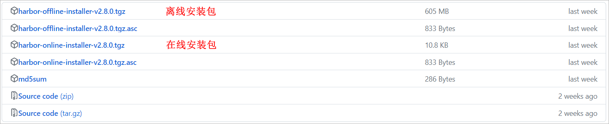 

这里我们下载在线安装包：

```
wget https://github.com/goharbor/harbor/releases/download/v2.8.0/harbor-online-installer-v2.8.0.tgz
```

### 9.3.2 安装

具体步骤如下所示：

**1、解压并修改配置文件**

```
tar -zxvf harbor-online-installer-v2.8.0.tgz     # 解压tgz包
cp harbor.yml.tmpl harbor.yml                    # 创建一个配置文件
vim harbor.yml                                   # 修改配置文件
```

配置的文件的修改如下所示：

 

**2、启动Harbor**

```shell
# 1、 进入到Harbor的解压目录
# 2、执行安装脚本
sh install.sh
```

注意：如果安装的时候报错了，可以给docker配置多个镜像地址：

```json
// 编辑文件
vim /etc/docker/daemon.json

// 文件内容
{
  "registry-mirrors": ["https://registry.docker-cn.com","http://hub-mirror.c.163.com","http://f1361db2.m.daocloud.io","https://mirror.ccs.tencentyun.com","https://phtv51hj.mirror.aliyuncs.com"]
}
```

**3、启动关闭命令**

```
docker compose -f docker-compose.yml up -d            启动 Harbor
docker compose -f docker-compose.yml stop             关闭 Harbor
```

**4、访问Harbor**

访问地址：http://192.168.136.131/

用户名/密码：admin/Harbor12345

## 9.4 Harbor使用

### 9.4.1 上传镜像

需求：将本地的ebuy-docker镜像上传到Harbor中

实现步骤：

1、在Harbor上创建一个项目

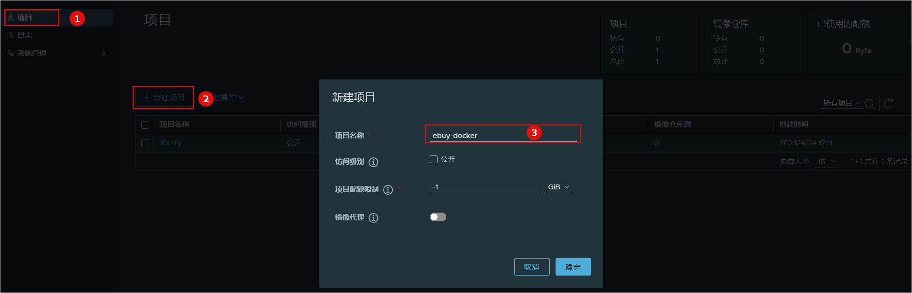 

2、docker添加安全访问权限

```shell
# 编辑/etc/docker/daemon.json文件
vim /etc/docker/daemon.json

# 添加安全访问权限
{
  "insecure-registries":["http://192.168.136.142"]
}

# 重启Docker
systemctl restart docker
```

3、推送docker镜像到该项目中

```shell
docker login -u admin -p Harbor12345 192.168.136.142         			 # 登录到Harbor
docker tag ebuy-docker 192.168.136.142/ebuy-docker/ebuy-docker:latest    # 给镜像重新打一个标签
docker push 192.168.136.142/ebuy-docker/ebuy-docker:latest               # 推送镜像到Harbor中
```

推送完毕以后，在ebuy-docker项目中会自动创建一个ebuy-docker的镜像仓库：

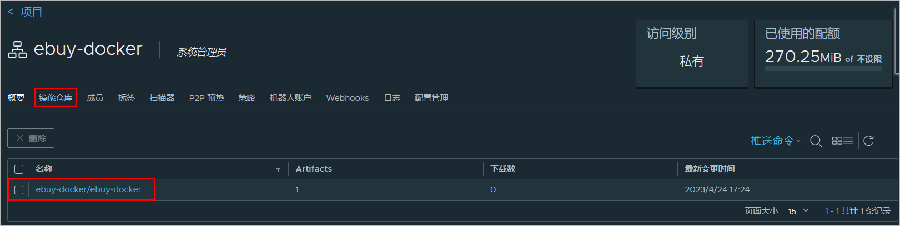 

### 9.4.2 拉取镜像

命令操作如下所示：

```shell
docker login -u admin -p Harbor12345 192.168.136.142         # 登录到Harbor
docker pull 192.168.136.142/ebuy-docker/ebuy-docker:latest   # 拉取镜像
```

