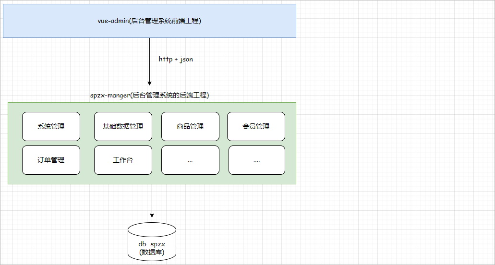
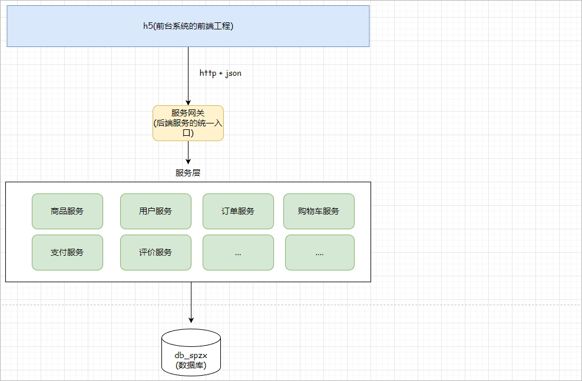
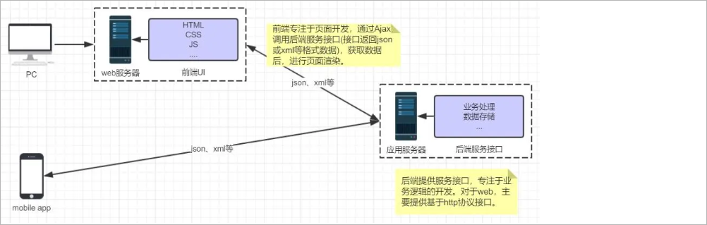
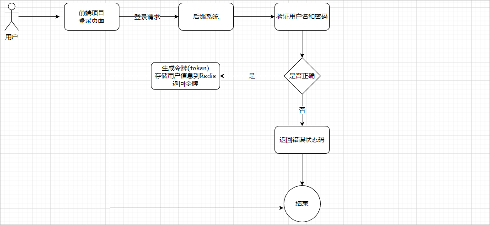
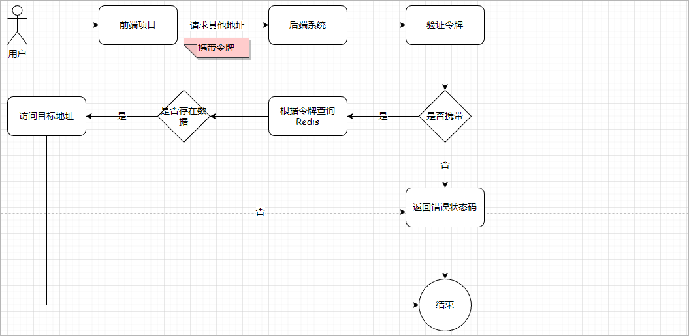
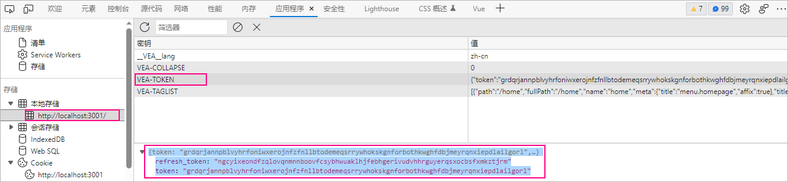
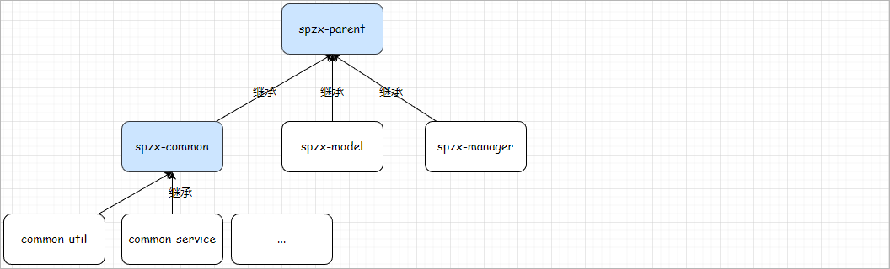
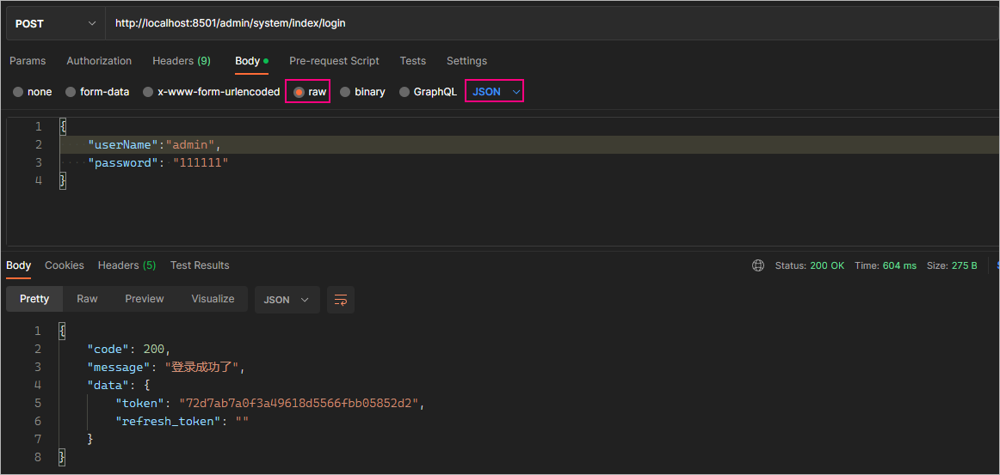

# 1 软件开发介绍

作为一名软件开发工程师,我们需要了解在软件开发过程中的开发流程， 以及软件开发过程中涉及到的岗位角色，角色的分工、职责， 并了解软件开发

中涉及到的三种软件环境。那么本章节，我们将从软件开发流程、角色分工、软件环境 三个方面，来整体上介绍一下软件开发。

## 1.1 软件开发流程

软件的开发流程如下所示：

 

> 第1阶段: 需求分析

完成产品原型、需求规格说明书的编写。  

**产品原型**: 一般是通过网页(html)的形式展示当前的页面展示什么样的数据, 页面的布局是什么样子的，点击某个菜单，打开什么页面，点击某个按

钮，出现什么效果，都可以通过产品原型看到。 可以通过墨刀网查看产品原型样例：https://modao.cc/community

**需求规格说明书**:  一般来说就是使用 Word 文档来描述当前项目有哪些功能，每一项功能的需求及业务流程是什么样的，都会在文档中描述。

> 第2阶段: 设计

设计的内容包含 产品设计、UI界面设计、概要设计、详细设计、**数据库设计**。

在设计阶段，会出具相关的UI界面、及相关的设计文档。比如数据库设计，需要设计当前项目中涉及到哪些数据库，每一个数据库里面包含哪些表，

这些表结构之间的关系是什么样的，表结构中包含哪些字段，字段类型都会在文档中描述清楚。

> 第3阶段: 编码

编写项目代码、并完成单元测试。

作为软件开发工程师，我们主要的工作就是在该阶段， 对分配给我们的模块功能，进行编码实现。编码实现完毕后，进行单元测试，单元测试通过后

再进入到下一阶段。

> 第4阶段: 测试

在该阶段中主要由测试人员, 对部署在测试环境的项目进行功能测试, 并出具测试报告。

> 第5阶段: 上线运维

在项目上线之前， 会由运维人员准备服务器上的软件环境安装、配置， 配置完毕后， 再将我们开发好的项目，部署在服务器上运行。

我们作为软件开发工程师， 我们主要的任务是在编码阶段， 但是在一些小的项目组当中， 也会涉及到数据库的设计、测试等方面的工作。

## 1.2 角色分工

学习了软件开发的流程之后， 我们还有必要了解一下在整个软件开发过程中涉及到的岗位角色，以及各个角色的职责分工。

 

如下表所示：

| 岗位/角色                           | 职责/分工                                  |
| ----------------------------------- | ------------------------------------------ |
| 项目经理                            | 对整个项目负责，任务分配、把控进度         |
| 产品经理                            | 进行需求调研，输出需求调研文档、产品原型等 |
| UI设计师                            | 根据产品原型输出界面效果图                 |
| 架构师                              | 项目整体架构设计、技术选型等               |
| <font color='red'>开发工程师</font> | <font color='red'>功能代码实现</font>      |
| 测试工程师                          | 编写测试用例，输出测试报告                 |
| 运维工程师                          | 软件环境搭建、项目上线                     |

上述我们讲解的角色分工, 是在一个项目组中比较标准的角色分工, 但是在实际的项目中, 有一些项目组由于人员配置紧张, 可能并没有专门的架构师或

测试人员, 这个时候可能需要有项目经理或者程序员兼任。 

## 1.3 软件环境

在我们日常的软件开发中，会涉及到软件开发中的三套环境， 那么这三套环境分别是: 开发环境、测试环境、生产环境。 接下来，我们分别介绍一下

这三套环境的作用和特点。

> 开发环境(development)

我们作为软件开发人员，在开发阶段使用的环境，就是开发环境，一般外部用户无法访问。

比如，我们在开发中使用的MySQL数据库和其他的一些常用软件，我们可以安装在本地， 也可以安装在一台专门的服务器中， 这些应用软件仅仅在

软件开发过程中使用， 项目测试、上线时，我们不会使用这套环境了，这个环境就是开发环境。

> 测试环境(testing)

当软件开发工程师，将项目的功能模块开发完毕，并且单元测试通过后，就需要将项目部署到测试服务器上，让测试人员对项目进行测试。那这台测试

服务器就是专门给测试人员使用的环境， 也就是测试环境，用于项目测试，一般外部用户无法访问。

> 生产环境(production)

当项目开发完毕，并且由测试人员测试通过之后，就可以上线项目，将项目部署到线上环境，并正式对外提供服务，这个线上环境也称之为生产环境。

**准生产环境:** 对于有的公司来说，项目功能开发好, 并测试通过以后，并不是直接就上生产环境。为了保证我们开发的项目在上线之后能够完全满足要

求，就需要把项目部署在真实的环境中, 测试一下是否完全符合要求啊，这时候就诞生了准生产环境，你可以把他当做生产环境的克隆体，准生产环境

的服务器配置, 安装的应用软件(JDK、Tomcat、数据库、中间件 ...) 的版本都一样，这种环境也称为 "仿真环境"。

注意：由于项目的性质和类型不同，有的项目可能不需要这个环境

## 1.4 系统的分类

一个项目所包含的系统大致是为了两种：

1、后台系统：给公司的业务人员进行使用

2、前台系统：给普通用户所使用

而每一个系统又可以分为前端和后端：

前端：主要负责进行数据的展示，包含的技术：html、css，JavaScript、vue、element plus、node.js 、vite...

后端：主要负责业务逻辑的处理，包含的技术：Java

# 2 尚品甄选项目介绍

尚品甄选是一个电子B2C的电子商务平台。

## 2.1 电商基本概念

### 2.1.1 电商简介

电商是指利用互联网技术，将商品信息、交易、支付等业务进行电子化处理，实现线上购买和线下物流配送的商业活动。它将传统的商业活动转化为了

电子商务活动，使得消费者可以足不出户地浏览、挑选商品，并通过电子支付方式完成付款，最终实现商品的快速配送。

常见的电商平台：京东、天猫、阿里巴巴、咸鱼、淘宝...

### 2.1.2 电商模式

电商模式是指电子商务平台和线上商家之间进行业务合作的方式，主要包括以下几种：

#### B2B

B2B （ Business to Business）是指进行电子商务交易的供需双方都是商家（或企业、公司），她（他）们使用了互联网的技术或各种商务网络平台，

完成商务交易的过程。电子商务是现代 B2B marketing的一种具体主要的表现形式。

案例：阿里巴巴1688

#### B2C

**B2C**是Business-to-Customer的缩写，而其中文简称为“**商对客**”。“商对客”是电子商务的一种模式，也就是通常说的直接面向消费者销售产品和服务商

业零售模式。这种形式的电子商务一般以网络零售业为主，主要借助于互联网开展在线销售活动。B2C即企业通过互联网为消费者提供一个新型的购物

环境——网上商店，消费者通过网络在网上购物、网上支付等消费行为。

案例：唯品会、乐蜂网、**京东**

#### B2B2C

B2B2C是一种电子商务类型的网络购物商业模式，B是BUSINESS的简称，C是CUSTOMER的简称，第一个B指的是商品或服务的供应商，第二个B指

的是从事电子商务的企业，C则是表示消费者。

案例：淘宝

#### C2B

C2B（Consumer to Business，即消费者到企业），是互联网经济时代新的商业模式。这一模式改变了原有生产者（企业和机构）和消费者的关系，是

一种消费者贡献价值（Create Value）， 企业和机构消费价值（Consume Value）。

C2B模式和我们熟知的供需模式（DSM, Demand SupplyModel）恰恰相反，真正的C2B 应该先有消费者需求产生而后有企业生产，即先有消费者提出

需求，后有生产企业按需求组织生产。通常情况为消费者根据自身需求定制产品和价格，或主动参与产品设计、生产和定价，产品、价格等彰显消费者

的个性化需求，生产企业进行定制化生产。

案例：**猪八戒**

#### C2C

C2C即 Customer（Consumer） to Customer（Consumer），意思就是消费者个人间的电子商务行为。比如一个消费者有一台电脑，通过网络进行交

易，把它出售给另外一个消费者，此种交易类型就称为C2C电子商务。

案例：**闲鱼**

#### O2O

O2O即Online To Offline（在线离线/线上到线下），是指将线下的商务机会与互联网结合，让互联网成为线下交易的平台，这个概念最早来源于美

国。O2O的概念非常广泛，既可涉及到线上，又可涉及到线下,可以通称为O2O。主流商业管理课程均对O2O这种新型的商业模式有所介绍及关注。

案例：美团、饿了吗

## 2.2 业务功能介绍

**后台系统功能**:(用户登录、系统管理员列表、角色管理、权限规则管理、商品管理、商品分类、商品规格、...)

线上地址：http://spzx-admin.atguigu.cn/

账号/密码：admin/111111

**前台系统功能**: (首页商品分类查询、分类模块：分类查询、根据分类查询商品数据、登录功能、用户收货地址管理、购物车模块、订单模块...)

线上地址：http://spzx.atguigu.cn/

## 2.3 系统架构介绍

后台管理系统后端采用的是单体架构【就是把所有的功能写在同一个项目中】，如下所示：

 

前台系统的后端采用的是微服务系统架构【一个模块就是一个独立服务】，如下图所示：

 

注意：关于微服务系统架构后面会详细讲解，这里简单了解一下

项目使用技术栈(Spring Boot、Spring Cloud Alibaba、Minio、Redis、Docker、Nginx、MySQL、阿里云短信平台...)

## 2.4 前后端分离开发

尚品甄选采用的开发模式是前后端分离的开发模式。前后端分离开发是一种软件系统的设计和开发模式，将用户界面、逻辑处理和数据层从一个整体应

用程序中分离出来，在前端和后端之间建立规范化**接口**，使得前端和后端可以独立开发、测试、部署和升级。

如下图所示：

 

注意：

1、接口：就是一个http的请求地址，接口就规定了请求方式、请求路径、请求参数、响应结果

2、在当前的前后端分离开发中前端和后端传输的数据是json格式

# 3 前端工程搭建

## 3.1 Element-Admin简介

关于后端管理系统的前端工程，我们没有必要从0~1去开发，可以直接基于Vue3-Element-Admin项目模板进行二次开发，在Vue3-Element-Admin已

经提供了一些基础性的功能【登录，首页布局、左侧导航菜单...】。

官网地址：https://huzhushan.gitee.io/vue3-element-admin/v1/guide/

## 3.2 Element-Admin部署

具体步骤如下所示：

```shell
# 克隆项目
git clone https://github.com/huzhushan/vue3-element-admin.git

# 进入项目目录
cd vue3-element-admin

# 安装依赖
npm install

# 建议不要直接使用 cnpm 安装依赖，会有各种诡异的 bug。可以通过如下操作解决 npm 下载速度慢的问题
npm install --registry=https://registry.npm.taobao.org

# 启动服务
npm start
```

修改页面项目bug：

```shell
# 将permission.js中的相关代码
# 原代码：import { TOKEN } from '@/store/modules/app' // TOKEN变量名
# 更改为如下代码：
import { TOKEN } from '@/pinia/modules/app' // TOKEN变量名
```

## 3.3 项目目录介绍

部署好的前端工程的核心目录结构如下所示：

```java
mock					// 用于测试，模拟后端接口地址
public					// 存储公共的静态资源：图片
src						// 源代码目录，非常重要
    | api				// 提供用于请求后端接口的js文件
    | assets			// 存储静态资源：图片、css
    | components		// 存储公共组件,可重用的一些组件
    | directive			// 存储自定义的一些指令
    | hooks				// 存储自定义的钩子函数
    | i18n				// 存储用于国际化的js文件
    | layout			// 存储首页布局组件
    | pinia				// 用于进行全局状态管理
    | router			// 存储用于进行路由的js文件
    | utils				// 存储工具类的js文件
    | views				// 和路由绑定的组件
    | App.vue			// 根组件
    | default-settings.js // 默认设置的js文件
    | error-log.js		// 错误日志js文件
    | global-components.js // 全局组件的js文件
    | main.js			// 入口js文件(非常重要)
    | permission.js		// 权限相关的js文件(路由前置守卫、路由后置守卫)
vite.config.js			// vite的配置文件，可以在该配置文件中配置前端工程的端口号
```

# 4 登录功能说明

在Element-Admin项目模板中已经将登陆的功能实现了，本小章节就来给大家介绍一下前后端分离项目中如何实现登录功能。

## 4.1 登录流程介绍

前后端分离开发的登录如下所示：

 

注意：

1、令牌：登录成功以后系统给当前登录用户分配的唯一标识

2、前端：前端系统获取到后端返回的令牌的时候就会把令牌存储起来


验证用户是否登录的流程：后端系统中所提供的一些请求地址(接口)中有一些是必须要求用户登录才可以访问。

 


Vue3-Element-Admin的登录功能实现：当登录成功以后，会将登录成功以后返回的数据存储到pinia的useApp模块中，同时会把数据存储到

localStorage中。

 


## 4.2 模板源码分析

### 4.2.1 登录请求过程

#### 登录页面

登录页面：src/views/login/index.vue

```javascript
<script>
import {
  defineComponent,
  getCurrentInstance,
  reactive,
  toRefs,
  ref,
  computed,
  watch,
} from 'vue'
import { Login } from '@/api/login'   // 导入登录发送请求所需要的js文件
import { useRouter, useRoute } from 'vue-router'		// 导入路由组件
import { useApp } from '@/pinia/modules/app'	// 从pinia中导入useApp模块
export default defineComponent({
  name: 'login',
  setup() {
    const route = useRoute()	// 获取当前路由对象
    const state = reactive({
      model: {  // 登录表单默认的用户名和密码
        userName: 'admin',
        password: '123456',
      },
      submit: () => { // 登录方法
        state.loginForm.validate(async valid => {
          if (valid) {  // 校验数据的合法性，合法执行下述代码
            state.loading = true
            const { code, data, message } = await Login(state.model)  // 调用登录方法
            if (+code === 200) {  // 返回的状态码如果为200，给出登录成功提示信息
              ctx.$message.success({
                message: ctx.$t('login.loginsuccess'),	// 读取i18n中locals/zh-cn/login.js中的内容
                duration: 1000,
              })

              const targetPath = decodeURIComponent(route.query.redirect)	
              if (targetPath.startsWith('http')) {
                // 如果是一个url地址
                window.location.href = targetPath
              } else if (targetPath.startsWith('/')) {
                // 如果是内部路由地址
                router.push(targetPath)
              } else {
                router.push('/')  // 登录成功以后进行路由 , 查看src/router/index.js的路由配置
              }
              useApp().initToken(data)  // 保存后端返回给前端的数据
            } else {  // 登录失败给出错误提示信息
              ctx.$message.error(message)
            }
            state.loading = false
          }
        })
      },
    })
    return {
      ...toRefs(state),
    }
  },
})
</script>
```

#### login.js

/api/login.js文件源码分析：

```javascript
import request from '@/utils/request'		// 导入utils中的request.js

// 登录接口
export const Login = data => {
  return request({
    url: '/api/login',		// 请求的后端地址，可以可以将其更改为真实的后端地址
    method: 'post',			// 请求方式
    data,					// 请求的数据
  })
}
```

#### request.js

/utils/request.js文件

```javascript
import axios from 'axios'		// 导入axios
const service = axios.create({	// 创建axios对象
  baseURL: '/',					// 后期需要将这个地址更改为后端真实服务地址
  timeout: 10000,
  withCredentials: true,
})
export default service			// 导出axios对象
```

#### mock

当前登录请求时通过mock模拟的后端地址，请求的是mock/login.js模拟的后端接口，源码如下所示：

```javascript
export default [
  {
    url: '/api/login',
    method: 'post',
    timeout: 1000,
    statusCode: 200,
    response: ({ body }) => {
      // 响应内容
      return +body.password === 123456
        ? {
            code: 200,
            message: '登录成功',
            data: {
              token: '@word(50, 100)', // @word()是mockjs的语法
              refresh_token: '@word(50, 100)', // refresh_token是用来重新生成token的
            },
          }
        : {
            code: 400,
            message: '密码错误，请输入123456',
          }
    },
  },
]
```

### 4.2.2 响应结果分析

#### app.js

登录请求成功以后，那么此时会调用useApp().initToken(data) 将后端返回的数据保存起来。useApp导入的是pinia/modules/app.js文件，核心源码如

下所示：

```javascript
import { defineStore } from 'pinia'
import { getItem, setItem, removeItem } from '@/utils/storage' //getItem和setItem是封装的操作localStorage的方法
import { useAccount } from './account'	// pinia的account模块
import { useTags } from './tags'		// pinia的标签栏模块
import { useMenus } from './menu'		// pinia的menu模块
export const TOKEN = 'VEA-TOKEN'
const COLLAPSE = 'VEA-COLLAPSE'

export const useApp = defineStore('app', {  
  state: () => ({		// 当前pinia模块中所存储的状态数据
    title: 'Vue3 Element Admin',
    authorization: getItem(TOKEN),
    sidebar: {
      collapse: getItem(COLLAPSE),
    },
    device: 'desktop',
  }),
  actions: {  // pinia中定义的方法，用来操作pinia中所存储的数据
    setToken(data) {
      this.authorization = data		// 把后端返回的数据存到useApp模块的authorization变量中
      setItem(TOKEN, data)			// 保存到localStorage
    },
    initToken(data) {	// 初始化token的方法
      this.clearToken()	// 清空token
      this.setToken(data) // 设置token数据
    },
    clearToken() {
      this.authorization = ''	// 将authorization数据设置为空字符串
      removeItem(TOKEN)			// 删除localStorage中的token
      useAccount().clearUserinfo()	// 清除pinia的account模块中存储的用户信息
      useTags().clearAllTags()		// 清除pinia的useTags模块中存储的标签栏数据
      useMenus().setMenus([])		// 清空pinia的menu模块中存储的菜单数据
    },
 
  },
})

```

#### storage.js

setItem方法和removeItem方法都是来自于/utils/storage.js中的，源码如下所示：

```javascript
export const setItem = (name, value) => {		// 设置数据到localStorage中
  if (typeof value === 'object') {	// 判断数据的类型是否为对象类型
    value = JSON.stringify(value)	// 将对象转换成json字符串
  }
  window.localStorage.setItem(name, value)	// 存储数据到localStorage中
}

export const removeItem = name => {		// 从localStorage中删除数据
  window.localStorage.removeItem(name)
}
```

# 5 后端登录接口

本章节会给大家介绍一下如何开发尚品甄选项目中的第一个接口。

## 5.1 项目结构说明

尚品甄选的项目结构如下所示：

 

模块说明：

spzx-parent： 尚品甄选项目的父工程，进行项目依赖的统一管理，打包方式为pom

spzx-common:  尚品甄选项目公共模块的管理模块，父工程为spzx-parrnt

common-util:    工具类模块，父工程为spzx-common

common-service：公共服务模块，父工程为spzx-common

spzx-model:  尚品甄选实体类模块

spzx-manager： 尚品甄选项目后台管理系统的后端服务


一个项目中所涉及到的实体类往往有三种：

1、封装请求参数的实体类：这种实体类在定义的时候往往会携带到dto【数据传输对象：Data Transfer Object】字样，会定义在dto包中

2、与数据库对应的实体类：这种实体类往往和数据表名称保证一致，会定义在domain、entity、pojo包中

3、封装响应结果的实体类：这种实体类在定义的时候往往会携带到vo【视图对象：View Object】字样，会定义在vo包中

## 5.2 模块依赖说明

模块之间的依赖关系如下图所示：

 

common-service会依赖：common-util、spzx-common

spzx-manager会依赖：common-service

## 5.3 环境说明

本次项目开发的时候所使用的软件环境版本如下所示：

| 软件名称                    | 版本说明 |
| --------------------------- | -------- |
| jdk                         | jdk17    |
| spring boot                 | 3.0.5    |
| mybaits-spring-boot-starter | 3.0.1    |
| mysql                       | 8.0.29   |
| idea                        | 2022.2.2 |

## 5.4 项目模块创建

### 5.4.1 spzx-parent

创建一个maven项目，导入如下依赖：

```xml
<!-- 指定父工程 -->
<parent>
    <groupId>org.springframework.boot</groupId>
    <artifactId>spring-boot-starter-parent</artifactId>
    <version>3.0.5</version>
</parent>

<properties>
    <maven.compiler.source>17</maven.compiler.source>
    <maven.compiler.target>17</maven.compiler.target>
    <project.build.sourceEncoding>UTF-8</project.build.sourceEncoding>
    <mysql.verison>8.0.29</mysql.verison>
    <fastjson.version>1.2.29</fastjson.version>
    <jodatime.version>2.10.1</jodatime.version>
    <lombok.version>1.18.20</lombok.version>
    <mybatis.version>3.0.1</mybatis.version>
</properties>

<!-- 管理依赖，版本锁定 -->
<dependencyManagement>

    <dependencies>

        <!-- mybatis和spring boot整合的起步依赖 -->
        <dependency>
            <groupId>org.mybatis.spring.boot</groupId>
            <artifactId>mybatis-spring-boot-starter</artifactId>
            <version>${mybatis.version}</version>
        </dependency>

        <!-- mysql驱动 -->
        <dependency>
            <groupId>mysql</groupId>
            <artifactId>mysql-connector-java</artifactId>
            <version>${mysql.version}</version>
        </dependency>

        <!--fastjson-->
        <dependency>
            <groupId>com.alibaba</groupId>
            <artifactId>fastjson</artifactId>
            <version>${fastjson.version}</version>
        </dependency>

        <!--日期时间工具-->
        <dependency>
            <groupId>joda-time</groupId>
            <artifactId>joda-time</artifactId>
            <version>${jodatime.version}</version>
        </dependency>

        <!-- lombok依赖 -->
        <dependency>
            <groupId>org.projectlombok</groupId>
            <artifactId>lombok</artifactId>
            <version>${lombok.version}</version>
        </dependency>

    </dependencies>

</dependencyManagement>
```

注意：

1、设置项目的字符集为utf-8

2、删除src目录

### 5.4.2 spzx-common

在spzx-parent下面创建该子模块，并导入如下依赖：

```xml
<dependencies>
    <dependency>
        <groupId>cn.hutool</groupId>
        <artifactId>hutool-all</artifactId>
        <version>5.5.2</version>
    </dependency>
</dependencies>
```

### 5.4.3 common-util

在spzx-common下面创建该子模块，并导入如下依赖：

```xml
<dependencies>

    <!-- fastjson依赖 -->
    <dependency>
        <groupId>com.alibaba</groupId>
        <artifactId>fastjson</artifactId>
    </dependency>

</dependencies>
```

### 5.4.4 common-service

在spzx-common下面创建该子模块，并导入如下依赖：

```xml
<dependencies>

    <!-- common-util模块 -->
    <dependency>
        <groupId>com.atguigu.spzx</groupId>
        <artifactId>common-util</artifactId>
        <version>1.0-SNAPSHOT</version>
    </dependency>

    <!-- spzx-model模块 -->
    <dependency>
        <groupId>com.atguigu.spzx</groupId>
        <artifactId>spzx-model</artifactId>
        <version>1.0-SNAPSHOT</version>
    </dependency>

</dependencies>
```

### 5.4.5 spzx-model

在spzx-parent下面创建该子模块，并导入如下依赖：

```xml
<dependencies>

    <!-- lombok的依赖 -->
    <dependency>
        <groupId>org.projectlombok</groupId>
        <artifactId>lombok</artifactId>
    </dependency>

</dependencies>
```

### 5.4.6 spzx-manager

在spzx-parent下面创建该子模块，并导入如下依赖：

```xml
<dependencies>

    <!-- spring boot web开发所需要的起步依赖 -->
    <dependency>
        <groupId>org.springframework.boot</groupId>
        <artifactId>spring-boot-starter-web</artifactId>
    </dependency>

    <!-- redis的起步依赖 -->
    <dependency>
        <groupId>org.springframework.boot</groupId>
        <artifactId>spring-boot-starter-data-redis</artifactId>
    </dependency>

    <!-- mybatis的起步依赖 -->
    <dependency>
        <groupId>org.mybatis.spring.boot</groupId>
        <artifactId>mybatis-spring-boot-starter</artifactId>
    </dependency>

    <!-- mysql驱动 -->
    <dependency>
        <groupId>mysql</groupId>
        <artifactId>mysql-connector-java</artifactId>
    </dependency>

    <!-- common-service依赖 -->
    <dependency>
        <groupId>com.atguigu.spzx</groupId>
        <artifactId>common-service</artifactId>
        <version>1.0-SNAPSHOT</version>
    </dependency>

</dependencies>
```

## 5.5 数据库环境准备

### 5.5.1 安装Mysql数据库

本地安装mysql数据库使用的是docker安装，对应的步骤如下所示：

1、准备一个虚拟机（centos7.x），配置固定ip地址

```shell
# 编辑网卡文件
vim /etc/sysconfig/network-scripts/ifcfg-ens33

# 按照一下配置，配置网卡信息，其余不变
ONBOOT=yes
IPADDR=192.168.136.142
GATEWAY=192.168.136.2
NETMASK=255.255.255.0
BOOTPROTO=static
DNS1=114.114.114.114

# 重启网卡服务
systemctl restart network

# 检测是否可以连接外网
ping www.baidu.com
```

注意：如果不能连接外网可以尝试添加一块新的虚拟网卡

2、部署mysql

```shell
# 拉取镜像
docker pull mysql:8.0.29

# 创建容器
docker run -d --name mysql -p 3306:3306 -v mysql_data:/var/lib/mysql -v mysql_conf:/etc/mysql --restart=always --privileged=true -e MYSQL_ROOT_PASSWORD=1234 mysql:8.0.29
```

### 5.5.3 初始化数据库

具体步骤如下所示：

1、使用Navicat连接到mysql中，创建数据库db_spzx

2、导入课程资料中的db_spzx.sql文件

### 5.5.3 表结构介绍

登录功能相关的表：sys_user【后台管理系统用户表】

```sql
CREATE TABLE `sys_user` (
  `id` bigint NOT NULL AUTO_INCREMENT COMMENT '会员id',
  `username` varchar(20) NOT NULL DEFAULT '' COMMENT '用户名',
  `password` varchar(32) NOT NULL DEFAULT '' COMMENT '密码',
  `name` varchar(50) DEFAULT NULL COMMENT '姓名',
  `phone` varchar(11) DEFAULT NULL COMMENT '手机',
  `avatar` varchar(255) DEFAULT NULL COMMENT '头像',
  `description` varchar(255) DEFAULT NULL COMMENT '描述',
  `status` tinyint NOT NULL DEFAULT '1' COMMENT '状态（1：正常 0：停用）',
  `create_time` timestamp NOT NULL DEFAULT CURRENT_TIMESTAMP COMMENT '创建时间',
  `update_time` timestamp NOT NULL DEFAULT CURRENT_TIMESTAMP ON UPDATE CURRENT_TIMESTAMP COMMENT '更新时间',
  `is_deleted` tinyint NOT NULL DEFAULT '0' COMMENT '删除标记（0:不可用 1:可用）',
  PRIMARY KEY (`id`),
  UNIQUE KEY `idx_username` (`username`)
) ENGINE=InnoDB AUTO_INCREMENT=6 DEFAULT CHARSET=utf8mb4 COLLATE=utf8mb4_0900_ai_ci COMMENT='用户表';
```

### 5.5.4 部署Redis

使用docker部署Redis，具体的操作如下所示：

```shell
# 拉取镜像
docker pull redis:7.0.10

# 创建容器
docker run -d -p 6379:6379 --restart=always \
-v redis-config:/etc/redis/config \
-v redis-data:/data \
--name redis redis:7.0.10 \
redis-server /etc/redis/config/redis.conf

# 在宿主机的 /var/lib/docker/volumes/redis-config/_data/目录下创建一个redis的配置文件，redis.conf，内容如下所示
#开启持久化
appendonly yes
port 6379
requirepass 1234
bind 0.0.0.0
```

## 5.6 统一结果实体类

### 5.6.1 响应结果分析

通过对前端登录功能的源码查看，可以看到登录请求成功以后，前端需要从返回结果中解析出来三部分的数据：

```javascript
// code:自定义的业务状态码，前端会根据具体的业务状态码给出不同的处理。比如：200表示成功、非200都是失败
// message：响应消息。比如：登录成功、用户名或者密码错误、用户无权限访问
// data：后端返回给前端的业务数据
const { code, data, message } = await Login(state.model)
```

### 5.6.2 Result实体类

针对上述的三部分的数据，我们可以定义一个实体类来进行封装，后期尚品甄选项目中所有的接口的返回值统一都会定义为Result。

Result实体类的定义如下所示：

```java
// com.atguigu.spzx.model.vo.common
@Data
public class Result<T> {

    //返回码
    private Integer code;

    //返回消息
    private String message;

    //返回数据
    private T data;

    // 私有化构造
    private Result() {}

    // 返回数据
    public static <T> Result<T> build(T body, Integer code, String message) {
        Result<T> result = new Result<>();
        result.setData(body);
        result.setCode(code);
        result.setMessage(message);
        return result;
    }

}
```


为了简化Result对象的构造，可以定义一个枚举类，在该枚举类中定义对应的枚举项来封装code、message的信息，如下所示：

```java
// com.atguigu.spzx.model.vo.common
@Getter // 提供获取属性值的getter方法
public enum ResultCodeEnum {

    SUCCESS(200 , "操作成功") ,
    LOGIN_ERROR(201 , "用户名或者密码错误");

    private Integer code ;      // 业务状态码
    private String message ;    // 响应消息

    private ResultCodeEnum(Integer code , String message) {
        this.code = code ;
        this.message = message ;
    }

}
```


在Result类中扩展获取Result对象的方法

```java
// 通过枚举构造Result对象
public static <T> Result build(T body , ResultCodeEnum resultCodeEnum) {
    return build(body , resultCodeEnum.getCode() , resultCodeEnum.getMessage()) ;
}
```

## 5.7 登录接口开发

### 5.7.1 基础环境配置

在spzx-manager服务的src/resources目录下创建application.yml、application-dev.yml文件，文件的内容如下所示：

```yml
# application.yml文件内容==================================================================================
spring:
  application:
    name: service-manager
  profiles:
    active: dev		# 激活的环境文件
    
#  application-dev.yml文件内容=============================================================================
# 配置服务端口号
server:
  port: 8501

# 配置数据库连接信息
spring:
  datasource:
    type: com.zaxxer.hikari.HikariDataSource
    driver-class-name: com.mysql.cj.jdbc.Driver
    url: jdbc:mysql://192.168.136.142:3306/db_spzx?characterEncoding=utf-8&useSSL=false&allowPublicKeyRetrieval=true
    username: root
    password: 1234
  # Redis的相关配置
  data:
    redis:
      host: 192.168.136.142
      port: 6379
      password: 1234

# mybatis的配置
mybatis:
  config-location: classpath:/mybatis-config.xml
  mapper-locations: classpath:/mapper/*/*.xml
```

导入课程资料中提供的：mybatis-config.xml和logback-spring.xml配置文件


启动类创建

```java
@SpringBootApplication
public class ManagerApplication {

    public static void main(String[] args) {
        SpringApplication.run(ManagerApplication.class , args) ;
    }

}
```

### 5.7.2 SysUser

创建与数据库表对应的实体类：

BaseEntity: 定义一个BaseEntity实体类，在该实体类中定义公共的属性

```java
// com.atguigu.spzx.model.entity.base
@Data
public class BaseEntity implements Serializable {

    private Long id;
    private Date createTime;
    private Date updateTime;
    private Integer isDeleted;
    
}
```

SysUser实体类定义：

```java
// com.atguigu.spzx.model.entity.system
@Data
public class SysUser extends BaseEntity {

	private static final long serialVersionUID = 1L;
	private String userName;  // 该字段的属性名称和数据表字段不一致
	private String password;
	private String name;
	private String phone;
	private String avatar;
	private String description;
	private Integer status;

}
```

### 5.7.3 LoginDto

创建一个LoginDto实体类，封装登录请求参数。

```java
// com.atguigu.spzx.model.dto.system
@Data
public class LoginDto {

    private String userName ;
    private String password ;

}
```

### 5.7.4 LoginVo

创建一个LoginVo实体类，封装登录成以后响应结果数据。

```java
@Data
public class LoginVo {

    private String token ;
    private String refresh_token ;		// 该字段不会存储对应的值

}
```

### 5.7.5 IndexController

表现层代码实现

```java
// com.atguigu.spzx.manager.controller
@RestController
@RequestMapping(value = "/admin/system/index")
public class IndexController {

    @Autowired
    private SysUserService sysUserService ;

    @PostMapping(value = "/login")
    public Result<LoginVo> login(@RequestBody LoginDto loginDto) {
        LoginVo loginVo = sysUserService.login(loginDto) ;
        return Result.build(loginVo , ResultCodeEnum.SUCCESS) ;
    }

}
```

### 5.7.6 SysUserService

业务层代码实现

```java
// com.atguigu.spzx.manager.service
public interface SysUserService {

    /**
     * 根据用户名查询用户数据
     * @return
     */
    public abstract LoginVo login(LoginDto loginDto) ;

}

// com.atguigu.spzx.manager.service.impl
@Service
public class SysUserServiceImpl implements SysUserService {

    @Autowired
    private SysUserMapper sysUserMapper ;

    @Autowired
    private RedisTemplate<String , String> redisTemplate ;

    @Override
    public LoginVo login(LoginDto loginDto) {

        // 根据用户名查询用户
        SysUser sysUser = sysUserMapper.selectByUserName(loginDto.getUserName());
        if(sysUser == null) {
            throw new RuntimeException("用户名或者密码错误") ;
        }

        // 验证密码是否正确
        String inputPassword = loginDto.getPassword();
        String md5InputPassword = DigestUtils.md5DigestAsHex(inputPassword.getBytes());
        if(!md5InputPassword.equals(sysUser.getPassword())) {
            throw new RuntimeException("用户名或者密码错误") ;
        }

        // 生成令牌，保存数据到Redis中
        String token = UUID.randomUUID().toString().replace("-", "");
        redisTemplate.opsForValue().set("user:login:" + token , JSON.toJSONString(sysUser) , 30 , TimeUnit.MINUTES);

        // 构建响应结果对象
        LoginVo loginVo = new LoginVo() ;
        loginVo.setToken(token);
        loginVo.setRefresh_token("");

        // 返回
        return loginVo;
    }

}
```

### 5.6.7 SysUserMapper

持久层代码实现

```java
@Mapper
public interface SysUserMapper {

    /**
     * 根据用户名查询用户数据
     * @param userName
     * @return
     */
    public abstract SysUser selectByUserName(String userName) ;

}
```

### 5.6.8 SysUserMapper.xml

创建映射文件并且编写sql语句:  文件位置classpath: /mapper/system/SysUserMapper.xml

```xml
<?xml version="1.0" encoding="UTF-8" ?>
<!DOCTYPE mapper PUBLIC "-//mybatis.org//DTD Mapper 3.0//EN" "http://mybatis.org/dtd/mybatis-3-mapper.dtd">
<mapper namespace="com.atguigu.spzx.manager.mapper.SysUserMapper">

    <!-- 用于select查询公用抽取的列 -->
    <sql id="columns">
        id,username userName ,password,name,phone,avatar,description,status,create_time,update_time,is_deleted
    </sql>

    <select id="selectByUserName" resultType="com.atguigu.spzx.model.entity.system.SysUser">
        select <include refid="columns" /> from sys_user where username = #{userName} and is_deleted = 0
    </select>

</mapper>
```

## 5.8 Postman测试

使用Postman工具先对后端所开发的接口进行测试。

 


