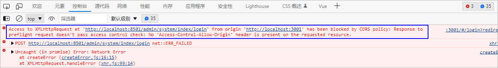
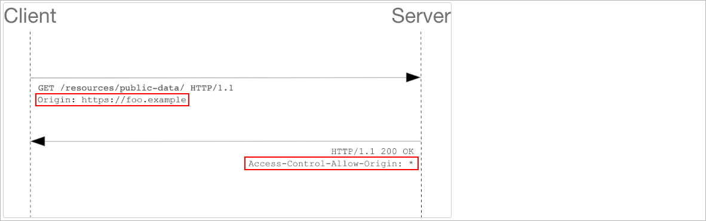

# 1 前端接入登录

当后端接口开发好了以后就可以让前端去请求该登录接口完成登录操作。

## 1.1 修改前端代码

修改src/utils/request.js更改基础请求路径

```javascript
const service = axios.create({
  baseURL: 'http://localhost:8503',    // 后端服务的ip地址和端口号
  timeout: 10000,
  withCredentials: true,
})
```

修改src/api/login.js更改登录接口地址

```javascript
// 登录接口
export const Login = data => {
  return request({
    url: '/admin/system/index/login',
    method: 'post',
    data,
  })
}
```

发送登录请求，那么此时会报一个错误：

 

报错的原因是因为此时的请求是一个跨域的请求。

## 1.2 跨域请求

### 1.2.1 跨域请求简介

跨域请求：通过一个域的JavaScript脚本和另外一个域的内容进行交互

域的信息：协议、域名、端口号

 

同域：当两个域的协议、域名、端口号均相同

如下所示：

 

**同源【域】策略**：在浏览器中存在一种安全策略就是同源策略，同源策略（Sameoriginpolicy）是一种约定，它是浏览器最核心也最基本的安全功

能，如果缺少了同源策略，则浏览器的正常功能可能都会受到影响。可以说Web是构建在同源策略基础之上的，浏览器只是针对同源策略的一种实

现。同源策略会阻止一个域的javascript脚本和另外一个域的内容进行交互。

### 1.2.2 COSR概述

#### CORS简介

官网地址：https://developer.mozilla.org/en-US/docs/Web/HTTP/CORS

CORS的全称为Cross-origin Resource Sharing，中文含义是**跨域资源共享**，CORS 给了web服务器一种权限：服务器可以选择是否允许跨域请求访

问到它们的资源。

#### CORS原理

浏览器将CORS请求分成两类：**简单请求**和**非简单请求**。怎么区分这两者呢?

> 简单请求

我们先来看两个条件：

```java
(1)HTTP请求方法是以下三种之一：
	·HEAD
	·GET
	·POST
(2)只包含简单HTTP请求头，即：
	·Accept,
	·Accept-Language,
	·Content-Language,
	·Content-Type并且值是 application/x-www-form-urlencoded, multipart/form-data, 或者 text/plain之一的（忽略参数）。
```

当请求满足上面的两个条件时，则该请求被视为简单请求，否则被视为非简单请求。简单请求与非简单请求的最主要区别就是跨域请求是否需要发送预

检请求（preflight request）。


简单请求的跨域请求响应流程：

 

在进行跨域请求时，如果是**简单请求**，则浏览器会在请求中增加一个**Origin请求头**之后直接发送CORS请求，服务器检查该请求头的值是否在服务器

设置的CORS许可范围内，如果在许可范围内，则服务器同意本次请求，如果不在许可范围内，则服务会返回一个没有包含Access-Control-Allow-

Origin 响应头的HTTP响应。

> 非简单请求

非简单请求的跨域请求响应流程：

 

除了简单请求其他的请求都是非简单请求，非简单请求会先发送一次预检请求**（OPTIONS请求）**，浏览器除了会带上**Origin请求头**之外，还会再带

上**Access-Control-Request-Method 和 Access-Control-Request-Headers 这两个请求头**，服务器在收到预检请求之后，会检查这三个请

求头是否与服务器的资源设置（接口）一致，如服务器的接口只允许请求方法为GET、Origin为http://www.abc.com:8080、Access-Control-

Request-Header为 content-type的请求，只要预检请求中三个请求头有任意一个值与服务器的资源（接口）设置不一致，服务器就会拒绝预检请求，

如果都一致，则服务器确认通过预检请求并返回带有Access-Control-Allow-Credentials、Access-Control-Allow-Headers、Access-Control-Allow-

Methods、Access-Control-Allow-Origin、Access-Control-Max-Age【间隔多长时间在发起预检请求】等响应头的相应。当预检请求通过以后此时

就可以发送真实请求。

### 1.2.3 CORS解决跨域

后端服务器开启跨域支持：

方案一：在IndexController上添加**@CrossOrigin**注解

```java
@RestController
@RequestMapping(value = "/admin/system/index")
@CrossOrigin(allowCredentials = "true" , originPatterns = "*" , allowedHeaders = "*") // maxAge默认值是30min
public class IndexController {

}
```

弊端：每一个controller类上都来添加这样的一个接口影响开发效率、维护性较差

方案二：添加一个配置类配置跨域请求

```java
// com.atguigu.spzx.manager.config
@Component
public class WebMvcConfiguration implements WebMvcConfigurer {

    @Override
    public void addCorsMappings(CorsRegistry registry) {
        registry.addMapping("/**")      // 添加路径规则
                .allowCredentials(true)               // 是否允许在跨域的情况下传递Cookie
                .allowedOriginPatterns("*")           // 允许请求来源的域规则
            	.allowedMethods("*")
                .allowedHeaders("*") ;                // 允许所有的请求头
    }
    
}
```

# 2 异常处理

## 2.1 提示空消息分析

现象说明：当用户输入的用户名或者密码错误，前端页面提示空信息

问题分析：当用户名或者密码输入错误以后，此时后端服务器抛出了异常。但是在后端并没有对异常进行处理，此时就会给前端响应异常信息，在前端

提供了axios的响应拦截器，那么通过

axios响应拦截器拦截了异常信息，然后给出为空的提示信息。

源码查看：src/utils/request.js

```javascript
// 拦截响应
service.interceptors.response.use(
  // 响应成功进入第1个函数，该函数的参数是响应对象
  response => {
    return response.data
  },
  // 响应失败进入第2个函数，该函数的参数是错误对象
  async error => {  
    ...
    try {
      ElMessage.error(error.response.data.msg)		// 打印错误信息
    } catch (err) {
      ElMessage.error(error.message)				// 打印错误信息
    }
    return Promise.reject(error)
  }
)
```

## 2.2 系统异常分类

在项目中为了更加详情的对异常出现的异常问题进行排查，那么此时应该对异常进行区分，大致可以分为如下两种异常：

1、系统异常：一般由框架本身所抛出的异常：NullPointerException、IllegalArgumentException、ConnectTimeoutException...

2、业务异常：业务异常就是对我们的业务错误进行描述的异常，往往需要进行自定义。常见的业务错误：用户名或者密码错误、用户名重复...

自定异常：

```java
// com.atguigu.spzx.common.exception
@Data
public class GuiguException extends RuntimeException {

    private Integer code ;          // 错误状态码
    private String message ;        // 错误消息

    private ResultCodeEnum resultCodeEnum ;     // 封装错误状态码和错误消息

    public GuiguException(ResultCodeEnum resultCodeEnum) {
        this.resultCodeEnum = resultCodeEnum ;
        this.code = resultCodeEnum.getCode() ;
        this.message = resultCodeEnum.getMessage();
    }

    public GuiguException(Integer code , String message) {
        this.code = code ;
        this.message = message ;
    }

}
```

更改异常的抛出代码：

```java
// com.atguigu.spzx.manager.service.impl.SysUserServiceImpl#login
SysUser sysUser = sysUserMapper.selectByUserName(loginDto.getUserName());
if(sysUser == null) {
    throw new GuiguException(ResultCodeEnum.SUCCESS) ;		// 抛出自定义的业务异常
}

// 验证密码是否正确
String inputPassword = loginDto.getPassword();
String md5InputPassword = DigestUtils.md5DigestAsHex(inputPassword.getBytes());	// 抛出自定义的业务异常
if(!md5InputPassword.equals(sysUser.getPassword())) {
    throw new GuiguException(ResultCodeEnum.LOGIN_ERROR) ;
}
```

## 2.3 异常处理

要解决上述问题，那么此时就需要对异常进行处理。统一向前端响应200的http的状态码，然后通过不同的业务状态码区分登录成功还是失败。

### 2.2.1 方案一

在controller方法中使用try...catch捕获业务层方法所抛出的异常。如下所示：

```java
// IndexController#login方法
@PostMapping(value = "/login")
public Result<LoginVo> login(@RequestBody LoginDto loginDto) {
    try {
        LoginVo loginVo = sysUserService.login(loginDto) ;
        return Result.build(loginVo , ResultCodeEnum.SUCCESS) ;
    }catch (GuiguException exception) {
        return Result.build(null , exception.getResultCodeEnum()) ;
    }
}
```

### 2.2.2 方案二

使用spring mvc的全局异常处理器进行异常的处理，整体的工作流程如下所示：

 

开发一个全局异常处理器：

```java
// com.atguigu.spzx.common.exception
@RestControllerAdvice
public class GlobalExceptionHandler {

    @ExceptionHandler(value = GuiguException.class)     // 处理自定义异常
    public Result guiguExceptionHandler(GuiguException exception) {
        exception.printStackTrace();
        return Result.build(null , exception.getResultCodeEnum()) ;
    }

    @ExceptionHandler(value = Exception.class)          // 处理系统异常
    public Result systemExceptionHandler(Exception exception) {
        exception.printStackTrace();
        return Result.build(null , ResultCodeEnum.SYSTEM_ERROR) ;
    }

}

// ResultCodeEnum添加枚举项
SYSTEM_ERROR(9999 , "您的网络有问题请稍后重试")
```


在spzx-manager中使用全局异常处理器：

方式一：在启动类上使用@Import注解导入全局异常处理器到spring容器中

```java
@Import(value = GlobalExceptionHandler.class)
```

方式二：自定义注解对@Import注解进行封装，然后在启动类上使用自定义注解

```java
// com.atguigu.spzx.common.anno
@Retention(value = RetentionPolicy.RUNTIME)
@Target(value = ElementType.TYPE)
@Import(value = GlobalExceptionHandler.class)
public @interface EnableGlobaleExceptionHandler {		// 启动类上添加该注解

}
```

方式三：使用spring boot3的自动化配置完成全局异常处理器的自动化配置

步骤：

1、在common-service模块中的resources目录下创建一个META-INF/spring文件夹，在该文件夹下创建一个文件，名称为：

org.springframework.boot.autoconfigure.AutoConfiguration.imports

2、在该文件中添加全局异常处理器的全类名

```java
com.atguigu.spzx.common.exception.GlobalExceptionHandler
```

# 3 图片验证码

## 3.1 图片验证码意义

验证码是全自动区分计算机和人类的图灵测试的缩写，是一种区分用户是计算机还是人的公共全自动程序，可以防止恶意破解密码、刷票、论坛灌水，

有效防止某个黑客对某一个特定注册用户用特定程序暴力破解方式进行不断的登录尝试。

页面效果如下所示：

 

## 3.2 实现思路

整体的实现思路，如下图所示：

 

## 3.3 后端接口编写

### 3.3.1 实体类创建

创建一个实体类封装，给前端返回的验证码数据：

```java
// com.atguigu.spzx.model.vo.system;
@Data
public class ValidateCodeVo {

    private String codeKey ;        // 验证码的key
    private String codeValue ;      // 图片验证码对应的字符串数据

}
```

### 3.3.2 IndexController

在IndexController中添加获取验证码接口方法：

```java
// com.atguigu.spzx.manager.controller.IndexController
@GetMapping(value = "/generateValidateCode")
public Result<ValidateCodeVo> generateValidateCode() {
    ValidateCodeVo validateCodeVo = validateCodeService.generateValidateCode();
    return Result.build(validateCodeVo , ResultCodeEnum.SUCCESS) ;
}
```

### 3.3.3 ValidateCodeService

业务层代码实现：

```java
// com.atguigu.spzx.manager.service
public interface ValidateCodeService {

    // 获取验证码图片
    public abstract ValidateCodeVo generateValidateCode();

}

// com.atguigu.spzx.manager.service.impl
@Service
public class ValidateCodeServiceImpl implements ValidateCodeService {

    @Autowired
    private RedisTemplate<String , String> redisTemplate ;

    @Override
    public ValidateCodeVo generateValidateCode() {

        // 使用hutool工具包中的工具类生成图片验证码
        CircleCaptcha circleCaptcha = CaptchaUtil.createCircleCaptcha(150, 48, 4, 20);
        String codeValue = circleCaptcha.getCode();
        String imageBase64 = circleCaptcha.getImageBase64();

        // 生成uuid作为图片验证码的key
        String codeKey = UUID.randomUUID().toString().replace("-", "");

        // 将验证码存储到Redis中
        redisTemplate.opsForValue().set("user:login:validatecode:" + codeKey , codeValue , 5 , TimeUnit.MINUTES);

        // 构建响应结果数据
        ValidateCodeVo validateCodeVo = new ValidateCodeVo() ;
        validateCodeVo.setCodeKey(codeKey);
        validateCodeVo.setCodeValue("data:image/png;base64," + imageBase64);

        // 返回数据
        return validateCodeVo;
    }

}
```

使用postman进行测试。

## 3.4 前端接入

### 3.4.1 实现思路

整体实现思路：

1、登录表单中添加验证码表单项，绑定对应的数据模型(可以问GPT)

2、添加验证码输入框校验规则

3、在api/login.js中添加请求后端获取验证码接口方法

4、在首页中使用vue的onMounted钩子函数发送请求获取图片验证码

### 3.4.3 代码实现

#### 页面表单项

```html
<!-- 页面结构 -->
<el-form-item prop="captcha">
    <div class="captcha">
        <el-input
                  class="text"
                  v-model="model.captcha"
                  prefix-icon="Picture"
                  placeholder="请输入验证码"
                  ></el-input>
        
    </div>
</el-form-item>
```

css样式：

```css
// 验证码输入框样式 start
.captcha {
  display: flex;
  align-items: center;
  justify-content: space-between;
  margin-bottom: 10px;
}

.captcha img {
  cursor: pointer;
  margin-left: 20px;
}
// 验证码输入框样式 end
```

#### 规则校验

更改views/login/index.vue页面的vue规则校验代码

```java
const getRules = () => ({
    captcha: [
        {
            required: true,
            message: ctx.$t('login.rules-validate-code'),
            trigger: 'blur',
        },
    ],
})
```

在国际化文件(i18n/locals/zh-cn/login.js)中添加提示信息：

```json
'rules-validate-code': '验证码不能为空'
```

#### api/login.js

在api/login.js中添加请求后端获取验证码接口方法

```java
// 获取验证码
export const GetValidateCode = () => {
  return request({
    url: "/admin/system/index/generateValidateCode",
    method: 'get'
  })
}
```

#### onMounted

在首页中使用vue的onMounted钩子函数发送请求获取图片验证码

```javascript
import { onMounted } from 'vue'
import { Login , GetValidateCode } from '@/api/login'
export default defineComponent({
  setup() {
    // onMounted钩子函数
    onMounted(() => {
      state.refreshCaptcha()
    })

    const state = reactive({
      model: {
        userName: 'admin',
        password: '111111',
        captcha: '',      // 用户输入的验证码
        codeKey: ''       // 后端返回的验证码key
      },
      captchaSrc: "" ,
      refreshCaptcha: async () => {
          const { data } = await GetValidateCode() ;
          state.model.codeKey = data.codeKey
          state.captchaSrc = data.codeValue
      }
    })

    return {
      ...toRefs(state),
    }
  },
})
</script>
```

## 3.5 校验验证码

对之前的登录方法进行修改，添加校验验证码的逻辑代码。

步骤：

1、实体类修改

```java
// com.atguigu.spzx.model.dto.system
@Data
public class LoginDto {

    private String userName ;
    private String password ;
    private String captcha ;
    private String codeKey ;

}
```

2、SysUserServiceImpl登录方法修改

```java
// com.atguigu.spzx.manager.service.impl.SysUserServiceImpl#login
// 校验验证码是否正确
String captcha = loginDto.getCaptcha();     // 用户输入的验证码
String codeKey = loginDto.getCodeKey();     // redis中验证码的数据key

// 从Redis中获取验证码
String redisCode = redisTemplate.opsForValue().get("user:login:validatecode:" + codeKey);
if(StrUtil.isEmpty(redisCode) || !StrUtil.equalsIgnoreCase(redisCode , captcha)) {
    throw new GuiguException(ResultCodeEnum.VALIDATECODE_ERROR) ;
}

// 验证通过删除redis中的验证码
redisTemplate.delete("user:login:validatecode:" + codeKey) ;

// ResultCodeEnum类添加如下枚举项
VALIDATECODE_ERROR(202 , "验证码错误") 
```

# 4 获取用户信息接口

## 4.1 前端源码分析

需求说明：当登录成功以后，那么此时会调用后端接口获取登录成功以后的用户信息，然后在首页面展示

前置路由守卫：在当前的系统中提供了前置路由守卫，在该前置路由守卫中会调用后端服务器端口获取用户信息。

### 4.1.1 请求发送分析

前置路由守卫的配置在permission.js，该文件以及被main.js引入。因此查看源码以当前js为入口进行分析：

**permission.js**

```javascript
// vue-router4的路由守卫不再是通过next放行，而是通过return返回true或false或者一个路由地址
router.beforeEach(async to => {

  if (!window.localStorage[TOKEN]) {  // 如果token不存在，此时跳转到登录页面
    return {
      name: 'login',
      query: {
        redirect: to.fullPath, // redirect是指登录之后可以跳回到redirect指定的页面
      },
      replace: true,
    }
  } else {		// token存在
    const { userinfo, getUserinfo } = useAccount()		// 从pinia的用于账户模块解析出userinfo，getUserInfo方法
    // 获取用户角色信息，根据角色判断权限
    if (!userinfo) {
      try {
        // 获取用户信息
        await getUserinfo()		// 调用getUserInfo方法获取用户数据
      } catch (err) {
        loadingInstance.close()
        return false
      }
      return to.fullPath
    }
  }
})
```

**pinia/modules/account.js**源码分析

```javascript
import { GetUserinfo } from '@/api/login'
export const useAccount = defineStore('account', {
  state: () => ({
    userinfo: null,     // pinia账户模块存储的用户信息
    permissionList: [],
  }),
  actions: {
    // 清除用户信息
    clearUserinfo() {
      this.userinfo = null
    },
    // 获取用户信息
    async getUserinfo() {
      const { code, data } = await GetUserinfo()  // 调用/api/login.js中的GetUserinfo方法，请求后端接口
      if (+code === 200) {
        this.userinfo = data
        return Promise.resolve(data)
      }
    },
  },
})
```

**api/login.js**源码分析：

```javascript
// 获取登录用户信息
export const GetUserinfo = () => {
  return request({
    url: '/api/userinfo',		// 请求后端的接口地址，后期需要将其更改为
    method: 'get',
  })
}
```

### 3.1.2 用户信息使用

获取到当前登录成功以后的用户信息，将用户信息存储到Pinia的account模块中以后，该用户信息会在首页的进行使用。首页布局分析，以及对应的组

件说明：

 

涉及到的核心组件关系说明：

 

layout/components/Topbar/Userinfo.vue组件源码分析：

```javascript
<template>
  <el-dropdown trigger="hover">
    <div class="userinfo">
      <template v-else>
          <!-- 从user对象中获取avatar属性值 -->
        {{ userinfo.name }}  <!-- 从user对象中获取name属性值 -->
      </template>
    </div>
  </el-dropdown>
</template>
<script>
import { useUserinfo } from '@/components/Avatar/hooks/useUserinfo'  // 导入该目录下useUserinfo.文件
export default defineComponent({
  setup() {
    const { userinfo } = useUserinfo()  // 调用导入的js文件中的useUserinfo方法，从Pinia中获取用户数据 
    return {
      userinfo,
    }
  },
})
</script>
```

通过源码查询得出结论：后端返回的数据中需要至少包含两个属性：avatar【用户头像的url】、name【用户名】

### 3.1.3 token传递

当登录成功以后，后端会给前端返回token数据。前端会将token数据存储到Pinia的app模块中。并且会将token数据保存到localStorage中。当再次请

求获取登录用户信息接口的时候，就需要将token传递到后端。

token的传递是通过axios的请求前置拦截器进行完成的，源码如下所示：utils/request.js

```javascript
// 拦截请求
service.interceptors.request.use(
  config => {
    const { authorization } = useApp()   // 从Pinia的app模块中获取登录成功以后的用户数据
    if (authorization) {
        
      // 添加一个请求头Authorization ， 该请求头所对应的值为：Bearer token数据
      config.headers.Authorization = `Bearer ${authorization.token}`
      
      // 上传传递方式后端解析太麻烦，因此可以更改传递token方式为如下方式
      // config.headers.token = `${authorization.token}`
      
    }
    return config
  },
  error => {
    // console.log(error);
    return Promise.reject(error)
  }
)
```

## 4.2 后端接口

### 4.2.1 IndexController

IndexController中添加如下接口方法：

```java
@GetMapping(value = "/getUserInfo")
public Result<SysUser> getUserInfo(@RequestHeader(name = "token") String token) {
    SysUser sysUser = sysUserService.getUserInfo(token) ;
    return Result.build(sysUser , ResultCodeEnum.SUCCESS) ;
}
```

### 4.2.2 SysUserService

SysUserService添加根据token获取用户数据接口方法：

```java
// com.atguigu.spzx.manager.service.impl.SysUserServiceImpl
public SysUser getUserInfo(String token) {
    String userJson = redisTemplate.opsForValue().get("user:login:" + token);
    return JSON.parseObject(userJson , SysUser.class) ;
}
```

## 4.3 前端接入

更改前端发送请求的接口地址：api/login.js

```javascript
// 获取登录用户信息
export const GetUserinfo = () => {
  return request({
    url: '/admin/system/index/getUserInfo',
    method: 'get',
  })
}
```

# 4 进入首页

获取登录用户信息的接口开发完毕以后，此时还是无法进入到首页。因为在前置路由守卫中还存一段代码是获取当前登录用户的菜单信息，源码如下所

示：permission.js

```javascript
// 生成菜单（如果你的项目有动态菜单，在此处会添加动态路由）
const { menus, generateMenus } = useMenus()
if (menus.length <= 0) {
    try {
        await generateMenus()
        return to.fullPath // 添加动态路由后，必须加这一句触发重定向，否则会404
    } catch (err) {
        loadingInstance.close()
        return false
    }
}
```

当前先不做动态菜单的功能，因此需要把获取动态菜单的代码注释掉：pinia/modules/menu.js

```javascript
const generateMenus = async () => {
    
    // // 方式一：只有固定菜单
    const menus = getFilterMenus(fixedRoutes)
    setMenus(menus)

    // 方式二：有动态菜单
    // 从后台获取菜单
    // const { code, data } = await GetMenus()

    // if (+code === 200) {
    //   // 添加路由之前先删除所有动态路由
    //   asyncRoutes.forEach(item => {
    //     router.removeRoute(item.name)
    //   })
    //   // 过滤出需要添加的动态路由
    //   const filterRoutes = getFilterRoutes(asyncRoutes, data)
    //   filterRoutes.forEach(route => router.addRoute(route))

    //   // 生成菜单
    //   const menus = getFilterMenus([...fixedRoutes, ...filterRoutes])
    //   setMenus(menus)
    // }
    
}
```

# 5 退出功能

## 5.1 需求分析

需求：用户在首页点击退出按钮，那么此时请求后端接口完成退出

实现思路：

1、后端根据token从Redis中删除用户数据

2、前端清空Pinia中保存的用户数据、从localStorage中删除用户token


前端删除数据的代码以及实现：layout\Topbar\Userinfo.vue

```java
// 退出
const logout = () => {
    // 清除token
    useApp().clearToken()
    router.push('/login')
}
```

## 5.2 代码实现

### 5.2.1 后端接口

#### IndexController

在IndexController中添加接口方法

```java
@GetMapping(value = "/logout")
public Result logout(@RequestHeader(value = "token") String token) {
    sysUserService.logout(token) ;
    return Result.build(null , ResultCodeEnum.SUCCESS) ;
}
```

#### SysUserService

```java
@Override
public void logout(String token) {
    redisTemplate.delete("user:login:" + token) ;
}
```

### 5.2.2 前端接入

#### login.js

在src\api\login.js文件中添加如下代码：

```javascript
// 退出功能
export const Logout = () => {
    return request({
        url: '/admin/system/index/logout',
        method: 'get',
    })
}
```

#### Userinfo.vue

修改layout\Topbar\Userinfo.vue的退出方法代码：

```javascript
import { defineComponent , getCurrentInstance} from 'vue'
import { Logout } from '@/api/login'

export default defineComponent({
    setup() {

        const { proxy: ctx } = getCurrentInstance() // 可以把ctx当成vue2中的this
        
        // 退出
        const logout = async () => {
            const { code ,  data , message } = await Logout() ;
            if(code == 200) {
                // 清除token
                useApp().clearToken()
                router.push('/login')
            }else {
                ctx.$message.error(message)
            }

        }

        return {
            userinfo,
            logout,
        }
    },
})
```

