# 1 登录校验

## 1.1 需求说明

后台管理系统中除了登录接口、获取验证码的接口在访问的时候不需要验证用户的登录状态，其余的接口在访问的时候都必须要求用户登录成功以后才

可以进行访问。

## 1.2 实现思路

具体的实现流程如下所示：

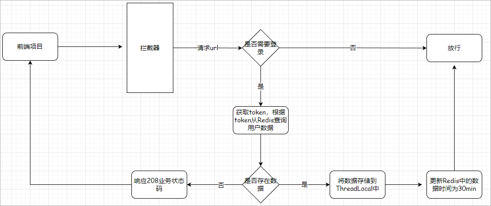  

注意：

1、请求url的判断可以通过拦截规则配置进行实现

2、更新Redis中数据的存活时间的主要目的就是为了保证用户在使用该系统的时候，Redis中会一直保证用户的登录状态，如果用户在30分钟之内没有

使用该系统，那么此时登录超时。此时用户就需要重新进行登录。

3、将从Redis中获取到的用户存储到ThreadLocal中，这样在一次请求的中流可以在controller、service、mapper中获取用户数据

## 1.3 ThreadLocal

完成该功能需要使用到ThreadLocal，ThreadLocal是jdk所提供的一个线程工具类。使用该工具类可以实现在同一个线程进行数据的共享。

代码如下所示：

```java
public class ThreadLocalTest {

    // 创建一个ThreadLocal对象
    private static final ThreadLocal<SysUser> threadLocal = new ThreadLocal<>() ;

    public static void main(String[] args){

        // 在主线程中创建SysUser对象
        SysUser sysUser = new SysUser() ;
        sysUser.setUserName("admin");
        sysUser.setAvatar("https://oss.aliyuncs.com/aliyun_id_photo_bucket/default_handsome.jpg");
        sysUser.setId(1L);

        // 将数据存储到ThreadLocal中
        threadLocal.set(sysUser);

        // 调用show方法,由于show方法main方法使用的是同一个线程，因此show方法中可以直接从ThreadLocal中获取数据
        show() ;

    }

    private static void show() {
        SysUser sysUser = threadLocal.get();
        System.out.println(sysUser);
    }

}
```

## 1.4 AuthContextUtil

在common-util模块中中创建一个AuthContextUtil类对ThreadLocal进行封装，代码如下所示：

```java
// com.atguigu.spzx.model.entity.system.SysUser
public class AuthContextUtil {

    // 创建一个ThreadLocal对象
    private static final ThreadLocal<SysUser> threadLocal = new ThreadLocal<>() ;

    // 定义存储数据的静态方法
    public static void set(SysUser sysUser) {
        threadLocal.set(sysUser);
    }

    // 定义获取数据的方法
    public static SysUser get() {
        return threadLocal.get() ;
    }

    // 删除数据的方法
    public static void remove() {
        threadLocal.remove();
    }

}
```

## 1.5 拦截器使用

### 1.5.1 拦截器开发

在spzx-manager服务中创建一个拦截器，代码如下：

```java
@Component
public class LoginAuthInterceptor implements HandlerInterceptor {

    @Autowired
    private RedisTemplate<String , String> redisTemplate ;

    @Override
    public boolean preHandle(HttpServletRequest request, HttpServletResponse response, Object handler) throws Exception {
        
        // 获取请求方式
        String method = request.getMethod();
        if("OPTIONS".equals(method)) {      // 如果是跨域预检请求，直接放行
            return true ;
        }
        
        // 获取token
        String token = request.getHeader("token");
        if(StrUtil.isEmpty(token)) {
            responseNoLoginInfo(response) ;
            return false ;
        }

        // 如果token不为空，那么此时验证token的合法性
        String sysUserInfoJson = redisTemplate.opsForValue().get("user:login:" + token);
        if(StrUtil.isEmpty(sysUserInfoJson)) {
            responseNoLoginInfo(response) ;
            return false ;
        }

        // 将用户数据存储到ThreadLocal中
        SysUser sysUser = JSON.parseObject(sysUserInfoJson, SysUser.class);
        AuthContextUtil.set(sysUser);

        // 重置Redis中的用户数据的有效时间
        redisTemplate.expire("user:login:" + token , 30 , TimeUnit.MINUTES) ;

        // 放行
        return true ;
    }

    //响应208状态码给前端
    private void responseNoLoginInfo(HttpServletResponse response) {
        Result<Object> result = Result.build(null, ResultCodeEnum.LOGIN_AUTH);
        PrintWriter writer = null;
        response.setCharacterEncoding("UTF-8");
        response.setContentType("text/html; charset=utf-8");
        try {
            writer = response.getWriter();
            writer.print(JSON.toJSONString(result));
        } catch (IOException e) {
            e.printStackTrace();
        } finally {
            if (writer != null) writer.close();
        }
    }

    @Override
    public void afterCompletion(HttpServletRequest request, HttpServletResponse response, Object handler, Exception ex) throws Exception {
        AuthContextUtil.remove();  // 移除threadLocal中的数据
    }
}
```

### 1.5.2 拦截器注册

想让拦截器生效，那么此时就需要将拦截器注册到Spring MVC中，具体的代码如下所示：

```java
@Component
public class WebMvcConfiguration implements WebMvcConfigurer {

    @Autowired
    private LoginAuthInterceptor loginAuthInterceptor ;

    @Override
    public void addInterceptors(InterceptorRegistry registry) {
        registry.addInterceptor(loginAuthInterceptor)
                .excludePathPatterns("/admin/system/index/login" , "/admin/system/index/generateValidateCode")
                .addPathPatterns("/**");
    }
}
```

使用postman进行测试。

## 1.6 代码优化

### 1.6.1 配置优化

关于不需要验证登录的请求url， 需要将其定义到对应的配置文件中，以提高代码的维护性。

具体步骤：

1、application-dev.yml添加如下自定义配置

```yaml
# 自定义配置
spzx:
  auth:
    noAuthUrls:
      - /admin/system/index/login
      - /admin/system/index/generateValidateCode
```

2、实体类定义

```java
// com.atguigu.spzx.manager.properties;

@Data
@ConfigurationProperties(prefix = "spzx.auth")      // 前缀不能使用驼峰命名
public class UserAuthProperties {
    private List<String> noAuthUrls ;
}
```

3、启动类添加注解：**@EnableConfigurationProperties**

4、配置类代码修改

```java
@Component
public class WebMvcConfiguration implements WebMvcConfigurer {

    @Autowired
    private UserAuthProperties userAuthProperties ;		// 注入实体类对象

    @Autowired
    private LoginAuthInterceptor loginAuthInterceptor ;

    @Override
    public void addInterceptors(InterceptorRegistry registry) {
        registry.addInterceptor(loginAuthInterceptor)
                .excludePathPatterns(userAuthProperties.getNoAuthUrls())
                .addPathPatterns("/**");
    }
    
}
```

注意：封装配置文件内容的实体类，此时会存在一个警告信息，解决方案就是参考官网访问，添加一个依赖

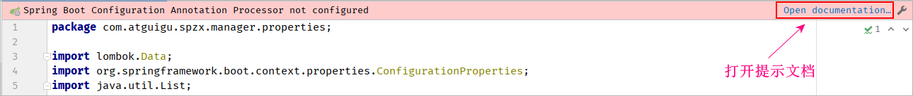 

### 1.6.2 代码优化

后端获取用户信息的接口就无需获取token，然后根据token从Redis中进行查询。可以直接从ThreadLocal中获取用户信息，然后进行返回。

代码如下所示：

```java
// com.atguigu.spzx.manager.controller
@GetMapping(value = "/getUserInfo")
public Result<SysUser> getUserInfo() {
    return Result.build(AuthContextUtil.get()  , ResultCodeEnum.SUCCESS) ;
}
```

### 1.6.3 前端修改

更改axios响应拦截器代码，如下所示：utils\request.js

```javascript
response => {		// service.interceptors.response.use第一个参数
    const res = response.data
    if (res.code == 208) {
        const redirect = encodeURIComponent(window.location.href)  // 当前地址栏的url
        router.push(`/login?redirect=${redirect}`)
        return Promise.reject(new Error(res.message || 'Error'))
    }
    return res 
}
```

测试：通过前端登录成功以后，进入首页。删除Redis中的登录用户信息，刷新页面此时会跳转到登录页面。

# 2 API接口文档

## 2.1 Apifox接口管理平台

### 2.1.1 接口管理平台简介

在前后端分离的开发模式，前端和后端可以进行并行开发。前端不需要依赖于后端，后端也不需要依赖前端。在进行并行开发的时候前端和后端都需要

遵循接口规范。在进行开发之前需要进行接口设计的【设计接口的请求协议、请求方式、请求路径、请求参数、响应结果】，此时就需要使用到接口管

理平台进行设计。

常见的接口管理平台：Apigee、Kong、YApi, **Apifox**

### 2.1.2 Apifox简介

官网地址：https://apifox.com/

  

Apifox是一款API 文档、API 调试、API Mock、API 自动化测试、API一体化协作平台

### 2.1.3 Apifox使用

具体步骤如下所示：

1、从官网下载Apifox并进行安装

  

2、使用微信扫描登录

3、创建团队，创建项目

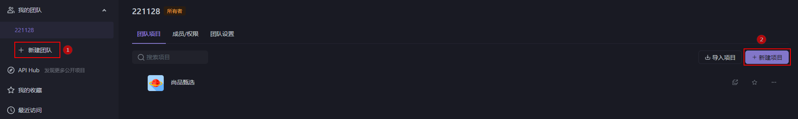   

4、选择项目定义接口

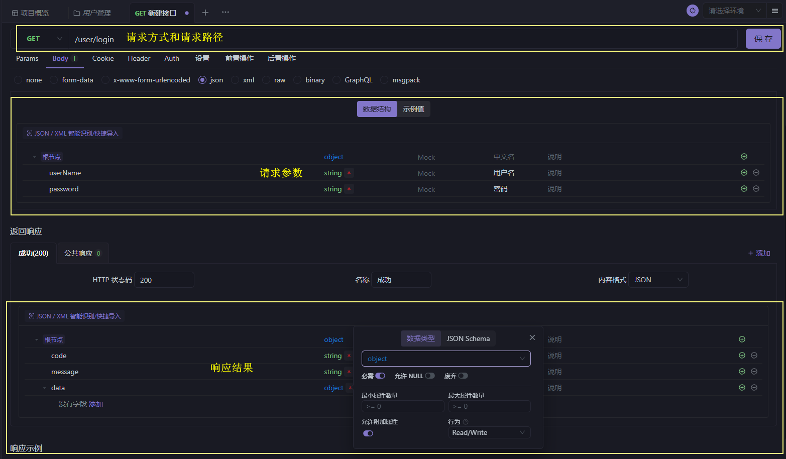   

5、邀请团队成员

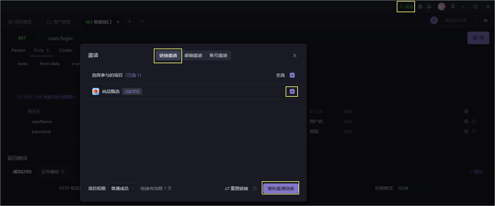 

## 2.2 Api文档生成工具

刚才我们是直接在Yapi接口管理平台上进行接口的设计，Yapi接口平台也支持导入我们事先生成好的接口文档。要生成接口文档就需要使用到一些接口

文档生成工具。

### 2.2.1 Swagger

Swagger是一种基于OpenAPI规范的API文档生成工具，它可以根据Java代码中的注解自动生成API接口文档，并提供UI界面进行在线测试和调试。

Swagger为开发人员提供了更加方便、直观的API管理方式，有助于提升API的可读性和可维护性。

Swagger的主要特点包括：

1、自动生成API文档：通过在Java代码中添加Swagger注解，Swagger能够自动地解析API接口的参数、响应等信息，并生成相应的API文档。

2、在线测试接口：Swagger提供了UI界面，可以方便地进行API接口的测试和调试，无需单独使用HTTP客户端来测试接口。

3、支持多种语言和框架：Swagger不仅支持Java语言和Spring框架，还支持多种其他语言和框架，如PHP、Python、Go等。

4、扩展性强：Swagger提供了多种扩展机制和插件，可以满足各种项目的需要，如集成OAuth2、自定义UI等。

Swagger提欧共的UI界面相比于另外一款Api文档生成工具**Knife4j**较为简陋。

### 2.2.2 Knife4j

#### Knife4j简介

官方文档：https://doc.xiaominfo.com/

Knife4j是一种基于Swagger构建的增强工具，它在Swagger的基础上增加了更多的功能和扩展，提供了更加丰富的API文档管理功能。相比于原版

Swagger，Knife4j的主要特点包括：

1、更加美观的UI界面：Knife4j通过对Swagger UI的修改和优化，实现了更加美观、易用的UI界面，提升了开发人员的体验感。

2、支持多种注解配置方式：除了支持原版Swagger的注解配置方式外，Knife4j还提供了其他几种注解配置方式，如@ApiIgnore、

@ApiOperationSupport等，方便开发人员进行不同场景

下的配置。

3、提供多种插件扩展：Knife4j提供了多种插件扩展，如knife4j-auth、knife4j-rate-limiter等，可以满足不同项目的需求。

4、集成Spring Boot Starter：Knife4j发布了spring-boot-starter-knife4j，可以实现更加便捷的集成，并支持配置文件中的动态属性调整。

#### Knife4j使用

官方文档使用地址：https://doc.xiaominfo.com/docs/quick-start

具体的步骤：

1、在spzx-parent项目的pom.xml文件中加入如下依赖：

```xml
<dependency>
    <groupId>com.github.xiaoymin</groupId>
    <artifactId>knife4j-openapi3-jakarta-spring-boot-starter</artifactId>
    <version>4.1.0</version>
</dependency>
```

spzx-model微服务中再次引入knife4j的坐标，不需要加入版本号

2、在spzx-manager模块中添加knife4j所需要的配置类

```java
@Configuration
public class Knife4jConfig {

    @Bean
    public GroupedOpenApi adminApi() {      // 创建了一个api接口的分组
        return GroupedOpenApi.builder()
                .group("admin-api")         // 分组名称
                .pathsToMatch("/admin/**")  // 接口请求路径规则
                .build();
    }

    /***
     * @description 自定义接口信息
     */
    @Bean
    public OpenAPI customOpenAPI() {

        return new OpenAPI()
                 .info(new Info()
                 .title("尚品甑选API接口文档")
                 .version("1.0")
                 .description("尚品甑选API接口文档")
                 .contact(new Contact().name("atguigu"))); // 设定作者
    }

}
```

3、在application.yml文件的spzx.auth.noAuthUrls配置项目中添加knife4j的资源访问地址

```yaml
spzx:
  auth:
    noAuthUrls:
      - /doc.html
      - /webjars/css/**
      - /webjars/js/**
      - /v3/api-docs/**
      - /favicon.ico
```

启动项目就可以访问到knife4j所生成的接口文档了。访问地址：http://localhost:8501/doc.html

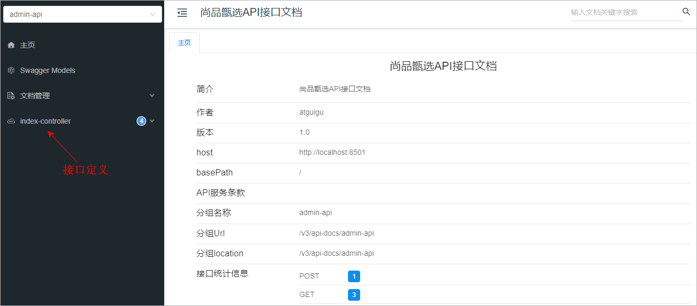 

#### 配置抽取

关于上述的Knife4j的配置类，最好将其定义到一个公共的模块中【common-service】，以实现复用。

步骤：

1、将Knife4j的配置类抽取到common-service模块中

2、自定义一个注解封装@Import导入的配置类

```java
@Retention(value = RetentionPolicy.RUNTIME)
@Target(value = ElementType.TYPE)
@Import(value = Knife4jConfig.class)
public @interface EnableKnife4j {

}
```

3、在spzx-manager的启动类上添加@EnableKnife4j注解

#### 常见注解

在Knife4j中也提供了一些注解，让我们对接口加以说明，常见的注解如下所示：

```shell
@Tag： 用在controller类上，对controller进行说明
@Operation: 用在controller接口方法上对接口进行描述
@Parameters：用在controller接口方法上对单个参数进行描述
@Schema： 用在实体类和实体类属性上，对实体类以及实体类属性进行描述
```

举例说明：

```java
@Tag(name = "首页接口")
public class IndexController {


    @Operation(summary = "用户登录")
    public Result<LoginVo> login(@RequestBody LoginDto loginDto) {
        ...
    }

    @Operation(summary = "用户退出")
    @Parameters(value = {
            @Parameter(name = "令牌参数" , required = true)
    })
    @GetMapping(value = "/logout")
    public Result logout(@RequestHeader(value = "token") String token) {
        ...
    }

}


@Data
@Schema(description = "用户登录请求参数")
public class LoginDto {

    @Schema(description = "用户名")
    private String userName ;

    @Schema(description = "密码")
    private String password ;

    @Schema(description = "提交验证码")
    private String captcha ;

    @Schema(description = "验证码key")
    private String codeKey ;

}
```

再次启动服务访问接口文档，就可以看到对接口的说明以及对参数的说明：

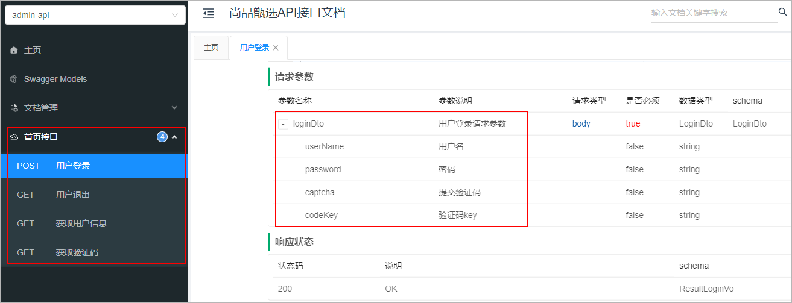 

#### 导出导入

Knife4j生成的接口文档是一个在线的接口文档使用起来不是特别的方便，当然Knife4j也支持离线接口文档，并且支持导出json格式的数据，如下所

示：

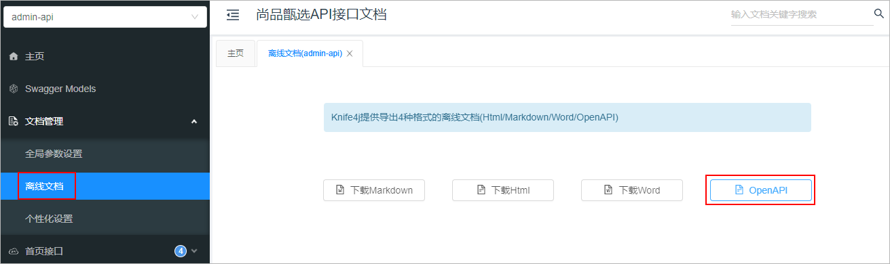 

点击OpenAPI，那么此时就会将接口信息导出为一个json文件，然后我们就可以把这个json文件导入进Apifox管理平台上，如下所示：

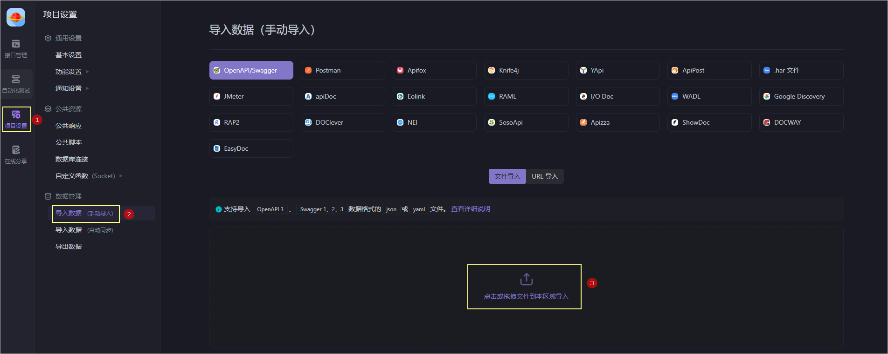  

# 3 权限管理说明

## 3.1 权限管理介绍

在后台管理系统中，权限管理是指为了保证系统操作的安全性和可控性。对用户的操作权限进行限制和管理。简单的来说就是某一个用户可以使用我们

系统的哪些功能。比如：管理员可以使用后台管理系统中的所有功能，普通业务人员只能使用系统中的一部分的功能(商品管理)。因此，权限管理是后

台管理系统中的一个重要功能模块。

## 3.2 表结构介绍

一般来说，权限管理包括以下几个方面：

1、用户管理：通过对用户进行账号、密码、角色等信息的管理。

2、角色管理：将多个用户分组，并根据所属角色的权限区分用户的访问权限。

3、菜单管理：对系统的菜单进行管理，根据用户或角色的权限动态生成可访问的菜单列表。

4、日志管理：记录系统的操作日志，方便用户或管理员查看系统运行情况，以及对不当操作进行追踪和处理。


尚品甄选项目后台管理系统的权限管理所涉及到数据库表以及其对应关系如下所示：

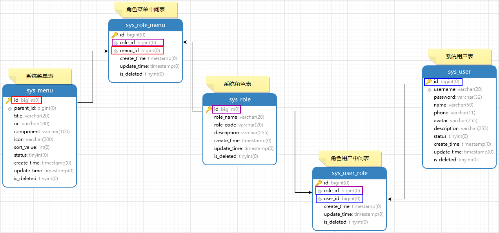  


sql演练：

需求1：查询id为1的用户所具有的角色数据

```sql
select sur.role_id , sr.role_code , sr.role_name from 
sys_user_role sur 
LEFT JOIN sys_role sr on sr.id = sur.role_id
where sur.user_id = 1 ;
```

需求2：查询id为1的用户所具有的菜单数据

```java
select * from sys_menu sm where sm.id in 
(
	select DISTINCT srm.menu_id from 
	sys_user_role sur 
	LEFT JOIN sys_role sr on sr.id = sur.role_id
	LEFT JOIN sys_role_menu srm on srm.role_id = sr.id
	where sur.user_id = 1 
)
```

# 4 角色管理

## 4.1 菜单添加

关于首页导航菜单我们先在前端页面写死，等权限管理中的相关功能都开发完毕以后，那么此时在将其更改为动态的。

具体步骤：

1、在views目录下创建一个system文件夹

2、在该文件夹下创建3个.vue文件

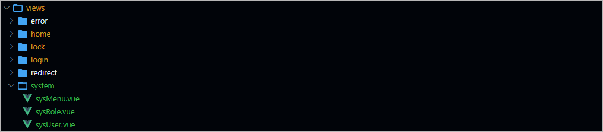 

3、在router/modules目录下创建system.js文件，配置路由规则

```javascript
// 导入组件
const Layout = () => import('@/layout/index.vue')
const sysRole = () => import('@/views/system/sysRole.vue')
const sysUser = () => import('@/views/system/sysUser.vue')
const sysMenu = () => import('@/views/system/sysMenu.vue')

// 导出该组件
export default([
    {
        path: "/system",
        component: Layout,
        name: 'system',
        meta: {
            title: '系统管理',
        },
        icon: 'Location',
        children: [
            {
                path: '/sysRole',
                name: 'sysRole',
                component: sysRole,
                meta: {
                    title: '角色管理',
                },
                hidden: false
            },
            {
                path: '/sysUser',
                name: 'sysUser',
                component: sysUser,
                meta: {
                    title: '用户管理',
                },
                hidden: false
            },
            {
                path: '/menu',
                name: 'sysMenu',
                component: sysMenu,
                meta: {
                    title: '菜单管理',
                },
                hidden: false
            }
        ]
    }
])
```

4、修改router的index.js导入路由配置

```shell
import system from './modules/system'
export const fixedRoutes = [...home,...system]
```

## 4.2 页面制作

对比如下页面结构，使用Element Plus制作出对应的页面，数据可以暂时使用假数据。

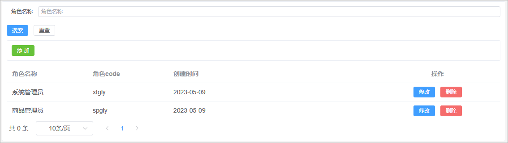  

该页面可以将其分为4部分：

1、搜索表单

2、添加按钮

3、数据展示表格

4、分页条组件


代码实现如下所示：

```java
<template>
    <div class="search-div">
        <!-- 搜索表单 -->
        <el-form label-width="70px" size="small">
            <el-form-item label="角色名称">
                <el-input
                style="width: 100%"
                placeholder="角色名称"
                ></el-input>
            </el-form-item>
            <el-row style="display:flex">
                <el-button type="primary" size="small">
                搜索
                </el-button>
                <el-button size="small">重置</el-button>
            </el-row>
        </el-form>

        <!-- 添加按钮 -->
        <div class="tools-div">
            <el-button type="success" size="small">添 加</el-button>
        </div>
        
        <!--- 角色表格数据 -->
        <el-table :data="list" style="width: 100%">
            <el-table-column prop="roleName" label="角色名称" width="180" />
            <el-table-column prop="roleCode" label="角色code" width="180" />
            <el-table-column prop="createTime" label="创建时间" />
            <el-table-column label="操作" align="center" width="280">
            <el-button type="primary" size="small">
                修改
            </el-button>
            <el-button type="danger" size="small">
                删除
            </el-button>
            </el-table-column>
        </el-table>

        <!--分页条-->
        <el-pagination
            :page-sizes="[10, 20, 50, 100]"
            layout="total, sizes, prev, pager, next"
            :total="total"
        />
  </div>

</template>

<script setup>
import { ref } from 'vue';

// 分页条总记录数
let total = ref(0)

// 定义表格数据模型
let list = ref([
    {"id":9 ,  "roleName": "系统管理员" , "roleCode":"xtgly","createTime": '2023-05-09'},
    {"id":10 , "roleName": "商品管理员" , "roleCode":"spgly","createTime": '2023-05-09'}
])

</script>

<style scoped>

.search-div {
  margin-bottom: 10px;
  padding: 10px;
  border: 1px solid #ebeef5;
  border-radius: 3px;
  background-color: #fff;
}

.tools-div {
  margin: 10px 0;
  padding: 10px;
  border: 1px solid #ebeef5;
  border-radius: 3px;
  background-color: #fff;
}

</style>
```

## 4.3 查询角色

### 4.3.1 需求说明

需求说明：

1、如果在搜索表单中输入和角色名称，那么此时就需要按照角色名称进行模糊查询

2、搜索的时候需要进行分页搜索

### 4.3.2 后端接口

#### 需求分析

1、前端提交请求参数的时候包含了两部分的参数：搜索条件参数、分页参数。搜索条件参数可以通过?拼接到请求路径后面，分页参数【当前页码、每

页显示的数据条数】可以让前端通过请求路径传递过来

2、后端查询完毕以后需要给前端返回一个分页对象，分页对象中就封装了分页相关的参数(当前页数据、总记录数、总页数...)

3、前端进行参数传递的时候，不一定会传递搜索条件，因此sql语句的编写需要使用到动态sql

#### PageHelper集成

要进行分页查询，可以使用mybatis提供的分页插件完成。在咱们的项目中集成mybatis的分页插件步骤如下所示：

1、spzx-parent工程中加入如下依赖：

```xml
<dependency>
    <groupId>com.github.pagehelper</groupId>
    <artifactId>pagehelper-spring-boot-starter</artifactId>
    <version>1.4.3</version>
</dependency>
```

2、在mybatis-config.xml配置文件中加入分页插件配置

```xml
<configuration>
    <plugins>
        <plugin interceptor="com.github.pagehelper.PageInterceptor"/>	<!-- 分页插件 -->
    </plugins>
</configuration>
```

#### SysRole

针对当前要操作的数据库表定义一个与之对应的实体类：

```java
@Data
@Schema(description = "SysRole")
public class SysRole extends BaseEntity {

    private static final long serialVersionUID = 1L;

    @Schema(description = "角色名称")
    private String roleName;

    @Schema(description = "角色编码")
    private String roleCode;

    @Schema(description = "描述")
    private String description;

}
```

#### SysRoleDto

定义一个实体类封装前端传递给后端的条件查询参数

```java
@Data
public class SysRoleDto {
    private String roleName ;
}
```

#### SysRoleController

表现层代码：

```java
@RestController
@RequestMapping(value = "/admin/system/sysRole")
public class SysRoleController {

    @Autowired
    private SysRoleService sysRoleService ;

    @GetMapping("/findByPage/{pageNum}/{pageSize}")
    public Result<PageInfo<SysRole>> findByPage(SysRoleDto sysRoleDto ,
                                                @PathVariable(value = "pageNum") Integer pageNum ,
                                                @PathVariable(value = "pageSize") Integer pageSize) {
        PageInfo<SysRole> pageInfo = sysRoleService.findByPage(sysRoleDto , pageNum , pageSize) ;
        return Result.build(pageInfo , ResultCodeEnum.SUCCESS) ;
    }
    
}
```

#### SysRoleService

业务层代码实现

```java
// 业务接口
public interface SysRoleService {
    public abstract PageInfo<SysRole> findByPage(SysRoleDto sysRoleDto, Integer pageNum, Integer pageSize);   
}

// 接口实现类
@Service
public class SysRoleServiceImpl implements SysRoleService {

    @Autowired
    private SysRoleMapper sysRoleMapper ;

    @Override
    public PageInfo<SysRole> findByPage(SysRoleDto sysRoleDto, Integer pageNum, Integer pageSize) {
        PageHelper.startPage(pageNum , pageSize) ;
        List<SysRole> sysRoleList = sysRoleMapper.findByPage(sysRoleDto) ;
        PageInfo<SysRole> pageInfo = new PageInfo(sysRoleList) ;
        return pageInfo;
    }
}
```

#### SysRoleMapper

持久层代码实现

```java
@Mapper
public interface SysRoleMapper {
    public abstract List<SysRole> findByPage(SysRoleDto sysRoleDto);
}
```

#### SysRoleMapper.xml

在映射文件中定义对应的sql语句

```xml
<?xml version="1.0" encoding="UTF-8" ?>
<!DOCTYPE mapper PUBLIC "-//mybatis.org//DTD Mapper 3.0//EN" "http://mybatis.org/dtd/mybatis-3-mapper.dtd">
<mapper namespace="com.atguigu.spzx.manager.mapper.SysRoleMapper">

    <!--  映射查询到的字段 -->
    <resultMap id="sysRoleMap" type="com.atguigu.spzx.model.entity.system.SysRole" autoMapping="true"></resultMap>

    <!-- 用于select查询公用抽取的列 -->
    <sql id="columns">
        id,role_name,role_code,description,create_time,update_time,is_deleted
    </sql>

    <sql id="findPageWhere">
        <where>
            <if test="roleName != null and roleName != ''">
                and role_name like CONCAT('%',#{roleName},'%')
            </if>
            and is_deleted = 0
        </where>
    </sql>

    <select id="findByPage" resultMap="sysRoleMap">
        select <include refid="columns" />
        from sys_role
        <include refid="findPageWhere"/>
        order by id desc
    </select>

</mapper>
```

**注意**：在BaseEntity的实体类的createTime和updateTime属性上添加**@JsonFormat**注解对日期数据进行格式化。

### 4.3.3 前端对接

#### 实现思路

如下所示：

1、定义发送请求方法

2、搜索表单绑定对应数据模型

3、onMounted钩子函数发送请求查询数据

4、分页条绑定数据模型以及对应事件

#### sysRole.js

在api目录下创建一个sysRole.js文件，文件的内容如下所示：

```java
import request from '@/utils/request'

// 分页查询角色数据
export const GetSysRoleListByPage = (pageNum , pageSize , queryDto) => {
    return request({
        url: '/admin/system/sysRole/findByPage/' + pageNum + "/" + pageSize,
        method: 'get',
        params: queryDto
    })
}
```

#### sysRole.vue

更改views/system/sysRole.vue文件

```vue
<!-- template部分修改内容 -->
<!-- 搜索表单 -->
<el-form label-width="70px" size="small">
    <el-form-item label="角色名称">
        <el-input
                  v-model="queryDto.roleName"
                  style="width: 100%"
                  placeholder="角色名称"
                  ></el-input>
    </el-form-item>
    <el-row style="display:flex">
        <el-button type="primary" size="small" @click="searchSysRole">
            搜索
        </el-button>
        <el-button size="small" @click="resetData">重置</el-button>
    </el-row>
</el-form>


<!--分页条-->
<el-pagination
               v-model:current-page="pageParams.page"
               v-model:page-size="pageParams.limit"
               :page-sizes="[10, 20, 50, 100]"
               @size-change="fetchData"
               @current-change="fetchData"
               layout="total, sizes, prev, pager, next"
               :total="total"
/>

<!-- script部分修改内容 -->
<script setup>
import { ref , onMounted } from 'vue';
import { GetSysRoleListByPage } from '@/api/sysRole';

// 分页条总记录数
let total = ref(0)

// 定义表格数据模型
let list = ref([])

//分页数据
const pageParamsForm = {
  page: 1, // 页码
  limit: 10, // 每页记录数
}
const pageParams = ref(pageParamsForm)     // 将pageParamsForm包装成支持响应式的对象

// 搜索表单数据
const queryDto = ref({"roleName": ""})

// 页面加载完毕以后请求后端接口获取数据
onMounted(() => {
    fetchData() ;
})

// 搜索按钮点击事件处理函数
const searchSysRole = () => {
    fetchData() ;
}

// 搜索按钮点击事件处理函数
const searchSysRole = () => {
    queryDto.roleName = ""
    fetchData() ;
}

// 远程调用后端分页查询接口
const fetchData = async () => {
    const {data , code , message } = await GetSysRoleListByPage(pageParams.value.page , pageParams.value.limit , queryDto) ;
    list.value = data.list ;
    total.value = data.total
}

</script>
```

## 4.4 添加角色

### 4.4.1 需求说明

当用户点击添加按钮的时候，那么此时就弹出对话框，在该对话框中需要展示添加角色表单。当用户在该表单中点击提交按钮的时候那么此时就需要将

表单进行提交，在后端需要提交过来的表单数据保存到数据库中即可。页面效果如下所示：

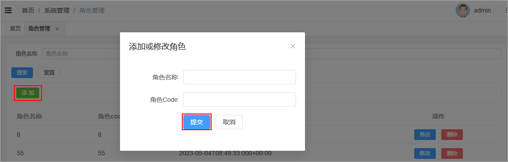 

### 4.4.2 页面制作

页面代码如下所示：

```vue
<div class="tools-div">
    <el-button type="success" size="small" @click="addShow">添 加</el-button>
</div>

<!-- 添加角色表单对话框 -->
<el-dialog v-model="dialogVisible" title="添加或修改角色" width="30%">
    <el-form label-width="120px">
        <el-form-item label="角色名称">
            <el-input />
        </el-form-item>
        <el-form-item label="角色Code">
            <el-input  />
        </el-form-item>
        <el-form-item>
            <el-button type="primary" >提交</el-button>
            <el-button @click="dialogVisible = false">取消</el-button>
        </el-form-item>
    </el-form>
</el-dialog>

<script setup>
    
// 控制对话是否展示的变量
const dialogVisible = ref(false)

//进入添加
const addShow = () => {
  dialogVisible.value = true
}
</script>
```

### 4.4.3 后端接口

后端接收到数据以后，将数据保存到数据库中即可，不要给前端返回业务数据，只需要返回对应的业务状态码即可。

#### SysRoleController

表现层代码实现

```java
// com.atguigu.spzx.manager.controller.SysRoleController
@PostMapping(value = "/saveSysRole")
public Result saveSysRole(@RequestBody SysRole SysRole) {
    sysRoleService.saveSysRole(SysRole) ;
    return Result.build(null , ResultCodeEnum.SUCCESS) ;
}
```

#### SysRoleService

业务层代码实现

```java
// com.atguigu.spzx.manager.service.impl.SysRoleServiceImpl
@Override
public void saveSysRole(SysRole sysRole) {
    sysRoleMapper.saveSysRole(sysRole) ;
}
```

#### SysRoleMapper

持久层代码实现

```java
// com.atguigu.spzx.manager.mapper.SysRoleMapper
@Mapper
public interface SysRoleMapper {
    public abstract void saveSysRole(SysRole sysRole);
}
```

#### SysRoleMapper.xml

在映射文件中定义对应的sql语句

```xml
<!-- 新增角色 -->
<insert id="saveSysRole">
    insert into sys_role (
    id,
    role_name,
    role_code,
    description
    ) values (
    #{id},
    #{roleName},
    #{roleCode},
    #{description}
    )
</insert>
```

使用postman对后端接口进行测试。

### 4.4.4 前端对接

#### 实现思路

1、给表单绑定数据模型

2、给提交按钮绑定点击事件

3、点击按钮请求后端地址

#### sysRole.js

在api目录下创建一个sysRole.js文件，文件的内容如下所示：

```java
// 添加角色请求方法
export const SavaSysRole = (data) => {
    return request({
        url: '/admin/system/sysRole/saveSysRole',
        method: 'post',
        data
    })
}
```

#### sysRole.vue

更改views/system/sysRole.vue文件

```vue
<!-- 页面表单 -->
<el-dialog v-model="dialogVisible" title="添加或修改角色" width="30%">
    <el-form label-width="120px">
        <el-form-item label="角色名称">
            <el-input v-model="sysRole.roleName"/>
        </el-form-item>
        <el-form-item label="角色Code">
            <el-input  v-model="sysRole.roleCode"/>
        </el-form-item>
        <el-form-item>
            <el-button type="primary" @click="submit">提交</el-button>
            <el-button @click="dialogVisible = false">取消</el-button>
        </el-form-item>
    </el-form>
</el-dialog>

<script setup>
import { GetSysRoleListByPage , SaveSysRole} from '@/api/sysRole';
import { ElMessage } from 'element-plus'
    
<!-- 表单数据模型 -->
const defaultForm = {
    id: "",
    roleCode: "",
    roleName: ""
}
const sysRole = ref(defaultForm)   // 使用ref包裹该对象，使用reactive不方便进行重置
 
// 添加角色
const submit = async () => {
    const { code } = await SaveSysRole(sysRole.value) ;
    if(code === 200) {
        dialogVisible.value = false
        ElMessage.success('操作成功')
        fetchData()
    }
}
</script>
```

## 4.5 修改角色

### 4.5.1 需求说明

当用户点击修改按钮的时候，那么此时就弹出对话框，在该对话框中需要将当前行所对应的角色数据在该表单页面进行展示。当用户在该表单中点击提

交按钮的时候那么此时就需要将表单进行提交，在后端需要提交过来的表单数据修改数据库中的即可。页面效果如下所示：

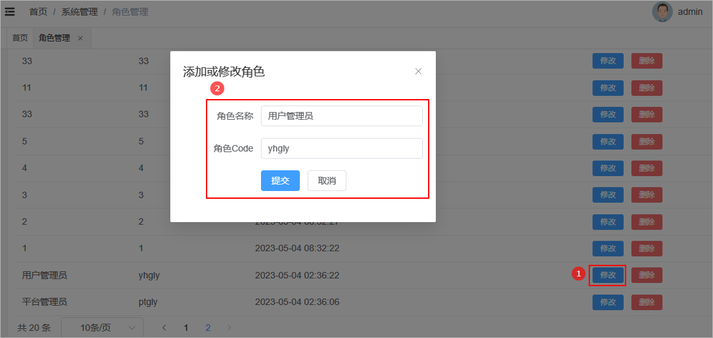 

### 4.5.2 数据回显

分析：

1、使用添加数据的表单即可

2、要将当前操作行的数据展示在表单中，那么此时需要用到插槽

代码如下所示：

```vue
<el-table-column label="操作" align="center" width="280" #default="scope">
    <el-button type="primary" size="small" @click="editShow(scope.row)">修改</el-button>
</el-table-column>

<script setup>
    // 修改按钮点击事件处理函数
    const editShow = (row) => {
        sysRole.value = row
        dialogVisible.value = true
    }
</script>
```

### 4.5.3 提交修改

#### 后端接口

##### SysRoleController

表现层代码实现

```java
// com.atguigu.spzx.manager.controller.SysRoleController
@PostMapping(value = "/updateSysRole")
public Result updateSysRole(@RequestBody SysRole sysRole) {
    sysRoleService.updateSysRole(sysRole) ;
    return Result.build(null , ResultCodeEnum.SUCCESS) ;
}
```

##### SysRoleService

业务层代码实现

```java
// com.atguigu.spzx.manager.service.impl.SysRoleServiceImpl
@Override
public void updateSysRole(SysRole sysRole) {
    sysRoleMapper.updateSysRole(sysRole) ;
}
```

##### SysRoleMapper

持久层代码实现

```java
// com.atguigu.spzx.manager.mapper.SysRoleMapper
@Mapper
public interface SysRoleMapper {
    public abstract void updateSysRole(SysRole sysRole);
}
```

##### SysRoleMapper.xml

在映射文件中定义对应的sql语句

```xml
<!-- 修改角色 -->
<update id="updateSysRole">
    update sys_role set
    <if test="roleName != null and roleName != ''">
        role_name = #{roleName},
    </if>
    <if test="roleCode != null and roleCode != ''">
        role_code = #{roleCode},
    </if>
    <if test="description != null and description != ''">
        description = #{description},
    </if>
    update_time =  now()
    where
    id = #{id}
</update>
```

#### 前端对接

##### sysRole.js

在api目录下创建一个sysRole.js文件，文件的内容如下所示：

```javascript
// 保存修改
export const UpdateSysRole = (data) => {
    return request({
        url: '/admin/system/sysRole/updateSysRole',
        method: 'put',
        data
    })
}
```

##### sysRole.vue

更改views/system/sysRole.vue文件

```vue
<script setup>
import { GetSysRoleListByPage , SaveSysRole , UpdateSysRole} from '@/api/sysRole';
    
// 添加角色
const submit = async () => {
    if(!sysRole.value.id) {
        const { code } = await SaveSysRole(sysRole.value) ;
        if(code === 200) {
            dialogVisible.value = false
            ElMessage.success('操作成功')
            fetchData()
        }
    }else {
        const { code } = await UpdateSysRole(sysRole.value) ;
        if(code === 200) {
            dialogVisible.value = false
            ElMessage.success('操作成功')
            fetchData()
        }
    }
}
</script>
```

## 4.6 删除角色

### 4.6.1 需求说明

当点击删除按钮的时候此时需要弹出一个提示框，询问是否需要删除数据？如果用户点击是，那么此时向后端发送请求传递id参数，后端接收id参数进

行逻辑删除。页面效果如下所示：

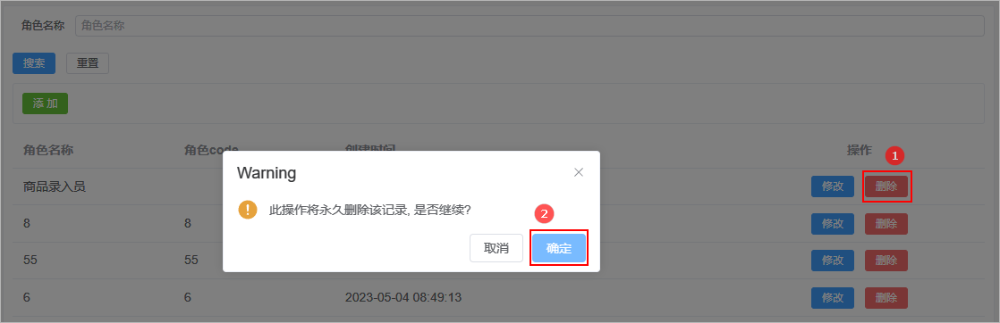 

### 4.6.2 后端接口

#### SysRoleController

表现层代码实现

```java
// com.atguigu.spzx.manager.controller.SysRoleController
@DeleteMapping(value = "/deleteById/{roleId}")
public Result deleteById(@PathVariable(value = "roleId") Long roleId) {
    sysRoleService.deleteById(roleId) ;
    return Result.build(null , ResultCodeEnum.SUCCESS) ;
}
```

#### SysRoleService

业务层代码实现

```java
// com.atguigu.spzx.manager.service.impl.SysRoleServiceImpl
@Override
public void deleteById(Long roleId) {
    sysRoleMapper.deleteById(roleId) ;
}
```

#### SysRoleMapper

持久层代码实现

```java
// com.atguigu.spzx.manager.mapper.SysRoleMapper
@Mapper
public interface SysRoleMapper {
    public abstract void deleteById(Long roleId);
}
```

#### SysRoleMapper.xml

在映射文件中定义对应的sql语句

```xml
<!-- 根据id删除角色数据 -->
<delete id="deleteById">
    update sys_role set id_delete = 0 where id = #{value}
</delete>
```

### 4.6.3 前端对接

#### sysRole.js

在api目录下创建一个sysRole.js文件，文件的内容如下所示：

```java
// 删除角色
export const DeleteSysRoleById = (roleId) => {
    return request({
        url: '/admin/system/sysRole/deleteById/' + roleId,
        method: 'delete'
    })
}
```

#### sysRole.vue

更改views/system/sysRole.vue文件

```vue
<el-table-column label="操作" align="center" width="280" #default="scope">
    <el-button type="danger" size="small" @click="deleteById(scope.row)">
        删除
    </el-button>
</el-table-column>

<script setup>
import { GetSysRoleListByPage , SaveSysRole , UpdateSysRole , DeleteSysRoleById } from '@/api/sysRole';
import { ElMessage, ElMessageBox } from 'element-plus'

// 删除数据
const deleteById = (row) => {
    ElMessageBox.confirm('此操作将永久删除该记录, 是否继续?', 'Warning', {
        confirmButtonText: '确定',
        cancelButtonText: '取消',
        type: 'warning',
    }).then(async () => {
       const {code } = await DeleteSysRoleById(row.id)
       if(code === 200) {
            ElMessage.success('删除成功')
            fetchData()
       }
    }).catch(() => {
        ElMessage.info('取消删除')
    })
}
</script>
```

